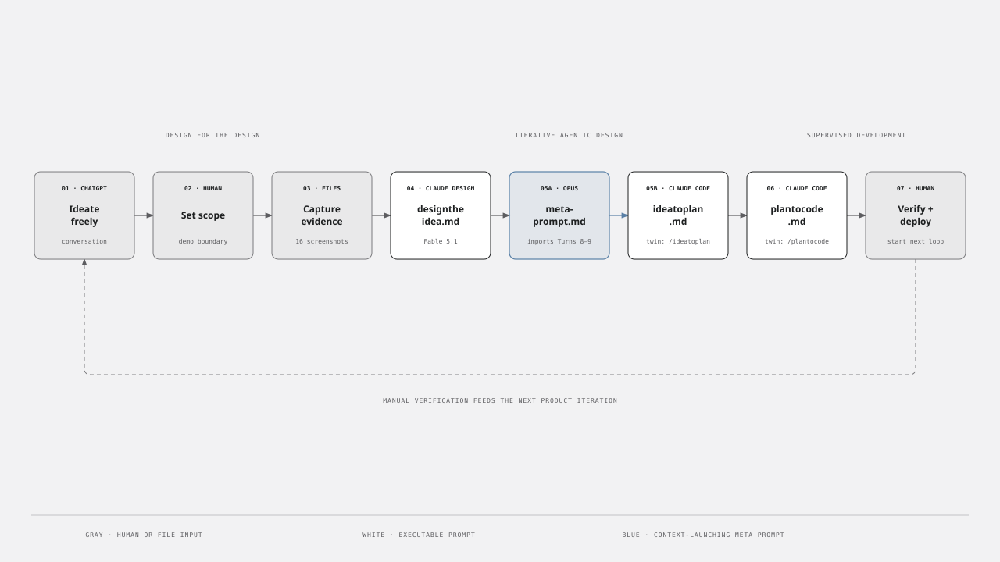
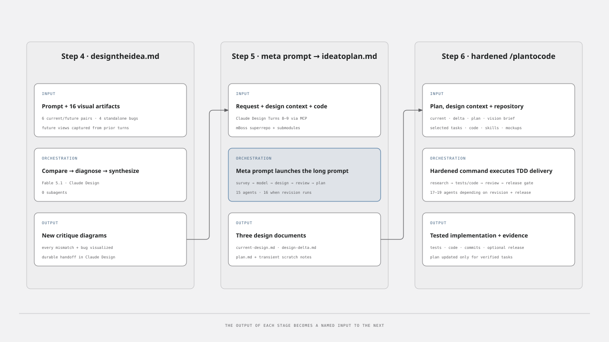
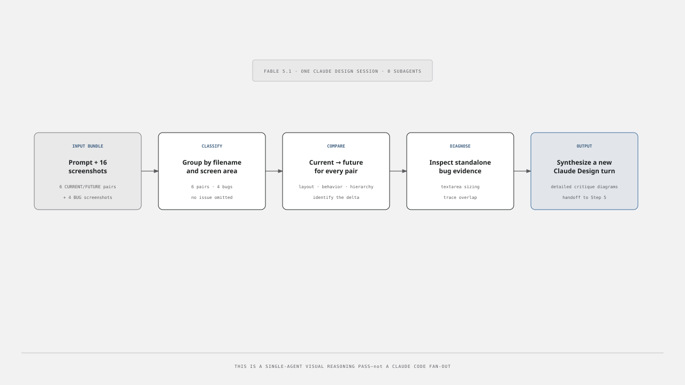
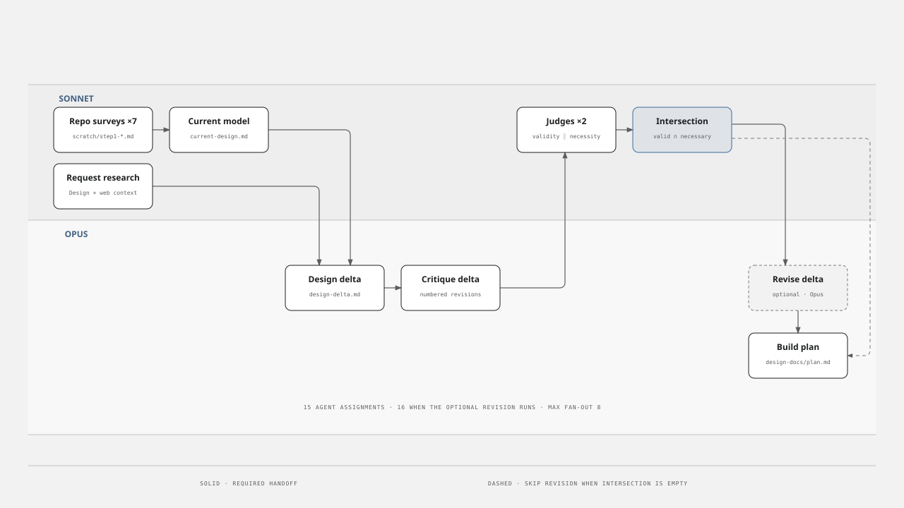
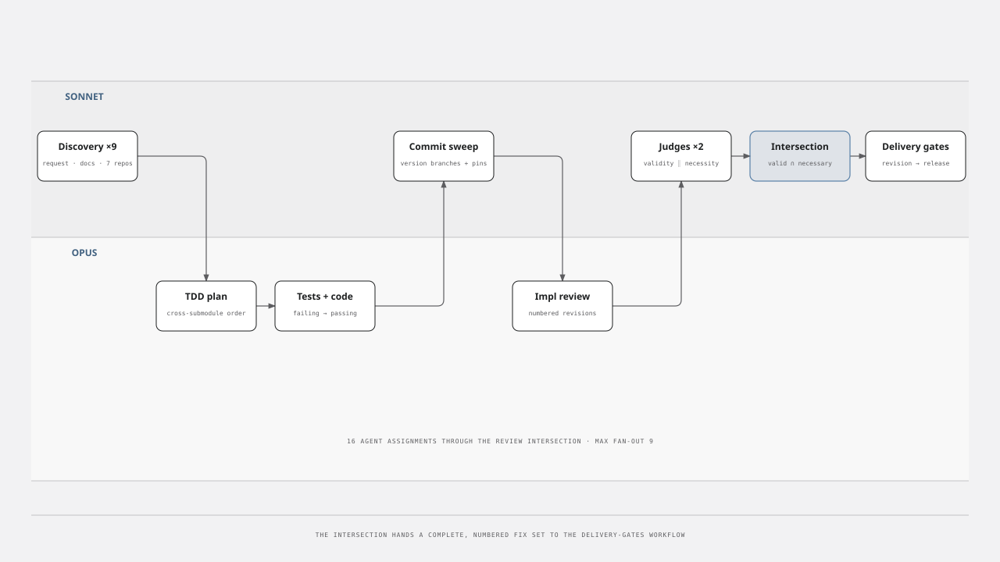
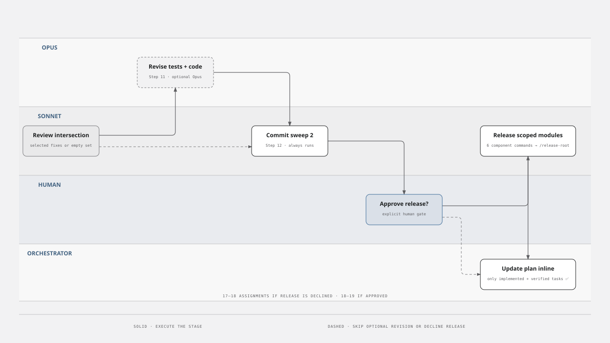
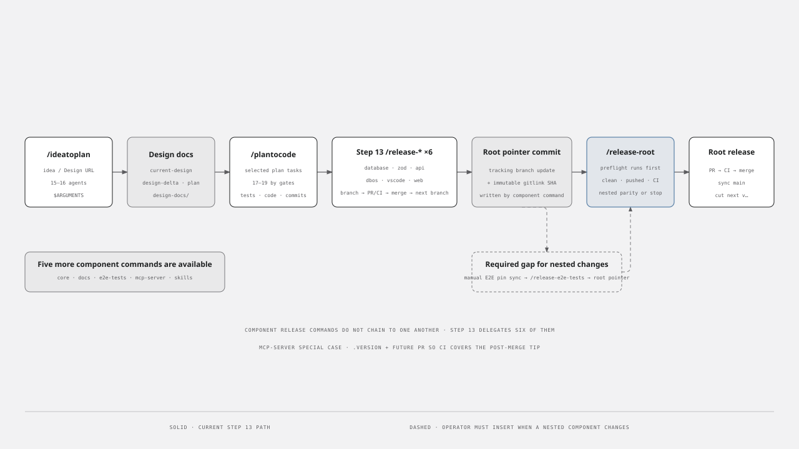
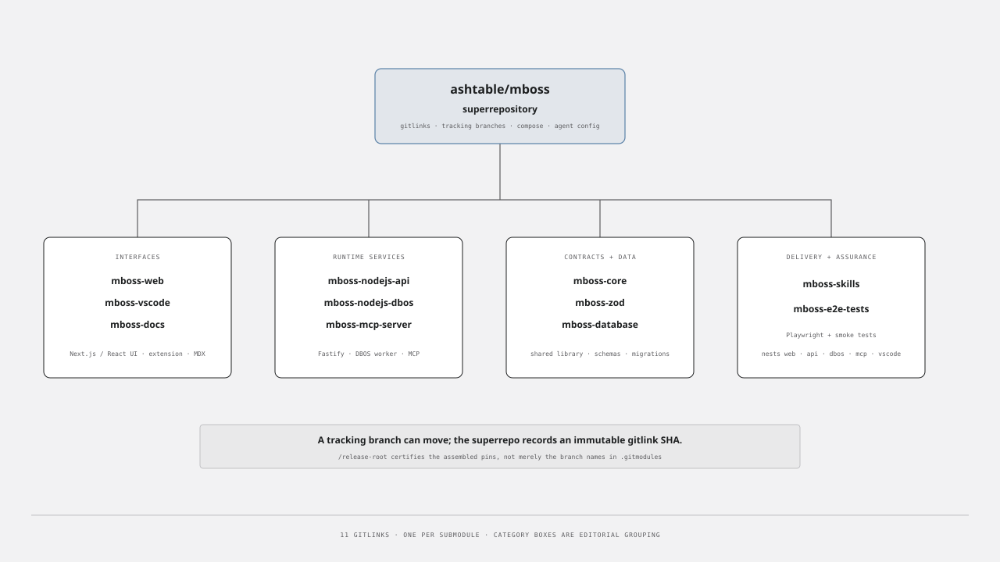

# Agentic Development Demo

Companion repository for a YouTube walkthrough of an end-to-end agentic development workflow: turn product evidence into a design, turn the design into an implementation plan, and turn the plan into tested, released code.

The narration lives in the [demo script](DEMO-SCRIPT.md). The application being changed is the separate [mBoss superrepository](https://github.com/ashtable/mboss).

For screen sharing, open the [16:9 presentation deck](DEMO-SLIDES.html) in a browser. Use the arrow keys to navigate, `F` for fullscreen, or `P` to print to PDF.

## TL;DR

- **Design the right change.** Screenshots of the current UI, target UI, and known bugs are analyzed in Claude Design before coding begins.
- **Make the context durable.** A Step 5 meta prompt imports the relevant Claude Design turns and launches the long `ideatoplan.md` prompt, which uses 15–16 specialist assignments to produce `current-design.md`, `design-delta.md`, and `plan.md`.
- **Implement with explicit gates.** `/plantocode` defines 18–19 assignments through release (17–18 when release is declined) to research, plan tests, implement, review, revise, commit, and deliver.
- **Treat the repository graph as part of the product.** mBoss is a superrepo containing 11 independently versioned git submodules. Releases advance exact gitlinks and certify the assembled root—not merely each component in isolation.
- **Human supervision stays load-bearing.** Scope selection, review of generated artifacts, release confirmation, manual testing, and deployment remain explicit checkpoints.

[](docs/diagrams/demo-prompt-order.svg)

## How the prompts fit together

The demo has three phases:

1. **Design for the design:** ideate, set scope, capture evidence, then run [`designtheidea.md`](prompts/step-4/designtheidea.md) in Claude Design.
2. **Iterative agentic design:** paste [`meta-prompt.md`](prompts/step-5/meta-prompt.md) into Claude Code. It imports Claude Design Turns 8–9 through MCP and launches [`ideatoplan.md`](prompts/step-5/ideatoplan.md) through dynamic workflows.
3. **Supervised agentic development:** run the plan-to-code workflow against selected tasks, inspect its evidence, approve release, test the result, and begin the next iteration.

The `prompts/` files are the portable long-form prompt sources. The versions in [`.claude/commands/`](.claude/commands/) are hardened executable counterparts with explicit arguments, parallelism, scratch-file contracts, safety gates, and reporting. The Step 5 meta prompt launches the long prompt, not the slash command; the detailed orchestration diagrams use the hardened command versions where the source leaves execution mechanics implicit.

> [!NOTE]
> `prompts/step-5/meta-prompt.md` names `@prompts/ideatoplan.md`, its destination inside the demo checkout; this companion repository organizes the source under `prompts/step-5/`. Step 6 currently includes the long prompt directly—there is no separate Step 6 meta-prompt in this repository.

### Follow the demo

1. In Claude Design, attach the 16 files from [`step-4-input/`](step-4-input/) and run [`designtheidea.md`](prompts/step-4/designtheidea.md).
2. From the mBoss root in Claude Code, paste [`meta-prompt.md`](prompts/step-5/meta-prompt.md) with the design context. Review the three generated documents before selecting work.
3. Run `/plantocode <selected tasks and design URLs>` when the hardened command is installed, or paste the portable [`plantocode.md`](prompts/step-6/plantocode.md). Supervise test evidence, commits, and the release gate.

For readers new to this style of Claude Code workflow: a **meta prompt** imports context and launches another prompt; a **slash command** is a repository-installed executable prompt; an **assignment** is one delegated subagent run; and `scratch/` is the agents' temporary message bus.

## Inputs and outputs

Each stage exchanges named artifacts rather than relying on chat history alone. `scratch/` is a transient message bus between subagents; `design-docs/` contains named local artifacts, while tests, code, commits, and releases carry the work forward.

[](docs/diagrams/long-prompt-io.svg)

## What each long prompt orchestrates

### Step 4: turn visual evidence into a design critique

[`prompts/step-4/designtheidea.md`](prompts/step-4/designtheidea.md) runs as one Fable 5.1 session in Claude Design. It compares six `CURRENT-*`/`FUTURE-*` pairs and inspects four standalone `BUG-*` screenshots. There is no subagent fan-out at this stage.

[](docs/diagrams/designtheidea-orchestration.svg)

### Step 5: turn the idea into design documents and a plan

The hardened [`/ideatoplan`](.claude/commands/ideatoplan.md) counterpart starts with eight Sonnet agents in parallel: seven repository surveys and one request/design research pass. Sonnet merges the surveys into the current-system model; Opus synthesizes the design delta, critiques it, and later writes the final plan. Two Sonnet judges independently test proposed revisions for validity and necessity; only their intersection is eligible for the optional Opus revision pass.

[](docs/diagrams/ideatoplan-orchestration.svg)

### Step 6: turn the plan into tested and released code

The hardened [`/plantocode`](.claude/commands/plantocode.md) counterpart begins with nine parallel Sonnet assignments covering the request, design documents, and seven code locations. Opus owns TDD planning, implementation, and deep review. Sonnet owns independent review judgments and commit/push sweeps. The revision branch runs once when needed; it is not an open-ended autonomous loop.

[](docs/diagrams/plantocode-orchestration.svg)

The second half preserves the gates that are easy to lose in a summary: the Step 12 Sonnet sweep always runs, human approval happens before a release agent is launched, declining release is a valid path, and Step 14 updates only tasks that were both implemented and verified.

[](docs/diagrams/plantocode-delivery-gates.svg)

## Slash commands in the real mBoss repository

The 12 release commands checked into this repository match the files currently on `ashtable/mboss@main`. Eleven component commands follow the same core protocol:

`version branch → commit/push → PR → CI → merge → next version branch → parent gitlink update`

`/plantocode` Step 13 directly releases six scoped implementation repositories—database, Zod, API, DBOS, VS Code, and web—then invokes `/release-root`. The other five component commands remain available for manual or separately orchestrated releases. `/release-mcp-server` adds a `.version` stamp and opens the future branch PR so CI covers that exact tip. `/release-root` runs preflight first and rejects dirty or unpushed submodules, missing CI evidence, and mismatched nested E2E pins.

> [!IMPORTANT]
> As currently authored, Step 13 does not synchronize the nested pins in `mboss-e2e-tests`. If web, API, DBOS, MCP server, or VS Code changes, an operator must update the nested pins and run `/release-e2e-tests` before `/release-root`; otherwise root preflight will stop the release.

[](docs/diagrams/slash-command-release-flow.svg)

These commands perform real GitHub writes. `/plantocode` requires confirmation before its release phase; inspect every branch, commit ledger, and planned release before approving it.

## The mBoss superrepository

[mBoss](https://github.com/ashtable/mboss) is the integration boundary for the demo. Its root tracks 11 submodules and houses the local Docker Compose topology, agent configuration, prompts, design documents, and release preflight scripts.

[](docs/diagrams/mboss-superrepo.svg)

A submodule has two relevant identities: `.gitmodules` names the intended tracking branch, while the root tree records an immutable gitlink SHA. The release workflow advances and validates those exact SHAs. `mboss-e2e-tests` also nests `mboss-web`, `mboss-nodejs-api`, `mboss-nodejs-dbos`, `mboss-mcp-server`, and `mboss-vscode`; root preflight checks that the nested and root pins agree.

Clone the target repository with its complete graph:

```sh
git clone --recurse-submodules https://github.com/ashtable/mboss.git
cd mboss
git submodule update --init --recursive
```

Run the slash commands with the mBoss root as the current working directory. They use relative `git -C mboss-*` paths and currently assume that root is `/Users/ash/code/mboss`; update the hard-coded paths before reusing them elsewhere.

## Repository map

```text
.claude/agents/       Custom Fable, Sonnet, and Opus engineer profiles
.claude/commands/     Executable design, implementation, and release workflows
DEMO-SCRIPT.md        Narration and recording sequence
DEMO-SLIDES.html      Screen-share deck with keyboard and print controls
docs/diagrams/        Branded HTML diagram sources and README-ready SVG exports
prompts/step-4/       Visual evidence → concrete design critique
prompts/step-5/       Claude Design import wrapper + idea-to-plan prompt
prompts/step-6/       Plan-to-code prompt
step-4-input/         CURRENT, FUTURE, and BUG screenshots
step-*-output/        Generated artifacts captured during the demo
```

The diagrams use the visual language from [mboss.dev](https://mboss.dev). Each SVG has a self-contained HTML source with the same basename in [`docs/diagrams/`](docs/diagrams/).

## License

This repository is licensed under the [MIT License](LICENSE).
