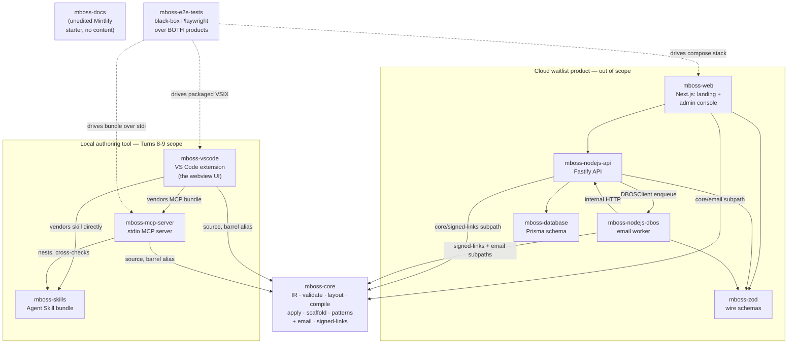
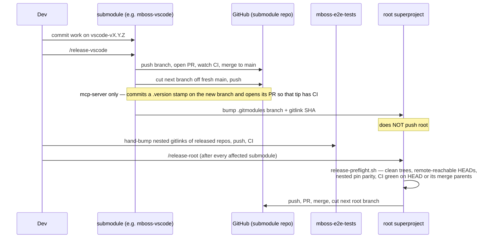
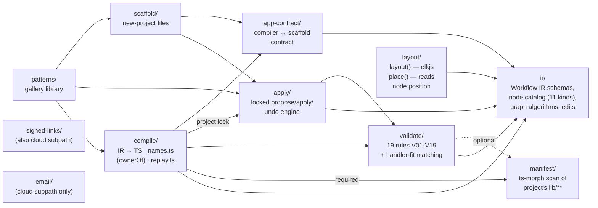
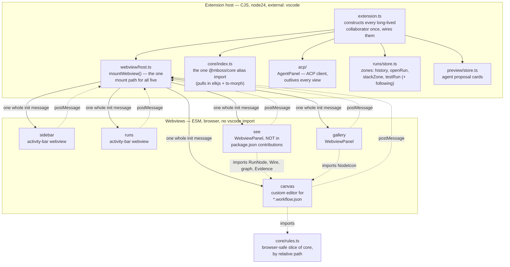
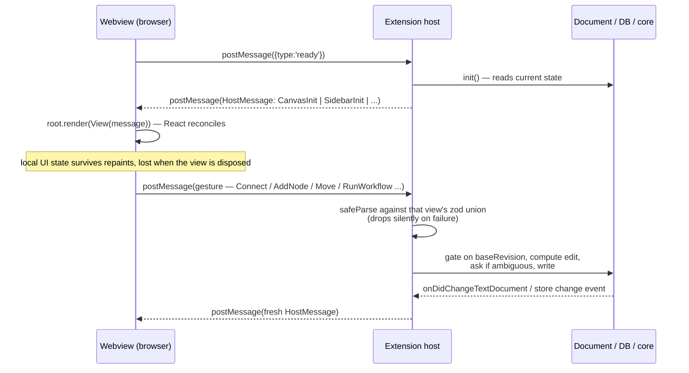
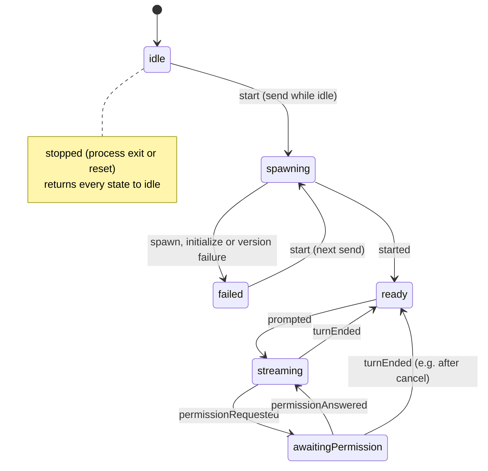
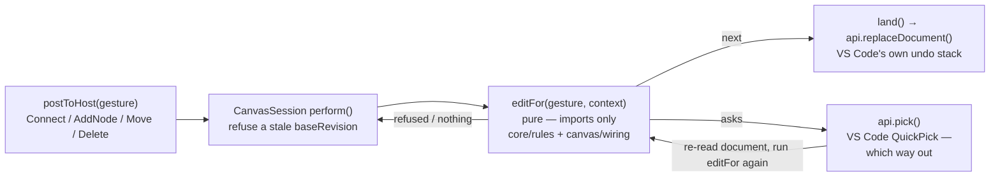
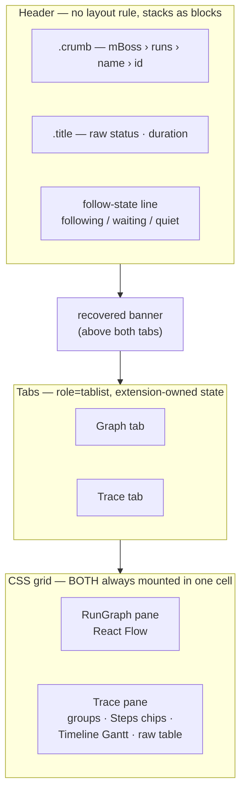
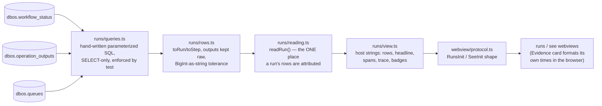
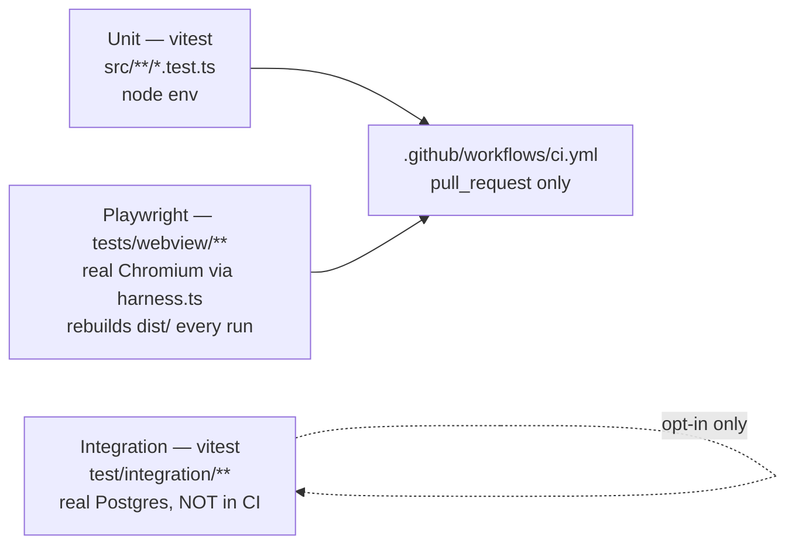

# mBoss — current design

**Refreshed 2026-09-13** (mboss-vscode only; read-only git against
`a459c89..9c6f0db`, cross-checked with
`scratch/t89/delta-reconcile.md`). mboss-vscode merged `vscode-v0.0.7`
to `main` (PR #7, Marketplace publishing prep: new publisher casing,
the `0.0.7` version stamp, a manifest `icon`, a rewritten README and
screenshot, and a new `CONTRIBUTING.md`); root has not released it yet,
so its committed gitlink and `.gitmodules` label still read
`a459c89`/`vscode-v0.0.6`, and `vscode-v0.0.8` has not been cut. The
four v0.0.7 commits touched exactly nine files and no other citation
in this doc moved. Updated below: the baseline paragraph just under
this note; §2's two pin-state paragraphs; three `package.json` line
citations shifted by the new manifest `icon` key (§6.1); §8's e2e
nested-pin note. Nothing else changed.

Written for the ideatoplan round scoped to Claude Design Turns 8-9
(implementation audit + corrected screens for the mboss-vscode
webview). Covers the whole superproject as it exists today; depth is
weighted toward what Turns 8-9 will change.

Code state described (re-checked in a Step 2 verification pass on
2026-09-12, then refreshed 2026-09-13 for mboss-vscode only — see the
note above): root `v0.0.36` @ `7895677`; mboss-vscode `9c6f0db`
(`vscode-v0.0.7`, merged 2026-09-13; root's committed gitlink and
`.gitmodules` label still read `a459c89`/`vscode-v0.0.6` until the
in-progress `/release-vscode` completes, and `vscode-v0.0.8` has not
been cut — §2); mboss-core `aec2035` (`core-v0.0.11`); mboss-mcp-server
`e9cf799` (`mcp-server-v0.0.6`); mboss-skills `6e37ce9`;
mboss-e2e-tests `f4c8142` (`e2e-tests-v0.0.12`, still nesting
mboss-vscode at `a459c89` — §8). file:line citations are given for
load-bearing claims, and every mboss-vscode citation below is
`9c6f0db`'s (the four v0.0.7 commits touched only nine files, so every
other citation in this doc reads the same at either commit). A claim
marked **(unverified)** could not be confirmed from source and is kept
only because it matters to a design decision. mboss-vscode paths are
relative to `mboss-vscode/` unless another repo is named.

## 1. What mBoss is, in one picture

mBoss is two products sharing one superproject and one `@mboss/core`
library:

**mboss-core is shared by both products.** The authoring tool embeds
the whole barrel; the three cloud services nest mboss-core and alias
only two subpaths: `@mboss/core/email` (`mboss-web/tsconfig.json:26`,
`mboss-nodejs-dbos/tsconfig.json:18`) and `@mboss/core/signed-links`
(`mboss-nodejs-api/tsconfig.json:17`, `mboss-nodejs-dbos/tsconfig.json:17`).
What *is* true: the cloud repos never touch mboss-vscode, the MCP
server or the skill, and `@mboss/zod`/`@mboss/database` are used only
by the five cloud repos. Turns 8-9 touch **only** the authoring tool,
almost entirely inside `mboss-vscode`. The cloud repos pin their own
nested mboss-core and consume only `email` and `signed-links`, so a
core change outside those subpaths does not affect them. `mboss-docs`
is an unmodified Mintlify starter.

The api enqueues into the worker's DBOS schema with a `DBOSClient`
(`mboss-nodejs-api/src/enqueue/dbos-enqueuer.ts`); the worker calls
the api's `/internal/v1/*` routes (`mboss-nodejs-dbos/src/api/internal-client.ts`).

## 2. Release and branch workflow

The root superproject has no application source — eleven submodules,
`docker-compose.yml` (the cloud product's local stack, also the
Postgres mboss-vscode's integration suite uses), `scripts/`
(`release-preflight.sh`, its fixture-driven verifier
`verify-release-preflight.sh`), `.claude/` release commands, the
`ideatoplan`/`plantocode` pipeline, plus `prompts/`, `.codex/`,
`.agents/` and `skills-lock.json`. Convention: `.gitmodules` names each
submodule's current `*-vX.Y.Z` branch, never `main`.

**Current pin state.** Root's gitlinks equal every checked-out HEAD
for core/mcp-server/skills/e2e-tests (`git submodule status` shows no
`+` for those four). **mboss-vscode is now the exception, mid-release**:
its `main` advanced to `vscode-v0.0.7` (`9c6f0db`, PR #7, 2026-09-13)
after this doc's 2026-09-12 baseline, but root's committed gitlink and
`.gitmodules` label were not moved — `git submodule status` shows a
`+` for `mboss-vscode`, and root still pins `a459c89`
(`vscode-v0.0.6`) until the in-progress `/release-vscode` completes.
The other pins were moved for core/vscode/mcp-server/e2e-tests by a
hand-written root commit, `08507cf` "Release the repaired proposal
approval stack" (2026-09-08), which did not touch `.gitmodules`. So
besides vscode's pending pin, only the **branch labels** are stale:
`.gitmodules:24,28,32,40` still say `vscode-v0.0.5`, `core-v0.0.10`,
`mcp-server-v0.0.5`, `e2e-tests-v0.0.11`, while the checkouts read
`core-v0.0.11`, `mcp-server-v0.0.6`, `e2e-tests-v0.0.12` (mboss-vscode
will read `vscode-v0.0.7` once its pin lands). Skills' label
(`skills-v0.0.4`) is already current.

**No open version branch exists to work on.** In core, mcp-server and
e2e-tests, `HEAD == origin/main` (merge commits of PRs #11/#7/#12), and
no `core-v0.0.12`, `mcp-server-v0.0.7` or `e2e-tests-v0.0.13` branch
exists locally or in fetched remote refs. mboss-vscode is also on
`main` now (PR #7, `9c6f0db`), and no `vscode-v0.0.8` branch exists
either. A Turn 8-9 plan must cut new branches first (and re-label
root's `.gitmodules`); `/release-<repo>` on an already-merged branch
would try to open an empty PR.

`scripts/release-preflight.sh` (304 lines, POSIX `sh`) is the only
gate before `/release-root` — root has no CI of its own. Checks: every
submodule clean and pushed; every HEAD reachable on its own remote;
**pin parity** (each SHA `mboss-e2e-tests` nests must equal the SHA
root is about to pin; it reads only `mboss-e2e-tests/.gitmodules`);
**CI green on HEAD or, for a merge commit, on one of its parents** —
nothing further back counts (`release-preflight.sh:149-154,226-234`).
It reads only the workflow named `CI`, last 20 runs
(`:156,194-195`), and skips a submodule whose released commit has no
`.github/workflows/ci.yml` (`:176-182`; mboss-docs has none).
`/release-mcp-server`'s `.version`-stamp commit used to leave its new
branch tip uncovered; step 8 of that command now opens the new
branch's PR (root commit `89fd515`, 2026-09-05), so it is a gap only
if step 8 is skipped.

Nested pins not covered by any gate: mboss-vscode and mboss-mcp-server
each nest mboss-core (and skills; vscode also nests mcp-server). Their
gitlinks currently equal root's (skills `5025a04` nested vs `6e37ce9`
at root, tree-identical — `git diff 5025a04 6e37ce9` is empty), but
their `.gitmodules` labels are stale (`mboss-vscode/.gitmodules`:
`core-v0.0.7`, `mcp-server-v0.0.2`, `skills-v0.0.1`;
`mboss-mcp-server/.gitmodules`: `core-v0.0.7`, `skills-v0.0.1`), and
`mboss-vscode/src/pins.test.ts:25-58` asserts those stale labels
verbatim. A core change for Turns 8-9 must be hand-bumped into both
nested copies and e2e's nested mboss-vscode/mboss-mcp-server.

## 3. mboss-core — the shared compiler/IR engine

`@mboss/core` has no build step and no `exports` map; `src/index.ts`
is `main`. mboss-vscode's host build and mboss-mcp-server alias that
barrel. mboss-vscode's webview bundles instead reach past it by
relative path through one file, `mboss-vscode/src/core/rules.ts` (ir,
`validateWorkflow` and handler-fit, layout metrics, manifest types,
`compile/names`, `app-contract/layout`). The cloud repos alias
the `email` and `signed-links` subpaths only; `email` is not in the
barrel (`src/index.ts:1-10` exports signed-links, ir, validate, layout,
manifest, apply, app-contract, compile, scaffold, patterns).

Arrows point from a module to what it imports:

`signed-links` and `email` import nothing from the rest of core. The
scaffold's generated app carries its own `scaffold/app/email/`, not
`src/email`. mboss-vscode's build copies `src/patterns/library` for
the gallery (`mboss-vscode/src/build.ts:99`).

**Node catalog** — `NodeKindSchema` (`src/ir/catalog.ts:21-33`) is
**eleven** literals: `trigger, step, transaction, apiCall, branch,
loop, durableWait, approval, emailSend, codeStep, queue` (`queue` added
in `d335daa`). `mboss-core/CONTEXT.md`'s "kind" glossary entry still
says "ten … queues are not kinds" and claims `NODE_PALETTE` is the only
place a label is written — both stale. `NODE_PALETTE`
(`catalog.ts:445-457`) decides kinds, groups and order within a group;
the canvas's words are a localized copy (§6.6):

| kind | label | group |
|---|---|---|
| `trigger` | Trigger | `start` |
| `step` | Step | `work` |
| `transaction` | Transaction | `work` |
| `apiCall` | API call | `work` |
| `codeStep` | Code step | `work` |
| `queue` | Queue | `work` |
| `branch` | Branch | `control` |
| `loop` | Loop | `control` |
| `durableWait` | Wait | `control` |
| `approval` | Approval | `people` |
| `emailSend` | Email | `people` |

Every node is `NodeBase` (`src/ir/types.ts:100-110`) plus a
kind-specific `config`. Shared fields: `id`, `title`, `in?`/`out?`
(a code-behind type name), `guard?`, `forEach?` (not legal on `queue`,
`catalog.ts:375`), `retry?` (`{maxAttempts, intervalSeconds,
backoffRate}`, defaults `3/1/2` — **a node with no explicit `retry`
still retries**; the compiler emits `retriesAllowed:false` only when
the *effective* `maxAttempts===1`), `handler?: {export}` (only
`HANDLER_KINDS = step, transaction, apiCall, codeStep, branch, queue`,
`src/validate/handler-fit.ts:77-84`), and `position?: {x,y}`
(`types.ts:89-92,109`). `in`/`out` are checked against the handler
(`handler-fit.ts:225,242`; queue uses `itemType`) and against wires
(`rules.ts:406-437`); a trigger's `out` is the workflow payload type
(V19, `rules.ts:163-190`; `compile/emit-linear.ts:462-468`). Kinds
with no handler (trigger, loop, durableWait, approval, emailSend) can
declare types nowhere but `in`/`out`.

**Positions** are already written by the canvas: the first hand move
pins every node, and Arrange writes `withoutPositions`
(`mboss-vscode/src/canvas/edits.ts`). `place()`
(`src/layout/index.ts:99-124`) only reads them — it runs ELK when no
node has a position and stacks unpositioned nodes below the rest.
`carryPositions`/`withoutPositions` (`src/ir/edit.ts:526,556`) keep an
agent's spec-only edit from dropping positions and keep a drag from
counting as a document change in a proposal diff.

**Validation** (`src/validate/index.ts`) is pure and synchronous; the
canvas calls it per candidate wire during a drag. "Safe on every drag
frame" has no benchmark behind it **(unverified)**. `Diagnostic =
{code, severity, message, nodeId?, edgeId?}`. `validateWorkflow`
returns findings **in `RULES` order, not code order** — V15 runs
between V11 and V12 (`rules.ts:1466-1486`). Two refusal channels a UI
must handle: coded `Diagnostic`s and code-less `UnsupportedIR`.
`CompileResult` is `ok | CANNOT_COMPILE{diagnostics} |
UNSUPPORTED{nodeId?, message}` (`src/compile/compile.ts:57-60`), so an
unsupported refusal can be drawn on a block. `canCompile` is stricter
than the edit gate: exactly one trigger and no V07
(`validate/index.ts:66-77`). The IR can carry a `nodeId` per finding,
but **no canvas node draws a diagnostic today** (§6.6).

**Queue partitioning has no IR toggle.** A queue is partitioned when
any of `queue.partitionConcurrency`, `partitionWorkerConcurrency` or
`partitionRateLimit` is set (`isPartitioned`, module-private,
`rules.ts:1228-1234`). V17 (`rules.ts:1256-1300`) raises three errors:
partitioned with no `enqueue.partitionPath`; partitioned with a
`deduplicationPath`; a `partitionPath` with no partition limit. Both
policy schemas are `z.strictObject` (`catalog.ts:306-334`).

**Compile/replay** is two files with different reach:

- `src/compile/names.ts` (538 lines) imports nothing, so browser
  bundles carry it (mboss-vscode re-exports it through
  `src/core/rules.ts`). `ownerOf(name): Owner` never throws
  (`{kind:'node'|'sdk'|'unknown'}`). A row is SDK-owned when its name
  **starts with `DBOS.` or** is in `SDK_OPERATIONS`
  (`names.ts:352,423`) — the set lists `DBOS.send/recv/setEvent/
  getEvent/sleep/getResult/writeStream/closeStream/readStream/
  readStreamOffset` plus unprefixed `getStatus`. Filtering on
  `SDK_OPERATIONS.has` alone misses other `DBOS.`-prefixed rows.
- `src/compile/replay.ts` (1034 lines) imports ir, `emit-linear` and
  `plan`, so it is **host-only** in mboss-vscode. It holds
  `replayBoundaries(ir, rows)` → `{offered, unoffered}` with four
  reasons a row has no button: `sdk-owned`, `parked-here` (checked
  first), `inside-wait` (`.clear`/`.resend.N`), `link-scoped`
  (`.register` rows, carrying `instead: nodeId`). It also holds
  `traceGrammar`/`matchTrace`, which **mboss-vscode's live replay flow
  calls**: `decideReplay` refuses with `structure-changed` when the
  recorded rows no longer match the current document
  (`mboss-vscode/src/runs/replayZone.ts:262-270,712-734`). Whether
  `replayBoundaries`' run-level offer is what Turn 9d calls "Replay
  from start" **(unverified)**: no "from start" string exists; the copy
  is `'Replay from {0}?'` / `'Replay run {0}?'`
  (`mboss-vscode/src/messages.ts:729,733`).
- A child-workflow start row in the parent's `operation_outputs` has
  `function_name` = the child's name, `child_workflow_id` set,
  `output`/`error` `NULL` — it reads as a zero-output success unless a
  reader checks `child_workflow_id`. This matches DBOS SDK 4.27.6's own
  source comment (`@dbos-inc/dbos-sdk/dist/src/system_database.js`)
  and mboss-vscode's `BLOCK_CHILDREN` join, but no mBoss test asserts
  it, and a project may run another SDK version **(unverified beyond
  4.27.6)**.

**Apply** (`src/apply/`) is a complete propose/apply/undo engine.
`applySpec`, `proposeSpec`, `applyProposal`, `undo` and
`compileProject` take the cross-process lock at `.mboss/.lock`
(`apply/index.ts:156,190,246,293`, `compile.ts:250`); `readWorkflow`
takes none (`apply/index.ts:125-141`). `ApplyError` is a closed 7-code
set returned as data (`NOT_AN_MBOSS_PROJECT`, `WORKFLOW_NOT_FOUND`,
`REVISION_CONFLICT{expected,actual}`, `VALIDATION_FAILED{errors}`,
`PROPOSAL_NOT_FOUND`, `PROPOSAL_STALE{baseRevision,currentRevision}`,
`NOTHING_TO_UNDO{name}`; `apply/errors.ts:20-31`). Proposal facts:

- `ProposalStatus` is `proposed | applied | discarded`
  (`apply/proposal.ts:67-71`). "Stale" is never stored; it surfaces as
  `PROPOSAL_STALE` on apply.
- One live proposal per workflow (`supersede`, `apply/index.ts:221,583-589`).
- `DiffSummary` counts nodes added/removed/changed and edges
  added/removed only — no line +/− (`apply/diff.ts:22-28`).
- `undo` reverts the most recent apply of that workflow and gives the
  restored document the *next* revision; snapshots cap at
  `HISTORY_LIMIT = 20` (`apply/history.ts:29`).

## 4. mboss-mcp-server — the agent-facing surface

A stdio MCP server (`@modelcontextprotocol/server` v2) that a project
vendors as one bundled file. Eleven tools in **two** groups
(`src/registry.ts`): workflow tools (`workflow_get/create/apply_spec/
validate/scaffold_step/rename_node/delete_node`), then project tools
(`project_build/test/debug/deploy`). Every tool answers with
`structuredContent` and text. A tool's `name` uses underscores; its
`title` is the dotted form "people read — and the form the canvas
shows" (`registry.ts:23-28`), e.g. `workflow.apply_spec`.

`project_debug` (`src/tools/project-debug.ts`, `src/debug/queries.ts`)
reads a project's DBOS tables with plain `pg`. Its selection is
narrower than Turns 8-9's screens:

- `RUN_COLUMNS` = `workflow_uuid, name, status, recovery_attempts,
  created_at, completed_at` — **no `executor_id`,
  `application_version`, or input column.**
- `stepsQuery` selects `function_id, function_name,
  started_at_epoch_ms, completed_at_epoch_ms, error,
  child_workflow_id` — **no `output`.**
- `Input = {runId?, limit}` — **no status/kind filter.**
- `status` is raw DBOS text; mboss-mcp-server and mboss-core have **no**
  lowercase status vocabulary (mboss-vscode does — §6.10).
- **No tool starts, replays, or forks a run.**

Resources: `node-catalog` and `workflow-schema` are generated from
core's Zod schemas via `z.toJSONSchema` (`src/resources/json-schema.ts:74,82`);
`current-workflow` reads the document, `diagnostics` runs validation
on read, `conventions` is the project's own markdown.
`tools.manifest.json` is generated and checked in;
`skill-sync.test.ts` cross-checks mboss-skills' Markdown against the
live registry and core's fixtures.

## 5. mboss-skills — what the vendored skill teaches

One Agent Skill: `skills/mboss/SKILL.md` + three `references/*.md`,
**641 lines** of Markdown (the repo's `src/*.ts` parser and tests add
620). Four rules: positions belong to people; MCP tools only; always
dry-run before applying (human approves in the canvas); read
`mboss://conventions` before writing `lib/`. Kinds appear only inside
four worked IR examples pinned against core's fixtures. mboss-vscode's
build copies the skill **from its own nested mboss-skills**, not
through the server's nested copy (`src/build.ts:158-187`), into
`dist/skill`, then into every project at `.mboss/skills/mboss` and
`.claude/skills/mboss` (rm-then-write, compared byte-for-byte). The
local gitignored `dist/skill` build on disk (2026-09-08) matches
`mboss-skills/skills/mboss` exactly; a CI or packaged build was not
inspected.

## 6. mboss-vscode — the extension host and five webviews

Essentially all of Turns 8-9 land here. `mboss-vscode/CLAUDE.md` and
`CONTEXT.md` are the repo's own architecture docs.

### 6.1 Shape: one host, five webviews, two esbuild passes

`WebviewName = 'canvas'|'sidebar'|'runs'|'see'|'gallery'`
(`src/webview/entry.ts:20`). Only `mboss.agentSidebar` and `mboss.runs`
are declared in `contributes.views.mboss` (`package.json:145-158`), as
two accordion sections under one activity-bar container. `canvas` is a
`customEditors` contribution (`mboss.workflowCanvas`,
`package.json:202-213`). **`see` and `gallery` are ad hoc
`WebviewPanel`s** (`src/runs/panels.ts` `SeePanel`,
`src/gallery/panel.ts` `GalleryPanel`) created with no options and no
`registerWebviewPanelSerializer`, so neither survives a window reload.
`SeePanel` opens in `ViewColumn.Active` (over the current editor, not
beside it) as `mboss.see`, and retitles its tab to the **full**
workflow id after the first repaint (`panels.ts:175-179,301-307`).

**VS Code workbench chrome vs webview.** The container title `mBoss`
and view names `Agent`/`Runs` are workbench-drawn from
`package.nls.json:16-18`; a webview cannot change them. `menus.view/
title` contributes buttons only for `mboss.runs` (Refresh, Start/Stop
stack, keyed on the `mboss.stackUp` context, `package.json:118-134`);
the Agent view has none.

`activate()` (`src/extension.ts:44`) constructs every collaborator
once and "decides nothing": workspace trust, status bar, watchers,
`agentPanel()`, `previewStore()`, `dockerStack()`, `runsStore()`,
`SeePanel`, `openRun()`, `GalleryPanel`.

`src/build.ts` runs two esbuild calls: **host** → `dist/extension.cjs`
(CJS, `node24`, `alias: {'@mboss/core': mboss-core/src/index.ts}`, an
`import.meta` shim banner); **webview** → `dist/webview/<name>.{js,css}`
(ESM, `es2022`, `external:['*.woff2']`). `buildExtension()` clears
`dist/`, then copies fonts, core's scaffold templates and pattern
library, `@types/node`, and the vendored MCP bundle + skill. The core
the extension bundles is its nested `mboss-core` at `aec2035`
(= root's pin).

### 6.2 Webview protocol: one whole `init`, never a patch

- `src/webview/host.ts` (842 lines): `mountWebview()` sets
  `localResourceRoots = [dist]` (never the workspace), builds HTML via
  `webviewPage()`, parses every inbound message with that view's
  `z.discriminatedUnion` (five unions, `host.ts:599-669`), answers
  every `ready` with `init()`, repaints on each `follows` source only
  while `frame.visible`, disposes on `onDidDispose`. Every canvas
  document gesture — `Connect/AddNode/Move/Arrange/Delete/Edit/Assign`
  — carries `baseRevision`; the JSON tab's `text` message is the one
  exception.
- **A webview cannot post a kind with no schema.** `postToHost` is
  typed to the union of `SCHEMAS` (`client.ts:37`, `host.ts:677-679`).
  The sidebar's whole outbound vocabulary is `ready, prompt, cancel,
  permission, chooseAgent, approve, undo, keepFile, undoFile, openRun`.
  The canvas union has **no `runWorkflow`** (only `runs` has it);
  `AskAgent` requires `workflowId` (`host.ts:421-426`); `openFunction`
  exists. Any new control needs a zod schema, a `heard` branch and a
  host verb before a button can be drawn.
- `src/webview/protocol.ts` (1099 lines) is type declarations plus one
  runtime guard, `isHostMessageFor`, loaded by every bundle.
  `HostMessage = CanvasInit | SidebarInit | RunsInit | SeeInit |
  GalleryInit`. A field addition extends this file plus the view's
  `*Words()` builder.
- `src/webview/html.ts` (64 lines) — CSP: `default-src 'none';
  style-src ${cspSource} 'unsafe-inline'; script-src 'nonce-${nonce}';
  font-src ${cspSource};`. **No `img-src` or `connect-src`**: inline
  `<svg>` works; ``, CSS `url(data:…)` and any image a markdown
  renderer emits are blocked. The Playwright harness page omits the
  CSP entirely (`tests/webview/harness.ts`), so a violation passes the
  webview tier and fails only in real VS Code or e2e; `html.test.ts`
  pins what is present, not the absence of `img-src`. A new bundled
  dependency also needs a `THIRD_PARTY_NOTICES.md` heading
  (`src/vsix.test.ts`).
- `src/webview/mount.tsx` (42 lines) creates one React root and calls
  `root.render(<StrictMode>{createElement(View, message)}</StrictMode>)`
  per host message. **Component state survives repaints.** Browser-held
  state today: the sidebar composer draft, each tool row's `expanded`,
  each plan's `open` (`sidebar/index.tsx:354,586,671`); the runs
  TestRun input, seeded once (`runs/index.tsx:241`); canvas
  `showing`/`dragging`/`carried`/`refused`/`connecting`/`quickAdd`/
  `lift` and the dragged nodes; Inspector `folded`, `draft`, the
  picker's show-incompatible toggle, `naming` (`Fields` also remounts
  per revision, key `${node.id}:${revision}`). **Nothing survives
  disposal**: no `retainContextWhenHidden` anywhere, and
  `acquireVsCodeApi().getState/setState` are declared
  (`client.ts:20-24`) but never called. A design expecting a draft or
  toggle to survive collapsing a view needs host state or `setState`.
  That an activity-bar view is disposed on hide and rebuilt cold is
  VS Code behaviour stated in the repo's comments and CLAUDE.md, not
  exercised by any test here.
- **Theme.** Theme classes are read in exactly one place,
  `tokens.css:280-305` (`body.vscode-dark`, `body.vscode-high-contrast`,
  `body.vscode-high-contrast-light`); no per-view sheet or TSX keys on
  a theme, `vscode-light` is never keyed, and there is no
  `data-theme` attribute. The harness sets the body class via
  `mount(page, view, theme)` (`harness.ts:59-64`), so an acceptance
  line phrased as "toggle `data-theme`" maps onto that. Whether VS Code
  publishes other theme hooks is not checked; the code relies on none.

### 6.3 Token layer and theming

`src/webview/tokens.css` (1186 lines) is "Signal, inside an editor",
imported by every per-view sheet. Its header (`tokens.css:1-37`) states
the split and a placement rule: a class belongs here only when two or
more views draw it.

- **Chrome sources** — exactly three are re-pointed (`tokens.css:83-85`):
  `--canvas: var(--vscode-editor-background, #f5f7fb)`, `--surface:
  var(--vscode-editorWidget-background, #ffffff)`, `--ink:
  var(--vscode-foreground, #171a23)`. The two activity-bar views
  re-point `--canvas` to `--vscode-sideBar-background` in their own
  sheet (`sidebar.css:23`, `runs.css:21`).
  **Hairlines are ink mixes** (`--ink` 14%/22%, `tokens.css:206-207`),
  not a VS Code border variable, except under high contrast.
- **Hex fallbacks.** The header says they serve a hostless harness
  page, but the harness *sets* `editor-background`,
  `editorWidget-background`, `sideBar-background` and `foreground` for
  all three themes (`harness.ts:30-56`), so those hexes render only
  for a real theme that publishes no value (the dark block's own
  comment, `tokens.css:270-275`). Conversely the harness does **not**
  set `--vscode-input-background/foreground`, `focusBorder`,
  `font-family` or `editor-font-family`; Playwright only ever renders
  those fallbacks.
- **Voice roles** — `--brand #5367ff`, `--agent #9567ff`, `--ok
  #17b890`, `--warn #e9a23b`, `--fail #ee5d68`, `--info #3ca7e8`,
  `--on-brand #ffffff`, radii, elevations, `--lift`, easings,
  durations, type and spacing. The `body.vscode-dark,
  body.vscode-high-contrast` block (`tokens.css:280-295`) restates the
  `--surface`/`--ink` *fallbacks* (`#1b1e26`/`#e7e9f0`, the theme's
  value still wins) and swaps **only** the six colours, `--on-brand`
  and `--elev-1..3`. `--canvas` is deliberately not re-pointed there.
- **High contrast** (`tokens.css:301-305`) swaps hairlines to
  `--vscode-contrastBorder` and nothing else: tints, alpha-mixed
  `--ink-muted/soft/faint`, glows and the user-bubble fill stay; no
  `forced-colors` query; `--vscode-contrastActiveBorder` unused. The
  harness renders `vscode-high-contrast` only; the
  `vscode-high-contrast-light` rule is never exercised **(unverified in
  this repo)**.
- **VS Code variables read**: only eleven in all of `src` —
  contrastBorder, editor-background, editor-font-family,
  editorWidget-background, focusBorder, font-family, font-size,
  foreground, input-background, input-foreground, sideBar-background.
  No button, list, badge, link, description or error variables. The
  harness sets `--vscode-textLink-foreground`, which nothing reads.
- **Derived values** are computed on `body`, not `:root`, so theme
  substitution happens before the mix (`tokens.css:180-230`):
  `--surface-2`, `--ink-muted/soft/faint`, `--hairline(-strong)`,
  **seven** tints (`--brand-tint`, `--brand-tint-2`, `--agent-tint`,
  `--info-tint`, `--ok-tint`, `--warn-tint`, `--fail-tint`),
  `--diff-add-bg`, `--diff-del-bg`, `--surface-ghost`, `--edge-done`
  (`--ok` 50% over transparent), `--brand-ring` (45%), `--grid-dot`
  (ink 10%), `--halo`, three `--glow-*`.
- **Type and spacing.** `--text-*` scales from `--vscode-font-size`
  (13px fallback): `xs .77, sm .85, md 1, lg 1.23, xl 1.54`
  (`tokens.css:159-164`) — about 10/11/13/16/20px at 13px, and
  `--text-xs` is 9.24px at a 12px UI font. Spacing is `--space-1,2,3,
  4,6,8` = 4/8/12/16/24/32px (`:172-177`); `--label-tracking: 0.05em`.
  **Signal's names collide at different values**: Signal's
  `tokens/typography.css` is fixed px (`--text-2xs 10, xs 11, sm 12,
  base 13, md 14, lg 16, xl 20`) and `tokens/spacing.css` `--sp-1..9`
  = 2/4/6/8/12/16/20/28/40. The extension has no 12px or 14px step, no
  `--text-2xs`/`--text-base`, and lacks Signal's `--brand-hover`,
  `--focus-ring`, `--on-fail`, `--font-sans` (it uses `--font-body`),
  `--leading-*` and `--w-*`. Styles lifted from `_ds_bundle.js`
  resolve to wrong or empty values.
- **Fonts**: two vendored variable faces, **Latin subset, upright
  only** (`font-style: normal`, `tokens.css:56-70`; `media/fonts/` holds
  just the two woff2 files and their OFL licences). Albert Sans (body,
  100-900) and Spline Sans Mono (300-700). Italic would be synthesized
  oblique; bold is real. Body stack falls back to
  `--vscode-font-family`, then `system-ui`.
- Three governing rules in the header: colour means state or
  provenance, never category; a glow means something is happening now;
  mono means a machine wrote it.
- `prefers-reduced-motion` collapses every duration to `0.01ms`
  (`tokens.css:1172-1186`).

### 6.4 Shared component layer — mixed, not uniform

There is no importable component library. `sidebar/index.tsx` (731
lines, 10 components), `runs/index.tsx` (684, 8), `see/index.tsx`
(1029, 13) and `gallery/index.tsx` each keep their components
module-local. `canvas/` is decomposed into files. **Four canvas
component modules are shared across views** (fenced by the
`SEE_MAY_IMPORT` allow-list, `src/webview/imports.test.ts:24-33`):

- `BlockFace` (`canvas/Node.tsx:207`) — the editor and the run tab's
  `RunNode` (`canvas/RunNode.tsx:5,42-51`); its CSS lives in
  `tokens.css:893-1123` for that reason.
- `Wire`/`WireMarkers` and `toReactFlow`/`runStateOf` — editor and run
  tab.
- `NodeIcon` (`canvas/icons.tsx:128`) — editor, run tab (through
  `BlockFace`) and gallery.
- `Evidence` (`canvas/inspector/EvidenceCard.tsx`, 1128 lines) — the
  canvas Inspector and the See rail. It exports only `Evidence`;
  `QueueCard`, `Reading`, `Recent`, `BlockCard`, `Actions`, `Nothing`,
  `Parts`, `Recorded`, `RunCard`, `Figure`, `Line`, `Chip` are
  module-local, reusable only by rendering the whole card.

A change to the block face, wire, icon tile or evidence card lands on
both graphs; the sidebar is the only view importing nothing from
another view.

**A shared CSS vocabulary exists in `tokens.css`**: `.card`, `.btn`
with `.primary/.secondary/.brand/.quiet` (no `outline` variant),
`.tabs/.tab/.tab-count`, `.title`, `.value[data-size]`, `.hint`,
`.provenance[data-provenance]`, `.run-status`, `.evidence-*`,
`.lineage-*`, `.node*`, `.glyph`, keyframes `sig-edge-flow`,
`sig-pulse`, `sig-breathe`. `.btn` is used only by `EvidenceCard.tsx`,
`see/index.tsx` and `gallery/index.tsx`; the sidebar, runs list and
canvas Inspector hand-roll every button.

**Uppercase is baked in.** `tokens.css` uppercases `.eyebrow`,
`.section-label`, `.value-label`, `.provenance`, `.btn`, `.tab`,
`.run-status`, `.evidence-kind`, `.evidence-line-name`,
`.lineage-from` (10 rules, mostly weight 600). Per-view sheets add
more: `sidebar.css` 9 (`.agent-name`, `.tool-status`, `.tool-action`,
`.stat > .new`, `.file-actions > button`, `.diagnostic-fix`, `.always`,
`.composer button`, `.preview-actions button`, tracking hand-written at
0.04/0.06/0.09em), `runs.css` 6 (incl. `.zone-head > button`,
`.filters > button`, `.run-tag`, `.field-label`), `see.css` 4,
`canvas.css` 2 (incl. `.drawer-name`). Removing caps touches every
view using these classes.

**Strings.** `src/messages.ts` (1296 lines, ~194 entries, 200
`l10n.t` literals) holds host sentences; `l10n/bundle.l10n.json`
(525 keys) is generated from it and four `words.ts`;
`package.nls.json` (**28** keys) serves `package.json` placeholders.
The two mechanisms share no fallback.

### 6.5 Agent sidebar

- **State** (`src/acp/session.ts`, 153 lines): `nextSession` is total;
  an event that doesn't belong to the current state is ignored.
  `stopped` returns every state to `idle` (`session.ts:58`), fired by
  process exit and `reset()`. `failed` is not terminal. There is no
  "cancelled" event: `cancel()` sends `session/cancel` and answers a
  waiting permission `'cancelled'`; the turn leaves through `turnEnded`
  when the prompt request settles. `chooseAgent` resets the
  conversation even when the same agent is picked again
  (`acp/choose.ts:51-57`). `sendingWhile` queues a prompt sent while
  `spawning`/`streaming`/`awaitingPermission` rather than refusing it.
- **Provider**: `src/sidebar/view.ts` `AgentSidebarView` is
  disposable; state lives in `AgentPanel` (`src/acp/agent.ts`).
  `SidebarInit` carries only `agent, status, transcript, prompt,
  failure, preview` (`protocol.ts:261-284`): `agent` is the extension's
  localized label ("claude code", "codex cli", "gemini cli", "custom",
  `messages.ts:1281-1286`), not a name the agent reports — the
  handshake keeps only `sessionId` and `embeddedContext`, discarding
  `agentInfo` (`connection.ts:380-387`). No workspace root (paths
  cannot be made relative), no model, no mode, no hint.
  `SidebarPreview.headline` is sent but not drawn. `sidebarWords`
  defines `connecting`/`ready`/`thinking` but nothing draws them — no
  visible status line for spawning/ready/streaming.
- **Agent picker**: `.agent-name` is a bordered uppercase button; it
  posts `chooseAgent` → native `window.showQuickPick`
  (`acp/host.ts:92`), writes a workspace setting, resets the
  conversation. The webview's own header text is only the `AGENT`
  eyebrow (`.agent-head > .eyebrow`).
- **ACP client** (`src/acp/connection.ts`, 463 lines, the only
  importer of `@agentclientprotocol/sdk`, pinned `1.4.0`):
  `CLIENT_CAPABILITIES: {fs:{read,write:true}, terminal:false}`; a
  `'terminal'` tool content is dropped. Prompt blocks are text plus an
  optional embedded resource (`acp/prompt.ts`); `promptCapabilities.image`
  is never read. **No attach, image, mode or model support.**
- **Transcript** (`transcript.ts`, 511 lines, host-side fold):
  `TranscriptEntry = MessageEntry | ToolEntry | FileEditEntry |
  DiagnosticEntry | PlanEntry`. `foldUpdate` handles
  `user/agent_message_chunk`, `agent_thought_chunk`,
  `tool_call`/`tool_call_update` and **`plan`**; mode, command and
  usage updates fall through to the default (ignored).
  `splitTitle` (`transcript.ts:415-422`) splits a title into bold verb
  + mono target **only when the whole title is exactly two
  whitespace-free tokens** (`/^(\S+) (\S+)$/`); anything else is all
  verb, empty target. It is purely syntactic: "Editing files" becomes
  verb "Editing" + target "files". ACP `locations`, `rawInput` and
  `rawOutput` are never read, so a concrete target for a
  sentence-titled call has no data source. A tool call and each of its
  `diff` contents become **sibling** entries (a `ToolEntry` then
  separate `FileEditEntry`s, `transcript.ts:386-400`).
  `KEPT_TEXT_BYTES = 512 * 1024` — past that a file edit keeps counts
  only, no lines, no undo.
- **`diff.ts`** (272 lines): LCS with `CELL_BUDGET = 4,000,000`. Past
  budget the counts over-count (`commonLength` returns 0) and
  `lineDiff` returns `[]`, so the edit shows counts and **no lines**.
  `DIFF_CONTEXT = 2`; untouched runs fold into one `skip` row.
- **`permissions.ts`**: "always" answers persist in
  `context.workspaceState` under `mboss.permissions` — per VS Code
  workspace, not per folder — keyed by `name ?? kind ?? 'other'` and
  resolved to the narrowest offered kind. The agent runs only in
  `workspaceFolders[0]` (`acp/host.ts:30`).
- **Layout — the composer is already pinned** (commit `a7d2255`,
  2026-09-04). `.agent` is a `height: 100vh` flex column;
  `.transcript` is the only scroller (`flex:1; min-height:0;
  overflow-y:auto; padding:0`, `sidebar.css:26-39,111-125`). The
  permission card, proposal card, failure, state line and composer
  render **below** the scroller. `.transcript` has no inline padding,
  so its scrollbar overlaps content. Pinned by `sidebar.spec.ts:823-837`
  (composer within a 700px viewport).
- **Composer** (`index.tsx:662-715`): `<textarea rows={2}>`,
  `resize: vertical`, no min/max height, no auto-grow; a textarea
  dragged taller squeezes the transcript to nothing. Colours come from
  `--vscode-input-background/foreground`. Send and Stop sit **below**
  the textarea, right-aligned (`.composer` flex column, buttons
  `align-self: flex-end`). Stop is `--warn` border on `--warn-tint`.
  Enter sends, Shift+Enter newlines, no IME `isComposing` guard.
  "Busy" means `status === 'streaming'` only (`index.tsx:235`): during
  `spawning` and `awaiting-permission` Send shows and Stop is
  unavailable, so a turn stalled on a permission question cannot be
  stopped from the composer. While streaming, Send is replaced by Stop
  (`sidebar.spec.ts:903-915` pins `button[type="submit"]` count 0 and
  clicks `.composer button[data-stop]`).
- **Auto-follow** is `scrollTop = scrollHeight` in an effect on
  `[state.transcript]`; every host message delivers a fresh array and
  the view repaints on preview-store, trust and settings changes too,
  so a reader who scrolled up is thrown to the bottom on **any**
  repaint. `sidebar.spec.ts:839-872` pins only the initial follow.
- **No markdown rendering** — prose is `white-space: pre-wrap`; no
  markdown dependency in `src/`.
- **DOM, inside `<ol class="transcript">`**: `.said[data-from=user|
  agent|thought]`, `.tool`, `.file`, `.diagnostic`, `.plan`, and a
  view-derived `.files-batch` row ("{0} files changed · Keep all · Undo
  all") when more than one consecutive file edit is pending. Outside
  it: `.permission`, `.preview-card`, `.failure`, `.state`,
  `.composer`.
  - User message: brand-tint fill, 2px brand left border, indented
    24px. Assistant prose: no rail. **Thought**: `--text-sm`,
    `--ink-muted`, hairline left rail (`sidebar.css:127-150`).
  - Tool row: a typographic glyph per `ToolKind` (`✎ ▤ ⌫ …`,
    `index.tsx:51-62`), bold verb, mono ellipsized target, uppercase
    status word (queued/running/done/failed; the running word pulses
    in `--ok`). Extension-written rows (`status: 'applied'`) show no
    status word; body text folds behind "{0} lines · show".
  - File edit: `.file` railed card containing a separately bordered
    `.diff` box (card-in-card). Path is the agent's absolute
    `content.path`, head-truncated with `direction: rtl` in a bidi
    isolate — never made workspace-relative. Two gutters (`oldNo`,
    `newNo`), skip rows "⋯ N", lines wrap (`pre-wrap; overflow-wrap:
    anywhere`), indentation not stripped. No "APPLIED" word; kept or
    undone edits drop to opacity 0.7 plus a "changed since" note.
    Keep/Undo are bordered uppercase buttons; Undo hides past
    `KEPT_TEXT_BYTES`.
  - The extension writes rows into the same column: `personEdit`
    (`by:'person'`, brand rail) from canvas edits and approvals;
    codegen `DiagnosticEntry` with a fix button that posts `prompt`;
    run notes with an "Open run" action. Rails colour provenance:
    `--agent` for the agent, `--brand` for a person
    (`sidebar.css:168-176`).
- **Cards.** Proposal (`Proposal()`, states `proposed`/`stale`/
  `applied`): dashed brand border, brand tint, mono summary, flex-1
  "Approve & apply", plus Refine or Undo. A `stale` proposal has no
  approve button; Refine posts nothing and only focuses the textarea —
  and focuses nothing when the composer is omitted. Permission card:
  warn border and tint; `allow_once` solid brand, `allow_always`
  outlined brand, reject quiet, uppercase "always" tag.
- **Theme test is weak**: `sidebar.spec.ts:977-1010` asserts only that
  message ink differs from the background in each theme.

### 6.6 Canvas — palette, nodes, ports, edges, viewport

- **Layout**: the canvas webview is a toolbar row over three grid
  columns, `minmax(0,204px) minmax(320px,1fr) minmax(0,284px)`
  (`canvas.css:127-131`) — palette, graph, and the **Inspector as the
  third column of the custom editor** (not a VS Code sidebar view).
- **Host provider**: `src/canvas/editor.ts` (1051 lines) —
  `WorkflowCanvasEditor` plus one `CanvasSession` per panel. **Five**
  `follows` sources (`editor.ts:283-342`): document change,
  preview-store change, runs-store change (repaints only if the
  followed run changed), `trust.onGranted` rescan, `code.onGenerated`
  rescan.
- **Canvas chrome** beyond the graph: Canvas/JSON segmented toggle
  (uppercase), caption "Workflow IR — source of truth…", Arrange
  button, "dragging ƒ…" line, following-run chip, proposal headline
  and banner, JSON textarea view, bordered bottom-left graph caption
  `{name} · graph v{rev}` (asserted by e2e `topology.spec.ts:56` and
  `canvas.spec.ts:466`), and a wiring rejection card with a "Typed
  wiring" eyebrow (`Canvas.tsx:472-523,1060-1069,1085-1164`).
- **Data model** (`graph.ts`, browser-safe): `toReactFlow(ir, boxes,
  drawing)` throws if a node has no box. `NodeState =
  'dormant'|'selected'|'proposed'|RunState`, `RunState = StepState |
  'running'` — **no `recovering`** (`graph.ts:40-58`: recovery belongs
  to the run, not a block). Precedence: selected > proposed > run.
  `EdgeState = 'idle'|'active'|'done'|'waiting'|'failed'`. An edge is
  toned only when **both** ends have a state (`graph.ts:545-555`); a
  trigger writes no row, so it never gets a run state or ✓, and the
  trigger → first-step edge is always `idle`.
- **Ports**: every node has one target handle `in` and one source
  handle `out` (`Node.tsx:121-146`). For a source with more than one
  logical port (branch cases, approval `approved`/`rejected`), the port
  is asked after the wire lands through a **VS Code QuickPick**
  (`editor.ts:960-969`) and recorded in the document as
  `edge.from.port` (`wiring.ts` `wireBetween`, which also copies
  `producer.out` into `edge.type`). `data.port` is only a render-time
  label, `undefined` unless the source has >1 port
  (`graph.ts:279-282`). Handles are the only way to start a wire, and
  specs drive them directly (`canvas.spec.ts:856-857,5025-5035`).
- **Palette** (`Palette.tsx`, 180 lines): kinds and within-drawer order
  come from core; drawer order is the palette's own `GROUPS` constant
  `start, work, control, people` (`Palette.tsx:78-83`). **Labels come
  from `paletteLabels()`** (`canvas/words.ts:42-54`), a localized copy
  held equal to `NODE_PALETTE` by `src/core/index.test.ts:139-148`,
  and read by the palette, node lines, inspector heading and Evidence
  kind word; the label is also a new block's default title
  (`editor.ts:1011`). Renaming a label ("Wait", "Email") touches core
  `NODE_PALETTE`, the MCP resource reading it
  (`mboss-mcp-server/src/resources/json-schema.ts:65`), `words.ts`,
  and specs hardcoding it (`canvas.spec.ts:340-355`). "Blocks" is an
  `.eyebrow`; drawer names are uppercase `.drawer-name`; `canvas.spec.ts`
  locates a `.drawer` by the text 'Control'. Chips are text-only, no
  icon. A 5th drawer, `/lib · from manifest`, lists **every** scanned
  function — nothing is filtered or greyed; a misfit against the
  selected block gets a faint `.lib-note` (none for
  `no-handler-kind`), and the function the selected block runs is
  marked `assigned` (`libFunction.tsx:66-101`, `Palette.tsx:134-180`).
  A footer hint already exists: "drag starts after {0} px of movement
  · esc cancels" (`Palette.tsx:161-167`, pinned at
  `canvas.spec.ts:4092-4097`). Chips use a pointer-press gesture
  (`DRAG_THRESHOLD=4px`, Escape cancels); `/lib` rows use native HTML5
  drag. QuickAdd (drop on open canvas) is a flat label list without
  icons under the eyebrow "Put a block here".
- **Node rendering** (`Node.tsx` `BlockFace`): icon tile, title, one
  status line, one state glyph, fixed 230×60 box from core's
  `nodeSize`. Titles are cut twice: core truncates at 32 characters
  (`mboss-core/src/layout/metrics.ts:57,84-89`) and CSS ellipsizes
  inside the box (`tokens.css:1004-1024`). Icon tile 28px with a 15px
  glyph (`tokens.css:964-977`; `sm` 18px and `md` 20px also exist).
  Ten kinds use Signal's `NodeIconTile` Lucide path data (step is
  "package"; one database path is spelled differently); **queue is a
  custom three-wave glyph** whose comment rejects list-ordered as
  illegible at 15px (`icons.tsx:108-119`) — Signal has no queue icon.
  State glyph: `done→✓`, `failed→✕`, running/waiting → dots. Run-state
  line words are caps: "RUNNING · derived" and "WAITING · since {0}"
  (`words.ts:126,134`); the run tab passes no `waitingSince`
  (`see/index.tsx:786-800`). A trigger's line is its kind label only.
- **Handles** are `opacity:0`, revealed on hover or mid-wire — **in
  the editor only** (`canvas.css:550-569`, loaded only by the canvas
  bundle; not gated on `editable`, so they also appear on hover over a
  read-only proposal). The run tab renders both handles
  (`RunNode.tsx:35-58`, `isConnectable={false}`) with no
  `.react-flow__handle` rule in `see.css`, so xyflow's default
  `#1a192b` dot shows permanently. Wire legality is asked live from
  core: `checkCandidateEdge` validates before/after and returns the
  first new error; it backs `isValidConnection`, the landing set and
  QuickAdd.
- **Edges** (`Wire.tsx`): orthogonal routing, coloured by state with
  per-state arrowheads; loop-closing edges hand-routed to the side and
  never dashed; port labels only when a source has >1 port.
- **Viewport and background.** The editor's `<ReactFlow fitView />` is
  a bare boolean (`Canvas.tsx:937`) → xyflow defaults (zoom 0.5–2, so
  a small graph can zoom to 2×). The run tab already uses `fitView` +
  `fitViewOptions={{ padding: 0.15, maxZoom: 1 }}`
  (`see/index.tsx:836-841`). `fitView` always centres the content's
  bounding box; a top-left-anchored, no-auto-centre viewport needs an
  explicit `defaultViewport`/`setViewport`. The editor's
  `<Background variant=Dots gap={GRID=20} size={1}>` has no colour, so
  dots are xyflow's `#91919a` in every theme; the run tab instead uses
  the token `.canvas-grid` (18px pitch, `--grid-dot`). **React Flow's
  own light stylesheet** (`@xyflow/react/dist/style.css` v12.11.6) is
  imported by both graphs, no `colorMode` is set (default `'light'`)
  and no `--xy-*` variable is overridden — any part mBoss CSS doesn't
  cover (edge label background `#ffffff`, selection rectangle,
  connection line) keeps light defaults in dark themes.
- **Placement**: the editor snaps layout-engine boxes to its 20px grid
  (`placement.ts:52-68`); the run tab uses unsnapped `boxesFor`
  (`runs/openRun.ts:275`), so the two graphs of one document can sit
  differently.
- **Diagnostics are not drawn on nodes.** Findings reach only
  Inspector field notes (`Inspector.tsx:284`), the wiring rejection
  card and the Problems panel.
- **Drag-and-drop** (`drag/`, `connect/`) is fully built: splice gaps
  on every non-back edge, ghost node and cursor badge, centreline snap
  guides, candidate landing set, bezier pending wire, QuickAdd on drop
  on empty canvas, and a `{producedType} → {takenType} ✓` ShapeNote
  when both ends declare a type.

### 6.7 Node inspector — Configure and Run evidence

Two faces in the canvas's third column, chosen by the host
(`editor.ts:739-742`). **Tabs sit above the heading** and use the
uppercase `.tab`. The heading is an `.eyebrow` "Node inspector ·
{Label}" (`Inspector.tsx:326-328`) with `data-inspector-heading` as a
scroll target; there is no node-name header. Its text is asserted by
e2e (`inspector-in-canvas.spec.ts:88,107`,
`handler-misfit.spec.ts:136,145,197`) and `canvas.spec.ts:2398-2399`.
Whenever no run is followed, "start or pick a run to see what it
recorded" shows under the tabs on both faces (`Inspector.tsx:246`),
and the Evidence tab is disabled, not hidden (`Inspector.tsx:238`).

Architecture: a **lens** (`inspector/lens.ts`) pairs `read`/`write`.
`bind(node)` (`forms.ts:84`) is the exhaustive per-kind switch; with
`strict` TS a missing case fails the declared return type (derived
from the code, `tsc` not run for this claim). Control types: `text,
prose, number, choice, flag, picker, rows, section`. **Text, prose and
number commit on blur/Enter** (Escape restores); **choice and flag
commit on change** (`Inspector.tsx:48-51,773-798`). Inputs are
bordered at rest and coloured from `--vscode-input-*`
(`canvas.css:811-823`); the label column is 8.5ch, 12ch for queue.

| kind | fields beyond base (title/in/out) |
|---|---|
| trigger | `mode` ("by hand"/"an event"/"a schedule" under label "run"), mode-specific fields; schedule cron as 4 knobs + raw fallback |
| step / codeStep | handler + 3 retry fields |
| transaction | handler only — **no retry fields**; two read-only "Told" rows explain database + retry policy |
| apiCall | handler + `service` + 3 retry fields |
| queue | handler + 3 retry fields + sections queuePolicy, enqueuePolicy (incl. `itemsPath`/`itemType`), folded Advanced |
| branch | `logic` picker always shown. With a handler: + 3 retry fields + read-only `value → target` outcome rows. Without: + predicate `cases` rows + `elsePort` text field |
| loop | minRounds/maxRounds + role→model rows — no handler, no retry |
| durableWait | `waitKind` (form/event/timer) + kind fields + timeout/resend; retry for form/event only |
| approval | recipient fields + subject/message/timeoutDays + 3 retry fields |
| emailSend | recipient fields + subject/bodyMarkdown + attachment + 3 retry fields |

- **Base fields are load-bearing.** `title`, `in` and `out`
  (`forms.ts:143-147`) are the only Inspector controls for those
  document fields — and for handler-less kinds the only place to
  declare types (§3).
- **Retry** reads `DEFAULT_RETRY` merged with any override, so blocks
  show the numbers they run under. A write drops `retry` only when a
  value really changed **and** the result equals the defaults; writing
  back unchanged values leaves the node alone, even one spelling the
  defaults out (`forms.ts:195-212`). Labels: "attempts", "first retry
  after, in seconds", "backoff, times".
- **Queue form**: "partitioning" is derived from whether any partition
  limit is set (`forms.ts:395-397,499-523`); `partitionConcurrency`
  and `partitionPath` show only then. The partition-vs-dedup conflict
  is deliberately **said, not enforced** in the form — hint
  "partitioned queues cannot deduplicate — a partition limit and a
  deduplication path together are an error on the block"
  (`canvas/words.ts:669-676`); core refuses the pair with V17.
- **Function picker**, fully expanded at rest: a `name ▾` line with an
  inline `open ƒ`, compatible functions always listed, "New function…"
  always shown (commits only on Enter; blur cancels); only incompatible
  rows fold behind "N incompatible functions hidden · show". Also
  drawn: branch and transaction callouts, transaction "Told" rows,
  per-field diagnostic notes (`inspector/notes.ts`). Every function is
  judged by core's `handlerFit`; six misfit reasons render from one
  table (`words.ts:67-87`) shared by the picker note, the palette's
  `/lib` note and the drop refusal.
- **Trigger sample input** is one in-memory string per selected
  workflow held by the Runs sidebar's test-run zone
  (`runs/testRun.ts:211-215,528`) — not in the IR, not persisted, not
  per trigger. The demo document
  (`/Users/ash/demo/hello-world-test/.mboss/workflows/airtable_etl.workflow.json`)
  has trigger `started` with `mode:'event'`, `topic:'airtable_etl'`
  and no `out`.
- "Ask agent" lives only on the Evidence face (`{type:'askAgent',
  workflowId, nodeId?, functionId?}`); a no-run Configure-face Ask
  agent needs a schema change. "Open function" bypasses the revision
  gate.

**Evidence face** (`EvidenceCard.tsx`, shared with See — §6.4):
`RunCard` for a trigger or nothing selected, `QueueCard` for a queue
block whose `block.queue` is defined, `BlockCard` otherwise
(`:155-193`).

- **Which run it shows**: the canvas follows only
  `runs.live()` = `testRun.live`, set in `heard()` only for runs in
  this window's session log, and only when the workflow name matches
  (`editor.ts:456-473`, `testRun.ts:260-275`). A run opened from
  history or the See page never populates the canvas. The run tab has
  no Inspector; clicking a run-graph node posts `seeNode` to the See
  host only.
- **BlockCard**: mono title, uppercase kind, state `· #functionId`
  (uppercased by `.run-status`), Started/Completed/Duration `Line`
  rows with uppercase names, Output in a `<pre>` (cut at
  `OUTPUT_KEPT = 2000`) with a quiet "Open" (`openOutput`, an untitled
  editor tab). Actions: Open function (only with a handler; brand, or
  primary on failure), Open error location, Replay from here, Ask
  agent. A block with no row shows no actions (`:553-555`). The retry
  policy line is tagged `configured` **even when `node.retry` is
  absent** (`:524-533,1079`); queue and durableWait get no policy
  line.
- **QueueCard**: active/queued/failed counts are per-tick **watch**
  data (`run.queues`, `evidence.ts:226-248`) — a cold-read run carries
  none. The one-shot `inspectQueue` read fetches only the queue-wide
  window, the registration (`dbos.queues`) and recent items.
- **RunCard**: title `workflow · #<full id>` (`:921`), raw DBOS status
  word, recoveries shown as `max(recovery_attempts − 1, 0)` (1 renders
  "never recovered"), application version, "Open run". `LiveRun`
  (`runs/watch.ts:82-123`) has no executor id.

### 6.8 Local runs sidebar

`src/runs/index.tsx`. Two different "four zones" exist. The **store**
(`runs/store.ts`) composes `history`, `openRun`, `stackZone`,
`testRun`, plus a fifth collaborator `following` (its header comment
still says "Three things are held"). The **webview** draws Stack,
TestRun, RunningNow, Session (`data-zone` attributes); RunningNow and
Session render from `testRun`, Filters and List from `history`, and
`openRun` feeds only the See page and the list's selected row.

- **Stack** — one row per compose service, Start/Stop/Rebuild. It
  renders `state` and `detail` only; `ServiceHealth.health`
  (`healthy|unhealthy|starting|none`) crosses to the webview but is
  never drawn. States map `running` / `exited`→"stopped" /
  `created`→"not started". Ports live inside `detail` (`postgres:17 ·
  :5432`, `built 12 s ago · :3000`). When Docker exists but `compose
  ps` fails (e.g. daemon down) the result is `available: true,
  services: []`, no sentence (`stack.ts:224-231`). Stack status is read
  on refresh and after a stack command, never polled. Start/Stop and
  Refresh also live in the VS Code view title bar; the webview has no
  Refresh button and never posts `runRefresh`.
- **TestRun** — workflow `<select>`, JSON textarea (the file's only
  React state), Run. A `scheduled` workflow keeps the `<select>` and
  replaces the input, hint, problem, Run button and caption with "runs
  on its schedule" (`index.tsx:262-284`). The Run caption hardcodes
  `POST :3000 → dbos start · …` (`runs/words.ts:86`) although the real
  port is read from compose (`stack.ts:243-260`). No "Debug run"
  exists. "App down" is not a Runs state: it surfaces only after Run
  as `runNoApp` (`runner.ts:94-98`, via `docker compose port app
  3000`); a missing `EVENTS_SECRET` is another start-time sentence.
- **RunningNow** — step marks with **no `running` mark** (a step lands
  in `operation_outputs` only once done). Cancel/Resume gated on
  outcome.
- **Session** ("THIS SESSION") — every run this window started,
  **in extension-host memory only** (`runs/sessionLog.ts`), including
  forks and resumes (`via: 'start'|'resume'|'replay'`). Actions: Open
  run always; Resume when cancelled; Rerun / "Send the event again"
  when not cancelled and `via==='start'`; Ask agent when not cancelled
  and errored (`index.tsx:451-497`). Rerun-with-same-input exists only
  here.
- **Filters** — `all|failed|recovered`, enforced three times: SQL
  (`queries.ts:31,450-472`), zod enum (`host.ts:348-351`), words.
  Counts don't sum. An "active" set exists only as `IN_FLIGHT =
  PENDING|ENQUEUED|DELAYED` (`view.ts:57`). The list is capped at
  `MAX_RUNS = 50` while counts are uncapped and come from a separate
  statement, so "all N" can exceed rows shown. Filters render even
  when state is not `ok`.
- **List** — excludes rows already in Session (the empty sentence
  shows when every ledger row is a session row). Each row: id +
  severity mark, name, `when`, a derived dashed-underlined
  `.run-summary`, lineage lines. `.run-id` is CSS-ellipsised; the
  copy/replay glyph buttons are hover-only (`opacity: 0`).
- **Footer** always draws four lines: the projection sentence, the
  database `source` (`dbos.workflow_status · host:port/db`, password
  stripped), the scope sentence ("Local runs only. Deployed apps are
  DBOS Conductor's.") and the session-scope sentence. Only when
  `mboss.conductor.consoleUrl` (trimmed) is non-empty is a
  `state-block` added: "DBOS Conductor · configured" plus a **button**
  "Open production in Conductor ↗" posting `openProduction` →
  `env.openExternal`. There is no "not connected" UI.

Empty/down states: `RunsState = 'ok'|'untrusted'|'no-project'|
'unreachable'`. `unreachable` has **three** sentences
(`history.ts:214-223,256-259`): `runsNoEnvFile`, `runsNoDatabaseUrl`
(neither `DBOS_SYSTEM_DATABASE_URL` nor `DATABASE_URL` in `.env`;
`env.ts` tries them in that order) and `runsUnreachable`. History
state starts as `no-project` and `refresh()` awaits `docker compose ps`
before reading history, so a first paint may say "Open an mBoss
project…" briefly **(derived from call order, not observed)**.

### 6.9 The run tab (`see` webview) and Graph/Trace mounting

`.tab-panes { display: grid; }` / `.tab-pane { grid-area: 1/1; }` /
`.tab-pane[data-showing='false'] { visibility: hidden; pointer-events:
none; }` (`src/see/see.css:445-460`). Both panes stay mounted so React
Flow keeps a measured box and a person's pan/zoom survives tab
switches; which tab shows is owned by the extension. This is pinned by
`tests/webview/runs.spec.ts:2198-2242`, and e2e asserts
`[data-pane="graph"]` `data-showing="true"`
(`stack-journey.spec.ts:250-253`).

**This design leaks the graph onto the Trace tab.** React Flow 12.11.6
sets inline `visibility: hasDimensions ? 'visible' : 'hidden'` and
`pointerEvents` on every node wrapper
(`@xyflow/react/dist/esm/index.js:2362-2363`); a descendant with
`visibility: visible` shows through an ancestor's `hidden`, so measured
node cards (and handles, halos) paint over — and can catch clicks on —
the Trace tab while SVG edges stay hidden. Derived from library source
and consistent with the BUG screenshots; **not reproduced in
Playwright**. Removing graph nodes from the DOM on Trace conflicts with
the pan/zoom reason above. The run graph's DOM hook is
`data-run-node`/`data-node-kind` (`RunNode.tsx:30-31`) plus xyflow's
`data-id`/`data-testid="rf__node-<id>"`; no bare `data-node` exists.

**Layout**: `.see` is `minmax(0,1fr) 22rem` with a sticky rail,
one column `@media (width < 60rem)` (`see.css:33-49`); graph box
`60vh`, min `260px`; chart label column `12rem`. `fitView` with
`padding 0.15, maxZoom 1` auto-centres on every load.

**Rail**, top to bottom (evidence, then lineage, then how far it got,
then actions last "because every one of them writes somewhere"):

1. `Evidence` card — for **every** open run, finished ones too:
   `view.ts:249` always sets `live: liveRunOf(run, reading)`, so the
   rail's `live === undefined` gate never hides it. With nothing or a
   trigger selected it is `RunCard`, which repeats input, recovery and
   application_version shown again below. The card is keyed on
   `selected.nodeId`, which only a graph node click or group-summary
   click changes (`seeNode`); **selecting a trace row posts
   `stepSelect`, which sets `selectedStep` only and does not change
   the card** (`openRun.ts:342-367`).
2. Workflow input, as recorded — unwrapped and pretty-printed, cut at
   `OUTPUT_CELL = 120` with ` · …`, scrolls at `max-height: 12em`.
3. **`dbos.workflow_status`** `<dl>` — `workflow_uuid, status,
   recovery_attempts, executor_id`, plus `application_version` when
   present.
4. Lineage card — recursive indented list (raw status per row,
   `see/index.tsx:590`).
5. Controls — cancel/resume, `cancelledAt`, `lastRecorded`. Returns
   nothing only for a finished run with no row of its own;
   `lastRecorded` is set for **any** run with at least one non-SDK row
   (`view.ts:872-882`), so every finished run with rows shows a "LAST
   RECORDED" card.
6. Replay note + footer buttons: **Replay** (`↺ Replay From Here`) and
   Edit workflow. `selectedStep` defaults to the run's first recorded
   row on open (`openRun.ts:272,584-589`), so Replay is enabled at once
   for any run with rows and by default replays from the first row;
   it is disabled only for a zero-row run. It switches primary →
   secondary when Resume is on offer. Replay confirmation is a native
   VS Code modal + QuickPick listing "reused · recorded" / "will
   execute" (`runs/host.ts:127-150`, `replayZone.ts:504-527`); there is
   no in-page "Replay from start" control.

**Header follow line.** A finished run opens as `following: 'quiet'`,
and any non-`running` tick maps done/failed/cancelled to `quiet`
(`openRun.ts:224-229,280`), so every finished run reads "quiet ·
refresh to check" (`runs/words.ts:159-163`); the enum has no finished
state (`protocol.ts:751`). The headline and lineage rows print raw
DBOS status. The run tab says nothing when the database drops:
`openRun.open` returns with the page unchanged and the error goes to
the Runs list's state (the page borrows the list's connection).

**Trace pane**, inside `data-pane="trace"`, four stacked
representations (`see/index.tsx:206-263`):

- Trace groups: one `
` per `TraceGroup`, per **turn** not per
  block (a block that ran twice gets two groups), open by default only
  for the failed group or the selected block's. A "Show DBOS-owned
  rows" checkbox (`data-raw-toggle`) filters SDK rows from groups, but
  the group count badge counts all rows including hidden SDK ones. A
  child-workflow row gets a button that jumps to that run.
  `TraceOpView.output` is computed but never rendered in a trace row.
- A **Steps chip strip** (`→`-separated).
- The **Run timeline Gantt**: intervals as fractions of the window
  computed host-side; the outage/recovery hole is one hatched band
  across every row. The band and "restored" marks are an **inference**
  drawn only when `recovery_attempts > 1`, using the widest gap between
  timed steps (`runs/timeline.ts`); `reused` means "completed before
  this run's `created_at`" (`reading.ts:151-153`). Both carry a
  "derived" chip.
- The raw **`dbos.operation_outputs` table**, always showing every row.

Group "asleep until"/"times out" lines appear only when the project
pins DBOS ≥ 4.27.6 (`openRun.ts:554-582`); replay and cancel/resume are
refused on SDK skew.

### 6.10 Data path: DBOS tables → each view

- **`runs/queries.ts`** is the single source of SQL, parameterized and
  SELECT-only (`queries.test.ts` allows only
  `workflow_status|operation_outputs|queues`). `RUN_COLUMNS`:
  `workflow_uuid, name, status, recovery_attempts, executor_id,
  application_version, created_at, started_at_epoch_ms, completed_at,
  error, serialization, forked_from, was_forked_from`
  (`queries.ts:86-99`). The list read adds three correlated subqueries
  (`last_operation`, `last_operation_at`, `operation_count`) excluding
  SDK rows via a `DBOS.%` pattern plus unprefixed members
  (`queries.ts:116-120`). The one-run read adds `inputs`. Counts are one
  statement with three `FILTER` aggregates. Steps order by
  `function_id`, never time. **Only `runsQuery`, `countsQuery` and
  `latestRunQuery` fence `parent_workflow_id IS NULL`**; reads by id
  (`runQuery`, `forksQuery`, `stepsQuery`, queue statements) don't, so
  a child run opened by id reads normally. `queueRegisteredQuery` reads
  `dbos.queues` for the queue card's "registered" line.
- **`runs/rows.ts`** — `toRun`/`toStep` tolerate `int8`-as-text.
  Superjson: `valueIn()` unwraps `{"json":<v>,
  "__dbos_serializer":"superjson"}` **only when the marker pair is
  present**, and has two callers, both in `runs/operations.ts` (a
  branch's decided arm, an approval's answer). "Both shapes tried" is
  true of `errorIn`/`messageIn`, and loosely of `inputIn`. **No display
  surface unwraps outputs**: `outputIn` only slices (`OUTPUT_KEPT =
  2000`), so the envelope reaches the Evidence card `<pre>`, the raw
  table cell and the "Open output" tab. Only workflow **input** is
  unwrapped (`inputIn`, then `JSON.stringify(value, null, 2)`).
- **`runs/reading.ts`** — `readRun()` is the only projection of a
  run's rows. `Drawing = WorkflowIR | 'lost' | 'unasked'` is
  three-valued by design.
- **Status vocabulary already exists here**, lowercase:
  `RunSeverity = ok|running|waiting|failed|exhausted|cancelled`
  (`protocol.ts:584-585`, mapped by `severityOf`, `view.ts:643-653`),
  `LiveOutcome = running|done|failed|waiting|quiet|cancelled`
  (`reading.ts:68-69`), `StepState = done|failed|waiting`
  (`reading.ts:52`), words `runOutcomes`/`runStates`
  (`canvas/words.ts`), list summaries `failed · …` / `waiting · …` /
  `running · after …` / `done · N durable operations`. No
  `recovering`; recovery is the boolean `recovered` / tag
  `↻ recovered`. Raw status is still printed in the run-tab headline,
  RunCard and lineage rows.
- **Formatting is split.** Row, headline, span, tick and trace strings
  are built host-side in `runs/view.ts`; every time and duration on the
  Evidence card (canvas and run tab) is built in the webview
  (`EvidenceCard.tsx` via `fine()` and `spanText`). **Every clock is
  `toLocaleTimeString`, locale-dependent**: `clock()` (hour:minute,
  list rows), `precise()` (to seconds, run-page spans), `fine()`
  (`webview/time.ts:32-38`, to milliseconds; also the canvas "WAITING ·
  since" line). On en-US that is 12-hour with AM/PM (`06:24:37.822 PM`,
  pinned by `time.test.ts:39-42`); `view.test.ts:105-114` records the
  deliberate decision "The clock is the user's, not the design's". A
  24-hour clock is a behaviour change. Whether the extension host's
  default locale follows the OS region or VS Code's display language
  **(unverified)**. No date formatting exists anywhere. `cut()`
  truncates at `OUTPUT_CELL = 120`.
- **Durations**: the ms/seconds rule exists twice (`view.ts:905-909`,
  `EvidenceCard.tsx:1124-1128`), on **two bases** — the headline and
  list rows use `completedAt − createdAt`, the RunCard uses
  `completedAt − startedAt` (`evidence.ts:322`), so an enqueued run can
  show two totals on one page.
- **Ids.** Two shortening sites exist, both keeping the **tail**: the
  canvas following chip (`shortRunId`, `…` + last 8,
  `Canvas.tsx:528-544`) and queue item labels (partition key → dedup id
  → last 8, `queueEvidence.ts:345-367`). Both comments give the
  reason: ids this window mints open with a timestamp. Id formats are
  **mixed**: extension-minted runs (manual starts and forks) are
  `run_<epochMs>_<8 hex>` (`runner.ts:188-190`, `replayZone.ts:423`);
  app- or DBOS-minted ids are UUIDs; `wf_c9d2f3` is fixture-only. A
  "`#` + first 4 hex" display would render `#run_` for every run the
  panel or a replay started. Elsewhere ids pass through unshortened.
- **Value truncation**: Evidence output cut at 2000 with a "cut" hint;
  raw table cells and the run-tab input at 120; the RunCard input is
  uncut; "Open output" shows full raw bytes in an untitled JSON tab.
- **Every value crossing `postMessage` is plain JSON.**
- **Polling**: `watch.ts`'s `watchRun()` is the only poll loop, owned
  by `runs/following.ts` (one watch per run id, dropped when a
  different run opens). `WATCH_INTERVAL_MS = 500`, `WATCH_QUIET_MS =
  15,000`. A watch stops on **any** non-`running` outcome, parked
  `waiting` included; after 15s of nothing new it reports `quiet` and
  stops, and a watch whose row never appeared stops silently. Each tick
  issues 2 + N statements (N = queue blocks). Re-arming: Runs view
  refresh, the run tab's Refresh (`seeRefresh`), cancel/resume. **The
  list itself is never polled** — read on view resolve, filter change,
  view-title Refresh, after cancel/resume and after a fork. Finished
  runs are never polled.

### 6.11 Empty, down, and boundary states (catalogued)

| surface | states |
|---|---|
| Runs sidebar | `ok`/`untrusted`/`no-project`/`unreachable`; `unreachable` has three sentences (no `.env`, no URL variable, refused); empty list under `ok`; possible brief `no-project` first paint (derived) |
| Stack zone | detail sentence when compose/Docker is missing; **no sentence** when Docker exists but `compose ps` fails |
| Test-run zone | `scheduled` keeps the picker, replaces the rest with "runs on its schedule"; inline problem + optional Rebuild CTA on a failed POST; app-down only after pressing Run (`runNoApp`) |
| See page | "nothing selected" when no run open; "document gone" sentence when the IR is gone; Evidence card shown for every open run; Controls card omitted only for a finished run with no rows; every finished run's follow line reads "quiet · refresh to check"; nothing shown on a database drop (error goes to the Runs list); Trace draws one "unattributed" group when the document is `'lost'` |
| Canvas | Evidence tab disabled while no session run is followed; `CanvasDocument = {ok:false, detail}` **only** for a JSON parse or schema failure (`src/core/index.ts:120-143`) — a document with V01-V19 errors stays `ok:true` and draws normally |
| Sidebar | one muted line per `untrusted`/`no-project`/`no-agent` reason, composer omitted (Refine then focuses nothing); no status line for spawning/ready/streaming |

## 7. mboss-vscode — the test suites

- **Unit** (`vitest.config.ts`) — `@mboss/core` aliased to source,
  `vscode` aliased to `test/doubles/vscode.ts` (throws on anything not
  stubbed). The alias is kept in step with `tsconfig.json` by hand.
- **Integration** (`vitest.integration.config.ts`) — needs a real
  Postgres, normally the **superproject's** `docker compose up -d
  postgres` on loopback 5432 (`vitest.integration.config.ts:16-17`);
  `fileParallelism:false`; not in CI.
- **Playwright** (`playwright.config.ts`, `testDir: tests/webview`) —
  `globalSetup` rebuilds `dist/`; `retries:0`; viewport `1280×1800`.
  This is where Turn 8-9 changes land. `tests/webview/harness.ts`
  serves the bundle through `page.route`, stubs `acquireVsCodeApi`
  (including working `getState/setState`), and bakes three `ThemeKind`
  variable maps (`light`/`dark`/`high-contrast`). It **omits the CSP**,
  sets only the chrome variables listed in §6.3, never renders
  `vscode-high-contrast-light`, and waits for `document.fonts.ready`.
- **Words pipeline**: `tests/webview/words.json` is generated by
  bundling each `words.ts` against a fake `l10n.t`; `words.test.ts`
  pins it. New webview copy = edit `words.ts`, then `npm run strings`.
- **Existing pins a redesign must re-home**: composer inside the view
  and follow-to-bottom (`sidebar.spec.ts:823-872`), Stop inside
  `.composer` (`:903-915`), Send as `button[type="submit"]`
  (`:876-895`), pan/zoom surviving tab switches
  (`runs.spec.ts:2198-2242`), palette hint text
  (`canvas.spec.ts:4092-4097`), palette labels (`:340-355`), handle
  counts (`:856-857`). mboss-vscode's `canvas.spec.ts` has no trigger
  `data-field` coverage (e2e asserts only the trigger heading).
- CI (`pull_request` only): checkout with submodules → `npm ci` →
  `npm run build:mcp` → lint → unit → Playwright chromium → `npm run
  package` → upload artifact.

## 8. mboss-e2e-tests — the top of the pyramid

Drives **both** products as black boxes — builds an artifact (VSIX,
MCP bundle, compose stack) and drives it. Four Playwright projects
plus a hermetic vitest suite:

- **`cloud`** — the compose stack, browser-driven.
- **`mcp`** — the MCP server's bundle over stdio.
- **`extension`** — the packaged `.vsix` in a real Electron VS Code
  1.135.0 (`.vscode-version`). `helpers/vscode.ts` (904 lines) owns
  Electron, workbench-DOM and iframe-chain facts
  (`helpers/vscode.ts:33-41`); **webview-content selectors live in the
  spec files** (e.g. `queue-journey.spec.ts` has 49 `.locator(` calls).
- **`extension-stack`** — the same driver plus Docker running a
  scaffolded project's compose stack; **opt-in, excluded from CI**
  (CI jobs are `lint-unit`, `cloud`, `mcp`, `extension`;
  `playwright.config.ts:33-40`). All six Runs/See journeys
  (ask-agent, cancel-resume, fix-replay-journey, queue-journey,
  replay-journey, stack-journey) live here, so breakage there appears
  only when someone runs `npm run e2e:stack` by hand.

The VSIX is built from **e2e's own nested mboss-vscode**
(`helpers/vscode.ts:57-58,99-100`; `package.json:20` `vscode:build`),
overridable with `E2E_VSIX`. Its nested pins are mboss-vscode
`a459c89` and mboss-mcp-server `e9cf799`; preflight refuses a root
release unless they equal root's, and no release command bumps them.
As of 2026-09-13 this pin already lags mboss-vscode's real `main`
(`9c6f0db`, `vscode-v0.0.7` — §2), the same lag root's own gitlink
carries, so the two stay equal and preflight's pin-parity check still
passes; the coordinated bump both need is only to `vscode-v0.0.8`, not
yet cut. Every Turn 8-9 UI change therefore needs e2e spec edits plus
a hand-bumped nested gitlink in the same train. The helper sets no
`workbench.colorTheme`, so e2e runs under VS Code's default theme only
(which theme 1.135.0 defaults to was not checked).

`retries:0, workers:1`. Webview identification matches the loaded JS
module against the same `WebviewName` union (`helpers/vscode.ts:145`);
a new webview extends it here too. **Renaming a class, a `data-*`
attribute or asserted copy breaks the suite** (usually as a timeout);
only CSS rule changes are safe. Asserted copy includes 'Node inspector
· Step' / '· Trigger' / '· Transaction', `.node-title` 'Queue', 'Approve
& apply', 'Apply proposal'. Classes selected on include `.run-line`
(×8), `.run-id` (×6), `.composer` (×5), `.value` (×5), `.trace-op`,
`.tool-verb`, `.tool-target`, `.lib-note`, `.permission`, `.crumb`,
`.node-title`, `.inspector`, `.transcript`, `.trace-head`, `.run-name`,
`.agent`, `.runs`, `.react-flow__node`/`__pane`.

Hooks Turn 8-9 figures reshape:

- `.run-id` displayed text is read by **six** call sites in six
  `extension-stack` specs (ask-agent:277, cancel-resume:138,
  fix-replay-journey:139, queue-journey:408, replay-journey:122,
  stack-journey:191) plus `mboss-vscode/tests/webview/runs.spec.ts:1288`.
  The id then feeds `[data-session-row=…]`, `.see[data-run=…]`,
  `[data-lineage-run=…]`, `[data-tool-call="evidence:…"]` and literal
  prompt strings (ask-agent:150,165,242-245). Those `data-*` hooks
  already carry the full id; only the six text reads need a `data-*`
  source before a short id reaches `.run-id`.
- Session card: `[data-session-row=…] [data-open-run]` is the only way
  specs reach the See page (7 sites); `[data-zone="session"]` asserted
  in three specs. Running-now: `[data-zone="running-now"] .run-line`
  with `data-outcome` (all six stack specs).
- Filters: `[data-filter="all"] .count` = `'1'` (queue-journey:436-438).
- Trace: `[data-raw-toggle]`, `[data-trace-group=…] [data-trace-op]`,
  `[data-unattributed]`. Panes: `[data-pane="graph"]`
  `data-showing="true"`; run nodes `data-run-node`
  (stack-journey:250-262, cancel-resume:229-231).
- Inspector: heading copy, `[data-inspector-tab="evidence"|"configure"]`,
  `[data-evidence-field=…] .value`,
  `[data-field="handler"][data-control="picker"] [data-open-function]`.
- Palette: `[data-palette-kind]` drag sources. Sidebar:
  `.composer textarea` (prompt-preview-approve:92,
  prompt-preview-refine:65,115, inspector-in-canvas:74,116), `[data-stop]`,
  `.tool-verb`/`.tool-target`, `[data-approve]` copy,
  `[data-preview-card]`.
- `cancel-resume.spec.ts:221-224` asserts literal `'SUCCESS'` inside
  `[data-rail="status"] dd`; it has to move with whichever card keeps
  the raw ledger word.
- Tool rows: the fake ACP agent titles a call `"workflow.apply_spec
  dryRun"` (`fixtures/fake-acp-agent/scenarios/sermon-helper.scenario.json:29`),
  which `splitTitle` renders as verb `workflow.apply_spec` + target
  `dryRun` (`prompt-preview-approve.spec.ts:152-153`), the same rule
  that turns "Read lib/…" into `Read` + path. Changing the verb/target
  presentation means changing fixture titles or `splitTitle`.

## 9. The cloud waitlist product (out of scope, summarized)

Five repos — `mboss-database` (Prisma: `Subscriber`, `Broadcast`,
`BroadcastDelivery`), `mboss-zod` (wire schemas), `mboss-nodejs-api`
(Fastify, token-guarded `/v1/*` + `/internal/v1/*`),
`mboss-nodejs-dbos` (DBOS email worker — `confirmationEmail`,
`broadcastSend`, `broadcastTestSend`, `bounceScan`, Twilio Email),
`mboss-web` (Next.js 16 App Router: landing, subscriber manage page,
Entra-ID-gated admin console) — form mboss.dev. They share
`@mboss/core`'s `email` and `signed-links` subpaths with the authoring
tool (§1) but nothing visual: `mboss-web` implements its own
light-only "Industry" design system (pinned by
`mboss-web/test/tokens.test.ts:98-103`), sharing no tokens or
components with `mboss-vscode`. No waitlist/broadcast/subscriber
concept appears in Turns 8-9's rendered text
(`scratch/t89/renders/turns-8-9-rendered-text.txt`; the PNGs were not
inspected for this).

## 10. mboss-docs

Unmodified Mintlify starter — default theme, placeholder copy, one
commit, no `.github`. Out of scope for Turns 8-9.

## 11. Known limits and drift

Strictly what the code shows — not imported from the Turn 8 audit.

- **No live "step in progress" signal.** `operation_outputs` writes a
  row only once the step finishes; a running-step mark can only be
  derived (RunningNow has no `running` mark).
- **`project_debug` is narrower than a ledger view** — no
  `executor_id`, `application_version`, input or step `output`, and no
  status/kind filter (mboss-vscode's own queries already read the wider
  set).
- **Status vocabulary**: mboss-mcp-server and mboss-core pass raw DBOS
  status through; mboss-vscode already maps to lowercase words (§6.10)
  but has no `recovering` state for runs or nodes and still prints raw
  status in the run-tab headline, RunCard and lineage rows.
- **No MCP tool starts, replays, or forks a run.** mboss-vscode's replay
  forks through `DBOSClient` directly (`runs/replay.ts`,
  `replayZone.ts`), after checking the recorded rows against the
  current document with `matchTrace`.
- **Id display** is tail-shortened in two places, ids are mixed
  `run_…`/UUID, and six e2e text reads of `.run-id` (§6.10, §8).
- **Clocks are the user's locale** by a pinned, documented decision;
  12-hour on en-US.
- **Superjson envelopes reach the DOM** in every displayed step output.
- **Graph nodes leak onto the Trace tab** (§6.9, inferred from source).
- **Run-tab handle dots and light React Flow defaults** — no
  `.react-flow__handle` rule in `see.css`, no `colorMode`, no `--xy-*`
  overrides, editor grid dots uncoloured.
- **Composer**: pinned, no max height, Stop unavailable outside
  `streaming`; replacing the textarea, dropping `type="submit"` or
  moving Stop out of `.composer` breaks committed assertions in two
  repos (§7, §8).
- **No markdown rendering**; CSP would also block rendered images, and
  no italic face ships.
- **Transcript auto-follow jumps to bottom on every repaint.**
- **`see`/`gallery` are not VS Code contributions** and have no panel
  serializer; nothing in any view survives disposal.
- **CSP has no `img-src`/`connect-src`**, and the harness omits the CSP.
- **Nothing a run opened from history shows on the canvas Inspector**;
  selecting a trace row doesn't change the rail's Evidence card.
- **The CURRENT run-graph screenshot is missing the trigger** — cause
  **(unverified)**: `toReactFlow` maps every node (`graph.ts:254-267`)
  and the run tab registers `trigger: RunNode` (`see/index.tsx:39`);
  nothing read filters triggers out, and the page was not run.
- **Pin labels, not pins, are stale** (§2): root `.gitmodules` labels
  for four repos and the nested `.gitmodules` in mboss-vscode (pinned
  by `pins.test.ts`) and mboss-mcp-server. No open version branch
  exists, and nested core/skills pins in mboss-vscode and
  mboss-mcp-server are not covered by preflight.
- **Root `docker-compose.yml` does not pick up local submodule edits.**
  Each cloud Dockerfile clones `mboss-core`/`mboss-zod`/
  `mboss-database` at a hardcoded SHA and `.dockerignore` excludes the
  local checkout. It does matter to mboss-vscode's integration suite,
  which uses its Postgres service.
