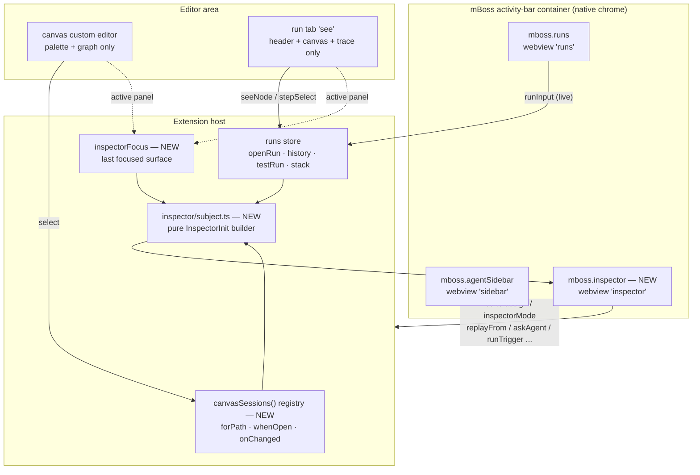
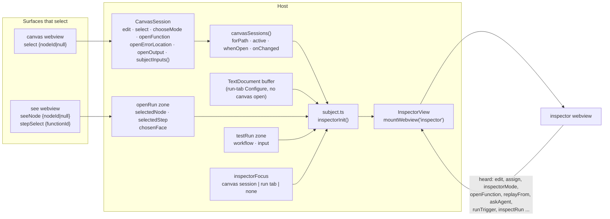
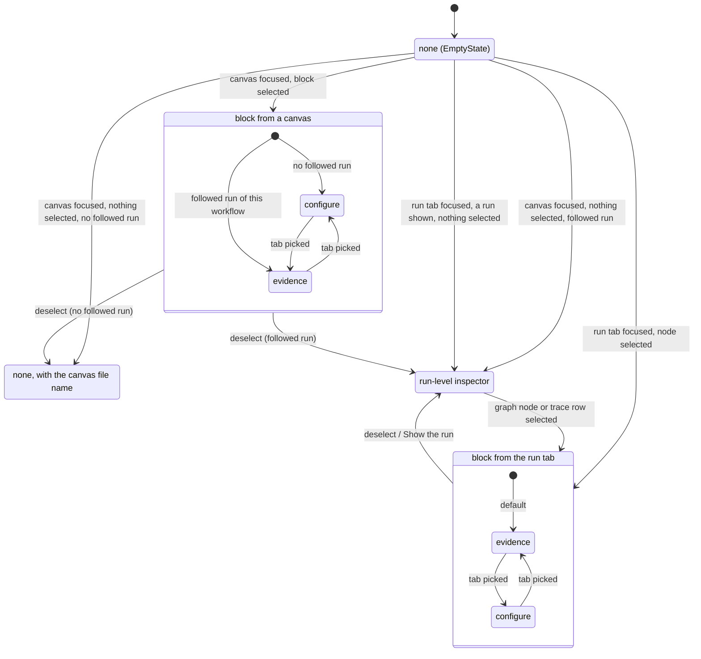
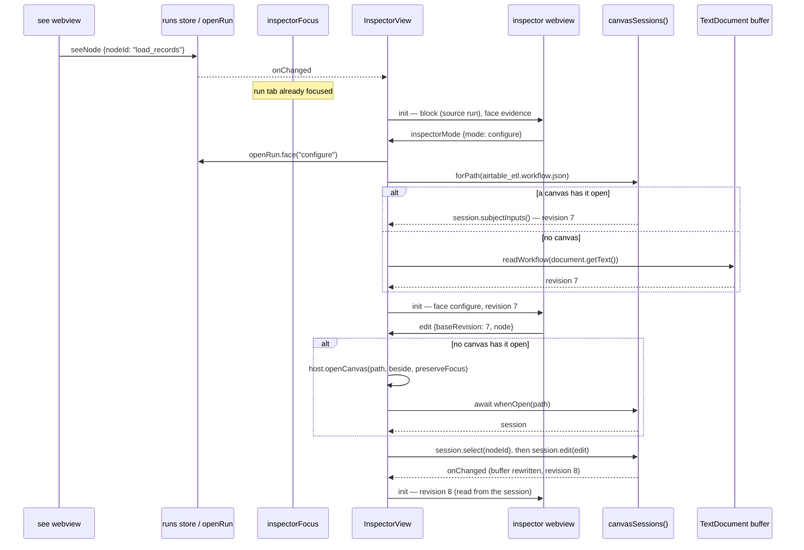

# mBoss — design delta: the Signal implementation audit (Turns 8-9)

Written 2026-09-12 for the ideatoplan round scoped to Claude Design
Turns 8 and 9 and nothing else, revised 2026-09-13 with the 82
accepted review revisions, and reconciled the same day with the
mboss-vscode v0.0.7 Marketplace release (the Revision log at the end
lists both).
Turn 8 (8a-8j) audits the shipped mboss-vscode build against the mBoss
Signal design system; Turn 9 (9a, 9b, 9c, 9d, 9e, 9g, 9h, 9f) draws
the corrected screens and the acceptance checklist. Earlier turns are
context only.

**Baseline.** Everything described as "today" or "HEAD" is the code
at root `v0.0.36` @ `7895677` with mboss-vscode at `9c6f0db`, the
`main` merge of PR #7 (`vscode-v0.0.7`, "Prepare the extension for the
Visual Studio Marketplace"): mboss-core `aec2035` (`core-v0.0.11`),
mboss-mcp-server `e9cf799`, mboss-skills `6e37ce9`, mboss-e2e-tests
`f4c8142`. Root `7895677` itself still pins mboss-vscode `a459c89`
(`vscode-v0.0.6`), the commit this document was first written against;
the in-progress `/release-vscode` moves that gitlink. The four commits
between them (`66bb7e4` publisher `mBoss`, `a1e5bb6` manifest version
`0.0.7`, `402ead6` Marketplace icon, screenshot and README, `1ff1de1`
`CONTEXT.md` left out of the package) touch only `package.json`,
`package-lock.json`, `README.md`, `CONTRIBUTING.md` (new),
`.vscodeignore`, `CLAUDE.md`, `media/icon.png`,
`media/screenshots/canvas.png` and `src/vsix.test.ts`, so every other
path and line cited below reads the same at both commits; the
`package.json`, `CLAUDE.md` and `src/vsix.test.ts` lines are
`9c6f0db`'s. mboss-vscode development for this change continues on
`vscode-v0.0.8` (§9).
`current-design.md` is the as-built record; this file is the intended
change. mboss-vscode paths are relative to `mboss-vscode/` unless
another repo is named.
Load-bearing current-state claims were re-read in source for this
document (host message unions, `CanvasSession`, `openRun` selection,
`testRun` input ownership, `tokens.css` theme blocks, `time.ts`, the
e2e frame helper, the dedup e2e journey, core's `NODE_PALETTE` and
layout metrics).

**Binding user decisions** (made 2026-09-12, recorded as decided in
§12.1 and designed to throughout):

- **D1 — one shared sidebar Inspector.** A new sidebar webview view
  hosts the node Inspector (Configure | Run evidence), driven by
  selections in both the canvas editor and the run tab. The canvas
  editor and the run tab stop rendering their own inspector or rail;
  the run tab body is header + canvas + trace only. This reverses the
  "no Configure face on the run page" rule.
- **D2 — queue deduplication keeps error-on-save.** The 9g hint copy
  is rewritten to describe the real behaviour; the Queue card carries
  the full `forms.ts` field set in the 9g recipe.
- **D3 — no Debug run.** Omitted everywhere; deferred; no plan row.
- **D4 — the Runs panel input is the one run input.** The Trigger card
  reflects it read-only and live; any Trigger-card run uses it.

---

## 1. Summary of the change

The extension shipped Signal's information architecture but not its
surface. This change does four things, in dependency order:

1. **A shared Signal layer for the webviews.** One set of TSX
   components under `src/webview/signal/` (Button, Tabs, SectionLabel,
   StateWord, PropertyRow, Input/TextArea/Select, FieldHint,
   StatusGlyph, LibFunctionItem, Callout, EmptyState), their CSS in
   `tokens.css`, a token layer that loses
   every caps-as-voice rule, gains the missing size/space/weight
   steps and high-contrast re-points, and overrides React Flow's
   light defaults. Pure, isomorphic helpers for 24-hour time, short
   run ids, durations, superjson display values and the UI state
   vocabulary, plus one host-only helper for workspace-relative paths.
2. **A new `inspector` webview view** in the mBoss activity-bar
   container. It owns Configure, Run evidence and the run-level
   inspector. A host collaborator decides its *subject* from whichever
   of a canvas panel or the run tab was focused last. The canvas
   editor loses its third column; the run tab loses its rail.
3. **The corrected screens**: the Agent sidebar (six block classes,
   pinned auto-growing composer), the Configure recipe including
   Trigger and Queue, the Run evidence card, the run tab (one 44px
   header, graph beside trace at ≥900px, one panel mounted, trigger
   first, no ports), the Local runs list (dense 34px rows, host-held
   selection, All/Active/Failed), the flat Blocks palette, and the
   empty, app-down and no-Conductor states.
4. **The two bugs**: the composer's grip-driven sizing and misplaced
   Stop, and graph nodes painting over the Trace tab.

Outside mboss-vscode the change is small: mboss-core renames two kind
labels ("Durable wait", "Email send") and exports `traceOwners`, the
row-to-block map its replay grammar already computes; mboss-mcp-server
takes that through a nested-pin bump with no source edit;
mboss-e2e-tests rewrites the selectors and journeys the redesign moves,
and stops assuming the package it installs is named for version
`0.0.0`. Inside mboss-vscode, the Marketplace README and its canvas
screenshot, which describe the surfaces this change moves, are
brought up to date (§9).
mboss-skills, mboss-docs and the five mboss.dev repos do not change
(§9).



---

## 2. Scope and classification

### 2.1 Tags

| Tag | Meaning |
|---|---|
| **CURRENT** | Ships in this change. |
| **NEXT** | Named by a figure as later work; nothing ships now. |
| **EXISTING** | Already true at HEAD, verified in source (cited). A regression test may still be added. |
| **ADAPTED** | Ships, but not as literally drawn; the reason and the adapted target are stated. |
| **IAD** | IMPOSSIBLE-AS-DRAWN: cannot be built as drawn in this host or without an out-of-scope change; the adapted target is stated. |

Every figure id, numbered callout, rule, map row, 9x element group and
9f line carries a tag in §11; where parts of one item differ (a
webview half that ships and a native half that cannot), the row names
each part's tag. This section states the tags that need a reason.

### 2.2 What NEXT means here

The figures mark one thing NEXT by badge: the Queue Configure card (the
9g badge, the handoff README twice, context 6l "IMPLEMENTATION NEXT",
where 6l means the queue's *compiler* lowering). One callout names a
possible later piece without a badge: 8g-5's Gantt, "at most an
EXPLORATION for long-running runs … its own tab". It is tagged N below
too, and nothing of it ships. The queue kind, its
schema, its palette row, its canvas rendering and every Configure field
already ship (`mboss-core/src/ir/catalog.ts` `QueueConfigSchema`;
`src/canvas/inspector/forms.ts` `queueFields()`).

- **Ships now (CURRENT, D2):** the Queue Configure card restyled with
  the 9g recipe over the complete field set `forms.ts` exposes
  (§7.3.3), including the rewritten deduplication hint.
- **Not shipped (ADAPTED):** the 9g `NEXT` tag itself. It is 9px
  (below the 10px floor of 9f Global-9), has no data source
  (`NodePaletteEntry` is `kind`/`label`/`group` only,
  `catalog.ts:427-457`) and would contend with the header's state
  slot on a queue block with a followed run.
- **NEXT (nothing ships):** the queue compiler feature 6l names, a
  Gantt tab for long-running runs (8g-5's exploration; the stacked
  Gantt itself is removed, §7.5.5), and the three Turn 9 "Try next"
  items (Branch/Loop/Approval Configure
  inspectors; a dark pass on permission/diagnostic blocks; a canvas
  keyboard map). The theme test loops in §10 exercise the permission
  and diagnostic blocks in dark and high contrast anyway, because
  they are on the Agent screen; that is coverage, not the redesign
  "Try next" proposes.

### 2.3 IMPOSSIBLE-AS-DRAWN items

| Item | Why | Adapted target |
|---|---|---|
| 8a-1 / 9f 9a-1 "MBoss" and "⌄ Agent" rows never appear | Native container title and pane header, drawn by VS Code; modern-ui CSS capitalizes "mBoss" (`package.nls.json:16-18`; two views in one container, `package.json:145-158`). No extension code reaches them. | One webview header row "mBoss — Agent"; acceptance scoped to the webview DOM. |
| 9f 9a-8 "no other view renders beneath it" | Agent, Inspector and Runs share one native container; VS Code stacks panes. | Within the webview the composer is pinned and nothing renders below it; the native pane order is VS Code's. |
| 9e / 9h "Local runs" and the Inspector's own header rows replacing native headers | Same native-pane reason (`package.nls.json:18`). | Webview headers ship as drawn; native pane titles stay. |
| 9d / 8f-5 edges 26px tall, nodes 52px tall | Core fixes `NODE_HEIGHT = 60` and `LOOSE_GAP = 72` (`mboss-core/src/layout/metrics.ts:38,49`); every saved position and layout golden is baked to them, and the editing canvas shares them. | Keep core geometry; port structure (vertical chain, anchored top-left, 22/26px surface padding). |
| 9f Global-8 "toggle `data-theme="dark"` on the webview root" | The extension never owns the theme; VS Code stamps `body.vscode-light / -dark / -high-contrast / -high-contrast-light` (`tokens.css:280-305`). | The same assertion made through the harness's body classes, in four themes (§10). |
| 9f Global-10 "redeclare derived tokens in `[data-theme="dark"]` in `tokens/colors.css`" | Targets Signal's file, not this repo; the extension declares derived tokens on `body`, where the theme classes land (`tokens.css:180-256`), so the bug does not occur. | EXISTING, plus a regression test that no `:root` declaration contains `color-mix(` or reads a role a `body`-scoped rule re-declares (I-6, §5.6). |

### 2.4 ADAPTED items with a reason

| Item | Drawn | Ships | Reason |
|---|---|---|---|
| 9g Queue hint, 9f 9b-10 | "turning partitioning on disables this field" | Field stays editable; hint states the error and both ways out (§7.3.3) | D2; e2e `canvas-editing.spec.ts:463-527` keeps. |
| 9g Queue field list | handler, registration rows, three per-item rows | Adds `itemsPath`, `itemType`, the retry group, conditional partition rows and the folded `advanced` group | D2; `itemsPath` is required and has no other UI path. |
| 9g Queue "priority unset", "delay none" | Values in `--ink` | Placeholders in `var(--vscode-input-placeholderForeground, var(--ink-faint))` (§4.2 Field) | They name an empty field, not a value; high contrast must keep an empty field distinct from a set one. |
| 9g/9e/9h Debug run | Button beside Run; "used by Run / Debug run only" | Omitted; hint reads "used by Run only" (9f 9b-9's own copy) | D3. |
| 9g "input · sample for Run" | Stored per trigger | Read-only, live view of the Runs panel input | D4. |
| 9e Run action row | Run + ports, no input | Run + workflow select (only when the saved-workflow list, schedule workflows included, holds more than one) + ports; an "input" PropertyRow with the Runs panel textarea below | D4 keeps the textarea as the single owner. |
| 8i / 9c Configure tab on the run page | Tabs drawn | Tabs live in the shared Inspector for run-tab subjects | D1. |
| 9d ~900px breakpoint | 9d's artboard is 740px wide with the trace beside | Side by side when the run tab is ≥900px wide; below, Trace is a tab | 9f 9d-5 and 8i both say 900; artboard widths are canvas frames (§3 I-19). |
| 9d trace detail lines "15 records", "15 normalized · 0 rejected" | Semantic summaries | Generic one-line value (§7.5.4) | No rule maps an arbitrary recorded output to those words. |
| 8e-4 Queue "list-ordered" tile | Lucide list-ordered | Keeps the shipped waves glyph | `icons.tsx:108-119` rejects numerals at 15px; Signal's `NodeIconTile` has no queue entry. |
| 8i "trigger → nodes → end" | END pill | No END | 9d, the literal screen, draws none. |
| 9h panel 3 app down | Error block replaces the list | Error block replaces the action row; tabs and the readable list stay | Postgres is up; the ledger is readable and hiding it hides runs a person could open. |
| 9h panel 3 app detail "dbos start · :3000" | That copy | The real service detail | The container runs `tsx src/app/main.ts` (`mboss-core/src/scaffold/templates/entrypoint.ts:22`). |
| 9h panel 4 footer | "deployment context only · never inside the local run loop" | Not rendered; designed to instead (next row) | 7m states a placement rule spanning both Conductor states ("appears in deployment context only — never inside the local run loop"). It is a designer constraint, not card copy, so it is not rendered and is designed to instead. |
| 9h panel 4 / 9f 9e-9 no-Conductor card among the Runs boundary states | Card in the Runs sidebar | `ProductionState` renders only in the no-runs state (§7.8.1 row 8), after the footer; never in the populated list, the app-down panel or the error panels; the populated list keeps only the configured branch's single Button | 7m forbids the local run loop and the extension has no deployment-context surface (`package.json` contributes none); the populated 9e screen draws no such section; rows 5-7 each offer one way out (§12.2 Q-33). |
| 9h panel 1 detail "Start the app and set a workflow going." | That copy | "Set a workflow going. Runs appear here as DBOS records them." | The no-runs state is reached only with the ledger readable and the `app` service running (§7.8.1 precedence puts app-down first), so telling a person to start the app is false. |
| 9h panel 2 detail "Select a node on the canvas, or a run to see what it recorded." | That copy | "Select a node on the canvas, or open a run to see what it recorded." | Selecting a Local runs row only selects and expands it (§7.6); the Inspector follows a canvas or the run tab (D1, §7.2), so opening a run is what gives it a run subject (§12.2 Q-40). |
| 9h panel 4 "EmptyState carries all four" | Caption | Panel 4 is its own small composition | The 9h markup hand-composes it. |
| 9e caption "counts come from the same query as the list" | Claim | Counts stay a separate uncapped statement; a FieldHint says "50 of N" when the list is capped | `MAX_RUNS = 50` (`queries.ts:40`). |
| 9e "Replay from here" on a list row | One label | "Replay from here" when the run has a failed step (`failedStep`, the lowest own row with an error; posts the pick `{ functionId: failedStep }`); "Replay from start" otherwise, whatever the status (posts `{ from: 'start' }`, a fork at step 0) | The list has no selected step, and the label must say what happens; an unannounced fallback to the first offered boundary would contradict "from here" (`replayZone.ts:620-631`). |
| 8b hint line; model picker | Drawn in 8b | Not rendered | 9a and 9f omit both; ACP models are unread. |
| Attached file names under the composer textarea | Not drawn (9a draws only the "＋") | One FieldHint line, each name with a quiet remove Button | Attach ships (§7.1 item 10); a person must see and undo what the next prompt carries. |
| 9d "Edit workflow" in the run graph corner | Not drawn (9d draws only the revision caption) | `Button quiet` "Edit workflow" beside the caption | The only route from a run tab back to the editor once the rail leaves. |
| 9e expanded row: Cancel run, Resume | Not drawn (9e and 9f 9e-5 name Open on canvas · Replay from here · Ask agent) | Cancel run on unfinished rows; Resume on cancelled and gave-up rows | The zones that offered them are removed, and no figure draws a non-done row's actions. |
| 9e expanded row: Copy id | Not drawn | `Button quiet icon="copy"`, accessible name and `title` "Copy id" | The hover copy icon is removed and short ids can collide; an icon keeps the done row's four actions on one line at 9e's width (next row; §12.2 Q-36 records the context-menu alternative). |
| 9f 9e-8 "six runs fit in ≤ 260px of list height" | 9e's 400px panel, selected row with three text actions on one line | Holds at 9e's drawn 400px width for a done row (four actions, one line, metrics in §7.6); at the 300px default side bar width the actions wrap to a second line and the list grows by that line | The side bar width is the person's; at about 257px of usable row width "Open on canvas" and "Replay from start" alone fill a line, so no action set 9e names fits one line at 300px. |
| 9b / 9g Run evidence tab with no run in focus | An ordinary inactive tab, no hint under the strip | `aria-disabled` tab at 0.45 opacity plus the FieldHint "start or pick a run to see what it recorded" (`data-no-run`) under the strip | HEAD disables it and says why (`Inspector.tsx:238,246`), pinned by `canvas.spec.ts:2751-2773` and e2e `inspector-in-canvas.spec.ts:188-190`; a tab that looks pickable and shows nothing leaves keyboard and screen-reader users with no reason. |
| 9h panel 3 footer | No footer under "Start app" | The footer FieldHint shows under the kept list | The footer names where the list comes from, and §7.8.3 keeps the list; it renders whenever the ledger read succeeded (§7.8.1 rows 7-9 and the populated list). |
| R9 "cards float only over the canvas" | Rule text | Governs the outermost panel, its sections and its rows (palette, property, trace and list rows); the card-shaped Signal blocks the corrected screens draw inside a panel keep their drawn shape: ToolEventRow, FileDiff and the Composer card (9a), Callout (9c-3), the selected RunHistoryItem block (9e) | 9a, 9c and 9e draw those blocks as cards inside panels, and they are Signal components (`_ds_bundle.js` agent and runs sets); I-19 polices `.card` and outermost sections, which none of them uses. |
| R3 "primary (Run), outline (Open function), quiet (everything else)" | Three looks | Four Button variants: primary, outline (`secondary` + brand ink), quiet, and `stop`; Stop and Cancel run are `stop`; Resume is primary; outline: Open function (Configure, and a done step's evidence face), Open on canvas and the list row's Replay from here / from start (9e), the run-level card's Replay from start (9d), Run with this input (9g), the post-edit line's Replay from here (7n in 8a's FUTURE panel) and a permission's lasting options, `allow_always` and `reject_always` (Q-42); quiet: the evidence face's Replay from here (9c), every Ask agent, Undo edit, Keep and Undo | `stop` is the fail-tint Stop 9a draws (Signal `Composer`), reused for the other action that halts a run; each outline and quiet Button follows the figure that draws it, which is why "Replay from here" is outline on a list row and on the post-edit line and quiet on the evidence face (9c draws it beside an outlined Open function); Resume is undrawn and is the one forward action on a stopped row. |
| PermissionRow "Always for this command" (Signal `PermissionRow`; the handoff README keeps it "unchanged from the DS"; no Turn 9 screen draws one) | A bordered neutral Button (hairline, surface ground, ink text) | `secondary ink="brand"`, the outline look, with `data-always`, on every lasting option: `allow_always` and `reject_always` (Signal's row draws Allow once, Always for this command and Deny, `_ds_bundle.js:280-360`, and no lasting reject) | A bordered neutral Button is a fifth look outside R3's vocabulary; quiet, the round-one choice, drew it the same as a reject, which loses HEAD's pinned rule that a promise outliving the turn looks different (`sidebar.spec.ts:779-793`); outline keeps Signal's border and stays inside the four looks (§12.2 Q-42). HEAD's rule covers both lasting kinds (`isAlways`, `sidebar/index.tsx:727-729`) and drew its two rejects alike, with only the removed badge setting `reject_always` apart, so `reject_always` takes the outline too. |
| 8b-+ "Focus = brand border + focus ring" | Brand border plus a box-shadow ring | One 1px `--vscode-focusBorder` outline on the composer card (`:focus-within`), no brand border | Forced colours compute `box-shadow` to `none` and keep `outline`; the extension's focus is an outline on VS Code's own focus colour everywhere (§5.4). |
| 8h (7a) and 8f (7b) waiting "2 m 14 s" | Elapsed wait time | `waiting · {block} · since {clock}` in the list; `waiting since {fine}` in the trace; a run waiting on a timer, `waiting · after {block} · wakes {clock}` in the list and `wakes {fine}` in the trace (§7.6 summary, §7.5.4) | Neither the runs list nor a parked run's watch is re-read without a person acting (`current-design.md` §6.10), so an elapsed time would keep stating a wrong number; a start time or a recorded wake deadline never goes stale. |
| 9f G5 "# + 4 hex" for every run id | 4 hex | UUIDs keep 4 hex; other id shapes (`sched-…`, `<parent>-<n>`, event and caller ids) take 4 lowercase base-36 characters of an FNV-1a hash | Non-UUID ids share structured heads and tails, so any 4 characters of the id itself collide by shape (§6 `shortRunId`). |
| 9f G9 "base 13px" | 13px | The base tracks `--vscode-font-size`, 13px by default | The type scale follows the editor font (`tokens.css:159`), so a person's font setting is respected. |
| 9f G1 "10px tracked state words" | 10px | `max(10px, 0.77 × --vscode-font-size)`: 10px at 12px and 13px, 12.3px at 16px (I-7) | The same reason as G9's base: state words scale with the editor font and never drop below the 10px floor. |
| 9f G9 "Spline Sans Mono only for machine evidence" | Rule text; 9b, 9g and 9h set FieldHint prose ("a Trigger owns no ƒ — …", "The recovery ledger — …") in mono | FieldHint stays mono as drawn; mono is opted into by component (I-11), and whether a string is machine evidence is a review question | Figure-internal disagreement: every corrected screen draws FieldHint prose in mono, and the screens win. |
| 9f G2 "Every clickable action is a Button" | Rule text | Every action is a Button; three row controls are not: the trace row (`button.trace-op`), the run head (`li[data-run] > button.run-head`) and the lib row (`.lib-fn`) | They are Signal's row components (ExecutionTrace, RunHistoryItem, LibFunctionItem), which select rather than act; each is one native `button` with no interactive content inside it (I-8). |
| 8j R8 "nodes show icon + name + ƒ only" | Icon, name, ƒ line | The node's one line is the ƒ export, the trigger phrase, "{kind word} · unassigned", the kind word alone (loop, durable wait, approval, email send), "waiting · since {clock}" (a timer wait: "waiting · wakes {clock}", §7.5.4), "running · derived" or a queue block's counts; then the run mark (§7.7) | 9d itself draws the trigger phrase; the other lines are what an unassigned, codeless, parked, live or queue block has to say (a loop, wait, approval or email block runs no function, so an ƒ line would send a person looking for code to write), and `queue-journey.spec.ts:391-413` reads the counts line. |
| 8c-1 Tabs "13px" | 13px | 12px (`--text-control`) | Signal's `Tabs` uses its `--text-sm` step, which is 12px (`_ds_bundle.js:1275+`); the figure disagrees with its own component. |
| 8c-4 "Open function" a quiet button | Quiet | Outline (`secondary` + `ink="brand"`) | 9b-8 and 8d-6 draw it outlined; the corrected screen wins. |
| 8h-3 short id "mono 600" | 8h-3's callout says weight 600; 9e renders Signal's `RunHistoryItem`, whose id is `--w-medium` 500 (`_ds_bundle.js:1898`; `step3b-trace-runs.md` 9e-6) | Weight 500 | Figure-internal disagreement; the corrected screen wins, as for 8c-4. |
| 9c render wraps "api / call" and "✓ done · #2" | Wrapped inside the kind word and state line | `white-space: nowrap` inside each; the state line wraps under the title as one unit | A kind word or state split across lines reads as two facts. |
| 9b-5 "incompatible hidden" line "only while picking" | 9f says only while picking; the 9b render draws the at-rest FieldHint "… 3 incompatible hidden · click to change" | The at-rest lib FieldHint keeps "{n} incompatible hidden"; the picker's "{n} incompatible functions hidden · show" control appears only while picking | Figure-internal disagreement; the render wins, and 9b-5's "line" is read as the picker's "show" control. |
| 9c footer "recorded result · reused on recovery and on replay" | That copy | "recorded result · reused on recovery and by a replay from a later step" | A fork copies only rows below its start step, so the replay the adjacent "Replay from here" starts re-executes this row. |
| Handoff README Inspector panel on `--surface` | `--surface` ground | The Inspector paints on the side-bar ground (`--canvas` re-pointed to `--vscode-sideBar-background`) | `--surface` is the mockup frame colour; a docked view on it shows a seam against the Agent and Runs panes (Dark Modern `#202020` vs `#181818`). |
| 9a header row and composer region on `--surface`, transcript on `--canvas` | Two grounds in one panel | The whole Agent panel paints on the side-bar ground (`--canvas`, already re-pointed at `sidebar.css:22-24`); hairlines separate the header, transcript and composer region; the Composer card itself keeps `--surface` (§7.1 items 1 and 10) | The Inspector row's reason: `--surface` is `--vscode-editorWidget-background`, so a header or composer band on it shows a seam against the native pane header and the neighbouring panes. |
| 9e / 9h Local runs panel on `--surface` | One `--surface` card | The Runs panel paints on the side-bar ground (`runs.css:20-22`); the selected RunHistoryItem keeps its `--brand-tint` block (§7.6) | The same seam reason. |
| 9a user bubble "full width" (8a amber) | 8a text | Inset 28px, no rail | 9a render and Signal `UserMessage` both inset. |
| 9f Global-1 R8 "ports never render" on the editor canvas | Literal rule | Editor handles stay hidden at rest and revealed on hover or mid-wire | Wiring starts on a handle (`Node.tsx:121-146`); 8f/9d only draw the run graph. |
| 8f-11 "heading in mono lowercase" | Mono | `SectionLabel` (sans) "dbos.workflow_status"; values mono | 9d's markup draws it as a plain SectionLabel. |
| 8d-2 "#a546" on a step's state line | Short run id | `#functionId` ("✓ done · #2") | 9c renders `#2`; that number is `operation_outputs.function_id`. |

### 2.5 EXISTING items (verified at HEAD)

| Item | Where |
|---|---|
| Tabs `role=tablist/tab` and `aria-selected` only (no `tabpanel`, `aria-controls`, roving `tabIndex` or arrow keys at HEAD; §4.2 adds them), 2px brand underline on the active tab | `tokens.css:538-583`; `Inspector.tsx:218-249`; `see/index.tsx:150-164` |
| Duration format `48 ms` / `1.1 s` below a minute (§6 adds the minute, hour and day steps) | `runs/view.ts:905-909`; `EvidenceCard.tsx:1124-1128` |
| FileDiff `+N` count, and `−N` when non-zero (§7.1 item 7 also shows `−0`) | `sidebar/index.tsx:467-473` |
| Composer placeholder copy | `sidebar/words.ts:38` |
| Diff context ≤ 3 lines (`DIFF_CONTEXT = 2`) | `acp/diff.ts:145` |
| Node width 230px; waiting glow on the shared node face | `mboss-core/src/layout/metrics.ts:30`; `tokens.css:953-956` |
| Canonical palette order | `mboss-core/src/ir/catalog.ts:445-457` |
| Whole palette row drags | `Palette.tsx:120-123` |
| Lucide path data for ten kinds, licence notices | `icons.tsx`; `THIRD_PARTY_NOTICES.md` |
| "workflow as saved · revision N" copy | `messages.ts:552-553` |
| Ledger rows (`workflow_uuid`, `status`, `recovery_attempts`, `executor_id`, `application_version`) | `runs/view.ts:836-850` `railOf` |
| A step gets its own card with name and kind | `EvidenceCard.tsx:463-558` `BlockCard` |
| Step action set and order | `EvidenceCard.tsx:577-679` |
| Run tab title carries the full id | `runs/panels.ts:301-307` |
| Finished runs are not polled | `runs/openRun.ts:265-267` (`finished`) |
| Derived tokens on `body`; dark semantic inks brighten | `tokens.css:199-256`, `:280-290` |
| Queue fields wired; no function picker on a Trigger | `forms.ts:418-483`, `:252-306` |
| `signatureOf` prints `() → AirtableExtract` / `Document → IndexResult` | `libFunction.tsx:108-112` |
| `.lib-fn[data-state='assigned']` matches Signal's assigned look (its inset `box-shadow` edge becomes a `--selection-ring` border so it survives forced colours, §5.4) | `canvas.css:245-263` |
| "global = across processes · worker = per process" copy | `canvas/words.ts:667` |
| "duration covers every try DBOS made · the ledger records one row" copy | `canvas/words.ts:320-322` |
| Edge colour by state | `Wire.tsx:36-42` |
| Albert Sans and Spline Sans Mono vendored | `tokens.css:56-70` |
| Focus drawn as an outline on `--vscode-focusBorder` | `tokens.css:310-314`, `:482-485` |
| `prefers-reduced-motion` collapses motion | `tokens.css:1172-1186` |
| Hover `--surface-2` on a run row | `runs.css:532-534` |
| The replay/fork primitive | `runs/replay.ts`, `runs/replayZone.ts` |
| DBOS mints v4 UUIDs | `@dbos-inc/dbos-sdk` 4.27.6 `dbos-executor.js:242` (`randomUUID`) |

---

## 3. Invariants

Each is phrased so a test can decide it. "View" means one of the six
webviews (`canvas`, `sidebar`, `runs`, `see`, `inspector`, `gallery`).
"Four themes" means the harness's light, dark, high-contrast and
high-contrast-light (§10.1).

**Theming**

- **I-1 Tokens only.** No `#hex`, `rgb(` or `hsl(` literal appears in
  any `src/**/*.css` outside `tokens.css`'s declared source blocks, and
  none in any `.tsx` `style` prop. The declared source blocks are the
  rules whose selector is `:root` or consists only of `body.vscode-*`
  classes. No stylesheet other than `tokens.css` contains `color-mix(`:
  a view reads a named role, so a high-contrast re-point reaches it.
  (Content-regex unit test.)
- **I-2 No per-theme selectors outside `tokens.css`.** No stylesheet
  other than `tokens.css` names `vscode-dark`, `vscode-light` or
  `vscode-high-contrast`; every high-contrast adjustment is a token
  re-point inside `tokens.css`'s theme blocks. (Content-regex.)
- **I-3 High-contrast text is readable.** Under
  `body.vscode-high-contrast.vscode-high-contrast-light` the computed
  `--brand` and `--ok` equal the light values (the voice palette stays
  light). In both high-contrast themes every element with rendered
  text has computed `color` at ≥ 4.5:1 against its nearest opaque
  ancestor background; the sweep skips `:disabled` and
  `[aria-disabled="true"]` subtrees, which WCAG 1.4.3 exempts as
  inactive. Under high-contrast light no text element's computed
  `color` equals the light `--ok`, `--warn`, `--fail`, `--agent` or
  `--info` literal. (Playwright, literal colours.)
- **I-4 High contrast keeps structure.** In both high-contrast themes:
  an input at rest, a quiet or secondary Button, a borderless tinted
  control (Stop, UserMessage, Callout, InlineValue chip) and a
  selected row each show an edge whose computed colour equals
  `--vscode-contrastBorder` or `--vscode-contrastActiveBorder`. The
  test asserts `outline-style` / `border-style` as well as the colour
  literal: a hovered row's outline is `dashed`, a selected row's border
  is `solid`, and a focused selected row shows both the focus-border
  outline literal and the selection border literal. Under
  `forced-colors: active` a selected row and the Stop Button keep a
  non-`none` border or outline style.
- **I-5 No library light defaults.** On the run tab and the canvas,
  no computed handle, edge, selected-edge stroke, background-dot `fill`
  (`.react-flow__background-pattern.dots circle`), edge-label or
  selection colour equals a React Flow default (`#1a192b`, `#b1b1b7`,
  `#91919a`, `#ffffff` in dark). For every part the extension renders,
  `tokens.css` declares the un-suffixed `--xy-X` the library reads
  before its own `--xy-X-default`.
- **I-6 No `:root` value reads a body-scoped role.** No `:root`
  declaration contains `color-mix(`, and no `:root` declaration's
  `var(--name)` names a property that any `body`-scoped rule in
  `src/**/*.css` also declares (the `body {}` block, the
  `body.vscode-*` theme blocks, the views' `--canvas` re-points, the
  reduced-motion twin). `var(--vscode-*)` and `var(--font-size)` stay
  allowed, because VS Code writes its variables on the root element
  itself. (Regression check for 9f Global-10.)

**Voice and type**

- **I-7 Caps only for state words.** The only `text-transform:
  uppercase` rule in `src/**/*.css` is `.state-word`; in every view and
  theme, every element whose computed transform is `uppercase` has
  class `state-word`, is not a `button`, `[role=tab]` or `a`, has no
  clickable ancestor, and has computed `font-size` equal to
  `max(10px, 0.77 × --vscode-font-size)` ± 0.05px (asserted at 12px,
  13px and 16px editor font sizes).
- **I-8 Buttons are Buttons.** Two rules:
  - (a) every `button`, `[role=button]` and `[role=tab]` in every view
    has computed `letter-spacing: normal` and `text-transform: none`;
  - (b) each is exactly one of: `.btn[data-variant]`; `.tab` inside
    `[role=tablist]`; or an allow-listed row control, named by its own
    class: `.trace-op`, `li[data-run] > button.run-head`, `.lib-fn`.
  No `button` has an interactive descendant (`button button`,
  `button a`, `a button` count 0). A unit content check fails any
  `onClick=` on an intrinsic `div`, `span`, `p` or `li` in
  `src/**/*.tsx` (the "every clickable action is a Button" case a DOM
  sweep of buttons cannot see).
- **I-9 Sentence case copy.** Two unit rules over copy a view draws:
  - caps: no key of `l10n/bundle.l10n.json` and no value of the
    generated `tests/webview/words.json` matches `/\b[A-Z]{3,}\b/`
    outside an allow-list of state words, table and column names, and
    product/protocol acronyms (`API`, `JSON`, `DBOS`, `SDK`, `PATH`,
    `POST`, `URL`, `UUID`);
  - Title Case: no `words.json` value, and no `messages.ts` string that
    crosses into a webview init (the proposal banner, run evidence
    rows and the like) or quotes a webview label (the "Replay From
    Here" notification), matches
    `/(^|[\s·—(])[A-Z][a-z]+ [A-Z][a-z]+/` outside an allow-list of
    proper nouns ("Agent Client Protocol", "DBOS Conductor", "VS
    Code") and of matches whose second word is one ("Start Docker", in
    the daemon state's "Start Docker, then refresh.", §7.8.5). Native
    dialog and notification labels no figure draws
    (e.g. `showOpenDialog`'s "Create Here") are outside this rule.
- **I-10 Nothing below 10px.** With `--vscode-font-size: 12px`, no
  rendered text element in any view has computed `font-size` < 10px.
- **I-11 Mono is opted into by a hook.** `var(--font-mono)` appears
  only in `tokens.css`, under the `.mono` rule and its `[data-mono]`
  twin; any element may opt in with `data-mono` or `.mono`, and every
  Signal component that declares mono (FieldHint, PropertyRow `mono`,
  InlineValue, ArtifactRef, kind word, run line, short id, trace op
  name, diff body, path span) renders `data-mono` on its root. At
  runtime every element whose computed `font-family` starts with
  "Spline Sans Mono" satisfies `closest('[data-mono], .mono')`. The
  marks ƒ ✓ ✕ ↻ ▾ → └ ├ render from a fallback face (§5.5), so no spec
  asserts their face or advance width. Whether a given string is
  "machine evidence" is a design review question, not a test.
- **I-12 Label before value.** In every `[data-property]` row the label
  element precedes the value in DOM order and sits left of it on the
  same line; no `.value` element is followed by a caption, meaning a
  text element positioned under the value inside the same
  `[data-property]` row, other than the row's `.field-note`
  diagnostic. Every Field control inside `[data-property]` has a
  non-empty accessible name.

**Identity, time and values**

"Exempt subtrees" below means `[data-ledger]` and `[data-verbatim]`.
`data-verbatim` marks only text a person or agent wrote, or a recorded
value, printed word for word: a typed UserMessage body, AssistantProse
bodies, an agent-titled ToolEventRow target and body, FileDiff lines,
InlineValue, the ArtifactRef preview, the recorded value span and
recorded error message in a trace detail line, the recorded error
message in a failed step's Callout, the recorded error in a Runs list
row's expanded body (§7.6), the recorded values the Ask-agent evidence
row's folded body quotes (the `error` line's message and a refused
run's `detail`, §7.1 item 12), and the Trigger input view.
Extension-written words never carry it: an extension-written row's
own lines, its prefixes (`error · `, `detail · `) and the Ask-agent
display copy (§7.1 item 12) stay outside it, as a trace detail line's
prefix does. A recorded value is text the run or the app wrote, and
DBOS error messages quote run ids (`Awaited {id} was cancelled`,
`Workflow {id} has been cancelled`, `@dbos-inc/dbos-sdk`
`error.js:127,160`), so a value the extension quotes inside its own
row is still marked.

- **I-13 Short ids in the DOM.** No view's `textContent` outside the
  exempt subtrees matches the full-UUID pattern. Every short run id
  renders in its own span with `data-short-run` carrying the full id;
  for each `[data-short-run]`, the text equals `shortRunId(value)` and
  matches `^#[0-9a-z]{4}$`, and `title` equals the value. Three short
  ids are outside the span rule, each inside one host-composed string,
  so each is text:
  - the fork phrase ` · replay of #{short}` inside a RunHistoryItem
    summary, one line that ellipsizes as a single span (§7.6). Its form
    is a unit assertion on `RunRow.line` (`view.test.ts`), as I-14's
    list clock is: the line contains ` · replay of ` +
    `shortRunId(forkedFrom)` and does not contain `forkedFrom`. The
    selected row's lineage line carries the parent's id in a
    `[data-short-run]` span;
  - the Ask-agent prompt echo's display copy (§7.1 item 12), which the
    UserMessage renders through AssistantProse's inline parser. Its
    form is a unit assertion on the display copy `sidebarInit` builds
    (`sidebar/view.test.ts`): it contains `shortRunId(about.workflowId)`
    and does not contain `about.workflowId`;
  - the post-edit `NextEntry` sentence "Applied. Replay #{short} from
    {block} …" (§7.1 item 9), drawn as AssistantProse. Its form is the
    same assertion on the sentence `sidebarInit` composes.

  The full-UUID sweep still covers all three. The full id of the run
  the last two name stays one step away: the Ask-agent evidence row
  above them carries it in a `[data-short-run]` span (§7.1 item 12), and
  the NextEntry's Replay from here Button posts it.
  Function-id marks (`#2`) carry `data-function-id` instead and are
  outside the rule. `data-run` stays one per run root or row.
- **I-14 24-hour time.** No view's `textContent` outside the exempt
  subtrees matches `/\b(AM|PM)\b/`; every `[data-time="fine"]` matches
  `^\d{2}:\d{2}:\d{2}\.\d{3}$`. The list clock is part of one composed
  summary string, so its form is a unit assertion on `RunRow.line`
  (`view.test.ts`): `^\d{2}:\d{2}$` for today, and, under en-US, the
  sweep's locale, `^\S+ \d{1,2} \d{2}:\d{2}$` for an older date.
- **I-15 No serializer envelope.** Given enveloped fixtures, no view's
  `textContent` contains `__dbos_serializer`, verbatim subtrees
  included: the envelope must never show, even inside a value.
- **I-16 Inline or artifact.** Inside `[data-recorded]` (the
  Inspector's output section, the run-level input section and the
  Trigger input section), a recorded value whose one-line form is ≤
  120 characters renders as InlineValue (`INLINE` state word) and a
  longer one as ArtifactRef (`ARTIFACT`, a size, an "Open" quiet
  Button). Non-JSON text follows the same rule. The trace detail line's
  one-line value is a verbatim span outside `[data-recorded]`, exempt
  by design.
- **I-17 Two vocabularies.** No view's `textContent` outside the exempt
  subtrees matches `/\b(SUCCESS|ERROR|PENDING|ENQUEUED|DELAYED|
  CANCELLED|MAX_RECOVERY_ATTEMPTS_EXCEEDED)\b/`; inside
  `[data-ledger]`, `status` shows the raw value.
- **I-18 Workspace-relative paths.** A path under the session's
  project renders relative to it; its absolute form survives only in
  `title` and `data-file`.

**Structure**

- **I-19 Full-bleed panels.** No view's outermost section has a
  border radius or `box-shadow`; `.card` is used only by things that
  float over the canvas (QuickAdd `QuickAdd.tsx:51`, the wiring
  rejection `Canvas.tsx:1065`) and by the gallery's pattern tiles
  (`gallery/index.tsx:107`, a picker no figure draws). The 9x outer
  cards are the design tool's frames, not UI. The card-shaped Signal
  blocks the corrected screens draw inside a panel (ToolEventRow,
  FileDiff, the Composer card, Callout, the selected RunHistoryItem)
  are components with their own classes, outside this rule (R9's
  scope, §2.4).
- **I-20 One representation per view.** The run tab's `[data-trace]`
  count is 1 on the Trace tab at any width and on the Graph tab at ≥
  900px, and 0 on the Graph tab below 900px; the run tab renders no
  `.chips`, `.chart` or `table.raw`; the Inspector renders workflow
  input at most once.
- **I-21 One panel mounted.** While the run tab's Trace tab is showing,
  `[data-node]`, `[data-run-node]` and `.react-flow__node` counts are
  0, at 800px and 1400px viewport widths; while Graph is showing, the
  `[data-node]` count is above 0, and at ≥900px the trace column is
  inside `[data-pane="graph"]`.
- **I-22 No ports on the run graph.** Every `.react-flow__handle`
  under `[data-pane="graph"]` has computed `opacity: 0` and
  `pointer-events: none`, and `elementFromPoint` at a handle's centre
  returns the node, not the handle (React Flow keeps the handle boxes
  to route edges); the editor canvas shows handles only on hover or
  while a wire is drawn.
- **I-23 Boxes are earned.** At rest, every Inspector input, select
  and textarea has a transparent border and background (except I-4 in
  high contrast); after `focus()` it shows one ring: computed
  `outline` is 1px solid in the `--vscode-focusBorder` literal with
  `outline-offset: -1px`, and no separate brand border. Palette rows,
  property rows and trace rows have `background-color:
  rgba(0, 0, 0, 0)` at rest.
- **I-24 One Inspector.** The canvas webview has no `.inspector`,
  `[data-inspector-mode]` or `[data-inspector-tab]`; the see webview
  has no `.rail` and no `[data-evidence]`; the inspector webview's
  root renders `data-inspector`.
- **I-25 Reduced motion.** With `prefers-reduced-motion: reduce`
  emulated, or `body.vscode-reduce-motion` set, every computed
  `animation-duration` and `transition-duration` is ≤ 0.01ms; the
  body-class case includes a sidebar fixture with an in-progress tool
  row.
- **I-26 The run sample is never saved.** No `edit` message posted
  while a Trigger card is showing contains the Runs panel input, and
  the workflow file on disk never contains it. Neither `runWorkflow`
  nor `runTrigger` carries an input, and the `mBoss: Run Workflow…`
  command asks for none: every start reads `testRun.input`, which only
  `runInput` sets.
- **I-27 Board hygiene on the palette.** Every `[data-palette-kind]`
  row contains exactly one `.node-icon` whose path data equals the
  canvas node's for that kind, and the palette has exactly one
  SectionLabel before one list of 11 consecutive `[data-palette-kind]`
  rows in `NODE_PALETTE` order.
- **I-28 Graphs are keyboard-honest.** No `.react-flow__node` or
  `.react-flow__edge` under `[data-pane="graph"]` has a `tabindex`; in
  the editor a focused node's computed `outline-style` is `solid` with
  the focus-border literal, in four themes.

---

## 4. The shared Signal component layer

### 4.1 Where it lives and the rules it follows

- **Components** that two or more views draw live in
  `src/webview/signal/`, one `.tsx` per component (`Button.tsx`,
  `Tabs.tsx`, `SectionLabel.tsx`, `StateWord.tsx`, `PropertyRow.tsx`,
  `Field.tsx` for Input/TextArea/Select, `FieldHint.tsx`,
  `StatusGlyph.tsx`, `LibFunctionItem.tsx`, `Callout.tsx`,
  `EmptyState.tsx`). They sit
  beside `mount.tsx`, which every entry already reaches.
- **Their CSS** goes in `src/webview/tokens.css`, a "components"
  region after the shapes, under the file's existing placement rule (a
  class belongs there when two or more views draw it). No per-view
  sheet redefines a component class; a view may only position one
  (layout-only declarations: margin, order, `align-self`, flex and
  grid placement).
- **Copy stays with the view.** Components take plain strings as
  props; every label, accessible name and template comes from the
  view's word bag. No English under `src/webview/signal/`: no JSX text
  child and no string literal in a user-facing prop (`title`,
  `aria-label`, `placeholder`, `label`, `alt`). SVG path data,
  `viewBox`, enum values and class names are not copy.
- **Components import only** `react`, `../client.js`, `../fill.js`,
  type-only `../protocol.js`, and the browser-safe modules of §6
  (every §6 utility except the host-only `displayPath`). A new fence
  in `src/webview/imports.test.ts` pins that `signal/` imports nothing
  from `canvas/`, `sidebar/`, `runs/`, `see/`, `inspector/` or
  `gallery/`.
- **Hooks are kept.** Every component forwards a `hook` prop
  (`Record<string, string>`, spread as `data-*` attributes) so the
  `data-*` contracts the specs and e2e rely on survive the swap
  (`data-evidence-field`, `data-field`, `data-rail`, `data-see-tab`,
  `data-filter`, `data-stop`, `data-choose-agent` …). A narrow
  `hookClass?: string` passes a class through, used only for classes
  an existing e2e reads: `field-note` (the diagnostic FieldHint),
  `section-head` (the queue's advanced toggle) and `lib-note` (the
  misfit FieldHint).
- **What the D2 deduplication journey reads**
  (`canvas-editing.spec.ts:388-527`), kept exactly: each PropertyRow
  root carries `data-field={lens id}` (a paired row puts each Input in
  its own `[data-field]` wrapper instead, §4.2); Input and Select
  render a native `input` or `select` inside it; the diagnostic `note`
  FieldHint carries class `field-note`; the advanced toggle Button
  carries class `section-head` and `aria-expanded` inside
  `[data-field="advanced"]`; folded fields are not in the DOM, so
  `[data-field="onConflict"]` is absent until the fold opens.
- **New hooks** this design names: `data-property` (PropertyRow root),
  `data-short-run` and `data-function-id` (I-13), `data-verbatim` and
  `data-recorded` (§3), `data-mono` (I-11), `data-node` (run graph
  node), `data-block` (transcript block class), `data-agent-head`,
  `data-inspector` (Inspector root), `data-attach`,
  `data-inspector-header` (InspectorHeader root), `data-run-state`
  (StatusLine, its `GlyphState` key), `data-no-run` (the no-run
  FieldHint under the Inspector tabs), `data-stack-up` (every "Start
  app" action), `data-ask-block` (Ask agent on Configure and on the
  Trigger card, posting `askAboutBlock`), `data-open-run-input` (the
  Trigger input's ArtifactRef Open), `data-inspect-run` ("Show the
  run"), `data-picker-current` (the Configure picker's at-rest
  LibFunctionItem, assigned or empty, §7.3.1 item 2), and for the
  webview specs `data-tool-body-toggle` (a tool
  row's fold), `data-new-file` and `data-file-note` (FileDiff),
  `data-failure` (the agent failure Callout), `data-agent-state` (the
  Agent panel's blocked EmptyState), `data-following` (the canvas
  following chip) and EmptyState's `.empty-title` and `.empty-detail`.
  The sidebar keeps, on their new elements, `data-always` on each
  permission option, `data-file` and `data-by` on `.file`, `.added`
  and `.removed` on the FileDiff counts, `.tool-body` on body lines,
  and `.diagnostic`, `data-source`, `.diagnostic-row` and `data-fix`
  on a Diagnostic (§7.1 items 5, 7, 8). Hooks the e2e journeys read that move to a new element
  keep their names: `data-evidence` (`block`, `queue`, and `run` on the
  run-level card's root), `data-evidence-action` on exactly these Inspector
  Buttons, valued by the message type each posts as HEAD does
  (`EvidenceCard.tsx:602,620,640,655,865`): `openFunction`,
  `openErrorLocation`, `replayFrom`, `askAgent` and `openOutput` on the
  evidence face, `replayFrom`, `askAgent` and `openInput` on the
  run-level card (only one face is mounted at a time, so a value names
  one Button). The other Buttons on those surfaces carry their own
  hooks and none of these: QueueCard's items (`data-queue-item`) and the
  lineage ids (`data-lineage-run`), which post `openRun`, Cancel run
  and Resume (`data-cancel`, `data-resume`), and Show the run
  (`data-inspect-run`). HEAD's RunCard put `openRun` on its Open run
  (`EvidenceCard.tsx:973`); that Button is gone (9c-5). `data-inspector-tab` (`configure`
  and `evidence`, on each Inspector tab through its `hook`, as HEAD's
  tabs carry it, `Inspector.tsx:236`; clicked in the inspector frame by
  `stack-journey.spec.ts:313`, `queue-journey.spec.ts:471,633` and
  `inspector-in-canvas.spec.ts:185`), `data-open-function` (Configure's
  Open function), `data-cancel` and `data-resume` (the run-level
  control), `data-evidence-field` + `.value`,
  `data-provenance` (§6.2), `data-queue-item`, `data-lineage` and
  `data-lineage-run`, `data-rail`, `data-run-select`, `data-trace-group`,
  `data-trace-op`, `data-owner`, `data-reuse`, `data-open-run`,
  `data-ask-agent`, `data-cancel-run`, `data-resume-run`,
  `data-copy-run-id`, `data-replay-run`, `.run-name`, `.tool-verb`,
  `.tool-target`, `data-tool-action`, `data-by` and `data-status` on
  tool rows, `.permission` and `[data-option]` on PermissionRow,
  `data-at` on the proposal card, `.node-line[data-line]`,
  `data-view-toggle` on each Canvas/JSON tab, and the view
  roots `.agent` and `.runs`. The journey-by-journey map is in §10.4.
- Components that only one view draws stay with that view (§4.3) and
  still use the primitives.

### 4.2 Shared components

| Component | Props | States | Replaces today | Consumers |
|---|---|---|---|---|
| **Button** | `variant: 'primary' \| 'secondary' \| 'quiet' \| 'stop'`; `ink?: 'brand'`; `size?: 'sm' \| 'md'` (default `sm`: Signal's `3px 10px`, 24px tall; `md`: a text Button `padding: var(--space-1) var(--space-3)`, Signal's Stop, and an icon Button a 26px square, Signal's Send); `icon?: 'refresh' \| 'send' \| 'attach' \| 'copy'` with required `label` (becomes `aria-label`, text hidden); `empty?` (the empty Send); `mono?` (renders `data-mono` on the root, I-11: the header agent picker, the composer's agent Button, the following chip, the trace's SDK disclosure); `type?`; `disabled?`; `reason?: string`; `busy?`; `onClick`; `ref?` (placed on the `button`, a plain prop under React 19; QuickAdd focuses its first kind on mount, `QuickAdd.tsx:42-47`); `hook`; `hookClass?` | rest; hover (`--surface-2` for secondary/quiet, `--brand-hover` for primary); active (content 0.5px down, no lift, no scale); `:focus-visible` outline kept (`tokens.css:482-485`); disabled 0.45 opacity; a disabled Button with a `reason` renders `aria-disabled="true"` (stays focusable, ignores clicks) plus that reason as a FieldHint joined by `aria-describedby`, never `disabled` plus `title`; busy (`aria-busy`, label kept); `empty`: `--surface-2` ground, `--ink-faint` glyph, same element and `type`. Text at both sizes: `--text-sm` (Signal's 11px `--text-xs`, which its `sm` Button draws and which every 9x Button is, `size="sm"` in the markup; this design's `md` is Signal's Composer Stop, also 11px, `_ds_bundle.js:899-935,1024-1036`), `--w-semibold`, `line-height: 1.4`. Ink by variant: primary `--on-brand`; quiet without `ink` `--ink-muted` (Signal's quiet `fg`); `ink="brand"` on quiet or secondary as below; `stop` below. No tone below muted exists, and none is needed: each consumer takes its variant's ink. Primary paints on `--primary-ground` (§5.2) with `--on-brand` text. `secondary` is valid only with `ink="brand"` (the figures' "outline": hairline border, surface ground, brand text), pinned by a type and a `styles.test.ts` check. Quiet and secondary draw `border: 1px solid var(--control-edge)` (transparent outside high contrast). `stop` is `--fail-tint` ground, `var(--state-ink, var(--fail))` ink and `border: 1px solid var(--control-edge)`. `ink="brand"` text reads `var(--state-ink, var(--brand))`. Icons are inline `currentColor` SVG (Lucide `rotate-cw`, `arrow-up`, `plus`, `copy`), never text glyphs; an icon Button also carries its `label` as `title`. A text Button's visible label renders as its one `span` child, so a read of `button span` finds the label. | `.btn.primary/.secondary/.brand/.quiet` (`tokens.css:463-530`) and every hand-rolled button: `sidebar.css` `.agent-name`, `.tool-action`, `.file-actions > button`, `.files-batch-actions > button`, `.diagnostic-fix`, `.permission-options > button`, `.composer button`, `.preview-actions button`, `.tool-body-toggle`; `runs.css` `.zone-head > button`, `.zone-actions > button`, `.zone-problem > button`, `.service > [data-rebuild]`, `.filters > button`, hover icon buttons (`runs.css:461-501`); `canvas.css` `.picker-open`, `.action`, `.quick-add-kind` (`canvas.css:648-657`, below) | all six views |
| **Tabs** | `items: { id; label; count?: number; disabled?: boolean; describedBy?: string; hook? }[]` (`describedBy` is the `id` of the FieldHint that says why a disabled tab is disabled, which the consumer renders, as the Inspector renders `data-no-run` under the strip); `active`; `onPick(id)`; `label` (tablist `aria-label`); `panel: string` (the `id` of the element the tabs control; each tab renders `id={panel}-{item id}`); `controlsAll?` (every tab, not only the selected one, carries `aria-controls={panel}`: the Runs filter tabs, which all drive one list). `Tabs.tsx` also exports **TabPanel**: `panel`, `active`, `focusStop?` (renders `tabIndex=0`, for a panel holding no focusable content), `children`, `hook`; it renders `role="tabpanel"`, `id={panel}` and `aria-labelledby={panel}-{active}`. Consumers: the Inspector's scrolling tabpanel (§7.2 What scrolls), the run tab's `[data-pane]` (§7.5.2), the Runs list (§7.6 item 4), the canvas Canvas/JSON body | active: weight 600, 2px `--brand` underline, count in `var(--state-ink, var(--brand))`; inactive: weight 500, `--ink-muted`, count `--ink-faint`; keyboard: roving `tabIndex` (active tab 0, others −1), Left and Right wrap, Home and End jump, Enter or Space picks (manual activation, because a pick posts to the host and repaints); each tab has an `id`; only the selected tab carries `aria-controls`, pointing at the one mounted panel, which renders `role="tabpanel"` with `aria-labelledby` (`tabIndex=0` when it holds no focusable content); the Runs filter tabs, which all drive the one list, may each point at that list; disabled: `aria-disabled="true"`, 0.45 opacity, stays in arrow order, ignores picks, `aria-describedby` points at its reason FieldHint. The tablist draws a full-width `border-bottom: 1px solid var(--hairline)` (Signal `Tabs`; 9b, 9c, 9d and 9e draw it), and the active tab's 2px underline overlaps it (`margin-bottom: -1px`) so the strip stays one line. Sentence case, no tracking, `--text-control` (12px at 13px). Metrics from Signal's `Tabs` (`_ds_bundle.js:1275-1320`): tablist `gap: var(--space-4)` (16px); each tab `padding: var(--space-1-5) 1px 7px` (the 1px and 7px have no step, and together with the 2px underline they keep the strip Signal's height); the count mono `--text-sm` with `margin-inline-start: var(--space-1-5)`. | `.tabs/.tab/.tab-count` markup in `Inspector.tsx:218-249` `Faces`, `see/index.tsx:150-164`, runs `Filters()` `runs/index.tsx:514-531` (`aria-pressed` segments), canvas `.segment` Canvas/JSON toggle (`canvas.css:58-78`) | inspector, see, runs, canvas |
| **SectionLabel** | `children`; `tone?: 'muted' \| 'faint'`; `level?: 2 \| 3` (renders `h2`/`h3` for landmarks, default `p`); `hook` | one state; `--text-sm` (11px), weight 500, `--label-tracking`, sentence case, `--ink-muted` | `.eyebrow` (22 uses, including the preview headline, the wiring rejection and QuickAdd, below), `.section-label`, `.value-label`, `.drawer-name`, `runs.css .field-label`, `see.css .control-name`, `.trace-title` | inspector, see, runs, canvas, sidebar |
| **StateWord** | `children` (lowercase data); `tone: 'muted' \| 'faint' \| 'ok' \| 'warn' \| 'fail' \| 'brand' \| 'agent'`; `pulse?`; `hook` | the one class allowed caps: `.state-word`, `--text-state` (10px floor), weight 600, `--state-tracking`, uppercase, `color: var(--state-ink, <tone>)`; never clickable; `pulse` animates `sig-pulse` on `--dur-pulse` | `.tool-status`, `.stat > .new`, `.always`, `.run-tag`, `.chip-restored` (the caps `.provenance` chip is not a state word; it becomes the lowercase provenance span of §6.2) | sidebar, inspector, gallery (`DEMO`) |
| **PropertyRow** | `label`; `labels?: 'default' \| 'ledger' \| 'wide'` (76 / 110 / 120px); `mono?`; `children` (a value or one or more Field controls); `unit?` (a suffix drawn outside the control, e.g. "s", "×"); `provenance?: { kind: 'derived' \| 'configured'; word: string }` (§6.2); `note?` (a FieldHint under the row, used for a diagnostic on that field); `hook` | read-only (plain text in a span with class `value`, followed by the provenance span when given); editable (the control carries its own focus chrome). Root renders `data-property` and, for one control, `data-field={lens id}`. One Field child: the label renders `<label htmlFor>` and the Field takes an `id`. Several controls (a paired row such as rate limit): the root is `role="group"` with `aria-labelledby` on the label, each control carries its own `aria-label` from the view's words (the Field's `label` prop) and sits in its own `[data-field={lens id}]` wrapper, so every lens id resolves to exactly one native control. `unit` renders `aria-hidden` and, like `note`, is joined to the control by `aria-describedby`. Every row draws a top hairline, the first in a group included; no row draws a bottom hairline; the FieldHint after a group has none. Metrics are Signal's `PropertyRow`, which every 9b, 9c, 9d and 9g row renders (`_ds_bundle.js:1594-1625`), translated by value: `display: grid; grid-template-columns: {label column} 1fr; align-items: center; column-gap: var(--space-3)`; `padding: 7px 0` (no 7px step); label `--text-sm` (Signal's 11px), `--w-medium`, `--label-tracking`, `--ink-muted`; value `--ink`, `--text-control` (12px) when mono and `--text-md` (13px) otherwise. The handoff README's "26px row, 12px label" is a summary the component itself does not draw; the rendered component wins. | `.field` grid (`canvas.css:713-742`), `.evidence-line` (`tokens.css:715-731`), `.ledger` `<dl>` (`see.css:364-391`), `Told`/`Outcome` `dt/dd` rows (`Inspector.tsx:379-455`), runs label-above fields (`runs/index.tsx:263,287`) | inspector, runs |
| **Input / TextArea / Select** (`Field.tsx`) | All three: `label?: string`, rendered as `aria-label`, for a control no `<label htmlFor>` names (each Input of a paired PropertyRow, the InspectorHeader title Input, the Runs workflow Select in the Run row, the picker's "New function…" naming Input); a control inside a one-control PropertyRow takes its name from the row's `<label htmlFor>` and passes none. Input: `id?`; `value`; `mono?`; `placeholder?`; `onCommit(value)`; `commitOnBlur?` (default `true`; `false` makes blur restore the value and commit nothing, the naming Input's rule, where only Enter commits because a committed name writes a stub file, `Inspector.tsx:700-750`); `hook`. TextArea: `id?`; `value`; `onChange?`; `onCommit?`; `grow?: { minLines; maxHeight }` (uses `field-sizing: content`); `hook`. Select: `id?`; `value`; `mono?` (the value and options in `data-mono`, as 9g draws "on request" and "off"); `options: { value; label }[]`; `onChange`; `hook` | rest: transparent border and ground (border token `--rest-border`, transparent except in high contrast); focus: one ring, `outline: 1px solid var(--vscode-focusBorder, var(--brand)); outline-offset: -1px` on the control, no separate brand border, `border-radius` stays `--r-sm`; placeholder words ("unset", "none") in `var(--vscode-input-placeholderForeground, var(--ink-faint))`, so high contrast keeps them distinct from values. Input commit: Enter commits and keeps focus, recording the committed text in a ref that resets when the field remounts; Escape restores the value and keeps focus; blur commits only when the typed text differs from both `value` and that committed text, so Tab after Enter posts no duplicate stale edit. Select chevron: an inline `currentColor` SVG (Lucide `chevron-down`), never a data URI (the CSP has no `img-src`, `webview/html.ts`); `opacity: 0` at rest, shown on `:hover` and `:focus-visible` (in high contrast the rest border stays the affordance); `option { background: var(--surface); color: var(--ink) }`. | the unconditional bordered rule `canvas.css:809-826`; bare `<select>`/`<textarea>` in `runs/index.tsx:263-300` | inspector, runs |
| **FieldHint** | `children`; `tone?: 'faint' \| 'muted' \| 'warn' \| 'fail' \| 'agent'`; `id?` (for `aria-describedby`); `hook`; `hookClass?` | mono (`data-mono`), `--text-sm` (11px), `--ink-faint` by default; `warn`/`fail`/`agent` read `var(--state-ink, <tone>)` | `.hint` (`tokens.css:414-418`) outside the gallery (the gallery's three become `.gallery-note`, below), `.field-note`, `.ledger-note`, `.drag-hint`, `see.css .legend`, `runs.css .zone-note`/`.zone-problem`, the four runs footer lines | all views but gallery |
| **StatusGlyph** | `state: GlyphState` (§6.1); `variant: 'dot' \| 'mark' \| 'rail'`; `size?` (dot, default 8); `pulse?` (default on `running` and `recovering`; `sig-pulse` on `--dur-pulse`); `breathe?` (`sig-breathe` on `--dur-breathe`, the running ServiceHealthItem dot's); `hollow?` (forces the hollow shape, for a stopped watch, §7.5.1); `label?` (accessible name) | without `label` the glyph is `aria-hidden`; with one it renders `role="img"`; labels are passed only where no word accompanies the glyph (a trace spine dot on a done row, the ServiceHealthItem dot). `dot`: filled, hollow for `idle`/`queued`/`waiting`; the fill keeps the voice tone and the dot's edge (the ring of a hollow glyph, the border of a filled one) reads `var(--state-ink, <tone>)`; `mark`: ✓ ✕ ↻ or `·` in `var(--state-ink, <tone>)`; `rail`: 3px strip (`--rail-w`) in the voice tone. Tone and mark come from one table (§6.1). Also exports **StatusLine**: glyph + lowercase mono state text + `· detail`, text and mark in `var(--state-ink, <tone>)` ("✓ done · #2", "✓ done · 1.6 s"), `white-space: nowrap`; its root renders `data-run-state={GlyphState}` and, when the state was worked out rather than read (a running step, §6.2), `data-provenance="derived"` with the derived words as its accessible description. | `SEVERITY_MARK`, `FOLLOW_MARK` (`see/index.tsx:56-71`), runs `MARKS` (`runs/index.tsx:37-73`), `EvidenceCard.tsx:126-131` `MARKS`, `.run-status`, `.glyph`, `.service-dot`, `.run-mark`, `.session-mark` | see, runs, inspector |
| **LibFunctionItem** | `name`; `signature?`; `state: 'assigned' \| 'compatible' \| 'dragging' \| 'empty'`; `note?` (misfit reason); `as: 'button' \| 'div'`; `onClick?`; `hook` | empty (the unassigned handler slot, §7.3.1 item 2; `name` is the slot's words, "drop a ƒ here"): faint ƒ, the words in `--ink-faint` in the name's mono face and size, no signature and no ✓, `border: 1px dashed var(--hairline-strong)` with the padding 1px smaller on every side as for assigned (HEAD's dashed `.picker-nothing` slot, `canvas.css:858-864`, which Signal's component has no state for); assigned: `--brand-tint` + `border: 1px solid var(--selection-ring)` (padding 1px smaller on every side so nothing moves; no transparent border reserved at rest, because forced colours paint one), brand ƒ, trailing ✓ in `var(--state-ink, <its tone>)`; compatible: transparent, hover `--surface-2` plus the dashed hover outline (§5.4), faint ƒ; dragging: dashed brand border, 0.85 opacity; ƒ in its own column, signature indented under the name; a name absent from the manifest renders without signature and without ✓. Metrics from Signal's `LibFunctionItem` (`_ds_bundle.js:1517-1590`): `display: flex; align-items: baseline; gap: var(--space-2); padding: var(--space-2) var(--space-3)` (7px 11px while assigned, the border's 1px taken off every side), `--r-sm`; ƒ mono `--text-control` weight 600; name mono `--text-control`, weight 600 and `--ink` when assigned, 400 and `--ink-muted` otherwise; signature and note `--text-sm`, `margin-top: 1px`. | `.lib-fn[data-state]` (`canvas.css:193-269`, moves to `tokens.css`); `FunctionLines` (`libFunction.tsx:38-55`); the bare `ƒ name` line (`EvidenceCard.tsx:502-506`) | inspector, canvas (`/lib` rows) |
| **Callout** | `tone: 'fail' \| 'info' \| 'warn'`; `title`; `children`; `hook` | flat tinted block (`--fail-tint` / `--info-tint` / `--warn-tint`), `--r-sm`, `border: 1px solid var(--control-edge)`, title weight 600 first in `var(--state-ink, <tone>)`, body `--ink-soft` | `.evidence-error` (`tokens.css:632-640`, a 2px rule on no ground), canvas `.callout` (`canvas.css:908-925`), sidebar `.failure` | inspector, sidebar |
| **EmptyState** | `kind: 'empty' \| 'error'`; `title`; `detail?`; `action?: { label; onClick; busy?; hook? }`; `hook` | root class `empty-state`; the title and the detail render in their own `p.empty-title` and `p.empty-detail`, so a spec reads either one without the other; centred text block, `padding: var(--space-7) var(--space-4)` (9h's 28px 16px); title `--text-md`, `--w-medium`; detail `margin-top: var(--space-1)`, `--text-control` (Signal's 12px step), `--ink-faint`, `--leading-body`; action `margin-top: var(--space-3)`; `error` draws ✕ first (`--text-md`, `--w-bold`, `margin-bottom: var(--space-1-5)`; 9h's 14px has no step and the mark is a fallback-face glyph, §5.5) in `var(--state-ink, var(--fail))` and the title in `--ink`; `empty` title in `--ink-muted`; at most one action, rendered as `Button variant="quiet" ink="brand"` (a real Button, so the focus outline is kept; no `all: unset`) | runs `.state` (`runs/index.tsx:126,544`) and `blockedBy`; see `.state` (`see/index.tsx:90`); inspector nothing-selected (`Inspector.tsx:143-147`); sidebar blocked line (`sidebar/index.tsx:179`); palette `.drawer-empty`; picker `.picker-empty` | runs, inspector, see, sidebar, canvas |

Consumers of the replaced classes that no figure draws get a named
target too, so the I-7 and I-11 sweeps over `canvas` and `gallery`
have something to check:

- **The gallery's `.hint`** (`gallery/index.tsx:34,43,128`: the
  gallery hint, the blank card's body, each pattern's summary) stays
  sans prose. Those are sentences about templates, not machine
  evidence, so a mono FieldHint would work against G9. The rule leaves
  `tokens.css`, whose placement rule keeps only classes two views draw,
  for `gallery/gallery.css` as `.gallery-note`, with the declarations
  `.hint` has today (`tokens.css:414-418`: `--text-sm`, `--ink-muted`).
- **The gallery's two Buttons.** Start blank's "Create"
  (`gallery/index.tsx:46-53`, `className="btn secondary"`, today a
  hairline-bordered Button in `--ink`) becomes `Button secondary
  ink="brand"`, the outline. A neutral bordered look is not one of the
  four Button looks, and `secondary` without brand ink fails the prop
  type and check 12. Primary would out-shout every pattern on the page
  and `stop` is the destructive family; between outline and quiet, the
  outline keeps the edge Create has today, so the dashed blank card's
  one action still reads apart from the pattern cards' Use. The cost is
  brand ink where today's is neutral (the same trade as Q-42). Each
  pattern card's "Use" (`:138-145`, `btn quiet template-use`) becomes
  `Button quiet ink="brand"`: its brand text is `gallery.css:182-190`'s
  override today, which check 8 forbids on `.btn`, so `ink="brand"`
  carries the colour and `.btn.template-use` (the `hookClass`) keeps
  only `align-self: flex-end`; its `padding-inline: 0` and both `color`
  rules go, and the Button takes Signal's `sm` padding.
  `data-start-blank` and `data-use` stay, through `hook`.
- **QuickAdd's kind rows** (`canvas/connect/QuickAdd.tsx:61-71`, today
  `<button className="quick-add-kind">` under `all: unset`, which also
  drops the focus outline) become `Button variant="quiet"` (size `sm`),
  one per kind, each with `hook={{ 'quick-add-kind': kind }}` so
  `data-quick-add-kind` stays for `canvas.spec.ts:2130-2155`, and the
  first taking QuickAdd's focus `ref`. Picking a kind adds a block,
  which is an action, so G2's "every clickable action is a Button"
  applies; I-8's allow-listed row controls are the ones that select
  rather than act. Signal's Button is `inline-flex` with no
  `justify-content` (`_ds_bundle.js:899-935`), so in the card's column
  each label starts at the left edge with no per-view override. The
  `.quick-add-kind` rules (`canvas.css:648-657`) are deleted; the
  card keeps its `card` class and column layout (I-19).
- **The three `.eyebrow` uses outside the redesigned screens** become
  SectionLabels: the canvas preview headline (`Canvas.tsx:520`, copy in
  scope by Q-27; `data-preview-headline` kept, and `.preview-line`
  keeps only its `margin-inline-start: auto`), the wiring rejection's
  "Typed wiring" (`Canvas.tsx:1066`) and QuickAdd's "Put a block here"
  (`canvas/connect/QuickAdd.tsx:58`). The first two lose their brand
  ink (`canvas.css:303-307,493-496`): the proposal is already said by
  its words and the proposed blocks' dashed brand edge, and the
  rejection by its words and the card's brand border, so no state
  rides on the colour.

Existing shared pieces that stay where they are, with CSS moved:

- **NodeIconTile** is `NodeIcon` (`canvas/icons.tsx:128-154`). It gains
  a `size="palette"` step (24px tile, 13px glyph) beside `sm`/`md` and
  the 28px default. The `// package` comment on `step` becomes
  `// box` while the file is open.
- **WorkflowNode / WorkflowEdge / CanvasSurface** are `BlockFace`
  (`canvas/Node.tsx:207`), `RunNode.tsx`, `Wire.tsx`/`WireMarkers`.
  `.wire` stroke width and dash-flow, `.wire-markers` and handle
  hiding move from `canvas.css:504-569` to `tokens.css` so both graphs
  load them (after xyflow's own sheet, which both bundles already
  import first); `.canvas-grid` becomes the one dot recipe (20px pitch,
  `--grid-dot`), also fed to the editor's `<Background>` through
  `--xy-background-pattern-color` declared on `body`. `<Background>`
  gets no `color` prop, because its inline `-props` variable would
  outrank the token.

### 4.3 Single-view components (built on the primitives)

| Component | Lives in | Notes |
|---|---|---|
| Composer, UserMessage, AssistantProse (+ `acp/markdown.ts` parser), ToolEventRow, FileDiff, PermissionRow, Diagnostic | `src/sidebar/` | §7.1 |
| InspectorHeader, ConfigureFace, EvidenceFace, RunLevel, InlineValue, ArtifactRef | `src/inspector/` | §7.2-7.4. InlineValue and ArtifactRef have one consumer after D1. |
| RunHeader, ExecutionTrace, RunGraph | `src/see/` | §7.5 |
| RunHistoryItem, ServiceHealthItem, RunInput, ProductionState | `src/runs/` | §7.6, §7.8 |
| Palette row | `src/canvas/Palette.tsx` | §7.7 |

### 4.4 Which Turn 8-9 component maps to what

| Signal component (8j map row) | Existing code | New code |
|---|---|---|
| 1 Tabs | `.tabs/.tab` CSS + ARIA | `signal/Tabs.tsx` |
| 2 Button primary · outline · quiet | `.btn` CSS | `signal/Button.tsx` (`secondary + ink=brand` is "outline") |
| 3 PropertyRow (+ Input on focus) | four row shapes | `signal/PropertyRow.tsx`, `signal/Field.tsx` |
| 4 SectionLabel | `.section-label`/`.eyebrow` | `signal/SectionLabel.tsx` (+ `StateWord.tsx` for the caps mode) |
| 5 FieldHint | `.hint`/`.field-note` | `signal/FieldHint.tsx` |
| 6 LibFunctionItem | `.lib-fn` + `FunctionLines` | `signal/LibFunctionItem.tsx` |
| 7 StatusGlyph | seven glyph tables | `signal/StatusGlyph.tsx` + `webview/states.ts` |
| 8 RunHistoryItem | `Row()` | `runs/RunHistoryItem.tsx` |
| 9 ExecutionTrace | `Trace/Group/Operation` | `see/ExecutionTrace.tsx` |
| 10 InlineValue · ArtifactRef | none | `inspector/Value.tsx` |
| 11 NodeIconTile + row | `NodeIcon`; palette `.chip` | `size="palette"`; palette row markup |
| 12 WorkflowNode · WorkflowEdge · CanvasSurface | `BlockFace`, `RunNode`, `Wire`, `.canvas-grid` | CSS move; trigger tone; anchored viewport |
| 13 ToolEventRow | `Tool` | rewritten `Tool` |
| 14 FileDiff | `FileEdit`/`DiffLineRow` | rewritten |
| 15 Composer | bare form | `sidebar/Composer.tsx` |
| 16 AssistantProse | `.said` | `sidebar/Prose.tsx` + `acp/markdown.ts` |
| 17 (9h, README only) EmptyState · ServiceHealthItem | ad hoc `.state` | `signal/EmptyState.tsx`, `runs/ServiceHealthItem.tsx` |

---

## 5. Token layer changes (`src/webview/tokens.css`)

### 5.1 Voice: remove caps, keep one state-word rule

- Delete `text-transform: uppercase` from the ten shared classes
  (`tokens.css:349, 378, 407, 441, 476, 557, 596, 628, 725, 873`) and
  the 21 per-view rules (`sidebar.css` ×9, `see.css` ×4, `runs.css`
  ×6, `canvas.css` ×2). Most of those classes disappear with their
  markup; the rest become components.
- Add `.state-word` as the only uppercase rule: `font-size:
  var(--text-state)`, `font-weight: var(--w-semibold)`,
  `letter-spacing: var(--state-tracking)`.
- Tracking: keep `--label-tracking: 0.05em` for SectionLabel and add
  `--state-tracking: 0.08em`; delete the 26 hand-written
  `letter-spacing` literals (`sidebar.css` ×12, `see.css` ×2,
  `canvas.css` ×2, `runs.css` ×7, `tokens.css` ×3: the cross-cutting
  trace's R1 list, plus `tokens.css`'s `.title` `-0.01em`, `.tab-count`
  `0` and `runs.css`'s `.filters .count` `0`) and the
  `var(--label-tracking)` on `.btn` and `.tab`, all of which §5.6
  check 4 refuses.
- Literal caps in copy become sentence case in the word bags:
  `runs/words.ts:72` 'Local Stack', `:82` 'Test Run', `:85` 'Run
  Workflow', `:89` 'Running Now', `:105` 'This Session', `:141` '↺
  Replay From Here', `:211` 'WORKFLOW INPUT'; `canvas/words.ts:126`
  'RUNNING · derived', `:134` 'WAITING · since {0}'; `messages.ts:1166`
  'PREVIEW — proposed by…', `:1180` 'PREVIEW CHANGES · …', `:1217`
  'APPLIED · {0} · v{1}'; `canvas/words.ts:529` 'The Lib function is
  the logic. …' (Title Case "Lib function"); and the `messages.ts:921`
  notification that quotes "Replay From Here", which must match the
  renamed webview button (most of the runs strings are deleted with
  their zones; the rest are rewritten). `gallery/words.ts:51` 'DEMO'
  becomes a StateWord with the lowercase word `demo`. Native dialog
  labels no figure draws, such as the new-project command's
  `showOpenDialog` "Create Here" (`messages.ts:48`), are out of scope.

### 5.2 Missing tokens (added, translated by value)

Signal's names collide with the extension's at different values
(`--text-sm` is 12px in Signal and about 11px here), so nothing is
pasted; every step below is named in the extension's own scheme.

A token that reads a role a `body` or `body.vscode-*` block re-declares
must itself be declared on `body`: on `:root` it would resolve against
the light value, or, for a body-only name such as `--brand-ring`, to
the guaranteed-invalid value (I-6).

| Token | Value | Declared on | Why |
|---|---|---|---|
| `--text-state` | `max(10px, calc(var(--vscode-font-size, 13px) * 0.77))` | `:root` | state words, never below 10px |
| `--text-xs` | becomes `max(10px, calc(… * 0.77))` | `:root` | today 9.24px at a 12px editor font (`tokens.css:160`) |
| `--text-sm` | becomes `max(10px, calc(… * 0.85))` | `:root` | FieldHint, SectionLabel, PropertyRow label, RunHistoryItem summary (Signal's 11px) |
| `--text-control` | `calc(var(--vscode-font-size, 13px) * 0.923)` | `:root` | Signal's 12px step: Tabs, PropertyRow mono values, LibFunctionItem name, RunHistoryItem id and workflow; no 12px step exists today (a Button's text is `--text-sm` at both sizes, §4.2) |
| `--w-regular / --w-medium / --w-semibold / --w-bold` | 400 / 500 / 600 / 700 | `:root` | no weight tokens exist |
| `--r-xs` | 4px | `:root` | the InlineValue chip's radius (9g); `--r-sm` (6px) is the smallest radius today |
| `--leading-tight / --leading-body` | 1.25 / 1.5 | `:root` | every rule picks its own today |
| `--space-0-5 / --space-1-5 / --space-2-5 / --space-3-5 / --space-5 / --space-7` | 2 / 6 / 10 / 14 / 20 / 28px | `:root` | the figures' 2, 6, 10, 14, 20, 28px steps; the existing `--space-1..8` (4/8/12/16/24/32) stay |
| `--brand-hover` | `color-mix(in srgb, var(--brand) 88%, var(--ink))` | `body` | primary Button hover; absent today |
| `--primary-ground` | `var(--brand)` | `body` | primary Button ground; high-contrast light re-points it (§5.4) so white labels stay ≥ 4.5:1 while `--brand` stays light |
| `--dur-pulse / --dur-breathe` | 1.2s / 2s | `:root` | loop periods; `--dur-slow` (1600ms, `tokens.css:138`) is reused as a loop today. Loops move to these; `--dur-slow` becomes 400ms once no loop reads it. `--dur-pulse` drives `sig-pulse`: a pulsing StateWord or StatusGlyph, the running `.node-run` mark (`tokens.css:1084`), a busy Button, the running tool row (`sidebar.css:225` today). `--dur-breathe` drives `sig-breathe`: the running node face's glow (`tokens.css:951` today) and a running ServiceHealthItem dot, which pulses on `--dur-slow` today (`runs.css:225-229`) and is what the handoff README means by "running services breathe". |
| `--rest-border` | `transparent` | `:root` | an input's border at rest (I-23) |
| `--control-edge` | `transparent` | `:root` | edge of borderless tinted controls and quiet/secondary Buttons: Stop, UserMessage, Callout, InlineValue chip |
| `--selection-ring` | `var(--brand-ring)` | `body` | selected row and assigned LibFunctionItem border |
| `--hover-outline` | `transparent` | `:root` | hover on transparent rows |
| `--state-ink` | no default declaration (components fall back to the tone colour) | only inside the `body.vscode-high-contrast-light` block | lets high-contrast light draw state-toned text in the ink |
| `--xy-*` (§5.5) | tokens | `body` | React Flow reads them before its own defaults |

### 5.3 The derived-token dark-mode issue

**The extension does not have the bug 9f Global-10 describes.** The
trace confirmed it in real Chromium (`step3b-trace-cross-cutting.md`
§2 line 10): Signal's `tokens/colors.css` declares derived tokens on
`:root`, and the Turn 9 dark renders put `data-theme` on a nested
wrapper, so the mixes resolve against light inputs. `tokens.css`
declares every derived token on `body` (`tokens.css:199-256`), the
element the theme classes land on, and says why (`:180-198`); a probe
of a dark diff row measured 6.63:1. Nothing is ported from Signal's
fix. The regression check is I-6 (§5.6).

**Dark parity (decided here).** Every Turn 9 dark half is painted
through the designer's retune (`mBoss Mockups.dc.html:25`), not
Signal's values. The extension ports that retune for `vscode-dark`
only, as re-declared mixes in the same `body` scope:

```css
body.vscode-dark:not(.vscode-high-contrast) {
  --ink-soft: color-mix(in srgb, var(--ink) 84%, transparent);
  --ink-faint: color-mix(in srgb, var(--ink) 45%, transparent);
  --hairline-strong: color-mix(in srgb, var(--ink) 26%, transparent);
  --diff-add-bg: color-mix(in srgb, var(--ok) 16%, var(--surface));
  --diff-del-bg: color-mix(in srgb, var(--fail) 16%, var(--surface));
  --edge-done: color-mix(in srgb, var(--ok) 60%, var(--hairline));
  --brand-ring: color-mix(in srgb, var(--brand) 50%, transparent);
  --brand-hover: color-mix(in srgb, var(--brand) 85%, var(--ink));
  /* Signal's own dark tints, which every 9x dark half
     is also painted with. */
  --brand-tint: color-mix(in srgb, var(--brand) 13%, var(--surface));
  --brand-tint-2: color-mix(in srgb, var(--brand) 20%, var(--surface));
  --agent-tint: color-mix(in srgb, var(--agent) 13%, var(--surface));
  --ok-tint: color-mix(in srgb, var(--ok) 13%, var(--surface));
  --warn-tint: color-mix(in srgb, var(--warn) 14%, var(--surface));
  --fail-tint: color-mix(in srgb, var(--fail) 13%, var(--surface));
  --info-tint: color-mix(in srgb, var(--info) 13%, var(--surface));
  --grid-dot: color-mix(in srgb, var(--ink) 8%, transparent);
}
```

That raises faint text in dark from 38% to 45% ink, which is also
where the FieldHints move.

**Light parity (decided here).** Tints, the diff grounds, the grid dot
and the done edge are voice roles, so they take Signal's light values
(`tokens/colors.css:24-44`) in the `body` block, replacing the
extension's own percentages (`tokens.css:209-230`):

| Token | Today | Ships |
|---|---|---|
| `--brand-tint` | brand 10% over surface | 8% |
| `--agent-tint` | 10% | 8% |
| `--ok-tint`, `--fail-tint`, `--info-tint` | 12% | 9% |
| `--warn-tint` | 14% | 11% |
| `--diff-add-bg` | ok 14% | 10% |
| `--diff-del-bg` | fail 14% | 9% |
| `--grid-dot` | ink 10% | 9% |
| `--edge-done` | `color-mix(in srgb, var(--ok) 50%, transparent)` | `color-mix(in srgb, var(--ok) 55%, var(--hairline))` |

`--brand-tint-2` (14%), `--ink-faint`, `--hairline-strong`,
`--ink-soft`, `--surface-ghost` and `--brand-ring` already match. The
high-contrast themes keep these base `body` values (their structure
comes from the §5.4 edges, and `--edge-done` is re-pointed there);
only `vscode-dark` takes the dark block above. `palette.ts` (§10.1)
reads the `tokens.css` source, so its expected colours follow without a
second table; the §10.2 colour row asserts a selected row's
`--brand-tint` ground and a diff add row in all four themes (§12.2
Q-37).

### 5.4 High contrast

- **High-contrast light gets the light voice palette.** The dark voice
  block `body.vscode-dark, body.vscode-high-contrast`
  (`tokens.css:280-295`) also matches high-contrast light, because VS
  Code stamps both classes on that body (VS Code 1.135
  `webview/browser/pre/index.html:491-495`). It becomes
  `body.vscode-dark, body.vscode-high-contrast:not(.vscode-high-contrast-light)`.
- **One high-contrast block for both high-contrast themes**
  (`body.vscode-high-contrast`, which covers both), extending today's
  hairline re-point (`tokens.css:301-305`):

```css
body.vscode-high-contrast {
  --hairline: var(--vscode-contrastBorder, var(--ink));
  --hairline-strong: var(--vscode-contrastBorder, var(--ink));
  --rest-border: var(--vscode-contrastBorder, var(--ink));
  --control-edge: var(--vscode-contrastBorder, var(--ink));
  --selection-ring: var(--vscode-contrastActiveBorder,
    var(--vscode-focusBorder, var(--ink)));
  --hover-outline: var(--vscode-contrastActiveBorder,
    var(--vscode-focusBorder, var(--ink)));
  --brand-ring: var(--vscode-contrastBorder, var(--ink));
  --ink-muted: var(--ink);
  --ink-faint: var(--ink);
  --edge-done: var(--ok);
}
body.vscode-high-contrast-light {
  --state-ink: var(--ink);
  --edge-done: var(--ink);
  --primary-ground: var(--vscode-button-background, var(--ink));
  --brand-hover: var(--primary-ground);
}
```

  The high-contrast-light block comes after the high-contrast block
  (same specificity), so its `--edge-done` wins there. Pending edges
  read `--vscode-contrastBorder` and done edges `--edge-done`: opaque
  `--ok` in high-contrast dark and the ink in high-contrast light, where
  `--ok` is 2.53:1 on white against a pending edge's `#0F4A85` at about
  9:1; a done edge is never quieter than a pending one. The primary
  Button follows VS Code's own high-contrast-light button ground and
  keeps it on hover, with no literal, while `--brand` itself stays
  light (white on `#5367ff` is 4.42:1, below the 4.5:1 of I-3).
- **State-toned text reads `color: var(--state-ink, <tone>)`**, so in
  high-contrast light it is the ink (VS Code's own high-contrast-light
  state colours are dark too: `errorForeground` `#B5200D`,
  `testing.iconPassed` `#007100`). The consumers: StateWord; StatusLine
  text and mark; StatusGlyph `mark` and the dot edge (§4.2); FileDiff
  counts and sign column; FieldHint `warn`/`fail`/`agent`; Callout
  title; EmptyState ✕; the trace's failed detail; the RunHistoryItem
  failed summary; the Diagnostic code; the Stop label; the
  LibFunctionItem ✓; `.node-run` ✓/✕; the active tab count;
  `ink="brand"` Button text. Dot fills, rails, tints and glows keep the
  voice colour; shape, edges and words carry the state. Measured on
  white with `#292929` ink, the voice tones as text would be `--ok`
  2.53:1, `--warn` 2.17:1, `--fail` 3.28:1, `--brand` 4.42:1, `--info`
  2.66:1.
- **Components read the tokens, never a theme class** (I-2), and give
  hover, selection and focus three different properties, so none
  erases another and each survives forced colours (which compute
  `box-shadow` to `none` but keep `border` and `outline` colours):
  - **focus** keeps the global `:focus-visible` outline; no row rule
    sets `outline` on a focused element;
  - **hover** on a transparent row is
    `:hover:not(:focus-visible) { outline: 1px dashed
    var(--hover-outline); outline-offset: -1px }` (VS Code's own
    high-contrast hover convention);
  - **selection** (a selected row, an assigned LibFunctionItem) is
    `border: 1px solid var(--selection-ring)`, set only in the selected
    state, with the row's padding 1px smaller on every side then, so
    nothing moves in either direction (a border adds to the block size
    as well as the inline size); no transparent border is reserved at
    rest, because forced colours paint transparent borders and would
    outline every row;
  - Stop, UserMessage, Callout, InlineValue and quiet/secondary Buttons
    draw `border: 1px solid var(--control-edge)`, transparent outside
    high contrast, instead of an inset shadow.
- **Focus stays an outline** on `--vscode-focusBorder`
  (`tokens.css:310-314`), which survives forced colours; Signal's
  box-shadow `--focus-ring` is not ported. Fields draw one inset ring
  instead of the global 2px one (§4.2), matching VS Code's own webview
  default; the Composer draws that ring on the card with
  `.composer:focus-within` and sets `.composer textarea:focus-visible {
  outline: none }`.
- **`color-scheme` follows the theme**, so native control parts (the
  `<select>` popup, spinners) are not drawn light in a dark theme:
  `color-scheme: light` in the `body` block and `color-scheme: dark`
  in `body.vscode-dark,
  body.vscode-high-contrast:not(.vscode-high-contrast-light)`.

### 5.5 React Flow, motion and fonts

- **`--xy-*` from tokens**, declared once in the `body` block of
  `tokens.css` (they read body-derived tokens) and so shared by the
  editor and the run tab. `@xyflow/react` 12.11.6 declares every
  `--xy-*-default` on the `.react-flow` element itself and reads
  `var(--xy-X, var(--xy-X-default))`, so a `-default` name set on
  `body` is shadowed by `.react-flow`'s own declaration; only the
  un-suffixed names, which the library never declares, are free:

  ```css
  body {
    --xy-edge-stroke: var(--hairline-strong);
    --xy-edge-stroke-width: 1.5;
    --xy-edge-stroke-selected: var(--vscode-focusBorder, var(--brand));
    --xy-connectionline-stroke: var(--brand);
    --xy-handle-background-color: transparent;
    --xy-handle-border-color: transparent;
    --xy-background-pattern-color: var(--grid-dot);
    --xy-edge-label-background-color: var(--surface);
    --xy-edge-label-color: var(--ink);
    --xy-selection-background-color: var(--brand-tint);
    --xy-selection-border: 1px dotted var(--brand);
  }
  ```

  `@xyflow/react`'s own stylesheet stays imported; its defaults are
  simply never read. The editor's explicit handle rules
  (`canvas.css:550-564`) keep their `background` and `border` and stay
  after xyflow's sheet when they move into `tokens.css`, so the
  hover-revealed handles still paint.
- **Reduced motion**: the existing `@media (prefers-reduced-motion:
  reduce)` block (`tokens.css:1172-1186`) also collapses `--dur-pulse`
  and `--dur-breathe`, and gains a twin keyed on
  `body.vscode-reduce-motion` (VS Code's in-app setting, stamped on the
  webview body alongside the theme classes; VS Code 1.135
  `pre/index.html:498-500`). A body class cannot scope a `:root` rule,
  and the per-view `@media (prefers-reduced-motion: no-preference)`
  gates never see the class, so the twin is written out:

  ```css
  body.vscode-reduce-motion {
    --dur-fast: 0.01ms; --dur-med: 0.01ms; --dur-slow: 0.01ms;
    --dur-pulse: 0.01ms; --dur-breathe: 0.01ms;
  }
  body.vscode-reduce-motion *,
  body.vscode-reduce-motion *::before,
  body.vscode-reduce-motion *::after {
    animation-duration: 0.01ms !important;
    animation-iteration-count: 1 !important;
    transition-duration: 0.01ms !important;
  }
  ```

  The `1.2s` literal on `.node-run[data-run='running']`
  (`tokens.css:1084`) reads `var(--dur-pulse)`.
- **Fonts**: Albert Sans and Spline Sans Mono stay vendored upright
  only. Markdown emphasis is not parsed (§7.1.4), so no synthesized
  italic appears. Neither vendored subset contains ƒ U+0192, ✓ U+2713,
  ✕ U+2715, ↻ U+21BB, ▾ U+25BE, → U+2192, └ U+2514, ├ U+251C,
  ⋯ U+22EF, ↑ U+2191 or ● U+25CF (decoded `cmap`s: 223 and 215 code
  points; only − · — × … are present), and the CSP allows fonts only
  from the extension (`webview/html.ts:44`), so these marks render from
  the editor's fallback face and vary by OS. Icon-only Buttons and the
  Select chevron therefore use inline `currentColor` SVG (§4.2); ƒ, ✓,
  ✕, ↻, ▾, →, └ and ├ in text are accepted as fallback-face glyphs under
  `.glyph`'s `font-variant-emoji: text`. Re-subsetting the fonts, if
  the upstream families carry these code points, was not checked.

### 5.6 Adherence checks

A new unit spec, `src/webview/styles.test.ts`, in the repo's
content-regex pattern (like `core/index.test.ts`), over every
`src/**/*.css` and `src/**/*.tsx`:

1. No colour literal outside `tokens.css`'s source blocks (the rules
   whose selector is `:root` or only `body.vscode-*` classes), and none
   in any `style=` prop (I-1).
2. No `vscode-dark|vscode-light|vscode-high-contrast` outside
   `tokens.css` (I-2).
3. `text-transform: uppercase` appears exactly once, in `.state-word`
   (I-7).
4. Every `letter-spacing` value is `var(--label-tracking)`,
   `var(--state-tracking)` or `normal`, and no `letter-spacing` rule's
   selector names `button`, `.btn` or `.tab`.
5. No `:root` declaration contains `color-mix(`, and no `:root`
   declaration's `var(--name)` names a property any `body`-scoped rule
   in `src/**/*.css` also declares (I-6). Regression proof: move
   `--selection-ring` onto `:root` and watch the check fail.
6. Every `font-family` is `var(--font-body)` or `var(--font-mono)`
   outside the `@font-face` blocks, and `var(--font-mono)` appears only
   in `tokens.css`'s `.mono` and `[data-mono]` rules (I-11).
7. A build-output check (in `build.test.ts`): for every
   `var(--xy-X, var(--xy-X-default))` that
   `dist/webview/{see,canvas}.css` reads in a rule for a part the
   extension renders (edge path, selected edge, connection line,
   handle, background pattern, selection, edge label), `tokens.css`
   declares `--xy-X`; no `--xy-*-default` name appears in
   `src/**/*.css` (I-5).
8. No selector in a per-view `.css` has a shared component class
   (`.btn`, `.tab`, `.state-word`, `.lib-fn`, `.section-label`,
   `.field-hint`, `.callout`, `.empty-state`) as its subject, except
   with layout-only declarations (margin, order, `align-self`, flex
   and grid placement) (§4.1).
9. `className="…card…"` appears only in `QuickAdd.tsx`, `Canvas.tsx`
   and `gallery/index.tsx` (I-19).
10. No JSX text child and no string literal in `title`, `aria-label`,
    `placeholder`, `label` or `alt` in `src/webview/signal/*.tsx`
    (§4.1).
11. No `onClick=` on an intrinsic `div`, `span`, `p` or `li` in
    `src/**/*.tsx` (I-8).
12. `variant="secondary"` appears only with `ink="brand"` (§4.2
    Button; also pinned by the prop type).
13. `color-mix(` appears only in `tokens.css` (I-1). Regression proof:
    leave `runs.css`'s `.runs-project` mix in place and watch it fail.
14. No `.provenance` class selector or `className="provenance"`
    remains: provenance is a lowercase word or a `title`, never a caps
    chip (§6.2).

**The per-view mixes today** (`step3b-trace-cross-cutting.md`, 9f
Global-8): the rule leaves none behind, because each goes with its zone
or re-points to a role.

| Where | Rule | Fate |
|---|---|---|
| `see.css:28` | `--hatch` | deleted with the Gantt (§7.5.5) |
| `see.css:61` | `.state` | deleted; EmptyState |
| `see.css:69` | `.crumb` | deleted with the breadcrumb |
| `see.css:133` | `.chips > li + li::before` | deleted with the STEPS chips |
| `see.css:181` | `.legend` | deleted; FieldHint |
| `see.css:305` | `.ticks > span` | deleted with the Gantt |
| `see.css:337`, `:346` | `.raw th`, `.raw .output` | deleted with the raw table |
| `see.css:378`, `:390` | `.ledger dt`, `.ledger-note` | deleted; the ledger is PropertyRows and a FieldHint in the Inspector |
| `runs.css:51` | `.runs-project` | re-pointed: `color: var(--ink-faint)` (the header's mono faint workspace line) |
| `runs.css:565` | `.run-name` | re-pointed: `color: var(--ink-muted)` (RunHistoryItem workflow) |
| `runs.css:611` | `.run-when` | deleted; the summary is one composed line |
| `runs.css:642`, `:670` | `.state`, `.state-block` | deleted; EmptyState |
| `runs.css:654` | `.runs-foot > p` | deleted; the one footer FieldHint |
| `canvas.css:464` | `.preview-node` dashed brand edge | re-pointed: `border: 1px dashed var(--brand-ring)`; the high-contrast block re-points `--brand-ring` to the contrast border (§5.4), so the proposal's dash stays visible there |

The runtime half (computed caps, button tracking, AM/PM, envelopes,
raw status, full UUIDs, font floor) is a Playwright sweep per view and
theme (§10.2). Signal's `_adherence.oxlintrc.json` is not ported: its
selectors read JSX inline-style objects, and this repo styles through
external CSS.

---

## 6. Shared formatting and value utilities

All but one are pure and browser-safe so the host (`runs/view.ts`,
`inspector/subject.ts`) and the webviews call the same function. The
exception is `displayPath`, which needs `node:path` and is **host
only**: it is excluded from the §4.1 import list, and the webviews
receive paths already computed.

| Utility | Module | Rule | Used by |
|---|---|---|---|
| **`shortRunId(id)`** | `src/webview/ids.ts` (new) | `#` + 4 characters, always matching `^#[0-9a-z]{4}$`. A string that is exactly a canonical UUID → its first 4 hex (`7089cd29-…` → `#7089`). An id minted by older extension builds, `run_<ms>_<hex>` → the first 4 of the hex group. Every other id → 4 lowercase base-36 characters of a stable 32-bit FNV-1a hash of the full id. Other shapes share structured heads and tails: DBOS names scheduled runs `sched-${name}-${ISO time}`, so every whole-second firing ends `.000Z` (`scheduler/scheduler.js:185,271`); queue children are `${parentId}-${functionId}` (`dbos.js:1346`), so an unanchored UUID test gives every item its parent's id; event runs are `${topic}:${entry.name}:${check.key}` with the payload key verbatim (`scaffold/app/routes/events.ts:111-112`); the runs route accepts a caller-chosen `workflowID` of any case and length. Hashing makes those distinct by shape. Every short id renders in its own span with `data-short-run={full id}` and `title={full id}` (4 characters over 50 rows collide about 1.9% of the time), except in three strings the host composes whole, where the id is text: the fork phrase inside a RunHistoryItem summary (`rowOf`, §7.6), and the Ask-agent prompt echo's display copy and the post-edit `NextEntry` sentence (`sidebarInit`, §7.1 items 9 and 12); I-13 lists them. It replaces both tail shorteners, which are deleted: `canvas/Canvas.tsx:528-544` `shortRunId` and `runs/queueEvidence.ts:345-367` `shortId` (`…` plus the last 8 characters, chosen because ids this window minted opened with a timestamp, which `newRunId()` no longer does). | see run line; runs rows and lineage; the runs summary's fork phrase (host-side, `rowOf`); inspector run-level header and lineage; canvas following chip; queue item label fallback; sidebar evidence row target (computed in `sidebarInit` from the entry id `evidence:{full id}`, §7.1 item 12); the Ask-agent prompt echo's display copy and the `NextEntry` sentence (host-side, `sidebarInit`) |
| **`newRunId()`** | `src/runs/runner.ts:188` | Mints `crypto.randomUUID()` instead of `run_<ms>_<hex>`. The reason the host mints at all (the row is recorded before the request) is unchanged; the timestamp head was only ever what made two ids share a prefix. `runner.test.ts:201` pins the UUID shape. | manual starts, forks |
| **`fine(epoch)`** | `src/webview/time.ts` | Hand-formatted local `HH:MM:SS.mmm`, zero-padded, digits `0-9`, no locale call, no meridiem. Replaces the `toLocaleTimeString` call. | evidence started/completed, waiting-since hints, queue items, trace wake lines |
| **`clock(epoch)`** | `src/webview/time.ts` (moved from `runs/view.ts:911-916`) | `HH:MM`, same construction. `precise()` (`view.ts:918-924`) is deleted with the Gantt, the raw table and the span; its remaining caller (cancelled-at) uses `fine`. | list rows, waiting summaries (`since {clock}`) |
| **`when(epoch, now, locale)`** | `src/webview/time.ts` | Same local calendar day as `now` → `clock(epoch)`; otherwise `Intl.DateTimeFormat(locale, { month: 'short', day: 'numeric', numberingSystem: 'latn' })` + ` ` + `clock(epoch)`. Expected strings: en-US `Sep 11 18:24`, fi-FI `11.9. 18:24`, ar-EG `11 سبتمبر 18:24` (Latin digits; without `latn` Node 24 gives Arabic-Indic digits). `now` and `locale` are parameters; neither defaults (the reading-clock rule in `CLAUDE.md`). Host passes `vscode.env.language`. | run list summary |
| **`duration(ms, words)`** | `src/webview/time.ts` | < 1 s → `48 ms` (rounded integer); < 60 s → `1.1 s` (one decimal); < 60 m → `2 m 14 s`; < 24 h → `3 h 5 m`; otherwise `7 d 2 h`. A zero trailing unit is dropped (`7 d`). Words: `milliseconds`, `seconds`, `minutes`, `hours`, `days`. Replaces the two copies (`view.ts:905-909`, `EvidenceCard.tsx:1124-1128`), which stop at one-decimal seconds ("604800.0 s" for a week-long wait, where durable waits and approvals declare `timeoutDays`). Used only for durations that are final: a finished run or step, a finished wait, `timeout {n} d`; an unfinished wait shows its start time instead (§7.5.4, §7.6). **One base**: a run's duration is `completedAt − createdAt` everywhere (the wall time somebody waited, queue delay included); `evidence.ts:322`'s `startedAt` base goes. A step's is `completedAt − startedAt` of its row. | see run line; inspector header, timing rows; trace rows; runs summary |
| **`displayPath(absolute, root)`** | `src/paths.ts` (new, **host only**) | Today's `inProject(project, path)` (`replayZone.ts:549-557`) moved and renamed, not copied: under `root` → POSIX relative path; outside or equal → the absolute path. Drawn as a directory span that ellipsizes and a filename span that never does (middle truncation without measuring). | `replayZone.ts`; `sidebarInit` computes `shownPath` for the sidebar FileDiff header and ToolEventRow target |
| **`storedValue(stored)`** | `src/runs/rows.ts` | Parses once; when the marker pair `"__dbos_serializer": "superjson"` and a `json` key are present, takes `json` (the check `valueIn` already does, `rows.ts:564-583`); then prints with `inlineJson`; then cuts at `OUTPUT_KEPT = 2000` **after** unwrapping. Returns `{ raw, shown, cut, bytes, absent }`: `raw` is the stored text (the agent payload and "Open" keep using it), `shown` is the display string. `absent: true` when the envelope's `meta.values` is exactly `["undefined"]`, which is how DBOS stores a `void` step's result (`{"json":null,"meta":{"values":["undefined"]},…}`); callers treat `absent` like a NULL column (no output section, no footer hint, the block title on the trace line), while a real `null` return (no `meta`) still shows `null`. Non-JSON text passes through as `shown`. | `reading.ts` `attributed()` (replacing `outputIn` at `:293,318`), `watch.ts` `liveStepOf` |
| **`inputIn(stored)`** | `src/runs/rows.ts` (existing) | Already unwraps `json` and takes the single positional argument (`rows.ts:473-492`), because `workflow_status.inputs` holds the serialized argument array. Gains the `__dbos_serializer` marker check, and reads `positionalArgs` when the parsed value has that key and no marker (the portable serializer's `{"positionalArgs":[…],"namedArgs":…}`, `serialization.js:447-465`). Returns `RunInput` (`payload` / `raw` / `none`); a two-argument array stays `raw`. | run-level workflow input (§7.5.6), `LiveRun` |
| **`inlineJson(value)`** | `src/runs/rows.ts` | One line, a space inside braces and after `:` and `,`: `{ "extracted": 15, "created": 15, "updated": 0 }`; strings JSON-escaped. | InlineValue, trace detail line, ArtifactRef preview |
| **`INLINE_LIMIT = 120`** | `src/runs/rows.ts` | `shown.length <= INLINE_LIMIT` → InlineValue; else ArtifactRef. Measured on `inlineJson`, or on the raw text when it is not JSON. `OUTPUT_CELL = 120` (`view.ts:79`) is deleted with the raw table. | inspector evidence output, run-level workflow input, trigger input view (the `[data-recorded]` sections, I-16) |
| **`runWord(run)` / `stepWord(step)`** | `src/webview/states.ts` (new) | The UI vocabulary, lowercase, one table (§6.1). Raw DBOS status is printed only by the ledger rows. | see run line; runs summary and lineage; inspector header and run-level card; queue recent items; the Ask-agent evidence row body |
| **`glyphOf(state)`** | `src/webview/states.ts` | Tone and mark per `GlyphState`. | StatusGlyph, node run mark (`Node.tsx:185-193`) |

### 6.1 The UI state vocabulary

`runWord` maps what the ledger says to one word; `GlyphState` is what
StatusGlyph draws:

```ts
export type GlyphState =
  | 'idle' | 'queued' | 'running' | 'recovering'
  | 'waiting' | 'done' | 'failed' | 'healthy';
```

| Ledger | Condition | Word | GlyphState | Tone | Mark |
|---|---|---|---|---|---|
| `SUCCESS` | — | done | done | `--ok` | ✓ |
| `PENDING` | not parked, `recovery_attempts ≤ 1` | running | running | `--ok`, pulsing | · |
| `PENDING` | not parked, `recovery_attempts > 1` | recovering | recovering | `--warn`, pulsing | ↻ |
| `PENDING` | parked (see the evidence each reader uses, below) | waiting | waiting | `--warn`, hollow | · |
| `ENQUEUED`, `DELAYED` | — | queued | queued | `--ink-faint`, hollow | · |
| `ERROR` | — | failed | failed | `--fail` | ✕ |
| `MAX_RECOVERY_ATTEMPTS_EXCEEDED` | — | gave up | failed | `--fail` | ✕ |
| `CANCELLED` | — | cancelled | idle | `--ink-faint`, hollow | · |

- **What "parked" reads.** No wait row lacks a result, so each reader
  names its evidence, and both give one word for the same run:

  | Surface | Evidence for `waiting` | Source |
  |---|---|---|
  | Run tab | a `.register` row not cleared by a later `.clear`, or `asleep`: a `DBOS.sleep` whose `completedAt` is still ahead of now | `reading.ts:336-414` |
  | List | the last own row is `.register` / `.resend`, or `sleeping_until > now` | `view.ts:655-677`; `runsQuery` gains `(SELECT max(o.completed_at_epoch_ms) FROM dbos.operation_outputs o WHERE o.workflow_uuid = s.workflow_uuid AND o.function_name = 'DBOS.sleep') AS sleeping_until` |

  The list's `last_operation` excludes SDK rows (`queries.ts:186-224`),
  which is why it needs `sleeping_until`: without it a run in a timer
  wait reads "running · after {block}" in the list and "waiting" in the
  run tab. On the run tab, the Inspector and the canvas that sleep row
  is also the timer wait's own row (§7.5.4 "One owner map for every
  reader"), so the wait block itself reads `waiting`; the list, which
  reads no rows to attribute, names the block before it and the wake
  time instead (§7.6 summary). A recv's timeout marker has zero
  width, so it never passes the `> now` test (`operations.ts:121-160`). Queue items
  (`queueEvidence.ts:190-200` `ItemRow`) carry neither kind of
  evidence, so a queue item maps `PENDING` to `running` and nothing
  finer; that is a stated limit.
- Step words stay `done | failed | waiting | running`. "gave up" is a
  run status only: a step whose retries ran out (`retriesExhausted`,
  `DBOSMaxStepRetriesError`) is a `failed` step (§7.4 item 4), and a
  dead-lettered run writes no error row of its own.
- `data-outcome` on a RunHistoryItem is the `GlyphState` key
  (`running|recovering|waiting|queued|done|failed|idle`, a gave-up run
  → `failed`); no raw status goes in it.
- A cancelled run is `idle` (faint, hollow, grey rail) wherever it
  appears, including under the Failed tab (§7.6).
- `recovered` (past) is not a state: a finished run that was picked
  back up keeps its own word and rail and gains a ↻ mark and the word
  "recovered" after its summary. A failed or gave-up run keeps the
  `--fail` rail; it does not turn `--warn` (Signal's `RunHistoryItem`
  would, `_ds_bundle.js:1878-1926`).
- Service health (ServiceHealthItem): `running` → healthy (`--ok`),
  anything else → idle (`--ink-faint`); the drawn 9h app-down dot is
  grey, and that is what ships (§12.2 Q-17).
- The follow state of an unfinished run on the run tab (`following`
  / `waiting` / `quiet`, `protocol.ts:751`) is not a word in the
  header. The header StatusGlyph of an unfinished run whose watch has
  stopped (`waiting` or `quiet`) is hollow in its state tone; a
  `following` run keeps its fill, pulsing only while running or
  recovering. A still frame, reduced motion included, then separates
  a followed running run (filled) from a stopped one (hollow). A
  followed waiting run and a stopped waiting run are both hollow; the ↻
  Button's `title` and accessible name, which carry the follow words,
  tell them apart.
- Words live in `canvas/words.ts` `runOutcomes` (extended with
  `recovering`, `queued`, `gaveUp`) and are passed to the webviews in
  the bags; `states.ts` holds only keys.

### 6.2 Provenance: recorded, derived, configured

The extension's standing rule (`tokens.css:420-430`): every number the
panel works out wears a mark, because a derived number a person takes
for a recorded one is the whole failure mode of a flight recorder.
HEAD's mark is the caps `.provenance` chip, which Global-1 removes. The
rule stays; the mark changes shape.

- **Three kinds.** *Recorded*: read from a ledger row as written
  (`workflow_status`, `operation_outputs`); unmarked, the default.
  *Derived*: worked out by the panel from rows (a running step between
  two rows, counts over a window, a start step, a wake time, a restored
  or reused row). *Configured*: read from the workflow's configuration,
  the document or the compiler default the document leaves in place
  (§12.2 Q-38), never from the ledger.
- **One shape: a lowercase word.** A derived or configured value is
  followed by ` · {word}` ("derived", "configured", from the existing
  words `canvas/words.ts:150,281-282`) in a
  `<span data-provenance="derived|configured">`, `--ink-faint`, the
  value's own size and face, `white-space: nowrap`, no border, no caps.
  PropertyRow draws it from its `provenance` prop (§4.2); a FieldHint or
  detail line appends the same span.
- **A group shares one mark.** When every row under a SectionLabel has
  the same provenance, the SectionLabel carries it ("retry policy ·
  configured") with the word in the span, and the rows carry none.
- **No text slot, then the description.** A mark with no room for a
  word (a glyph, a StatusLine, the trigger's done mark on the graph
  and the trigger's done StatusLine in the Inspector header),
  or a phrase inside a line whose last word is about something else
  (a lineage line's step number), carries `data-provenance` and says
  "derived" in its accessible description and `title`.
- **A word that already says it.** A trace detail prefix that is itself
  a derived claim ("reused", "restored", "wakes", "woke", "times out")
  sits in the span with no second word.
- **The 34px list line takes no word.** The RunHistoryItem summary's
  span carries `data-provenance="derived"` and `title` "derived from
  the last recorded operation" (`runs/words.ts:47`, today's
  `derivedTitle`), because a trailing word would push the state word
  out of a 300px row and 9e draws none.

| Surface | Derived | Configured |
|---|---|---|
| QueueCard (§7.4) | every row `queueRowsOf` marks derived today (the counts, e.g. `active` and `queued`), plus `observedStarts` and `registered` | every row it marks configured today (`queue`) |
| Step evidence (§7.4) | a `running` StatusLine; `restored`, `reused` and `rounds` FieldHints | the retry SectionLabel |
| Configure (§7.3) | — | the retry SectionLabel |
| Trigger block, either face (§7.3.2) | the header StatusLine "✓ done" (`data-provenance="derived"`, described "derived from the run's workflow_status row"; a trigger writes no row of its own) | — |
| Trace (§7.5.4) | `reused · ` / `restored · ` prefixes; a sleep row's `wakes` / `woke` / `times out` word | — |
| Run-level card (§7.5.6) | each recovery sentence (ends ` · derived`); each lineage line's "from step {n}" phrase (its span and `title`, since a trailing word would read as a claim about the run's state word) | — |
| Run graph and canvas node (§7.5.3, §7.7) | the trigger's done mark (`title`); the node line "running · derived" keeps its word in the span | — |
| Runs list (§7.6) | the summary span (`title`); the expanded row's recovered note (ends ` · derived`) and its lineage step phrase | — |

The `data-provenance` hook survives on every mark, so
`queue-journey.spec.ts:481-502` keeps its locators and changes only its
frame (§10.4).

---

## 7. Per-screen designs

### 7.1 Agent sidebar (8a, 8b, 9a)

**Target.** 9a light and dark; 8a callouts 1-8 and +; 8b callouts 1-5
and +. One panel: a 40px header row, a transcript of the six block
classes that scrolls on its own, a pinned composer.

**Today** (`src/sidebar/index.tsx`, `sidebar.css`, `acp/transcript.ts`,
`acp/diff.ts`):

- Header is a caps `.eyebrow` "Agent" plus a bordered caps
  `.agent-name` "CODEX CLI" (`index.tsx:167-177`, `sidebar.css:52-80`;
  name from `messages.ts:1281-1286`).
- Tool rows: a glyph per kind (`index.tsx:51-62`), verb and target
  from `splitTitle` over the agent's free-text title
  (`transcript.ts:368-374,415-422`), so codex's `"Editing files"`
  becomes verb "Editing", target "files".
- File edits: absolute `content.path` head-truncated with
  `direction: rtl` (`transcript.ts:469`, `sidebar.css:300-308`); a
  bordered `.diff` inside the railed `.file` card
  (`sidebar.css:159-176,332-339`); two gutters and "⋯ N" skip rows
  (`index.tsx:514-533`, `diff.ts:228-264`); `pre-wrap` lines
  (`sidebar.css:347-348`); bordered caps Keep/Undo
  (`sidebar.css:382-405`); no state word (`FileEditEntry` has only
  `decision`, `transcript.ts:119-163`).
- Prose renders verbatim, no markdown (`index.tsx:319-325`).
- Composer: `<textarea rows={2}>`, `resize: vertical`, no min/max
  (`index.tsx:694-701`, `sidebar.css:623-639`); Stop amber, below the
  field (`sidebar.css:615-664`); "busy" is `status === 'streaming'`
  only (`index.tsx:235`).
- `.transcript { padding: 0 }` (`sidebar.css:115-125`); the follow
  effect jumps to the bottom on every repaint (`index.tsx:159-163`).

**Changes.**

1. **Panel frame** (`sidebar.css`): `.agent` loses its 12px padding and
   gains `overflow: hidden` (full-bleed header and composer). Header
   `padding: var(--space-2-5) var(--space-3-5)`, hairline bottom.
   Transcript `flex: 1; min-height: 0; overflow-y: auto; padding:
   var(--space-3-5)` (14px on every side, so the overlay scrollbar
   clears content by at least 12px), `gap:
   var(--space-2-5)`. Everything below the transcript (permission,
   proposal, failure, composer) sits in one `flex: none` region with
   `max-height: 60vh; overflow-y: auto`, so the transcript always keeps
   the rest of the pane. That region has `padding:
   var(--space-2-5) var(--space-3-5)` and a hairline top, as the
   README draws the composer band. The whole panel, header and
   composer region included, paints on `--canvas`, the side-bar ground
   `sidebar.css:22-24` already re-points; 9a's `--surface` header and
   composer band are ADAPTED (§2.4), and only the Composer card
   (item 10) keeps `--surface`. The root keeps class `agent`
   (`topology.spec.ts:76`). Every transcript block root carries
   `data-block="user|prose|tool|diff|permission|diagnostic"`, so a test
   can tell the six classes apart. A row drawn in one of the six shapes
   takes that shape's value: the in-flight reasoning row (item 6) and
   the plan row are `tool`, the "N files changed" batch row is `diff`,
   and the post-edit next-actions row (item 9) is `prose`.
2. **Header** (`data-agent-head` on the row): `sidebarHeading()`
   becomes "mBoss — Agent" (13px, weight 600). The picker becomes
   `Button variant="quiet" mono` (quiet's own `--ink-muted`), text `{agent} ▾` with the caret in the DOM,
   `data-choose-agent` kept; with no agent chosen it reads `choose ▾`
   (`chooseAgent` "choose", kept from `sidebar/words.ts`). `messages.agents()` becomes
   `claude code`, `codex`, `gemini`, `custom` (the display table; the
   QuickPick reads the same words). The ACP handshake's `agentInfo`
   stays unread: no session exists before the first prompt, and the
   header has to name the agent before then.
3. **UserMessage**: `margin-inline-start: var(--space-7)` (28px),
   `padding: var(--space-2) var(--space-3)`, `--r-md`, `--brand-tint`,
   no rail, `border: 1px solid var(--control-edge)`. A prompt the person
   typed shows exactly as sent, with its body under `data-verbatim`; an
   extension-written Ask-agent prompt shows its display copy instead
   (item 12).
4. **AssistantProse** (`sidebar/Prose.tsx`, body under `data-verbatim`):
   renders the tree from a
   new pure parser `src/sidebar/markdown.ts` —
   `parseInline(text): ProseBlock[]` supporting paragraphs, `**bold**`,
   `` `code` `` and `- `, `* `, `1. ` lists. An unclosed marker is
   literal until it closes (streaming). No HTML string is ever built;
   angle brackets stay text; links stay text; emphasis with one `*` or
   `_` is not parsed (no italic face ships). The thought variant keeps
   `--text-sm`, `--ink-muted`, and a 2px hairline rail (today 1px).
   The `.said` class and `data-from` hooks stay.
5. **ToolEventRow** (rewritten `Tool`): card with a 3px `--agent` rail
   (`--brand` for extension-written rows), `--elev-1` (a card inside
   the panel, as 9a draws; R9's scope, §2.4), one line that
   never wraps: bold verb, mono target that ellipsizes, trailing
   `StateWord` with one tone per word: running `ok` and pulsing, done
   `muted` (both as 9a draws), failed `fail`, queued `faint` (the §6.1
   queued tone). A person's row whose status is `applied` shows the
   word `done` in `muted`, as 7n draws its Ask-agent evidence row
   ("Read run #01J6 · mBoss run evidence DONE"); its `failed` variant
   (`testRun.ts:633`) keeps `failed` (§12.2 Q-41). This reverses HEAD's
   rule that an extension-written row draws no status word (the comment
   at the `.tool-status` span, `sidebar/index.tsx:375-384`, is deleted,
   and `sidebar.spec.ts:210` inverts). `sidebarWords().toolStatus`
   becomes `Record<ToolCallStatus | 'applied', string>` with `applied`
   `l10n.t('done')`, the same source string as `completed`, so the bundle
   holds one translation. No glyph. The row keeps
   `data-tool-call`, `data-kind`, `data-status` and `data-by` (the rail
   keys on it: `agent` → `--agent`, `person` → `--brand`), and its verb
   and target spans keep `.tool-verb` and `.tool-target`. Metrics from
   Signal's `ToolEventRow`, which 9a renders (`_ds_bundle.js:390-455`):
   the line is `display: flex; align-items: baseline; gap:
   var(--space-2); padding: var(--space-1-5) var(--space-3)
   var(--space-1-5) var(--space-2)` after the rail, 30px tall at a 13px
   editor font; verb `--text-control` weight 600; target mono
   `--text-control` `--ink-muted`; `--r-sm`, hairline border. Naming, in
   `sidebar/view.ts` `sidebarInit`, first match wins:
   - a row with `by: 'person'` is extension-written: `personEdit`'s
     approvals and canvas edits (`transcript.ts:271-285`: `kind:
     'edit'`, status `applied`, no title, no paths) and the Ask-agent
     evidence row (`testRun.ts:423-433`). It keeps the `verb` and
     `target` it was written with ("Apply proposal"), except that the
     evidence row's target becomes item 12's short display target;
     neither `splitTitle` nor the path rule applies, and none of its own
     words sits under `data-verbatim`; only a recorded value the
     evidence row's body quotes does (item 12, §3).
     `prompt-preview-approve.spec.ts:213-216` reads a `personEdit`
     row's `data-by`, `data-status` and `.tool-verb`;
   - if the tool call's `kind` is `read`, `edit`, `delete`, `move`,
     `search`, `execute` or `fetch` **and** it has a path (the first
     `diff` content's `path`, else `locations[0].path`), the verb is
     `strings.toolVerbs[kind]` (Read, Edit, Delete, Move, Search, Run,
     Fetch) and the target is `displayPath(path, project)` computed on
     the host, with ` · {n} files` when the call names more than one
     path;
   - otherwise today's `splitTitle(title)`, and the agent-titled target
     and the row body sit under `data-verbatim`.
   `ToolEntry` gains `paths: string[]` (absolute, read at fold time
   from `update.content` diffs and `update.locations`,
   `transcript.ts:360-400`). The "Open run" door on an
   extension-written row becomes `Button variant="quiet" ink="brand"`.
   A row with body lines keeps them folded: the fold control is a
   `Button quiet` "{n} lines · show" (`showLines`, kept) with
   `aria-expanded` and the hook `data-tool-body-toggle`, and the lines,
   once shown, sit in a hairline-topped body section (`padding:
   var(--space-2) var(--space-3)`, Signal's `ToolEventRow` children),
   each a `p.tool-body` as HEAD draws them. The plan row's "N steps ·
   show" is the same control.
6. **In-flight reasoning row** (9a's "Validate … RUNNING"): while the
   session is streaming and the newest entry is a thought whose whole
   text is one `**heading**`, the view draws it as a ToolEventRow — the
   heading's first word as verb, the rest as target, state `running`.
   The moment more text arrives it falls back to the thought prose.
   The imperative verb form in 9a ("Validate" for "Validating") is not
   derived; the agent's own word is shown. A non-streaming session
   always draws the thought as prose.
7. **FileDiff** (rewritten `FileEdit`): one card, `--r-sm`, hairline,
   `--elev-1`.
   - Header on `--surface-2` with the 3px rail on the header only,
     keyed on the `.file` root's `data-by` as the tool row's is (`agent`
     → `--agent`, `person` → `--brand`; Signal's `ToolEventRow` draws the
     same split, and `sidebar.spec.ts:666-674` reads the attribute):
     "Edit" · path (directory span ellipsizes, filename span does not;
     `title` and `data-file` keep the absolute path) · for a file the
     edit created (no `oldText`), a StateWord `new` in `muted` with the
     hook `data-new-file` · `+N` and `−N`, both always shown (a created
     file reads `+3 −0`), in spans keeping `.added` and `.removed`, in
     `var(--state-ink, var(--ok))` and
     `var(--state-ink, var(--fail))` (the sign column likewise) ·
     StateWord. The verb stays "Edit" for a created file: ACP reports
     it as an `edit`-kind diff with no old text, 9a and 7n draw only
     "Edit", and the `new` word already says the file did not exist,
     which `+3 −0` alone cannot tell apart from three appended lines
     (HEAD's rule, `sidebar.spec.ts:398-409`). The state
     joins the file entry to its tool call by `toolCallId`:
     `completed` → applied, `failed` → failed, otherwise proposed;
     after a decision, kept → applied, undone → undone, changed since →
     changed. Tone: `fail` for failed, `muted` for every other word
     (9a draws APPLIED in the same grey as the tool row's DONE).
   - Body scrolls horizontally as one block; rows are
     `min-width: max-content`, grid `30px 14px 1fr` (gutter, sign,
     text), `white-space: pre`, line text under `data-verbatim`; one
     gutter number (`oldNo` on a
     deletion, `newNo` otherwise); `--diff-add-bg` / `--diff-del-bg`
     tints. Metrics are Signal's `FileDiff`, which 9a renders
     (`_ds_bundle.js:145-262`): the header takes the tool row's padding
     and gap, its counts mono `--text-sm` weight 600; the body is mono
     `--text-sm` (Signal's 11px) at `line-height: 1.7`, every column
     included; the gutter is `padding-inline-end: var(--space-2)` in
     `--ink-faint`. The handoff README's "line no. mono 10px, 26px
     wide" disagrees with the component 9a renders (11px, 30px); the
     render wins. `acp/diff.ts` `collapsed()` stops emitting `skip` rows and
     `DiffLine.kind` narrows to `add | del | ctx`; hunks meet with a jump
     in the gutter. A new pure `stripIndent(lines)` beside `lineDiff`
     removes the longest common leading-whitespace *string* over the
     visible non-blank lines.
   - Footer: hairline top, `padding: var(--space-1-5) var(--space-3)`,
     `gap: var(--space-3)` (Signal's `FileDiff` footer), Keep (`quiet`,
     `ink="brand"`, `data-keep`) · Undo (`quiet`, `data-undo-file`),
     hidden once decided, Undo hidden past `KEPT_TEXT_BYTES` as today.
     When the decision is `changed-since`, the footer holds instead
     `FieldHint tone="warn"` "changed since · nothing to undo"
     (`changedSince`, kept, HEAD's warn tone at `sidebar.css:407-411`)
     with the hook `data-file-note`, beside the header's `changed`
     state word: the word says what happened, the sentence says why
     nothing is offered.
   - A tool call and its diffs still render as a ToolEventRow followed
     by the FileDiff, as 9a draws (§12.2 Q-3).
8. **Blocks around the six** (9f 9a-2):
   - PermissionRow stays pinned under the transcript: `--warn-tint`
     block with the control edge, SectionLabel "permission", mono tool
     name, the agent's options as Buttons, the look read off the
     protocol's `kind` as today: `allow_once` primary; both lasting
     options, `allow_always` and `reject_always`, outline (`secondary
     ink="brand"`); `reject_once` quiet. The caps `.always` badge goes.
     A promise that outlives this turn still looks different from one
     that does not (HEAD's rule, `sidebar.spec.ts:779-793`): HEAD's
     `isAlways` covers both lasting kinds (`sidebar/index.tsx:727-729`)
     and its two rejects share one style (`sidebar.css:601-604`), so the
     badge was the only thing setting a lasting reject apart, and with
     the badge gone the outline has to mark every lasting option, not
     only the allow. The two lasting options are told apart by the
     agent's own labels. Each option Button keeps
     `data-always="true|false"` (§12.2 Q-42). The agent's own label is
     the Button's label span (§4.2 Button), so `[data-option] span`
     (`sidebar.spec.ts:752-778`) still reads it. It is pinned outside
     `.transcript`, so tests find it by its
     `data-block="permission"` root in the pinned region. That root
     keeps class `permission` and each option Button keeps
     `data-option={optionId}` (`sidebar/index.tsx:632-645`;
     `prompt-preview-approve.spec.ts:111,197,221` read both).
   - Diagnostic: 3px `--fail` rail, mono source, `StateWord` "failed ·
     N", items (code weight 600 in `var(--state-ink, var(--fail))`,
     faint location, message),
     fix as `Button quiet ink=brand` "{fix} →". Its root keeps class
     `diagnostic` and `data-source`, each item keeps `.diagnostic-row`,
     and the fix Button keeps `data-fix` through its `hook`
     (`sidebar.spec.ts:513-586`).
   - ACP plan updates render as a ToolEventRow (verb "Plan", target the
     entry in progress, state running or done) whose body lists the
     entries behind a quiet "N steps · show" toggle
     (`data-block="tool"`).
   - The "N files changed" batch row is a FileDiff-shaped footer row:
     FieldHint count, Keep all (quiet brand), Undo all (quiet)
     (`data-block="diff"`).
   - The proposal card, failure and blocked state are not transcript
     blocks: proposal becomes a hairline-topped section (SectionLabel
     "proposal", mono summary, `Approve & apply` primary, Refine or
     Undo quiet; `data-preview-card` with its `data-at`, `data-approve`
     and the copy kept, `prompt-preview-approve.spec.ts:204`); failure
     becomes a `Callout tone="fail"` titled with the failure's headline,
     its body the detail, with the hook `data-failure`; the blocked state
     becomes an `EmptyState` with no action, `data-agent-state={status}`
     on its root, whose one sentence splits into a title and a detail:

     | Status | Title | Detail |
     |---|---|---|
     | `untrusted` | `notTrustedTitle` "This folder is not trusted" (the Runs panel's literal, one translation) | `notTrusted` "Trust this folder to run a coding agent in it." (kept) |
     | `no-project` | `noFolderTitle` "No folder open" | `noProject` "Open a folder to run a coding agent in it." (kept) |
     | `no-agent` | `noAgent` "No coding agent chosen yet" (its full stop goes, as every EmptyState title's does) | — |

     The way out of `no-agent` is the header picker, which reads
     `choose ▾` while no agent is chosen (item 2).
9. **Post-edit next actions** (8a +, 7n): when a turn began from Ask
   agent about a block (`askAgent` carried `workflowId` and `nodeId`)
   and ended with at least one applied file edit, the panel appends an
   extension-written prose row: "Applied. Replay #{short} from {block}
   to verify — earlier durable results are reused." with
   `Button secondary ink="brand"` "Replay from here" (outline, as 7n
   draws it inside 8a's FUTURE panel; posts `replayFrom
   {workflowId, nodeId}`, added to the sidebar union, routed to
   `runs.replay(workflowId, {nodeId})` and its confirmation) and
   `Button quiet` "Undo edit", which posts `undoFile` for each of the
   turn's applied file-edit ids, as Undo all does
   (`sidebar/index.tsx:142-144`), so the "changed since" answer per
   file is unchanged. The subject is bound when the prompt is actually
   sent, not when it is queued: `AgentPrompt` gains
   `about?: { workflowId: string; nodeId: string }`, set by `handOver`
   from the `AskAgent` message; `send` binds it when that prompt is
   prompted (beside `move({ is: 'prompted' })`) and releases it in the
   same `finally`, because a prompt that arrives mid-turn is queued and
   sent only after the current turn ends (`acp/agent.ts:329-359`). The
   row is a new `TranscriptEntry` member `NextEntry`, carrying the
   turn's applied file-edit ids, its `about` and the block's title as
   it stood when the entry was appended, drawn as AssistantProse with
   its Buttons (`data-block="prose"`; its extension-written sentence
   carries no `data-verbatim`). `sidebarInit` composes the sentence from
   the `applied` template, `shortRunId(about.workflowId)` and that
   title, so `#{short}` is text inside it, one of I-13's three
   text-form short ids, asserted on the composed sentence in
   `sidebar/view.test.ts`.
10. **Composer** (`sidebar/Composer.tsx`): see §8.1 for sizing and
    pinning. A card (`--surface`, hairline, `--r-md`, `--elev-1`),
    whose `:focus-within` draws the one field ring (§5.4) while the
    textarea's own `:focus-visible` outline is `none`. Textarea
    placeholder unchanged, with an `aria-label` from a new word beside
    it. Meta row, in this order: `Button quiet icon="attach"` "＋"
    (accessible name "Attach files", `data-attach`) · `Button quiet
    mono` "agent: {agent} ▾" (`data-composer-agent`, posts
    `chooseAgent`) · spacer · Send or Stop. Metrics from Signal's
    `Composer`, which 9a renders (`_ds_bundle.js:946-1060`): the meta
    row `gap: var(--space-3); padding: var(--space-1) var(--space-2)
    var(--space-2) var(--space-3)`; the attach and agent Buttons quiet
    at Button's `--text-sm` in quiet's `--ink-muted`, the agent Button
    `mono` (the attach glyph is an SVG); Send `size="md"` as a 26px square, Stop
    `size="md"` (`padding: var(--space-1) var(--space-3)`), `--text-sm`
    weight 600; the textarea's padding is §8.1's. Send and Stop are **one**
    `<button>` with a stable key whose `type`, label, variant and
    `data-stop` change, so a keyboard user who activates Send lands on
    Stop rather than on a removed node; the hooks `button[type="submit"]`
    and `[data-stop]` still match. As Send: `icon="send"`,
    `label={strings.send}`, `type="submit"`, `primary` when the trimmed
    text is non-empty, and the same `primary` Button in its `empty`
    state (`--surface-2` ground, `--ink-faint` glyph, still
    `type="submit"`) when empty. As Stop (`variant="stop"`,
    `data-stop`) while the session is **working**: `streaming` or
    `awaiting-permission` (`session.ts` states). Enter sends;
    Shift+Enter newlines; Enter during IME composition
    (`event.nativeEvent.isComposing`) does not send.
    **Attach** ships as ACP resource links, which every agent must
    accept ("Baseline agent functionality requires support for
    `ContentBlock::Text` and `ContentBlock::ResourceLink`",
    `@agentclientprotocol/sdk` `types.gen.d.ts:1588-1589`): the Button
    posts a new sidebar message `attach`; the host runs
    `window.showOpenDialog({ canSelectMany: true, defaultUri: project })`
    and holds the picked URIs on the composer draft; `promptBlocks`
    (`src/acp/prompt.ts:73-92`, the one place prompt content is built)
    appends one `{ type: 'resource_link', uri, name: displayPath(...) }`
    per file for every agent; the draft clears on send. The attached
    names show as one FieldHint line under the textarea, each with a
    `Button quiet` remove (accessible name "remove {file}") posting
    `detach {uri}`. The model picker and hint line are not drawn
    (§2.4).
11. **Follow**: the transcript follows the newest entry only while the
    reader is at the bottom (a scroll listener sets `atBottom` within
    one line height); a repaint with the reader scrolled up leaves
    `scrollTop` alone; a composer resize while `atBottom` re-follows
    (a `ResizeObserver` on the composer).
12. **Ask-agent evidence row and prompt echo** (7n draws
    `Read  run #01J6 · mBoss run evidence` and a bubble
    `Run #01J6 failed at Refund payment — StripeTimeoutError. …`):
    - the tool row target is `run #{short} · mBoss run evidence`, the
      short id in a `[data-short-run]` span with the full id in its
      value and `title`; `data-tool-call="evidence:{full id}"` is
      unchanged. `messages.runEvidenceTarget(workflowId)` still builds
      the embedded resource's `name` sent to the agent
      (`runs/testRun.ts:432,454,486`), so what the agent receives, and
      `ask-agent.spec.ts:243`, are unchanged; `sidebarInit` computes the
      short display target from the entry id through a separate word;
    - the folded body reads `status · {runWord}` (lowercase, §6.1)
      instead of the raw status, and a refused run's body reads
      `refused · {workflow} at {fine(epoch)}` (the epoch kept on
      `RefusedRunEvidence` and formatted with `fine()` by
      `evidenceLines` when `handOver` notes the row,
      `runs/testRun.ts:456-459`, so the transcript entry never holds a
      `runs/` type) instead of an ISO string;
    - the body's recorded values sit under `data-verbatim` (§3): the
      `error · {message}` line (the run's or failed step's recorded
      error, `runs/view.ts:1039-1041`) and a refused run's
      `detail · {detail}` line (`:1076-1083`) print text the run or the
      app wrote, which can quote a full run id (a parent awaiting a
      cancelled child records "Awaited {id} was cancelled"), and I-13
      forbids a full UUID in the sidebar's `textContent` outside the
      exempt subtrees. The prefix stays outside the span, as in a trace
      detail line. So `evidenceLines` (`runs/view.ts:952-956`) returns
      lines of `{ text: string; recorded?: string }`, the value apart
      from its prefix (the `error · {0}` and `detail · {0}` templates,
      `messages.ts:421,465`, split at their placeholder, as §7.5.6
      splits the lineage templates), and `readRow`
      (`runs/testRun.ts:423-433`) sets them on a new optional `ToolEntry.lines` in place of `body` (a
      plain shape `acp/transcript.ts` declares, so `acp/` still imports
      nothing from `runs/`). The sidebar draws each line as a
      `p.tool-body` holding `text`, then `recorded` in a
      `span[data-verbatim]`; every other line is `text` only, and the
      "{n} lines · show" fold counts `lines` as it counts `body`;
    - the prompt sent to the agent keeps the full id and raw status
      (the agent needs them for `project_debug`, §9). The echoed
      user-message entry records `about` from `AgentPrompt.about` (item
      9); `sidebarInit` applies a display copy only to entries carrying
      it: the turn subject's full id becomes `#{short}`, the no-failure
      template shows the lowercase word instead of the raw status, and
      the UserMessage renders through the same inline parser as
      AssistantProse so backticks become code. The `#{short}` it holds is
      therefore text, not a `[data-short-run]` span (I-13 names it), and
      its form is asserted on the display copy in `sidebar/view.test.ts`;
      the evidence row just above carries the same run's full id in its
      span. The display copy is not verbatim, so the sweeps still check
      it; a typed prompt carries no `about` and stays verbatim under
      `data-verbatim`.

**Protocol.** `SidebarInit.transcript` becomes `SidebarEntry[]`: the
fold's entries plus view fields computed in `sidebarInit` — `shownPath`
on file edits, `verb`/`target` on tool rows, `state` on file edits,
`reasoning` on a heading-only thought, the display copy and short
target on Ask-agent entries, and the composed sentence on a
`NextEntry`. The Ask-agent evidence row's body travels as the fold's
own `ToolEntry.lines` (`{ text; recorded? }[]`, item 12). Sidebar
union gains `ReplayFrom`, `Attach`
and `Detach {uri}` (each with its zod schema, `heard` branch and host
verb); there is no `UndoTurn`, because Undo edit reuses `undoFile`.
Words: `sidebarHeading`, `toolVerbs`, `toolFiles`, `fileStates`,
`toolStatus.applied` "done" (item 5), `applied` template, "Replay
from here", "Undo edit", "agent: {0}",
"permission", "proposal", "Plan", "{0} steps · show", "Attach files",
"remove {0}", the composer textarea's accessible name, the short
evidence target template, `notTrustedTitle` "This folder is not
trusted" and `noFolderTitle` "No folder open" (item 8); `noAgent` loses
its full stop; `always` "always" is removed with the badge, and
`permission` "Permission needed" becomes "permission".

**Data.** All from the ACP session; nothing new is read except
`update.locations` and diff paths already on the update. `PanelState`
gains `project: string | undefined`, which `sidebarInit` passes to
`displayPath` (`sidebarInit(panel, preview)` has no project today and
`PanelHost.project()` is private to `agentPanel`, `acp/agent.ts:92`).
The Ask-agent subject comes from `AgentPrompt.about`, bound when the
prompt is sent. `fakeAgent()` (`test/doubles/agent.ts`) records `about`
with `sent()`.

**Removed.** The tool glyph table, skip rows, the second gutter, the
nested `.diff` border, caps and tracking on every sidebar control,
the rtl head truncation.

**Edge cases.** A path outside the workspace stays absolute. A tool
call with several diffs names the first and counts the rest. A diff
past `CELL_BUDGET` shows counts and no lines, as today. A turn that
edits files but did not begin from Ask agent gets no next-actions row;
neither does a turn whose only edit was kept then undone, nor the turn
that was already running when an Ask-agent prompt was queued behind it.
A pane shorter than header plus composer scrolls the bottom region,
not the body. Undo of a turn whose files changed since reports the
existing "changed since" sentence per file.

### 7.2 The Inspector view: hosting, subjects and protocol (D1)

This subsection is the architecture every Inspector screen (7.3, 7.4,
the run-level card in 7.5.6, the empty state in 7.8.2) sits in.

**Contribution.** `package.json` `contributes.views.mboss` gains a third
webview view `{ "type": "webview", "id": "mboss.inspector", "name":
"%views.inspector.name%" }` after `mboss.runs`; `package.nls.json` gains
`"views.inspector.name": "Inspector"`. `WebviewName` gains `'inspector'`
(`src/webview/entry.ts:20`), `WEBVIEW_ENTRIES` in `build.ts` gains
`inspector`, and the e2e `WebviewName` (`helpers/vscode.ts`) follows.

**Files.**

| File | Role |
|---|---|
| `src/inspector/index.tsx` + `inspector.css` | entry: `mountView('inspector', InspectorPanel)`; the root renders `data-inspector`. `inspector.css` opens with `body { --canvas: var(--vscode-sideBar-background, var(--vscode-editor-background)); }`, the re-point Agent and Runs use because a view docked in the activity bar sits against the side bar's ground (`sidebar.css:15-23`, `runs.css:13-22`), and the panel paints on `--canvas` |
| `src/inspector/view.ts` | `InspectorView implements WebviewViewProvider`: mounts, follows, routes messages (tested by `view.test.ts`) |
| `src/inspector/subject.ts` | pure: `inspectorInit(inputs): InspectorInit` |
| `src/inspector/focus.ts` | `inspectorFocus()`: which surface the Inspector is about |
| `src/canvas/sessions.ts` | `canvasSessions()`: the registry of open canvas sessions, shared by `WorkflowCanvasEditor` and `InspectorView` (below) |
| `src/inspector/{Inspector,Header,ConfigureFace,EvidenceFace,RunLevel,Value}.tsx` | components; `Header` is InspectorHeader; `Value` is InlineValue and ArtifactRef |
| `src/inspector/{forms,lens,notes,outcomes,schedule,evidence}.ts` | moved unchanged in role from `src/canvas/inspector/` with their tests |

`src/canvas/inspector/` is removed; `canvas/words.ts` keeps
`inspectorWords()` (the l10n fence of five files does not change).
`imports.test.ts` drops `EvidenceCard` from `SEE_MAY_IMPORT` and adds
`INSPECTOR_MAY_IMPORT`: `../canvas/graph.js` (`runStateOf`),
`../canvas/libFunction.js` (`fitsFor`, `signatureOf`),
`../canvas/icons.js` (not used by the header today; listed only if a
later change draws a tile).



**Focus.** `inspectorFocus()` holds the last surface a person focused:

- A canvas panel reports focus when its session registers with
  `canvasSessions()` if `panel.active` is already true, and afterwards
  from `panel.onDidChangeViewState` whenever `panel.active` becomes
  true (both wired in `resolveCustomTextEditor`,
  `canvas/editor.ts:259-352`); it is dropped when that panel disposes.
- The run tab reports focus when `SeePanel.show()` creates or reveals
  its panel if `panel.active` is true, and afterwards from that panel's
  `onDidChangeViewState` (`runs/panels.ts:166-190`); it is dropped when
  it disposes.
- Why the event alone is not enough: VS Code's extension host creates
  every panel with its current active state and fires
  `onDidChangeViewState` only when that state later changes
  (`_updateViewState` compares before it fires; `$resolveCustomEditor`
  passes the editor's `active`, and `createWebviewPanel` creates every
  panel active; VS Code 1.135.0 `extensionHostProcess.js`). A canvas
  that opens focused, and a run tab `SeePanel.show()` creates in
  `ViewColumn.Active`, never fire it, so the Inspector would ignore the
  first canvas and every new run tab until the person switched tabs
  away and back. Reading `panel.active` at registration also covers a
  change during `session.reread()`, which runs before registration
  (`editor.ts:271-273`). The canvas the Q-7 edit opens beside the run
  tab with `preserveFocus` is expected to register inactive and so take
  no focus; that is §12.3's Q-7 assumption, which the `extension-stack`
  Q-7 case checks.
- Reporting the surface that already holds focus changes nothing and
  fires no `onChanged`.
- Anything else (a text editor, the sidebar itself) changes nothing:
  the Inspector keeps its subject, so clicking into the Inspector to
  edit a field does not empty it.
- When the focused canvas closes and the run tab is open, focus falls
  back to the run tab, and vice versa; with neither, the subject is
  `none`.
- A subject change started from inside the Inspector ("Show the run",
  a lineage id) moves keyboard focus to the InspectorHeader title
  (`tabIndex=-1` when it is not an Input), so focus is not left on a
  removed node.

**The canvas sessions registry.** Today the session map is a
`private static readonly open` keyed by panel (`editor.ts:213`),
populated only after `await session.reread()` (`:271-273`), and every
repaint is a closure in the provider that posts only while the frame is
visible (`webview/host.ts:804-806`). So nothing can await a session's
registration, and a canvas hidden behind another tab would never tell
the Inspector about an agent's rewrite or a run tick. The design:

1. `canvasSessions()` (a factory returning closures, per the repo's
   "classes only for providers" convention), constructed once in
   `extension.ts` and handed to both `WorkflowCanvasEditor` and
   `InspectorView`. It holds `forPath(path)`, `active()` (what the
   Arrange command reads from the static map today),
   `whenOpen(path): Promise<CanvasSession>` resolved at registration,
   and `onChanged` (an `emitter()`).
2. In `resolveCustomTextEditor`, one
   `changed = () => { mounted.repaint(); sessions.fire(); }` is used
   after `heard` returns true and in every `follows` source, so the
   signal fires whether or not the canvas frame is visible, and on
   `followRun()`, `scan()` and `reread()` completion.

**What the view follows** (its `mountWebview` `follows`, repainting
only while visible, as every view does): `inspectorFocus.onChanged`;
`canvasSessions().onChanged` (a selection, a face pick, a document
re-read, a followed run, a finished scan); `api.onDocumentChanged` for
a run-tab subject's document path; the runs store's `onChanged` (the
open run, its selection and ticks) and its new `onInputChanged`. A
run-tab subject needs a manifest that no canvas may hold: the view
reuses the open session's manifest for that path when there is one,
and otherwise keeps its own per-project copy from
`manifestFor(project)` behind trust, read again on `trust.onGranted`
and `code.onGenerated` exactly as `CanvasSession.scan()` does
(`canvas/editor.ts:326-347,486-493`).

**Subject rules.**



| Focused surface | Selection | Subject | Faces |
|---|---|---|---|
| none | — | `none` | EmptyState, header "Inspector" |
| canvas | nothing, no followed run | `none` with the canvas's file name | EmptyState, header "Inspector" with the file name at the row's far end (§7.8.2) |
| canvas | nothing, followed run of this workflow | `run` | run-level inspector (§7.5.6) |
| canvas | a block | `block`, source `canvas` | Tabs; Configure default without a run, Run evidence default with one; the pick persists per run (today's rule, `editor.ts:456-473,739-743`) |
| run tab | no run shown (`openRun.reading()` is `undefined`) | `none` with no file name | EmptyState, header "Inspector" |
| run tab | a run shown, nothing selected | `run` | run-level inspector |
| run tab | a node, a trace row, or an expanded SDK row drawn under a node | `block`, source `run`, with the selected step | Tabs; Run evidence default; Configure enabled while the node exists in the document |

- On the run tab the subject is `block` exactly when `openRun`'s
  `selectedNode` is set, and `functionId` is `selectedStep` only then.
  A freshly opened run has neither (§7.5.4), so it opens on the
  run-level inspector. A node click sets `selectedNode` and clears
  `selectedStep` (§7.5.3 Selection), so its `functionId` is
  `undefined` and the block's headline row shows, as for the same
  block selected on a canvas.
- A focused run tab can show no run: `SeePanel` stays on screen while
  `openRun.see().run` is `undefined` (`openRun.ts:399-407` passes no
  view to `seeInit` until a read lands), which is the see EmptyState
  "Pick a run to see what it did" (§7.5.7, `see.spec.ts`). There is no
  `RunLevel` to build, so the subject is `none` with `file: undefined`,
  the same card as a focus on nothing; `subject.test.ts` pins it.
- **Where a run-tab block's Configure reads from.** For
  `source: 'run'`, Configure's `ir`, `revision`, `diagnostics` and the
  "node exists" check are read from the document buffer, never from
  `openRun.reading().ir`: from `sessions.forPath(path)` when a canvas
  has it open, otherwise from `readWorkflow(document.getText())` of the
  `TextDocument` for that path (`workspace.textDocuments`, else
  `openTextDocument`). `openRun` reads the file off disk once, when the
  run is opened (`openRun.ts:254-256`, `workflows.ts:96-116`), while an
  edit lands in the dirty buffer and bumps the revision there
  (`canvas/edits.ts:103-105`); reading the disk copy would draw the
  pre-edit node and refuse the second commit as stale. On the
  no-session path `revision` is `undefined` whenever
  `previewStore.forWorkflow(project, name)` holds a proposal (the same
  condition the session's gate reads, `editor.ts:709-716`), so
  Configure renders read-only. Run evidence, the trace owner mapping
  and the graph caption keep reading `openRun`'s saved drawing.

**Protocol** (`src/webview/protocol.ts`, a new `inspector` region;
`HostMessage` gains `InspectorInit`):

```ts
export type InspectorInit = {
  type: 'init';
  view: 'inspector';
  strings: InspectorStrings;
  subject: InspectorSubject;
};

export type InspectorSubject =
  | { at: 'none'; file: string | undefined }
  | { at: 'block'; block: BlockSubject }
  | { at: 'run'; run: RunLevel };

export type BlockSubject = {
  source: 'canvas' | 'run';
  /** The workflow file's name, `<name>.workflow.json`. */
  file: string;
  workflow: string;
  /** The document buffer's IR (a canvas session's, or the
   *  TextDocument's), never the run's disk copy. */
  ir: WorkflowIR;
  /** Present when the buffer parses and no proposal is
   *  showing: what every edit carries as `baseRevision`. */
  revision: number | undefined;
  nodeId: string;
  face: InspectorMode;
  manifest: LibManifest | undefined;
  diagnostics: Diagnostic[];
  paletteLabels: Record<NodeKind, string>;
  kindWords: Record<NodeKind, string>;
  run: ShownRun | undefined;
  /** The row a run-tab selection picked; the block's
   *  headline row when absent. */
  functionId: number | undefined;
  decided: Record<string, string>;
  /** Only on a trigger block. */
  runInput: RunInputView | undefined;
};

export type RunInputView = {
  /** What the Runs panel's input box holds right now. */
  text: string;
  /** The workflow the Runs panel is set to. */
  selectedWorkflow: string | undefined;
  /** This document's entry in the Runs panel's saved
   *  workflows, matched by file path. */
  saved: { name: string; mode: WorkflowTrigger['mode'] } | undefined;
  /** Why the saved file is not runnable although it is on
   *  disk: its event trigger has no topic. */
  needsTopic: boolean;
  /** The document buffer has unsaved changes, so a run
   *  would start the saved workflow, not the one shown. */
  unsaved: boolean;
  problem: TestRunProblem | undefined;
};
```

`subject.ts` matches the document's file path against the host's
`projectWorkflows(project)` (`runs/workflows.ts:77-82`), not the
rendered `testRun.render().testRun.workflows`, whose
`RunnableWorkflow` carries no path (`webview/protocol.ts:438-450`); no
path is added to the webview type. `triggerOf` drops an event trigger
with no topic (`workflows.ts:132-139`), so a saved topic-less event
workflow is on disk but absent from that list: `saved` is `undefined`
and `needsTopic` is `true`. `unsaved` is the document's `isDirty`,
read the way the preview store already reads it
(`extension.ts:77`): the session's document when a canvas has it
open, else the `TextDocument`. `api.onDocumentChanged` wraps
`workspace.onDidChangeTextDocument` (`vscodeApi.ts:177-178`), which VS
Code also fires when the dirty state changes, so a save repaints the
card without a new follow. `problem` keeps the type the Runs panel
already renders (`TestRunProblem`, `webview/protocol.ts:420,432`).

`RunLevel` is defined in §7.5.6. `CanvasInit.inspector` becomes
`selected: string | undefined` (the halo still needs it).
`SeeInit.inspector` is removed.

**The Inspector's bag.** `InspectorStrings` stays what HEAD makes it,
`ReturnType<typeof inspectorWords>` (`webview/protocol.ts:245`), built
by `inspectorWords()` in `canvas/words.ts`, so the five-file `l10n.t`
fence (`CLAUDE.md` Strings) does not change. HEAD sends that bag twice,
in `CanvasInit.inspector.strings` and `SeeInit.inspector`; after D1 it
rides only on `InspectorInit.strings`, and neither the canvas nor the
see init carries it. The run-level card's words, which live in
`seeWords()` today because the rail drew that card, move into
`inspectorWords()` (listed in §7.5.6); `seeWords()` keeps only what the
run tab draws (§7.5.7), and `runsWords()` only the Runs panel's (§7.6,
§7.8). A host-built line (a list summary, the see header line, a
recovery sentence) takes its templates from `messages.ts`, as its
counterparts do today. `src/fixture.ts` still calls the same seven
bags, and `src/words.test.ts` keeps its fixture comparison, gaining
only the 9e-9 copy check (§10.3); `npm run strings`
regenerates `l10n/bundle.l10n.json` and `tests/webview/words.json`, and
every spec that pinned a moved or reworded word reads it from
`tests/webview/words.ts` under its new bag.

**Words** (`inspectorWords()`): `heading` "Node inspector" becomes
"Inspector" (the `none` header); `nothingSelected` loses its full stop,
"Pick a block to set what it does"; new `nothingSelectedDetail`
"Select a node on the canvas, or open a run to see what it recorded."
(§7.8.2, §2.4); new `notInWorkflow` "not in the workflow" (the edge
case below); `noRun` and `tabs` kept. The Configure, Trigger and Queue
words are in §7.3.1-§7.3.3, the evidence face's in §7.4, the run-level
card's in §7.5.6.

**Messages** (`SCHEMAS.inspector` in `src/webview/host.ts`) and where
the host sends each:

| Message | Canvas subject | Run subject |
|---|---|---|
| `ready` | `init()` | `init()` |
| `inspectorMode {mode}` | `session.chooseMode(mode)` | `openRun.face(mode)` (new; reset when the node or run changes) |
| `edit {baseRevision, node}`, `assign {baseRevision, nodeId, export}` | `session.edit(message)` (calls the existing private `perform`, so the proposal and revision gates are unchanged; `EditMessage` already covers `assign`, `canvas/edits.ts:53,71-72`) | `sessions.forPath(path)`; if no canvas has that document open, the host opens it with `host.openCanvas(path, { beside: true, preserveFocus: true })` and awaits `sessions.whenOpen(path)`; then `session.select(nodeId)` and `session.edit(message)` |
| `openFunction {nodeId}` | `session.openFunction(nodeId)` | `runs.openFunction(workflowId, nodeId)` |
| `openErrorLocation {nodeId, functionId}` | `session.openErrorLocation(nodeId, functionId)` (today's private `showErrorLocation`) | `runs.openErrorLocation(workflowId, functionId)` |
| `openOutput {workflowId, functionId}` | `session.openOutput(workflowId, functionId)` (today's private `showOutput`, which reads the followed live run, `editor.ts:761-768`) | `runs.openOutput(...)` (reads the run tab's open run, `store.ts:889-897`) |
| `inspectQueue {workflowId, nodeId}` | `runs.inspectQueue` | `runs.inspectQueue` |
| `replayFrom {workflowId, nodeId?, functionId?, from?: 'start'}` | `runs.replay(workflowId, point)` | `runs.replay(workflowId, point)` (the `pointIn` rule, `panels.ts:25-35`; `from: 'start'` is the fork at step 0, §7.5.6) |
| `askAgent {workflowId, nodeId?, functionId?}` | `runs.askAgent` | `runs.askAgent` |
| `askAboutBlock {workflow, nodeId}` (new, Configure) | `agent.send(messages.askAboutBlock(...))` | same |
| `runTrigger {workflow}` (new, Trigger card) | `runs.runTrigger(workflow)` (§7.3.2) | same |
| `openRunInput {}` (new, the Trigger input's ArtifactRef) | `runs.openRunInput()`: opens `testRun.input` in an untitled JSON tab | same |
| `inspectRun` (new, "Show the run" on a trigger's evidence face) | `session.select(null)` | `openRun.node(null)` |
| `cancelRun`, `resumeRun {workflowId}` (run-level card) | `runs.cancel/resume` | same |
| `openRun {workflowId}` (a lineage id on the run-level card, or a recent item on QueueCard) | `runs.select(id)` then reveal the run tab (the `openRun` pair in `extension.ts`) | same |
| `openInput {workflowId}` (new, the recorded run input's ArtifactRef) | `runs.openInput(workflowId)`: the recorded input in an untitled JSON tab | same |

`CanvasSession` gains the named public verbs above (`edit`, `select`,
`chooseMode`, `openFunction`, `openErrorLocation`, `openOutput`) and one
read accessor, `subjectInputs()`, returning `{ file, workflow, read,
revision, manifest, diagnostics, selected, mode, run, decided }` for
`subject.ts`. `heard(message: Heard<'canvas'>)` keeps only the canvas
union's kinds, so its exhaustiveness trick ("what is left after those
two is `EditMessage` exactly", `editor.ts:653-663`) still holds; an
`InspectorView` never calls `heard`.

The canvas union loses `InspectorModePicked`, `Edit`, `OpenFunction`,
`OpenErrorLocation`, `OpenOutput`, `AskAgent`, `ReplayFrom` and
`InspectQueue`; it keeps `Select`, `Assign` (a `/lib` drop on a block,
`Node.tsx:94-99`), `OpenRun` (the following chip) and the gestures.
The see union loses `OpenFunction`, `OpenErrorLocation`, `OpenOutput`,
`AskAgent`, `ReplayFrom`, `InspectQueue`, `CancelRun`, `ResumeRun` and
`SeeRaw`; `SeeNode.nodeId` becomes `nullable()`.



**Revealing the view.** `InspectorView` calls `view.show(true)` if the
view has been resolved, is not visible, and the mBoss container is the
one the side bar shows (expands its pane without taking focus) on two
events: a canvas or run-tab selection landing on a block, and the run
tab showing a run (`SeePanel.show()` with a run other than the one it
last showed), which is when the run-level subject first appears, the
card 9d's caption says "the sidebar inspector shows before a node is
picked". A focus change alone reveals nothing, so a person who
collapsed the pane is not overruled each time they click back into a
tab. The container condition is there because `show` does more than
expand a pane: VS Code 1.135.0 maps `WebviewView.show(preserveFocus)`
to `viewService.openView(id, !preserveFocus)`
(`workbench.desktop.main.js`), and `openView` opens the view's
container, so a person with Explorer, Search or Source Control in the
side bar would have it switched to mBoss on every block click. An
Inspector in a container the side bar is not showing is "not visible"
exactly as a collapsed one is, so the host reads the container from
its neighbours: `RunsListView` and `AgentSidebarView`
(`runs/panels.ts`, `sidebar/view.ts`) each gain `visible(): boolean`
over the `WebviewView` they resolved (`false` before that). Today
neither provider is reachable from `extension.ts`: each is constructed
inside its static `register()`, which returns only the `Disposable`
(`sidebar/view.ts:51-62`, `runs/panels.ts:59-68`), and the names
`runs` and `panel` there already mean the `RunsStore` and the
`AgentPanel` (`extension.ts:63,113`). So `extension.ts` constructs the
two providers itself, as `agentView` and `runsView`, and each
`register` takes the constructed provider and returns the
registration (`register(provider): Disposable`, still over
`window.registerWebviewViewProvider`); `InspectorView` is constructed
and registered the same way, with `mbossShowing: () =>
agentView.visible() || runsView.visible()`. When neither is visible, the
person chose another container (or collapsed every mBoss pane) and a
selection does not take it away; the Inspector's subject still
follows, so opening the mBoss container shows it. A person who drags
the Inspector into another container is outside this rule, which reads
only the container the view is contributed to (§12.2 Q-6).

`view.show` needs the `WebviewView` VS
Code hands over on resolving, so it cannot reach a never-resolved
view: the first time a canvas opens, or `SeePanel.show()` runs, in a
window whose Inspector has never resolved (a Local runs "Open on
canvas", a queue item, a lineage id or the canvas's following chip
all arrive through `SeePanel.show()`), the host runs the view's own
generated command `mboss.inspector.focus` and then
`workbench.action.focusActiveEditorGroup`, so the pane shows and focus
returns to the canvas or the run tab (§12.2 Q-6). That command also
opens the mBoss container, whatever the side bar showed: it is the one
container switch the host makes, once per window, when a person first
meets the Inspector; once the view has resolved, only the reveal
above runs. In VS Code 1.135.0 a webview view resolves the moment its
pane body is visible (`WebviewViewPane.updateTreeVisibility` calls
`activate()`, which resolves the view), and the Inspector is
contributed expanded, so the first time the mBoss container shows, the
Inspector resolves with the Agent and Runs views. A never-resolved
Inspector is therefore one in a window where the mBoss container has
not shown, or has shown only with the Inspector pane collapsed or
hidden by a view state restored from an earlier window; a pane
collapsed after it resolved takes the `view.show(true)` path above.
VS Code auto-registers
`${viewId}.focus` for every view (`registerFocusViewAction`, VS Code
1.135.0), so no contribution is needed. The known cost: the auto-open,
the one reveal that opens the container, resolves the Runs view if it
is expanded, and
`RunsListView.resolveWebviewView` ends with `void
this.store.refresh()` (`runs/panels.ts:135-139`), which runs `docker
compose ps` and reads the project's Postgres once.

**Keyboard route.** The Inspector is its own webview, so focus can no
longer Tab from a canvas or the run tab into it (HEAD's in-document Tab
path from canvas to Inspector is gone). The route is: pick a trace row
or node with Enter, run "Focus on Inspector View"
(`mboss.inspector.focus`), then Tab reaches the actions.

**What scrolls.** The Inspector is a docked pane, usually shorter than
a Queue card with its advanced section open, so the root
(`data-inspector`) is `height: 100vh; overflow: hidden; display: flex;
flex-direction: column`, as §7.1 frames the Agent panel. For a block
subject, InspectorHeader, the Tabs strip and the `data-no-run` hint
are `flex: none`, and the one `role="tabpanel"` is `flex: 1;
min-height: 0; overflow-y: auto`, so a person scrolled to the queue's
advanced rows still sees which block this is and can switch faces.
For the run-level subject the header is pinned and the card body
scrolls; the `none` subject is one short block. The tabpanel element
is not keyed by revision (only `Fields` inside it is, §7.3.1 Edge
cases), so a committed edit's remount keeps its `scrollTop`.

**Removed.** The canvas's third grid column
(`canvas.css:127-131` becomes `minmax(0, 204px) minmax(320px, 1fr)`,
pinned by `canvas.spec.ts:2350-2360`), `showInspectorHeading`
(`Inspector.tsx:112-116`, replaced by the reveal), the run tab's
`Rail`, `Controls` and second Replay button (`see/index.tsx:290-518`),
`EditingProvider` for the Inspector (the revision now rides on the
subject). Delete the comment at `see/index.tsx:284-288` ("There is no
Configure face here") and the test `runs.spec.ts:2136-2143`, inverted
into `inspector.spec.ts` (§10.3 9b-8). Reword, not remove,
`see/index.tsx:762-769` and `canvas/RunNode.tsx:10-17`, which stay
true that the run graph is read-only but give a reason that now
conflicts with an Inspector that edits from the run tab: "the run graph
edits nothing; configuration is edited in the Inspector, against the
document buffer". Update the other sites that go stale:
`build.test.ts:458-462` ("The Inspector is not one of them: it is the
canvas' own right-hand column"), the `imports.test.ts:32-35` comment
about the rail drawing the Inspector's card, and `CLAUDE.md`: the
webview count at `:7` ("five React webviews"), the host-vs-webview
paragraph at `:80-82` ("the five webviews
(`src/{canvas,sidebar,runs,see,gallery}/index.tsx` …)", which gains
`inspector`), `:279` ("`inspector.selected` is an id: the column reads
a block's fields", now `CanvasInit.selected`, which only the halo reads,
while the Inspector view reads the block through
`CanvasSession.subjectInputs()`), `:330-331` ("`list()` … adding which
row is marked from the open run", now the list's own
`history.selected`, §7.6), and the Inspector field recipe path
`canvas/inspector/forms.ts` at `:485`. CLAUDE.md states no
"no Configure face on the run page" rule; that rule lives only in the
`see/index.tsx` comment and the `runs.spec.ts` test above.

**Edge cases.**

- Two canvases open: the focused one drives; each keeps its own
  selection and face (they are per session today).
- A run-tab subject whose node was deleted from the document: Configure
  is disabled (`aria-disabled`, §4.2 Tabs) with the FieldHint "not in
  the workflow"; Run evidence still reads the ledger.
- A proposal showing on the document. From a canvas, a live proposal
  clears the selection (existing rule, `reselect()`,
  `editor.ts:841-844`, and `select` is ignored while one is,
  `:630`), so the Inspector shows the none or run-level subject. From
  the run tab, the block stays and Configure is read-only: `revision`
  is undefined (a session's gate, or `previewStore` on the no-session
  path), the existing preview sentence shows, and any `edit` would be
  refused by the session's proposal gate.
- An untrusted window: no manifest, so LibFunctionItems show names
  only; edits still work (the canvas's rule today).
- Two quick commits: the second can be refused as stale while the
  first round-trips (a known property of the revision gate); specs
  follow every commit with a read that only succeeds after it
  (existing practice).
- `openCanvas` today takes only a path (`runs/store.ts:100`); the
  Inspector's host verb adds `{ beside, preserveFocus }` and is
  implemented with `vscode.openWith` on `mboss.workflowCanvas`.

### 7.3 Configure inspector (8c, 9b, 9g)

#### 7.3.1 The recipe: API call, Step, Code step, Transaction

**Target.** 9b (light and dark); 8c callouts 1-7 and +; 9f 9b lines
1-8.

**Today.** Tabs caps (`tokens.css:544-560`); caps brand eyebrow "Node
inspector · API call" below the tabs (`Inspector.tsx:173,326-328`);
`title`/`in`/`out` as bordered inputs for every kind
(`forms.ts:141-159`, `canvas.css:809-826`); the picker draws a value
line and the always-open list at once (`Inspector.tsx:588-653`); three
unlabelled retry rows with wrapping labels (`forms.ts:194-228`,
`words.ts:568-570`, an 8.5ch track `canvas.css:713-720`); `service`
ungrouped (`forms.ts:109-114`); uniform 12px padding
(`canvas.css:671-676`); no actions on Configure.

**Layout** (`src/inspector/Header.tsx`, `ConfigureFace.tsx`,
`inspector.css`):

1. **InspectorHeader** above the tabs, `padding: var(--space-3)
   var(--space-3-5) 0`, baseline-aligned, `flex-wrap: wrap`:
   - the block title as an `Input` (13px, weight 600, chrome on focus,
     commits a `title` edit through the kept `title` lens on blur or
     Enter; its `label` prop, the `aria-label`, from a new word "block
     title"; the native
     `input` carries `data-inspector-heading` and sits inside a
     `span[data-field="title"]` wrapper, as a PropertyRow's control sits
     inside its `[data-field]` root (§4.1), so the e2e locator
     `[data-field="title"] input`, `inspector-in-canvas.spec.ts:48`,
     still resolves to it) — this
     keeps the only rename path (`formToConfig(draft, [field])`,
     `Inspector.tsx:291-301`, through `base()`'s `title` lens,
     `forms.ts:141-159`) now that there is no title row;
   - the kind word, mono `--text-sm` `--ink-faint`, `white-space:
     nowrap`, from `kindWords` (§7.7);
   - a spacer and, when a run is in focus, the StatusLine for the block
     ("✓ done · #2"); it wraps under the title as one unit and never
     breaks inside.
   The header root renders `data-inspector-header`.
2. **Tabs** "Configure | Run evidence" (`padding: var(--space-1-5)
   var(--space-3-5) 0`), each tab carrying `data-inspector-tab={mode}`
   (`configure`, `evidence`) through its `hook`, the hook three e2e
   journeys click (§4.1, §10.4); Run evidence disabled without a run
   (`aria-disabled`, still reachable by the arrow keys, its
   `aria-describedby` pointing at the reason), with the FieldHint
   "start or pick a run to see what it recorded" (`data-no-run`) under
   the tabs (kept from `Inspector.tsx:246`, which uses `disabled` today
   and so hides both the tab and the reason from keyboard and
   screen-reader users). 9b and 9g draw the no-run state as a plain
   inactive tab with no hint; the disabled look and the hint are
   ADAPTED (§2.4).
3. **Body**, `padding: var(--space-3) var(--space-3-5)`, `gap:
   var(--space-2)`; a SectionLabel after the first gets
   `margin-block-start: var(--space-1)`. The column is the sidebar
   pane's width; nothing is fixed at 320px.

**Field order** (`forms.ts` `bind()` per kind, `visible()` unchanged).
`bind()` keeps the `title`, `in` and `out` lenses: the view filters
`title` into the header and shows `in`/`out` as takes/produces only
under the rule of item 4, so the rename path and the conditional rows'
write path survive. The lens layer gains `section(id, { folds })`
(`folds: false` by default) and new section lenses `function`,
`request` (apiCall) and `retryPolicy`; each is a new id in its kind's
list and gets an `inspectorFields()` word (`forms.test.ts:1017-1034`
requires one). A section owns every field after it until the next
(`lens.ts:236-256`), which is why moving retry needs its own section.
Hints are not lenses: they are view copy keyed by section id.

**Labels that depend on the kind.** `inspectorFields()`
(`canvas/words.ts:558-599`) is keyed by lens id alone, and two ids now
read differently by kind: `out` is "produces" on a handler block but
"input type" on a trigger, and the new `function` section is
"function" on most kinds but "handler" on a queue. A sibling
`inspectorFieldsByKind(): Partial<Record<NodeKind, Record<string,
string>>>` in `canvas/words.ts` holds only those overrides (`trigger:
{ out: 'input type' }`, `queue: { function: 'handler' }`), rides in
the same bag, and the view reads `byKind[kind]?.[id] ?? fields[id]`.
`mode` needs no override, because only the trigger form binds it: its
word changes from "run" to "kind". `forms.test.ts:1017-1034`'s rule
that every id has a base word is unchanged, and a new case checks every
override names an id that kind's form binds.

1. SectionLabel **function** (a queue says **handler**; the lens id
   stays `handler`).
2. **Picker at rest**: exactly one `LibFunctionItem` `as="button"` —
   the assigned export, built from `field.value` and
   `lib.find(fn => fn.export === value)` rather than from the fitting
   list (an assigned function can misfit or be missing from the
   manifest). Unassigned: `LibFunctionItem state="empty" as="button"`
   with the words "drop a ƒ here", a `.lib-fn` button that opens the
   picker, as the assigned item does. Either at-rest item carries the
   hook `data-picker-current`. It is not a drop target:
   after D1 the palette and the Inspector are separate webview iframes,
   VS Code intercepts drags crossing webviews, and no spec could
   exercise such a drop; the canvas block stays the one `/lib` drop
   target (`canvas/Node.tsx:76-99`). A cross-webview drop, if wanted
   later, is a separate, verified change. Clicking opens the picker.
   **While picking** (component state `picking`, with the open/close
   rule in a pure `pickerAfter(event, state)` in `lens.ts`): the
   fitting LibFunctionItems, "{n} incompatible functions hidden · show"
   as a quiet Button, and "New function…". "New function…" is a
   `div[data-picker-new]` holding a `Button quiet` "New function…"
   (starting a name is an action, so G2's Button; HEAD's
   `button.picker-name` inside `div.lib-fn.picker-new` matches none of
   I-8 (b)'s shapes), which the naming field replaces once pressed: an
   `Input mono` with `label` the `newFunction` word and
   `commitOnBlur={false}` (§4.2), so `[data-picker-new] input` still
   finds it. Escape, a pick, or clicking
   outside closes the picker — except while the naming field has
   focus, which commits on Enter and cancels on Escape or blur as today
   (`Inspector.tsx:700-750`). Re-clicking the assigned row inside the
   open list still clears the assignment.
   **The picker's lifetime.** Configure's `Fields` is keyed by the
   subject's `source` and `nodeId` as well as by revision (Edge
   cases), so selecting a different block, on either surface, remounts
   the picker closed, and so does a switch to Run evidence, which
   unmounts the Configure panel. An init for the same block (the same node
   selected again, a run tick, a repaint for another canvas event)
   keeps an open picker open and its "show" toggle as it was. A click
   on the canvas lands in another webview, so it is neither an outside
   click nor anything the Inspector can tell from a repaint; the key is
   what separates the two cases.
3. FieldHint **"lib · matched by signature · {n} incompatible hidden ·
   click to change"**, with `n` from `fitsFor()`; without a manifest:
   "lib · not scanned yet". Drawn for every handler kind, the queue
   included, at rest as 9b draws it; the picker's "{n} incompatible
   functions hidden · show" control appears only while picking (§2.4).
4. **takes / produces** rows show when no handler is assigned, when the
   assigned export is absent from the manifest, when the node fans out
   (`forEach` set; core's `declaredTypeMisfit` returns `undefined` for
   a non-queue fan-out, `handler-fit.ts:221`, because its `in` is the
   collection while the handler takes one item), or when
   `declaredTypeMisfit(node, fn)` reports a mismatch; otherwise the
   signature line carries the types (§12.2 Q-9). The rule is a pure
   `showsDeclarations(node, fn | undefined)` in `inspector/lens.ts`,
   pinned by `lens.test.ts`; `src/core/rules.ts`, the only browser-safe
   door to core, adds `declaredTypeMisfit` and its type to its
   `handler-fit` re-exports (`core/rules.ts:74-82`).
5. **API call only**: SectionLabel **request**, PropertyRow **service**
   (mono Input).
6. **Retry kinds**: SectionLabel **retry policy · configured** (the
   constant built from the existing `retryPolicy` and `configured`
   words, `words.ts:273-282,520`; "configured" sits in its §6.2 span,
   and the label is the same whether or not the block declares
   `retry`, §12.2 Q-38); PropertyRows **max attempts**,
   **interval** (unit "s"), **backoff** (unit "×"), numbers in the
   Input, units drawn outside it so the lens values stay numeric; then
   FieldHint **"duration covers every try DBOS made · the ledger
   records one row"** when max attempts > 1. The read-through of
   `DEFAULT_RETRY` and the no-op write guard (`forms.ts:195-212`) are
   unchanged.
7. **Actions** row, `flex-wrap: wrap; gap: var(--space-2)`:
   `Button secondary ink="brand"` **Open function**
   (`data-open-function`, only with a handler; posts `openFunction`)
   · `Button quiet` **Ask agent** (`data-ask-block`, posts
   `askAboutBlock {workflow, nodeId}`).

**Step / Code step**: the same without "request". **Transaction**:
the function group, whose FieldHint adds the existing callout's body
("One commit. …", `words.ts:540-545`) as a second hint line; a
SectionLabel **database** with the read-only PropertyRow "app postgres ·
prisma tx"; a SectionLabel **retry policy** with the FieldHint "runs
once, inside its own commit" (`words.ts:521`); no retry rows (none
exist today). The two `Told` rows and the `.callout` go.

**Spill-over accepted.** Branch's `logic` picker is the same
component and collapses at rest too; Loop, Wait, Approval and Email
forms get PropertyRows, SectionLabels and focus-only chrome through
the shared rules but no recipe of their own (the "Try next" item).

**Ask agent from Configure.** `askAboutBlock` sends the agent
`messages.askAboutBlock(title, nodeId, relativeFile)` — "Look at
block {title} ({id}) in {file}." — through `Agent.send`, with no run
evidence; the sidebar is revealed as `testRun.askAgent` does today.

**Words** (`canvas/words.ts` `inspectorFields`/`inspectorWords`):
"max attempts", "interval", "backoff", "request", "retry policy ·
configured", "lib · matched by signature · {0} incompatible hidden ·
click to change", "lib · not scanned yet", "drop a ƒ here" (exists),
"database", "Ask agent", "block title", the section words "function"
and "retry policy", the `seconds` suffix "s" and "×". The "Node
inspector" heading string goes. `npm run strings` regenerates the
bundle and fixture.

**Data.** All present: `node`, `ir`, the manifest (`CanvasInit.manifest`
today; `BlockSubject.manifest` after D1, which for a run-tab subject is
`manifestFor(project)` behind trust, `runs/store.ts:462-469`),
diagnostics, `fitsFor`.

**Removed.** The value line and inline "open ƒ" (`Inspector.tsx:
588-608`), the `/LIB` drawer heading at rest, bordered inputs at rest,
the title/takes/produces rows (conditional as above), the caps eyebrow.

**Edge cases.** No manifest (untrusted): item shows the name, no
signature, no ✓; hint "lib · not scanned yet". A misfitting assigned
function shows at rest with its misfit note. A proposal showing: from
a canvas the selection clears (existing rule), so the Inspector shows
the none or run-level subject; from the run tab the block stays, every
control is read-only and no action remains but Open function. The
column remounts `Fields` per revision and per subject block (`key`
over `source`, `nodeId` and `revision`), which closes an open picker
after any document change or a different block — accepted; on a
revision remount keyboard
focus returns to the control whose `data-field` held focus before the
commit, so a committed value does not send the next Tab back to the
top of the webview.

#### 7.3.2 Trigger (9g left, D4)

**Today.** `triggerFields` (`forms.ts:252-306`): title, takes (empty),
produces, a native select labelled "run" with "by hand / an event / a
schedule", mode fields; no workflow row; no sample input anywhere; the
only run input is `testRun`'s `let input = ''` (`runs/testRun.ts:215`),
learned by the host only when Run is pressed (`runs/index.tsx:237-248`).

**Layout.**

- Header "ETL requested" · kind word "trigger" · StatusLine when a run
  is in focus, on either face: "✓ done" with no ` · ` detail (a
  trigger has no `function_id` and no timing of its own), carrying
  `data-provenance="derived"` and the description "derived from the
  run's workflow_status row", because the trigger's state is worked out
  from the run existing (§7.5.3, §6.2).
- SectionLabel **starts on**, then PropertyRows:
  - **kind**: Select over `mode`, options "on request" (`manual`), "on
    event" (`event`), "on a schedule" (`schedule`);
  - **workflow**: read-only mono, `runInput.saved.name` (the saved
    workflow's IR name, which is what the Runs panel looks up when it
    runs; `BlockSubject.workflow` when the file is not in the saved
    list);
  - **input type**: mono Input over `node.out` (V19 requires it once an
    event path is set, `rules.ts:164-189`);
  - the existing event rows and schedule rows under the same label,
    restyled, same conditions, with single-line nouns at the default
    76px label column 9g draws: event **topic**, **idempotency**,
    **requester** (`inspectorFields` words for `idempotencyKeyPath`
    and `requesterEmailPath`, today "idempotency key path" and
    "requester email path", `canvas/words.ts:574-575`, about 97px at
    11px Albert Sans by §7.3.3's measuring rate, so they would wrap);
    their mono Inputs show the payload path (`requestId`,
    `customer.email`) and, when empty, the placeholder "payload path",
    so "path" lives in the value as a unit does; schedule **repeat**,
    **on**, **at**, **cron**, **timezone**, **starts**, **ends**
    (unchanged words, all under 40px).
  No `in` row.
- FieldHint "a Trigger owns no ƒ — it names the workflow and its input
  type · DBOS starts the workflow with that input".
- **A schedule trigger** (the buffer's `node.config.mode ===
  'schedule'`) is started by DBOS's scheduler, never by Run, and the
  Runs panel hides its input for such a workflow (§7.6 item 3). So
  the three items below (the input section, "used by Run only" and
  the actions' Run) are replaced by one FieldHint "runs on its schedule"
  (the Runs panel's own word), followed by the actions row with Ask
  agent alone. The buffer's mode is read rather than `saved.mode`, so
  an unsaved switch to "on a schedule" says what the saved file will
  do; a clean buffer's mode is the saved one. A buffer switched away
  from a saved schedule shows the save hint below, because `unsaved`
  is true.
- SectionLabel **input · sample for Run**, then the Runs panel's input,
  read-only and live (`BlockSubject.runInput`), in a `[data-recorded]`
  section whose value sits under `data-verbatim`:
  - text that parses as JSON → `InlineValue` of `inlineJson(value)`,
    or an ArtifactRef past 120 characters, whose Open
    (`data-open-run-input`) posts `openRunInput {}` (the live Runs
    input in an untitled JSON tab);
  - empty → FieldHint "no input · Run sends none";
  - text that does not parse → the raw text under the same
    120-character rule (InlineValue, or ArtifactRef past 120) and
    FieldHint tone warn "not JSON yet · Run will refuse it";
  - when `saved` exists and `selectedWorkflow !== saved.name` →
    FieldHint tone warn "Local runs is set to {selected} · Run with
    this input switches it to {saved.name}";
  - a start problem for this workflow (`testRun.problem`) → FieldHint
    tone fail with its sentence.
- FieldHint "used by Run only · not part of the saved workflow".
- Actions: `Button secondary ink="brand"` **Run with this input**
  (`data-run-trigger`) · `Button quiet` **Ask agent**
  (`data-ask-block`). Run keys on the
  saved workflow, because `store.runTrigger(workflow)` →
  `testRun.runWorkflow` re-reads `projectWorkflows` off disk and looks
  up the IR name (`runs/testRun.ts:525-540`), and the saved trigger
  decides what runs: the action is present only when the buffer's mode
  is not `schedule` (a schedule trigger takes the branch above and
  shows no other hint), `saved` exists, `saved.mode !== 'schedule'` and
  `unsaved` is false. Otherwise one FieldHint says why, first match
  wins: `unsaved` → "save the workflow
  to run it"; `needsTopic` → "the trigger needs a topic to run";
  `saved` absent → "save the workflow to run it". The whole buffer's
  dirty state is compared, not the trigger node alone: the app runs
  the saved, built workflow, so any unsaved edit (a topic, an
  idempotency path, a mode, or another block) means Run would start
  something the canvas is not showing, and `isDirty` is one flag the
  host already holds, where a node-by-node comparison would need the
  saved IR re-read.
- **Run evidence face**: the header StatusLine carries the trigger's
  state (done when a run exists, §7.5.3, marked derived as above); the
  body is a FieldHint "a Trigger writes no row of its own — it is how
  this run started" and `Button quiet ink="brand"` **Show the run**
  (`data-inspect-run`, posts `inspectRun`, which clears the selection
  so the run-level card shows).

**Host changes** (`runs/testRun.ts`, `runs/store.ts`, `runs/index.tsx`):

- New runs message `runInput {workflow, text}`, posted by the Runs
  panel textarea on every change. `testRun.setInput(text)` sets the
  zone's `input` and fires a separate `inputChanged` signal; the Runs
  view does not repaint for it (its own textarea already shows the
  text), the Inspector does. A side benefit: the draft now survives
  the Runs view being hidden, because the host holds it and seeds the
  textarea from `testRun.input`.
- **One carrier for the run input.** `runWorkflow` carries no `input`;
  every start (Run, the empty-state action, `runTrigger` and the
  `mBoss: Run Workflow…` command) reads `testRun.input`. Posting order
  on one webview channel keeps the last `runInput` ahead of the click
  that follows it, so the value started is the value on screen.
  `RunsStore.runWorkflow` and `TestRun.runWorkflow` become
  `runWorkflow(workflow)` (`store.ts:281`, `testRun.ts:134,521-537`).
- **The palette command `mBoss: Run Workflow…`**
  (`commands/runWorkflow.ts`, `mboss.runWorkflow`) keeps its workflow
  picker and loses its InputBox: the picked workflow starts with
  `testRun.input`, through the same two calls `store.runTrigger` makes
  (`selectWorkflow(picked)`, then `runWorkflow(picked)`), so the Runs
  panel shows the workflow that ran and draws any refusal (not JSON, a
  refused start) against it. Today the command asks "What input should
  it run with?" (`runWorkflow.ts:78-85`) and passes the answer to
  `runs.runWorkflow(picked, input)`. Under D4 that InputBox would be a
  second owner of the run input, whose answer the Runs textarea,
  seeded once and not repainted for input changes (above), would not
  show; keeping an input parameter would break I-26. The picker's title
  says where the input comes from: `messages.runWorkflowPickTitle`
  becomes "Which workflow should run with the input in the Runs view?";
  `runWorkflowInputTitle` and `runWorkflowInputPrompt`
  (`messages.ts:979-980`) are deleted, and `RunWorkflowHost.ask`
  (`runWorkflow.ts:32-36`) and its adapter (`commands/host.ts:94-99`)
  go with them. The command still skips schedule workflows and still
  refuses an untrusted window (§12.2 Q-44).
- `store.runTrigger(workflow)`: `selectWorkflow(workflow)` then
  `runWorkflow(workflow)`, which reads `testRun.input`; the start path,
  JSON check and problem sentences are today's
  (`testRun.ts:339-410,521-539`).
- `runs.openRunInput()` (new): opens `testRun.input` in an untitled
  JSON tab.
- `subject.ts` builds `RunInputView` only for a trigger block:
  `{ text: testRun.input, selectedWorkflow, saved, needsTopic, unsaved,
  problem }`, with `saved` matched by file path (§7.2).

**Invariant I-26.** The card posts no `edit` carrying the input,
neither `runTrigger` nor `runWorkflow` carries an input at all, and the
`mBoss: Run Workflow…` command asks for none.

**Words.** The kind Select's options: `inspectorOptions()`'s
`mode.manual` "by hand", `mode.event` "an event" and `mode.schedule` "a
schedule" (`canvas/words.ts:690-692`) become "on request", "on event"
and "on a schedule", each its own `l10n.t` call under those keys (the
options travel in the `inspectorWords()` bag), because `triggerPhrases`
rides only on `CanvasInit` and `SeeGraph`
(§7.7), never on `InspectorInit`. "on request" and "on a schedule" are
the same source strings as `triggerPhrases.manual` and
`triggerPhrases.schedule`, so the bundle holds one translation of each.
"on event" is a source string of its own: the bundle is keyed by whole
source strings, and the event phrase is the template "on event · {0}",
whose translation cannot be cut back to its head. `waitKind.event` "an
event" is a different field's option and stays. Also "starts on", "workflow", the `mode` field word
"run" becoming "kind", "input type" (the trigger's `out` override,
§7.3.1 "Labels that depend on the kind"), the Trigger hint, "input · sample for Run", "no input · Run sends none",
"not JSON yet · Run will refuse it", "Local runs is set to {0} · Run
with this input switches it to {1}", "used by Run only · not part of
the saved workflow", "idempotency", "requester", "payload path", "Run with this input", "save the workflow to run
it", "the trigger needs a topic to run", "a Trigger writes no row of
its own — it is how this run started", "Show the run", "derived from
the run's workflow_status row" (the done StatusLine's description),
and "runs on its schedule" (the literal `runsWords()`
`scheduledNotRunnable` already wraps; the bundle's keys are the source
strings, so both bags share one translation).

**Edge cases.** A draft with several triggers (a V01 finding,
`rules.ts:104-112`, so such a buffer does exist) runs the saved file's
first trigger, as the Runs panel does; on the graphs each trigger node
draws its own mode phrase (§7.7 Protocol). A workflow whose file is not
yet saved is not in `projectWorkflows`: the action is absent and the
hint says "save the workflow to run it". A person who switches the
kind to "on event", or edits only the topic, without saving sees the
save hint rather than a Run that would start the saved trigger. An event trigger
posts to `/events/{topic}` exactly as the Runs panel does.

#### 7.3.3 Queue (9g right, D2)

**Today.** All fields wired (`forms.ts:418-483`): folding caps sections
with the hint above the rows (`Inspector.tsx:457-495`), rate limit as
two rows (`forms.ts:438,535-584`), `itemsPath`/`itemType`
(`:443-454`), retry (`:428`), `advanced` (`:460-481`); a 12ch wide
label track (`canvas.css:728-730`); the dedup hint "… together are an
error on the block" (`words.ts:669-676`), deliberately not greying the
box.

**Layout** (`data-labels="wide"`, 120px label column; the order is
`handler · queuePolicy… · enqueuePolicy… · retryPolicy retry… ·
advanced…`, which the new `retryPolicy` section lens makes possible,
§7.3.1):

1. Header "Index documents" · "queue" · StatusLine. **No NEXT tag.**
2. SectionLabel **handler** · LibFunctionItem · the lib FieldHint.
3. takes / produces rows under the rule of §7.3.1 step 4.
4. SectionLabel **queue policy · registration**: **queue** (mono);
   **global concurrency**; **worker concurrency**; **rate limit** — one
   paired PropertyRow (root `data-property` and `role="group"`, each
   Input in its own `[data-field]` wrapper, §4.2) holding two number
   Inputs named "rate limit, count" and "rate limit, period" and the
   unit, drawn "100 / 60 s", paired at render time by a pure `pairOf()`
   in `lens.ts` over the unchanged `rateLimitPer`/`rateLimitSec` lenses
   (either box commits the pair, clearing either clears both);
   **partitioning** (Select off/on); when on, **partition
   concurrency**. FieldHint "global = across processes · worker = per
   process" after the rows.
5. SectionLabel **enqueue policy · per item**: **items path**, **item
   type**, **priority** (placeholder "unset"), **delay** (unit "s",
   placeholder "none"), **deduplication** (mono), and when partitioned
   **partition path**. The V17 finding keeps drawing under the
   deduplication row (`notes.ts`), as the row's `note` FieldHint with
   class `field-note` (§4.1). FieldHint (D2, rewritten to the real
   behaviour): **"partitioned queues cannot deduplicate — with
   partitioning on, a deduplication path is an error on the block ·
   empty this box or turn partitioning off"**.
6. SectionLabel **retry policy · configured** and its rows and hint.
7. **advanced**: the one folding section, a `Button quiet` "advanced"
   with class `section-head` and `aria-expanded` inside
   `[data-field="advanced"]`; its fields are not in the DOM while
   folded. It holds short nouns with units in values, so no label wraps
   past the 120px column: **partition workers**; **partition rate
   limit** (one paired row like rate limit, "{n} / {s} s", its Inputs
   named "partition rate limit, count" and "partition rate limit,
   period"); **min polling** (unit "ms"); **on conflict**; with the
   FieldHint "advanced: partition limits, min polling interval".
   (Measured at 11px Albert Sans, "worker concurrency / partition" is
   153px and "min polling interval, in ms" 129px, and "per, in
   seconds" and "in ms" put units in labels, against 9f 9b-6.)
8. Actions: Open function (`data-open-function`) · Ask agent
   (`data-ask-block`), as §7.3.1 item 7.

**Words.** "handler" (the queue's `function` override, §7.3.1 "Labels
that depend on the kind"), "queue policy · registration",
"enqueue policy · per item" (lowercase), "rate limit", "rate limit,
count", "rate limit, period", "delay", "deduplication", "partition
path", "partition concurrency", "partition workers", "partition rate
limit", "partition rate limit, count", "partition rate limit, period",
"min polling", "unset", "none", "advanced", the rewritten dedup hint.
`forms.test.ts` id and section lists are rewritten for the new
sections and the queue order; every new section id gets an
`inspectorFields()` word.

**Edge cases.** Turning partitioning off drops `partitionPath` as today
(`forms.ts:519`); turning it on with a deduplication path set writes
nothing extra and the finding appears — the e2e journey
`canvas-editing.spec.ts:463-527` stays true in behaviour and moves its
locators to the inspector frame, with no selector change beyond the
frame (§4.1 lists what it reads). Moving retry after the enqueue
policy is safe for it: the journey depends on no field order or
section id.

### 7.4 Run evidence inspector (8d, 9c)

**Target.** 9c (light and dark), including the failed-step variant 9f
9c-3 describes; 8d callouts 1-7; 9f 9c lines 1-6.

**Today** (`src/canvas/inspector/EvidenceCard.tsx`, drawn by the canvas
column and the run page rail): `RunCard` for nothing or a trigger
(`:155-193,907-984`), full-UUID title and raw `SUCCESS`; `BlockCard`
(`:463-558`) with a bare `ƒ name` line, caps `Line` rows with 12-hour
`fine()` times (`time.ts:32-39`), output `<pre>` of the raw column
including the superjson envelope (`reading.ts:293,318` → `outputIn`,
`rows.ts:514-530`), retry value-above-label with a caps chip placed
after the output (`:524-534`), Replay `secondary`, no footer hint; the
error as a 2px rule (`tokens.css:632-640`); the card always shows the
block's headline row (`evidence.ts:187`), ignoring the selected row.

**Layout** (`src/inspector/EvidenceFace.tsx`):

1. InspectorHeader: title · kind word · StatusLine
   `{glyph} {stepWord} · #{functionId}` in the state colour, mono
   (`#N` is the row's `function_id`, in a span with
   `data-function-id`; R5 and I-13 do not govern it). A
   `running` state has the accessible description "derived from the
   rows either side" instead of today's caps chip.
2. Tabs, Run evidence active.
3. `LibFunctionItem as="div"` in the assigned look: export name and
   `signatureOf(fn)`; name only when the manifest lacks it; absent for
   kinds with no handler.
4. **Failed row**: `Callout tone="fail"` — the error name first (weight
   600), then the message (under `data-verbatim`); then a FieldHint
   that states the way out: "fix the function, then replay from here".
   When the step's retries ran out (`retriesExhausted`, the row records
   `DBOSMaxStepRetriesError`, `rows.ts:417-456`) the hint is "DBOS
   tried {n} times · fix the function, then replay from here",
   replacing `words.ts:337-339`; the step word stays `failed`, because
   "gave up" is a run status only (§6.1).
5. PropertyRows **started**, **completed** (`fine()`, `data-time="fine"`),
   **duration** (`duration()`), each with `data-evidence-field` and a
   `.value` child kept. A timer wait's face shows **wakes** / **woke**
   (`fine()`) instead of completed and duration, because its
   `DBOS.sleep` row's `completed_at_epoch_ms` is the wake deadline,
   written before the sleep (`reading.ts:385-407`). That row is the
   wait's own row (§7.5.4 "One owner map for every reader"), with
   state `waiting` while the deadline is ahead of the reading's clock
   and `done` after, so item 1's StatusLine reads "· waiting · #N" then
   "✓ done · #N", and never "done" beside a wake time still to come.
6. Retry kinds: SectionLabel **retry policy · configured** and one mono
   line "max 5 · interval 1 s · backoff 2×" (`policyOf`,
   `EvidenceCard.tsx:1064-1092`, no chip). Transaction: SectionLabel
   **retry policy**, line "runs once, inside its own commit". Queue and
   durableWait: none, as today.
7. When the row recorded an output (not `absent`, §6 `storedValue`):
   SectionLabel **output · recorded result**, then, in a
   `[data-recorded]` section, `InlineValue` (StateWord `inline` + a
   `--surface-2` mono chip with the control edge, value under
   `data-verbatim`) when `shown.length ≤ 120`, else `ArtifactRef`
   (StateWord `artifact` · `{size}` · a one-line ellipsized preview
   under `data-verbatim` · `Button quiet ink="brand"` **Open** posting
   `openOutput`, which opens the raw stored bytes through the subject's
   own route, §7.2). A `void` step shows no output section. The Open
   button beside the label and the "output cut" hint go.
   **InlineValue** (`inspector/Value.tsx`, used by every
   `[data-recorded]` section) is a flex row, `align-items: baseline;
   gap: var(--space-2)`: the StateWord `flex: none`, then the chip,
   `min-width: 0`, `--surface-2`, `border-radius: var(--r-xs)` (4px),
   `padding: 1px 5px` (9g's chip; no spacing step is that small),
   `border: 1px solid var(--control-edge)`, `white-space: pre-wrap`,
   `overflow-wrap: anywhere`. A value that fits the column stays on one
   line, as 9g draws; a longer one (≤ 120 characters) wraps inside the
   chip under its own first character, as 9c and 9d draw, and never
   clips or scrolls the panel sideways, down to a 240px pane.
   `pre-wrap` keeps a verbatim value's spaces; `anywhere` breaks an
   unbroken token such as an id. ArtifactRef's preview stays one line,
   ellipsized.
8. Kind-specific facts kept, restyled as PropertyRows or FieldHints
   with no caps chips, each keeping its `data-evidence-field`: waiting
   since; parts ("rows · as recorded" as PropertyRows); decided arm;
   rounds; no own row; not timed; restored; reused. Rounds, restored
   and reused end with the derived word (§6.2).
9. **Actions**, `flex-wrap: wrap; gap: var(--space-2)`:
   - done: `Button secondary ink="brand"` Open function (with a
     handler) · `Button quiet` Replay from here · `Button quiet` Ask
     agent;
   - failed: `Button primary` Open function · `Button quiet` Replay from
     here · `Button quiet` Open error location (only when the error has
     a project frame) · `Button quiet` Ask agent.
   No Open run. Messages and payloads are today's
   (`openFunction {nodeId}`, `replayFrom {workflowId, nodeId}` or with
   `functionId` for a run-tab row, `askAgent {workflowId, nodeId,
   functionId}`), and each Button keeps HEAD's
   `data-evidence-action={message type}` (§4.1), which §10.1's keyboard
   leg and the `replay-journey` and `fix-replay-journey` hook map read.
10. Footer FieldHint **"recorded result · reused on recovery and by a
    replay from a later step"** when the row recorded an output. A fork
    copies only rows below its start step
    (`system_database.js:1431-1434`), so the adjacent "Replay from
    here" re-executes this row rather than reusing it (§2.4).

**Queue block evidence** (`QueueCard`, root `data-evidence="queue"`
kept): every reading is a PropertyRow keeping its
`data-evidence-field` and `.value` (`queue`, the counts, `rateLimit`,
`observedStarts`, and the registration check `registered`), each with
the provenance word `queueRowsOf` gives it today (§6.2); the
`local` sentence as a FieldHint keeping `data-evidence-field="local"`;
recent items with `runWord`/`stepWord`
words instead of raw `item.status` (`EvidenceCard.tsx:384`; this
reverses the documented choice at `tokens.css:815-818`; a `PENDING`
item reads `running`, §6.1) and `shortRunId` labels after the
partition key and dedup id; each item stays a quiet Button keeping
`data-queue-item={workflowId}`, opening that run. The label changes on
the wire: `QueueItem.label` (`runs/queueEvidence.ts:107-113`) becomes
`string | undefined`, set to the partition key, else the dedup id, and
left unset otherwise (`labelOf` loses its `shortId` fallback), so the
webview can tell the fallback apart and draws it as the
`[data-short-run]` span I-13 requires, where a host-baked string could
only be text.

**Data changes.**

- `storedValue()` (§6) runs in `reading.ts` `attributed()` and
  `watch.ts` `liveStepOf`: `Operation` and `LiveStep` gain `shown`
  and `bytes` beside `output`, which stays raw for the agent payload
  (`runs/evidence.ts:532-533`) and `openOutput`
  (`runs/store.ts:889-897`).
- `Evidence` takes `functionId` and draws that row when it belongs to
  the block; otherwise the headline row (`headlineOf`, which the run
  tab's trace also reads for its current row, §7.5.4 Selection).
  "Belongs" uses the same owner
  map the trace nests by (`traceOwners`, then the nesting rule of
  §7.5.4), so an SDK row drawn under a block counts as that block's row
  and the header, body and trace `aria-current` agree on one row. (By
  `ownerOf` alone an SDK row's owner kind is not `node`,
  `runs/openRun.ts:356`, and the headline row would show instead.)
- `LiveRun` gains `executorId` (`watch.ts:82-123`, `liveRunOf`
  `:400-417`) for the run-level card.
- `durationCoversTries` is no longer drawn on this face (it moved to
  Configure).
- `storedValue` reports `absent` for a `void` step's result
  (`meta.values` exactly `["undefined"]`), which draws like a NULL
  column.

**Removed.** `RunCard` (replaced by `RunLevel`, §7.5.6), the caps
`.run-status`, `.evidence-kind`, `.evidence-line-name`, `.value-label`
under a value, the caps `.provenance` chips on this card (their marks
become the lowercase words of §6.2), the raw envelope.

**Hooks.** EvidenceFace's root renders `data-evidence="block"` (a
queue block's, `data-evidence="queue"`), inside the Inspector's
tabpanel; the run-level card's root keeps HEAD's `data-evidence="run"`
(`EvidenceCard.tsx:919`); the header StatusLine, above the tabs, renders
`data-run-state` (§4.2), so a read of a step's state is
`[data-inspector-header] [data-run-state="done"]`, not a descendant of
the evidence body. ArtifactRef's Open keeps
`data-evidence-action="openOutput"`.

**Words** (`inspectorWords()`). Kept: `tabs`, `started`, `completed`,
`duration`, `notTimed`, `outputLabel` "output · recorded result",
`openOutput` "Open", `openHandler` "Open function", `openErrorLocation`,
`replayFrom` "Replay from here", `askAgent` "Ask agent", `rowsLabel`,
`noOwnRow`, `roundsObserved`, `waitingSince`, `decidedInCode`,
`restored`, `derived`, `configured`, `runStates`, the `queueRows`,
`queueLimits` and `queue*` sentences. Changed: `exhausted` becomes
"DBOS tried {0} times · fix the function, then replay from here";
`recorded` "↺ recorded" becomes `reused` "reused" (the §6.2 prefix, also
in `seeWords()`); `milliseconds` and `seconds` move into a `durations`
group with new `minutes`, `hours` and `days` (§6 `duration`), built by
one `durationWords()` in `canvas/words.ts` that `view.ts` also reads for
the host-built lines. New: `wayOut` "fix the function, then replay from
here"; `recordedFooter` "recorded result · reused on recovery and by a
replay from a later step"; the state words `inline` and `artifact`;
`runningDerived` "derived from the rows either side" (the running
StatusLine's description); `wakes` "wakes {0}" and `woke` "woke {0}".
Removed: `outputCut`, `openRun` "Open run" (no Open run on this face,
9c-5), and RunCard's `run`, `span`, `spanRunning`.

**Edge cases.** A block with several rows (loop rounds, fan-out): a
trace row picked on the run tab shows that row; a block selected on
the canvas, or its node clicked on the run tab, shows the headline row
and the parts list names the rest, and its Replay from here posts the
block (§7.5.3 Selection). A block with no row yet: header
state from `runStateOf`, no timing, no actions. A long error message
wraps inside the Callout. An output that is not JSON shows as text in
the same Inline/Artifact rule.

### 7.5 Run tab (8f, 8g, 8i, 9d)

**Target.** 9d (light and dark): header + canvas + trace, nothing
else; the run-level inspector in the shared Inspector; 8f callouts
1-12, 8g callouts 1-8, 8i's boxes and LAYOUT line, 9f 9d lines 1-9.

**Today** (`src/see/index.tsx`, `see.css`, `runs/view.ts`,
`runs/openRun.ts`): a stacked header (breadcrumb, raw-status headline,
follow line, Refresh; `index.tsx:119-144`), caps tabs on their own row
(`:150-164`), a recovered banner, both panes mounted in one grid cell
with `visibility: hidden` on the inactive one (`:189-264`,
`see.css:446-460`), a Trace pane stacking groups, STEPS chips, a Gantt
and the raw `operation_outputs` table (`:206-263`), a rail of cards
(`:290-518`); `fitView` (`:836-841`); unhidden handles and 1px edges
because the wire and handle rules live only in `canvas.css`; the
trigger clipped by the unpositioned `<WireMarkers/>` SVG and toned
`dormant` (`graph.ts:465-475,545-553`).

#### 7.5.1 Header (`src/see/RunHeader.tsx`)

- One row, `min-height: 0; height: 44px` max, `padding-block:
  var(--space-1-5); padding-inline: var(--space-3)`, hairline bottom,
  `align-items: center`. 9d's markup draws `padding: 7px 12px` around
  its 30px Tabs, which with the 1px hairline makes 45px, over 9f 9d-1's
  44px bound; the 6px step keeps the row at 43px.
- `StatusGlyph variant="dot"` (8px) for the run's `GlyphState`,
  pulsing while the run is followed and running; hollow in its state
  tone when the run is unfinished and its watch has stopped (follow
  state `waiting` or `quiet`, §6.1), so reduced motion still shows the
  difference.
- One mono `--text-sm` `--ink-soft` line:
  `run #7089 · airtable_etl · done · 1.6 s`, plus ` · ↻ recovered` for a
  finished run that was picked back up. The word `run` comes from the
  bag, the short id sits in its own `[data-short-run]` span (`title`
  the full id), and the rest after ` · ` is `SeeRun.line`, built
  host-side; the root keeps `data-run={fullId}`.
- **Line forms per word.** One host builder, `runLine(run)` in
  `runs/view.ts`, composes `{word}`, then ` · {duration}` when the run
  has a `completedAt`, then ` · ↻ recovered` (the list's own template,
  §7.6) for a finished run that was picked back up. `SeeRun.line` is
  `{workflow} · ` + `runLine(run)`; `RunLevel.line` (§7.5.6) is
  `runLine(run)` after the StatusLine's mark.

  | Word (§6.1) | Header, after `run #{short}` | Run-level StatusLine |
  |---|---|---|
  | done | `airtable_etl · done · 1.6 s` | `✓ done · 1.6 s` |
  | failed | `refund · failed · 8.2 s` | `✕ failed · 8.2 s` |
  | gave up | `refund · gave up · 2 h 5 m` | `✕ gave up · 2 h 5 m` |
  | cancelled | `refund · cancelled · 3.2 s` | `· cancelled · 3.2 s` |
  | running | `refund · running` | `· running` |
  | recovering | `refund · recovering` | `↻ recovering` |
  | waiting | `refundApproval · waiting` | `· waiting` |
  | queued | `refund · queued` | `· queued` |
  | done, recovered | `refund · done · 9.1 s · ↻ recovered` | `✓ done · 9.1 s · ↻ recovered` |

  The duration keys on `completedAt`, exactly as HEAD's headline does
  (`view.ts:222-227`): DBOS writes `completed_at` when a run succeeds
  or errors (`system_database.js:904`), when it dead-letters one
  (`:725`) and when it cancels one (`:1109`), and clears it on resume
  (`:1122`), so every finished word shows a final duration (§6
  `duration`) and no unfinished one does. An unfinished run shows its
  word alone, as 8f's FUTURE (7b) header draws `run #01J8 ·
  refundApproval · waiting`: the wait's start is on its trace row and
  its evidence face (`waiting since {fine}`; a timer wait's wake time,
  `wakes {fine}`, §7.5.4), and an elapsed time would
  go stale because nothing re-reads a parked run (§2.4). The list's
  summary (§7.6) drops the duration from gave-up and cancelled rows
  because its 34px line also carries the block and the clock; the
  header and the StatusLine carry neither, so they keep it.
- Spacer, then `Tabs` Graph | Trace (`data-see-tab` kept), then
  `Button quiet icon="refresh"` (`data-see-refresh` kept) whose
  accessible name and `title` are the follow state's words ("refresh",
  "quiet · refresh to check", "waiting · refresh to check",
  `runs/words.ts:159-163`). Behaviour unchanged: finished runs are not
  polled; refresh re-reads and re-arms a watch (`openRun.ts:381-386`).
- The tab title becomes `{workflow} · {full id}` (`panels.ts:301-307`
  `retitle`); the breadcrumb and headline strings
  (`messages.ts:649-658`) are deleted.

#### 7.5.2 Panels and the 900px rule (8g-1, 8i LAYOUT, 9f 9d-5/6/8)

- `.see` is `display: grid; grid-template-rows: auto 1fr; height:
  100vh`. The body renders **only the active tab's panel** (conditional
  rendering, not hiding), keyed `data-pane="graph" | "trace"` with
  `data-showing="true"`.
- `wide` is `matchMedia('(width >= 900px)')` read by a small hook in
  the see bundle; the webview viewport is the run tab's own width,
  which after D1 holds no inspector.
- **Graph tab**: wide → a flex row of the CanvasSurface (`flex: 1;
  min-width: 0`) and the trace column (`flex: none; box-sizing:
  border-box; width: clamp(270px, 38%, 640px)`, hairline left,
  `padding: var(--space-3-5)`, `overflow-y: auto`); narrow → the
  CanvasSurface alone. `border-box` is stated because nothing in the
  webviews sets it globally (`tokens.css` sets it on `.btn` and a few
  classes, `see.css:34` on `.see` alone, and it is not inherited): with
  content-box sizing the 28px of padding and the 1px hairline add to the
  clamp, so at 1400px the column is 561px and the canvas 59.9%, and at
  2000px the column is 669px, outside 9d-5's assertions. The clamp is
  9f 9d-5's "canvas ≈ 62% width, trace column the rest" across the
  ordinary range, a 270px floor near the 900px breakpoint (what 9d's
  markup draws at its artboard width) and 9d-8's ≈640px cap on very
  wide tabs.
- **Trace tab** (both widths): the ExecutionTrace alone,
  `max-width: 640px`, `padding: var(--space-3-5)`.
- **Viewport survives tab switches** without keeping the graph mounted:
  `RunGraph` reports `onMoveEnd(viewport)` to state held by `Run`, which
  stays mounted across tab switches and host repaints (`mount.tsx`
  re-renders the same tree); a remounted `RunGraph` passes it as
  `defaultViewport`. A different run resets it.
- The comments that justify `visibility` over `display`
  (`index.tsx:189-196`, `see.css:440-445`) are removed with the rule.

#### 7.5.3 Graph (`RunGraph`, `graph.ts`, `RunNode.tsx`, `tokens.css`)

- **CanvasSurface flush**: no border, no radius; `.canvas-grid` at a
  20px pitch.
- **Anchored, not fitted**: `fitView` and `fitViewOptions` go;
  `defaultViewport={{ x: 26 - minX, y: 22 - minY, zoom: 1 }}` from
  `graph.boxes` (boxes can be negative, e.g. `x: -160` in the
  `RUNNING_GRAPH` fixture). Pan and zoom stay on.
- **No ports**: `RunNode` keeps its two `<Handle>`s (React Flow needs
  their boxes to route edges); `tokens.css` hides them on the run graph
  (`[data-run-node] .react-flow__handle { opacity: 0; pointer-events:
  none }`), so a point at a handle's centre hits the node (I-22). The
  `.wire-markers` rule moves with them, which also ends the 150px
  displacement that clipped the trigger.
- **Edges by state**: `.wire` 1.5px; done `--edge-done`, pending
  `--hairline-strong`, live (`active`, `waiting`) dash-flow on
  `sig-edge-flow`. The arrowhead becomes Signal's open chevron
  (`_ds_bundle.js:674-681`, which 9d draws): `WireMarkers`
  (`Wire.tsx:92-106`) keeps one marker per state and its `STROKE`
  colour, and its path becomes `M 1 1 L 9 5 L 1 9` with `fill="none"`,
  `stroke={stroke}`, `stroke-width="2"` (viewBox units: the 5-unit
  marker scales by the wire's 1.5px, so the chevron draws at about the
  wire's own weight), `stroke-linecap` and `stroke-linejoin` `round`,
  where HEAD fills a triangle. The marker is shared, so the editor's
  wires take the same chevron.
- **Trigger first and toned**: `tonesOf` (`graph.ts:506-559`) marks a
  trigger `done` whenever a run is shown — its `workflow_status` row is
  the evidence it fired — and tones its outgoing wire from the next
  block (`EDGE_FOR`); with no run it stays `dormant`. The mark's `title`
  says "derived". The canvas editor's run overlay uses the same
  function, so the editor agrees.
- **A timer wait is toned by its sleep row.** The trigger is not the
  only block that writes no row of its own: a timer durable wait
  compiles to a bare `await DBOS.sleep(ms)`
  (`compile/emit-wait.ts:451`). `readRun` attributes that sleep row to
  the wait (§7.5.4 "One owner map for every reader"), so `tonesOf`
  needs no rule of its own: `recordedStates` tones the wait `waiting`
  while it sleeps and `done` after, on the run graph and the canvas
  overlay alike, and its wires follow `EDGE_FOR`, so 9f 9d-4's edges by
  state and 8f's waiting glow hold for a run parked on a timer.
- **Node lines**: a trigger reads `{kind word} · {mode phrase}` in the
  body font ("trigger · on request"; event "on event · {topic}";
  schedule "on a schedule"); a block with a handler reads `ƒ {export}`
  in mono; an unassigned block of a kind that runs code of its own
  (`HANDLER_KINDS`: step, transaction, API call, code step, branch,
  queue; `handler-fit.ts:77-84`) "{kind word} · unassigned" faint; a
  block of a kind that runs none (loop, durable wait, approval, email
  send) its kind word alone ("durable wait"), as HEAD reads its palette
  label alone there, because such a block is not waiting for a function
  (`graph.ts:686-707`).
- **A selected done node keeps its ✓**: selection is the halo; the run
  mark is kept (`graph.ts:465-475`, `Node.tsx:185-193`).
- **Hooks**: `RunNode` carries `data-node={node.id}` alongside
  `data-run-node`, which e2e reads.
- **Selection**: a node click posts `seeNode {nodeId}` (today), wired
  through React Flow's `onNodeClick` prop on `RunGraph` rather than a
  DOM `onClick` on the inner `.node` (`RunNode.tsx:28-33`), so no
  intrinsic element carries `onClick` (I-8); a click on the pane or
  Escape posts `seeNode {nodeId: null}` (new, the deselect 9d needs);
  `openRun.node(null)` clears both `selectedNode` and `selectedStep`.
  `openRun.node(nodeId)` sets `selectedNode` and clears
  `selectedStep`, whether or not the block recorded a row. HEAD picks
  the first row the block recorded and, for a block with none, keeps
  whatever row was selected before (`openRun.ts:349-367`). Under that
  rule a fan-out whose third item failed is ✕ on the graph (the
  loudest row) but opens on item 1's "✓ done" row, and Replay from
  here posts item 1's `functionId`, forking before the failure; a
  block the run has not reached leaves another block's row current in
  the trace. With no `selectedStep`, a node click on the run tab gives
  exactly what selecting the same block on the canvas gives: the
  subject's `functionId` is `undefined` (§7.2), so Run evidence draws
  the block's headline row (the last failed row that belongs to it,
  else its last, `evidence.ts:187`), and Replay from here posts
  `replayFrom {workflowId, nodeId}` alone, which `pointIn`
  (`panels.ts:25-35`) turns into `{ nodeId }` and the replay decision
  resolves to core's default for the block, its failed offered row,
  else its first (`replayZone.ts:620-636`, core `defaultsByNode`). A
  trace row click stays the way to replay from one exact row.
- **Keyboard**: `RunGraph` passes `nodesFocusable={false}`,
  `edgesFocusable={false}` and `disableKeyboardA11y`, and gives edges
  `ariaLabel: null`. React Flow otherwise makes every node and edge a
  tab stop (`nodesFocusable`/`edgesFocusable` default true,
  `@xyflow/react/dist/esm/index.js:3337-3338`), hides their focus ring
  at (0,3,0) (`style.css:173-177,450-453`), ignores Enter for mBoss's
  selection, and speaks built-in English ("Press enter or space to
  select a node…") that is false on a read-only graph. The trace rows
  are the keyboard way to pick a step (I-28); canvas keyboard control
  stays NEXT.
- **Caption and the way back to Build**: a React Flow
  `<Panel position="bottom-left">` holding the FieldHint "workflow as
  saved · revision {n}" (`data-graph-caption`, copy unchanged; 9d draws
  it mono 10px, and it ships at FieldHint's one `--text-sm` size, as
  the Runs footer's 10.5px does, §7.6) and
  `Button quiet` "Edit workflow" (`data-edit-workflow`, posts
  `openWorkflow`; undrawn, ADAPTED in §2.4 as the only way back to the
  editor once the rail leaves).
- **No END pill** (§2.4).

#### 7.5.4 Trace (`src/see/ExecutionTrace.tsx`)

- SectionLabel **trace**, then one list (`data-trace`) of operations in
  `function_id` order, flattened from `groupsOf`:
  - a `StatusGlyph` spine (9px dots joined by a connector: `--fail`
    after a failed row, `--hairline-strong` before a live row,
    `--edge-done` otherwise);
  - mono op name;
  - duration right-aligned (`TraceOpView.duration`, new, from the row's
    started/completed through `duration()`; absent when not timed, on
    a child-start row (`childWorkflowId` set; DBOS records a child
    start with `Date.now(), Date.now()`, `dbos-executor.js:391,398`,
    so it would always read "0 ms"), and on a `DBOS.sleep` row, whose
    completion time is the planned wake deadline);
  - one faint detail line:
    - a failed row: the error name and message in
      `var(--state-ink, var(--fail))`, the recorded message under
      `data-verbatim`;
    - an unfinished wait's `.register` row (an approval, or a
      durable wait on anything but a timer): `waiting since {fine}`, plus
      `· timeout {n} d` when the block declares `timeoutDays` (a start
      time, never an elapsed one, because nothing re-reads a parked
      run, §2.4); a timer wait's own row is its `DBOS.sleep` row and
      takes the next rule;
    - a `DBOS.sleep` row: always "wakes {fine}" / "woke {fine}", or
      "times out {fine}" for a zero-width marker, keeping the existing
      SDK-version `timing` gate (`openRun.ts:554-582`); never the raw
      output (a bare epoch number, `operations.ts:137-143`);
    - otherwise `reused · ` or `restored · ` when true, followed by
      `inlineJson` of the output ellipsized to one line in a span under
      `data-verbatim`; a row with no output, or an `absent` one, shows
      its block's title;
    - in every case, prefixes, times and words sit outside the verbatim
      span.
  - metrics from Signal's `ExecutionTrace`, which 9d renders
    (`_ds_bundle.js:1766-1840`): the spine column is 12px wide with a
    `gap: var(--space-2)` to the text; a row has `padding-bottom:
    var(--space-2)` (none on the last); the connector is 1.5px wide with
    a 10px minimum; the op name is mono `--text-control`, weight 600
    while the row is live; the duration mono `--text-sm` `--ink-muted`;
    the detail line mono `--text-sm`, `margin-top: 1px`.
  - a child-workflow row has a quiet `#short` Button that opens that
    run (`runSelect`), a **sibling** of the row button inside its `li`,
    never a descendant (HTML forbids interactive content inside a
    `button`; HEAD keeps it beside the row for that reason,
    `see/index.tsx:941-945`).
- **Ownership.** mboss-core's `traceOwners(grammar, rows)` (§9) gives
  each row its block from the same walk `matchTrace` already does:
  - a `DBOS.sleep` the grammar gives to a timer `durableWait` is that
    wait's own top-level trace row, `waiting` while `completedAt > now`
    (the `asleep` rule, `reading.ts:385-414`); a timer wait compiles to
    a bare `await DBOS.sleep(ms)` and writes no row of its own
    (`compile/emit-wait.ts:451`), so by `ownerOf` alone
    (`names.ts:334-346,422-424`) it would nest under the previous
    block, give that block a wake time, and leave the wait with no row;
  - a `DBOS.recv` / `DBOS.sleep` pair stays nested under its
    `.register` row;
  - any other SDK row nests under the owner the walk gives it, else
    under the node row before it.
- **One owner map for every reader.** The timer wait's row is applied
  where the rows are first read, so the graph, the canvas overlay,
  Run evidence, the trace and the run-level state all see it the same
  way. `readRun` (`runs/reading.ts:213-257`) gains a sixth argument,
  `document: WorkflowIR | undefined`, the saved workflow the owner map
  is computed from; when present it calls `traceOwners(traceGrammar(
  document), rows)`, and `attributed` gives a `DBOS.sleep` row whose
  owner is a `durableWait` with a timer source `owner: 'node'`,
  `nodeId` the wait, and `state: 'waiting'` while `completedAt > now`
  (the `asleep` test), else `done`. Every other SDK row keeps
  `owner: 'sdk'` and no `nodeId`; the trace nests it by the same map.
  `drawing` keeps deciding which block ids attribute, so the watch's
  `'unasked'` gate is unchanged. The callers:
  - `runs/view.ts` `seeRun` and `runs/evidence.ts:322` pass the IR they
    already hold (`view.ir`, `ir`);
  - the watch (`watch.ts:317`) passes the saved document `arm` already
    reads for queue counts (`deps.document(workflow)`,
    `following.ts:103-118`), handed to `watch()` beside `queueNodes`;
  - without a document (a lost workflow), the sleep stays an SDK row,
    as today.

  At HEAD `attributed` gives every SDK row `nodeId: undefined`
  (`reading.ts:292-301`), and `liveRunOf` drops SDK rows
  (`watch.ts:405`), so nothing tones a timer wait: `recordedStates`
  (`graph.ts:600-624`) skips it, the wires either side stay pending
  grey (`:545-553`), and a waiting run draws no frontier. Giving the
  wait its row in the trace alone would draw `timer_then_answer`
  (`mboss-e2e-tests` `fixtures/projects/timer-then-answer`, the
  cancel-resume journey's workflow: trigger → `let_it_wait`, a 60 s
  timer → `answer_it`) four ways during its minute: a header saying
  "waiting", a trace row saying when the wait wakes, a graph with both
  wires grey and the wait dormant (still dormant once the run
  finishes), and a list row with no block and no time. With the row
  attributed where it is read:
  - `liveRunOf` keeps it (it is no longer an SDK row);
  - `recordedStates` tones `let_it_wait` `waiting`, so it takes the
    waiting glow and `e1` takes `EDGE_FOR.waiting`'s dash-flow; once
    the run wakes, `done`, and both wires follow `EDGE_FOR`;
  - a run past the wake with its next step going draws its frontier
    from the wait (the last row now names a block);
  - the node line: `parkedAt` (`graph.ts:416-428`) takes a waiting
    row's `completedAt ?? startedAt` as the moment the block parked,
    which for a sleep row is the wake deadline, so "waiting · since
    {clock}" would name a time still to come. For a waiting
    `DBOS.sleep` row it returns that deadline marked as a wake, and
    `lineFor` (`:361-378`) fills the new word `waitingWakes` "waiting ·
    wakes {0}" instead, keeping `data-line="waiting"`. The word sits in
    `canvasWords()` beside `waitingSince` and is optional on the
    drawing the same way (`graph.ts:91-100`): the canvas passes both,
    and the run graph passes neither, because its trace row already
    says it (`see/index.tsx:786-798`). The trace row, the evidence face
    and the list say "wakes" too;
  - `evidenceOf` counts it among the wait's rows, so the headline row
    is the sleep row and the InspectorHeader's StatusLine reads its
    state, "· waiting · #N" while asleep and "✓ done · #N" after,
    beside §7.4 item 5's wakes / woke rows;
  - `outcomeOf` answers `waiting` from that row as `asleep` does today.

  The list cannot read this map: it reads one summary per run, not
  every row, and the sleep row's name is the SDK's. §7.6's summary
  gives a timer-waiting run a form of its own.
- **SDK rows nest** behind a disclosure labelled `{owner export or op
  name} · {n} durable operations` (words "{0} · {1} durable
  operations"), a `Button quiet mono` in the quiet Button's own
  `--ink-muted`, as 8f's FUTURE (7b) panel draws the line (mono,
  `--ink-muted`), with `aria-expanded` and the
  `data-sdk-rows` hook, a sibling of the row button. Expanded children
  are prefixed `├─`, and `└─` on the last, with name and duration
  (sleep rows follow the rule above). Rows with no owner (a lost
  document) sit under a SectionLabel "unattributed"
  (`data-unattributed`); they are not buttons and post nothing.
- **Selection**: a row is a `button.trace-op` carrying `aria-current`;
  a click posts `stepSelect {functionId}`, and `openRun.step()` now
  also sets `selectedNode` to the row's owner (fixing 8g-8's second
  clause, `openRun.ts:342-347`), so the Inspector shows Run evidence for
  that row. An expanded SDK row is selectable and selects the node it
  is drawn under, with `functionId` set to the SDK row. Selecting a
  node (§7.5.3 Selection) marks one row current, the block's headline
  row, which is the row the Inspector draws for it; a block with no
  row marks none. The host fills it in: `SeeRun.selected.functionId`
  is `selectedStep` when a row was picked, else the headline row of
  `selectedNode`. Both read one pure `headlineOf(rows)` exported from
  `src/inspector/evidence.ts` (today the inline `headline` of
  `evidenceOf`, `canvas/inspector/evidence.ts:187`: the last failed
  row that belongs to the block, else its last), which `runs/view.ts`
  imports as it already imports `canvas/words.ts`, so the trace and
  Run evidence cannot pick different rows. `openRun` no longer defaults
  `selectedStep`: `readingOf` keeps `reading?.selectedStep` only and
  `firstStep` is deleted (`openRun.ts:272,584-589`), because the
  default existed only for the rail's "Replay from here"; a run opens
  with neither node nor step selected.
- Hooks, placed so a journey can scope by block on a flat list:
  - each top-level row's `li` carries `data-trace-group={ownerNodeId}`
    (`""` for an unattributed row), so the row button, its child-run
    `#short` Button (`data-run-select={childId}`, as HEAD's) and its
    `[data-sdk-rows]` disclosure and expanded children are all
    descendants of it; expanded SDK children carry no
    `data-trace-group` of their own;
  - the row button is `button.trace-op` with
    `data-trace-op={functionId}`, `data-owner`, `data-replayable`,
    `data-reuse` (`recorded` | `own`, as HEAD's) and `data-state`; an
    expanded SDK child is the same with `data-owner="sdk"`;
  - an unattributed row carries `data-trace-op` but is a plain
    element, not `.trace-op`, inside the `[data-unattributed]`
    section;
  - the `reused · ` / `restored · ` prefixes and a sleep row's wake
    word sit in `data-provenance="derived"` spans (§6.2).
- FieldHint after the list: "select a row or a node → Run evidence in
  the inspector · DBOS-owned rows expand under their node".
- The per-row replay pick moves here from the STEPS chips: the
  selected row is what "Replay from here" in the Inspector forks from.

#### 7.5.5 What leaves the run tab

The breadcrumb, headline, follow line, `run-tag` and recovered banner
(the banner's content moves to the run-level card), the `<details>`
groups with caps titles and counts, the "Show DBOS-owned rows"
checkbox (`SeeRaw`, `openRun.raw`), the STEPS chips (`SeeChip`,
`chipOf`), the Gantt (`SeeTimeline`, `SeeBar`, `SeeOutage`, `chartOf`,
`bandOf`, `ticksOf`, `span`), the raw table (`SeeRawRow`, `rawRowOf`),
the whole rail (Evidence card, input card, ledger card, lineage,
Controls with "last recorded", replay note, the second Replay button,
Edit workflow — which moves to the canvas corner). `timeline.ts` and
`reading.outage` stay: the recovery sentences still use them.

#### 7.5.6 Run-level inspector (`src/inspector/RunLevel.tsx`)

Shown in the Inspector when a run is in focus and nothing is selected
(§7.2).

1. Header: workflow name (13px, weight 600) · mono `run #7089` in the
   kind-word slot (the short id in a `[data-short-run]` span, `title`
   full id) · StatusLine "✓ done · 1.6 s", in the form §7.5.1's line
   table gives each word.
2. SectionLabel **workflow input · as recorded**, then, in a
   `[data-recorded]` section, InlineValue or ArtifactRef of the run's
   input. `RunLevel.input` comes from `Run.input`, the `RunInput` of
   `inputIn` (§6), not from `storedValue` over `inputs`, which would
   show the positional-argument array `[ { … } ]` where 9d draws the
   single payload: a `payload` value is formatted with `inlineJson` and
   split by `INLINE_LIMIT`; a `raw` value is shown as its text; `none`
   gives the FieldHint "no input recorded". The ArtifactRef's Open
   posts a new `openInput {workflowId}`, which shows the recorded input
   in an untitled JSON tab. `LiveRun` carries the `RunInput` beside its
   pretty-printed `input` string (`watch.ts:441-447`), so a
   canvas-followed run builds the same value without re-parsing.
3. SectionLabel **dbos.workflow_status**, then PropertyRows
   `labels="ledger"` (110px) inside `[data-ledger]`, values mono, each
   `data-rail={label}` (kept for `cancel-resume.spec.ts:218-224`; the
   value is PropertyRow's `.value` span, where HEAD's was a `dd`):
   `workflow_uuid` (full, wraps), `status` (raw — the one place),
   `recovery_attempts`, `executor_id`, `application_version` when
   present. FieldHint "The recovery ledger — your workflow is just rows
   in Postgres."
4. When the run was recovered: SectionLabel **recovery** and the
   banner's sentences as FieldHints, each ending "· derived"
   (`view.ts:708-732`). For a gave-up run
   (`MAX_RECOVERY_ATTEMPTS_EXCEEDED`, which writes no error row) the
   section says "DBOS stopped restarting it after {recoveriesOf(run)}
   restarts".
5. When lineage exists: SectionLabel **lineage** and mono lines "replay
   of #{short} from step {n}" and "└ replay from step {n} → #{short} ·
   {word}", each id a quiet Button opening that run; the "from step
   {n}" phrase sits in a `data-provenance="derived"` span whose `title`
   says so, because the step number is worked out by the `forksQuery`
   rule while the ids and the word are read (§6.2). The section root keeps `data-lineage` and
   each id Button `data-lineage-run={workflowId}` (HEAD's hooks,
   `see/index.tsx:372,574`), holding the short id in a
   `[data-short-run]` span (I-13). The card is about one run, so that run
   is not a line of its own: its id is the header's `[data-short-run]`.
   Each line is one `RunLineage` entry (below): an `of` entry fills
   `replayOf` with its id Button and its `startStep`, a `to` entry fills
   `replayTo` with its `startStep`, its id Button and its `word`; the
   view splits each template at its placeholders, so the Button, the
   derived step span and the text stay separate elements. The host builds
   the entries from what HEAD's `lineageOf` reads (`view.ts:273-303`;
   the Runs list builds the same type in `rowOf` from its page, §7.6):
   the parent's `startStep` is this run's own first step
   (`found.parent.startStep`), each fork's is its own, and a fork's word
   is `runWord` over the fork's `Run`. HEAD's wire tree
   (`SeeLineageRun`, `webview/protocol.ts:767-790`) carried `status`,
   `severity` and the start step per run; the flat list replaces it,
   because that tree never held more than one level either side and
   the card draws lines, not a tree.
6. When cancel or resume is on offer: `Button variant="stop"` **Cancel
   run** (`data-cancel`; destructive-ish, so the red family) or `Button
   primary` **Resume** (`data-resume`), with its hints
   (`see/index.tsx:497-513`). They are **one** element with a stable
   key whose label, variant and hook change, so keyboard focus survives
   the swap; "cancelled at" as a PropertyRow with `fine()`.
7. The replay note, when present, as a FieldHint.
8. Actions: `Button secondary ink="brand"` **Replay from start**
   (`data-evidence-action="replayFrom"`, posts `replayFrom {workflowId,
   from: 'start'}`) · `Button quiet` **Ask agent**
   (`data-evidence-action="askAgent"`, posts `askAgent {workflowId}`);
   the input ArtifactRef's Open is `data-evidence-action="openInput"`,
   and the root is `data-evidence="run"` (§7.4 Hooks). `ReplayPick` gains
   `{ from: 'start' }`, which resolves to `startStep = 0` with no
   boundary lookup: `forkWorkflow` copies `function_id < start_step`
   and so copies nothing at 0 (`system_database.js:1407-1434`), which
   is a real start, whereas the first offered boundary would copy every
   row before the first offerable node (a timer wait first, say). The
   structure match at 0 is vacuous; the version and SDK checks stay.
   `RunLevel.replayStart` is a boolean "offered": Replay from start is
   disabled only where the version or SDK check refuses, and then uses
   Button's `reason` (an `aria-disabled` Button with the refusal as a
   FieldHint), never a `title` alone. A run with no offerable row (it
   threw in the workflow body before its first step, or it is an
   `ENQUEUED` run stranded on an old version) can still be replayed
   from start.

```ts
export type RunLevel = {
  source: 'canvas' | 'run';
  workflowId: string;
  short: string;
  workflow: string;
  state: GlyphState;
  /** `runLine(run)`: "done · 1.6 s", "waiting",
   *  "done · 9.1 s · ↻ recovered" (§7.5.1). */
  line: string;
  input: RecordedValue | undefined;
  ledger: { label: string; value: string }[];
  recovery: string[] | undefined;
  /** The parent first (at most one `of`), then one `to`
   *  per replay started from this run; empty when
   *  nothing was replayed either side. */
  lineage: RunLineage[];
  controls: {
    cancel: boolean;
    resume: boolean;
    cancelledAt: string | undefined;
    gaveUp: boolean;
  };
  /** Whether Replay from start (a fork at step 0) is on
   *  offer; `replayRefused` says why when it is not. */
  replayStart: boolean;
  replayRefused: string | undefined;
  note: string | undefined;
};

export type RecordedValue =
  | { kind: 'inline'; text: string }
  | { kind: 'artifact'; preview: string; size: string };

/** One lineage line. The view composes the words,
 *  because each id in them is a Button. */
export type RunLineage =
  | {
      /** The run this one was replayed from. */
      direction: 'of';
      workflowId: string;
      short: string;
      /** This run's own first step: where the
       *  replay forked. */
      startStep: number;
    }
  | {
      /** A replay started from this run. */
      direction: 'to';
      workflowId: string;
      short: string;
      /** The replay's own first step. */
      startStep: number;
      /** The replay's word: `runWord` over its run,
       *  in the `runOutcomes` words (§6.1). */
      word: string;
    };
```

**Data.** From the run tab: `openRun.reading()` (run, steps, lineage,
input, controls — all read today, `openRun.ts`, `view.ts:836-883`).
From a canvas-followed run (`source: 'canvas'`): `runs.live()` plus
`executorId` added to `LiveRun`, section by section:

- the header, `state`, `line`, `input` and `ledger` from `LiveRun`
  (`workflowId`, `workflow`, `status`, `createdAt`, `completedAt`,
  `recoveryAttempts`, `applicationVersion`, the `RunInput` of item 2 and
  the new `executorId`);
- `controls` by the rule `controlsOf` and `cancelledAt` apply to a
  `Run` (`view.ts:867-901`), which reads the status and
  `completedAt ?? createdAt`, all on `LiveRun`, plus `openRun`'s
  `cancelledHere`, which the canvas source passes as `false`: `cancel` for
  `IN_FLIGHT`, `resume` for `RESUMABLE`, `gaveUp` for
  `MAX_RECOVERY_ATTEMPTS_EXCEEDED`, `cancelledAt` the `fine` time.
  Cancel run and Resume route to `runs.cancel`/`runs.resume` from
  either source (§7.2 Messages), so the canvas card offers them too;
- `replayStart` and `replayRefused` by one host function for both
  sources over inputs that are not run rows: a document for the
  workflow, the project's lockfile and its SDK skew, the refusals
  `decideReplay` makes before it reads any row
  (`replayZone.ts:210-240`); a fork at step 0 needs no row. The
  canvas source feeds it the session's project and document. On the
  click, `runs.replay` still runs `decideReplay` in full on either
  source;
- `recovery`, `lineage` and `note` are not read for a followed run:
  `recovery` is `undefined`, `lineage` is `[]` and `note` is
  `undefined`, so items 4, 5 and 7 are absent there. The recovery
  sentences need a `Reading`'s outage and restored steps
  (`recoveredBanner`, `view.ts:708-732`), which `LiveRun`
  (`watch.ts:82-125`) does not carry; lineage is its own query; the
  replay note is the run tab's `openRun` state. The ledger's raw
  `recovery_attempts` still shows, and the following chip (§7.7) opens
  the run tab, which draws all three. HEAD's canvas `RunCard` drew a
  recovery count but no recovery sentences, lineage, controls or replay
  (`EvidenceCard.tsx:907-984`); that count's words are removed (below),
  and the ledger's `recovery_attempts` row carries the count.

**Words** (into `inspectorWords()`). Moved from `seeWords()`: `status`
"dbos.workflow_status" (as `ledgerHeading`), `ledger` "The recovery
ledger — your workflow is just rows in Postgres.", `cancel` "Cancel
run", `resume` "Resume", `cancelledAt` "cancelled", `resumeHint`,
`resumeResetsAttempts`; `seeWords()` `workflowInput` "WORKFLOW INPUT"
and `asRecorded` "as recorded" merge with `inspectorWords()`
`workflowInput` into one `workflowInput` "workflow input · as recorded".
New: `runKind` "run" (the kind-word slot before the short id);
`noInput` "no input recorded"; `recovery` "recovery" (kept);
`gaveUpRestarts` "DBOS stopped restarting it after {0} restarts";
`lineage` "lineage"; `replayOf` "replay of {0} from step {1}";
`replayTo` "└ replay from step {0} → {1} · {2}" (the step phrase's
`title` reads the kept `derived`); `replayStart` "Replay from start". The recovery sentences
stay host-built in `messages.ts` (`view.ts:708-732`), each gaining
" · derived". Removed: `seeWords()` `lastRecorded`, `bothRemain`,
`recoveredTag`, `replay` "↺ Replay From Here"; `inspectorWords()`
`neverRecovered`, `recoveredTimes`, `pickedBackUp`,
`applicationVersion` (the ledger rows carry the column names).

#### 7.5.7 Protocol

`SeeInit` keeps `strings`, `run`, `showing`. `SeeRun` becomes:

```ts
export type SeeRun = {
  workflowId: string;
  short: string;
  name: string;
  state: GlyphState;
  /** "airtable_etl · done · 1.6 s": what the header
   *  draws after the word "run" and the short id;
   *  `{workflow} · ` + `runLine(run)` (§7.5.1). */
  line: string;
  following: 'following' | 'waiting' | 'quiet';
  graph: SeeGraph | undefined;
  noGraph: string | undefined;
  live: ShownRun | undefined;
  trace: TraceRowView[];
  unattributed: TraceRowView[];
  /** `functionId` is the picked row, else the headline
   *  row of `nodeId` (§7.5.4 Selection): the one row
   *  the trace marks `aria-current`. */
  selected: { nodeId: string | undefined; functionId: number | undefined };
};
```

`TraceRowView` is today's `TraceOpView` plus `duration`, `detail`
(prefix words, time and the verbatim value kept as separate parts so
only the value is marked verbatim), `detailTone`, `sdkLabel` and
`sdk: TraceRowView[]`, with ownership from `traceOwners`. The see union
keeps `Ready`, `StepSelect`, `RunSelect`, `SeeShow`, `SeeNode`
(nullable), `SeeRefresh`, `OpenWorkflow`.

**Words** (`seeWords()`, which after D1 holds only what the run tab
draws). Kept: `tabs`, `following` (the refresh Button's accessible name
and `title`), `refresh`, `childRun`, `derived`, `restored`,
`editWorkflow` "Edit workflow"; `nothingSelected` loses its full stop
("Pick a run to see what it did", the EmptyState title). Changed:
`unattributed` becomes "unattributed" (the SectionLabel); `recorded` "↺
recorded" becomes `reused` "reused". New: `run` "run" (before the
header's short id); `trace` "trace"; `sdkRows` "{0} · {1} durable
operations"; `noOperations` "no operations recorded"; `traceHint`
"select a row or a node → Run evidence in the inspector · DBOS-owned
rows expand under their node"; `waitingSince` "waiting since {0}";
`timeout` "timeout {0} d"; `wakes` "wakes {0}", `woke` "woke {0}",
`timesOut` "times out {0}". The header line after the id is a
`messages.ts` template, and the breadcrumb and headline templates
(`messages.ts:649-658`) are deleted. Removed with their zones: `heading`,
`steps`, `timeline`, `hatched`, `raw`, `columns`, `showRaw`,
`dbosOwned`, and every word §7.5.6 moves to `inspectorWords()`.

**Edge cases.** A run whose document is gone: no graph pane content
(the existing `noGraph` sentence as an EmptyState), trace rows
unattributed. A zero-row run: trace EmptyState "no operations
recorded"; Replay from start stays on offer (a fork at step 0 needs no
boundary) unless the version or SDK check refuses it. A live run:
trace rows appear as the watch reports them; the last live row's
connector is hairline.
Resizing across 900px while on the Graph tab mounts or unmounts the
trace column only; the graph keeps its viewport.

### 7.6 Local runs sidebar (8h, 9e)

**Target.** 9e (light and dark), adapted by D3 and D4; 8h callouts 1-7
and +; 9f 9e lines 1-8.

**Today** (`src/runs/index.tsx`, `runs.css`, `runs/store.ts`,
`history.ts`, `testRun.ts`, `queries.ts`, `view.ts`): zones Stack,
Test run (select, textarea, Run, hardcoded `POST :3000` caption),
Running now, This session (`index.tsx:96-119,160-503`); segmented caps
filters with Recovered (`:514-531`, `queries.ts:31`); four-line rows
with the full UUID (`:596-673`); 12-hour `clock()` (`view.ts:911-916`);
"done · 3 durable operations" dashed (`messages.ts:577-578`,
`runs.css:503-510`); four footer lines (`:129-148`); a row click opens
the run tab (`panels.ts:84-86`); the list is not re-read after a start
(`testRun.ts:339-410`); `RunsInit.selected` is the open run
(`store.ts:651-654`).

**Layout** (full-bleed sections on the side-bar ground, `--canvas` as
`runs.css:20-22` re-points it; 9e's `--surface` card is ADAPTED, §2.4;
the root keeps class `runs`, which `topology.spec.ts:77` reads). Which
sections render in each state is §7.8.1's region table; the metrics
are 9e's and 9h's markup translated by value (§5.2):

1. **Header**: `padding: var(--space-2-5) var(--space-3-5)`, hairline
   bottom, `align-items: baseline; gap: var(--space-2)`: "Local runs"
   (`--text-md`, weight 600) · spacer · mono `--text-sm` `--ink-faint`
   "{project} · this workspace" (absent without a project).
2. **Run row** (`data-zone="stack"`), shown when the ledger read
   succeeded and the `app` service is running (§7.8.1 rows 8 and 9 and
   the populated list); `padding: var(--space-2-5) var(--space-3-5)`,
   `align-items: center; gap: var(--space-2)`, and the hairline bottom
   drawn under the input row that follows it: `Button primary` **Run**
   (`data-run-workflow`, posts `runWorkflow {workflow}`; the host starts
   it with `testRun.input`, §7.3.2) · a workflow `Select`
   (`data-workflow-picker`, below) · spacer · mono `--text-xs`
   `--ink-faint` ports line "postgres :5432 · app :3000", each declared
   service a `<span
   data-service={name} data-state={state}>` so the e2e wait on
   `[data-zone="stack"] [data-service] [data-state]` re-points rather
   than rewrites; a declared service that is not running (a third
   service the person added, say, or a Postgres the `.env` URL does not
   point at) shows its `serviceState` word ("stopped", "not started")
   in place of its ports. The workflow Select lists every entry of
   `testRun.workflows`: the `RunnableWorkflow` list, which despite its
   name holds every saved workflow with a trigger, schedule ones
   included, as HEAD's picker lists them (`runs/index.tsx:264-279`,
   `webview/protocol.ts:438-450`). It renders only when that list holds
   more than one entry, schedule ones counted, because selecting a
   schedule workflow is how item 3's "runs on its schedule" branch is
   reached: with one manual and one schedule workflow the Select is
   there and offers both. The palette command's `runnable`, which drops
   schedule workflows (`commands/runWorkflow.ts:59-61`), is its own list
   for a command that can only start a run. When the `app` service is exited or absent,
   or the ledger cannot be read, this row is not drawn and §7.8.1's
   table says what is. The stack has no toggle in the
   webview any more: Start is the "Start app" action of §7.8.1 rows 6
   and 7 (`data-stack-up`), and Stop stays where HEAD already offers it
   natively, the Runs view's title action `_mboss.stopStack#sideBar`
   while `mboss.stackUp` is set (`package.json:118-132`) and the
   `mboss.stopStack` command.
3. **Input row** (D4): PropertyRow **input** with a mono `TextArea`
   (`data-input`, `grow` one to eight lines, chrome on focus) posting
   `runInput` on every change. The TextArea and the workflow Select
   keep the accessible names today's `<label>` wrappers give them
   (`runs/index.tsx:262-295`): the TextArea through this PropertyRow's
   `<label htmlFor>`, and the Select, which sits in the Run row (item
   2) and not in a PropertyRow, through its `label` prop (§4.2 Field)
   set to the `workflow` word.
   Under it the existing key-path hint and, after a refused start, the
   problem as `FieldHint tone="fail"` with `Button quiet ink="brand"`
   **Rebuild app** (`data-rebuild`) when a rebuild would fix it and
   `Button quiet` **Ask agent** (`data-ask-agent`, posting `askAgent
   {workflowId}`) when the refusal was filed under a session-log id.
   A refused start never becomes a list row, so this is the one door to
   the refused-run evidence of §7.1 item 12: `testRun.askAgent` already
   hands over `refusedRunEvidence` for such an id
   (`testRun.ts:608-616`). The not-JSON refusal, which the host checks
   before any start and files nowhere, offers no Ask agent. A schedule
   workflow replaces Run and the input with the FieldHint "runs on its
   schedule".
4. **Tabs** `All N · Active N · Failed N` (`data-filter` on each tab,
   each tab's `aria-controls` pointing at the list; the strip's
   `padding-inline: var(--space-3-5)`, with the tablist's own hairline),
   hidden when the
   ledger is unreadable or `counts.all === 0`. The Failed tab keeps
   `FAILED_STATUSES` (`ERROR`, `CANCELLED`,
   `MAX_RECOVERY_ATTEMPTS_EXCEEDED`, mirroring DBOS's
   `idx_workflow_status_failed`, `queries.ts:43-64`), so it matches the
   queue block's `failed` count; a cancelled row under it keeps its own
   idle tone and grey rail (§12.2 Q-34 records the alternative).
5. **List** `padding: var(--space-2) var(--space-2-5); gap:
   var(--space-0-5)` of RunHistoryItems; "showing 50 of {all}" as a
   FieldHint when capped; an empty filter shows an EmptyState titled
   "No failed runs" (shown only when no run is failed, gave up or
   cancelled) or "No active runs". Under the app-down panel (§7.8.1
   row 7), which is already the panel's one EmptyState, an empty filter
   shows the same words as a FieldHint in the list area instead.
6. **Footer**: hairline top, `padding: var(--space-2) var(--space-3-5)`,
   one FieldHint "local only · projected from dbos.workflow_status +
   dbos.operation_outputs" at FieldHint's own `--text-sm` (9e and 9h
   draw 10.5px, which has no step), with the database source line
   (`messages.runsSource`) as its `title`.
7. **What scrolls.** `.runs` becomes `height: 100vh; overflow: hidden;
   display: flex; flex-direction: column` with no padding of its own.
   Today it is `min-height: 100vh` (`runs.css:24-31`), so the document
   scrolls, and a person reading down fifty rows loses the header, Run,
   the input and the tabs. Three regions:
   - the header, `flex: none`;
   - the controls, in the states that draw the Run row (§7.8.1 rows 8
     and 9 and the populated list): the Run row, the input row and the
     tabs, one `flex: none` region with `max-height: 50vh;
     overflow-y: auto`, so an eight-line input on a short pane scrolls
     inside it rather than pushing the list out of the pane;
   - the body, everything after that: the list area (the list and its
     capped FieldHint, or the state's EmptyState), then the footer and
     the production section, `flex: 1; min-height: 0; overflow-y:
     auto`. The footer follows the end of the list, where 9e draws it,
     rather than pinning to the pane's bottom, so a short pane gives its
     height to the rows.

   Rows 1-7 draw no Run row and pin nothing below the header: their
   ServiceHealthItem block (rows 6 and 7), their EmptyState, and in
   row 7 the tabs and the kept list, all render in the body region in
   the table's order and scroll together. The pinned region exists so
   Run, the input and the tabs stay in view while a person reads down
   the list, and none of these states has Run or the input. Under the
   50vh cap, row 7's services and app-down EmptyState (about 250px at
   300px wide, before its tabs) would put Start app, the panel's one way
   out, below the fold of a nested scroller in a short pane (160px of
   controls in a 320px pane).

The populated list draws nothing else: no production section between
the list and the footer (§7.8.4 places `ProductionState` in the
no-runs state only). When `mboss.conductor.consoleUrl` is set, the
footer region keeps today's single `Button secondary ink="brand"`
"Open production in Conductor ↗"; when it is empty, nothing renders.

**RunHistoryItem** (`src/runs/RunHistoryItem.tsx`):

- `<li data-run={id} data-outcome={RunRow.state}>` whose first child is
  a `button.run-head` (`aria-expanded`, `aria-current` when selected,
  posts `runSelect`; `aria-current` stays on the focus target, where a
  screen reader announces it, as HEAD has it at `runs/index.tsx:612`)
  holding, on one line: `StatusGlyph variant="rail"` · short id
  (mono, weight 500 `--w-medium`, `--text-control`, `.run-id`, in a
  `[data-short-run]` span with `title` the full id) · workflow (mono
  `--ink-muted` `--text-control`, ellipsis, class `run-name` kept) ·
  the mark, a `StatusGlyph variant="mark"` of the row's `GlyphState`
  (`aria-hidden`, `flex: none`), its own element so it takes the §6.1
  tone apart from the words: ✓ `--ok` for done, ✕ `--fail` for failed
  and gave up, ↻ `--warn` for recovering, `·` in `--ok` for running,
  `--warn` for waiting and `--ink-faint` for queued and cancelled, each
  through `var(--state-ink, <tone>)` · the summary span (mono
  `--text-sm`, one composed line that ellipsizes at its end), in
  `--ink-muted` for every word except failed and gave up, which read
  `var(--state-ink, var(--fail))`; the span carries
  `data-provenance="derived"` and the `derivedTitle` `title` (§6.2).
  This is Signal's own split (`_ds_bundle.js:1908-1927`: a mark beside
  the summary text, muted except for a failure), without its `--warn`
  summary for a recovered run (§6.1 keeps a recovered run's own tone).
  The head is 32px tall, inside 9e-4's 34px bound. The sizes are
  Signal's `RunHistoryItem` (12px id and workflow, 11px summary,
  `_ds_bundle.js:1847-1933`) translated by value (§5.2).
- Summary, composed host-side from `RunRow` into one `line`:

  | Word | Line |
  |---|---|
  | done | `done · 18:24 · 1.6 s · 3 steps` |
  | failed | `failed · {block} · 18:24 · 8.2 s` |
  | gave up | `gave up · after {block} · 18:24` |
  | waiting, parked on a `.register` row | `waiting · {block} · since 18:24` |
  | waiting on a timer (`sleeping_until > now`) | `waiting · after {block} · wakes 18:25` |
  | running / recovering | `running · after {block} · 18:24` |
  | queued | `queued · 18:24` |
  | cancelled | `cancelled · 18:24` |

  `{block}` is the node id of `last_operation`, the run's last own row,
  and `since` its `last_operation_at`, as HEAD's `summaryOf` reads them
  (`view.ts:599-620`). A form that names `{block}` drops it, with the
  `after` in front of it where the form has one and its ` · `
  separator, when the run has recorded no own row, where
  `last_operation` is NULL: `running · 18:24`, `failed · 18:24 ·
  8.2 s`, `gave up · 18:24`, `waiting · wakes 18:25`. A run just
  started, a run that threw before its first step
  and a run whose first block is a timer wait all reach it; HEAD draws
  no summary line for them. A `.register` wait always has its own row.
  A timer wait writes no row of its own and its `DBOS.sleep` row's name
  is the SDK's, which `last_operation` excludes (`queries.ts:208-224`),
  so the list cannot name the wait the way the run tab does (§7.5.4
  "One owner map for every reader": that needs every row and the
  grammar). It names the last block it recorded with "after", as the
  running form does, and the wake time: `sleeping_until` through the
  list clock `when()`, a recorded deadline that never goes stale, where
  `since` would need the sleep row's start, which the list does not
  select. `wakes` is a derived word (§6.2), which the summary span's
  `data-provenance` already covers. `timer_then_answer` waiting in its
  wait reads `waiting · wakes 18:25`.

  A fork of another run inserts ` · replay of #{short}` after the state
  word (`done · replay of #01j6 · 18:24 · 1.9 s`, as 8h (7a) draws).
  `#{short}` is `shortRunId(forkedFrom)`, the `webview/ids.ts`
  function, called in `rowOf`; it stays text inside the line, not a
  `[data-short-run]` span, the one exception I-13 names. A span would
  split the single text node that ellipsizes at its end (revision 61
  kept the line whole and declined per-part `RunRow.parts`), and the
  collapsed row needs no second full id in a `title`: the summary
  span's `title` is `derivedTitle`, and the expanded row's `replayOf`
  lineage line names the parent in a `[data-short-run]` span.
  A finished recovered run adds ` · ↻ recovered`, the ↻ §6.1 gives it
  written into the line in the summary's tone, because the mark element
  already says the state. A gave-up run's named
  block is the last own row, which succeeded (DBOS writes no error row
  when it dead-letters a run), hence "after". A waiting run shows when
  its wait began, or on a timer when it wakes, never how long it has
  waited (§2.4). The clock stays, per 9e and
  9e-6. "steps" counts distinct blocks, not ledger rows:
  `count(DISTINCT substring(o.function_name FROM
  '^[a-z][a-z0-9_]{0,40}'))` over `OWN_ROWS`, which is core's `NODE_ID`
  (`names.ts:359`), because a queue block writes one row per item, a
  form or event wait writes `.register` and `.clear`, and a loop
  writes a row per round (a three-block workflow with a 15-item queue
  would otherwise read "18 steps"); a done run with none reads
  `done · 18:24 · 1.6 s`.
- Hover `--surface-2` plus the dashed hover outline on
  `:hover:not(:focus-visible)`; selected `--brand-tint` plus `border:
  1px solid var(--selection-ring)` (§5.4).
- Rail tones follow §6.1: a running row is `--ok` and pulsing, where
  `runs.css:583-585` colours it `--warn` today; a recovered row keeps
  its own tone and gains the ↻ mark; a cancelled row is grey.
- **Narrow widths**: the workflow name ellipsizes first, to a 6ch
  floor; the summary is one span that ellipsizes at its end. No
  `@container` rule drops parts of it: the line is one composed text
  node, which a container query cannot split, and no figure draws a
  narrow variant. At 300px the id and the state word stay visible
  (9e-4).
- **Expanded (selected) body**: one mono line per `RunRow.lineage`
  entry, composed in the view as the run-level card composes its own
  (§7.5.6 item 5): an `of` entry fills `replayOf` "replay of #{short}
  from step {n}" in a line keeping HEAD's `data-replay-of`, and each `to`
  entry fills `replayTo` "└ replay from step {n} → #{short} · {word}" in
  a line keeping `data-run-fork` (`runs/index.tsx:660-670`); the step
  phrase is marked as §7.5.6 item 5 marks it. Each id is a quiet Button
  (`data-lineage-run={workflowId}`) holding a `[data-short-run]` span
  and posting `runSelect`, when that run is one of the list's rows; an
  `of` entry whose parent is not on the page draws the
  `[data-short-run]` span alone, because selecting an id outside `rows`
  would fall back to `rows[0]` ("Selection is the list's", below). Then
  the failed row's error and the recovered note as FieldHints; then the
  actions for its state:

  | State | Actions |
  |---|---|
  | done | Open on canvas · Replay · Ask agent · Copy id |
  | failed | Open on canvas · Replay · Ask agent · Copy id |
  | gave up | Open on canvas · Resume · Replay · Ask agent · Copy id |
  | running, recovering, waiting, queued | Open on canvas · Cancel run · Copy id |
  | cancelled | Open on canvas · Resume · Replay · Ask agent · Copy id |

  Open on canvas, Replay: `Button secondary ink="brand"`; Resume:
  `primary`; Cancel run: `stop`; Ask agent: `quiet`; Copy id:
  `quiet` with `icon="copy"` (accessible name and `title` "Copy id").
  Cancel run, Resume and Copy id are undrawn and ADAPTED (§2.4). Each
  keeps HEAD's hook for the same action: Open on canvas `data-open-run`,
  Replay `data-replay-run={id}`, Ask agent `data-ask-agent`, Cancel run
  `data-cancel-run`, Resume `data-resume-run`, Copy id
  `data-copy-run-id={id}` (`runs/index.tsx:379,391,454,489,564,581`).
  **Action row metrics**, so 9e-8 holds at 9e's width: one flex row
  under the head, `flex-wrap: wrap`, `column-gap: var(--space-2)`,
  `row-gap: var(--space-1-5)`, `padding: 0 var(--space-2-5)
  var(--space-1-5)` (after the rail); Buttons `size="sm"` (Signal's
  `3px 10px` padding, one text line, 24px tall). A done row is then
  ≤ 62px (32 + 24 + 6); five collapsed 32px rows, four 2px gaps plus
  the gap after the expanded row, and the list's 8px block padding give
  about 248px. At 9e's 400px the four done actions (about 80 + 112 +
  70 + 24px plus three gaps) fit one line in the row's ≈356px; at the
  300px default side bar width they wrap to a second line (§2.4).
  **Open on canvas** posts `openRun`; the host selects the run, forces
  the Graph tab (`openRun.tab('graph')`) and reveals the run tab
  (§12.2 Q-35).
  **Replay**'s label keys on `failedStep`, whatever the status:
  "Replay from here" when the run has a failed step, posting
  `replayRun` with the pick `{ functionId: failedStep }`; when that row
  is not an offered boundary (a link-scoped `.register`, a parked or
  inside-wait row), the decision step answers with its existing "why
  the point somebody named is not one, and where to go instead" path
  (`replayZone.ts:639-640`) rather than falling back unannounced.
  "Replay from start" otherwise, posting `replayRun` with
  `{ from: 'start' }` (§7.5.6).
  **Resume** on a gave-up run is real: `RESUMABLE` includes
  `MAX_RECOVERY_ATTEMPTS_EXCEEDED` (`view.ts:59-69`) and DBOS resume
  refuses only `SUCCESS` and `ERROR` (`system_database.js:1116-1123`).
  **Ask agent** is offered on every settled row (today only errored
  session rows; the host already accepts any run,
  `testRun.ts:587-615`).

**Host and data changes.**

- `RUN_FILTERS` becomes `['all', 'active', 'failed']`: `queries.ts`
  (which is in the browser bundle and cannot import the host-only
  `IN_FLIGHT` in `runs/view.ts:57`) gains `IN_FLIGHT_STATUSES =
  ['PENDING', 'ENQUEUED', 'DELAYED']` beside `FAILED_STATUSES` and
  `QUEUED_STATUSES`, and `view.ts` derives its set from it;
  `countsQuery` replaces `recovered_runs` with `count(*) FILTER (WHERE
  status = ANY(IN_FLIGHT_STATUSES))` fenced by `TOP_LEVEL`;
  `whereFor('active')`; the zod enum (`host.ts:348-351`), `RunCounts`,
  `toCounts` and words follow. `recovered` as a filter is removed end
  to end. The Failed filter and `queueCountsQuery`'s `failed` keep
  `FAILED_STATUSES`.
- **Selection is the list's, held on the host**: `history.selected`,
  set by `runSelect`, defaulting to `rows[0]`; `RunsInit.selected`
  reads it (no longer the open run). `runSelect` selects and expands;
  it no longer opens the run tab (`panels.ts:84-86` splits it from
  `openRun`). After every read of the list (a filter change, a refresh,
  a re-read on a status change), a selected id still in `rows` stays
  selected, and one that is not falls to `rows[0]`, or to none when
  `rows` is empty, so the expanded row is always one on the page. A
  run this window starts sets the filter to All before the re-read
  that selects it (§12.2 Q-43), because under Active or Failed the new
  run can be outside the page, and the list's selection is the only
  place its Cancel run is offered.
- **Re-read after a start and on status change**: when `following`
  first reports a run this window started (`testRun.heard`), the store
  calls `history.refresh()` and then selects that id; afterwards it
  re-reads the list, keeping the selection, whenever a followed run's
  `status` or outcome differs from its previous tick, not only when it
  settles. Today live rows came from the Running now and session zones
  this design removes, and Resume re-reads once, immediately after
  `resumeWorkflows` set `ENQUEUED` (`history.ts:441-479`), so the row
  would otherwise stay `queued` after the worker dequeues it. The
  re-read is triggered by the watch, not by a list poll; a parked run's
  watch stops, which is why a waiting summary shows a start time.
- **Re-read after a stack command**: `stackUp`, `stackDown` and
  `stackRebuild` each run today's `stacking(command)` and then the
  rest of `refresh` (`store.ts:726-735`): `testRun.refresh()`, `await
  history.refresh()`, `follow.rewatch()`. `stackZone.command` already
  re-reads the stack status when the command returns
  (`stackZone.ts:127-152`), but nothing re-reads the ledger, and
  `history` keeps `state = 'unreachable'` (`history.ts:257`) until
  `readRuns` runs again. HEAD never needed it, because its Stack zone
  drew whatever the ledger said. This design draws the Run row and the
  ports spans only once the ledger read has succeeded (§7.8.1), so
  without the re-read a fresh project, whose Postgres is down, would
  stay in row 6 after Start app, and a Stop would leave a stale
  readable list under row 7 while Postgres is gone. The native title
  actions and commands (`extension.ts:172-173`) call the same store
  verbs, so they re-read too. `up` answers after `--wait`
  (`stack.ts:69`); if the ledger still refuses after that, row 6 stays
  and the native Refresh title action is the way to look again.
- `runsQuery` gains three correlated columns: `start_step` (the rule
  `forksQuery` uses, `queries.ts:302-313`) so a fork's lineage line can
  say "from step {n}"; `failed_step` (`SELECT min(o.function_id) …
  WHERE OWN_ROWS AND o.error IS NOT NULL`, the `ownOperation` pattern at
  `queries.ts:197-209`) for the Replay label; and `sleeping_until`
  (§6.1). `operation_count` becomes the distinct-block count above.
- **`RunRow` on the wire** (`webview/protocol.ts`), built by `rowOf`
  (`runs/view.ts:549-586`):
  - `severity: RunSeverity` becomes `state: GlyphState` (§6.1), which
    `data-outcome`, the rail and the mark read. `RunSeverity`
    (`ok|running|waiting|failed|exhausted|cancelled`) has no
    `recovering` or `queued`, and names a cancelled run `cancelled`
    where the row draws `idle`. `rowOf` maps each run through §6.1's
    table with the list's parked evidence (the last own row, or
    `sleeping_until`); `severityOf` (`view.ts:643`) goes, and so does
    `RunSeverity` once `SeeRun` (§7.5.7) and HEAD's `SeeLineageRun`
    (§7.5.6) stop carrying it. The row's `data-severity`
    (`runs/index.tsx:610`) goes with it; `data-outcome` replaces it.
  - `replayOf: string | undefined` and `forks: string[]`
    (`protocol.ts:553,563`), composed today from the
    `messages.runsReplayOf` and `messages.runsReplayInto` templates this
    design deletes (`view.ts:573-584`), become `lineage: RunLineage[]`,
    the §7.5.6 type: an `of` entry when `forkedFrom` is set (the
    parent's `workflowId`, its `shortRunId` as `short`, and this run's
    own `start_step` as `startStep`), then one `to` entry per run on
    the page whose `forkedFrom` is this run (its id, short id, its own
    `start_step`, and `runWord` over it in the `runOutcomes` words). The
    page rule is today's: a fork further down the history is not drawn,
    and a parent is named whether or not it is on the page.
  - gains `startStep`, `failedStep` and the waiting test (`sleeping_until`).
- `RunRow.line` (new) replaces `when` + `summary` on the wire;
  `rowOf(run, page, now, locale)` takes the clock and locale.
- `ServiceHealth` gains `ports: number[]` from `ports()`
  (`stack.ts:442-450`) beside `detail`; the hardcoded `POST :3000 →
  dbos start` caption (`runs/words.ts:86`) goes.
- `stack.status()` also runs `docker compose config --services`, so a
  declared service with no container is a row with state `absent`
  (today a never-started project returns `services: []`,
  `stack.ts:207-241`). It runs `config` only after `compose ps`
  answered. Today a `ps` refused with Docker on the path
  (`because: 'refused'`, `stack.ts:224-231`) returns `{ available:
  true, services: [], detail: undefined }`, the same value a `ps` that
  answered over a never-started project returns, so nothing can tell
  a stopped daemon from a fresh project. `config` parses the compose
  file without the daemon: merged after a refused `ps`, its rows would
  draw a stopped daemon as every service `absent`, the refused ledger
  (Postgres runs in compose) would land the panel in row 6, and its
  Start app would fail against the dead daemon with the refusal only
  in the output channel. So `StackStatus` (`stack.ts:110-119`) and its
  wire twin `StackZone` (`webview/protocol.ts:394-403`, which
  `RunsInit.stack` carries) gain `answered: boolean`: `true` once a
  `ps` answered, `false` when it was refused or never ran (no compose
  file, no Docker, and `stackZone.ts`'s `NO_STACK`). A refused `ps`
  runs no `config` and returns `services: []` with `answered: false`.
  `runsState()` picks §7.8.1 row 5 from `stack.available &&
  !stack.answered`, after rows 1-4 and ahead of rows 6-9, which turn on
  the ledger read. A compose file compose
  cannot parse also refuses `ps` and lands on row 5; compose's own
  message is in the output channel, as today.
- `TestRunProblem` gains `workflowId: string | undefined`, the id the
  refused start is filed under in the session log (`newRunId()` for a
  manual start, `refusedRunId()` for an event start,
  `testRun.ts:352-398`), set at both `problemOf(answer)` call sites
  beside `detail` and `rebuildToRun`; absent for the not-JSON check.
- Messages: `rerun` is removed (the input box keeps the last input, so
  Run is the rerun; its rows in `host.test.ts:185,258` go with it);
  `stackDown` leaves the runs union (`StackDown`,
  `host.ts:379,638`, its `heard` branch at `runs/panels.ts:92`, and its
  rows in `host.test.ts:181,254`), because no webview control posts it
  any more: Stop is the native title action and `mboss.stopStack`
  command, which call `store.stackDown()` directly (`extension.ts:173`),
  and that store verb stays; `stackUp` stays (Start app);
  `runWorkflow` loses its `input` field (§7.3.2);
  `copyRunId` and `selectWorkflow` stay; `runInput` and
  `learnConductor` are new; `replayRun` gains an optional pick
  (`{ functionId }` or `{ from: 'start' }`).
- Removed UI and state: Stack, Test run, Running now and This session
  zones; `SessionRow` on the wire (`sessionLog.ts` stays host-side —
  `testRun.heard` still uses it to know which runs this window
  started); hover copy/replay icons; Recovered filter; dashed summary;
  four footer lines; `sessionScope`; `scope` (its point moves into the
  production section).

**Words** (`runsWords()`). Changed: `heading` "Runs" becomes "Local
runs"; `filters` becomes `{ all "All", active "Active", failed "Failed"
}`; `runWorkflow` "Run Workflow" becomes `run` "Run"; `workflow` and
`input` become lowercase ("workflow", "input"; the input PropertyRow's
label and the workflow Select's accessible name); `projection` becomes
"local only · projected from dbos.workflow_status +
dbos.operation_outputs"; `rebuildApp` "Rebuild" becomes "Rebuild app";
`askAgentWhy` "Ask agent why" becomes `askAgent` "Ask agent"; `openRun`
"Open run" becomes `openOnCanvas` "Open on canvas"; `replayRun` "Replay
this run" becomes `replayFromHere` "Replay from here" and
`replayFromStart` "Replay from start"; `copyRunId` "Copy run id"
becomes "Copy id". Kept: `derivedTitle`, `cancelRun`, `resumeRun`,
`scheduledNotRunnable`, `serviceState`, `conductorConfigured`,
`openProduction`. New: `workspace` "{0} · this workspace"; `capped`
"showing {0} of {1}"; `noFailed` "No failed runs"; `noActive` "No active
runs". The summary templates (one per row of the
summary table, each with its no-own-row twin where it names a block,
" · replay of {0}", " · ↻ recovered") are host-built
`messages.ts` templates replacing `messages.ts:577-578`; the fork
template's `{0}` is `shortRunId(forkedFrom)`, written in as text
(I-13's exception). The expanded
row's lineage lines are composed in the view from `RunRow.lineage`,
because each id in them is a Button: `replayOf` "replay of {0} from step {1}" and `replayTo` "└
replay from step {0} → {1} · {2}", the same source strings as
`inspectorWords()`'s (§7.5.6), so the bundle holds one translation;
`messages.runsReplayOf` and `messages.runsReplayInto` ("└ replay → {0}
· {1}", `messages.ts:680-682`) are deleted. The expanded row's two
notes keep their `RunRow` fields: `error`, the recorded message, as a
`FieldHint tone="fail"` under `data-verbatim` with no template around
it; `recoveredNote`, still `messages.runsRecoveredNote` ("recovered
from {0} crashes", `messages.ts:591-592`), gaining " · derived" as the
run-level recovery sentences do (§6.2). The ports line's span is
`servicePorts` "{0} {1}": the service name, then its published ports
each as `:{n}` joined by a space, or its `serviceState` word when it is
not running. Removed with
their zones: `localStack`, `stackUp` "Start" (Start app is §7.8's word),
`stackDown`, `testRun`, `runCaption`, `runningNow`, `waitingRefresh`,
`quietRefresh`, `thisSession`, `rerunSameInput`, `resendEvent`,
`sessionScope`, `scope`, `recoveredTag`, `filters.recovered`.

**Edge cases.** A multi-root window reads folder 0 (unchanged). A
start refused before the ledger (no app, missing `EVENTS_SECRET`, not
JSON) is the fail FieldHint and never a row; its Ask agent lasts as
long as the problem sentence does (the next start or workflow pick
clears both, as today). A short-id collision
between two rows is disambiguated by `title` and the expanded Copy id. A row
whose run finished while selected keeps its selection across the
re-read.

### 7.7 Blocks palette and canvas board hygiene (8e, 8f, R8)

**Target.** 8e callouts 1-6; R8 on both graphs; one label per kind
across palette, canvas and Inspector.

**Today.** Caps `.eyebrow` "Blocks" (`Palette.tsx:99`); four caps mono
group drawers (`Palette.tsx:76-83,101-132`); grey bordered chips with
no icon (`canvas.css:156-166`); footer sentence "drag starts after {0}
px of movement · esc cancels" below the `/lib` drawer
(`Palette.tsx:161-167`); labels "Wait"/"Email" in core, vscode and the
MCP catalog; the editor's `<Background>` in xyflow grey
(`Canvas.tsx:984`).

**Palette** (`Palette.tsx`, `canvas.css`):

1. `SectionLabel` **blocks** (`words.ts:112` becomes `'blocks'`).
2. One flat list, `NODE_PALETTE.map` (drop `GROUPS` and
   `canvasWords.groups`); each `[data-palette-kind]` row is transparent,
   `min-height: 30px`, `gap: var(--space-2)`, `--r-sm`, hover
   `--surface-2` plus the dashed hover outline (§5.4);
   `NodeIcon size="palette"` (24px
   `--surface-2` tile) and the name at `--text-md`. The whole row stays
   the drag handle; `DRAG_THRESHOLD` and Escape are unchanged.
3. `FieldHint` directly under the list: **"drag onto the canvas · drop
   on an edge to splice"** (`data-drag-hint` kept).
4. The `/lib` section: `SectionLabel` "lib · from manifest" (sans, was
   caps mono `.drawer-name`), rows as `LibFunctionItem`, the misfit note
   as a FieldHint keeping the `lib-note` class the e2e reads (through
   `hookClass`, §4.1); an empty manifest as an `EmptyState` with no
   action.
5. Queue keeps the waves glyph (§2.4).

**One label per kind.**

| kind | Label (palette, QuickAdd, new block title, host sentence) | Kind word (Inspector header, node line, evidence) |
|---|---|---|
| trigger | Trigger | trigger |
| step | Step | step |
| transaction | Transaction | transaction |
| apiCall | API call | api call |
| codeStep | Code step | code step |
| queue | Queue | queue |
| branch | Branch | branch |
| loop | Loop | loop |
| durableWait | **Durable wait** | durable wait |
| approval | Approval | approval |
| emailSend | **Email send** | email send |

- mboss-core `NODE_PALETTE` (`catalog.ts:454,456`) holds the labels
  (§9); `paletteLabels()` (`canvas/words.ts:42-54`) mirrors them;
  a new `kindWords()` beside it holds the lowercase forms as their own
  localized strings (`text-transform: lowercase` would turn "API" into
  "api" in every locale). `src/core/index.test.ts:139-150` gains the
  check that, for the English source, each kind word equals its label
  lowercased.
- New blocks take the label as their default title (`edits.ts:317`,
  `connect/candidates.ts:75`), so new wait and email blocks are titled
  "Durable wait" and "Email send"; existing documents are untouched.

**Board hygiene (both graphs).**

- `.wire`, `.wire-markers`, the dash-flow rule and handle rules move
  from `canvas.css:504-569` to `tokens.css`; the run graph hides
  handles always; the editor keeps hide-at-rest, reveal on hover or
  mid-wire (`canvas.spec.ts:821-833` stays).
- `--xy-*` variables from tokens (§5.5); the editor's `<Background>`
  uses a 20px gap and reads `--xy-background-pattern-color`, with no
  `color` prop.
- **Editor keyboard.** The editor keeps focusable nodes for its
  arrow-key nudge (`Canvas.tsx:106,948`), so:
  - `tokens.css` restores
    `.react-flow .react-flow__node.selectable:focus-visible { outline:
    2px solid var(--vscode-focusBorder, var(--brand)); outline-offset:
    2px }` at (0,4,0), beating xyflow's `outline: none` at (0,3,0);
  - edge focus shows through `--xy-edge-stroke-selected` (§5.5);
  - the editor passes an `ariaLabelConfig` built in `canvasWords()`, so
    no React Flow English reaches assistive tech (I-28).
- Node lines drop caps: "WAITING · since {0}" → "waiting · since {0}",
  "RUNNING · derived" → "running · derived" (`canvas/words.ts:126,134`);
  new `waitingWakes` "waiting · wakes {0}" for a timer wait asleep
  (§7.5.4 "One owner map for every reader").
- The node face shows icon, title, one line and the run mark, nothing
  else. The line is one of: the ƒ export, the trigger phrase, "{kind
  word} · unassigned" (a `HANDLER_KINDS` block with no handler), the
  kind word alone (loop, durable wait, approval, email send), "waiting ·
  since {clock}" (a timer wait's "waiting · wakes {clock}"), "running ·
  derived" or a queue block's counts,
  keeping `data-line` `unassigned`, `waiting` and `counts`
  (`Node.tsx:262-270`; the kind word alone, like the trigger phrase and
  the ƒ export, carries none). R8's "icon + name + ƒ only" is ADAPTED to
  that list (§2.4).
- The canvas following chip becomes `Button quiet mono` "run #{short} ·
  {word}" (the short id in a `[data-short-run]` span) posting `openRun`
  (a way from the canvas to the run tab now that the run card's "Open
  run" is gone). HEAD's chip is `following` "{0} · {1} · {2}"
  (workflow, tail id, word; `canvas/words.ts:170`, `Canvas.tsx:508-517`);
  the workflow goes, because the canvas it sits on is that workflow,
  and the id takes `shortRunId`. The line is composed in the view from
  a new `followingRun` "run", the id span and ` · ` plus the
  `runOutcomes` word, so `following` is removed. The `.following` class
  goes with its `<p>`; the Button carries the hook `data-following`.

**Protocol.** `CanvasInit` gains `kindWords: Record<NodeKind, string>`
and `triggerPhrases: { manual: string; event: string; schedule: string
}` (the three mode phrases as words, `event` a template "on event ·
{0}"), beside the existing `paletteLabels`; `SeeGraph.labels` is
joined by `kindWords` and `triggerPhrases`. `lineOf`
(`graph.ts:696-707`) reads the kind words for every block without a
handler, where it reads `labels` today: "{kind word} · unassigned" for
a `HANDLER_KINDS` block, the kind word alone for loop, durable wait,
approval and email send; and it composes each trigger node's phrase
from that node's own `config.mode`, filling the event template with
its own `config.topic`.
A draft can hold several triggers (V01, `rules.ts:104-112`), each
possibly with a different mode or topic, so one phrase per document
would draw the first trigger's words on all of them. Palette rows,
QuickAdd and default titles keep reading `paletteLabels`. Words:
`kindWords()`, the three mode phrases ("on request", the template "on
event · {0}", "on a schedule"; the Trigger card's Select options are
separate keys in the `inspectorWords()` bag, sharing the first and last source
strings, with "on event" a string of its own, §7.3.2 Words), "blocks", "lib · from manifest", the new drag
hint, `followingRun` "run" (the following chip), `waitingWakes`
"waiting · wakes {0}" (a timer wait's node line, §7.5.4).

**Edge cases.** An unscanned project draws the palette without `/lib`
rows and with the hint. A kind label in another locale is whatever the
bundle's translator wrote; the kind-word parity check runs on the
English source only.

### 7.8 Empty, app-down and no-Conductor states (9h)

#### 7.8.1 Local runs, no runs yet (panel 1)

- **Condition**: the ledger is readable and `counts.all === 0` (today
  `rows.length === 0`, which fires on an empty filter and when every
  row was a session row, `runs/index.tsx:540-545`).
- Header, run row and input row as §7.6; no tabs; the list area is
  `EmptyState kind="empty"`: title **"No runs recorded yet"**, detail
  **"Set a workflow going. Runs appear here as DBOS records them."**
  (`messages.runsEmpty()` split into two strings; this state is reached
  only with the ledger readable and the `app` service running, so the
  drawn "Start the app and …" is not shipped, §2.4), action **"Run
  {workflow}"** (`quiet`,
  `ink="brand"`, posts `runWorkflow {selected}`, started with
  `testRun.input`) only when a workflow is selected and it is not a
  schedule workflow (a selected schedule workflow shows item 3's "runs
  on its schedule" and no action); the
  footer FieldHint stays, and the production section (§7.8.4) follows
  it as its own hairline-topped section. This is the only state that
  shows that section: the card sits below a Run row here (§12.2 Q-33).

**State precedence** (first match wins; each is one EmptyState with at
most one action):

| # | State | Kind | Title / detail | Action |
|---|---|---|---|---|
| 1 | untrusted | empty | "This folder is not trusted" / today's sentence | — |
| 2 | no project | empty | "Open an mBoss project" / today's sentence | — |
| 3 | no `.env` or no database URL | error | "No database to read" / `runsNoEnvFile` or `runsNoDatabaseUrl` | — |
| 4 | Docker or compose file missing | error | "Docker is not available" / today's stack detail | — |
| 5 | Docker daemon not answering: `stack.available && !stack.answered` (`compose ps` refused with Docker on the path, `stack.ts:224-231`; §7.6 "Host and data changes") | error | "Docker is not answering" / "Start Docker, then refresh." | Refresh (`runRefresh`) |
| 6 | database refused | error | "The database would not answer" / reason | Start app (`stackUp`, `data-stack-up`; `busy` with "Starting…" while `stack.busy === 'up'`) when a declared service is not running |
| 7 | the ledger read succeeded and the `app` service's state is `exited` or `absent` | error | §7.8.3 | Start app (`data-stack-up`; the same busy label) |
| 8 | no runs | empty | panel 1 (then the production section) | Run {workflow} |
| 9 | empty filter | empty | "No failed runs" / "No active runs" | — |

The first paint before the first refresh completes draws the header
only (a `loading` `RunsState`), not state 2, so no card flashes
(`history.ts:179`, `store.ts:726-729`).

**Regions per state.** The one table that decides what renders between
the header and the bottom of the panel; §7.6's sections name their
metrics, this names their presence. "Services" is §7.8.3's
ServiceHealthItem block; "list area" is the EmptyState or the list
that fills the middle.

| # | Header | Run row | Services | Input row | Tabs | List area | Footer | Production |
|---|---|---|---|---|---|---|---|---|
| loading | yes | — | — | — | — | — | — | — |
| 1-4 | yes (workspace line only with a project) | — | — | — | — | the row's EmptyState | — | — |
| 5 | yes | — | — | — | — | EmptyState with Refresh | — | — |
| 6 | yes | — | when compose listed services | — | — | EmptyState, with Start app when a declared service is not running | — | — |
| 7 | yes | — | yes, then the app-down EmptyState with Start app | — | when `counts.all > 0`, below the EmptyState | the list when `counts.all > 0`; an empty filter there is the FieldHint "No failed runs" / "No active runs", never a second EmptyState | yes | — |
| 8 | yes | yes | — | yes | — | panel 1's EmptyState with Run {workflow} | yes | the §7.8.4 section |
| 9 | yes | yes | — | yes | yes | the empty-filter EmptyState | yes | the configured Button only |
| populated | yes | yes | — | yes | yes | the list, then "showing 50 of {all}" when capped | yes | the configured Button only |

- Rows 8, 9 and the populated list need the ledger read to succeed and
  the `app` service to be running; any other declared service that is
  not running only changes its span in the ports line (§7.6 item 2),
  because Run goes through the app and a start the app cannot complete
  is refused and reported under the input (§7.6 item 3).
- A Postgres that is down makes the ledger read fail, which is row 6,
  never row 7: row 6 names the database, and its Start app brings up
  the whole stack.
- Start app leaves row 6 or 7 by itself: when the command returns, the
  store re-reads the stack, the workflows and the ledger (§7.6 "Re-read
  after a stack command"), so the panel moves to row 8, row 9 or the
  populated list with no Refresh. That move is what every stack
  journey's first wait depends on (§10.4 hook map, rows 1-2).
- A schedule workflow's input row is the FieldHint "runs on its
  schedule" (§7.6 item 3).
- Which of these sit in the pinned controls region and which scroll
  in the body is §7.6 item 7: only rows 8, 9 and the populated list
  pin anything below the header (the Run row, the input row and the
  tabs); in rows 1-7 every region after the header scrolls in the body,
  so row 7's Start app, drawn after the services block, is on screen in
  a short pane.
- `state.test.ts` pins this table over the pure `runsState()` and the
  region set it returns.

#### 7.8.2 Inspector, nothing selected (panel 2)

The Inspector's `none` subject (§7.2): header row "Inspector" (13px,
weight 600) and, when a canvas is focused, its file name in mono faint
(`basename(document.uri.fsPath)`, the real name rather than
`ir.name + '.workflow.json'`); no hairline under it; `EmptyState`
title **"Pick a block to set what it does"** (today's word without the
period, `canvas/words.ts:254`), detail **"Select a node on the canvas,
or open a run to see what it recorded."** (9h's "or a run" is ADAPTED,
§2.4: selecting a Local runs row does not change the Inspector, §12.2
Q-40), no action. The header is `padding: var(--space-3)
var(--space-3-5) 0`, `align-items: baseline; gap: var(--space-2)`,
"Inspector", a spacer (`flex: 1`), then the file name mono `--text-sm`
`--ink-faint`, ellipsizing, at the row's far end, as 9h's markup
places it; no separator word sits between the two.

#### 7.8.3 Local runs, app down (panel 3)

- **Condition**: the ledger read succeeded, and the `app` service's
  state is `exited` or `absent` (`APP_SERVICE = 'app'`,
  `stack.ts:61`). The host reads the ledger through the `.env` database
  URL, not through compose, so it cannot know which services "reading
  the ledger" needs; and `ServiceHealth.state` is `'running' |
  'exited' | 'absent'` (`stack.ts:88`), with no `created`.
- In place of the run row: `ServiceHealthItem` rows for every declared
  service, in one block (`padding: var(--space-2-5) var(--space-3-5)`,
  a column with `gap: var(--space-1-5)`, hairline bottom); each row
  `display: flex; align-items: center; gap: var(--space-2); padding:
  5px 0` (9h's row; no spacing step is 5px) — StatusGlyph dot, 8px
  (healthy for running, with `breathe`, as HEAD's running service dot
  pulses today; idle grey otherwise; labelled "{name} ·
  {serviceState word}", since no word accompanies it), mono name
  (`--text-control`, `--ink`), spacer, mono detail (`--text-sm`,
  `--ink-muted`; the real detail: `postgres:17 · :5432`, `built 12 s
  ago · :3000`, or "not started" for an absent container) — with
  `data-service`/`data-state` and no controls; then `EmptyState
  kind="error"`: **"The app is not running"** / **"Runs need the local
  DBOS app. Start it, then run a workflow."** / action **"Start app"**
  (posts `stackUp`; `busy` with the label "Starting…" while
  `stack.busy === 'up'`). The panel offers one way out, as 9h's title
  and caption say: no Rebuild Button on the app row, because Start app
  already runs `docker compose up --build --wait -d` and Rebuild is the
  same command scoped to `app` (`runs/stack.ts:69,195-201`). Rebuild
  stays only where §7.6 item 3 offers it, after a start the running app
  refused.
- Tabs and the list stay below it (§2.4); the input row is hidden
  (nothing can run). Nothing below the header is pinned in this state:
  the services block, the EmptyState, the tabs and the list scroll
  together in the body region, so Start app stays on screen in a short
  pane (§7.6 item 7).
- The footer FieldHint follows the list, as in the populated screen:
  it names where the kept list comes from, so it renders whenever the
  ledger read succeeded (rows 7-9 and the populated list) and never in
  rows 1-6. 9h's panel 3 draws none because it draws no list (§2.4).
- Stack status is still read on demand (refresh, after commands); a
  stack command now also re-reads the workflows and the ledger (§7.6),
  so Start app leaves this panel once the app runs. No poll is added.

#### 7.8.4 Production and DBOS Conductor (panel 4)

`src/runs/ProductionState.tsx`, its own hairline-topped section after
the footer, rendered **only in the no-runs state** (§7.8.1 row 8). Its
root keeps the `data-production` hook HEAD puts on the configured block
(`runs/index.tsx:137`), valued `unconfigured` or `configured`; the
populated list's single configured Button keeps it too, so the specs
that count `[data-production]` run with the setting empty. 7m
states that this section "appears in deployment context only — never
inside the local run loop", and the extension has no
deployment-context surface (`package.json` contributes no deploy
command or view); the populated 9e screen draws header, run row, tabs,
list and footer and nothing else; rows 5-7 are error panels with one
way out. So the populated list, the app-down panel and the error
panels never show it (§2.4, §12.2 Q-33).

- The section is a column, `padding: var(--space-3-5); gap:
  var(--space-2)` (9h's `14px` and `8px`).
- The unconfigured branch, when the `mboss.conductor.consoleUrl`
  setting is empty (`store.ts:659`, `package.json:194`): SectionLabel
  **production**; heading **"Not connected to DBOS Conductor"**
  (`--text-md`, weight 600; 9h draws 12.5px, which has no step) whose
  `title` names that setting, so a
  person who wired Conductor by hand can see why it says so; detail
  **"mBoss local development is unaffected. Conductor manages deployed
  applications in production."** (`--ink-soft`, `--text-control`,
  `--leading-body`; 9h draws 11.5px, and the EmptyState detail's 12px
  step is the nearer); `Button quiet`
  **"Learn about Conductor"** (posts the new `learnConductor`, host
  `openExternal(CONDUCTOR_DOCS_URL)` with `CONDUCTOR_DOCS_URL =
  'https://docs.dbos.dev/production/conductor'`, verified 2026-09-13:
  title "DBOS Conductor | DBOS Docs", no redirect). No footer line, no
  upgrade or unlock wording. The extension never observes a
  connection (the scaffold calls `DBOS.launch()` with no key,
  `scaffold/app/main.ts:94`), so the condition is the setting alone.
- The configured branch: SectionLabel **production**, heading "DBOS
  Conductor · configured", `Button secondary ink="brand"` "Open
  production in Conductor ↗" (today's `openProduction`). In the
  populated list this branch keeps only that single Button (§7.6).
- This reverses the rationale pinned at `runs.spec.ts:998-1015` (a
  window without Conductor is never told about it) for the no-runs
  state only; the host's behaviour is unchanged, so
  `store.test.ts:415-470` still holds, and `store.test.ts` pins the
  constant (`learnConductor` opens it).

#### 7.8.5 Words for the boundary states

`runsWords()` gains, one title and detail per §7.8.1 row that has no
word today: `untrustedTitle` "This folder is not trusted" and
`noProjectTitle` "Open an mBoss project" (details stay
`messages.runsNeedTrust()` and `messages.runsNoProject()`);
`noDatabaseTitle` "No database to read"; `noDockerTitle` "Docker is not
available"; `dockerSilentTitle` "Docker is not answering" and
`dockerSilentDetail` "Start Docker, then refresh."; `refresh` "Refresh";
`databaseRefusedTitle` "The database would not answer"; `emptyTitle` "No
runs recorded yet" and `emptyDetail` "Set a workflow going. Runs appear
here as DBOS records them." (replacing `empty`, `messages.runsEmpty()`);
`runNamed` "Run {0}"; `appDownTitle` "The app is not running" and
`appDownDetail` "Runs need the local DBOS app. Start it, then run a
workflow."; `startApp` "Start app" and `starting` "Starting…";
`serviceLabel` "{0} · {1}" (the ServiceHealthItem dot's name);
`production` "production"; `conductorUnconfigured` "Not connected to
DBOS Conductor", its `title` template `conductorSetting` "{0} is empty"
(filled with `mboss.conductor.consoleUrl`), `conductorDetail` "mBoss
local development is unaffected. Conductor manages deployed
applications in production." and `learnConductor` "Learn about
Conductor". `serviceState.absent` "not started" is kept and read by the
service detail and the ports line. The Inspector's `none` words are in
§7.2. `words.test.ts`'s `/upgrade|unlock/i` check (§10.3 9e-9) runs over
all of them.

---

## 8. The two bugs

### 8.1 Composer sizing and Stop placement (8b 1, 2, 3, 5)

**Root cause, confirmed in code and by the step-3 probe of the built
bundle** (`step3b-trace-agent.md` 8b):

1. The field's size is its fixed two-row intrinsic height:
   `<textarea rows={2}>` (`src/sidebar/index.tsx:694-701`) with no
   `min-height`, `max-height` or `line-height` (`sidebar.css:623-639`).
   A 200-word prompt stays 48px tall (`scrollHeight 301 / clientHeight
   46`).
2. Growth was handed to the browser's grip: `resize: vertical`
   (`sidebar.css:626`). Dragging up leaves the field 18px tall;
   dragging down made it 2003px.
3. A grip-grown field overflows the pane: `.agent` is a
   `height: 100vh` flex column (`sidebar.css:32-39`) with nothing
   clipping or bounding the non-transcript children, so the body
   scrolls (document 2111px in an 800px view) and the composer is no
   longer pinned. A pane shorter than header plus composer scrolls the
   body for the same reason.
4. Stop sits below the field because `.composer` is a flex column and
   the button is `align-self: flex-end` on its own row
   (`sidebar.css:615-621,642`), amber by `border-color: var(--warn)`
   (`:661-664`), and it exists only while `status === 'streaming'`
   (`index.tsx:235`), so a turn waiting on a permission shows Send.

**Fix** (`src/sidebar/Composer.tsx`, `sidebar.css`):

```css
.composer textarea {
  field-sizing: content;
  resize: none;
  /* Signal's Composer: 9px has no step. */
  padding: 9px var(--space-3) var(--space-0-5);
  line-height: var(--leading-body);
  min-height: calc(3lh + 9px + var(--space-0-5));
  max-height: clamp(160px, 40vh, 320px);
  overflow-y: auto;
}
.composer:focus-within {
  outline: 1px solid var(--vscode-focusBorder, var(--brand));
  outline-offset: -1px;
}
.composer textarea:focus-visible { outline: none; }
.agent { height: 100vh; overflow: hidden; }
.agent-foot { flex: none; max-height: 60vh; overflow-y: auto; }
```

- `field-sizing: content` needs no JavaScript: `engines.vscode
  ^1.120.0` ships Chromium 142 and the property shipped in 123. `40vh`
  resolves against the webview viewport, which VS Code sizes to the
  Agent pane, so no percentage height chain is needed.
- On a pane shorter than 400px the 160px floor is more than 40% of the
  pane; the floor wins by construction of `clamp()`, which keeps a
  three-line minimum meaningful.
- The meta row is a flex row inside the card; Send and Stop are one
  `<button>` in the trailing slot whose type, label, variant and
  `data-stop` change (§7.1 item 10), so keyboard focus stays on it
  when Send becomes Stop; as Stop it is `variant="stop"` (fail tint,
  fail ink) and shows while the session is `streaming` or
  `awaiting-permission`. Cancelling during a permission question is
  already valid (`acp/connection.ts:314-317` answers the waiting
  permission `cancelled`); the one behavioural loss is queueing a
  second prompt during a permission question.
- The transcript re-follows when the composer grows while the reader
  is at the bottom (§7.1 item 11).
- Hooks kept: `.composer`, `.composer textarea`,
  `button[type="submit"]`, `[data-stop]`.

### 8.2 Graph nodes over the Trace tab, at any width (8g 1)

**Root cause, confirmed in library source and by the step-3 probe**
(`step3b-trace-runtab.md` §1.1): both panes are mounted in one grid
cell and the inactive one is hidden with `visibility: hidden;
pointer-events: none` (`see.css:446-460`, `see/index.tsx:197-264`).
`@xyflow/react` 12.11.6's `NodeWrapper` writes an inline
`visibility: visible` (once measured) and `pointer-events: all` on
every `.react-flow__node` (`node_modules/@xyflow/react/dist/esm/
index.js:2359-2365`). `visibility` is inherited, and a descendant set
to `visible` paints inside a `hidden` ancestor; the inline
`pointer-events` beats the pane's `none` the same way. So every node
card and its handles paint over the Trace pane at its canvas position
and take clicks, while the SVG edges (no inline override) stay hidden
— exactly the BUG screenshots. The handoff README's "shared coordinate
space" explanation is not the mechanism. A related clipping defect
shares the page: `<WireMarkers/>` renders an in-flow `<svg>` whose
`position: absolute; width: 0; height: 0` rule lives only in
`canvas.css:522-526`, so on the run page it is a default 300×150 box
that pushes `.react-flow` 150px down inside the overflow-hidden frame
and clips the trigger.

**Fix** (§7.5.2):

- Render only the active tab's panel. On the Trace tab the graph panel
  is unmounted, so no `.react-flow__node` exists to leak, at any width
  (I-21). This satisfies 9f 9d-6 literally (`RunNode` gains the
  `data-node` hook it queries, §7.5.3); switching
  the hiding rule to `display: none` would also stop the paint and the
  clicks (the probe showed the viewport survives it on 12.11.6), but
  it leaves every node in the DOM, which 9f 9d-6 forbids.
- Keep the person's pan and zoom by lifting the viewport into `Run`'s
  state (`onMoveEnd`) and passing it back as `defaultViewport` on
  remount; the existing gate `runs.spec.ts:2209-2245` keeps asserting
  the viewport survives a switch.
- Move `.wire-markers`, `.wire` and the handle rules into `tokens.css`
  so the run page loads them (§7.7).

---

## 9. Cross-repo impacts

| Repo | Changes? | What |
|---|---|---|
| **mboss-core** | Yes, small | `NODE_PALETTE` labels `durableWait` "Durable wait", `emailSend` "Email send" (`src/ir/catalog.ts:454,456`). A new export `traceOwners(grammar, rows): Map<functionId, nodeId>` from the same walk `matchTrace` does (`compile/replay.ts:387-389,740-749`, which returns only `ok`/`at` today), with core tests: it gives a timer `durableWait`'s `DBOS.sleep` to the wait (`nodeShape` already returns `oneRow('DBOS.sleep')` for a timer source, `replay.ts:644-645`) and every other row to the owner the grammar gives it. `CONTEXT.md` updated where it documents "ten" kinds, "queues are not kinds" and "Wait" (`CONTEXT.md:75,77,139,185`). No IR or manifest field changes: retry policy (`NodeBase.retry`, `DEFAULT_RETRY`), queue policy (`QueueConfigSchema`), the trigger's input type (`node.out`, V19) and the replay grammar (`compile/names.ts` `ownerOf`, `compile/replay.ts` `replayBoundaries`) already carry what the screens read; `traceOwners` only exposes the owners the walk computes. Lowercase kind words are localized UI copy and stay in mboss-vscode. No core test pins either label (only mboss-vscode's parity test does). New branch `core-v0.0.12`. |
| **mboss-mcp-server** | Pin bump only | Cut `mcp-server-v0.0.7` with its `.version` stamp; bump the nested mboss-core gitlink and `.gitmodules` label, rebuild the bundle. It does not call `traceOwners`. The `node-catalog` resource reads `NODE_PALETTE` (`src/resources/json-schema.ts:61-77`), so agents see "Durable wait"/"Email send"; `json-schema.test.ts:73-76` and `resources.test.ts:202` compare against `NODE_PALETTE` and pass unchanged. `project_debug` keeps raw DBOS status and full ids: R4 and R5 govern the webview DOM, and an agent needs the exact values. `tools.manifest.json` is unchanged. |
| **mboss-skills** | No | `SKILL.md` and `references/*.md` never name a palette label or a UI state word (the "Wait for SMS reply" and "Email customer" strings are node titles in IR examples). |
| **mboss-vscode** | Yes, the bulk | §4-§8. Also: bump the nested mboss-core gitlink and the nested mboss-mcp-server gitlink (and `npm run build:mcp`), update `.gitmodules` labels and `src/pins.test.ts:25-58`; `src/core/rules.ts` re-exports `declaredTypeMisfit`, and the runs host consumes `traceOwners` (`reading.ts` `readRun`, fed a saved document by `view.ts`, `evidence.ts` and the watch through `following.ts`; `openRun.ts` and `view.ts` for the trace); `CLAUDE.md` (the webview count at `:7` becomes six, and the entry list at `:80-82` gains `inspector`; the Inspector subsystem and its focus rule; `:279`'s `inspector.selected` column sentence becomes `CanvasInit.selected` for the halo; the Inspector field recipe path at `:485` moves from `canvas/inspector/forms.ts` to `inspector/forms.ts`; the runs zones, including `:330-331`, where `list()` marks the list's own selection rather than the open run; the words builders list; `:225`'s count of `protocol.ts` regions, one per view, which becomes six with `inspector`; `:392`'s "Colour assertions are literal Chromium serialisations", now that expected colours come from `tests/webview/palette.ts` and compare within ±1/255 (§10.1), still never read back from the page; CLAUDE.md has no no-Configure rule to reverse, §7.2 Removed), `CONTEXT.md` (subject, focus, the state vocabulary; since `1ff1de1` neither file ships in the VSIX, so these are contributor edits only); the stale comments and tests named in §7.2 Removed (`see/index.tsx:284-288,762-769`, `canvas/RunNode.tsx:10-17`, `build.test.ts:458-462`, `imports.test.ts:32-35`); `README.md` and `media/screenshots/canvas.png` (the Marketplace page, below). No `.vscodeignore` change: the new `inspector` bundles land under `dist/webview/`, which ships, and every new source or test file sits under an excluded directory. Branch `vscode-v0.0.8` (`vscode-v0.0.7` is the released Marketplace branch), whose `package.json` and `package-lock.json` `version` read `0.0.8` (CLAUDE.md's version rule, step 3 below). |
| **mboss-e2e-tests** | Yes | Selector and journey rewrites (§10.4); `helpers/vscode.ts` `WebviewName` gains `'inspector'`, and `DrivenVsCode` gains `inspector()`, which re-shows the Inspector after a palette command has switched the side bar to Explorer and acquires its frame afresh on every call (§10.4); `E2E_VSIX`'s default (`helpers/vscode.ts:99-100`, hardcoded `mboss-vscode-0.0.0.vsix`) follows the nested extension's manifest version (§10.1); bump the nested mboss-vscode and mboss-mcp-server gitlinks (it nests no mboss-core); rebuild `E2E_VSIX` and the nested MCP `dist/server.js` from those pins. New branch `e2e-tests-v0.0.13`. |
| **mboss-docs** | No | Unmodified Mintlify starter; nothing documents the extension's UI. |
| **mboss-database** | No | Cloud product; no UI, no core catalog use. |
| **mboss-zod** | No | Cloud wire schemas only. |
| **mboss-nodejs-api** | No | Consumes only `@mboss/core/signed-links` through its own nested core pin; the catalog rename is outside that subpath, so no bump. |
| **mboss-nodejs-dbos** | No | Consumes only `signed-links` and `email`; no bump. |
| **mboss-web** | No | Consumes only `email`; its own light-only design system shares nothing with Signal's webview tokens. |
| **root** | Labels and pins | `.gitmodules` branch labels for the four released repos and the new gitlinks. Core, mcp-server and e2e-tests are stale today (`.gitmodules:28,32,40` read `core-v0.0.10`, `mcp-server-v0.0.5`, `e2e-tests-v0.0.11`); `:24` reads `vscode-v0.0.5` until the in-progress `/release-vscode` step 8 writes `vscode-v0.0.8`. |

**The Marketplace page (mboss-vscode `README.md`).** Since `402ead6`
the package's README is the extension's Visual Studio Marketplace
listing, written for the people installing it, and it describes
surfaces this change moves. Its edits land on `vscode-v0.0.8` with the
screens they describe:

- `media/screenshots/canvas.png`, under the page's first line, shows
  the canvas editor's third column (caps "CONFIGURE · RUN EVIDENCE"
  tabs, "NODE INSPECTOR · API CALL"), the bordered palette tiles and
  the caps Canvas/JSON toggle, each removed or restyled here (§7.2
  Removed, §7.3.1, §7.7, §4.2 Tabs). Retake it from a real VS Code
  window running the `0.0.8` package: the canvas editor with its
  palette and graph, and the Inspector view in the mBoss side bar
  showing the selected block's Configure face. The webview harness
  cannot draw the native side bar, so the capture is by hand and its
  commit message says how it was taken. The alt text places the
  Inspector in the side bar, not on the canvas.
- "Drag blocks from the palette: … **Wait**, **Approval** and
  **Email**." (`README.md:21-23`) names the renamed labels **Durable
  wait** and **Email send** (§7.7, Q-1), which the retaken screenshot's
  palette shows.
- "Set what a block does in the inspector." names the **Inspector**
  view in the mBoss sidebar, beside the Agent and Runs views the page
  already names, and says it follows the canvas or run tab focused
  last (§7.2).
- "Filter by failed or recovered runs" becomes active or failed runs
  (the Recovered filter is removed, §7.6).
- "**Run Workflow…** starts a workflow with the input you give it"
  (`README.md:71`) becomes: starts a workflow with the input in the
  Runs view's input box (§7.3.2, D4); the sentence about the request
  staying on `localhost:3000` stays. The Commands table's row "Start a
  workflow run with an input." (`:121`) becomes "Start a workflow run
  with the input in the Runs view."
- "Open a run to see its timeline and every step it recorded" loses
  the timeline (the Gantt leaves, §7.5.5): the run tab shows the graph
  and the trace, and the Inspector shows what the selected step
  recorded. Getting started step 5 (`:102`) is reworded in both halves:
  "Run **mBoss: Run Workflow…**" becomes type the input in the Runs
  view, then run **mBoss: Run Workflow…** (or press **Run** there), and
  "open the run from the Runs view" becomes select its row, then **Open
  on canvas** (a row click only selects and expands, §7.6).
- "**Cancel** a run, **resume** one, or **rerun** it with the same
  input": no rerun action remains (§12.2 Q-29); Run starts again with
  the input still in the box.
- "**Ask agent why**" becomes **Ask agent**, and **Replay from here**
  gains **Replay from start** (§7.6 Words).
- The Commands and Settings tables keep every row, with only the Run
  Workflow row reworded (above): this change contributes no command or
  setting (the Inspector's reveal runs VS Code's generated
  `mboss.inspector.focus`, §7.2), and the native view names stay
  (§2.3).

No test reads `README.md`. The packaged README points its image at
`https://github.com/ashtable/mboss-vscode/raw/HEAD/media/screenshots/canvas.png`
(vsce resolves a relative link against the repository's `HEAD`, as
the `0.0.7` package's `extension/readme.md` shows), so merging the new
screenshot into `main` also changes the picture on the published
`0.0.7` listing until a `0.0.8` package is published. Publishing to
the Marketplace is not a step of the sequence below.

**Release order**: mboss-core → mboss-mcp-server → mboss-vscode →
mboss-e2e-tests → root. mboss-skills is untouched. Each of core,
mcp-server, vscode and e2e-tests has merged its latest version branch
into `main` (`core-v0.0.11`, `mcp-server-v0.0.6`, `vscode-v0.0.7` as
the Marketplace release, `e2e-tests-v0.0.12`) and none has its next
branch on the remote yet, so each cuts it before work starts:
`core-v0.0.12`, `mcp-server-v0.0.7`, `vscode-v0.0.8`,
`e2e-tests-v0.0.13`. The nested pins must agree at each
step, because `scripts/release-preflight.sh` check 3 (ll.105-146)
refuses `/release-root` unless every gitlink mboss-e2e-tests nests
equals the commit root pins, and because the MCP server bundled into
the extension builds its catalog from
`mboss-vscode/mboss-mcp-server/mboss-core` (`package.json:216`
`build:mcp`), a different gitlink from `mboss-vscode/mboss-core`,
while `pins.test.ts:25-58` checks labels only: two different core pins
would let the canvas say "Durable wait" while the extension's own MCP
catalog says "Wait". The sequence:

1. **Core**: the label rename and `traceOwners` on `core-v0.0.12`, then
   `/release-core`.
2. **mcp-server**: cut `mcp-server-v0.0.7` with its `.version` stamp
   (`.version` reads `mcp-server-v0.0.6` today; `/release-mcp-server`
   adds a stamp commit after the merge and root pins that commit,
   `.claude/commands/release-mcp-server.md` steps 7-9); bump the nested
   core to core's released merge commit and its `.gitmodules` label;
   then `/release-mcp-server`.
3. **vscode**, on `vscode-v0.0.8`: its `package.json` and
   `package-lock.json` must read `0.0.8` before anything else lands
   (`npm version 0.0.8 --no-git-tag-version`; CLAUDE.md `:459-462`
   ties the manifest version to the branch because the Marketplace
   refuses a version it has already published). `/release-vscode`
   step 7 cuts the branch without moving the version, so if the cut
   branch still reads `0.0.7`, that is its first commit. Then bump the
   nested `mboss-core` to that same core commit; bump the nested
   `mboss-mcp-server` to the stamp commit root now pins; run
   `git submodule update --init --recursive mboss-mcp-server`, then
   `npm run build:mcp`; update labels and `pins.test.ts`; then
   `/release-vscode`. `npm run package` on this branch writes
   `mboss-vscode-0.0.8.vsix`.
4. **e2e**: bump the nested `mboss-vscode` to vscode's post-merge
   commit and `mboss-mcp-server` to the same stamp commit. The nested
   extension's manifest now reads `0.0.8`, so `npm run vscode:build`
   writes `mboss-vscode-0.0.8.vsix`; the `E2E_VSIX` default must follow
   that version (§10.1) in the same commit as the bump, or CI's
   `extension` job, which sets no `E2E_VSIX`, fails every spec in
   `assertExtensionBuilt`, and a local checkout still holding an old
   `mboss-vscode-0.0.0.vsix` silently drives the stale package. Rebuild
   `E2E_VSIX` and the nested MCP `dist/server.js`; then
   `/release-e2e-tests`.
5. **Root**: pre-flight, then `/release-root`.

---

## 10. Test strategy

Test-first: each row below starts as a failing assertion against
HEAD (most fail today for the reason the figure names). The few that
would pass vacuously are rewritten so they fail first: 9f 9d-6's
`[data-node]` query (no element carries it at HEAD, so it also asserts
`> 0` on the Graph tab), I-24's `[data-inspector]` (now stated over
existing hooks), I-27's `.drawer-name` (now a positive palette check),
and the unanchored clock regexes at
`canvas.spec.ts:1079-1084,2887-2892`.

### 10.1 Harness and tier changes

- `tests/webview/harness.ts`:
  - `ThemeKind` gains `'high-contrast-light'`, which stamps **both**
    `vscode-high-contrast` and `vscode-high-contrast-light` (as VS Code
    does) and sets `data-vscode-theme-kind` for every theme. Its
    variables come from VS Code 1.135's colour registry defaults:
    `contrastBorder` `#0F4A85`, `contrastActiveBorder` (which is
    `focusBorder`) `#006BBD`, `editor.background`,
    `editorWidget.background` and `sideBar.background` white (the
    inspector ground assertion of §10.2 reads the last), with
    `#292929` ink.
  - Every theme map gains `--vscode-input-background`,
    `--vscode-input-foreground`, `--vscode-input-border`,
    `--vscode-focusBorder` and `--vscode-input-placeholderForeground`
    (70% of the foreground in the high-contrast maps, per the registry;
    `#767676` in light, 4.54:1 on white; about 5.5:1 in high-contrast
    light, so it passes I-3). Both high-contrast maps gain
    `--vscode-contrastActiveBorder` (`#F38518` high-contrast dark,
    `#006BBD` high-contrast light); the high-contrast-light map gains
    `--vscode-button-background`.
  - `mount()` accepts `'inspector'`, a `fontSize` option (for the
    12px, 13px and 16px sweeps), a `bodyClass` option (for
    `vscode-reduce-motion`) and a `width` option. `inspector.spec.ts`
    and `runs.spec.ts` mount at 300px, plus a 240px case for wrapping;
    the 9e-8 case mounts `runs` at 9e's 400px.
  - The returned harness gains `retheme(kind)`, which restamps the body
    classes, `data-vscode-theme-kind` and every `--vscode-*` variable
    of the new theme's map on the mounted page, as VS Code does when a
    person switches theme with a webview open; nothing remounts.
  - A `THEMES_ALL` list of the four themes; theme loops iterate it.
  - `tests/webview/palette.ts` (new) computes expected colours per
    theme from the harness `THEMES` maps (chrome) and the `tokens.css`
    source hex (voice), mixing in sRGB for derived tokens, and exports
    `sameColour(a, b)`, which parses `rgb()`, `rgba()` and
    `color(srgb …)` numerically with a ±1/255 tolerance (Chrome
    serialises a `color-mix()` result as `color(srgb …)` and a hex as
    `rgb()`, and hand-typed literals would duplicate `tokens.css`).
    Every literal-colour assertion reads it, including
    `--vscode-input-placeholderForeground`. It resolves roles, not raw
    tones: state-toned text (§5.4's consumer list) reads `--state-ink`
    first, so its expected colour in high-contrast light is the ink
    literal, and a primary Button's ground is `--primary-ground`, so
    its expected fill there is the high-contrast-light button
    background.
- `playwright.config.ts`: `use: { locale: 'en-US', timezoneId: 'UTC' }`,
  so a 12-hour locale is what the no-AM/PM assertions run under and a
  page's local time is UTC on every machine. A Playwright spec that
  expects a literal time builds its epoch with `Date.UTC(...)`; a
  Node-side test (`time.test.ts`, `view.test.ts`) builds it from local
  components (`new Date(2026, 8, 11, 18, 24).getTime()`), so neither
  depends on the machine's timezone.
- New spec files: `tests/webview/signal.spec.ts` (the cross-view sweep
  and component behaviour), `tests/webview/inspector.spec.ts`
  (Configure, Run evidence, run-level, empty), `tests/webview/see.spec.ts`
  (the run tab). The run-page tests in `runs.spec.ts` are split between
  `see.spec.ts` and `inspector.spec.ts` test by test (§10.4).
- Unit (vitest, node): `src/webview/styles.test.ts` (§5.6),
  `src/webview/ids.test.ts`, `src/webview/states.test.ts`,
  `src/sidebar/markdown.test.ts`, `src/inspector/subject.test.ts`
  (the §10.3 cases, plus a run tab focused while `openRun.reading()`
  is `undefined`, which yields `{ at: 'none', file: undefined }`, §7.2
  Subject rules),
  `src/inspector/focus.test.ts` (over a fake panel that models VS Code:
  it carries an initial `active` and fires `onDidChangeViewState` only
  when `active` changes; a surface registered with `active: true` and
  no event becomes the focus holder; one registered inactive does not,
  and becomes it on an event with `active: true`; reporting the holder
  again fires no `onChanged`; disposing the holder falls back to the
  other surface, then to `none`), `src/inspector/lens.test.ts`
  (`pickerAfter`, `pairOf`, `showsDeclarations`),
  `src/inspector/view.test.ts` (one parameterised case per
  Messages-table row and subject source, asserting the host verb called
  in `editorProvider.test.ts`'s fake pattern; for a run-subject `edit`,
  the order: open when no session exists, await
  `sessions.whenOpen(path)`, `session.select`, `session.edit`; with a
  session, no open), `src/canvas/sessions.test.ts` (a hidden-frame
  session still fires `onChanged` on a document change), plus the
  existing specs named below.
- mboss-e2e-tests `extension` project: an Inspector journey (select a
  block on the canvas, see it in the `inspector` frame read through
  `vscode.inspector()` (§10.4), rename it in the header, save, read the
  file) with a keyboard-only leg (Enter on a
  `[data-trace-op]`, run `mboss.inspector.focus`, Tab until
  `[data-evidence-action="replayFrom"]` is focused; in the
  `extension-stack` project, since it needs a run), and the Q-6 case:
  in a fresh window, open a canvas; `showsWebview('inspector')` is true
  and the active editor tab is still the canvas (if the Runs view
  refreshes on canvas open, Q-6's fallback applies); then run **View:
  Show Explorer** (`workbench.view.explorer`) and click a block on the
  canvas:
  `showsWebview('inspector')` stays false and the side bar still shows
  the Explorer (the container rule of §7.2 Revealing the view). `extension-stack`
  gains three D1 cases. (Q-6, run tab) With two runs recorded and the
  mBoss container open through `mBoss: Open Runs` (the Inspector
  resolves then, with the Runs view, §7.2 Revealing the view), collapse
  the Inspector pane by clicking its native pane header, then open the
  first run with its list row's Open on canvas: without the spec
  running `mboss.inspector.focus`, `showsWebview('inspector')` becomes
  true, the active editor tab is the run tab, and the inspector frame
  shows `[data-evidence="run"]`; collapse the pane again, open the
  second run, and the pane expands again. Both reveals are
  `view.show(true)` on a resolved view. The never-resolved run-tab path
  (the `mboss.inspector.focus` and `focusActiveEditorGroup` pair from
  `SeePanel.show()`) has no e2e case: an expanded pane resolves the
  moment its container shows, so reaching it needs a collapsed view
  state restored from an earlier window, which no harness helper sets
  up. `inspector/view.test.ts` owns that path (§10.3 9d-9), and the
  `extension` Q-6 canvas case runs the same command pair in a real
  window. (Q-7) From a run-tab subject with no canvas open,
  commit an edit; the canvas opens beside, the run tab stays the active
  tab, and the Inspector subject is unchanged; and, with the canvas
  open and dirty, edit from the run tab, run **File: Save All**
  (`workbench.action.files.saveAll`, through `runCommand`), and read the
  file. The harness `save()` is **File: Save**
  (`helpers/vscode.ts:306`), which saves the active editor; the run tab
  stays active by design and a webview panel has nothing to save, so
  `save()` would leave the canvas's dirty buffer unwritten. Clicking the
  canvas tab first would save too, but it moves focus, and with it the
  Inspector's subject, off the run tab the case is about. An
  e2e file read asserts the Runs input sentinel (§10.3 9b-9) never
  reaches disk. The run-tab journeys stay in the opt-in
  `extension-stack` project. `helpers/vscode.ts` already exposes
  `webview(name)` and `showsWebview(name)` and reads editor tabs from
  `.tabs-container .tab`; it gains `inspector()`, through which every
  Inspector read in these journeys goes except the Q-6 cases' own
  `showsWebview` checks (§10.4). e2e runs VS Code's default theme; four-theme
  coverage lives in the webview tier.
- mboss-e2e-tests, the package under test: `E2E_VSIX` defaults to
  `join(EXTENSION_REPO, 'mboss-vscode-0.0.0.vsix')`
  (`helpers/vscode.ts:99-100`), a name that held only while the
  extension's manifest version stayed `0.0.0`. Since `a1e5bb6` the
  manifest carries the branch's version and `vsce package` names its
  output `{name}-{version}.vsix`, so the default reads `name` and
  `version` from `mboss-vscode/package.json`. The name is built by a
  pure function in a helper module the hermetic vitest tier can import
  (`helpers/vsix.ts`, a name chosen here; `helpers/vscode.ts` imports
  `@playwright/test` and `@vscode/test-electron`), which
  `helpers/vscode.ts` calls where the package is needed
  (`assertExtensionBuilt()` and the launch), never at module load:
  CI's `lint-unit` job checks out no submodules, and
  `test/global-setup.test.ts` imports `helpers/vscode.ts` through
  `global-setup.ts`, so a manifest read at import fails that job with
  ENOENT. Its hermetic test in `test/` is written
  first: a manifest `{ name: 'mboss-vscode', version: '0.0.8' }` gives
  `mboss-vscode-0.0.8.vsix`. An explicit `E2E_VSIX` still wins.

### 10.2 The cross-view sweep (`signal.spec.ts`)

For each of `canvas`, `sidebar`, `runs`, `see`, `inspector` and
`gallery` mounted with representative fixtures (enveloped outputs, a
recovered run, a `run_…` id, a UUID id, a `sched-…` id, a failed step,
a `void` step), plus the canvas once more with QuickAdd open (the
`holdWire` gesture of `canvas.spec.ts:2121-2145`, so I-7, I-8 and I-10
reach its kind Buttons), × the four themes:

| Invariant | Assertion |
|---|---|
| I-7 | every computed-uppercase element has `.state-word`, is not clickable, font-size `max(10px, 0.77 × font size)` ± 0.05px at 12px, 13px and 16px |
| I-8 | every `button`/`[role=button]`/`[role=tab]` has `letter-spacing: normal`, `text-transform: none`; each is exactly one of `.btn[data-variant]`, `.tab` inside `[role=tablist]`, `.trace-op`, `li[data-run] > button.run-head`, `.lib-fn`; `button button, button a, a button` count 0 |
| I-10 | with `fontSize: '12px'`, no text node's element is under 10px |
| I-12 | every Field control inside `[data-property]` has a non-empty accessible name |
| I-13 | no full UUID in `textContent` outside the exempt subtrees, RunHistoryItem summary spans included; each `[data-short-run]` has text `shortRunId(value)` matching `^#[0-9a-z]{4}$` and `title` = value; the three text-form short ids are asserted on their composed strings instead: the summary's fork phrase on `RunRow.line` in `view.test.ts` (G5, 9e-4), and the Ask-agent prompt echo's display copy and the `NextEntry` sentence in `sidebar/view.test.ts` (G5) |
| I-14 | no `\b(AM\|PM)\b` outside the exempt subtrees; `[data-time="fine"]` matches `^\d{2}:\d{2}:\d{2}\.\d{3}$` |
| I-15 | no `__dbos_serializer`, verbatim subtrees included |
| I-17 | no raw DBOS status outside the exempt subtrees |
| I-13, I-14, I-17 exemption | the fixtures put a UUID, `SUCCESS` and `PM` inside a `[data-verbatim]` element (the check passes) and once outside it (the check fails), proving both the exemption and that a real leak is still caught; the sidebar fixture includes an Ask-agent evidence row whose recorded error is `Awaited {uuid} was cancelled` and a refused one whose `detail` quotes a UUID, and the sweep passes because each value sits in a `.tool-body [data-verbatim]` span while the `error · ` and `detail · ` prefixes sit outside it |
| I-3 | in both high-contrast themes, every element with rendered text, outside `:disabled` and `[aria-disabled="true"]` subtrees, has computed `color` ≥ 4.5:1 against its nearest opaque ancestor background; in high-contrast light, computed `--brand`/`--ok` equal the light values and no text colour equals a light voice-tone literal |
| I-4 | literal colours and styles in both high-contrast themes: input rest border, quiet Button border, Stop/UserMessage/Callout/InlineValue border, a hovered row's `dashed` outline, a selected row's `solid` border, and a focused selected row's focus outline plus selection border; under `page.emulateMedia({ forcedColors: 'active' })` a selected RunHistoryItem and the Stop Button keep a non-`none` border or outline style |
| I-5 | literal colours for a run-graph handle and edge, the selected-edge stroke and the editor's background-dot `fill`, none equal to a React Flow default |
| G8 differential | each view mounted with the same fixture in `light` and `dark`: for every visible element, computed `color`, `background-color`, non-zero-width border colours and SVG `fill`/`stroke` (transparent values skipped) differ between the two themes |
| G8 live toggle | each view mounted once in `light`, then `retheme('dark')`, `retheme('high-contrast')`, `retheme('high-contrast-light')` and `retheme('light')` without remounting: after each, the same element set's colours equal what a fresh mount in that theme reads (the `palette.ts` literals for the ground, a selected row, a diff add row and an input's rest border), and the final light read equals the first; a colour computed once at mount, by script or an inline style, fails it, which separate mounts cannot catch |
| ground, colours (4T) | ground, a diff add row, a selected row's `--brand-tint` ground (Signal's percentages per theme, §5.3), an `ok` state word (ink in high-contrast light), a selected row's border, a quiet Button focus outline, an input at rest; the inspector, sidebar and runs bodies' `background-color` equals the harness `--vscode-sideBar-background` literal (and joins the literal-colour sweep), and the sidebar's `[data-agent-head]` and composer region, and the runs header, run row and footer, have `background-color: rgba(0, 0, 0, 0)` (the ADAPTED grounds, §2.4) while the Composer card reads the `--surface` literal; computed `color-scheme` is `light` in light and high-contrast light, `dark` in dark and high-contrast dark |
| I-19, I-24 | outermost sections have no radius/shadow; the canvas has no `.inspector`, `[data-inspector-mode]` or `[data-inspector-tab]`; the see view has no `.rail` or `[data-evidence]`; the inspector root has `data-inspector` |
| I-25 | with `page.emulateMedia({ reducedMotion: 'reduce' })`, and separately with `bodyClass: 'vscode-reduce-motion'` (including a sidebar fixture with an in-progress tool row), every computed animation/transition duration ≤ 0.01ms |
| I-28 | no `.react-flow__node`/`.react-flow__edge` under `[data-pane="graph"]` has `tabindex`; a focused editor node's `outline-style` is `solid` with the focus-border literal |

### 10.3 Every 9f checklist line, mapped

"4T" = the four themes. Where a 4T row names a tone literal for text
(an `ok` state word, brand ink, the Stop label, a ✓ or ✕ mark, a tab
count) or a primary Button's brand fill, the expected value is the one
`palette.ts` computes for that role in each theme: in high-contrast
light that text is the ink literal and that fill is `--primary-ground`
(§5.4). 9c-1 states the rule outright.

| 9f line | Test | Asserts |
|---|---|---|
| **G1** no uppercase except 10px state words | `styles.test.ts`; `signal.spec.ts` I-7 (4T) | one `uppercase` rule; runtime sweep. Rewrites `canvas.spec.ts:4827-4857`. |
| **G2** every action a Button, sentence case, no tracking | `styles.test.ts` tracking rule; `signal.spec.ts` I-8 (4T) | as I-8 |
| **G3** label/value pairs are PropertyRows | `inspector.spec.ts` (Configure, Run evidence, run-level), `runs.spec.ts` (input row) (4T) | label before value, same line, grid; no `.value` followed by a caption. Rewrites `canvas.spec.ts:2887-2909,3097-3112`. |
| **G4** 24-hour, durations, no AM/PM | `src/webview/time.test.ts` (`fine`/`clock`/`when` under en-US, ar-EG, fi-FI with epochs from local components, including local 23:59 and 00:00 on the day boundary; midnight `00`; `when` expects en-US `Sep 11 18:24`, fi-FI `11.9. 18:24`, ar-EG `11 سبتمبر 18:24`; `duration`: 134000 → `2 m 14 s`, 604800000 → `7 d`; inverts `:39-42`); `src/runs/view.test.ts` (inverts `:105-114`, rewrites `:811-821`); `signal.spec.ts` I-14 (literal epochs from `Date.UTC`, page in UTC); e2e `stack-journey.spec.ts:311-321` anchored clock | literal `HH:MM:SS.mmm`; `48 ms`/`1.1 s`/`2 m 14 s`/`3 h 5 m`/`7 d 2 h`; no meridiem |
| **G5** `#` + 4 characters; full id only in ledger and tab title | `ids.test.ts` (UUID; `run_…`; `sched-nightly-…T18:24:00.000Z` and `…T18:25:00.000Z` differ; `<uuid>`, `<uuid>-3` and `<uuid>-4` give three different ids; an upper-case caller id and `orders:etl:ORD-19AB` give lowercase output; a 2-character caller id still gives 4 characters; every output matches `^#[0-9a-z]{4}$`); `runner.test.ts:201` (mints UUID); `view.test.ts` `seeTitle(run)` = `{name} · {full id}`, and `rowOf` with `forkedFrom` a UUID and, separately, a `sched-…` id: `RunRow.line` contains `` ` · replay of ${shortRunId(forkedFrom)}` `` and does not contain `forkedFrom` (I-13's one text-form short id); `signal.spec.ts` I-13; `sidebar/view.test.ts` (an Ask-agent user-message entry carrying `about` gets display copy containing `shortRunId(about.workflowId)` and not `about.workflowId`, and a `NextEntry` gets a sentence with the same two properties: I-13's second and third text-form short ids); `sidebar.spec.ts` (an Ask-agent evidence row and an Ask-agent user message show `#{short}`, no UUID; with the body shown, an evidence row whose recorded error quotes a UUID has exactly one `.tool-body [data-verbatim]` holding the message, and that `.tool-body`'s text outside the span is `error · `); `runs/view.test.ts` (`evidenceLines` returns the error line as `{ text: 'error · ', recorded: message }` and a refused `detail` line likewise, every other line with no `recorded`); `canvas.spec.ts` (the following chip's id is a `[data-short-run]` span); `inspector.spec.ts` (a queue item with no partition key or dedup id draws a `[data-short-run]` span, one with a key draws the key); a content check in `ids.test.ts`: no `function shortRunId` or `function shortId` is declared in `src/` outside `webview/ids.ts` | short id rule; title |
| **G6** lowercase UI words; SUCCESS only in ledger | `states.test.ts` (the §6.1 table); `view.test.ts` run line; `signal.spec.ts` I-17; `sidebar.spec.ts` (the evidence row body reads `status · done`, a refused body a 24-hour time; the Ask-agent display copy shows no raw status); e2e `cancel-resume.spec.ts:218-224` reads `SUCCESS` in the inspector's `[data-ledger] [data-rail="status"]` | vocabulary; raw word placement |
| **G7** no serializer envelope | `rows.test.ts` (`storedValue`: 5000-char envelope → unwrapped, `cut: true`, original `bytes`; a value with its own `json` key and no marker stays wrapped); `reading.test.ts` (unwrap before cut); `signal.spec.ts` I-15; e2e `stack-journey.spec.ts` evidence card `not.toContainText('__dbos_serializer')` | |
| **G8** dark recolours with no hex (C · I `data-theme` toggle) | `styles.test.ts` (no colour literal, no theme selector, no `color-mix(` outside `tokens.css`, checks 1, 2 and 13); `build.test.ts` (for every `var(--xy-X, var(--xy-X-default))` the built see/canvas CSS reads for a rendered part, `tokens.css` declares `--xy-X`; no `-default` name in `src`); `signal.spec.ts` I-3/I-4/I-5 literal colours (4T), the light/dark differential over every visible element of every view, gallery included, and the live toggle through all four themes on one mount (§10.2) | body-class themes; a theme switch on an open view recolours it; built CSS audit |
| **G9** fonts; base 13px (C · A: base tracks `--vscode-font-size`, 13px default); nothing < 10px | `styles.test.ts` font-family rule; `signal.spec.ts` I-10 at 12px; body computed `font-size` equals `--vscode-font-size` at 13px and at 12px; every Spline Sans Mono element satisfies `closest('[data-mono], .mono')` (I-11) | |
| **G10** derived-token bug (E · I Signal-file fix) | `styles.test.ts` I-6 (regression proof: `--selection-ring` moved onto `:root` fails it); `signal.spec.ts` dark and high-contrast diff-row tint literals, and `+`/`−` ink contrast ≥ 4.5:1 in dark, high-contrast dark and high-contrast light | no `:root` value reads a body-scoped role; readable diff rows |
| **9a-1** one header row, no MBoss/AGENT (IAD native) | `sidebar.spec.ts` (4T) | `[data-agent-head]` (named in §7.1 item 2) text "mBoss — Agent", `text-transform: none`; picker border 0 outside high contrast (the `--control-edge` border in both high-contrast themes, I-4), mono; no webview element with innerText `AGENT` or `MBoss`. Native rows out of reach, stated in the spec comment. |
| **9a-2** only the six block classes | `sidebar.spec.ts`; `sidebar/view.test.ts` (the reasoning row: a heading-only thought while streaming draws a running ToolEventRow with the heading's first word as verb; the same thought after more text is appended draws prose; a non-streaming session draws prose) | allow-list over `.transcript [data-block]` and the pinned region's `[data-block="permission"]`; a fixture holding a plan update, a batch row, a heading-only thought while streaming and a `NextEntry` gives them `tool`, `diff`, `tool` and `prose`, and no other value appears; PermissionRow and Diagnostic caps-free; in a prompt holding all four option kinds, the `allow_always` and `reject_always` options are `data-variant="secondary"` with `data-always="true"` while `allow_once` is `primary` and `reject_once` `quiet`, each with `data-always` set; the three blocked statuses render one `[data-agent-state]` EmptyState with no Button, whose `.empty-title` and `.empty-detail` are item 8's words; a failed session renders `[data-failure]` as a fail Callout |
| **9a-3** verb + concrete target | `transcript.test.ts` (codex update: title "Editing files", kind `edit`, one diff → `paths`); `sidebar/view.test.ts` (verb Edit, target relative; a `personEdit` row keeps verb "Apply proposal" and its written target and gets no `splitTitle` split; the Ask-agent evidence row keeps its verb and takes the short display target); `sidebar.spec.ts` no `.tool-target` "files"; e2e `prompt-preview-approve.spec.ts:152-153` → Edit + `.mboss/workflows/sermon_helper.workflow.json`, and `:111,197,204,213-216,221` unchanged (hooks kept) | a person row has `data-by="person"`, `data-status="applied"`, the brand rail literal and one StateWord whose text is `sidebarWords().toolStatus.applied` ("done") in the `--ink-muted` literal (the ink in both high-contrast themes), and a person row with `status: 'failed'` reads "failed"; `sidebar.spec.ts:179-212` ("rails a row by who did it") inverts its `.tool-status` count of 0 into that word; the PermissionRow root has class `permission` and each option Button `data-option` |
| **9a-4** FileDiff path, counts, state, gutter, indent, no hunks, no wrap | `diff.test.ts` (no `skip`, rewrites `:107-123`; `stripIndent` with tabs and spaces); `sidebar/view.test.ts` (shown path, state join); `sidebar.spec.ts` (one `.gutter` per line, no `[data-kind="skip"]`, `white-space: pre`, body `overflow-x: auto`, a long line single height, `+1 −1`, and `+3 −0` on an add-only edit, state word; a created file's header holds `[data-new-file]` before `+3 −0` and an edited one none; a person's edit draws the header rail in the brand literal; a `changed-since` decision shows the `changed` state word and `[data-file-note]` in place of Keep and Undo; rewrites `:398-409,424-459,587-618,653-674`) | state-word tones (4T, literals from `palette.ts`): the FileDiff's APPLIED, PROPOSED and UNDONE and the tool row's DONE read `--ink-muted` (the ink in both high-contrast themes), a failed FileDiff and a failed tool row read `--fail` (the ink in high-contrast light), RUNNING reads `--ok` (the ink in high-contrast light) |
| **9a-5** Keep/Undo quiet Buttons in the footer | `sidebar.spec.ts` (4T) | inside `.file` footer; border 0 outside high contrast (the `--control-edge` border in both high-contrast themes, I-4); Keep text the brand literal (ink in high-contrast light) |
| **9a-6** inline markdown | `markdown.test.ts` (bold, code, lists, unclosed markers, `<script>` stays text); `sidebar.spec.ts` | `**x**` renders `strong`, no literal `*` |
| **9a-7** composer sizing, meta row, Stop fail-tint (4T) | `sidebar.spec.ts` | `resize: none`; the textarea's padding `9px 12px 2px`, Send a 26px square and Stop's padding `4px 12px`; empty ≥ 3 lines; 30 lines → `min(320, max(160, 0.4·innerHeight))` at 420×600 (=240, inside the proportional band), 420×300 (=160), 420×1000 (=320), then `scrollHeight > clientHeight`; meta row order `[data-attach]`, agent, Send or Stop; Send `type="submit"` with an accessible name, `empty` ground when the text is empty; focus Send, press Space, post a streaming init: `document.activeElement` matches `[data-stop]`; the card's focus ring is the focus-border literal with `outline-offset: -1px` and the textarea draws no second outline; Stop background = fail-tint literal and ink = fail literal, the ink literal in high-contrast light (from `palette.ts`); Stop shown in `awaiting-permission` |
| **9a-8** pinned; transcript scrolls; nothing beneath (IAD native) | `sidebar.spec.ts` | `documentElement.scrollHeight === innerHeight` after 60 lines and at 420×200; a repaint while scrolled up leaves `scrollTop` |
| **9a-9** 12px right padding | `sidebar.spec.ts` | `.transcript` `padding-right` ≥ 12px |
| **9b-1** header name + faint mono kind | `inspector.spec.ts` (4T); e2e `inspector-in-canvas.spec.ts:88,107`, `handler-misfit.spec.ts:72-77,136,145,197` rewritten to the header | header before `[role=tablist]`; heading input value = title; `[data-field="title"] input` resolves to the same element as `[data-inspector-heading]`; kind word mono, faint literal; no /node inspector/i. Rewrites `canvas.spec.ts:2385-2404`. |
| **9b-2** Tabs sentence case, brand underline | `inspector.spec.ts` (4T) | transform none, tracking normal, weight 600/500, 2px underline brand literal; at 13px the tablist's `column-gap` is 16px and a tab's padding `6px 1px 7px`; the tablist's `border-bottom` is 1px in the hairline literal and spans the tablist's width; ArrowRight onto a disabled Run evidence tab focuses it with `aria-disabled="true"`; with no run, `[data-no-run]` holds the reason and the tab's `aria-describedby` names it (the undrawn hint, ADAPTED); the selected tab's `aria-controls` resolves to the mounted `[role=tabpanel]` |
| **9b-3** no bordered inputs at rest | `inspector.spec.ts` (4T, at 300px) | transparent border and ground at rest; on focus one ring, the focus-border literal with `outline-offset: -1px`; a Select's chevron is `opacity: 0` at rest and visible after `focus()`; high contrast: contrast border at rest and a placeholder colour different from the value colour; every PropertyRow draws a top hairline (the first `[data-property]` after a SectionLabel has `border-top-width: 1px`) and the FieldHint after the last row has no border; at 13px a `[data-property]` row computes `padding: 7px 0px` (Chromium's spelling of `7px 0`) and `column-gap: 12px`, its label `--text-sm`, 11.05px ± 0.05px, weight 500 in the `--ink-muted` literal, and an assigned `.lib-fn` `padding: 7px 11px`; type into "max attempts" (found by `getByRole('textbox', { name })`), press Enter, post the next init at revision + 1: `document.activeElement` keeps the same `data-field`, and no second `edit` is posted when focus leaves before that init |
| **9b-4** takes/produces carried by the signature | `lens.test.ts` (`showsDeclarations`: absent when assigned and agreeing; present when unassigned, when the export is missing from the manifest, when `forEach` is set, or on a misfit); `forms.test.ts` (rewrites `:856-873`); `inspector.spec.ts` | signature text in the item |
| **9b-5** one LibFunctionItem at rest (C · A figure-internal disagreement, render wins) | `lens.test.ts` (`pickerAfter`); `inspector.spec.ts` | at rest `[data-picker-fn]`, `[data-picker-hidden]`, `[data-picker-new]` count 0 and one `.lib-fn`, which is `[data-picker-current]`; an unassigned block's at-rest item is a `button.lib-fn[data-state="empty"]` reading "drop a ƒ here" with a `dashed` border; the at-rest lib FieldHint names "{n} incompatible hidden"; click opens, Escape closes; with the picker open, a second init for the same `nodeId` keeps `[data-picker-fn]` visible and a pressed "show" toggle pressed, and an init for another `nodeId` closes it (`[data-picker-fn]` count 0); `[data-picker-new]` holds a `.btn[data-variant="quiet"]`, and pressing it shows `[data-picker-new] input` with the accessible name "New function…", which blur closes without posting `assign`. Rewrites `canvas.spec.ts:3347-3483,3597-3684`; e2e `handler-misfit.spec.ts:66-67` opens first, guarded (§10.4). |
| **9b-6** SectionLabels, single-line nouns, units in values | `inspector.spec.ts` (300px and 240px); `forms.test.ts:1017-1046` (plus: every `inspectorFieldsByKind()` override names an id its kind binds) | labels "request", "retry policy · configured"; the `out` row reads "input type" on a trigger and "produces" on an unassigned step, the `mode` row "kind", and the first SectionLabel "handler" on a queue and "function" on an API call; row height equals a single-line row, also in the queue fixture with advanced expanded ("partition workers", "partition rate limit", "min polling"), in a manual trigger fixture, in an event trigger fixture ("topic", "idempotency", "requester", each Input's placeholder "payload path") and in a weekly schedule trigger fixture ("repeat", "on", "at", "timezone", "starts", "ends"), each at the 76px label column; suffix "s", "×", "ms"; input values stay `'3'`, `'1'`, `'2'` (`canvas.spec.ts:2457-2475`) |
| **9b-7** a FieldHint follows each policy group | `inspector.spec.ts` | hint is the next sibling after the group's last row; retry hint absent at max attempts 1. Rewrites `canvas.spec.ts:2622-2644`. |
| **9b-8** Open function outline · Ask agent quiet (4T) | `inspector.spec.ts`; `inspector/view.test.ts` routing (every Messages-table row, both subject sources) | hairline border literal + brand ink, the ink literal in high-contrast light (from `palette.ts`); posts `openFunction`; Ask agent posts `askAboutBlock`; a run subject shows an enabled Configure tab when the node exists in the document and a disabled one with its reason when it does not (the inverse of the deleted `runs.spec.ts:2136-2143`) |
| **9b-9** Trigger: no picker; kind, workflow, input type, sample "used by Run only" (ADAPTED D4) | `inspector.spec.ts` (trigger fixture); `testRun.test.ts` (`setInput`; after `setInput('x')` both `runWorkflow` and `runTrigger` start with `x`); `commands/runWorkflow.test.ts` (the `RunWorkflowHost` double has no `ask`; with the zone's input set to `{"n":1}` through `setInput`, running the command hands the runner `input: { n: 1 }` for the picked `groom_booking` and leaves `groom_booking` the selected workflow; the existing "offers the picker … before the panel has ever refreshed" case stays); `inspector/view.test.ts` (I-26 routing) | no `.lib-fn`, no `[data-field="handler"]` and no `[data-field^="retry"]` (the "no function picker" clause, and no retry rows); the `[data-field="mode"] select` options read "on request", "on event" and "on a schedule" for `manual`, `event` and `schedule`, from `inspectorWords()` (§7.3.2 Words); rows, read-only workflow = `saved.name`, input type = `out`, InlineValue = the Runs input, hint text, `runTrigger {workflow}` with no input; a schedule trigger fixture (saved and clean, and separately an unsaved switch to "on a schedule") shows the FieldHint "runs on its schedule", no `[data-recorded]` input section, no "used by Run only" hint, no `[data-run-trigger]` and `[data-ask-block]` alone; with a run in focus the header StatusLine reads "✓ done" with no ` · ` detail, has `data-provenance="derived"` and an accessible description containing "derived"; `[data-ask-block]` posts `askAboutBlock`, `[data-inspect-run]` posts `inspectRun`; the warn "Local runs is set to…" hint, the not-yet-saved-file hint, the needs-a-topic hint, and `openRunInput` posted by the ArtifactRef; with `unsaved: true` and the mode unchanged (a topic-only edit) no `[data-run-trigger]` renders and the save hint shows; `subject.test.ts`: a dirty document (session or `TextDocument`) yields `unsaved: true`, and the same document after a save yields `false`; with `runInput.text` set to a sentinel, commit an input-type edit and a topic edit, and no posted message contains the sentinel |
| **9b-10** Queue two groups; dedup disables (ADAPTED D2) | `inspector.spec.ts` (queue fixture); e2e `canvas-editing.spec.ts:388-527` (frame moved, behaviour kept) | two SectionLabels plus items path, item type, retry and advanced; order handler · queue policy · enqueue policy · retry policy · advanced; the dedup Input stays enabled while partitioned; hint = the rewritten sentence; rate limit one paired row, each Input in its own `[data-field]`; `[data-field="onConflict"]` absent until advanced opens; with priority and delay empty, "unset" and "none" are placeholders whose computed colour is the `--vscode-input-placeholderForeground` literal (the ADAPTED value styling); the partitioning Select (and, in the trigger fixture, the kind Select) carries `data-mono` and computes Spline Sans Mono; mounted at 300×360 with advanced open, `documentElement.scrollHeight` equals `innerHeight`, the `[role=tabpanel]` has `scrollHeight > clientHeight`, scrolling it to its end leaves the `[data-inspector-header]` and `[role=tablist]` tops unchanged, and the next init at revision + 1 after a commit leaves its `scrollTop` unchanged. Rewrites `canvas.spec.ts:2506-2729`. |
| **9c-1** subject is the node/operation; header state line | `inspector.spec.ts` (4T); `evidence.test.ts` (over a `timer_then_answer` `LiveRun`, `evidenceOf('let_it_wait')` holds the sleep row as its one row and headline, `waiting` while asleep and `done` after) | "✓ done · #3" mono, the tone literal in light, dark and high-contrast dark and the ink literal in high-contrast light; a run-tab subject on a second row shows that row's `#functionId`; a timer-wait block subject whose sleep row is `waiting` has `[data-inspector-header] [data-run-state="waiting"]` beside a `wakes` row, and once that row is `done`, `[data-run-state="done"]` beside `woke` |
| **9c-2** order | `inspector.spec.ts` | DOM order of the evidence body. Rewrites `canvas.spec.ts:2872-2910`. |
| **9c-3** failed step (4T) | `inspector.spec.ts` | Callout background fail-tint literal, radius 6px, name weight 600 first, way-out hint; Open function primary; Replay quiet |
| **9c-4** no run-level facts in the node inspector | `inspector.spec.ts` | step face text has no `SUCCESS`, UUID, `executor_id`, `application_version`, workflow input |
| **9c-5** actions; no Open run | `inspector.spec.ts` | set and order per state; no `[data-evidence-action="openRun"]` in any view. Inverts `canvas.spec.ts:3110-3112`. |
| **9c-6** footer FieldHint | `inspector.spec.ts`; `rows.test.ts` (`storedValue` `absent` for `meta.values` `["undefined"]`; a real `null` still shows) | last child, mono, text "recorded result · reused on recovery and by a replay from a later step", present only with a recorded output (absent for a `void` step); InlineValue: at 300px a 20-character value's chip is one line box, a 118-character value's chip wraps (height above one line) and, mounted at 240px, the chip's and the body's `scrollWidth` equal their `clientWidth`; the chip's `border-radius` is 4px and its `white-space` `pre-wrap` |
| **9d-1** header one row ≤ 44px | `see.spec.ts` (4T); `view.test.ts` run line (`runLine` over one fixture per row of §7.5.1's line table: a duration exactly when `completedAt` is set, so done, failed, gave up and cancelled carry one and running, recovering, waiting and queued none; ` · ↻ recovered` last, only on a finished recovered run; `SeeRun.line` = `{workflow} · ` + `runLine`) | box height ≤ 44; glyph, line, tablist, icon Button with an accessible name, in one row; under `page.emulateMedia({ reducedMotion: 'reduce' })` the `following` and `quiet` running fixtures give the header glyph different computed `background-color` (filled vs `rgba(0, 0, 0, 0)`); in high-contrast light the hollow ring's `border-color` is the ink literal. Rewrites `runs.spec.ts:1350-1359`. |
| **9d-2** no breadcrumb, quiet line, 20px heading | `see.spec.ts` | no `.crumb`, no "mBoss ›", no visible "refresh to check", no element ≥ 16px in the header. Rewrites `runs.spec.ts:2542-2553`; e2e `queue-journey.spec.ts:551`. |
| **9d-3** graph starts with the Trigger; no edge off-node (4T) | `graph.test.ts` (trigger done with a run, dormant without; rewrites `:668-673`; `lineOf` over a two-trigger draft, one `manual` and one `event` with topic `orders`, gives "trigger · on request" and "trigger · on event · orders"); `see.spec.ts` (trigger fixture, done tone from `palette.ts`) | first `[data-run-node]` is the trigger with `data-state="done"`, inside `.run-flow`; `.wire-markers` 0×0; every edge endpoint inside a node box. e2e `stack-journey.spec.ts:260-262` flips. |
| **9d-4** no port dots; edges by state; keyboard | `see.spec.ts` (4T); `graph.test.ts` (`tonesOf` over a `timer_then_answer` `LiveRun` whose sleep row is attributed: while it sleeps `let_it_wait` is `waiting` and `e1` `waiting` with `e2` untoned; after it wakes and `answer_it` finishes, `let_it_wait`, `e1` and `e2` are `done`; while it sleeps, with `waitingSince` and `waitingWakes` on the drawing (the canvas's), `let_it_wait`'s line reads "waiting · wakes {fine(completedAt)}" with `waiting: true`, never "since" a time still to come; the same `LiveRun` without the attributed row, as HEAD builds it, leaves `let_it_wait` untoned, which is the case the test first fails on) | handles `opacity: 0` and `pointer-events: none`, `elementFromPoint` at a handle centre is the node; `stroke-width: 1.5px`; done/idle stroke literals; each `.wire-markers marker path` has computed `fill: none` and a `stroke` equal to its wire's stroke literal (the open chevron); an active edge animates `sig-edge-flow`; no graph node or edge has `tabindex` (I-28); at 1400px, Tab from the active see tab reaches the refresh Button, then `[data-edit-workflow]`, then the first `[data-trace-op]`, with no `.react-flow__node` or `.react-flow__edge` focused in between |
| **9d-5** anchored top-left; ≈62% / trace column; tab under 900px | `see.spec.ts` at 2000px, 1400px and 800px | after a count guard, the minimum `left` over `.react-flow__node` boxes equals pane left + 26 ± 1 and the minimum `top` equals pane top + 22 ± 1, at scale 1 (the trigger comes first but need not have the minimum x on a branching graph); the trace column's computed `box-sizing` is `border-box`; at 1400px the canvas pane is 62% ± 1% of the tab width; at 2000px the trace column's border box is 640px; at 800px the Graph tab has no `[data-trace]` (I-20). `runs.spec.ts:2209-2245` (viewport survives a switch) kept and moved. |
| **9d-6** one panel mounted | `see.spec.ts` at 800px and 1400px | `querySelectorAll('[data-node]').length` is `> 0` on the Graph tab and `=== 0` on the Trace tab; Trace tab: `[data-run-node]` and `.react-flow__node` count 0; `elementFromPoint` at former node centres is not a node; a click there posts no `seeNode`; back on Graph the viewport transform is unchanged |
| **9d-7** one ExecutionTrace; SDK rows nest; no chips/Gantt/table | `see.spec.ts`; `view.test.ts` trace rows (duration, detail; no duration on a child-start or `DBOS.sleep` row; a sleep row's "wakes"/"woke"/"times out" line and never its raw epoch; `waiting since {fine}` plus ` · timeout {n} d`; a `void` step's line shows the block title; the disclosure label "{export} · {n} durable operations" and `├─`/`└─` children); `openRun.test.ts` (step → timer wait → step, and a form wait: the timer wait's sleep is its own row); `reading.test.ts` (`readRun` with a `document` holding a timer `durableWait`: its `DBOS.sleep` row is `owner: 'node'` with the wait's `nodeId`, `waiting` with `completedAt` ahead of `now` and `done` with it behind; a form wait's recv / sleep pair stays `owner: 'sdk'`; with `document` undefined the sleep row stays `owner: 'sdk'`; the attribution gate still follows `drawing`, so `'unasked'` attributes a block id the document lacks); `watch.test.ts` and `following.test.ts` (`arm` hands the saved document it reads to the watch, and a tick over a sleeping `timer_then_answer` run reports a `LiveRun` whose steps hold the sleep row with `nodeId: 'let_it_wait'`) | one `[data-trace]`; rows with glyph, mono name, a duration matching `^\d+ ms$\|^\d+\.\d s$\|^\d+ m( \d+ s)?$\|^\d+ h( \d+ m)?$\|^\d+ d( \d+ h)?$` right-aligned, one detail; SDK rows behind `[data-sdk-rows]`; no `.chips`, `.chart`, `table.raw`; the `#short` child-run Button and the disclosure are siblings of the row button. Deletes `runs.spec.ts:1464-1610`; replaces `:2168-2177` with a 4T run-tab loop. e2e `queue-journey.spec.ts:589-609`. |
| **9d-8** trace max-width 640; row → Run evidence | `see.spec.ts`; `openRun.test.ts` (`step()` sets `selectedNode`; a freshly opened run has no `selectedStep`; an expanded SDK row selects the node it is drawn under with its own `functionId`, and "belongs" follows `traceOwners`; an unattributed row posts nothing; `node(nodeId)` on a fan-out block with three rows whose second failed leaves `selectedStep` undefined, and `see()`'s `selected.functionId` is that failed row; `node(nodeId)` on a block with no row, after a `step()` on another block, clears `selectedStep` and leaves `selected.functionId` undefined); `inspector.spec.ts` (a run-tab block subject with `functionId: undefined` over that fan-out draws the failed row's `#functionId` and a failed Callout, and Replay from here posts `replayFrom {workflowId, nodeId}` with no `functionId`); `evidence.test.ts` (`headlineOf`: last failed row, else last row, else `undefined`) | list ≤ 640px at 1900px; a row click posts `stepSelect`; the inspector shows that row; clicking an expanded SDK row marks it `aria-current` and the inspector shows that row's `#functionId`; with `selected` `{ nodeId, functionId }` from a node click, exactly one trace row carries `aria-current="true"`, the one whose `data-trace-op` equals that `functionId`, and none does for a block with no row; an unattributed row is not a button |
| **9d-9** run-level inspector | `inspector.spec.ts`; `subject.test.ts` (`replayStart` offered and refused, source switching; lineage entries: a run with a parent and two forks yields one `of` entry first, whose `startStep` is the run's own first step, then two `to` entries, each with its fork's `startStep` and word, and a run with neither yields `[]`; a canvas-followed `LiveRun` fixture yields `source: 'canvas'` with `recovery: undefined`, `lineage: []` and `note: undefined` even when recovered, `controls.cancel` true while `PENDING`, `controls.resume` true and `cancelledAt` the `fine` time of `completedAt` when `CANCELLED`, and `replayStart: false` with the SDK-skew sentence when the project's SDK is skewed; a run-tab subject whose edit lands in the buffer yields revision + 1 on the next init; a dirty session at revision 9 over a saved file at 7 yields `revision: 9`; a live proposal on the no-session path yields `revision: undefined`); `openRun.test.ts` (`node(null)`); `rows.test.ts` (`inputIn`: an enveloped one-argument array, a portable `{positionalArgs:[x]}`, a two-argument array stays raw); `see.spec.ts` (pane click posts `seeNode {nodeId: null}`) | header, input once (the single payload, not the array), the header StatusLine text equals `RunLevel.line` for a done, a waiting and a gave-up fixture ("✓ done · 1.6 s", "· waiting" with no duration, "✕ gave up · 2 h 5 m"), `[data-ledger]` five rows with raw `SUCCESS`, Replay from start (`[data-evidence="run"] [data-evidence-action="replayFrom"]`) posts `replayFrom {workflowId, from: 'start'}`, a refused Replay from start is `aria-disabled` with its reason, Ask agent (`[data-evidence-action="askAgent"]`) posts `askAgent` without `nodeId`; the lineage fixture's `of` line reads "replay of #xxxx from step 3" and a `to` line "└ replay from step 2 → #yyyy · done", each id a `[data-lineage-run]` Button holding a `[data-short-run]` span, and each "from step {n}" a `data-provenance="derived"` span with a `title`; a canvas-source fixture renders no recovery, lineage or replay-note section and does render Cancel run; `inspector/view.test.ts` (reveal: `SeePanel.show` with a new run calls `view.show(true)` on a resolved, hidden view while `mbossShowing()` is true, and calls nothing while it is false; a block selection likewise; a focus change alone does not; with the view never resolved, the first canvas open or `SeePanel.show` runs `mboss.inspector.focus` then `workbench.action.focusActiveEditorGroup`, once; this is the only test of the never-resolved run-tab path, §10.1); the §10.1 run-tab Q-6 e2e case (the reveal of a resolved, collapsed pane) |
| **9e-1** header, Run, ports (ADAPTED D3, D4) | `runs.spec.ts` (4T, at 300px) | "Local runs" weight 600; mono "{project} · this workspace"; at 13px the header and the run row each have computed padding `10px 14px` and a 1px hairline bottom (the run row's under the input row), the ports line is `--text-xs` (10.01px at 13px, compared ± 0.05px) in the `--ink-faint` literal, the tablist has 14px inline padding and the footer `8px 14px` with a hairline top; Run fill the `--primary-ground` literal (brand, except in high-contrast light) posting `runWorkflow {workflow}` with no input; no "Debug run" text; ports spans with `data-service`/`data-state`; input row present, its TextArea found by `getByRole('textbox', { name })`; `[data-workflow-picker]` absent with one entry in `testRun.workflows` and present with two, including a fixture of one manual and one schedule workflow, whose Select lists both and, with the schedule one selected, shows "runs on its schedule" in place of Run and the input |
| **9e-2** no session card; newest run selected | `runs.spec.ts`; `store.test.ts` (re-read after a start, selection = started id; a start while the filter is Failed sets it to All and selects the started id; re-read when a followed run's status changes); `history.test.ts` (selection default; a filter change that drops the selected id selects the new `rows[0]`, one that keeps it keeps it, and an empty page selects none) | no `[data-zone="session"]`; `li:first-child > button[aria-current="true"][aria-expanded="true"]` on first paint |
| **9e-3** Tabs All/Active/Failed (4T) | `runs.spec.ts`; `queries.test.ts` (Active = `IN_FLIGHT_STATUSES` + top level; Failed = `FAILED_STATUSES`, cancelled included; rewrites `:101-103,153-159,203-208`); `rows.test.ts:234-241`; `history.test.ts:116-124` | three tabs; no `[data-filter="recovered"]`; active count brand literal, ink in high-contrast light (from `palette.ts`); a cancelled row under Failed has the idle tone and grey rail |
| **9e-4** 34px item, rail, short id, no big ✓, no dashes (4T) | `runs.spec.ts` at 13px and 300px; `view.test.ts` line (rewrites `:760-765`; the failed, gave-up, waiting-since and fork-of forms; a run with `sleeping_until` ahead of `now` and a last own row `load_records` reads `waiting · after load_records · wakes {when(sleeping_until)}`, and one with no own row, as `timer_then_answer` in its wait, `waiting · wakes …`; a running run, a failed run and a gave-up run with `last_operation` NULL read `running · 18:24`, `failed · 18:24 · 8.2 s` and `gave up · 18:24`; the fork-of id being `shortRunId(forkedFrom)` as text with no full id in the line, I-13; `RunRow.line`'s clock matches `^\d{2}:\d{2}$` today and, under en-US, `^\S+ \d{1,2} \d{2}:\d{2}$` older; I-14); `queries.test.ts` and `view.test.ts` (distinct-block step count: a queue block with items, a form wait, a loop; a timer-wait run reads `waiting` on both surfaces, with `states.test.ts`); `view.test.ts` `RunRow.state` (rewrites the `severity` cases at `:130-188` and `:726-808`: `SUCCESS` → `done`, `PENDING` with `recovery_attempts` 2 → `recovering`, `ENQUEUED` → `queued`, `ERROR` and `MAX_RECOVERY_ATTEMPTS_EXCEEDED` → `failed`, `CANCELLED` → `idle`, a parked row → `waiting`) | height ≤ 34; rail 3px with severity literal (from `palette.ts`); `[data-short-run]` `#xxxx` at computed `font-weight` 500; id and workflow `--text-control`, summary `--text-sm`; the mark is its own element before the summary span, and (4T, literals from `palette.ts`) a done row's ✓ reads the `--ok` literal while its summary reads `--ink-muted`, a failed row's ✕ and summary read `--fail`, a waiting row's mark reads `--warn` and its summary `--ink-muted` (every one the ink in high-contrast light, and the muted summary the ink in both high-contrast themes); at 300px the summary still ellipsizes at its end with the mark visible; `data-outcome` is a `GlyphState` key; no ✓/✕ over 13px; `border-bottom-style: none`; at 300px id and word visible. Rewrites `runs.spec.ts:1049-1308`. |
| **9e-5** expanded lineage and actions | `runs.spec.ts`; `queries.test.ts` (`start_step`; `failed_step`, including a failure on a non-offered row); `store.test.ts` (a named non-offered boundary answers with its "where to go instead" path); `view.test.ts` `RunRow.lineage` (rewrites `:192-196` and `:206-219`: `rowOf` of a run forked from `wf_a1b4e7` at step 3 gives one `of` entry `{ workflowId: 'wf_a1b4e7', short: shortRunId('wf_a1b4e7'), startStep: 3 }`, and a parent with a failed fork on the page gives one `to` entry with the fork's id, short id, `startStep` and word `failed`; a page without the fork gives `[]`; no entry is a composed string) | actions per state table post `openRun`/`replayRun`/`askAgent`/`cancelRun`/`resumeRun`; from `lineage` fixtures, the `[data-run-fork]` line reads "└ replay from step 2 → #xxxx · done" from `runsWords().replayTo` and the `[data-replay-of]` line "replay of #yyyy from step 3" from `runsWords().replayOf`, each id a `[data-lineage-run]` quiet Button holding a `[data-short-run]` span and posting `runSelect` when that run is on the page, and a parent that is not on the page drawn as the span alone; the step phrase a `data-provenance="derived"` span; a failed row's error is a fail FieldHint whose message sits under `data-verbatim`; a recovered row's note ends "· derived"; a ports span reads "postgres :5432" and a stopped service's "worker stopped"; the Replay label is "Replay from here" exactly when `failedStep` is set (posting `{ functionId: failedStep }`) and "Replay from start" otherwise (posting `{ from: 'start' }`); a gave-up row offers Resume; Cancel run is `stop`; lineage "from step N" only with a fork on the page |
| **9e-6** 24-hour; today / older | `time.test.ts` (`when` with injected `now` built from local components, en-US); `view.test.ts:105-114` inverted; `runs.spec.ts` no AM/PM (page in UTC, epochs from `Date.UTC`) | `18:24`, `Sep 11 18:24` |
| **9e-7** one footer FieldHint; Conductor sentence elsewhere | `runs.spec.ts` | one footer child with the new text, `title` = source, no "Conductor"; no `[data-production]` in the populated six-run fixture (with `mboss.conductor.consoleUrl` empty, as in every fixture that counts the hook). Rewrites `runs.spec.ts:977-996,1201-1212,1310-1317`. |
| **9e-8** six runs ≤ 260px (C · A: at 9e's 400px) | `runs.spec.ts` | six done rows, first expanded, mounted at 400px and 13px: the expanded row's four actions share one `offsetTop`, Copy id is an icon Button whose accessible name is "Copy id", each collapsed head is 32px, and the list box is ≤ 260px; the same fixture at 300px: actions wrap, the list's `scrollWidth` equals its `clientWidth` (no horizontal overflow), and the collapsed heads stay 32px; fifty rows mounted at 400×320: `documentElement.scrollHeight` equals `innerHeight`, the body region scrolls, and scrolling it to its end leaves the header's, the run row's and the tablist's tops unchanged and brings the footer into view |
| **9e-9** EmptyState, ≤ 1 action, no upgrade (9h) | `runs.spec.ts` (empty, app down, daemon down with `stack: { available: true, answered: false, services: [] }`, database refused, a third declared service exited, no Conductor, 4T); `inspector.spec.ts` (none subject); `stack.test.ts` (declared services; a `ps` refused with Docker on the path gives `available: true`, `answered: false` and `services: []` and runs no `config --services`; a `ps` that answers with no containers, over a `config --services` listing `postgres` and `app`, gives `answered: true` and two `absent` rows); `src/runs/state.test.ts` (precedence, a pure `runsState()`; a stack with `available: true` and `answered: false` under a refused ledger gives row 5, not row 6; `answered: true` with every service `absent` under a refused ledger gives row 6 with Start app; row 7 is "ledger read succeeded and `app` is `exited` or `absent`"; the region set per row equals §7.8.1's table, with only rows 8, 9 and the populated list naming a pinned controls region, including a Postgres-down input giving row 6, an `app`-running input with another service exited giving the populated list, and a row 7 input with `counts.all > 0` under an empty Failed filter giving one EmptyState plus the filter's FieldHint); `store.test.ts` (`learnConductor` opens `CONDUCTOR_DOCS_URL`; from a row 6 start, a refused ledger and a stopped fake compose, `stackUp` with a compose that comes up and a ledger that then answers leaves `list()` in the no-runs state without a `refresh()` call, the database read counted after the command; `stackDown` and `stackRebuild` re-read the ledger the same way); `words.test.ts` (no `/upgrade\|unlock/i` in bags) | title/detail copy (no-runs detail "Set a workflow going. …"; the none subject's detail "Select a node on the canvas, or open a run to see what it recorded."); each fixture renders exactly the regions its §7.8.1 row names: the daemon-down fixture has the header and the "Docker is not answering" EmptyState with its one Refresh Button, and no ServiceHealthItem block, `[data-stack-up]` or footer; the database-refused fixture has the header, the ServiceHealthItem block and its EmptyState, and no `[data-run-workflow]`, `[data-input]`, `[role=tablist]` or footer; the third-service fixture has the run row with that service's span `data-state="exited"` reading "stopped", and no EmptyState; EmptyState padding 28px 16px, detail in `--text-control` and the `--ink-faint` literal; a ServiceHealthItem row is `5px` block padding with an 8px dot; ≤ 1 Button per EmptyState; tabs absent when empty; ✕ fail literal (ink in high-contrast light); in the app-down fixture the app-down section (ServiceHealthItem rows plus the error EmptyState) contains exactly one `.btn[data-variant]`, "Start app" (`data-stack-up`), posting `stackUp`, and one footer FieldHint follows the kept list; the database-refused fixture shows "Start app" with `data-stack-up` and no footer, and with `stack.busy` `up` that Button has `aria-busy="true"` and the label "Starting…"; with `mboss.conductor.consoleUrl` empty, `[data-production]` present in the no-runs fixture only, padded 14px with an 8px gap, its heading's `title` naming `mboss.conductor.consoleUrl`; in the app-down fixture a running service's dot computes `animation-name: sig-breathe`; the app-down fixture (two services, `counts.all` 6) mounted at 300×320 shows the whole `[data-stack-up]` Button inside the viewport before any scroll, the services block and the tablist sit inside the body region (the element whose `overflow-y` is `auto` and that holds the list), and scrolling that region to its end leaves the header's top unchanged and brings the footer into view; in the none-subject fixture the header's file name ends at the header's content edge (its right edge equals the row's right edge less 14px); Learn about Conductor posts `learnConductor`. Rewrites `runs.spec.ts:998-1015,1319-1347`. |

**Rows for behaviour no 9f line names.**

| Behaviour | Test | Asserts |
|---|---|---|
| Post-edit next actions (8a +, §7.1 item 9) | a panel/transcript unit test; `sidebar.spec.ts` | `NextEntry` appears only when the turn carried `workflowId` + `nodeId` and applied ≥ 1 edit; not for a kept-then-undone edit, a plain prompt, or the turn running when an Ask-agent prompt was queued; "Replay from here" is `data-variant="secondary"` with the brand ink (the outline 7n draws) and posts `replayFrom {workflowId, nodeId}`; "Undo edit" is `quiet` and posts one `undoFile` per edit id |
| Attach (§7.1 item 10) | `sidebar.spec.ts`; `acp/prompt.test.ts` | `[data-attach]` posts `attach`; each attached name's remove Button posts `detach {uri}`; `promptBlocks` appends one `resource_link` per file and the draft clears on send |
| Canvas sessions registry and verbs (§7.2) | `src/canvas/sessions.test.ts`; `editorProvider.test.ts` | a hidden-frame session fires `onChanged`; `whenOpen` resolves at registration; a canvas resolved on a fake panel created with `active: true` is the Inspector's focus holder at registration with no `onDidChangeViewState` fired, and one created inactive is not; one case per new `CanvasSession` verb in place of the removed `heard` cases; `openOutput` routes to the session on the canvas and to `runs.openOutput` on the run tab. The `extension` journeys that open a canvas and then read the inspector frame without switching tabs (`canvas-editing.spec.ts:388-527`, `handler-misfit.spec.ts:72-77`, `inspector-in-canvas.spec.ts`) are the e2e case the view-state event alone misses (§7.2 Focus) |
| Keyboard focus survives a subject change (§7.2) | `inspector.spec.ts` | "Show the run" moves `document.activeElement` to the header title |
| Provenance marks (§6.2) | `inspector.spec.ts` (queue evidence fixture, a running step, a restored and a reused step, a recovered run with lineage); `see.spec.ts` (reused and sleep rows); `runs.spec.ts`; `styles.test.ts` check 14 | `[data-evidence-field="queue"] [data-provenance="configured"]` and `[data-evidence-field="active"] [data-provenance="derived"]` exist with text "configured" / "derived", computed `text-transform: none`, `border-style: none`, colour the `--ink-faint` literal; the running StatusLine has `data-provenance="derived"` and an accessible description containing "derived"; so does a trigger block's done StatusLine, on both faces (§6.2's trigger row); the retry SectionLabel's word span has `data-provenance="configured"`; each recovery FieldHint ends "· derived"; a lineage step phrase has `data-provenance="derived"` and a `title`; a reused trace row's prefix span has `data-provenance="derived"`; a RunHistoryItem summary has `data-provenance="derived"` and `title` = `derivedTitle`; no `.provenance` element in any view |
| A refused start can still be asked about (§7.6) | `runs.spec.ts`; `testRun.test.ts` | a problem carrying `workflowId` renders `[data-ask-agent]` beside the fail FieldHint, posting `askAgent {workflowId}`; the not-JSON problem renders none; a manual refusal and an event refusal each set `problem.workflowId` to the id the session log filed |
| The run tab's graph arrowhead matches the editor's (§7.5.3) | `canvas.spec.ts` | an editor wire's marker path has computed `fill: none`, as on the run tab |
| The Inspector's bag and the moved words (§7.2, §7.4, §7.5.6, §7.5.7, §7.6, §7.8.5) | `words.test.ts` (unchanged comparison over the regenerated fixture); `l10n.test.ts` (the five-file fence unchanged); `inspector.spec.ts`, `see.spec.ts`, `runs.spec.ts` | `InspectorInit.strings` is the `inspectorWords()` bag; no canvas or see init carries `InspectorStrings`; the run-level card draws "workflow input · as recorded", "dbos.workflow_status" and "Cancel run" from that bag; the see and runs fixtures carry none of the removed keys; I-9 (§3) runs over every new word |
| Evidence action hooks (§4.1) | `inspector.spec.ts` | exactly the enumerated actions carry `data-evidence-action`, each equal to the `type` of the message it posts: on the evidence face Open function (`openFunction`), Open error location (`openErrorLocation`), Replay from here (`replayFrom`), Ask agent (`askAgent`) and ArtifactRef's Open (`openOutput`); on the run-level card Replay from start (`replayFrom`), Ask agent (`askAgent`) and the input ArtifactRef's Open (`openInput`). Every other Button on those surfaces carries its own hook and no `data-evidence-action`: a QueueCard item (`data-queue-item`, posts `openRun`), a lineage id (`data-lineage-run`, posts `openRun`), Cancel run and Resume (`data-cancel`, `data-resume`, post `cancelRun`, `resumeRun`) and Show the run (`data-inspect-run`, posts `inspectRun`), so 9c-5's "no `[data-evidence-action="openRun"]` in any view" holds |
| Shared component props (§4.2) | `signal.spec.ts` (component behaviour, colours 4T from `palette.ts`); `styles.test.ts` check 8 unchanged | a quiet Button with no `ink` computes the `--ink-muted` literal (the ink in both high-contrast themes); an `sm` and an `md` text Button both compute `font-size` equal to `--text-sm` (11.05px at 13px) and `font-weight` 600; a `mono` Button carries `data-mono` and computes Spline Sans Mono; a Field control given `label` has that accessible name with no `<label>` element; a disabled Tabs item with `describedBy` carries `aria-describedby` naming that id; each tab's `id` is `{panel}-{item id}`, the selected tab's `aria-controls` (every tab's with `controlsAll`) is `panel`, and the `TabPanel` renders `role="tabpanel"`, `id` equal to `panel` and `aria-labelledby` equal to the selected tab's `id`; an `empty` LibFunctionItem computes `border-style: dashed` and a padding 1px smaller than a compatible one's |

### 10.4 Existing assertions that change

**mboss-vscode, unit**

- `src/webview/time.test.ts:39-42` (inverted), `src/runs/view.test.ts:105-114,
  192-195, 206-219, 322-331, 369-453, 471-484, 504-603, 760-765, 811-821,
  926-940, 990-994, 997-1013, 1042-1050`: `:192-195` pins the full id in
  a fork line (`replay of wf_a1b4e7`), which becomes `RunRow.line`
  containing `` `replay of ${shortRunId('wf_a1b4e7')}` `` and not the id
  (I-13's text-form exception, §7.6), and a `RunRow.lineage` holding
  one `of` entry; `:206-219` reads the composed `forks` strings and
  becomes a `to` entry (§10.3 9e-5); the `severity` cases at `:130-188`
  and `:726-808` become `RunRow.state` (§10.3 9e-4), and `:848` and
  `:862` read `SeeRun.state`; every `RunRow` fixture in
  `tests/webview/runs.spec.ts` (`:46-100`, and the rows at `:873-882`,
  `:1086-1095`, `:1160-1184`) swaps `severity`, `replayOf` and `forks`
  for `state` and `lineage`, and `:1064` and `:1251` read `data-outcome`
  where they read `data-severity`;
  `:997-1013` covers the see page's groups, graph, selection and input,
  which become trace rows, the graph, `selected` and the run-level
  card's input; `:1042-1050` reads a group operation's `at` with an
  unanchored `/\d{2}:\d{2}:\d{2}\.\d{3}/` and is rewritten to a trace
  row, with any fine time it keeps anchored `^…$`.
- `src/preview/model.test.ts:62,130` pin the caps banner copy
  ("PREVIEW CHANGES · …", "PREVIEW — proposed by …"), which Q-27 puts in
  scope: both become the sentence-case strings.
- `src/webview/host.test.ts`: the `stackDown` rows (`:181,254`) and the
  `rerun` rows (`:185,258`) go with their messages (§7.6). The file's
  hand-written registry follows every other kind too: `VIEWS`
  (`:279-285`) and the "always includes that it has mounted" list
  (`:121-128`) gain `inspector`; `POSTS` and `SAMPLE` move each kind
  §7.2 takes out of the canvas and see unions onto the inspector view
  and add the inspector's new kinds; and the two cases that parse
  `replayFrom` on the see view ("hears what its own view says",
  `:106-117`; "refuses a replay that names neither a block nor a row",
  `:314-328`) send a kind the see union keeps and read the inspector
  schema respectively.
- `src/acp/diff.test.ts:107-123`; `src/acp/transcript.test.ts:139-159,
  220-337`.
- `src/runs/reading.test.ts`, `watch.test.ts` and `following.test.ts`:
  every `readRun(...)` call gains the `document` argument (the run
  tab's IR, or `undefined` where a case has none), and every `watch()`
  call the saved document beside `queueNodes`; the new timer-wait
  cases are §10.3 9d-7's.
- `src/canvas/graph.test.ts:668-673, 770-774, 826-832`: `:770-774` ("says only what a block that runs no code of its own is") expects the trigger `booking_requested` (an event trigger on `booking.requested`) to read "trigger · on event · booking.requested", `await_reply` "durable wait" and `send_confirmation` "email send", and `:767`'s `slot_open` "branch · unassigned";
  `src/core/index.test.ts:139-150` (new labels, kind words).
- `src/canvas/inspector/forms.test.ts` (moves to `src/inspector/`): the
  id lists (`:568-600`) and section list (`:624-637`) are rewritten for
  the new `function`, `request` and `retryPolicy` sections and the
  queue order, and every new section id has a word (`:1017-1034`);
  `:856-873` moves to `lens.test.ts` (`showsDeclarations`).
  `evidence.test.ts:195-230` (RunCard arithmetic moves to
  `subject.test.ts`).
- `src/runs/openRun.test.ts` (the first-step default expectation
  inverts: a run opens with no `selectedStep`, so `:318-333`'s
  `selected.functionId` of `0` for a different run becomes
  `undefined`; `:302-316` keeps `selected.functionId` `1` after
  `node('find_slot')` only because that block's one row is its
  headline row, no longer because a node click picks its first row,
  §7.5.3 Selection; both lose their `raw`/`showRaw` reads with
  `SeeRaw`) and the `view.test.ts` rows that seed `selectedStep:
  0/1/2`.
- `src/runs/queueEvidence.test.ts:380-397` expects `label:
  '…a1b2c3d4'` for an item with neither a partition key nor a dedup id;
  it becomes `label: undefined` (§7.4).
- `src/runs/queries.test.ts:101-103, 153-159, 203-208`;
  `rows.test.ts:234-241`; `history.test.ts:116-124`;
  `test-support/runs.ts:66`; `runner.test.ts:201`.
- `src/contributes.test.ts:243-250` (three views), `src/pins.test.ts:25-58`
  (labels), `build.test.ts` (the literal entry list at `:463-471`
  gains `inspector`, six entries; `:458-462`'s "The Inspector is not
  one of them" comment), `src/webview/imports.test.ts` (fences; the
  `:32-35` comment about the rail drawing the Inspector's card).
  `src/vsix.test.ts:92-103` ("ships one pair of bundles per webview and
  no others") needs no edit: it derives the expected pairs from
  `WEBVIEW_ENTRIES`, so the `inspector` pair is expected once `build.ts`
  lists it. Its `:105-108` icon case (`media/icon.png`, added in
  `402ead6`) is untouched, because this change adds no manifest asset.
- `src/canvas/editorProvider.test.ts:783-849, 1036-1100, 1681-1740`: the
  read-side messages leave the canvas union, and each removed `heard`
  case becomes a case for the matching new `CanvasSession` verb; the
  edit cases stay and gain the Inspector route. The same holds outside
  those ranges: "the way to the code a block runs" (`:941-996`) posts
  `openFunction` through the canvas panel and becomes
  `session.openFunction` cases; "the face the Inspector is showing"
  (`:1582-1658`) posts `inspectorMode` there and reads
  `inspector.mode`, and is rewritten against `session.chooseMode` and
  `subjectInputs().mode`; and the `inspector.selected` reads at
  `:713,723,730,747,776,1153,1349` read `CanvasInit.selected`.
- `test/doubles/agent.ts` `fakeAgent()` records `about` with `sent()`.
- `src/runs/store.test.ts:107-123` ("one door for three zones": after
  `stackUp` the ledger has been read again) and the `exercise` helper's
  stack verbs (`:459-461`), which now also read the database.
- `src/runs/testRun.test.ts:220-223` (the refused problem gains the
  session-log `workflowId`, equal to the refused row's id) and `:620`
  (the noted evidence row's `body.length` becomes `lines.length`,
  §7.1 item 12); the
  `runs.spec.ts:551,579` problem fixtures gain `workflowId`.
- `src/commands/runWorkflow.test.ts`: its `host()` double drops `ask`
  (`:120`) and the file gains the D4 start case (§10.3 9b-9); every
  other caller of the store's two-argument `runWorkflow` follows the
  one-argument signature (§7.3.2).
- `StackStatus` and `StackZone` gain `answered` (§7.6), so the
  fixtures that build either whole gain the field:
  `src/runs/stackZone.test.ts:30,180` and the shared `StackZone`
  fixture at `tests/webview/runs.spec.ts:118` (and each stack zone
  literal at `:315`, `:351`, `:370`, `:392`, `:421`, rewritten with
  `:307-434` below); `stack.test.ts`'s "why nothing can run" cases
  (`:294-339`) assert `answered: false` beside `available`.
- Integration (opt-in, but type-checked by `npm run lint`, whose
  `tsconfig.json` includes `test`): `runs.integration.test.ts:429,
  554-571` (the counts read `{ all: 7, active: 3, failed: 2 }`, and
  the Recovered step becomes Active over the three runs the fixture
  leaves in flight: `CONTROLLED_RUN`, `PARKED_RUN`, `SLEEPING_RUN`)
  and its stack double (`:391-395`, which gains `answered`);
  `stack.integration.test.ts:131-138` (declared services).

**mboss-vscode, Playwright**

- `canvas.spec.ts`: `:336-355` (flat list, labels), `:656-728, 1778-1787`
  (scope `.node-icon` counts to `.react-flow__node`), `:737-753` and
  `:1564-1575` (node lines, over the every-kind fixture, whose trigger
  is a starter `manual` one: step and branch read "step · unassigned"
  and "branch · unassigned", the trigger "trigger · on request" and the
  loop "loop"; "gives the line back once nothing is moving" expects
  `` `Queue · ${canvasStrings.unassigned}` ``, which becomes the kind
  word, "queue · unassigned"), `:1079-1084, 2887-2892`
  (anchor clocks), `:2245-2260`
  (Arrange button), `:2350-2360` (two columns), `:2385-3113` (the whole
  Inspector section moves to `inspector.spec.ts`), `:3128-3327` ("what
  a run recorded about a queue block", eight tests, which draw
  `QueueCard` in the canvas webview through `CanvasInit.inspector:
  {strings, selected, mode}`: they move to `inspector.spec.ts` and mount
  the card through `InspectorInit` with a queue block subject, and their
  `.provenance` reads at `:3186`, `:3189` and `:3237` become
  `[data-provenance]` spans, §6.2, which check 14 requires), `:1585-1620`
  ("the followed run on the toolbar": `.following` becomes
  `[data-following]`, its text `run #{short} · {word}` with no
  workflow name, and the long-id test reads the `[data-short-run]` span's
  `shortRunId` text and `title` instead of `…a1b2c3d4`), `:1007` (the
  queue fixture's `label: '…b2c3d4e5'` becomes unset, and the item
  draws `#{short}`), `:3347-3706`
  (picker), `:4064-4097` (heading scroll replaced by reveal; drag hint
  copy), `:3954-3959` (the splice gap's `--brand-tint` literal, read
  from `palette.ts` at Signal's 8%, §5.3), `:4864-4913` (the dashed caps
  provenance chip, replaced by the §6.2 span case in
  `inspector.spec.ts`), `:4753-4811` (theme smoke → 4T loop), `:4813-4861` (tab
  tracking), `:4942` (`.palette > .eyebrow`).
- `runs.spec.ts`: `:307-434` (stack zone; `:407` stops clicking
  `[data-service="app"] [data-rebuild]`; `:344-385`, which posts
  `stackDown` from the webview toggle, is deleted with the message),
  `:436-974` (test run, running now, session), `:998-1047` (Conductor,
  filters), `:1049-1347` (rows, states), `:1349-2595` (the run page,
  routed test by test in the table below, because after D1 half of it
  is about the Inspector, which I-24 keeps out of the see webview),
  `:2600-2724` (fixtures gain a trigger, so "draws the saved workflow,
  with what the run did to each block" counts 3 run nodes at `:2253`).

  | `runs.spec.ts` test (line) | Goes to | As |
  |---|---|---|
  | says which run it is and how it went (`:1350`) | `see.spec.ts` | 9d-1 header |
  | banners a run DBOS picked back up (`:1361`); chips no figures where the gap could not be placed (`:1397`); draws no banner over a run that never crashed (`:1422`) | `inspector.spec.ts` against `RunLevel` | the recovery section's sentences, their "· derived" ending, no section for an unrecovered run |
  | frames its sections without ornament (`:1439`) | `see.spec.ts` | I-19 on the run tab's sections |
  | marks the steps whose output came back from Postgres (`:1464`); the Gantt tests (`:1484`, `:1524`, `:1540`, `:1563`); shows the operation_outputs rows as a table (`:1596`) | deleted | the chips, Gantt and raw table leave (§7.5.5); the reused mark is `see.spec.ts`'s `reused` prefix case |
  | shows the recovery ledger the design names (`:1614`) | `inspector.spec.ts` against `RunLevel` | 9d-9 ledger rows |
  | replays from the step the rail is describing (`:1632`); changes which step a replay would start from (`:1707`); posts replayFrom with the shared selection (`:2111`) | `inspector.spec.ts` against `EvidenceFace` (a run subject) | Replay from here posts `replayFrom` with the selected row's `functionId` |
  | says why a row is not offered as a boundary (`:1653`) | `see.spec.ts` | the trace row keeps `data-replayable="false"` and its reason as `title`; the chip half is deleted |
  | says what a replay did and what it is waiting for (`:1724`) | `inspector.spec.ts` against `RunLevel` | item 7's replay note |
  | replays a whole run from the list (`:1742`) | stays in `runs.spec.ts` | rewritten from the removed hover `[data-replay-run]` icon to the expanded row's Replay Button (§7.6) |
  | offers no replay before a step has been picked (`:1753`) | deleted; inverse in `inspector.spec.ts` | with nothing selected the run-level card offers Replay from start (9d-9) |
  | draws the lineage tree (`:1766`); draws no lineage for a run with no replay either side (`:1790`) | `inspector.spec.ts` against `RunLevel` | item 5's lineage section |
  | has nothing to draw before a run is picked (`:1798`) | `see.spec.ts` | the see EmptyState "Pick a run to see what it did" |
  | shows the Evidence card for the block that is selected (`:1815`); shows a queue block's card, and selects the run an item started (`:1844`) | `inspector.spec.ts` against `EvidenceFace` / `QueueCard` | a run-tab block subject |
  | shows the run-level card with nothing selected (`:1878`) | `inspector.spec.ts` against `RunLevel` | 9d-9 |
  | omits Open run on the run page (`:1889`) | folded into `inspector.spec.ts` 9c-5 | no `[data-evidence-action="openRun"]` in any view |
  | reaches the code and the agent from the rail (`:1904`) | `inspector.spec.ts` against `EvidenceFace` | Open function and Ask agent for a run subject |
  | offers Cancel or Resume, never both (`:1931`); makes Resume the primary action (`:1989`); draws no controls block with nothing to say and nothing to do (`:2018`); says recovery_attempts starts again from 0 on an exhausted run (`:2054`) | `inspector.spec.ts` against `RunLevel` | item 6's single control and its hints |
  | makes Replay the primary action with nothing to resume (`:2040`) | deleted | Replay from start is always outline (9d, §7.5.6 item 8) |
  | posts openWorkflow from Edit workflow (`:2095`) | `see.spec.ts` | the graph corner Button (§7.5.3) |
  | has no Configure tab (`:2136`) | deleted; inverse in `inspector.spec.ts` | 9b-8 |
  | draws the list on the editor own ground (`:2154`) | stays in `runs.spec.ts` | joins the 4T ground row (§10.2), the side-bar literal |
  | hatches the band against {theme} (`:2168`) | replaced in `see.spec.ts` | a 4T run-tab loop over the trace spine's connector tones (§7.5.4), each read from `palette.ts` for that theme |
  | the "one run, as a graph" block (`:2189-2381`) | `see.spec.ts` | kept, with "halos the block whose group is picked" (`:2333`) rewritten to a selected trace row haloing its owner |
  | keeps a group closed until it is opened (`:2399`); opens the group that failed (`:2410`) | deleted | no groups; the SDK disclosure's closed default is `:2418`'s rewrite |
  | the rest of "one run, as a trace" (`:2418-2535`) | `see.spec.ts` | rewritten to the flat trace: per-row SDK disclosure, sleep and timeout detail words, the unattributed section, the `reused` prefix, `data-owner` and `aria-current`, the child-run `#short` Button |
  | says it is {state} (`:2548`); offers a way to look again (`:2572`) | `see.spec.ts` | the refresh Button's accessible name and `title` |
  | keeps the focus ring on the control that opens a group (`:2560`) | `see.spec.ts` | the SDK disclosure Button's focus outline |
  | draws what the run was started with (`:2582`) | `inspector.spec.ts` against `RunLevel` | item 2's input section |
- `gallery.spec.ts`: the gallery joins the cross-view sweep and the
  high-contrast contrast sweep; `DEMO` becomes the StateWord `demo`;
  new: the gallery hint, the blank card's body and a pattern summary
  are `.gallery-note`, with no `data-mono` ancestor and a computed
  family starting "Albert Sans" (§4.2); `[data-start-blank]` is
  `.btn[data-variant="secondary"]` and each `[data-use]` is
  `.btn[data-variant="quiet"]`, both with text in the brand literal
  (the ink in high-contrast light, from `palette.ts`), and
  `gallery.spec.ts:128,154,165,219-221` keep their locators. In `canvas.spec.ts` and
  `preview.spec.ts`, the `[data-rejection]` heading (`:1895-1898`), a
  QuickAdd heading and `[data-preview-headline]` (`preview.spec.ts:184`)
  each resolve to a `.section-label` with computed `text-transform:
  none`. The QuickAdd tests at `canvas.spec.ts:2121-2160` keep their
  `[data-quick-add-kind]` locators (the hook on each kind Button) and
  gain that each is a `.btn[data-variant="quiet"]` and the first is
  `document.activeElement` when the card opens.
- `sidebar.spec.ts`: `:161, 394-397, 424-459, 462-500, 587-618, 677-737,
  973` (second agent control gets its own hook); `:977-1013` extended
  to 4T. Also, each against §7.1:
  - `:179-212` "rails a row by who did it": the rail and `data-by`
    assertions stay; `.tool-status` count 0 on the `applied` person row
    becomes a StateWord reading "done" (item 5, Q-41);
  - `:273-334` (tool body folds): `.tool-body-toggle` becomes
    `[data-tool-body-toggle]` with `aria-expanded`; `.tool-body` and
    its "2 lines · show" text stay (item 5);
  - `:398-409` (new file): `.new` becomes `[data-new-file]` with the
    `newFile` word; `.added` stays; `.removed` reads `−0` instead of
    count 0 (item 7);
  - `:513-586` (a diagnostic): `.diagnostic`, `data-source`,
    `.diagnostic-row` and `[data-fix]` stay (item 8);
  - `:653-664` (changed since): `.file-note` becomes
    `[data-file-note]` with the `changedSince` word, and the header
    shows the `changed` state word; `:666-674` keeps `.file[data-by]`
    and adds the brand rail literal on the header for a person's edit
    (item 7);
  - `:752-778` (option labels through `[data-option] span`) stays,
    because the label is the Button's span; `:779-793` keeps
    `data-always` and, over its own prompt with a fourth option
    `{ optionId: 'no-always', label: 'Reject always', kind:
    'reject_always' }` (the shared three-option `prompt` at `:745-749`
    stays, so `:755`'s count of 3 holds), adds that `no-always` carries
    `data-always="true"`, and that `yes-always` and `no-always` are
    `data-variant="secondary"` while `yes` is `primary` and `no`
    `quiet` (item 8, Q-42);
  - `:919-975` (blocked states): `.state` becomes
    `[data-agent-state] .empty-title` (and `.empty-detail` for the two
    that have one), with the item 8 words; `.failure` becomes
    `[data-failure]`, the Callout, and `[data-choose-agent]` stays.
- `preview.spec.ts:66-70` (banner copy sentence case) and `:87-124`,
  which builds a `CanvasInspector` and passes it as
  `CanvasInit.inspector`: the fixture passes `selected: undefined`
  instead (§7.2) and gains `kindWords` and `triggerPhrases` (§7.7).
- The Canvas/JSON toggle becomes `Tabs` (§4.2), and each tab keeps
  `data-view-toggle={view}` through its `hook` (§4.1), so
  `canvas.spec.ts:2185,2212,4944` and `preview.spec.ts:275` keep their
  locators; the toggle's state is `aria-selected` where HEAD sets
  `aria-pressed` (`Canvas.tsx:479`), and no spec reads either today.

**mboss-e2e-tests**

- **Every palette command hides the Inspector, so Inspector gestures go
  through a new helper.** `helpers/vscode.ts`'s `runCommand` and
  `openFile` call `parkFocus` first (`:671`, `:695`), and `parkFocus`
  clicks the Explorer entry of the activity bar (`:894-899`). That
  switches the side bar from the mBoss container to Explorer, or hides
  the side bar when Explorer already shows. `save()` is
  `runCommand(page, 'File: Save')` (`:306`) and `problems()` runs a
  command (`:749-753`), so every save does it too. HEAD never noticed:
  its Inspector was a column of the canvas editor, and the journeys
  about the Runs or Agent view open that view again after commands
  (`stack-journey:115`, `queue-journey:349,581`, `ask-agent:219,224`).
  After D1 the Inspector goes wherever the container goes, and nothing
  brings it back mid-journey: a gesture that follows a save makes no
  new selection, and the container rule (§7.2 Revealing the view)
  refuses to take the side bar from Explorer even on one. A hidden view
  also loses its frame. No mBoss view sets `retainContextWhenHidden`,
  so VS Code 1.135.0's `OverlayWebview.release` disposes the hidden
  view's `iframe.webview` and builds a new one when it shows again,
  and `webview(name)` binds a frame by its index among those iframes
  (`showingWebview`, `outer.nth(at)`). A frame taken before a command
  can therefore point at another webview after it, the hazard
  `queue-journey.spec.ts:577-580` already names for `runs`.

  The fix is a helper rather than a change to `parkFocus`, whose
  Explorer click is load-bearing for every palette command (a focused
  webview swallows F1) and which the Runs and Agent journeys already
  work around. `DrivenVsCode` gains `inspector(): Promise<FrameLocator>`:
  it returns the frame `showingWebview(page, 'inspector')` finds, and
  when there is none it runs `runCommand(page, 'mBoss: Focus on
  Inspector View')` (VS Code's generated `mboss.inspector.focus`, titled
  "Focus on {view} View" under the container's title "mBoss") and
  returns `webviewFrame(page, 'inspector')`. The command opens the
  container and expands the pane (`openView`), and a focused sidebar
  view leaves the subject as it was (§7.2 Focus), so the new frame's
  `ready` brings back the same canvas or run-tab subject. Rules for the
  journeys:
  - every Inspector locator is built from `await vscode.inspector()`
    at the gesture, and no spec keeps the Inspector frame in a variable
    across a command; the spec-local `box`, `type`, `partitioning` and
    `note` helpers (`canvas-editing.spec.ts:209-257`) and `box`/`type`
    (`queue-journey.spec.ts:173-181`) become async functions over it;
  - a reveal through the helper hides and shows the whole mBoss
    container, which rebuilds the Agent and Runs frames too, so a
    journey asserting a view's own unposted state (the Agent composer
    draft, filled at `inspector-in-canvas.spec.ts:74` and read at `:116`)
    keeps commands out from between setting and reading it, as it does
    today, and the Inspector is already showing there (the `mBoss: Open
    Agent Sidebar` at `:71` opened the container), so the helper runs
    none;
  - the Q-6 cases of §10.1 never call the helper; they read
    `showsWebview('inspector')` directly, because the reveal is what
    they test.

  The sites where a command today stands between an Inspector gesture
  and the one before it, with no reveal in between:
  - `extension/canvas-editing.spec.ts`: the earlier tests' `onDisk`
    saves and `mBoss: Arrange Workflow` (`:360`) before the first queue
    gesture (`:406`); every `onQueue` save (`:407, 412, 415, 418, 425,
    438, 491, 499`) and every `said` save plus Problems command (`:430,
    441, 510, 515, 522`), each followed by a `type`, `box`, `note`,
    `partitioning` or the advanced toggle (`:446-455`), except the last
    `said` (`:527`); and `:441`, which the second test's opening wait for
    `[data-field="partitioning"] select` (`:484-486`) follows;
  - `extension/inspector-in-canvas.spec.ts:150`'s save, before the
    reads at `:184-202` and `:226-230`;
  - `extension/handler-misfit.spec.ts` runs no command after
    `openFile` (`:114`), and `extension-stack`'s Inspector reads
    (`stack-journey:312-320`, `queue-journey:322, 470-514, 532-545,
    632-638`, `cancel-resume:221`, `replay-journey:147, 166, 214-221`,
    `fix-replay-journey:187, 239`) each follow `mBoss: Open Runs` or the
    first-canvas auto-open with no command between; they take their
    frame from the helper all the same, so they survive Q-6's fallback
    dropping the auto-open and any later step that runs a command.
- `extension/canvas-editing.spec.ts:388-527`: Inspector locators move
  from `canvas` to `vscode.inspector()` (above); no selector changes
  beyond the frame, because the hooks it reads are kept (§4.1);
  behaviour and the dedup journey unchanged. The second queue test
  inherits the first test's selection (`:478-486`) and now waits for
  the Inspector frame's `[data-field="partitioning"] select`, not the
  canvas's.
- `extension/handler-misfit.spec.ts:66-77, 135-150, 196+`: header wait,
  open the picker first; `.lib-note` kept; `row` and `hidden` (`:66-67`)
  build on `vscode.inspector()`. Opening is guarded the way `reveal()`
  (`:79-89`) guards the "show" toggle, and for the same reason: the
  second and third tests select `record_payment` in a row, and the same
  block selected again keeps the picker open (§7.3.1 item 2, "The
  picker's lifetime"), so pressing the at-rest item unasked would land
  on the assigned row inside the open list and clear the handler. A new
  `open()` presses `[data-picker-current]` only when
  `row(LOCAL)` counts 0, then waits for `row(LOCAL)`; `select` then
  `open()` replaces each bare `select` before a `row` or `reveal()`
  read (`:136`, `:145`, `:197`).
- `extension/inspector-in-canvas.spec.ts:48, 74, 88, 92, 101-117,
  119-129, 142-190, 226-229`: the inspector frame, through
  `vscode.inspector()` at each read (the save at `:150` hides it before
  `:184-202` and `:226-230`); title typed into the
  header, where `title = '[data-field="title"] input'` (`:48`) stays as
  written because the header keeps that wrapper (§7.3.1 item 1);
  `:119-129` clicks the canvas pane and then reads the inspector frame's
  `[data-inspector] .empty-state .empty-title` "Pick a block to set what
  it does" (no full stop; the title element alone, because the
  EmptyState root also holds the detail, §4.2) instead of the canvas's
  `.inspector .state`;
  `[data-open-function]` in the actions row; `:184-189` reads the tab
  with `toHaveAttribute('aria-disabled', 'true')` instead of
  `toBeDisabled()`, and the reason at `[data-inspector] [data-no-run]`
  instead of `.inspector .hint`.
- `extension/prompt-preview-approve.spec.ts:128, 140-153, 168-176`: tool
  row verb/target, filter by `[data-tool-call]` id; banner copy. Its
  `:111, 197` (`.permission`), `:204` (`data-at`), `:213-216` (the
  person row's `data-by`, `data-status` and `.tool-verb` "Apply
  proposal") and `:221` (`.permission [data-option="once"]`) are
  unchanged, because §7.1 items 5 and 8 keep those hooks and that
  row's words.
- The `extension` project's Inspector journeys,
  `canvas-editing.spec.ts:388-527`, `handler-misfit.spec.ts` and
  `inspector-in-canvas.spec.ts`, read the Inspector only through
  `vscode.inspector()` (the first bullet). Each launches its own window
  (`test.beforeAll`), so a journey that read the frame directly would
  depend on the first-canvas auto-open, which Q-6 may drop, and on no
  palette command having run since. The Q-6 canvas case of §10.1 is the
  one Inspector read in this project that bypasses the helper.
- `extension/topology.spec.ts:76-77` reads the `.agent` and `.runs`
  roots, both kept (§7.1 item 1, §7.6); add the inspector view's
  presence (`webview('inspector')` shows `[data-inspector]`).
- `extension-stack/ask-agent.spec.ts:149-151`: the evidence row target
  becomes `run #{short} · mBoss run evidence`; `:243` (the sent prompt
  contains `run ${runId} · mBoss run evidence`) is unchanged, because
  the agent still receives the full id.
- `extension-stack/cancel-resume.spec.ts:183-194`: the resumed-run
  assertion on `li[data-run][data-outcome]` accepts `queued` until the
  next tick, or waits for `running|waiting`. Its last test (`:210-233`),
  which reads `[data-run-node="answer_it"]` `data-state="done"` once
  the run finishes, also reads `[data-run-node="let_it_wait"]`
  `data-state="done"`: the timer wait is toned by its sleep row
  (§7.5.3), which HEAD leaves dormant.
- `extension-stack/*`: the hook map below, read against
  `tests/extension-stack` at `f4c8142`. The trigger is now done
  (`stack-journey:243-262`). The Tabs exist at both widths, so no spec
  pins a window size. A journey reads the `inspector` frame only
  through `vscode.inspector()` (the first bullet), which runs
  `mboss.inspector.focus` when the Inspector is not showing; focusing a
  sidebar view leaves the subject as it was (§7.2 focus rule), so the
  read still sees the canvas or run tab subject. That keeps a journey
  about something else from failing on a pane a command hid or an
  earlier step collapsed; the two Q-6 cases of §10.1 (canvas and run
  tab) never call it, so the reveal itself is what they test.

**Hook map for the `extension-stack` journeys.** "Kept" means the hook
name is unchanged on the new element; lines are `f4c8142`'s.

| Read today (lines) | After the change | Frame | Hook |
|---|---|---|---|
| `[data-stack-toggle]` clicked to start the stack (`ask-agent:110`, `stack-journey:145`, `fix-replay-journey:102`, `cancel-resume:98`, `replay-journey:91`, `queue-journey:352`) | the EmptyState "Start app" a stopped stack shows (§7.8.1 row 6 on a fresh project, where Postgres is down; row 7 when only the app is down) | runs | new `data-stack-up` |
| `[data-zone="stack"] [data-service] [data-state]` waits (`ask-agent:114`, `stack-journey:149`, `fix-replay-journey:106`, `cancel-resume:102`, `replay-journey:95`, `queue-journey:356`) | the run row's ports spans, drawn once every service runs and the store's post-command ledger re-read has succeeded (§7.6, §7.8.1) | runs | kept |
| `[data-workflow-picker]` + `option[value]`, `[data-input]`, `[data-run-workflow]` (six journeys) | the run row and the input row | runs | kept (D4); the picker renders only when `testRun.workflows` (every saved workflow, schedule ones included, §7.6 item 2) holds more than one, so a project with one asserts it absent and skips `selectOption` |
| `[data-zone="running-now"] .run-line` `data-outcome` (`stack-journey:184`, `fix-replay-journey:133`, `queue-journey:402`, `ask-agent:271`, `replay-journey:116`, `cancel-resume:135,156,189`) | the started run's RunHistoryItem | runs | `li[data-run="${id}"]` `data-outcome`; values are `GlyphState` keys, so `cancel-resume:156-160`'s `cancelled` becomes `idle` |
| `.run-id` text (`stack-journey:191`, `ask-agent:277`, `fix-replay-journey:139`, `cancel-resume:138`, `replay-journey:122`, `queue-journey:408`) | the `li[data-run]` ids are collected before the Run click; the new run is the `li[data-run]` whose `button.run-head` has `aria-current="true"` and whose id is not among them (the list selects a started run, §7.6) | runs | `data-run` |
| `.run-name` (`stack-journey:189`, `queue-journey:442`) | the RunHistoryItem workflow span | runs | kept |
| `[data-zone="session"] [data-session-row="${id}"]` `data-outcome` (`stack-journey:208`, `replay-journey:188-189`, `fix-replay-journey:229-230`) | `li[data-run="${id}"]` | runs | `data-outcome` (`GlyphState` key) |
| `[data-zone="session"] [data-session-row]` count and ids (`replay-journey:162-186`, `fix-replay-journey:195-205`) | `li[data-run]` ids before and after the replay; the fork is the one new id (the list re-reads when the fork's watch first reports it, and forks are followed through `testRun.ts:567-570`) | runs | `data-run` |
| `[data-session-row="${id}"] [data-open-run]` (`stack-journey:223`, `cancel-resume:213`, `fix-replay-journey:179,233`, `replay-journey:137,209`, `queue-journey:583`) | click `li[data-run="${id}"] > button.run-head` unless that head is already `aria-current`, then the expanded row's Open on canvas | runs | kept |
| `[data-session-row="${id}"] [data-ask-agent]` (`ask-agent:141,228`) | the expanded row's Ask agent; the failed run is selected after its start | runs | kept |
| `[data-zone="running-now"] [data-cancel-run]` / `[data-resume-run]` (`cancel-resume:131-132,154,162-163,181-186`) | the expanded row's Cancel run / Resume under `li[data-run="${runId}"]`; they swap as its status changes, and the list re-reads on that change (§7.6) | runs | kept |
| `.see[data-run="${id}"]` (seven journeys) | the run tab root | see | kept |
| `.crumb` contains the queued workflow (`queue-journey:551`) | the header line inside `.see[data-run]` contains it | see | kept `data-run` |
| `[data-see-refresh]`, `[data-see-tab]`, `[data-pane="graph"]` `data-showing`, `[data-run-node]` `data-state` (`cancel-resume:219,227-229`, `stack-journey:248-262`) | header and graph | see | kept |
| `[data-rail="status"] dd` = `SUCCESS` (`cancel-resume:221`) | the run-level card's ledger row, with the run tab focused and nothing selected | inspector | `[data-ledger] [data-rail="status"] .value` |
| `see` `[data-lineage] [data-lineage-run="${parentId}"]`, and the fork's own entry `aria-current` (`replay-journey:214-221`, `fix-replay-journey:239`) | the run-level card's lineage section keeps the parent's id Button; the card's own run is not a line, so `replay-journey:218-221` asserts the header's `[data-short-run="${forkId}"]` instead | inspector | kept |
| `[data-run-node="${BLOCK}"]` click, then `[data-replay]` (`replay-journey:144-147,166`, `fix-replay-journey:185-187`) | the node click selects the block and no row (§7.5.3 Selection); Run evidence's Replay from here posts the block, which the replay decision resolves to the block's default row; `answer_it` and `settle_it` are single-row steps, so that is the row HEAD's first-row pick posted and the confirmations `replay-journey:168-176` and `fix-replay-journey:189-193` read are unchanged; the doc comment at `replay-journey:126-133` ("picking a block picks the first row that block wrote") is reworded to the block's own default row | see, then inspector | `[data-evidence-action="replayFrom"]` |
| `[data-edit-workflow]` (`stack-journey:284`) | the graph corner Button, mounted only on the Graph tab; the journey is on Trace since `:264`, so it clicks `[data-see-tab="graph"]` first | see | kept |
| `[data-trace-group="answer_it"]`; count of non-empty `[data-trace-group]` = 1 (`stack-journey:266-270`) | top-level row `li`s (§7.5.4); the count becomes the number of distinct non-empty `data-trace-group` values | see | kept, on the `li` |
| `[data-trace-group="${BLOCK}"] [data-trace-op]` `data-reuse`, `data-state`, text `↺ recorded` (`replay-journey:226-227`, `fix-replay-journey:249-260`) | the block's first row button | see | `data-reuse`, `data-state` kept; the text assertion becomes the `reused` prefix |
| a queue child's run: one `[data-trace-group]` valued `""` holding `[data-unattributed]` and one `.trace-op` (`queue-journey:555-563`) | the `[data-unattributed]` section holds one `[data-trace-op]`, which is not a button; no `[data-trace-group]` has a non-empty value | see | kept, placed per §7.5.4 |
| `[data-trace-group="${BLOCK}"] .trace-head` click, `[data-run-select]` count, `[data-raw-toggle]` (`queue-journey:591-609`) | no group head to open: `[data-trace-group="${BLOCK}"] [data-run-select]` counts PAGES directly; every `[data-trace-group="${BLOCK}"] [data-sdk-rows]` is expanded where the global toggle was clicked, then `.trace-op[data-owner="sdk"]` counts PAGES | see | `data-run-select`, `data-owner` kept; `data-sdk-rows` new |
| `[data-filter="all"] .count` (`queue-journey:436-438`) | the All tab's count | runs | `[data-filter="all"] .tab-count` |
| canvas `[data-inspector-tab="evidence"]`, `[data-evidence="block"] [data-run-state="done"]`, `[data-evidence-field="duration"] .value` (`stack-journey:312-320`) | the Inspector for the canvas-selected block with a followed run (Run evidence is already the default face) | inspector | `[data-inspector-tab="evidence"]` kept (its click picks the face already showing); `[data-inspector-header] [data-run-state="done"]` (the StatusLine sits above the tabs, §7.4 Hooks); `[data-evidence="block"] [data-evidence-field="duration"] .value` |
| canvas `[data-evidence="queue"]` readings with `.value` and `[data-provenance]`, `[data-evidence-field="local"]`, `[data-evidence-field="recentWork"] [data-queue-item]` (`queue-journey:470-514,532-545`) | QueueCard | inspector | kept (§6.2, §7.4); an item click still opens its run tab |
| `box`/`type` helpers (`queue-journey:174-179`) used on `deduplicationPath` (`:320-323`); `[data-inspector-tab="configure"]` and `[data-field="partitioning"] select` (`:632-638`) | the Configure face for the canvas-selected block | inspector | kept; the helpers read their frame from `vscode.inspector()` on every call, so each gesture after `onQueue` or `said` (both save) finds the Inspector shown again |
| `.react-flow__node[data-id="${BLOCK}"] .node-line` `data-line="counts"` (`queue-journey:391-413`) | the node face's one line, which keeps its `waiting` and `counts` variants | canvas | kept |
| sidebar `[data-tool-call="evidence:${runId}"]` `data-kind`, `data-status`, `.tool-verb`, `.tool-target`, `[data-tool-action="openRun"]` (`ask-agent:144-153,232-233`) | the ToolEventRow (§7.1 item 5) | sidebar | kept; `.tool-target` text becomes `run #${runId.slice(0, 4)} · mBoss run evidence`, a UUID's short id (`:243`, the sent prompt, is unchanged) |

---

## 11. Traceability matrix

Tags: C = CURRENT, N = NEXT, E = EXISTING, A = ADAPTED, I = IAD
(§2.1). Sections are this document's.

### 11.1 Figures

| Id | Title | Sections | Tag |
|---|---|---|---|
| 8a | Agent diffs | §7.1 | C |
| 8b | Composer bugs and Stop | §7.1, §8.1 | C |
| 8c | Configure — property rows | §7.3.1 | C |
| 8d | Run evidence — step-level facts | §7.4, §7.5.6 | C |
| 8e | Blocks palette | §7.7, §9 | C |
| 8f | Graph view | §7.5, §7.7 | C |
| 8g | Trace view overlap | §7.5, §8.2 | C |
| 8h | Local runs list | §7.6 | C |
| 8i | Run tab — where each fact lives | §7.2, §7.5 | C (END pill A) |
| 8j | Rules and component map | §3, §4, §5, §6 | C |
| 9a | Agent corrected | §7.1, §8.1 | C (attach C; attached-names line A) |
| 9b | Configure corrected | §7.3.1 | C (at-rest "incompatible hidden" A) |
| 9c | Run evidence corrected | §7.4 | C (footer copy, no-wrap state line A) |
| 9d | Run tab corrected | §7.2, §7.5 | C (breakpoint A; Edit workflow A; edge height I) |
| 9e | Local runs corrected | §7.6 | A (D3, D4; Cancel run, Resume, Copy id; waiting summary) |
| 9g | Trigger and Queue Configure | §7.3.2, §7.3.3, §2.2 | A (D2, D4; NEXT tag not shipped) |
| 9h | Empty and boundary states | §7.8 | C (panel 1 detail copy, panel 3 list, panel 4 footer and placement A) |
| 9f | Acceptance checklist | §3, §10.3 | C |

### 11.2 Turn 8 callouts (64) and captions

| Callout | Item | Sections | Tag |
|---|---|---|---|
| 8a-1 | three headers | §7.1 (2), §2.3 | C (webview row) · I (native "MBoss", "⌄ Agent") |
| 8a-2 | caps agent picker | §7.1 (2), §12.2 Q-2 | C (quiet mono lowercase picker) · A ("as the agent reports it": the display table's name, because no ACP session exists before the first prompt) |
| 8a-3 | generic tool row | §7.1 (5) | C |
| 8a-4 | absolute path | §7.1 (7), §6 `displayPath` | C |
| 8a-5 | two gutters, hunk rows | §7.1 (7) | C |
| 8a-6 | indentation, wrapping | §7.1 (7) | C |
| 8a-7 | caps Keep/Undo | §7.1 (7), §4.2 Button | C |
| 8a-8 | nested cards, scrollbar | §7.1 (1, 7) | C |
| 8a-+ | counts · APPLIED · bubble · next actions | §7.1 (3, 7, 9) | C (counts always both shown, `−0` included; APPLIED; next actions) · E (`+N` and a non-zero `−N`, `sidebar/index.tsx:467-473`) · A (bubble inset per 9a) |
| 8a band | six block classes | §7.1 (8) | C |
| 8a FUTURE caption | Edit header is the diff header | §7.1 (7), §12.2 Q-3 | A (tool row kept as 9a draws) |
| 8a FUTURE (7n) panel | header "mBoss — Agent" · "claude code ▾"; the evidence prompt bubble; "Read run #01J6 · mBoss run evidence DONE" and "Read lib/refund-payment.ts DONE"; prose; FileDiff "Edit lib/refund-payment.ts +1 −1 APPLIED" with Keep · Undo; "Applied. Replay #01J6 from Refund payment to verify …"; outlined "Replay from here" and quiet "Undo edit"; the ASK AGENT caption | §7.1 (2, 3, 4, 5, 7, 9, 12), §12.2 Q-41 | C (header and picker; bubble with the short id and lowercase display copy; both read rows with a muted DONE, the evidence row's from its `applied` status, Q-41; prose; FileDiff; the post-edit line with Replay from here outline and Undo edit quiet) · E (the caption's hand-over of assembled run evidence, `testRun.ts:450-490`) · A (the evidence row's rail is the brand rail HEAD pins for an extension-written row, `sidebar.spec.ts:179-212`, where 7n draws the agent rail) |
| 8b-1 | 2-line max, no auto-grow | §8.1 | C |
| 8b-2 | amber Stop outside | §8.1, §7.1 (10) | C |
| 8b-3 | resize grip collapses | §8.1 | C |
| 8b-4 | raw markdown; streaming status line | §7.1 (4, 6) | C (verb form A) |
| 8b-5 | composer not pinned | §8.1 | C (webview) · I (native Runs pane) |
| 8b-+ | meta row, focus/rest, hint | §7.1 (10), §8.1, §2.4 | C (attach, agent, Send/Stop, rest) · A (focus: one focus-border outline, no brand border or box-shadow ring, forced colours; model, hint omitted) |
| 8b band | one cause: the grip | §8.1 | C |
| 8c-1 | caps tabs | §4.2 Tabs, §7.3.1 | C · A (12px, the component's step) |
| 8c-2 | NODE INSPECTOR label | §7.3.1 (1) | C |
| 8c-3 | bordered title/takes/produces | §7.3.1 (1, 4), §4.2 Field | C (takes/produces rule A, Q-9) |
| 8c-4 | value line + second card | §7.3.1 (2, 7) | C · A (Open function outline per 9b-8) |
| 8c-5 | picker always open | §7.3.1 (2, 3) | C (hint drawn as FieldHint per 9b, A) |
| 8c-6 | retry without heading | §7.3.1 (6) | C |
| 8c-7 | wrapping labels | §7.3.1 (6) | C |
| 8c-+ | request label, kind hint, padding | §7.3.1 | C (request, padding) · A (kind hint: 9b draws none) |
| 8c FUTURE caption | node name + faint kind word as the header · Tabs · "handler" → one LibFunctionItem · section labels group policy rows · FieldHint carries the mechanism | §7.3.1 | C |
| 8c band | hierarchy through space | §5.1, I-23 | C |
| 8d-1 | caps tabs | §4.2 Tabs | C |
| 8d-2 | wrong subject | §7.2, §7.4 (1) | C (`#functionId` A) |
| 8d-3 | SUCCESS heading | §7.4 (1), §6.1, §7.5.6 | C |
| 8d-4 | value above label | §7.4 (5-7), §4.2 PropertyRow | C |
| 8d-5 | recovery/version free-standing | §7.5.6 (3) | C |
| 8d-6 | OPEN RUN button | §7.4 (9), §7.7 (chip route) | C |
| 8d-7 | step facts missing | §7.4 (3, 5, 6, 7, 10) | C |
| 8d FUTURE (7c) panel and caption | with a run selected the inspector flips from Configure to Run evidence; workflow input lives at the run level, not per step | §7.2 subject rules, §7.5.6 | C |
| 8d band | node facts vs run facts | §7.2, §7.5.6 | C |
| 8e-1 | caps BLOCKS | §7.7 | C |
| 8e-2 | group headings | §7.7 | C (order E, `catalog.ts:445-457`) |
| 8e-3 | grey boxes, no icons | §7.7, §4.2 NodeIconTile | C (whole-row drag E, `Palette.tsx:120-123`) |
| 8e-4 | queue list-ordered tile | §7.7, §2.4 | A (waves glyph kept) |
| 8e-5 | label mismatch | §7.7, §9 | C |
| 8e-6 | footer hint | §7.7 | C |
| 8e FUTURE caption | 11px "blocks" label · 24px icon tile + 13px name · ~30px rows · mono footer hint | §7.7 | C |
| 8e band | ten icons; inspector reuses tiles | §7.7 | A (eleven kinds; no inspector tile, per 9b/9c) |
| 8f-1 | header stack, breadcrumb | §7.5.1 | C |
| 8f-2 | QUIET · REFRESH | §7.5.1 | C (polling E, `openRun.ts:265-267`) |
| 8f-3 | tabs row, revision row | §7.5.1, §7.5.3 | C |
| 8f-4 | missing trigger | §7.5.3, §8.2 | C |
| 8f-5 | centred graph | §7.5.3 | C (26px edges I) |
| 8f-6 | port dots, thin edges | §7.5.3, §7.7 | C (no ports, 1.5px edges by state, Signal's open chevron arrowhead) |
| 8f-7 | caps rows, 12-hour | §7.4 (5), §6 | C |
| 8f-8 | retry pill | §7.4 (6) | C |
| 8f-9 | caps action pills | §7.4 (9), §7.5.5 | C |
| 8f-10 | workflow input under node | §7.5.6 (2) | C |
| 8f-11 | ledger card under node | §7.5.6 (3) | C (sans heading A) |
| 8f-12 | LAST RECORDED; envelope | §7.5.5, §7.4 (7), §6 | C |
| 8f FUTURE caption | 230px nodes; waiting glow | §2.5, §7.5.3 | E (`metrics.ts:30`; `tokens.css:953-956`) · C (a timer wait, which writes no row of its own, takes the glow from its attributed sleep row) |
| 8f FUTURE (7b) trace panel | header `run #01J8 · refundApproval · waiting` with a hollow amber dot; detail lines; hollow amber waiting glyph; "{op} · 2 durable operations" disclosure with `├─`/`└─` children; `waiting 2 m 14 s · timeout 7 d` | §7.5.1 (line forms), §7.5.4, §6.1 | C (the header's word-only line for an unfinished run; detail lines, hollow waiting glyph per §6.1, disclosure) · A (waiting shows its start time, §2.4) |
| 8f band | canvas as the mental model | §7.5 | C |
| 8g-1 | nodes over trace | §8.2 | C |
| 8g-2 | DBOS-owned rows checkbox | §7.5.4 | C (disclosure copy "{n} durable operations" as 8g-2 draws) |
| 8g-3 | caps group headings | §7.5.4 | C (detail line A) |
| 8g-4 | STEPS chain | §7.5.4, §7.5.5 | C |
| 8g-5 | Gantt | §7.5.5, §2.2 | C (removal) · N (a Gantt tab "exploration", listed with the NEXT items in §2.2) |
| 8g-6 | operation_outputs table | §7.5.5 | C |
| 8g-7 | envelope raw | §6 `storedValue`, §7.4 (7) | C |
| 8g-8 | full-bleed; row opens evidence | §7.5.2, §7.5.4 | C |
| 8g grey note | same overlap at any width → not a breakpoint bug; the graph layer is still mounted under the Trace tab | §8.2 | C |
| 8g band | one vertical trace | §7.5.4 | C |
| 8h-1 | THIS SESSION card | §7.6, §2.4 | C (no session card; the started run is the selected top row) · A (the callout's "Run / Debug run Buttons": Run only, D3) |
| 8h-2 | segmented filters, Recovered | §7.6, §6.1 | C (Tabs All · Active · Failed; no Recovered filter) · A ("'Recovered' is a state shown on the item's rail": a recovered run keeps its own word and rail and shows ↻ and "recovered" in its summary, §6.1) |
| 8h-3 | full UUID | §7.6, §6 `shortRunId`, §2.4 | C (short id) · A (weight 500 as 9e renders it, not the callout's 600) |
| 8h-4 | four-line items | §7.6 | C |
| 8h-5 | 12-hour | §6 `when`, §7.6 | C |
| 8h-6 | dashed summary | §7.6 | C |
| 8h-7 | footer lines | §7.6, §7.8.4 | C |
| 8h-+ | Run/Debug run, ports, lineage, hover, selected | §7.6 | C (Run, ports, lineage, selected ring) · A (Debug run, D3) · E (hover ground, `runs.css:532-534`) |
| 8h FUTURE (7a) panel and caption | rows `failed · refundPayment · 8.2 s`, `waiting · requestApproval · 2 m 14 s`, `done · replay of #01J6 · 1.9 s` | §7.6, §6 `duration`, §2.4 | C (failed and fork forms, clock kept per 9e) · A (waiting shows `since {clock}`, and a timer wait `after {block} · wakes {clock}`, §2.4, §7.6; the caption's "Run / Debug run + ports" ships as Run + ports, D3) |
| 8h band | one line each | §7.6 | C |

### 11.3 8i boxes, 8j rules, map and caption

| Item | Sections | Tag |
|---|---|---|
| 8i header box | §7.5.1 | C |
| 8i canvas box: trigger → nodes → end | §7.5.3 | C (END A) |
| 8i canvas box: edges by state; no ports; select → Run evidence; revision | §7.5.3 | C |
| 8i trace box | §7.5.4 | C (detail line A) |
| 8i sidebar inspector · node selected | §7.2, §7.4 | C (D1) |
| 8i sidebar inspector · nothing selected | §7.5.6 | C |
| 8i LAYOUT (~900px, one panel mounted) | §7.5.2 | C |
| R1 sentence case | §5.1, I-7, I-9 | C |
| R2 label before value | §4.2 PropertyRow, I-12 | C |
| R3 Buttons | §4.2 Button, I-8, §2.4 | C (every action a Button, no caps pills) · A (a fourth `stop` variant for Stop and Cancel run; Resume primary; which actions are outline and which quiet follows the figure that draws each, listed in §2.4) |
| R4 two vocabularies | §6.1, I-17 | C |
| R5 identifiers, paths | §6, I-13 (three text-form short ids: the list summary's fork phrase, §7.6, the Ask-agent prompt echo and the post-edit sentence, §7.1 items 9 and 12), I-18 | C |
| R6 time | §6, I-14 | C |
| R7 values | §6, I-15, I-16 | C |
| R8 board hygiene | §7.5.3, §7.7, I-20, I-21, I-22, I-27, §2.4 | C · A (editor ports hover-reveal; the node line keeps its trigger-phrase, unassigned, kind-word, waiting, running · derived and counts variants) |
| R9 boxes earned | §4.2 Field, §5.2, I-19, I-23, §2.4 | C (chrome on focus, transparent rows, full-bleed panels) · A (card-shaped Signal blocks inside panels keep the shape 9a, 9c and 9e draw) |
| 8j caption: rules first, then screens | §1 (order), §10 | C |
| Turn 8 intro: list of root causes | §3, §5 | C |
| Map 1 Tabs | §4.2, §4.4 | C (`role=tablist/tab`, `aria-selected` E; keyboard model C) |
| Map 2 Button | §4.2 | C |
| Map 3 PropertyRow + Input | §4.2 | C |
| Map 4 SectionLabel | §4.2 | C |
| Map 5 FieldHint | §4.2 | C |
| Map 6 LibFunctionItem | §4.2 | C (assigned look E, `canvas.css:245-263`; its edge becomes a border, §5.4) |
| Map 7 StatusGlyph | §4.2, §6.1 | C |
| Map 8 RunHistoryItem | §7.6 | C |
| Map 9 ExecutionTrace | §7.5.4 | C |
| Map 10 InlineValue · ArtifactRef | §7.4 (7), §6 | C |
| Map 11 NodeIconTile + row | §7.7 | C (tile paths E) |
| Map 12 WorkflowNode · WorkflowEdge · CanvasSurface | §7.5.3, §7.7 | C |
| Map 13 ToolEventRow | §7.1 (5) | C |
| Map 14 FileDiff | §7.1 (7) | C |
| Map 15 Composer | §7.1 (10), §8.1 | C |
| Map 16 AssistantProse | §7.1 (4) | C |
| Map 17 (9h, README only) EmptyState · ServiceHealthItem | §4.2, §7.8 | C |

### 11.4 Turn 9 element groups

| Group | Sections | Tag |
|---|---|---|
| 9 intro: same markup, tokens only | §5, I-2 | C |
| 9 intro: Replay from start / from here primitive | §2.5, §7.5.6 (8), §7.6 | E (the fork primitive, `runs/replay.ts`, `replayZone.ts`) · C (the `{ from: 'start' }` fork at step 0 and the list's `failedStep` pick) |
| 9a header row "mBoss — Agent" · codex ▾ | §7.1 (1, 2), §2.4 | C · A (header and composer band on the side-bar ground, not `--surface`) |
| 9a UserMessage | §7.1 (3) | C |
| 9a AssistantProse "Change 1/7" | §7.1 (4) | C |
| 9a ToolEventRow "Edit lib/airtableEtl.test.ts DONE" | §7.1 (5) | C (DONE muted, RUNNING ok, failed fail) |
| 9a FileDiff header (Edit · path · +1 −1 · APPLIED) | §7.1 (7) | C (APPLIED muted, failed fail) |
| 9a FileDiff body (gutter, ±, tints) | §7.1 (7) | C |
| 9a FileDiff footer Keep · Undo | §7.1 (7) | C |
| 9a in-flight "Validate … RUNNING" | §7.1 (6) | A (verb form) |
| 9a composer card and textarea | §7.1 (10), §8.1 | C |
| 9a meta row ＋ · agent: codex ▾ · Stop | §7.1 (10) | C (＋ as ACP resource links, agent, Stop) · A (attached-names line, undrawn) |
| 9a dark half | §5.3 | C |
| 9a caption | §7.1 | C |
| 9b header "Extract source records · api call" | §7.3.1 (1) | C |
| 9b Tabs | §7.3.1 (2), §4.2 Tabs | C (tablist hairline) · A (no-run state: disabled tab plus the `data-no-run` hint, undrawn) |
| 9b function · LibFunctionItem · lib hint | §7.3.1 (2, 3) | C |
| 9b request · service | §7.3.1 (5) | C |
| 9b retry policy · configured · rows · hint | §7.3.1 (6) | C |
| 9b actions Open function · Ask agent | §7.3.1 (7) | C |
| 9b caption (transparent rows, collapsed picker) and dark half | §7.3.1, §5.3 | C |
| 9c header with "✓ done · #2" | §7.4 (1) | C · A (no wrap inside the kind word or state line) |
| 9c Tabs | §7.4 (2) | C |
| 9c LibFunctionItem | §7.4 (3) | C |
| 9c started / completed / duration | §7.4 (5) | C |
| 9c retry policy one-liner | §7.4 (6) | C |
| 9c output · recorded result INLINE | §7.4 (7) | C (the chip wraps inside itself, as drawn) |
| 9c actions (caption "one row"; render wraps) | §7.4 (9) | C (wrap rule stated) |
| 9c footer FieldHint | §7.4 (10) | C · A (copy: "by a replay from a later step") |
| 9c caption and dark half | §7.4, §5.3 | C |
| 9d header row | §7.5.1 | C |
| 9d CanvasSurface: trigger node "trigger · on request" | §7.5.3 | C |
| 9d CanvasSurface: block nodes with ƒ and ✓ | §7.5.3 | C |
| 9d edges done, no ports | §7.5.3 | C (open chevron arrowhead) · I (26px) |
| 9d revision caption in the corner | §7.5.3 | C · A (Edit workflow beside it, undrawn) |
| 9d trace column: label, rows, durations | §7.5.4 | C |
| 9d trace detail lines ("15 records" …) | §7.5.4 | A |
| 9d trace FieldHint | §7.5.4 | C |
| 9d run-level header "airtable_etl · run #7089 · ✓ done · 1.6 s" | §7.5.6 (1) | C |
| 9d workflow input · as recorded | §7.5.6 (2), §7.4 (7) | C (InlineValue wrap rule) |
| 9d dbos.workflow_status + PropertyRows | §7.5.6 (3) | C (sans heading A) |
| 9d ledger FieldHint | §7.5.6 (3) | C |
| 9d Replay from start · Ask agent | §7.5.6 (8) | C |
| 9d caption (header + canvas + trace only) and dark half | §7.2, §7.5.5 | C |
| 9d caption: "what the sidebar inspector shows before a node is picked" | §7.2 Revealing the view | C (the Inspector is revealed when the run tab shows a run while the mBoss container shows, and, once per window, in a window where it never resolved) |
| 9e header "Local runs" · workspace | §7.6 (1), §2.3, §2.4 | C (webview row, 9e's metrics) · I (native pane title stays) · A (panel on the side-bar ground, not a `--surface` card) |
| 9e Run button, ports line | §7.6 (2) | C |
| 9e Debug run button | §2.4 | A (D3, omitted) |
| 9e (no input drawn) | §7.6 (3) | A (D4, input row kept) |
| 9e Tabs All · Active · Failed | §7.6 (4) | C |
| 9e collapsed RunHistoryItems | §7.6 | C (the ✓ mark its own element in the state tone, the summary muted) |
| 9e selected row expanded with actions | §7.6 | C (action row metrics) · A (Copy id as an icon Button, Cancel run, Resume undrawn; Replay label by `failedStep`) |
| 9e no production section in the local run loop | §7.6, §7.8.4 | A (no-Conductor card shown only in the no-runs state) |
| 9e footer FieldHint | §7.6 (6) | C |
| 9e caption "counts from the same query" | §2.4 | A |
| 9e dark half | §5.3 | C |
| 9g Trigger header and Tabs | §7.3.2, §7.3.1 (2) | C · A (no-run state: disabled tab plus the `data-no-run` hint, undrawn) |
| 9g Trigger starts on · kind · workflow · input type | §7.3.2 | C (undrawn event and schedule rows as single-line nouns at 76px: topic, idempotency, requester, repeat, on, at, cron, timezone, starts, ends; the kind Select in mono as drawn; the undrawn schedule branch "runs on its schedule" in place of the input section and Run; the header's done StatusLine marked derived) |
| 9g Trigger "owns no ƒ" hint | §7.3.2 | C |
| 9g Trigger input · sample for Run · INLINE | §7.3.2 | A (D4, reflects the Runs input) |
| 9g Trigger "used by Run / Debug run only" hint | §7.3.2 | A (D3 copy) |
| 9g Trigger Run with this input · Ask agent | §7.3.2 | A (D4, uses the Runs input) |
| 9g Queue header "Index documents · queue" | §7.3.3 | C |
| 9g Queue NEXT tag | §2.2 | A (not shipped) |
| 9g Queue handler · LibFunctionItem | §7.3.3 | C (lib hint added A) |
| 9g Queue queue policy · registration rows and hint | §7.3.3 | C |
| 9g Queue enqueue policy · per item rows | §7.3.3, §2.4 | C (the partitioning Select in mono as drawn) · A (full field set, D2; "unset" and "none" as placeholders, not ink values) |
| 9g Queue dedup hint "disables this field" | §7.3.3 | A (D2) |
| 9g Queue actions | §7.3.3 | C |
| 9g caption and dark half | §7.3, §5.3 | C |
| 9h panel 1 header, run row, ports | §7.8.1, §7.6, §2.3 | C (webview row) · I (native pane title stays) · A (Debug run, D3; input row, D4) |
| 9h panel 1 EmptyState "No runs recorded yet" + Run airtable_etl | §7.8.1 | C · A (detail copy: no "Start the app") |
| 9h panel 1 footer | §7.6 (6) | C |
| 9h panel 2 header: "Inspector", spacer, "airtable_etl.workflow.json" | §7.8.2, §2.3 | C (webview row, the file name at the far end) · I (native pane title stays) |
| 9h panel 2 EmptyState "Pick a block…" | §7.8.2, §2.4 | C (title, no action) · A (detail "or open a run", §12.2 Q-40) |
| 9h panel 3 header, Local runs | §7.8.3, §2.3 | C (webview row) · I (native pane title stays) |
| 9h panel 3 ServiceHealthItem rows | §7.8.3, §7.8.1 regions | C (no Rebuild; one way out; 9h's metrics; also drawn in the database-refused state) · A (detail copy) |
| 9h panel 3 EmptyState error "The app is not running" · Start app | §7.8.3 | C (`data-stack-up`) · A (list kept) |
| 9h panel 3 no footer | §7.8.3, §2.4 | A (the footer follows the kept list) |
| 9h panel 4 production · Not connected · detail · Learn about Conductor | §7.8.4 | C (card) · A (shown only in the no-runs state) |
| 9h panel 4 footer "deployment context only …" | §2.4 | A (not rendered) |
| 9h caption: dark inks brighten | §2.5 | E (`tokens.css:280-290`) |
| 9h caption: token bug fixed with an override | §5.3 | E (extension unaffected) · I (Signal-file fix) |
| 9h caption: EmptyState carries all four | §2.4 | A |

### 11.5 9f checklist lines (53) and commentary

| Line | Sections | Test (§10.3) | Tag |
|---|---|---|---|
| G1 | §5.1, I-7, §2.4 | styles.test, signal.spec | C · A (the 10px state word scales with the editor font above 13px) |
| G2 | §4.2 Button, I-8, §2.4 | styles.test, signal.spec | C · A (three allow-listed row controls, trace row, run head and lib row, are Signal row components rather than Buttons, with no interactive content inside; and a fourth Button look beyond "primary · outline · quiet", the fail-tint `stop` for Stop and Cancel run, §2.4 R3) |
| G3 | §4.2 PropertyRow, I-12 | inspector.spec, runs.spec | C |
| G4 | §6, I-14 | time.test, view.test, signal.spec, e2e | C |
| G5 | §6, I-13, §3 (exempt subtrees: the evidence row's recorded values), §7.1 (9, 12), §7.6 (summary fork phrase) | ids.test, view.test (including `RunRow.line`'s fork phrase and `evidenceLines`' recorded values), sidebar/view.test (the prompt echo and `NextEntry` sentence), signal.spec, sidebar.spec, e2e ask-agent | C (UUID ids) · A (other id shapes hash to base-36) |
| G6 | §6.1, I-17, §7.1 (12) | states.test, signal.spec, sidebar.spec, e2e | C |
| G7 | §6, I-15 | rows.test, reading.test, signal.spec, e2e | C |
| G8 | §5, §5.6 (mix fates), I-1, I-2, I-5, §2.3 | styles.test, build.test, signal.spec (differential, live toggle) | C (no colour literal or per-view mix, recolours in four themes, including on a live theme switch) · I (`data-theme` toggle) |
| G9 | §5.2, I-7, I-10, I-11, §2.4 | styles.test, signal.spec | C · A (base tracks `--vscode-font-size`, 13px default; "mono only for machine evidence" disagrees with the figures' mono FieldHint prose, and the screens win) |
| G10 | §5.3, I-6, §2.3 | styles.test, signal.spec | E (extension unaffected; regression check) · I (Signal-file fix) |
| 9a-1 | §7.1 (2), §2.3 | sidebar.spec | C (webview) · I (native) |
| 9a-2 | §7.1 (1, 8, 9), §12.2 Q-42 | sidebar.spec | C (every drawn row takes one of the six `data-block` values; both lasting permission options outline) |
| 9a-3 | §7.1 (5) | transcript.test, view.test, sidebar.spec, e2e | C |
| 9a-4 | §7.1 (5, 7) | diff.test, view.test, sidebar.spec | C (state-word tones asserted) |
| 9a-5 | §7.1 (7) | sidebar.spec | C |
| 9a-6 | §7.1 (4) | markdown.test, sidebar.spec | C |
| 9a-7 | §8.1, §7.1 (10) | sidebar.spec | C (attach C; attached-names line A) |
| 9a-8 | §8.1 | sidebar.spec | C (webview) · I (native beneath) |
| 9a-9 | §7.1 (1) | sidebar.spec | C |
| 9b-1 | §7.3.1 (1) | inspector.spec, e2e | C |
| 9b-2 | §7.3.1 (2), §4.2 Tabs | inspector.spec | C · A (no-run hint, undrawn) |
| 9b-3 | §7.3.1, §4.2 Field | inspector.spec | C |
| 9b-4 | §7.3.1 (4) | lens.test, forms.test, inspector.spec | C (conditional rows A) |
| 9b-5 | §7.3.1 (2, 3, including the picker's lifetime), §4.2 LibFunctionItem `empty`, §2.4 | lens.test, inspector.spec, e2e handler-misfit | C · A (figure-internal disagreement, render wins) |
| 9b-6 | §7.3.1 (5, 6), §7.3.2, §7.3.3 | inspector.spec, forms.test | C |
| 9b-7 | §7.3.1 (6), §7.3.3 | inspector.spec | C |
| 9b-8 | §7.3.1 (7), §7.2 | inspector.spec, inspector/view.test | C |
| 9b-9 | §7.3.2 | inspector.spec, testRun.test, commands/runWorkflow.test, inspector/view.test, e2e | C (no function picker, asserted; schedule branch) · A (D4, including the palette command's start) |
| 9b-10 | §7.3.3 | inspector.spec, e2e canvas-editing | A (D2) |
| 9c-1 | §7.4 (1, 5), §7.5.4 (one owner map) | inspector.spec, evidence.test | C |
| 9c-2 | §7.4 | inspector.spec | C |
| 9c-3 | §7.4 (4, 9), §12.2 Q-22 | inspector.spec | C · A (a failed step also offers Open error location, when the error has a project frame, and Ask agent, beyond the line's two) |
| 9c-4 | §7.4 | inspector.spec | C |
| 9c-5 | §7.4 (9), §12.2 Q-22 | inspector.spec | C · A (the failed-step set adds Open error location) |
| 9c-6 | §7.4 (10), §2.4 | inspector.spec | C · A (copy: "by a replay from a later step") |
| 9d-1 | §7.5.1 | see.spec, view.test | C |
| 9d-2 | §7.5.1 | see.spec | C |
| 9d-3 | §7.5.3 | graph.test, see.spec, e2e | C |
| 9d-4 | §7.5.3 (including the timer wait's tone) | see.spec, graph.test | C |
| 9d-5 | §7.5.2, §7.5.3 | see.spec | C |
| 9d-6 | §7.5.2, §7.5.3, §8.2 | see.spec | C (`data-node` hook added) |
| 9d-7 | §7.5.4 | see.spec, view.test, openRun.test, reading.test, watch.test, following.test, e2e | C |
| 9d-8 | §7.5.2, §7.5.3 (Selection), §7.5.4 | see.spec, openRun.test, inspector.spec, evidence.test | C |
| 9d-9 | §7.5.6, §7.2 Revealing the view | inspector.spec, subject.test, openRun.test, see.spec, inspector/view.test, e2e (run-tab Q-6 case) | C |
| 9e-1 | §7.6 | runs.spec | A (D3, D4) |
| 9e-2 | §7.6 | runs.spec, store.test, history.test | C |
| 9e-3 | §7.6 | runs.spec, queries.test, rows.test, history.test | C |
| 9e-4 | §7.6 (summary, including the timer-wait and no-own-row forms) | runs.spec, view.test | C |
| 9e-5 | §7.6 | runs.spec, queries.test, store.test, view.test | C · A (Copy id, Cancel run, Resume undrawn; Replay label by `failedStep`) |
| 9e-6 | §6, §7.6 | time.test, view.test, runs.spec | C |
| 9e-7 | §7.6, §7.8.4 | runs.spec | C |
| 9e-8 | §7.6, §2.4 | runs.spec | C (at 9e's 400px) · A (actions wrap at 300px) |
| 9e-9 | §7.8 (regions per state, §7.8.1) | runs.spec, inspector.spec, stack.test, state.test, store.test, words.test | C · A (no-Conductor card only in the no-runs state; app-down footer follows the kept list; the Inspector none detail says "open a run") |
| 9f ACCEPTANCE band (Global lines first) | §1 order, §10 | — | C |
| Turn 9 "Try next" (Branch/Loop/Approval inspectors; permission/diagnostic dark; canvas keyboard map) | §2.2 | — | N |
| Turn 8 "Try next": corrected screens; acceptance checklist | delivered by Turn 9 | — | E |
| Turn 8 "Try next": dark pass of the audit | §10.2 (four-theme sweep of every screen) | signal.spec | C |

---

## 12. Decided questions, open questions and assumptions

### 12.1 Decided by the user (2026-09-12)

| # | Question | Decision | Where it lands |
|---|---|---|---|
| D1 | Where does the Inspector live, and does the run page get a Configure face? | One shared sidebar Inspector view with Configure \| Run evidence, driven by the canvas editor and the run tab; node or trace row → Run evidence for that step; nothing selected on a run → run-level inspector; no run → Configure. The canvas editor and run tab render no inspector of their own. The "no Configure face on the run page" rule is reversed; with it, delete the comment at `see/index.tsx:284-288` and the test `runs.spec.ts:2136-2143` (inverted into `inspector.spec.ts`); reword `see/index.tsx:762-769` and `canvas/RunNode.tsx:10-17` to "the run graph edits nothing; configuration is edited in the Inspector, against the document buffer"; update `build.test.ts:458-462`, `imports.test.ts:32-35` and `mboss-vscode/CLAUDE.md` (the webview count at `:7` and the entry list at `:80-82`, `:279`'s Inspector column sentence, `:330-331`'s marked row, the Inspector field recipe path at `:485`). | §7.2, §7.3, §7.4, §7.5.6, §9, §10 |
| D2 | Should queue deduplication disable while partitioning is on? | No. Keep error-on-save; the field stays editable; keep the e2e journey `canvas-editing.spec.ts:463-527`; rewrite the 9g hint to the real behaviour; build the Queue card over the complete `forms.ts` field set in the 9g recipe. | §7.3.3 |
| D3 | Build "Debug run"? | No. Omitted everywhere; 9e and 9f lines naming it are adapted to a Run-only action row; deferred with no plan row. | §2.4, §7.6 |
| D4 | Who owns the run input? | The Runs panel's in-memory input textarea, alone. The Trigger card shows that value read-only and live under "input · sample for Run" and stores nothing; any Trigger-card run uses the Runs panel input. | §7.3.2 (including the `mBoss: Run Workflow…` command, Q-44), §7.6, §9 (README) |

**Closed by verification** (not user decisions):

| # | Question | Resolution |
|---|---|---|
| Q-19 | "Learn about Conductor" target. | `CONDUCTOR_DOCS_URL = 'https://docs.dbos.dev/production/conductor'`, fetched 2026-09-13: title "DBOS Conductor \| DBOS Docs", no redirect; the page says a TypeScript app connects through `DBOS.launch({ conductorKey })`. `store.test.ts` pins the constant. |

### 12.2 Open questions, with the default this design adopts

| # | Question | Default adopted |
|---|---|---|
| Q-1 | Which label per kind: "Wait"/"Email" or "Durable wait"/"Email send"? | "Durable wait", "Email send" (8e-5's recommendation), renamed in core first; new blocks get those default titles. |
| Q-2 | Agent name in the header: the agent's self-report or a display table? | The display table, renamed to `claude code`, `codex`, `gemini`, `custom`; ACP `agentInfo` stays unread because no session exists before the first prompt. |
| Q-3 | 9a draws a ToolEventRow and a FileDiff for the same edit; 8a's FUTURE caption says the diff header is the tool row. Keep both? | Keep both, as 9a, the literal corrected screen, draws; the tool row says the call finished, the FileDiff says the edit's state. |
| Q-4 | When does the post-edit "Replay from here · Undo edit" line appear (8a +, 7n)? | When a turn began from Ask agent about a block and ended with at least one applied file edit. |
| Q-5 | Where does the Inspector view sit in the mBoss container? | Third, after Runs; a person can drag it. `contributes.test.ts:243-250` pins the order. |
| Q-6 | How does a person who never opened the mBoss container, or whose Inspector pane was restored collapsed from an earlier window (so it has not resolved in this one), find the Inspector? | On the first canvas opened, or the first run the run tab shows, in a window whose Inspector has never resolved, run `mboss.inspector.focus` then `workbench.action.focusActiveEditorGroup`; afterwards `view.show(true)` on a block selection and on the run tab showing a different run, only while the mBoss container is the one the side bar shows (the Agent or Runs view is visible), never on a focus change alone. `WebviewView.show` opens the view's container (`openView`, VS Code 1.135.0), so without that condition every block click would switch a side bar showing Explorer, Search or Source Control to mBoss; the once-per-window auto-open is the only switch the host makes. The alternative, for the user: reveal on every selection and accept the switch, which keeps the Inspector in view for a person who never opens the mBoss container but takes the side bar from everyone else each time they pick a block. If e2e shows focus does not return to the canvas or run tab, or shows the Runs view refreshing on that open, drop the auto-open and keep only `view.show(true)`, whose reach stops at an Inspector that has resolved. |
| Q-7 | How does a Configure edit from a run-tab subject reach the document? | Through the document's `CanvasSession`, opening the canvas beside with `preserveFocus` when none is open, so the edit lands in a buffer a person can see (the canvas tab's dirty mark beside the run tab) and keep or discard with VS Code's own Save and Undo. Save and Undo act on the active editor, which stays the run tab (a webview panel with nothing to save or undo), so they reach the buffer once the person switches to the canvas tab; **File: Save All** saves it from the run tab. A headless edit to an unshown document was rejected: an invisible dirty buffer is easy to lose. |
| Q-8 | What does a Trigger's Run evidence face show? | The trigger's state in the header, a FieldHint that it writes no row, and "Show the run" (deselect to the run-level card). |
| Q-9 | takes / produces are validated IR declarations, not the signature. Remove the rows? | Show them when no handler is assigned, when the assigned export is absent from the manifest, when the node fans out (`forEach` set), or when `declaredTypeMisfit(node, fn)` reports a mismatch; assigning never writes them. The `title`/`in`/`out` lenses stay. |
| Q-10 | Transaction's Configure screen is undrawn. | Function group (with the one-commit sentence as a hint), a read-only "database" row, "retry policy" with "runs once, inside its own commit". |
| Q-11 | "First 4 hex" for ids that are not UUIDs. | Mint UUIDs for new runs; an exact canonical UUID gives its first 4 hex; older `run_…` ids give the first 4 of their hex group; every other shape (`sched-…`, `<parent>-<n>`, event and caller ids) gives 4 lowercase base-36 characters of an FNV-1a hash of the full id; full id in `title` and `data-short-run`. If 9f G5's "4 hex" must hold literally for every id, take 4 hex digits of the same hash instead (a higher collision rate); nothing else changes. |
| Q-12 | Which duration base? | `completedAt − createdAt` for a run everywhere; `completedAt − startedAt` of the row for a step. |
| Q-13 | Port the designer's dark retune? | Yes, for `vscode-dark` only (§5.3), together with Signal's own dark tints (Q-37). |
| Q-14 | What is "~900px" measured on? | The run tab's own viewport; after D1 it holds no inspector. 9d's 740px artboard is a frame. |
| Q-15 | Trace detail line rule. | Generic: failure, wait start (`waiting since {fine}`), a sleep row's wake line, provenance word, then the one-line recorded value or the block title. |
| Q-16 | SDK rows: per-node nesting or a footer toggle? | Per-node disclosure labelled "{owner} · {n} durable operations" as 8g-2 draws, with ownership from core's `traceOwners`; no global checkbox. |
| Q-17 | App-down dot colour: grey as drawn or `--fail`? | Grey as drawn; the error EmptyState carries the alarm. |
| Q-18 | App down with Postgres up: hide the readable list? | No; the error block replaces the run row and the list stays. |
| Q-19 | "Learn about Conductor" target. | Closed by verification (§12.1). |
| Q-20 | Ship the no-Conductor footer line? | No: it is 7m's placement rule for the whole section, designed to rather than rendered (Q-33). |
| Q-21 | Word for `MAX_RECOVERY_ATTEMPTS_EXCEEDED`. | "gave up" (R4's list does not name one), for the run status only; a step whose retries ran out stays `failed`. |
| Q-22 | Failed-step action set (9f 9c-3 lists two, 9c-5 three, HEAD offers "Open error location"). | Open function (primary) · Replay from here · Open error location when there is a frame · Ask agent. |
| Q-23 | Local runs "Replay from here" on a row with no step. | "Replay from here" when the run has a failed step (`failed_step`, whatever the status; it posts that step as the pick); "Replay from start" otherwise, a fork at step 0 (`{ from: 'start' }`). A gave-up run whose named block succeeded therefore reads "Replay from start". |
| Q-24 | What does Ask agent from Configure hand the agent? | One sentence naming the block, its id and the workflow file; no run evidence. |
| Q-25 | Shipped rows and cards outside 9a's six classes (plan, batch, proposal, failure, blocked). | Plan as a ToolEventRow; batch as a FileDiff footer row; proposal, failure and blocked state restyled outside the transcript (§7.1 item 8). |
| Q-26 | The lib FieldHint under a Queue's handler, which 9g does not draw. | Drawn for every handler kind so "click to change" is discoverable. |
| Q-27 | Global-1 on copy no figure draws (the proposal banner's caps strings). | In scope: sentence case, with `preview.spec.ts:66-70` and `prompt-preview-approve.spec.ts:168-176` rewritten. |
| Q-28 | A route from the canvas to the run tab once "Open run" leaves the evidence card. | The canvas's following chip becomes a quiet Button posting `openRun`. |
| Q-29 | Rerun with the same input. | Removed; the input box keeps the last input, so Run reruns. |
| Q-30 | A live or quiet unfinished run's follow state in the 44px header. | A still shape plus words off the page: the header glyph is filled (pulsing while running or recovering) for a followed run and hollow for a stopped watch, and the refresh Button carries the follow words as its accessible name and `title`. |
| Q-31 | Older-date format across locales. | `Intl.DateTimeFormat(locale, { month: 'short', day: 'numeric', numberingSystem: 'latn' })` in VS Code's display language plus a hand-formatted 24-hour clock (en-US "Sep 11 18:24", fi-FI "11.9. 18:24", ar-EG "11 سبتمبر 18:24"). |
| Q-32 | Selected done node: keep ✓? | Keep it; selection is the halo. |
| Q-33 | 9e-9 and 9h place the no-Conductor card in the Runs sidebar; 7m says the section "appears in deployment context only — never inside the local run loop"; the extension has no deployment-context surface. Where does it render? | Only in the no-runs state (§7.8.1 row 8), after the footer, where it sits below a Run row; never in the populated list, where the configured branch keeps only its single "Open production in Conductor ↗" Button and the unconfigured branch renders nothing; never in rows 5-7, which offer one way out. |
| Q-34 | What does the Failed tab hold? | The shipped `FAILED_STATUSES` (`ERROR`, `CANCELLED`, `MAX_RECOVERY_ATTEMPTS_EXCEEDED`), matching DBOS's failed index and the queue block's `failed` count; cancelled rows show in their own idle tone with a grey rail. The alternative: the Failed tab and the queue block's `failed` count use `['ERROR', 'MAX_RECOVERY_ATTEMPTS_EXCEEDED']`, so every row under Failed carries the `--fail` rail and cancelled runs show under All only; this departs from the DBOS index the shipped code aligns with (`queries.ts:43-64`). |
| Q-35 | What does "Open on canvas" on a list row open? No figure draws its target. | The run tab, forced to the Graph tab (`openRun.tab('graph')`), with the run selected; the editor canvas stays reachable through Edit workflow. |
| Q-36 | Copy id as a drawn Button, or as a `webview/context` menu item on the row (`data-vscode-context`)? | A drawn `Button quiet icon="copy"` with the accessible name and `title` "Copy id" (ADAPTED, §2.4), icon-only so a done row's four actions fit one line at 9e's width. The context-menu route would keep the expanded row to 9e's three actions, but VS Code documents webview context menus for webview panels and not explicitly for webview views; take it only after verifying it in a `WebviewView`. |
| Q-37 | The extension's light tints, diff grounds, grid dot and done edge differ from Signal's (brand and agent tint 10% vs 8%, ok/fail/info 12% vs 9%, warn 14% vs 11%, diff grounds 14% vs 10/9%, grid dot 10% vs 9%, done edge mixed over transparent vs over the hairline), and Signal's dark block retunes the tints (13/20/13/13/14/13/13%, grid dot 8%). Port them? | Yes: they are voice roles, and the 9x light and dark halves are painted with Signal's values. Light values replace the `body` block's; the dark tints join the `vscode-dark` retune; the high-contrast themes keep the base values (§5.3). The cost is quieter washes than today in light (a selected row, a Callout, a diff row), which no contrast rule reads: text on them keeps its own colour. |
| Q-38 | A block that declares no `retry` still shows "retry policy · configured" (the values come from `DEFAULT_RETRY`). Should it say something else? | Keep the constant. "configured" is a provenance word (§6.2): the policy comes from the workflow's configuration, the document or the compiler default it leaves in place, not from the ledger, and `DEFAULT_RETRY` is what the compiled step runs under, which is why `forms.ts:195-212` reads it through. A "default" variant would be a fourth provenance word no figure draws; the rows' values already show the defaults. |
| Q-39 | Light and dark text contrast of the ink ramp and the voice tones. Computed for VS Code 1.135's Light Modern (foreground `#3B3B3B` on the `#F8F8F8` side bar): `--ink-faint` (38%, FieldHint) 2.04:1, `--ink-muted` (62%, SectionLabel and PropertyRow label) 3.58:1, `--ok` text 2.38:1, `--warn` text 2.04:1, `--fail` text 3.09:1, the Stop label (`--fail` on `--fail-tint`) 2.71:1, `--on-brand` on `--brand` (Run) 4.42:1; Dark Modern (`#CCCCCC` on `#181818`) `--ink-faint` at the retuned 45% 3.23:1. WCAG 1.4.3 asks 4.5:1, and the redesign puts load-bearing sentences in FieldHints (the D2 deduplication hint, "not JSON yet · Run will refuse it", "Local runs is set to …", a failed step's way out, the footer). Floor the ramp? | Keep Signal's ramp and voice tones as drawn in light and dark; every Turn 9 half is painted with them, and the standing rule gives the voice to Signal. Two rules come with it: no state and no instruction is carried by colour alone (the words say it: a warn or fail FieldHint's sentence, a StatusLine's word, a rail beside a state word), and the high-contrast themes are the contrast-guaranteed mode, held to 4.5:1 for all text by I-3. The alternative, for the user: floor `--ink-muted` and `--ink-faint` on VS Code's own contrast-tuned roles (`--vscode-descriptionForeground`, `--vscode-input-placeholderForeground`, `#767676` at 4.54:1 on white) in the `body` block, which lifts every quiet text in every view above what the figures draw. The ratios were computed from token hex values and VS Code's theme files, not measured in a running editor (§12.3). |
| Q-40 | 9h panel 2's detail invites selecting "a run", but a Local runs selection is list-local (§7.6) and the Inspector follows only a canvas or the run tab (D1). Feed the list selection to the Inspector, or change the copy? | Change the copy to "or open a run" (ADAPTED, §2.4). A list selection feeding `inspectorFocus` would make the sidebar a third surface that moves the subject, against §7.2's rule that clicking into a sidebar view changes nothing (the rule that lets a person click into the Inspector to edit without emptying it), and would change the Inspector every time a person scans the list. Opening a run already reveals the Inspector with the run-level card (§7.2 Revealing the view). |
| Q-41 | HEAD draws no status word on a row the extension wrote (`status: 'applied'`: a person's canvas edit, an approved proposal, the Ask-agent evidence read), by a documented rule (`sidebar/index.tsx:375-384`) pinned at `sidebar.spec.ts:210`. 8a's FUTURE panel (7n) draws that evidence row with DONE. Keep the no-word rule, or show a word, and which? | Show `done` in `muted`, from a new `toolStatus.applied` key whose source string is `completed`'s "done" (§7.1 item 5), and delete the comment and invert the spec line. The one drawn instance shows DONE; the evidence row's own comment (`testRun.ts:416-421`) says a reader tells a read that answered from one that did not "by the status word", and its failure variant already shows FAILED, so success showing nothing is the odd case; and one word per finished row keeps the column scannable. "applied" was not taken: on a row whose verb is "Apply proposal" it repeats the verb, and APPLIED already names a FileDiff's state. The rail keyed on `data-by` still says who wrote the row. The alternative, for the user: keep HEAD's rule and record 7n's DONE as ADAPTED. |
| Q-42 | A permission's lasting options, `allow_always` and `reject_always`: Signal draws "Always for this command" as a bordered neutral Button and draws no lasting reject, revision 9 made `allow_always` quiet (the same look as a reject), and HEAD pins that a lasting promise looks different from a one-time answer. Which look? | Outline (`secondary ink="brand"`), with `data-always` kept (§7.1 item 8, §2.4): within the four looks R3 names, closest to Signal's bordered Button, and distinct from both `allow_once` (primary) and `reject_once` (quiet). The same outline marks `reject_always`: HEAD's rule is about every option that outlives the turn (`isAlways` covers both kinds), its CSS drew both rejects alike, and the caps badge that alone set a lasting reject apart is removed, so the look is keyed on `data-always`, not on allow. The cost: an outline reads as a brand action, a little more inviting than Signal's neutral border, and a lasting reject is drawn louder than a one-time one. The alternative: keep lasting options at their allow/reject look (outline allow, quiet reject) and put the lasting nature in words only, a FieldHint under the options naming which ones last. |
| Q-43 | Where does a run this window starts go when the Runs list shows Active or Failed and the new run is not in that filter? | The start switches the filter to All before the list re-reads (§7.6 "Selection is the list's"), so the started run is on the page and selected with its actions (Cancel run among them). Keeping the filter would leave the one control over the new run off screen until a person changed tabs. |
| Q-44 | The palette command `mBoss: Run Workflow…` asks for its own input in an InputBox and passes it to `runs.runWorkflow` (`commands/runWorkflow.ts:78-85`). D4 makes the Runs panel's textarea the one owner of the run input. What does the command start with? | The Runs view's input: the command keeps its workflow picker, drops the InputBox, and starts the picked workflow through `selectWorkflow` then `runWorkflow`, exactly as `runTrigger` does; its picker title names the Runs view's input, and the README's Run Workflow row and Getting started step 5 say so (§7.3.2, §9). Not taken: an InputBox pre-filled from `testRun.input` whose answer is written back into it, which makes the command a second editor of the value D4 gives to the textarea and needs a Runs repaint on input changes that §7.3.2 avoids; and keeping an input parameter on the store, which breaks I-26. The cost: a person running the command from the palette does not see the input it sends unless the Runs view is open. |

### 12.3 Assumptions not verified in a running editor

- `vscode.openWith(…, { preserveFocus: true })` in another group leaves
  the run tab as the focused panel, so the Inspector's subject does not
  flip during an edit from the run tab (Q-7); the `extension-stack` Q-7
  case of §10.1 checks it.
- `WebviewView.show(true)` expands a collapsed pane in the same
  container without taking focus, and `mboss.inspector.focus` followed
  by `focusActiveEditorGroup` returns focus to the canvas (Q-6); the
  `extension-stack` Q-6 case of §10.1 checks the first on the run tab
  and the `extension` Q-6 case checks the second on a canvas. That the same
  command pair returns focus to a run tab was not observed: no e2e case
  reaches a never-resolved Inspector from the run tab, because VS Code
  1.135.0 resolves an expanded webview view the moment its container
  shows (`WebviewViewPane.updateTreeVisibility` → `activate`), so a pane
  cannot be collapsed before it resolves in a window where the Runs
  view is open. Reaching it from the Runs list needs the Inspector
  collapsed or hidden by a view state restored from an earlier window,
  which the harness does not set up.
  `inspector/view.test.ts` asserts the host's calls for that path.
- The e2e helper `inspector()` (§10.4) relies on `mBoss: Focus on
  Inspector View` re-showing an Inspector a palette command hid, in a
  new frame whose `ready` receives the unchanged subject; that was read
  from VS Code 1.135.0's `openView` and `OverlayWebview.release` source
  and §7.2's focus rule, not observed. The `canvas-editing` D2 journey
  is where it first runs.
- The reveal's container rule (§7.2, Q-6) reads the Agent and Runs
  views' `WebviewView.visible`, which VS Code's API documents as true
  when a view is on screen and expanded; that it is false for every
  view of a container the side bar is not showing was read from that
  documentation, not observed. That `WebviewView.show` opens the
  view's container was read in VS Code 1.135.0's workbench source
  (`openView` → `openComposite`), and the §10.1 Explorer leg of the
  `extension` Q-6 case checks it.
- VS Code's high-contrast-light `button.background` default was not
  read; the primary Button's high-contrast-light ground falls back to
  `--ink`, which does not depend on it.
- Forced colours were not observed in a Windows window: that
  `box-shadow` computes to `none` while `border` and `outline` colours
  are kept, and that an author-transparent border is painted, are the
  CSS Color Adjustment 1 rules and widely used practice behind §5.4.
- The dark rendering of a native `<select>` popup without
  `color-scheme` was not observed in a running editor; §5.4 sets it
  regardless.
- The keyboard route into the Inspector is not announced when the
  subject changes while the Inspector is unfocused.
- VS Code documents webview context menus (`data-vscode-context`) for
  webview panels but not explicitly for webview views (Q-36).
- VS Code stamps `vscode-reduce-motion` on the webview body (read from
  VS Code 1.135.0's webview `index.html:498-500` by the step-3 trace;
  not exercised in a running window).
- `field-sizing: content` is available in every supported VS Code:
  `engines.vscode ^1.120.0` ships Chromium 142 (community version
  table, not VS Code's own documentation).
- The trigger clipping in `CURRENT-Graph-View.png` depends on a
  viewport state the probe did not reproduce; the displacement
  mechanism itself was measured.
- Contrast ratios quoted for `--ink-faint`, `--ok` and the other voice
  tones (the Light Modern and Dark Modern table in Q-39), and for the
  primary Button in high-contrast light, were computed from token hex
  values, VS Code's theme files and harness grounds, not measured in
  VS Code.
- Whether the upstream Albert Sans and Spline Sans Mono families carry
  the marks the vendored subsets lack (§5.5) was not checked.
- The widths behind 9e-8's one-line action row at 400px (§7.6) and the
  single-line Trigger labels at 76px (§7.3.2) were measured off the 9e
  and 9g renders and estimated at the §7.3.3 rate, not laid out in the
  vendored faces; the `runs.spec.ts` and `inspector.spec.ts` cases are
  what decide them.
- That `workspace.onDidChangeTextDocument` fires when only a document's
  dirty state changes (a save) is VS Code's API documentation; the
  Trigger card's `unsaved` repaint relies on it and was not exercised
  in a running window.


---

## Revision log

Revised 2026-09-13 (ideatoplan Step 9). Source:
`scratch/t89/step8-revisions-to-implement.md` (82 revisions judged
valid and necessary), checked against this document's invariants,
the theming split, the Turns 8-9 scope, the release model and D1-D4 by
`scratch/t89/step8b-invariant-check.md` (55 KEEP, 27
KEEP-WITH-ADJUSTMENT, 0 DROP). "Adjusted" marks a revision applied in
the form step 8b required. Numbers follow step 5's order, so 8, 24 and
46 are absent from the applied list.

**Applied**

| # | What changed |
|---|---|
| 1 | React Flow theming sets the un-suffixed `--xy-X` names on `body` (listed in §5.5); `<Background>` gets no `color` prop; build check 7 and I-5 rewritten. |
| 2 | I-6 and check 5 narrowed to the real hazard (a `:root` value reading a body-scoped role); §5.2 gains a "Declared on" column; I-1's source blocks defined. |
| 3 | (adjusted) High-contrast light: `--state-ink` and `--edge-done` re-point to the ink, every state-toned text consumer listed, I-3 becomes an all-text 4.5:1 sweep skipping disabled subtrees; new body token `--primary-ground` re-pointed to `--vscode-button-background` there; harness values taken from VS Code's registry. |
| 4 | (adjusted) Hover, selection and focus use three properties (dashed hover outline off focus, selection border, global focus outline); tinted controls and quiet/secondary Buttons use a `--control-edge` border; forced-colours case added. |
| 5 | `color-scheme` set per theme; `option` colours set; asserted per theme. |
| 6 | The `vscode-reduce-motion` twin written out, `--dur-pulse`/`--dur-breathe` collapsed, the `1.2s` literal tokenised. |
| 7 | Glyphs missing from the vendored fonts listed; icon Buttons and the Select chevron become inline SVG; text marks accepted as fallback-face glyphs. |
| 9 | Button variants kept to the drawn four looks: Cancel run is `stop`, `allow_always` quiet (later made outline, still one of the four looks, by coverage round 3, Q-42), empty Send an `empty` state, `secondary` only with brand ink. |
| 10 | PropertyRow ties labels, units and notes to controls; header title, rate-limit pair and composer get accessible names; I-12 requires names. |
| 11 | (adjusted) Enter commits and keeps focus, with a committed-text ref so blur posts no duplicate edit; focus restored after remount; Send/Stop and Cancel/Resume are single elements; focus moves to the header on an Inspector-started subject change. |
| 12 | (adjusted) Full Tabs keyboard model with `aria-controls` only on the selected tab; disabled tabs and Buttons stay discoverable via `aria-disabled` and a reason; §2.5's EXISTING claim narrowed. |
| 13 | (adjusted) One inset focus ring on fields and the composer card; placeholders read `--vscode-input-placeholderForeground`, added to every harness theme map. |
| 14 | Select chevron hidden at rest, shown on hover and focus. |
| 15 | Every PropertyRow draws a top hairline, the first included; none below. |
| 16 | No nested interactive elements in trace rows; `aria-current` stays on the row button; StatusGlyph `label` optional. |
| 17 | (adjusted) `shortRunId` anchors the UUID branch and hashes other id shapes to base-36; `data-short-run` carries the full id and I-13 checks text and `title` against it; G5 retagged C · A. |
| 18 | (adjusted) `duration` gains minute, hour and day steps for final durations; an unfinished wait shows `since {clock}` / `waiting since {fine}` instead of a stale elapsed time (ADAPTED in §2.4). |
| 19 | (adjusted) Pages run in UTC and Playwright literals use `Date.UTC`, Node-side tests use local components; `when()` uses Latin digits with stated expected strings; I-14's older-date form scoped to en-US. |
| 20 | `displayPath` is today's `inProject` moved to host-only `src/paths.ts`; excluded from the webview import list. |
| 21 | `storedValue` reports `absent` for a `void` step's result, drawn like a NULL column. |
| 22 | (adjusted) Waiting glyphs are hollow; a stopped watch's header glyph is hollow so reduced motion still shows follow state; the ↻ Button carries its words as `title`; the dot edge reads `--state-ink`. |
| 23 | One "waiting" rule: each reader's evidence named, the list gains `sleeping_until`, queue items stop at `running`. |
| 25 | (adjusted) A run-tab Configure reads the document buffer (session or `TextDocument`), never the run's disk copy; read-only when a proposal is live on the no-session path; sequence diagram redrawn. |
| 26 | A `canvasSessions()` registry (`src/canvas/sessions.ts`, path chosen here) with `forPath`, `active`, `whenOpen` and an `onChanged` that fires while the canvas is hidden. |
| 27 | (adjusted) `CanvasSession` gains public verbs and `subjectInputs()`; `openOutput` keeps two routes (the session's own verb for a canvas subject, `runs.openOutput` for a run subject), with no dependence on excluded revision 46. |
| 28 | `openRun` stops pre-selecting the first step; the subject is `block` exactly when a node is selected. |
| 29 | Inspector routing gets `inspector/view.test.ts`; the deleted "no Configure tab" test is inverted; e2e cases for Q-6 and Q-7; the run-input sentinel test. |
| 30 | Read-only Configure over a proposal is stated as reachable only from the run tab. |
| 31 | The Inspector paints on the side-bar ground; asserted in four themes (ADAPTED in §2.4). |
| 32 | Reveal uses `mboss.inspector.focus`; the Runs refresh cost is stated; Q-6's fallback extended. |
| 33 | The keyboard route into the Inspector is named and given an e2e leg; the unannounced subject change recorded. |
| 34 | The removal list corrected: which comments are deleted, which reworded, and the other stale sites named in §7.2, §9 and §12.1. |
| 35 | (adjusted) New §7.1 item 12: the Ask-agent evidence row and prompt echo show short ids and UI words; the resource name sent to the agent is unchanged; display copy applies only to entries carrying `about`. |
| 36 | Post-edit next actions bind `AgentPrompt.about` when the prompt is sent and reuse `undoFile`; `UndoTurn` dropped; `PanelState.project` added; tests named. |
| 37 | The in-flight reasoning row gets `sidebar/view.test.ts` cases. |
| 38 | (adjusted) Attach ships as ACP resource links with `attach` and `detach {uri}` messages, an accessible remove Button and the `attach` icon; the attached-names line is ADAPTED. |
| 39 | `title`/`in`/`out` lenses kept; `function`, `request` and `retryPolicy` section lenses added; queue order and `forms.test.ts` lists stated. |
| 40 | takes/produces rule includes missing exports and fan-outs, lives in `showsDeclarations` in `lens.ts`, and `declaredTypeMisfit` is re-exported browser-safe. |
| 41 | (adjusted) Trigger Run keys on the saved workflow matched by path through `projectWorkflows`; `RunInputView` gains `saved`, `needsTopic` (name chosen here) and `problem`; `openRunInput` added; the V01 edge case corrected. |
| 42 | `runWorkflow` carries no input; every start reads `testRun.input`. |
| 43 | The empty handler slot opens the picker and is not a cross-webview drop target. |
| 44 | (adjusted) The D2 journey's hooks are kept explicitly, with a narrow `hookClass` passthrough for `field-note`, `section-head` and `lib-note`, and folded fields absent from the DOM. |
| 45 | The at-rest "incompatible hidden" hint recorded as a figure-internal disagreement; 9b-5 retagged. |
| 47 | Run-level workflow input comes from `inputIn`'s single argument; `inputIn` gains the marker and `positionalArgs` checks; `LiveRun` carries `RunInput`. |
| 48 | "gave up" is a run status only; retries-exhausted is a failed step; gave-up summary, actions (with Resume) and recovery sentence stated. |
| 49 | The evidence footer copy says a replay from a later step reuses the result (ADAPTED in §2.4). |
| 50 | (adjusted) Core exports `traceOwners`; timer-wait sleeps become the wait's own trace row; SDK rows are selectable under their node and "belongs" follows the same owner map; unattributed rows are inert. |
| 51 | No duration on child-start and sleep rows; sleep rows show wake times behind the existing gate; timer-wait evidence shows wakes/woke. |
| 52 | The SDK disclosure reads "{owner} · {n} durable operations" with `├─`/`└─` children. |
| 53 | The trace column is `clamp(270px, 38%, 640px)`; the anchor assertion uses the minimum node box after a count guard. |
| 54 | `RunNode` gains `data-node`, so 9d-6 is literal; the ADAPTED row removed and 9d-6 retagged C. |
| 55 | (adjusted) Run-graph nodes and edges are not tab stops and speak no React Flow English; the editor restores the node focus ring; new I-28; the Tab-order assertion includes refresh and Edit workflow. |
| 56 | (adjusted) List Replay labels key on `failed_step` and post that step as the pick, with the "where to go instead" answer for a non-offered row; Replay from start forks at step 0; `replayStart` becomes a boolean with a refusal reason. |
| 57 | `IN_FLIGHT_STATUSES` moves into `queries.ts`; the Failed tab keeps the shipped set with cancelled rows in idle tone; the alternative recorded as Q-34. |
| 58 | The list re-reads on a followed run's status change; `data-outcome` carries a `GlyphState` key; the resume e2e assertion adjusted. |
| 59 | "steps" counts distinct blocks through core's `NODE_ID` prefix. |
| 60 | (adjusted) RunHistoryItem summaries follow 8h (failed with duration, gave up "after", fork "replay of"), waiting shows `since {clock}`; id, workflow and summary sizes follow Signal by value. |
| 61 | The narrow-width `@container` rules dropped; the summary ellipsizes as one span; the list-clock check moves to `RunRow.line`. |
| 62 | (adjusted) The no-Conductor card renders only in the no-runs state, after the footer; the 9h panel 4 footer reason rewritten; Q-33 added and Q-20 updated; 9e and 9h rows retagged. |
| 63 | (adjusted) The app-down panel offers one way out (no Rebuild on the service row); the Button count is scoped to the app-down section. |
| 64 | The app-down condition is stated in facts the host reads (ledger read succeeded, `app` exited or absent). |
| 65 | The no-runs detail no longer tells a person to start a running app (ADAPTED in §2.4); the panel 1 rows retagged. |
| 66 | Q-19 closed with the verified Conductor URL; the condition is the setting; the heading names it in `title`. |
| 67 | A `data-verbatim` hook exempts user, agent and recorded text from I-13, I-14 and I-17; I-15 stays unscoped; fixtures prove both directions. |
| 68 | (adjusted) I-8 split into styling for all and "exactly one of" with `button.run-head` named by class; the run graph's click moves to `onNodeClick`; an `onClick`-on-intrinsics content check. |
| 69 | (adjusted) I-16 scoped to `[data-recorded]`; only the recorded value and error message in a trace detail line are verbatim; non-JSON input follows the 120-character rule. |
| 70 | I-22 no longer requires a handle box the design keeps. |
| 71 | I-20 allows no trace on the narrow Graph tab. |
| 72 | (adjusted) I-9 gains a Title Case rule over webview copy and quoted labels, with the caps rule bundle-wide; §5.1 adds the Lib-function sentence and the Replay notification, and leaves native "Create Here" out of scope. |
| 73 | (adjusted) Mono is opted into by `data-mono` or `.mono` on any element; `var(--font-mono)` lives only in `tokens.css`. |
| 74 | I-7's size bound follows the editor font; G9 retagged C · A with a base-size assertion. |
| 75 | I-12 defines its caption; PropertyRow renders `data-property`. |
| 76 | I-24 and I-27 made non-vacuous; `data-agent-head`, `data-block` and `data-inspector` named; the 9e-2 selector fixed. |
| 77 | 9a-7's composer heights exercise the 40vh band. |
| 78 | (adjusted) Harness `width` option and 300/240px mounts; advanced queue labels shortened with units in values; paired rows put each Input in its own `[data-field]`. |
| 79 | A light/dark differential sweep over every visible element; the gallery joins the sweeps. |
| 80 | `tests/webview/palette.ts` computes expected colours and compares them numerically; five rows marked 4T. |
| 81 | (adjusted) Three component-rule content checks, allowing layout-only positioning and checking only user-facing string props. |
| 82 | Edit workflow, Cancel run, Resume and Copy id recorded as ADAPTED; Q-35 (Open on canvas target) and Q-36 (Copy id as a context-menu item) added. |
| 83 | §2.3 and §11 tags aligned for G8, G10 and the native pane header rows. |
| 84 | Turn 8 FUTURE captions and panels, the 8g note and the Turn 8 intro added to the matrix; 8c-1, 8c-4 and the 9c header retagged. |
| 85 | The nested-pin and release sequence stated step by step; the mboss-core row names `traceOwners`. |

**Consistency fixes after applying** (the Step 9 apply check,
`scratch/t89/step9-apply-check.md`): 4T text-colour assertions
(9a-5, 9a-7, 9b-8, 9e-1, 9e-3, 9e-9, the ground row) and the Stop
Button's ink now follow `--state-ink` and `--primary-ground` in
high-contrast light, with `palette.ts` resolving roles rather than raw
tones; 9a-1 and 9a-5 no longer assert border 0 on quiet Buttons in high
contrast; a selection border shrinks padding on every side, not only
inline; §2.5 and Map 6 say the assigned LibFunctionItem's look exists
while its edge becomes a border; `data-production` is named and the
specs that count it run with the Conductor setting empty; the
high-contrast-light harness map names `sideBar.background`; §12.3's
dangling "case (b)" reference names the Q-7 case.

**Coverage fixes after the revision** (a coverage review against the
renders, notes and e2e sources,
`scratch/t89/delta-coverage-critic-r1.md`): the no-run Inspector tab
and hint recorded as ADAPTED with a `data-no-run` hook; Trigger event
labels shortened to single-line nouns with "payload path" in the value;
the Trigger card's Run hidden on any unsaved buffer (`unsaved`); a
hook-by-hook map for every `extension-stack` journey, with the Start
app, StatusLine, trace and lineage hooks it needs; one provenance rule
(§6.2) replacing the caps chip; Ask agent kept for refused starts and
Stop's native home named; 9e-8 reconciled at 9e's width with action-row
metrics and an icon Copy id; Signal's light and dark tint values ported
(Q-37); the per-view colour mixes given fates and a `color-mix(` check;
Signal's open chevron arrowhead ported; the app-down footer, the
undeclared-retry label (Q-38), a live theme-toggle test, R9's scope,
the tablist hairline, 9a's state-word tones and the `data-block` of the
undrawn transcript rows stated; and the counts, 8g-5, 8h Debug run, R3
and 8b focus tags corrected.

**Coverage fixes, round 2** (`scratch/t89/delta-coverage-critic-r2.md`,
each item re-checked against the renders, the figure notes and source
at mboss-vscode `9c6f0db` and mboss-e2e-tests `f4c8142`; its log at the
end of that file): one region table per Runs state, with the Run row
keyed on the ledger and the `app` service rather than every service
(§7.8.1); the run tab reveals the Inspector, including a never-resolved
one (§7.2, Q-6); the Inspector's none-state detail says "open a run"
(ADAPTED, Q-40); `runs.spec.ts`'s run-page tests routed one by one to
`see.spec.ts`, `inspector.spec.ts`, `runs.spec.ts` or deletion; Words
blocks and the Inspector bag's composition for §7.2, §7.4, §7.5, §7.6
and §7.8; person-authored tool rows, the `applied` tone and the
PermissionRow and proposal hooks kept; light and dark text contrast
recorded as Q-39; the schedule Trigger branch; the trigger's derived
StatusLine; `data-evidence-action` and the new action hooks named; the
missing unit and e2e test sites; Runs and ServiceHealthItem and
EmptyState metrics; the Agent and Runs grounds (ADAPTED); "unset" and
"none" as placeholders (ADAPTED) and a mono Select; InlineValue's wrap
rule and `--r-xs`; RunHistoryItem's mark as its own element; `stackDown`
removed from the runs union; the header title's `[data-field]` wrapper;
I-9's "Start Docker" allowance; and the 8a-2, G1, G2, G9, R8 and Turn 9
replay-primitive tags.

**Coverage fixes, round 3** (`scratch/t89/delta-coverage-critic-r3.md`,
each item re-checked against the 7n, 7b, 8a, 9c and 9e renders, the
mockup markup and Signal's `_ds_bundle.js`, and source at mboss-vscode
`9c6f0db`, mboss-core `aec2035` and mboss-e2e-tests `f4c8142`; its log
at the end of that file): every stack command now re-reads the
workflows and the ledger, so Start app leaves the database-refused
panel, and row 6's Start app has its busy label (§7.6, §7.8.1); a
person-authored tool row shows "done" (Q-41); 8a's FUTURE (7n) panel
has its own matrix row, and the post-edit "Replay from here" is outline
as drawn, with R3's outline and quiet actions listed; one line-form
table for the run tab header and the run-level StatusLine (§7.5.1);
the missing canvas, preview, sidebar and e2e test sites and the
`data-view-toggle` hook; the sidebar's `allow_always` look (Q-42),
new-file word, changed-since hint, person FileDiff rail, Diagnostic
and tool-body hooks, and blocked-state words; both tail id shorteners
deleted, with an unset queue item label on the wire and the following
chip's words; per-trigger mode phrases; list selection across filters
and a started run (Q-43), and the app-down panel's empty filter; what
scrolls in the Runs and Inspector panes; the per-kind label mechanism
and the list's lineage, note and ports words; the 9c-3, 9c-5, 9c-6,
8h-2, 8h-3 and G2 tags; Signal's component metrics for PropertyRow,
Tabs, LibFunctionItem, ToolEventRow, FileDiff, Composer and the trace,
the 9d header and caption translations, the 9h panel 2 header spacer
and panel 4 metrics, and `--dur-breathe`'s consumers; and targets for
the gallery's `.hint` and the three `.eyebrow` uses no figure draws.

**Reconciled with the mboss-vscode v0.0.7 release** (2026-09-13,
`scratch/t89/delta-reconcile.md`, which lists each change with its
reason): the baseline names mboss-vscode `9c6f0db`, the merge of the
Marketplace release PR #7, and the four commits after `a459c89`;
`package.json` and `CLAUDE.md` line citations moved to that commit
(§2.3, §7.2, §7.6, §7.8.4, §9); §9 plans the work on `vscode-v0.0.8`
with manifest version `0.0.8`, adds the Marketplace README and
screenshot edits, records that `.vscodeignore` needs no change, and
names the mboss-e2e-tests `E2E_VSIX` default the version bump breaks
(§1, §9 steps 3 and 4, §10.1); §10.4's `vsix.test.ts` entry says what
it checks at that commit. Separately, I-13 names its one text-form
short id, the RunHistoryItem summary's fork phrase, asserted on
`RunRow.line` the way I-14's list clock is, which keeps revision 61's
one-string line (§3, §6, §7.6, §10.2, §10.3 G5 and 9e-4, §10.4, §11 R5
and G5).

**Convergence fixes, round 1** (`scratch/t89/delta-convergence-critic-r1.md`,
each of its 11 items re-checked against source at mboss-vscode `9c6f0db`,
mboss-core `aec2035` and mboss-e2e-tests `f4c8142`, and against VS Code
1.135.0's `extensionHostProcess.js` and `workbench.desktop.main.js`; its
log at the end of that file): a canvas or run tab that is already active
when it registers reports focus then, because VS Code fires
`onDidChangeViewState` only on a change, with `focus.test.ts` cases over
a fake panel that behaves that way (§7.2 Focus, §10.1); the palette
command `mBoss: Run Workflow…` drops its InputBox and starts with the Runs
view's input, with its README row, Getting started step 5 and test
(§7.3.2, I-26, §9, §10.3 9b-9, §10.4, Q-44); `RunLevel.lineage` becomes a
`RunLineage` list of `of` and `to` entries the view composes (§7.5.6); I-13
names the Ask-agent prompt echo and the post-edit sentence as text-form
short ids beside the fork phrase, each asserted on its composed string
(§3, §6, §7.1 items 9 and 12, §10.2, §10.3 G5, §11 R5 and G5);
`data-inspector-tab` is a kept hook (§4.1, §7.3.1, §10.4 hook map);
QuickAdd's kind rows become quiet Buttons and the sweep opens QuickAdd
(§4.2, §10.2, §10.4); the trace column is `border-box` (§7.5.2, §10.3
9d-5); rows 1-7 of the Runs panel pin nothing below the header, so row
7's Start app is on screen in a short pane, and the region table puts the
app-down EmptyState after its services (§7.6 item 7, §7.8.1, §7.8.3,
§10.3 9e-9); a canvas-followed run's run-level card says where its
controls and Replay from start come from and that recovery, lineage and
the replay note are absent (§7.5.6 Data, §10.3 9d-9); a loop, durable
wait, approval or email block's node line is its kind word alone (§2.4
R8, §7.5.3, §7.7, §10.4, §11 R8); and the Inspector reveals itself only
while the mBoss container is the one the side bar shows, so a block
click never switches away from Explorer (§7.2, Q-6, §10.1, §10.3 9d-9,
§11 9d caption, §12.3).

**Convergence fixes, round 2** (`scratch/t89/delta-convergence-critic-r2.md`,
each of its 11 items re-checked against source at mboss-vscode `9c6f0db`
and mboss-e2e-tests `f4c8142`, and against VS Code 1.135.0's
`workbench.desktop.main.js`; its log at the end of that file): every
palette command, save and Problems read in the e2e harness parks focus on
Explorer and so hides the Inspector, which also loses its frame, so
`DrivenVsCode` gains `inspector()`, which re-shows the view through
`mBoss: Focus on Inspector View` and acquires its frame on every call,
with the command-then-gesture sites of the D2 journey and
`inspector-in-canvas.spec.ts` listed (§9, §10.1, §10.4, §12.3);
`RunRow` carries `state: GlyphState` and `lineage: RunLineage[]` in
place of `severity` and the host-composed `replayOf`/`forks` strings,
with the list's lineage hooks and a parent off the page (§7.5.6, §7.6,
§10.3 9e-4 and 9e-5, §10.4); the Q-7 case saves with File: Save All, and
Q-7 says Save and Undo reach the buffer from the canvas tab (§10.1,
Q-7); the run-tab Q-6 case tests the reveal of a resolved, collapsed
pane, because VS Code resolves an expanded view the moment its
container shows, and `inspector/view.test.ts` alone owns the
never-resolved run-tab path (§7.2, §10.1, §10.3 9d-9, Q-6, §12.3); only
the enumerated evidence actions carry `data-evidence-action` (§4.1,
§7.2 Messages, §10.3); the Trigger kind Select's options are their own
`inspectorOptions()` words, with "on event" its own source string
(§7.3.2, §7.7, §10.3 9b-9); the Runs workflow Select lists and counts
every saved workflow, schedule ones included (§2.4, §7.6, §7.8.1, §10.3
9e-1, §10.4); the gallery's Create and Use Buttons get their variants
(§4.2, §10.4); the stale `CLAUDE.md` sites are all named and the
no-Configure item, which CLAUDE.md never held, is dropped from its list
(§7.2, §9, §12.1 D1); `extension.ts` constructs the Agent and Runs
providers as `agentView` and `runsView` for `mbossShowing` (§7.2); and a
focused run tab showing no run is the `none` subject (§7.2, §10.1).

**Convergence fixes, round 3** (`scratch/t89/delta-convergence-critic-r3.md`,
each of its 7 items re-checked against source at mboss-vscode `9c6f0db`
(and its nested mboss-core), mboss-e2e-tests `f4c8142`, `@dbos-inc/dbos-sdk`
`error.js` and Signal's `_ds_bundle.js`; its log at the end of that
file): `StackStatus` and `StackZone` gain `answered`, a refused
`compose ps` runs no `config --services`, and `runsState()` keys row 5
on `available && !answered`, so a stopped Docker daemon no longer reads
as a fresh project in row 6 (§7.6, §7.8.1, §10.3 9e-9, §10.4); a node
click on the run graph clears `selectedStep`, so Run evidence shows the
block's headline row, Replay from here posts the block, and the trace
marks that one headline row current through a shared `headlineOf`
(§7.2, §7.4, §7.5.3, §7.5.4, §7.5.7, §10.3 9d-8, §10.4, §11 9d-8);
`readRun` applies `traceOwners` to a timer wait's `DBOS.sleep` row for
every reader, the watch included through the document `arm` already
reads, so the run graph, the canvas overlay and the evidence header
agree that the wait is waiting, then done, and the list summary gains
a timer-wait form and forms for a run with no own row (§6.1, §2.4,
§7.4, §7.5.3, §7.5.4, §7.6, §9, §10.3 9c-1, 9d-4, 9d-7 and 9e-4,
§10.4, §11); Button states its text size and quiet ink and gains
`mono`, Tabs gains `panel`, `controlsAll`, `describedBy` and a
`TabPanel`, the Field controls gain `label` (and Input `commitOnBlur`),
LibFunctionItem gains an `empty` state, the SDK disclosure takes the
quiet ink 7b draws, `--text-control` no longer names Button `md`, and
the Runs workflow Select is named through `label` (§4.1, §4.2, §5.2,
§7.1, §7.3.1, §7.5.4, §7.6, §7.7, §10.3); both lasting permission
options, `reject_always` included, take the outline (§2.4, §7.1 item 8,
§10.3 9a-2, §10.4, Q-42); the Configure picker is keyed by subject
block, so it closes on a different block and survives the same one,
"New function…" is a quiet Button whose naming Input commits only on
Enter, and the handler-misfit rewrite guards its open (§7.3.1, §10.3
9b-5, §10.4, §11 9b-5); and the Ask-agent evidence row marks the
recorded error and refusal detail it quotes as verbatim, carried as
`ToolEntry.lines` so `acp/` imports nothing from `runs/` (§3, §7.1
items 5 and 12, §7.1 Protocol, §10.2, §10.3 G5, §10.4, §11 G5).

**Fixes from the plan convergence review** (2026-09-13,
`scratch/t89/plan-convergence-critic-r1.md`, checked against
mboss-vscode `9c6f0db` and mboss-e2e-tests `f4c8142`; the plan carries
the rest): the `E2E_VSIX` default reads the nested manifest only where
the package is needed, because e2e CI's `lint-unit` job has no
submodules (§10.1); `rerun`'s `host.test.ts` rows and the file's
hand-written view registry are named with the kinds that move
(§7.6, §10.4); and the `editorProvider.test.ts` readers outside the
three cited ranges are named (§10.4).

**Fixes from the plan convergence review, round 2** (2026-09-13,
`scratch/t89/plan-convergence-critic-r2.md`, checked against
mboss-vscode `9c6f0db` and mboss-e2e-tests `f4c8142`; the plan carries
the rest): the Marketplace page's palette sentence, which still named
**Wait** and **Email**, is added to the passages §9 lists; and §10.4's
heir for "hatches the band against {theme}" names what its 4T run-tab
loop asserts (the trace spine's connector tones).

**Fixes from the plan convergence review, round 3** (2026-09-13,
`scratch/t89/plan-convergence-critic-r3.md`, checked against
mboss-vscode `9c6f0db`; the plan carries the rest): §5.1's count of
hand-written `letter-spacing` literals was 25 and is 26. The trace's
list held 23; `.title`'s `-0.01em` and the two `0` resets were
missing. §5.1 also names the `var(--label-tracking)` on `.btn` and
`.tab`, which §5.6 check 4's selector clause refuses.

**Fixes from the plan convergence review, round 4** (2026-09-13,
`scratch/t89/plan-convergence-critic-r4.md`, checked against
mboss-vscode `76fa301`, whose `9c6f0db` line numbers hold; the plan
carries the rest): §10.4 says the opt-in `runs.integration.test.ts` is
type-checked by `npm run lint`, and what its counts and Active filter
cases and its stack double become; §10.4 names the run graph's
node-count case (`runs.spec.ts:2253`) that the trigger turns to 3;
§10.3 9b-3 and 9e-1 state computed values as Chromium serialises them
(`7px 0px`, a `--text-sm` label at 11.05px and a `--text-xs` ports
line at 10.01px, within ± 0.05px); and §9's `CLAUDE.md` list gains the
`protocol.ts` region count (`:225`) and the colour-assertion sentence
(`:392`).

**Dropped by the invariant check (step 8b):** none.

**Excluded before this step** (step 8; not applied):

| # | Reason |
|---|---|
| 8 | Valid but not necessary: its recommended default (keep the ramp and Signal's voice as drawn) is what this design already ships, and §12.3 already discloses the limitation. |
| 24 | Valid but not necessary: Q-12's run duration base (`completedAt − createdAt` everywhere) already covers a resumed run with no carve-out. |
| 46 | Invalid: `openRun.reading()` returns the raw, uncut `Step[]`, so both `openOutput` paths already read the same stored bytes and there is no truncation to fix. Revision 27 was adjusted so it does not depend on it. |

**Alternatives named by revisions and not taken:** revision 17's
4-hex hash variant (kept as Q-11's fallback); revision 18's webview
ticker for elapsed waits (it adds a timer the design does not have;
take it only by explicit choice); revision 38's deferral of attach;
revision 53's fixed 270px trace column; revision 57's narrower Failed
set (recorded as Q-34); revision 59's "operations" wording; revision
61's per-part `RunRow.parts`; revision 82's context-menu Copy id
(recorded as Q-36).
