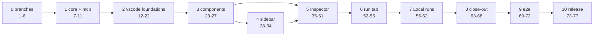

# mBoss — implementation plan: the Signal implementation audit (Turns 8-9)

Step 10 of `ideatoplan`, written 2026-09-13. Inputs:
`design-docs/current-design.md` (as built) and `design-docs/design-delta.md`
(authoritative; a bare "§" reference below is to it, and "this plan's §" is
to this document). Every row is one tickable
unit for `plantocode`, whose Step 14 marks a finished row with a green checkmark beside its
number. Rows are ordered by dependency only. There are no time estimates;
S/M/L is relative size for batching and review, not a prediction, and the
phase order is "what first", not a forecast.

Revised the same day after three reviews (coverage, dependency order and
release mechanics, executability): rows 30, 41 and 55 of the first draft
were split, so the table now runs 1-77. A coverage critic round then
closed its verified gaps in place (no row added or renumbered): split rows
that could not pass their own gates, the SDK-row and read-only-Configure
rules, provenance marks, dependencies, appendix rows and dropped asserts.
A second coverage critic round, also closed in place with no row added or
renumbered, fixed four rows that could not pass their gates (a narrowed
union, a lint check over moved CSS, moved tests carrying another webview's
gestures, and the proposal card's Refine and Undo hooks), stranded tests,
the unproved halves of D1 and D4, dropped §10.3 assertions, appendix rows
and this plan's §5.3 assumption list; its new defaults are this plan's §4
items 48-51.
A third coverage critic round, again closed in place with no row added or
renumbered, fixed three rows that could not pass their gates (a widened
union in row 29, and a shared `replayFrom` schema and point parser that
refused the run-level card's Replay from start), stranded failed-step
tests and fixture builders, a wrong provenance list, the run-tab reveal,
unproved Inspector routing, a kept e2e hook, two dependencies, and
reference and appendix slips; its new default is this plan's §4 item 52.
A plan convergence critic round (`scratch/t89/plan-convergence-critic-r1.md`),
again closed in place with no row added or renumbered, fixed rows that could
not pass their gates: the hand-written message registry in
`src/webview/host.test.ts`, which rows 37, 38, 41, 43, 45 and 60 left red;
the `src/canvas/editorProvider.test.ts` readers row 38 stranded; and an
`E2E_VSIX` default that would read the nested manifest at import and fail e2e
CI's submodule-free `lint-unit` job (row 69). It also gave `see.css`'s
`.state` mix an owning row (55), named the two verbs behind "select a run"
(row 57), completed the fixture-extraction lists (rows 38, 42), gave run-page
tests their destination spec (rows 54, 55), used palette titles with
`runCommand` (rows 70, 72), carried row 71's stack and zone rewrites into row
72, exported the harness maps and fixed the gallery's ground in row 13, and
marked plan-internal "§" references. Its new defaults are this plan's §4
items 53-55. Three gaps in the delta's §7.6, §10.1 and §10.4 were filled at
the same time (see its Revision log).
A second plan convergence critic round
(`scratch/t89/plan-convergence-critic-r2.md`), closed in place with no row
added or renumbered, fixed rows that could not pass their gates: row 60
now names the 31 `render().session` unit reads, the `store.test.ts` and
`view.test.ts` session cases and the `runsInit()` fixture its
`RunsInit.session` removal strands, and says `TestRun.rerun` stays;
row 48 names the 30 two-argument `runWorkflow` calls; row 37 rewrites the
`'Node inspector · Branch'` literal its `heading` rename turns red; and
row 54 names the `view.test.ts` `groups` readers no row held (the
no-document, reused, lost-workflow and "when a run wakes" cases). It also
made row 4 wait for row 1, added the README's palette sentence to row 66,
corrected row 38's claim that `RunCard` is unreachable and pinned the moved
faces to `onRunPage={false}` (row 43's queue case asserts `openRun`), gave
row 44's disabled Configure tab its `notInWorkflow` FieldHint, completed
row 72's picker rewrite, named the assertion of row 54's 4T loop, split
the `recorded` → `reused` rename between rows 46 and 54, made row 69's
clone evidence reachable by a message-only amend, and corrected this
plan's §4 item 8 (and item 44's list). Row 1 and this plan's §1 and §4
item 1 now note that `mboss-vscode` `origin/main` moved to `76fa301`, a
`.claude/`-only commit after `9c6f0db`. The delta's §9 Marketplace list
and §10.4 routing table were corrected at the same time (see its Revision
log).
A third plan convergence critic round
(`scratch/t89/plan-convergence-critic-r3.md`), closed in place with no row
added or renumbered, fixed rows that could not pass their gates. Row 28
now types `SidebarEntry`'s view fields and gives `sidebar.spec.ts` a
`tests/webview/fixtures/sidebar.ts` builder, because a spec cannot call
`sidebarInit`, which imports `vscode`; it also names every `ToolEntry`
literal its required `paths` strands, `readRow` included. Row 35 passes
the panel to `register` so `active()` can answer, and moves
`editorProvider.test.ts`'s two constructions and five static `active()`
calls onto the registry. Row 36 gives `fakeWebview()`
`onDidChangeViewState` and an initial `active`. Row 40 rewrites the
queue label-column case its CSS deletion turns red, and row 45 the
group and fold cases and both `lens.test.ts` describes its
`section(id, { folds })` turns red, ahead of row 50. Row 26 names the
`Drawing`, `CanvasInit` and `SeeGraph` literals it strands. Row 20
corrects the literal count to 26 and names what checks 4 and 6 also find
at HEAD (`.btn` and `.tab` tracking, `canvas.css:765`). Row 54 deletes
`tokens.css`'s `.provenance` rules with the last `provenance` spans, and
the three `TraceGroupView` constants. Row 43 deletes `SeeLineageRun`, its
builders and `LINEAGE`, and row 56 names the untrusted case's `counts`
literal. The new defaults are this plan's §4 items 56 and 57, and item 44
gains the shapes this round found. The delta's §5.1 literal count was
corrected at the same time (see its Revision log).
A fourth plan convergence critic round
(`scratch/t89/plan-convergence-critic-r4.md`), closed in place with no row
added or renumbered, fixed rows that could not pass their gates. `npm run
lint` type-checks the opt-in integration suite under `test/`, so row 56
rewrites `runs.integration.test.ts`'s counts and Recovered filter cases
(Active over the three runs the fixture leaves in flight), and row 58 gives
its stack double and `stackZone.ts`'s `NO_STACK` `answered`; row 57's by-hand
run proves both. Row 56 also names every `rowOf` call and `RunRow.when`
reader outside its ranges, the `ROWS` fixture's `when`/`summary`, and where
the non-defaulting clock and locale come from (this plan's new §4 item 58:
one `Date.now()` per `history.ts` render, and a `HistoryHost.locale()`).
Row 29 types the view fields it adds (`NextEntry.sentence` required and
filled by `sidebarEntries()`; the echo's display copy and the evidence row's
short target rewritten in place) and keeps `ToolEntry.body` required beside
an optional `lines`, extending §4 item 56. Row 26 rewrites the run graph's
node count, which its trigger makes 3. Row 46 keeps the base `.run-status`
rule, which the run tab header's follow word still draws, and row 55 deletes
it with that header. Rows 40, 60 and 61 state computed values as Chromium
serialises them (`7px 0px`; 11.05px, 10.01px and 11.999px within ± 0.05px),
and §4 item 33 says so for every row. Row 65 names `CLAUDE.md:225` (six
`protocol.ts` regions) and `:392` (colour assertions through `palette.ts`).
The delta's §9, §10.3 9b-3 and 9e-1, and §10.4 were corrected at the same
time (see its Revision log).

---

## 1. Overview

### What the plan delivers

The design delta for Claude Design Turns 8 and 9 (8a-8j, 9a, 9b, 9c, 9d,
9e, 9g, 9h and the 9f acceptance checklist), under the four binding user
decisions of §12.1:

- **D1** one shared sidebar Inspector view (`mboss.inspector`) driven by the
  canvas editor and the run tab; the canvas loses its third column, the run
  tab becomes header + canvas + trace, and the "no Configure face on the run
  page" rule is reversed.
- **D2** queue deduplication keeps error-on-save; the Queue card carries the
  full `forms.ts` field set with a rewritten hint.
- **D3** no Debug run anywhere, and no row for it.
- **D4** the Runs panel input is the one run input; the Trigger card
  reflects it read-only and live.

Concretely: a shared Signal component layer and token layer for the six
webviews, pure formatting and state utilities, the Inspector view with its
host subject/focus architecture, the corrected Agent sidebar, Configure
(recipe, Trigger, Queue), Run evidence, run tab, Local runs list and
boundary states, the two bugs (composer sizing and Stop placement; graph
nodes over the Trace tab), the invariant sweeps I-1 to I-28, and the e2e
journeys the redesign moves.

### Repos touched, and their branches

| Repo | Branch for this work | Checked out today | What changes |
|---|---|---|---|
| mboss-core | `core-v0.0.12` (cut in row 2) | `core-v0.0.11` @ `aec2035` (= `main`) | two `NODE_PALETTE` labels, `traceOwners` export, `CONTEXT.md` |
| mboss-mcp-server | `mcp-server-v0.0.7` (cut in row 3) | `mcp-server-v0.0.6` @ `e9cf799` (= `main`) | nested core pin bump only |
| mboss-vscode | `vscode-v0.0.8` (cut in row 1; already checked out) | `vscode-v0.0.8` @ `d877d11` (row 1 finished: the branch was cut off `76fa301`, the `9c6f0db` v0.0.7 merge plus a `.claude/`-only commit; `d877d11` is row 6's manifest-only bump, already landed — see row 6) | the bulk: §4-§8, §10 |
| mboss-e2e-tests | `e2e-tests-v0.0.13` (cut in row 4; already checked out) | `e2e-tests-v0.0.13` @ `665e3f6` (row 4's branch-cut off `f4c8142` already done, plus two out-of-band commits — see row 4) | helpers, selector and journey rewrites, nested pins |
| root `mboss` | `v0.0.38` | `v0.0.38` @ `e15bb9f` (two out-of-band `/release-root` cuts past the `v0.0.36` @ `7895677` this plan assumed, cascading from row 1's release — see row 1); rows 5, 76 and 77 now read `v0.0.38` where they said `v0.0.36`, and row 77 now cuts `v0.0.39` | `.gitmodules` labels and gitlinks; release |

### Repos explicitly untouched

| Repo | Why |
|---|---|
| mboss-skills | `SKILL.md` and `references/*.md` name no palette label and no UI state word (§9); byte-locked to its own design text. |
| mboss-docs | Unmodified Mintlify starter; nothing documents the extension's UI (§9). |
| mboss-database, mboss-zod | Cloud product only; no UI and no core catalog use (§9). |
| mboss-nodejs-api, mboss-nodejs-dbos, mboss-web | Consume only core's `signed-links`/`email` subpaths through their own nested pins; the catalog rename is outside those, so no bump (§9). e2e's nested pins of these three already equal root's and do not move. |

### Phase structure

| Phase | Rows | Repo(s) | Purpose |
|---|---|---|---|
| 0 Branches and baseline | 1-6 | all touched | cut the four development branches, relabel root, set the vscode manifest to 0.0.8 |
| 1 Core and MCP server | 7-11 | core, mcp-server, root | the label rename and `traceOwners`, released and pinned before any consumer reads them |
| 2 vscode foundations | 12-22 | vscode | pins, test harness, pure utilities, the owner map in `readRun`, the token layer |
| 3 Shared Signal components | 23-27 | vscode | the component primitives with their smallest consumers (gallery, QuickAdd, canvas toggle, palette, node face); checkpoint |
| 4 Agent sidebar | 28-34 | vscode | 8a, 8b, 9a, the composer bug and attaching files |
| 5 Inspector | 35-51 | vscode | D1 host architecture, then Configure, Run evidence, run-level, Trigger (D4), Queue (D2); checkpoint |
| 6 Run tab | 52-55 | vscode | 8f, 8g, 8i, 9d and the graph-over-trace bug |
| 7 Local runs | 56-62 | vscode | 8h, 9e, 9h boundary states; checkpoint |
| 8 Close-out | 63-68 | vscode | cross-view sweep, adherence closure, docs, README and screenshot, the 0.0.8 package |
| 9 e2e journeys | 69-72 | e2e-tests | helpers, `extension` and `extension-stack` journeys against the 0.0.8 package |
| 10 Release train | 73-77 | vscode, e2e-tests, root | `/release-vscode`, e2e re-pin, `/release-e2e-tests`, pre-flight, `/release-root` |

Phase 4 depends on phases 2-3 and the phase 3 checkpoint (row 27). Phase 5
needs one thing from it: row 34 creates `Callout` and removes the
`preview-card` class, which rows 40, 42 and 43 rely on. Beyond that the two
phases share no files; phase 4 goes first because it is smaller and carries
one of the two bugs. The order is "what first", not a prediction.

### Rules every row follows

These are not repeated in each row.

- **Before starting**, run `git -C <repo> status` and
  `git -C <repo> branch --show-current`: the checkouts are live-shared with
  other sessions. Work lands only on the branch the row names.
- **Test first.** The row's "Done when" names the failing test to write
  first; watch it fail for the reason the figure names, then make it pass.
  A test that would pass vacuously (a count of 0 on an absent hook, an
  `indexOf` order on absent elements, a geometry read on an empty page) gets
  a count guard first.
- **mboss-vscode gates** (every vscode row): `npm run lint` (tsc, eslint,
  prettier), `npm test` after a build (an unbuilt `dist/` shows as skipped
  cases), `npx playwright test` (the webview tier rebuilds `dist/`), and
  `npm run strings` whenever a word bag or `messages.ts` changes, with
  `l10n/bundle.l10n.json` and `tests/webview/words.json` committed.
  mboss-core, mboss-mcp-server and mboss-e2e-tests: `npm run lint` and
  `npm test` in that repo.
- **Theming.** Colours come from the token layer only (`--vscode-*` chrome,
  Signal voice roles); no hex, `rgb(`, `hsl(` or `color-mix(` outside
  `tokens.css`'s source blocks; no theme selector outside `tokens.css`.
  "4T" means light, dark, high-contrast and high-contrast-light, with
  expected literals read from `tests/webview/palette.ts` (row 13).
- **Code style.** Code wraps at 80 columns and comments at 50 (measured by
  content); comments state the reasoning. No comment, test title,
  `describe` name or identifier cites a design-doc section, figure id,
  callout, 9f line id, invariant number, check number, row number or
  `[Dnn]` marker: the ids in these rows tell the implementer which delta
  line a case proves, and the test says what the product does. Commit
  subjects follow `mboss-vscode/CLAUDE.md`: one imperative sentence naming
  what the product now does or refuses, prose body.
- **Line numbers.** Every `file:line` in this plan is read at mboss-vscode
  `9c6f0db`, mboss-e2e-tests `f4c8142`, mboss-core `aec2035` and
  mboss-mcp-server `e9cf799`, and drifts as earlier rows land. (mboss-vscode
  has since moved to `d877d11` and mboss-e2e-tests to `665e3f6` — row 6's
  manifest-only bump and row 4's out-of-band helper/pin commits, §1's Repos
  touched table — neither of which touches a file any citation in this plan
  names, so every citation above still resolves at those tips exactly as at
  `9c6f0db`/`f4c8142`.) Locate a
  cited test by its title (§10.4's routing table names the run-page ones)
  and a cited rule by its selector; where a range starts or ends inside a
  test, the whole test is meant. Full paths are given wherever a bare file
  name would match more than one file.
- **Shared webview fixtures.** Playwright refuses a spec that imports
  another spec, so a fixture or helper two specs need lives in a module
  under `tests/webview/fixtures/` (rows 38 and 42 create the canvas and
  runs ones), never in a spec.
- **No English in `src/webview/signal/`**; copy comes from the view's word
  bag (§4.1). Every new webview message needs its zod schema, `heard`
  branch and host verb in the same row (a registered but unwired kind does
  nothing).
- **By-hand evidence.** Where a row's proof is run by hand (the opt-in
  `extension-stack` project, a screenshot, an integration suite), the
  commands and results go into the commit message, not only into the
  agent's return value.
- **Nested pins are hand-edited**: a `/release-*` command moves only the
  root pin. A nested bump updates the gitlink and its `.gitmodules`
  `branch =` label together, labelled with the branch root's `.gitmodules`
  records for that commit. The nested clones' remote refs are stale and
  `git submodule update` checks out whatever the parent's index records,
  so every bump runs, per nested path, in this order:
  `git -C <parent>/<nested> fetch origin`;
  `git -C <parent>/<nested> checkout <target sha>`;
  `git -C <parent> add <nested>` (before any submodule update); then, for
  a nested repo that nests others, `git -C <parent> submodule update
  --init --recursive <nested>`.
- mboss-vscode's `package.json` `version` stays `0.0.8` for the whole plan.

---

## 2. Task table

Tags in "Figures / callouts" follow §11 (C current, A adapted, E existing,
I impossible-as-drawn). "CHECKPOINT" and "RELEASE" rows are marked in the
Task column.

### Phase 0 — Branches and baseline

| # | Repo | Branch | Task | Depends on | Delta sections | Figures / callouts covered | Done when | Size |
|---|---|---|---|---|---|---|---|---|
| 1 | mboss-vscode, root | `main` → `vscode-v0.0.8` (done); root `v0.0.36` → `v0.0.38` | **CHECKPOINT (user-run) — done.** The in-progress `/release-vscode` for v0.0.7 finished: step 7 cut `vscode-v0.0.8` off the synced `main` (`76fa301`, the `9c6f0db` merge plus one commit touching only `.claude/agents/fable-engineer.md`) and pushed it; step 8 set root `.gitmodules` `submodule.mboss-vscode.branch = vscode-v0.0.8`, synced, and committed `.gitmodules` + the `mboss-vscode` gitlink on root (`52aa52c`). The release then cascaded past this row's own fallback case, exactly as anticipated: the user went on to `/release-e2e-tests` (re-pinning e2e's nested vscode to the released tip and cutting `e2e-tests-v0.0.13`, `a1e7231`) and `/release-root`, twice (`v0.0.36` → `v0.0.37` merging that work, `efb5e74`; then a `.gitmodules` label-only correction for the core/mcp-server branch names already checked out, `6759948`, merged as `v0.0.37` → `v0.0.38`, `e15bb9f`). Per this row's own parenthetical, rows 4, 5 and 69-77 take these post-cascade facts as their starting branch names and base commits, not the hypothetical ones this row was written against. No plan agent ran this. | — | §9 (release order, step 3) | — | `git -C mboss-vscode branch --show-current` prints `vscode-v0.0.8` (confirmed); `git -C mboss-vscode ls-remote --heads origin vscode-v0.0.8` lists it (confirmed); root `git log -1 -- .gitmodules` is the release commit; root `git status` shows no `M mboss-vscode`; `git -C mboss-e2e-tests branch --show-current` now prints `e2e-tests-v0.0.13`, not `e2e-tests-v0.0.12`, and root `git branch --show-current` now prints `v0.0.38`, not `v0.0.36` — the cascade described above already happened, so rows 4, 5 and 69-77 start from these branch names and base commits. | S |
| 2 | mboss-core | `core-v0.0.12` | Cut `core-v0.0.12` from `aec2035` (`origin/main`; the local `main` ref is stale at `820d826`) and push it. | — | §9 | — | Remote head `core-v0.0.12` = `aec2035`; `npm ci && npm run lint && npm test` green there (baseline recorded in the plantocode notes). | S |
| 3 | mboss-mcp-server | `mcp-server-v0.0.7` | Cut `mcp-server-v0.0.7` from `e9cf799` (`origin/main`; the local `main` ref is stale at `6b05286`, which lacks `8b1e13f` "Bundle trigger payload validation"); write `mcp-server-v0.0.7` into `.version` and commit it ("Stamp mcp-server-v0.0.7"); push; open the PR `--base main --head mcp-server-v0.0.7` so the stamp commit has a CI run (as `/release-mcp-server` step 8 does for every cut). | — | §9 (step 2) | — | PR open with CI `success` on the stamp commit; `git -C mboss-mcp-server rev-parse HEAD~1` is `e9cf799…`; the repo's own version test passes with the branch checked out. | S |
| 4 | mboss-e2e-tests | `e2e-tests-v0.0.13` | **Branch-cut done, out-of-band.** `e2e-tests-v0.0.13` was cut from `f4c8142` (`origin/main`; the local `main` ref was stale at `587d1aa`) and pushed, exactly as planned here, when row 1's release cascaded into `/release-e2e-tests`. The branch now carries two more commits beyond that base, landed by that cascade rather than by this row, which later rows build on: `8e2eae5` ("Install the package the extension's manifest names") adds a lazily-evaluated `e2eVsix()` to `helpers/vscode.ts` (plus `test/vscode.test.ts`), reading the nested `mboss-vscode/package.json` name and version for the `E2E_VSIX` default without breaking the submodule-free `lint-unit` CI job; `665e3f6` ("Test mboss-vscode 0.0.8") bumps the nested `mboss-vscode` gitlink from `a459c89` (the v0.0.6 merge) to `d877d11` (the interim tip of `vscode-v0.0.8` — row 6's version-bump commit, not yet `T-vscode`) and its `.gitmodules` label to match. Row 69 has to reconcile its own `helpers/vsix.ts` plan against the `e2eVsix()` shape already landed, and re-bump the nested pin to the real `T-vscode` once Phase 8 lands (see row 69). | 1 | §9 | — | Remote head `e2e-tests-v0.0.13` exists, now two commits ahead of `f4c8142` at `665e3f6` (confirmed); `npm run lint && npm test` (hermetic vitest) green. | S |
| 5 | root | `v0.0.38` | Point root, now on `v0.0.38` (two out-of-band `/release-root` cuts past this plan's assumed `v0.0.36` — row 1), at the development branches: `git config -f .gitmodules` branch labels `core-v0.0.12` and `mcp-server-v0.0.7` (both currently still read `core-v0.0.11`/`mcp-server-v0.0.6`, matching what's checked out, since those dev branches don't exist yet — this row is what moves them once rows 2 and 3 cut them); leave the `e2e-tests-v0.0.13` label alone, since the cascaded `/release-e2e-tests` already set it (`a1e7231`), and leave the `vscode-v0.0.8` label row 1 already set alone too — this row must not stomp either; move the `mboss-mcp-server` gitlink to row 3's stamp commit (core and e2e gitlinks are unchanged); `git submodule sync`; commit on `v0.0.38`, staging only `.gitmodules` and `mboss-mcp-server` (rows 7 and 8 may already have moved the `mboss-core` checkout past root's gitlink, and staging it would record an unreleased commit). | 1, 2, 3, 4 | §9 (root row) | — | `git diff HEAD~1 --stat` shows only `.gitmodules` and `mboss-mcp-server`; `git ls-tree HEAD mboss-mcp-server` is row 3's stamp commit; `git config -f .gitmodules --get submodule.mboss-core.branch` prints `core-v0.0.12`; `git config -f .gitmodules --get submodule.mboss-e2e-tests.branch` still prints `e2e-tests-v0.0.13` and `submodule.mboss-vscode.branch` still prints `vscode-v0.0.8`, both unchanged by this commit. | S |
| 6 | mboss-vscode | `vscode-v0.0.8` | **Manifest half done, out-of-band; baseline half still open.** `d877d11` ("Package the extension as version 0.0.8") already ran `npm version 0.0.8 --no-git-tag-version`, moving `package.json` and `package-lock.json` to `0.0.8` (2 files, 3 insertions/3 deletions total) — landed by row 1's cascaded release, not by this row, and its commit body only explains the version-bump rationale (the Marketplace refuses a version it already has; the manifest and lockfile move with the branch). It records no build/unit/Playwright/lint baseline count. That half of this row still needs doing before Phase 2 starts: build, then unit, Playwright and lint counts, recorded in a commit body (a new commit on this branch, since amending `d877d11` would rewrite a commit already pushed and reasoned about above). | 1 | §9 (step 3) | — | Both files already read `0.0.8` (confirmed, `d877d11`); `npm run package` writes `mboss-vscode-0.0.8.vsix`; all vscode gates green with counts recorded in a commit body. | S |

### Phase 1 — mboss-core and mboss-mcp-server

| # | Repo | Branch | Task | Depends on | Delta sections | Figures / callouts covered | Done when | Size |
|---|---|---|---|---|---|---|---|---|
| 7 | mboss-core | `core-v0.0.12` | Rename `NODE_PALETTE` labels in `src/ir/catalog.ts`: `durableWait` → "Durable wait", `emailSend` → "Email send". Update `CONTEXT.md` where it says "ten" kinds, "queues are not kinds", "Wait", and that `NODE_PALETTE` is the only place a label is written (`:75,77,139,185`). | 2 | §7.7 (one label per kind), §9, Q-1 | 8e-5 (C) | First: a case in `src/ir/catalog.test.ts` pinning both labels (red on "Wait"/"Email"). Then `npm run lint && npm test` green. | S |
| 8 | mboss-core | `core-v0.0.12` | Export `traceOwners(grammar: TraceGrammar, rows: readonly RecordedRow[]): Map<number, string>` (function id → node id) from `src/compile/replay.ts`, computed by the same walk `matchTrace` runs; re-export it from `src/compile/index.ts` and the barrel. The walk's leaf shapes must carry the node they came from (`nodeShape` returns `oneRow('DBOS.sleep')` for a timer wait with no id today). A row the walk cannot attribute is absent from the map. `matchTrace`, `replayBoundaries` and every existing golden are unchanged. | 2 | §7.5.4 (Ownership), §9 | 8g-2, 9d-7 (C, data half) | First, in `src/compile/replay.test.ts`: step → timer `durableWait` → step gives the `DBOS.sleep` row to the wait; a form wait gives its `.register` row and its `DBOS.recv`/`DBOS.sleep` pair to the wait; a queue block's child-start row goes to the queue; rows after a structure mismatch are absent. `src/index.test-d.ts` imports `traceOwners` by name (the surface check is typecheck-only). `npm run lint && npm test` green. | M |
| 9 | mboss-core | `core-v0.0.12` → `core-v0.0.13` | **RELEASE.** `/release-core`: PR to `main`, watch CI, merge, cut `core-v0.0.13`, root label `core-v0.0.13` + gitlink = the merge commit (call it M-core). Runs after row 5 so row 5 cannot write `core-v0.0.12` back over this release. | 5, 7, 8 | §9 (step 1) | — | PR merged with CI `success`; remote `core-v0.0.13` exists at M-core; root commit on `v0.0.38` records it. | S |
| 10 | mboss-mcp-server | `mcp-server-v0.0.7` | Bump the nested `mboss-core` gitlink to M-core and its `.gitmodules` label to `core-v0.0.13` in the bump order of this plan's "Rules every row follows" (fetch, checkout, `add`; core nests nothing, so no submodule update); `npm ci && npm run build:bundle`. No source edit: `node-catalog` reads `NODE_PALETTE`, so agents now see "Durable wait"/"Email send"; `project_debug` keeps raw status and full ids. | 3, 9 | §9 (mcp-server row) | 8e-5 (C, agent catalog) | No new test (the catalog tests compare against `NODE_PALETTE`); `json-schema.test.ts:73-76`, `resources.test.ts:202` and `skill-sync.test.ts` green unchanged; `git diff tools.manifest.json` empty; `.version` still `mcp-server-v0.0.7`; lint and test green. | S |
| 11 | mboss-mcp-server | `mcp-server-v0.0.7` → `mcp-server-v0.0.8` | **RELEASE.** `/release-mcp-server`: reuses row 3's PR, merges after CI, cuts `mcp-server-v0.0.8` with its `.version` stamp commit (call it S-mcp), opens that branch's PR so S-mcp has CI, bumps root to label `mcp-server-v0.0.8` + gitlink S-mcp. | 10 | §9 (step 2) | — | PR merged; the `mcp-server-v0.0.8` PR's CI on S-mcp is `success`; root commit on `v0.0.38` records S-mcp. | S |

### Phase 2 — mboss-vscode foundations

| # | Repo | Branch | Task | Depends on | Delta sections | Figures / callouts covered | Done when | Size |
|---|---|---|---|---|---|---|---|---|
| 12 | mboss-vscode | `vscode-v0.0.8` | Consume core and the server. Bump nested `mboss-core` to M-core (label `core-v0.0.13`) and nested `mboss-mcp-server` to S-mcp (label `mcp-server-v0.0.8`) in the bump order of this plan's "Rules every row follows": fetch and check out each, `git add mboss-core mboss-mcp-server`, and only then `git submodule update --init --recursive mboss-mcp-server` (run before the `add`, it resets the checkout to the old gitlink); `npm run build:mcp`. Mirror the labels in `paletteLabels()` (`src/canvas/words.ts`: "Durable wait", "Email send") and update the literals that pin them (`src/canvas/graph.test.ts:772-773,830`, `tests/webview/canvas.spec.ts:353`). Nested skills pin and label untouched. | 6, 9, 11 | §7.7, §9 (vscode row, step 3) | 8e-5 (C) | First: `src/pins.test.ts:25-58` expects `core-v0.0.13` and `mcp-server-v0.0.8` (red), and `src/core/index.test.ts:139-150` goes red on the bumped core until `paletteLabels()` follows. Then all vscode gates green; `git -C mboss-vscode submodule status --recursive` shows `mboss-core` at M-core, `mboss-mcp-server` at S-mcp and `mboss-mcp-server/mboss-core` at M-core, none with `+`; the bundled server's node catalog and the canvas agree (both read M-core). | S |
| 13 | mboss-vscode | `vscode-v0.0.8` | Test harness for the redesign (§10.1): `tests/webview/harness.ts` `ThemeKind` gains `high-contrast-light` (stamps both `vscode-high-contrast` and `vscode-high-contrast-light`, sets `data-vscode-theme-kind` for every theme) with VS Code 1.135 registry defaults; every map gains `--vscode-input-background/-foreground/-border`, `--vscode-focusBorder`, `--vscode-input-placeholderForeground`; both high-contrast maps gain `--vscode-contrastActiveBorder`, and high-contrast-light `--vscode-button-background`; `mount()` options `fontSize`, `bodyClass`, `width`; returned `retheme(kind)`; exported `THEMES_ALL`, and the per-theme variable maps exported as `THEMES` (a private `const` at `harness.ts:30` today, which `palette.ts` could not otherwise read). New `tests/webview/palette.ts`: expected colours per theme from the exported `THEMES` maps (chrome) and `tokens.css` source hex (voice), sRGB mixing for derived tokens, role resolution over the tokens `tokens.css` declares today (row 21 adds the roles it introduces), and `sameColour(a, b)` parsing `rgb()`, `rgba()` and `color(srgb …)` within ±1/255. `playwright.config.ts` `use: { locale: 'en-US', timezoneId: 'UTC' }`; any spec that depended on the machine's zone builds epochs with `Date.UTC(...)`. | 6 | §10.1 | G8 (harness half) | First: extend `sidebar.spec.ts` "every theme the editor publishes" (`:977-1013`) and `canvas.spec.ts` theme smoke (`:4753-4811`) to `THEMES_ALL` (red on the missing map); add a `gallery.spec.ts` case that mounts in light, calls `retheme('dark')` and reads the new body classes and the dark editor ground literal (`--vscode-editor-background`) from `palette.ts` without a remount (the gallery is an editor panel: its body paints `--canvas`, which `tokens.css:83` maps to the editor background, and `gallery.css` does not re-point it to the side bar). All webview specs green under en-US/UTC. | M |
| 14 | mboss-vscode | `vscode-v0.0.8` | `src/webview/ids.ts` `shortRunId(id)`: exact canonical UUID → `#` + first 4 hex; `run_<ms>_<hex>` → first 4 of the hex group; any other id → 4 lowercase base-36 characters of a 32-bit FNV-1a hash; always `^#[0-9a-z]{4}$`. `newRunId()` (`src/runs/runner.ts:188`) mints `crypto.randomUUID()`. Old tail shorteners stay until rows 26 and 47 delete them. | 6 | §6 (`shortRunId`, `newRunId`), I-13, Q-11 | 8h-3, G5 (C · A) | First: `src/webview/ids.test.ts` (UUID; `run_…`; two `sched-nightly-…` firings differ; `<uuid>`, `<uuid>-3`, `<uuid>-4` distinct; upper-case caller id and `orders:etl:ORD-19AB` give lowercase; a 2-char id gives 4 chars; every output matches the pattern) and `src/runs/runner.test.ts:201` expecting a UUID. Gates green. | S |
| 15 | mboss-vscode | `vscode-v0.0.8` | `src/webview/time.ts`: hand-formatted `fine(epoch)` (`HH:MM:SS.mmm`, no locale call), `clock(epoch)` (moved from `runs/view.ts:911-916`), `when(epoch, now, locale)` (same day → clock; else `Intl.DateTimeFormat(locale, { month: 'short', day: 'numeric', numberingSystem: 'latn' })` + clock; neither parameter defaults), `duration(ms, words)` (ms / one-decimal s / `m s` / `h m` / `d h`, zero trailing unit dropped). `durationWords()` in `canvas/words.ts` (milliseconds, seconds, minutes, hours, days), read by the webviews and `view.ts`. Replace both duration copies (`runs/view.ts:905-909`, `EvidenceCard.tsx:1124-1128`); one base: a run is `completedAt − createdAt` everywhere (`src/canvas/inspector/evidence.ts:322` `startedAt` base goes), a step `completedAt − startedAt`. The host passes `vscode.env.language`. | 6 | §6 (time rows), I-14, Q-12, Q-31 | 8f-7, 8h-5, G4, 9e-6 (C) | First: `src/webview/time.test.ts` inverts `:39-42` and adds en-US/fi-FI/ar-EG `when` cases with epochs from local components, 23:59/00:00, midnight `00`, `134000 → 2 m 14 s`, `604800000 → 7 d`; `src/runs/view.test.ts:105-114` inverted and `:811-821` rewritten; `canvas.spec.ts:1079-1084,2887-2892` clocks anchored `^…$`. Gates green. | M |
| 16 | mboss-vscode | `vscode-v0.0.8` | `src/webview/states.ts`: `GlyphState`, `runWord(run)`/`stepWord(step)` (keys only) and `glyphOf(state)` (tone + mark) per the §6.1 table, including the "parked" evidence each reader names (run tab: uncleared `.register` or asleep `DBOS.sleep`; list: last own row `.register`/`.resend` or `sleeping_until > now`), cancelled → `idle`, gave up → `failed` glyph with its own word. `canvas/words.ts` `runOutcomes` gains `recovering`, `queued`, `gaveUp`. | 6 | §6.1, R4, Q-21 | G6 (C, data half), Map 7 | First: `src/webview/states.test.ts` over every row of the §6.1 table. Gates green. | S |
| 17 | mboss-vscode | `vscode-v0.0.8` | Recorded values (§6): in `src/runs/rows.ts` add `storedValue(stored)` → `{ raw, shown, cut, bytes, absent }` (superjson marker pair unwrapped before the `OUTPUT_KEPT` cut; `absent` for `meta.values` exactly `["undefined"]`), `inlineJson(value)`, `INLINE_LIMIT = 120`; `inputIn` gains the marker check and the portable `positionalArgs` shape. `reading.ts` `attributed()` and `watch.ts` `liveStepOf` use `storedValue` (`Operation`/`LiveStep` gain `shown`, `bytes`, `absent`; `output` stays raw for the agent payload and `openOutput`). `LiveRun` gains `executorId` and carries the `RunInput` beside `input`, set where the watch builds it (never by decorating `live()`, which would break the followed run's identity). The canvas Evidence card's output `<pre>` shows `shown` until row 46 replaces it. The widened types strand every whole literal of them, which changes in this row because `npm run lint` type-checks tests: `src/test-support/runs.ts` `liveRun()` (`:333-351`) and `liveStep()` (`:355-370`), `src/canvas/editorProvider.test.ts` `runOf()` (`:308-323`), `src/canvas/graph.test.ts` `run()` (`:108-128`), `src/runs/watch.test.ts` `recordedStep()` (`:160-179`), `tests/webview/canvas.spec.ts` `runOf()` (`:932-952`) and `tests/webview/runs.spec.ts` `LIVE` (`:591-613`) each gain the new step or run fields; any other whole literal `tsc` names goes the same way. | 6 | §6 (`storedValue`, `inputIn`, `inlineJson`, `INLINE_LIMIT`), §7.4 Data changes, §7.5.6 item 2, I-15 | 8f-12, 8g-7, G7 (C) | First: `rows.test.ts` (5000-char envelope → unwrapped, `cut: true`, original `bytes`; a value with its own `json` key and no marker stays wrapped; `absent` vs a real `null`; `inputIn` enveloped one-arg array, `{positionalArgs:[x]}`, two-arg array stays `raw`); `reading.test.ts` (unwrap before cut); `watch.test.ts` (`executorId`, `RunInput`). The builders and literals named above compile with the new fields (`npm run lint` green). Gates green. | M |
| 18 | mboss-vscode | `vscode-v0.0.8` | Host-only `src/paths.ts` `displayPath(absolute, root)`: today's `inProject` (`runs/replayZone.ts:549-557`) moved and renamed, not copied; `replayZone.ts` imports it. Excluded from the webview import list. | 6 | §6 (`displayPath`), I-18, R5 | 8a-4 (C, data half) | First: `src/paths.test.ts` (under root → POSIX relative; outside or equal → absolute), carrying any `inProject` cases from `replayZone.test.ts`. `imports.test.ts` still green. Gates green. | S |
| 19 | mboss-vscode | `vscode-v0.0.8` | One owner map for every reader (§7.5.4). `readRun` (`runs/reading.ts`) takes a sixth argument `document: WorkflowIR \| undefined`; when present it calls `traceOwners(traceGrammar(document), rows)` (guarded: `traceGrammar` throws `UnsupportedIR` for a block it cannot describe, which falls back to no map; no grammar cache, since `traceGrammar` is an in-memory plan of one document and the tick already reads the database) and gives a timer `durableWait`'s `DBOS.sleep` row `owner: 'node'`, `nodeId` the wait, `state` `waiting` while `completedAt > now` else `done`; every other SDK row keeps `owner: 'sdk'`. Re-export `traceOwners` from `src/core/index.ts` beside `traceGrammar` (the only file allowed to import `@mboss/core`). Add a `timerThenAnswer` IR fixture to `src/test-support/runs.ts`, copied from `mboss-e2e-tests/fixtures/projects/timer-then-answer/.mboss/workflows/timer_then_answer.workflow.json` with its node ids (`started_by_hand`, `let_it_wait`, `answer_it`) kept, plus its recorded-row and `LiveRun` builders; the cases below read it. Callers: `src/runs/view.ts` `seeRun` and `src/runs/evidence.ts:322` pass their IR; the watch receives the saved document `following.ts` `arm` already reads, beside `queueNodes`. `liveRunOf` keeps the attributed row; `graph.ts` `parkedAt` returns a waiting sleep row's deadline as a wake and `lineFor` fills a new optional `waitingWakes` word ("waiting · wakes {0}", in `canvasWords()` beside `waitingSince`; the canvas passes both, the run graph neither). Grep every reader of a row's owner/state (`liveRunOf`, `parkedAt`, `recordedStates`, `evidenceOf`, `outcomeOf`) before changing the attribution. | 8, 12, 15 | §7.5.3 (timer wait tone), §7.5.4 (Ownership, One owner map), §6.1 | 8f FUTURE caption (C · E), 9c-1 and 9d-4 and 9d-7 (C, data half) | First: `src/runs/reading.test.ts` (timer wait's sleep row `owner: 'node'`, waiting/done by `now`; form wait's recv/sleep stay `sdk`; `document` undefined keeps `sdk`; a `document` holding a block `traceGrammar` cannot describe returns the rows with every SDK row `owner: 'sdk'` and does not throw; `'unasked'` gate unchanged); `watch.test.ts` and `following.test.ts` (`arm` hands the document; a tick over sleeping `timerThenAnswer` holds the row with `nodeId: 'let_it_wait'`); `graph.test.ts` `tonesOf` over that `LiveRun` (while it sleeps `let_it_wait` and `e1` waiting with `e2` untoned; after it wakes and `answer_it` finishes, `let_it_wait`, `e1` and `e2` done; the line reads "waiting · wakes {fine(completedAt)}"; the same run without attribution leaves it untoned — the failing case); `src/canvas/inspector/evidence.test.ts` `evidenceOf('let_it_wait')`; `openRun.test.ts` step → timer wait → step, and a form wait: the timer wait's sleep is its own row while the form wait's recv/sleep pair stays `owner: 'sdk'`; `src/core/index.test.ts:312-320` identity case gains `expect(fromIndex.traceOwners).toBe(fromCore.traceOwners)`. Every existing `readRun(...)` and `watch()` call gains the argument. Gates green. | M |
| 20 | mboss-vscode | `vscode-v0.0.8` | Token layer, voice and scale (§5.1, §5.2 non-colour). Delete `text-transform: uppercase` from the ten shared rules in `tokens.css` and the 21 per-view rules (`sidebar.css` ×9, `see.css` ×4, `runs.css` ×6, `canvas.css` ×2); add `.state-word` (`--text-state`, `--w-semibold`, `--state-tracking`) as the only uppercase rule; keep `--label-tracking: 0.05em`, add `--state-tracking: 0.08em`, delete the 26 hand-written `letter-spacing` literals (`sidebar.css` ×12, `see.css` ×2, `canvas.css` ×2, `runs.css` ×7 including `.filters .count`'s `0` at `:449`, and `tokens.css` ×3: `.eyebrow`'s `0.08em`, `.title`'s `-0.01em` and `.tab-count`'s `0` at `:581`) and the `letter-spacing: var(--label-tracking)` on `tokens.css`'s `.btn` (`:475`) and `.tab` (`:556`), which check 4's selector clause refuses (a Button and a tab carry no tracking). Add `--text-state`, redefine `--text-xs`/`--text-sm` with the 10px floor, add `--text-control`, `--w-regular/medium/semibold/bold`, `--r-xs`, `--leading-tight/body`, `--space-0-5/1-5/2-5/3-5/5/7`, `--dur-pulse`/`--dur-breathe` (loops move to them; `--dur-slow` becomes 400ms once no loop reads it), `--rest-border`, `--control-edge`, `--hover-outline` (transparent, on `:root`). Sentence case for the copy §5.1 lists that no later row deletes: `canvas/words.ts:126,134` (node lines), `:529` ("Lib function"), `messages.ts:1166,1180,1217` (proposal banner, Q-27), `messages.ts:921` (the notification quoting "Replay from here"). New `src/webview/styles.test.ts` (content-regex over `src/**/*.css` and `.tsx`) with checks 1, 2, 3, 4 and the `font-family` half of 6 (every family is `var(--font-body)` or `var(--font-mono)` outside `@font-face`); that half refuses `canvas.css:765`'s `.section-head { font-family: inherit }`, which becomes `var(--font-body)`, the family `body` already sets (`tokens.css:262`), so nothing renders differently. | 13 | §5.1, §5.2, §5.6 checks 1-4 and 6, I-1, I-2, I-7, I-10, Q-27 | 8c band, R1, G1 and G2 and G9 (C, unit half) | First: `styles.test.ts` checks 3, 4 and the family half of 6 red at HEAD (check 4 on the 26 literals and on `.btn` and `.tab`, check 6 on `canvas.css:765`; checks 1 and 2 pass today; prove each bites by injecting a literal). Rewrite `canvas.spec.ts:4813-4861` (tab tracking, caps), `preview/model.test.ts:62,130` and `preview.spec.ts:66-70` (banner copy). Gates green. | M |
| 21 | mboss-vscode | `vscode-v0.0.8` | Token layer, colour (§5.2 colour, §5.3, §5.4). On `body`: `--brand-hover`, `--primary-ground`, `--selection-ring`; light parity tints, diff grounds, grid dot and done edge at Signal's values; the `vscode-dark` retune block exactly as §5.3 prints it (`body.vscode-dark:not(.vscode-high-contrast)`); the dark voice block becomes `body.vscode-dark, body.vscode-high-contrast:not(.vscode-high-contrast-light)`; one `body.vscode-high-contrast` block and a later `body.vscode-high-contrast-light` block (`--state-ink`, `--edge-done`, `--primary-ground`, `--brand-hover`) as printed; `color-scheme` light/dark per theme. Re-point `canvas.css:464` `.preview-node` to `border: 1px dashed var(--brand-ring)` (no mix). `styles.test.ts` check 5 (I-6). Extend `tests/webview/palette.ts` role resolution with the roles this row introduces: state-toned text reads `--state-ink` first, a primary fill reads `--primary-ground`, and `--selection-ring` resolves per theme. Sweep every existing 4T colour literal and "border 0" assertion the re-points strand. | 20 | §5.2, §5.3, §5.4, §5.6 check 5 and mix table (canvas row), I-3 (token clause), I-6, Q-13, Q-37, Q-39 | G8, G10 (C · E; I for the Signal-file fix), 9a/9b/9c/9d/9e/9g dark halves (token half), 9h caption dark inks (E) | First: check 5 with its regression proof (move `--selection-ring` onto `:root`, watch it fail); a `tests/webview/signal.spec.ts` "tokens" block: under high-contrast-light computed `--brand`/`--ok` equal the light values; in all four themes `palette.ts`'s expected `--state-ink`, `--primary-ground` and `--selection-ring` each equal the value computed on a mounted body (a role a theme leaves undeclared reads empty on both sides); every view body's computed `color-scheme` is `light` in light and HC-light, `dark` in dark and HC-dark; a sidebar diff add row's ground equals the `palette.ts` dark and HC literal; `canvas.spec.ts:3954-3959` splice gap reads `--brand-tint` at 8%. Gates green. | M |
| 22 | mboss-vscode | `vscode-v0.0.8` | React Flow, motion and board CSS (§5.5, §7.7 board hygiene, §8.2 marker half). Declare the un-suffixed `--xy-*` names on `body` as printed; editor `<Background>` gap 20 with no `color` prop; `.canvas-grid` 20px; move `.wire`, `.wire-markers`, the dash-flow rule and the handle rules from `canvas.css:504-569` into `tokens.css` after xyflow's sheet (fixes the 300×150 marker SVG that displaced the run graph); run-graph handles `[data-run-node] .react-flow__handle { opacity: 0; pointer-events: none }`; `WireMarkers` (`Wire.tsx:92-106`) path `M 1 1 L 9 5 L 1 9`, `fill="none"`, stroke per state, width 2, round caps and joins; `.react-flow .react-flow__node.selectable:focus-visible` outline at (0,4,0); the reduced-motion `@media` block also collapses `--dur-pulse`/`--dur-breathe`, plus the written-out `body.vscode-reduce-motion` twin; `.node-run[data-run='running']` reads `var(--dur-pulse)`. `build.test.ts` check 7. | 13, 21 | §5.5, §5.6 check 7, §7.5.3 (no ports, edges, chevron), §7.7 (board hygiene), §8.2, I-5, I-22, I-25, I-28 (editor) | 8f-4 (C, clipping), 8f-6, R8 (C), 8i edges/no ports box, 9d-3 and 9d-4 (C, CSS half), Map 12 | First: `build.test.ts` check 7 (every `var(--xy-X, var(--xy-X-default))` the built `see.css`/`canvas.css` reads for a rendered part has `--xy-X` in `tokens.css`; no `-default` name in `src`), written against minified output with canonicalised spacing. `runs.spec.ts` run-page cases: every `.react-flow__handle` `opacity: 0`, `pointer-events: none`, `elementFromPoint` at a handle centre is the node; `.wire-markers` 0×0; each marker path `fill: none` and stroke equal to its wire's literal; edge `stroke-width: 1.5px`; handle, edge, selected-edge and editor background-dot `fill` literals none equal to a React Flow default (4T); `canvas.spec.ts:821-833` hover handles kept; an editor wire's marker `fill: none`; a focused editor node's `outline-style: solid` with the focus-border literal (4T); I-25 with `page.emulateMedia({ reducedMotion: 'reduce' })` and separately `bodyClass: 'vscode-reduce-motion'` (sidebar fixture with an in-progress tool row). Gates green. | M |

### Phase 3 — Shared Signal components

Each component lands with its smallest real consumer, so a Playwright spec
exercises it in the row that creates it. Callout lands with its first
consumer, the sidebar failure (row 34). PropertyRow and Field have no small
consumer and land with the Inspector's field chrome (row 40), before the
Runs list reads them.

| # | Repo | Branch | Task | Depends on | Delta sections | Figures / callouts covered | Done when | Size |
|---|---|---|---|---|---|---|---|---|
| 23 | mboss-vscode | `vscode-v0.0.8` | Create `src/webview/signal/` with `Button.tsx` (variants primary/secondary/quiet/stop, `ink="brand"`, sizes sm/md, inline `currentColor` SVG icons refresh/send/attach/copy from lucide-static path data with `label` as `aria-label` and `title`, `empty`, `mono`, `type`, `disabled` (the `reason` prop lands in row 25 with FieldHint), `busy`, `ref`, `hook`, `hookClass`, label in one `span`), `StateWord.tsx` and `SectionLabel.tsx`, their CSS in a "components" region of `tokens.css` (re-declaring `.btn`; no `all: unset`). Consumers: the gallery (Start blank "Create" → `Button secondary ink="brand"`, each "Use" → `Button quiet ink="brand"` with `hookClass` `template-use` keeping only `align-self`, `.hint` → sans `.gallery-note` in `gallery.css`, "DEMO" → `StateWord` "demo"), QuickAdd kind rows → `Button variant="quiet"` with `hook={{ 'quick-add-kind': kind }}` and the focus `ref` on the first (`.quick-add-kind` rules deleted), and the three `.eyebrow` uses → `SectionLabel` (canvas preview headline, wiring rejection "Typed wiring", QuickAdd "Put a block here"; the first two lose brand ink). Fence `signal/` in `src/webview/imports.test.ts`; `styles.test.ts` checks 10 and 12; `src/webview/signal/Button.test-d.ts` with `@ts-expect-error` on `variant="secondary"` without `ink="brand"`. | 20, 21 | §4.1, §4.2 (Button, SectionLabel, StateWord, gallery, QuickAdd, eyebrows), §5.6 checks 10 and 12, I-8, R3 | Map 2, Map 4, R3 (C · A) | First: `gallery.spec.ts` (`[data-start-blank]` is `.btn[data-variant="secondary"]`, each `[data-use]` `.btn[data-variant="quiet"]`, both text in the brand literal, ink in HC-light; `.gallery-note` with no `data-mono` ancestor in Albert Sans; `demo` state word uppercase only through `.state-word`), `canvas.spec.ts:2121-2160` (kind Buttons, first is `document.activeElement`) and `:1895-1898`, `preview.spec.ts:184` (`.section-label`, `text-transform: none`); new `signal.spec.ts` component cases: a quiet Button with no `ink` computes the `--ink-muted` literal (ink in both HC themes), sm and md text Buttons compute `--text-sm` (11.05px at 13px) weight 600; a `mono` Button carries `data-mono` and computes Spline Sans Mono; checks 10, 12 and the fence red on a planted violation. Gates green. | M |
| 24 | mboss-vscode | `vscode-v0.0.8` | `signal/Tabs.tsx` exporting `Tabs` (items with count, disabled, `describedBy`, hook; `active`; `onPick`; `label`; `panel`; `controlsAll`) and `TabPanel` (`role="tabpanel"`, `id`, `aria-labelledby`, `focusStop`): roving `tabIndex`, Left/Right wrap, Home/End, Enter/Space manual activation, `aria-disabled` tabs that stay in arrow order, `aria-controls` only on the selected tab unless `controlsAll`, tablist hairline with the active 2px underline overlapping it, Signal's metrics. Consumer: the canvas Canvas/JSON toggle (`Canvas.tsx` `aria-pressed` segment → Tabs with `data-view-toggle` hooks; `canvas.css:58-78` `.segment` deleted). The toolbar's other hand-rolled control goes in the same row: the Arrange button (`Canvas.tsx:490-500`, `className="action" data-arrange`) becomes `Button variant="quiet"` with `hook={{ arrange: '' }}` (the delta lists `.action` among the classes Button replaces but names no variant; quiet is the everything-else look, recorded in the commit body), and `canvas.css:83-100` `.action` rules are deleted. | 23 | §4.2 (Tabs), §2.5 (Tabs row) | Map 1 (C · E), 8c-1 and 8d-1 (C, component half) | First, `signal.spec.ts` over the canvas toggle: ids `{panel}-{id}`, selected tab's `aria-controls` = the mounted `[role=tabpanel]`'s id, `aria-labelledby`; arrow, Home, End and Enter behaviour; active weight 600 and underline in the brand literal, inactive 500 in `--ink-muted` (4T); `column-gap` 16px and padding `6px 1px 7px` at 13px; tablist `border-bottom` 1px hairline literal across its width; `transform: none`, `letter-spacing: normal`. `canvas.spec.ts:2185,2212,4944` and `preview.spec.ts:275` locators unchanged; the "the Arrange button" describe (`canvas.spec.ts:2231-2260`) rewritten: `[data-arrange]` is `.btn[data-variant="quiet"]` with padding `3px 10px`, the `--ink-muted` literal from `palette.ts` and `letter-spacing: normal`, its toolbar text unchanged. Gates green. | M |
| 25 | mboss-vscode | `vscode-v0.0.8` | `signal/FieldHint.tsx` (mono, `data-mono`, tones, `id`, `hookClass`); Button gains `reason`: a disabled Button with a reason renders `aria-disabled="true"` (stays focusable, ignores clicks) and that reason as a FieldHint joined by `aria-describedby`, never `disabled` plus `title`; `signal/EmptyState.tsx` (`.empty-state`, `p.empty-title`, `p.empty-detail`, kinds empty/error with the ✕ mark, at most one `Button quiet ink="brand"` action) and `signal/LibFunctionItem.tsx` (states assigned/compatible/dragging/empty, `as` button or div, note; `.lib-fn[data-state]` CSS moves from `canvas.css:193-269` into `tokens.css` with the assigned edge a `--selection-ring` border and 1px-smaller padding; `FunctionLines` replaced). Palette (`Palette.tsx`): `SectionLabel` "blocks"; one flat `NODE_PALETTE.map` (drop `GROUPS` and `canvasWords.groups`); rows transparent, `min-height: 30px`, dashed hover outline off focus; `NodeIcon size="palette"` (24px tile, 13px glyph; `// package` comment → `// box`); name at `--text-md`; `FieldHint` "drag onto the canvas · drop on an edge to splice" with `data-drag-hint`; the `/lib` section with `SectionLabel` "lib · from manifest", rows as `LibFunctionItem`, misfit note as `FieldHint` with `hookClass` `lib-note`, empty manifest as `EmptyState` with no action. Queue keeps the waves glyph. | 23 | §4.2 (FieldHint, EmptyState, LibFunctionItem, NodeIconTile), §7.7 (Palette), §5.4 (selection/hover), I-27 | 8e-1, 8e-2 (C · E order), 8e-3 (C · E whole-row drag), 8e-4 (A), 8e-6, 8e FUTURE caption, 8e band (A), Map 5, Map 6 (C · E assigned look), Map 11 (C · E paths), R8 (palette half) | First: `canvas.spec.ts:336-355` (one SectionLabel, 11 consecutive `[data-palette-kind]` rows in `NODE_PALETTE` order, each with exactly one `.node-icon` whose path data equals the canvas node's — I-27), `:656-728,1778-1787` node-icon counts scoped to `.react-flow__node`, `:4092` "says how a drag starts and how to call it off" (drag hint copy), `:4942` (`.palette > .eyebrow` gone); "says so plainly when nothing has been scanned" (`:376-383`) and the word-bag case's next line (`:4943`) read the `noLib` word in `.palette .empty-state .empty-title` in place of `.drawer-empty`, which this row removes; every `[data-palette-kind]` row computes `background-color: rgba(0, 0, 0, 0)` at rest, not hovered (4T); `signal.spec.ts`: a disabled Button with `reason` stays focusable, has `aria-disabled="true"`, and its `aria-describedby` resolves to a mono FieldHint holding the reason; an `empty` LibFunctionItem computes `border-style: dashed` and 1px less padding than a compatible one; an assigned row's border is the selection-ring literal (4T); the empty-manifest EmptyState's title and detail in their own elements, padding `28px 16px`. Gates green. | M |
| 26 | mboss-vscode | `vscode-v0.0.8` | `signal/StatusGlyph.tsx` (variants dot/mark/rail, `size`, `pulse`, `breathe`, `hollow`, `label`) exporting `StatusLine` (`data-run-state`, `data-provenance="derived"` with description, `white-space: nowrap`), tones from `states.ts` `glyphOf`. Canvas board (§7.7): the node run mark (`Node.tsx:185-193`) reads `glyphOf`; `CanvasInit` gains `kindWords: Record<NodeKind, string>` and `triggerPhrases { manual, event, schedule }`, and `SeeGraph.labels` is joined by both; new `kindWords()` beside `paletteLabels()` (own localized strings), carried to the specs inside the `canvasWords()` bag (`kinds` from `kindWords()`, `triggerPhrases`) so `src/fixture.ts` keeps calling the same seven bags and `tests/webview/words.ts` needs no new export; `lineOf` (`graph.ts:696-707`) reads kind words ("{kind word} · unassigned" for `HANDLER_KINDS`, the kind word alone for loop, durable wait, approval, email send) and composes each trigger node's phrase from its own `config.mode` and `config.topic`; `tonesOf` (`graph.ts:506-559`) marks a trigger `done` whenever a run is shown and tones its outgoing wire from the next block; a selected done node keeps its ✓, which changes HEAD, where `stateOf` (`graph.ts:465-475`) answers `selected` ahead of the run state and `RUN_MARK.selected` (`Node.tsx:185-193`) is `undefined`: `CanvasNodeData` gains `run?: RunState`, the node's own entry in the run's node map read apart from `stateOf`, which still answers `data-state`, the halo and React Flow's `selected`; `BlockFace` draws the mark, its `data-run` and the running mark's `title` from `run` rather than `state`, and `RunNode` passes it too, so both graphs keep a recorded mark under the halo. Provenance on the board's two derived marks, which have no text slot: the trigger's done mark and a running node's run mark (whose `title` is the `runningDerived` word, `graph.ts:321`; there is no running node line at HEAD) each carry `data-provenance="derived"` and say "derived" in their `title` and in an accessible description built the way `StatusLine`'s is; a recorded ✓ or ✕ carries neither. The following chip becomes `Button quiet mono` "run #{short} · {word}" (`data-following`, the id in a `[data-short-run]` span, new word `followingRun`, `following` removed) posting `openRun`, and `Canvas.tsx:528-544`'s tail `shortRunId` is deleted in favour of `webview/ids.ts`. The editor passes an `ariaLabelConfig` built in `canvasWords()`. `lineOf` reading the new words widens `Drawing`, and `CanvasInit` and `SeeGraph` gain both fields, which strands every whole literal of the three; they change in this row because `npm run lint` type-checks tests: `src/canvas/graph.test.ts` `drawing()` (`:90-97`, the builder behind every `graph.test.ts` case above), `src/canvas/emptyDraft.test.ts` `drawing` (`:43-49`, passed to `toReactFlow`), `tests/webview/canvas.spec.ts` `canvasInit()` (`:98-125`), `tests/webview/preview.spec.ts` `canvasInit()` (`:87-124`) and the three `SeeGraph` fixtures in `tests/webview/runs.spec.ts` (`GRAPH` and `RUNNING_GRAPH` in `:2600-2724`, and `QUEUED_GRAPH` at `:2758-2811`, which already draws a trigger) each gain `kindWords` and `triggerPhrases`; any other whole literal `tsc` names goes the same way. | 14, 16, 19, 22, 23 | §4.2 (StatusGlyph), §6.1, §6.2 (graph row), §7.5.3 (trigger first and toned, node lines, selected done node), §7.7 (one label per kind, board hygiene, following chip, Protocol), I-28 (editor), Q-28, Q-32 | Map 7, Map 12, R8 (C · A node line variants), 8d-6 (C, canvas route), 8f-4 (C, trigger tone), 8i canvas box "trigger → nodes" (C; END A), 9d-3 (C, graph half) | First: `graph.test.ts:668-673` (trigger done with a run, dormant without), `:770-774,826-832` (kind words; a two-trigger draft gives "trigger · on request" and "trigger · on event · orders"), and a selected node whose run state is done gives `state: 'selected'` with `run: 'done'` (red at HEAD, which has no `run`); `canvas.spec.ts` a canvas mounted with a done block selected under a followed run draws that block's `.node` with `data-state="selected"` and a `.node-run[data-run="done"]` reading ✓; `src/core/index.test.ts:139-150` gains kind word = label lowercased for the English source; `canvas.spec.ts:737-753,1564-1575` (node lines, "queue · unassigned"), `:1585-1620` (chip is `[data-following]` with a `[data-short-run]` span whose text is `shortRunId` and `title` the id); with a followed run, a running node's `.node-run[data-run="running"]` and the trigger's `.node-run[data-run="done"]` each have `data-provenance="derived"`, a `title` containing "derived" and an accessible description containing "derived", and a done step's mark has no `data-provenance`; `signal.spec.ts` StatusGlyph mark tone literals (ink in HC-light) and the node focus outline; `runs.spec.ts` run graph's first `[data-run-node]` is the trigger with `data-state="done"` (the run-page graph fixtures at `runs.spec.ts:2600-2724` gain a trigger node and its edge, so "draws the saved workflow, with what the run did to each block" (`:2247-2263`) counts 3 `[data-run-node]` at `:2253`, the two blocks plus the trigger, where HEAD counts 2); `preview.spec.ts:87-124` fixture gains `kindWords`, `triggerPhrases`. Gates green. | L |
| 27 | mboss-vscode | `vscode-v0.0.8` | **CHECKPOINT (user-run).** `/improve-codebase-architecture` over `src/webview/signal/`, the `tokens.css` components region and `states.ts`/`time.ts`/`ids.ts`: deepen shallow component seams before four screens consume them. Any change it proposes lands as its own commit with the gates green. | 24, 25, 26 | §4, §5, §6 | — | The user has run it and either committed its changes (gates green) or recorded that none were needed. | — |

### Phase 4 — Agent sidebar

| # | Repo | Branch | Task | Depends on | Delta sections | Figures / callouts covered | Done when | Size |
|---|---|---|---|---|---|---|---|---|
| 28 | mboss-vscode | `vscode-v0.0.8` | Sidebar data for concrete tool rows and diffs. `acp/transcript.ts`: `ToolEntry.paths: string[]` read at fold time from `update.content` diffs and `update.locations`. `acp/diff.ts`: `collapsed()` stops emitting `skip` rows, `DiffLine.kind` narrows to `add \| del \| ctx`, new pure `stripIndent(lines)` beside `lineDiff`. The narrowing's readers change in this row, because `npm run lint` type-checks `src` and `tests` and a `'skip'` comparison against the narrowed union is TS2367: delete `DiffLineRow`'s `skip` branch (`sidebar/index.tsx:515-521`) and `sidebar.css`'s `.diff-line[data-kind='skip']` rule (`:376-380`). `PanelState` gains `project` (passed to `sidebarInit`). `SidebarInit.transcript` becomes `SidebarEntry[]` with view fields computed in `sidebar/view.ts` `sidebarInit`: `shownPath` via `displayPath`; tool `verb`/`target` by the §7.1 item 5 rules (a `by: 'person'` row keeps its written verb and target; else a path-bearing `read/edit/delete/move/search/execute/fetch` call → `toolVerbs[kind]` + relative path + ` · {n} files`; else `splitTitle` under `data-verbatim`); file edit `state` joined to its tool call by `toolCallId`; `reasoning` on a heading-only thought while streaming; a file edit entry's visible lines pass through `stripIndent` there, so the FileDiff draws them without their common indentation. On a file edit's `SidebarEntry`, `shownPath` and `state` are required (the FileDiff reads both on every draw); `reasoning` is optional, present only on that thought; a tool row's `verb`/`target` and a file edit's `lines` are the fold's own fields rewritten in place (this plan's §4 item 56). A Playwright spec cannot call `sidebarInit`: `sidebar/view.ts` imports `vscode`, and `messages.ts` and `sidebar/words.ts` import its `l10n`. So new `tests/webview/fixtures/sidebar.ts` exports `sidebarEntries(entries: TranscriptEntry[]): SidebarEntry[]`. It gives each file edit `shownPath` equal to its own `path` and `state` from its `decision` (`pending` → proposed, `kept` → applied, `undone` → undone, `changed-since` → changed), and passes every other entry through. `sidebar.spec.ts` `showing()` (`:56-63`) passes its `foldUpdates` output through it. `fileEntry(over)` (`:79-95`) applies `over` to its file edit and then passes the result through `sidebarEntries`, so an overridden `path` moves `shownPath`, while a view field `over` names is kept. A case about a relative path, a joined state or a short target sets that field itself, because the computation is proved in `sidebar/view.test.ts`. `ToolEntry.paths` is required, so every whole `ToolEntry` literal changes in this row: the fold and `personEdit` write `paths: []` when there is no path, and so does `runs/testRun.ts` `readRow` (`:423-433`); `acp/agent.test.ts:221-229` (`panel.note`), `sidebar.spec.ts:192-203` and the `evidence` entry at `:309-319` gain `paths: []`; the exact `toEqual` cases `transcript.test.ts:117-128` ("opens one card and keeps updating it") and `:420-433` ("writes what a person did as an applied edit of theirs") expect it. `editorProvider.test.ts:908` and `preview/store.test.ts:251` use `objectContaining` and stay. `messages.agents()` becomes `claude code`, `codex`, `gemini`, `custom`; `sidebarWords().toolStatus` gains `applied` "done" (same source string as `completed`); words `sidebarHeading` "mBoss — Agent", `toolVerbs`, `toolFiles`, `fileStates`. | 14, 16, 18, 27 | §7.1 items 2, 5, 6, 7 (data), Protocol, Data; Q-2, Q-3, Q-41 | 8a-2 (C · A), 8a-3, 8a-4, 8a-5, 8a-6, 9a-3, 9a-4 (C, data half) | First: `transcript.test.ts` (codex update titled "Editing files", kind `edit`, one diff → `paths`; `:139-159,220-337` rewrites); `diff.test.ts` (no `skip`, `:107-123` rewritten; `stripIndent` with tabs and spaces); `tests/webview/sidebar.spec.ts` "draws each line with a sign and gutter numbers" (`:587-618`) loses its `{ kind: 'skip', text: '3' }` fixture line (a `Partial<FileEditEntry>` that no longer type-checks) and the `⋯ 3` read, and counts three `.diff-line` rows (row 33 rewrites the same case again); `sidebar/view.test.ts` (verb Edit + relative target; `personEdit` keeps "Apply proposal"; state join; a FileDiff's `shownPath` relative under the project and absolute outside it; two visible lines indented 8 and 10 spaces come out indented 0 and 2, and a blank line does not reset the common prefix; reasoning row: heading-only thought while streaming → running tool, after more text → prose, non-streaming → prose); `transcript.test.ts` a tool call with no diff and no location folds to `paths: []`; `tests/webview/fixtures/sidebar.ts` `sidebarEntries` feeds `showing()` and `fileEntry()`, and `npm run lint` is green with the `paths` literals and the two `toEqual` cases named above updated. Gates green. | M |
| 29 | mboss-vscode | `vscode-v0.0.8` | Ask-agent evidence and post-edit next actions. `runs/view.ts` `evidenceLines` returns `{ text; recorded? }[]` (the `error · {0}` and `detail · {0}` templates split at their placeholder), status as `runWord`, a refused run as `refused · {workflow} at {fine(epoch)}` (epoch kept on `RefusedRunEvidence`); `runs/testRun.ts` `readRow` sets a new optional `ToolEntry.lines` in place of `body` on the evidence row (a plain shape declared in `acp/transcript.ts`, so `acp/` still imports nothing from `runs/`). `body: string[]` stays required beside it: `readRow`'s `over` picks `lines` as well as `body`, the evidence row carries `body: []` with its `lines`, and every other writer and reader of `body` is unchanged (the fold at `transcript.ts:383,398`, `personEdit` at `:284`, the unreachable read row at `testRun.ts:633`, the `agent.test.ts:228`, `transcript.test.ts:126,431` and `sidebar.spec.ts:201,317` literals, the `transcript.test.ts:213` read, and `sidebar/index.tsx:387-399`, which draws `body` until row 32 draws `lines`); the sent prompt and `messages.runEvidenceTarget` keep the full id and raw status. `AgentPrompt` gains `about?: { workflowId; nodeId }`, set by `handOver` from the `AskAgent` message and bound in `send` when the prompt is actually prompted (released in the same `finally`); the echoed user message records `about`, and `sidebarInit` gives it display copy (`#{short}`, lowercase word) and gives the evidence row the short target `run #{short} · mBoss run evidence`. New `TranscriptEntry` `NextEntry` (the turn's applied file-edit ids, `about`, the block title at append time) appended when a turn that began from Ask agent ended with at least one applied edit; `sidebarInit` composes "Applied. Replay #{short} from {block} to verify — earlier durable results are reused." The view fields this row adds are typed by row 28's rule (this plan's §4 item 56). The Ask-agent echo's display copy is the user message's own `text` rewritten in place, and the `about` the entry carries is what tells the webview it is display copy rather than verbatim. The evidence row's short target is the tool row's own `target` rewritten in place. Neither is a new field, so `sidebarEntries()` passes both entries through unchanged. `SidebarEntry`'s `NextEntry` form gains a required `sentence: string`, which the webview draws, so the pass-through would no longer type-check: `tests/webview/fixtures/sidebar.ts` `sidebarEntries()` gains a `NextEntry` branch filling `sentence` with a plain default built from the entry's own block title, and a case about the composed sentence or the display copy sets that field itself. Widening the union breaks its webview reader in this row, because `sidebar/index.tsx` `Entry` (`:312-334`) tests `message`, `tool`, `file` and `diagnostic` and falls through to `<Plan entry={entry}>`, whose prop is `PlanEntry` (`:579-585`), so a `NextEntry` there is TS2322: `Entry` gains a `NextEntry` branch that draws the composed sentence as plain prose with no Buttons (row 33 restyles it as `data-block="prose"` and adds the two Buttons). Sidebar union gains `ReplayFrom {workflowId, nodeId}` → `runs.replay(workflowId, { nodeId })` with its confirmation (zod, `heard`, host verb). `test/doubles/agent.ts` `fakeAgent()` records `about` with `sent()`. | 14, 15, 16, 28 | §7.1 items 9, 12, Protocol, Data, Edge cases; I-13 (two text-form exceptions), §3 exempt subtrees; Q-4 | 8a-+ (next actions), 8a FUTURE (7n) panel (C · E · A), G5 and G6 (C, sidebar half) | First: `src/runs/view.test.ts` (`evidenceLines` error line `{ text: 'error · ', recorded }`, refused `detail` likewise, others no `recorded`, status word lowercase; a refused body reads `refused · {workflow} at {fine(epoch)}` in 24-hour form); `src/sidebar/view.test.ts` (an Ask-agent echo carrying `about` contains `shortRunId(about.workflowId)` and not the id; an echo built from the no-failure template over a `SUCCESS` run contains the `runWord` "done" and not `SUCCESS`; a `NextEntry` sentence likewise; the Ask-agent evidence row keeps its verb and takes the display target `run #{short} · mBoss run evidence`); an `acp/agent.test.ts` case for binding at send (a prompt queued behind a running turn binds only when sent); a transcript/panel case: `NextEntry` only for an Ask-agent turn with ≥ 1 applied edit, never for kept-then-undone, a plain prompt or the turn already running; `testRun.test.ts:620` (`lines.length`); `host.test.ts` schema row for `replayFrom`; `sidebar.spec.ts` a `NextEntry` in the init (its `sentence` set by the case) draws that sentence and no `.plan` element; `npm run lint` green with `sidebarEntries()`'s `NextEntry` branch and every `body` literal above unchanged. Gates green. | M |
| 30 | mboss-vscode | `vscode-v0.0.8` | The composer bug and the panel frame (§8.1, §7.1 items 1, 10, 11). Extract `Composer` from `src/sidebar/index.tsx` (`:662`) into new `src/sidebar/Composer.tsx`: a `--surface` card whose `:focus-within` draws one `--vscode-focusBorder` outline (`outline-offset: -1px`) and whose textarea draws none; textarea `field-sizing: content; resize: none; padding: 9px var(--space-3) var(--space-0-5); min-height: calc(3lh + …); max-height: clamp(160px, 40vh, 320px)`; meta row `Button quiet mono` "agent: {agent} ▾" (`data-composer-agent`, posts `chooseAgent`) · spacer · one keyed `<button>` that is Send (`icon="send"`, `type="submit"`, primary, `empty` when blank) or Stop (`variant="stop"`, `data-stop`) while `streaming` or `awaiting-permission` (row 31 puts Attach first in this row); Enter sends, Shift+Enter newlines, no send during IME composition; textarea `aria-label` word. Frame: `.agent` loses its padding and gains `overflow: hidden`; transcript `flex: 1; min-height: 0; overflow-y: auto; padding: var(--space-3-5)`; one `flex: none` bottom region (`max-height: 60vh; overflow-y: auto`, hairline top) for permission, proposal, failure and composer; whole panel on `--canvas`. Follow: re-follow only while at the bottom, and on composer resize (`ResizeObserver`). | 18, 23, 25, 28 | §8.1, §7.1 items 1, 10, 11, §5.4 (Composer focus), §2.4 (8b-+ focus, 9a grounds) | 8b-1, 8b-2, 8b-3, 8b-5 (C · I native), 8b-+ (C · A focus), 8b band, 8a-8 (frame half), 9a composer card and meta row agent · Stop (C), Map 15, 9a-7, 9a-8 (C · I), 9a-9 | First, `sidebar.spec.ts`, the sizing, meta-row and Stop cases in all four themes (4T): `resize: none`; textarea padding `9px 12px 2px`, Send a 26px square, Stop padding `4px 12px`; empty ≥ 3 lines; 30 lines → `min(320, max(160, 0.4·innerHeight))` at 420×600, 420×300, 420×1000, then `scrollHeight > clientHeight`; meta row order (agent, then Send or Stop); Send is `type="submit"` with an accessible name, and its `empty` ground is the `--surface-2` literal while the text is empty; focus Send, press Space, post a streaming init → `document.activeElement` matches `[data-stop]`; card ring is the focus-border literal with `outline-offset: -1px` and the textarea draws no outline; Stop ground fail-tint literal and ink fail literal (ink in HC-light); Stop shown in `awaiting-permission`; keys: Enter posts `prompt`, a `keydown` Enter dispatched with `isComposing: true` posts nothing and leaves the text, and Shift+Enter inserts a newline and posts nothing. Frame cases: `documentElement.scrollHeight === innerHeight` after 60 lines and at 420×200; a repaint while scrolled up keeps `scrollTop`; with the transcript at its bottom, typing lines that grow the composer keeps `.transcript`'s `scrollTop + clientHeight` equal to its `scrollHeight` (the resize re-follow), and scrolled up it does not move; `.transcript` `padding-right` ≥ 12px; `:823-915` pins re-homed. Gates green. | M |
| 31 | mboss-vscode | `vscode-v0.0.8` | Attach files to a prompt (§7.1 item 10, §2.4 Attach names). The composer's meta row gains `[data-attach]` (`Button quiet icon="attach"`, "Attach files") before the agent Button. Sidebar messages `Attach` and `Detach {uri}` (zod, `heard`, host verbs); host `window.showOpenDialog({ canSelectMany: true, defaultUri: project })`, URIs held on the draft; `acp/prompt.ts` `promptBlocks` appends one `resource_link` per file named by `displayPath`; the draft clears on send; attached names as one FieldHint line with quiet remove Buttons ("remove {file}") posting `detach`. | 30 | §7.1 item 10, Protocol; §2.4 (Attach names) | 8b-+ meta row ＋ (C), 9a meta row ＋ (C · A attached-names line), 9a-7 (attach half), Map 15 (attach) | First: `acp/prompt.test.ts` (one `resource_link` per attached file, named by `displayPath`; the draft is cleared after send); `host.test.ts` schema rows for `attach` and `detach`; `sidebar.spec.ts` meta row order `[data-attach]`, agent, Send or Stop; `[data-attach]` posts `attach`; an attached file's remove Button posts `detach`. Gates green. | S |
| 32 | mboss-vscode | `vscode-v0.0.8` | Transcript blocks, part 1. `ToolEventRow`, `FileDiff` (row 33), `PermissionRow` and `Diagnostic` (row 34) are rewritten in place in `src/sidebar/index.tsx` (today's `Tool` `:347`, `FileEdit` `:436`, `Permission` `:624`, `Diagnostic` `:543`); `AssistantProse` and its parser get the files the delta names below (its other mention of `acp/markdown.ts` is superseded by `src/sidebar/markdown.ts`). Every block root carries `data-block="user\|prose\|tool\|diff\|permission\|diagnostic"`. Header row `[data-agent-head]` "mBoss — Agent" (13px, 600) with the picker `Button quiet mono` "{agent} ▾" or "choose ▾" (`data-choose-agent`). `UserMessage`: inset 28px, `--brand-tint`, `--control-edge` border, typed body under `data-verbatim`, Ask-agent echo drawn from its display copy through the inline parser. `AssistantProse` (`sidebar/Prose.tsx`, body under `data-verbatim`) from a new pure `src/sidebar/markdown.ts` `parseInline` (paragraphs, `**bold**`, `` `code` ``, `- `/`* `/`1. ` lists; unclosed markers literal; no HTML string; single `*`/`_` not parsed); thought variant 2px hairline rail. `ToolEventRow` (rewritten `Tool`): 3px rail keyed on `data-by`, `--elev-1` card, one non-wrapping line (bold verb `.tool-verb`, mono ellipsized `.tool-target`, `StateWord` running ok pulsing / done muted / failed fail / queued faint; `applied` → "done"), no glyph table; fold `Button quiet` "{n} lines · show" with `aria-expanded` and `data-tool-body-toggle`, body lines `p.tool-body` with the recorded part in a `span[data-verbatim]`; "Open run" door `Button quiet ink="brand"` keeping `data-tool-action={action.posts}` through `hook={{ 'tool-action': action.posts }}` (`sidebar.spec.ts:344-358` and e2e `ask-agent.spec.ts:152` read it); the in-flight reasoning row; ACP plan updates as a ToolEventRow with "N steps · show". Delete the comment at `sidebar/index.tsx:375-384`. | 29, 31 | §7.1 items 1-6, 8 (plan row), 12 (drawing); Q-25, Q-41 | 8a-1 (C · I), 8a-2, 8a-3, 8a-+ (bubble, A inset), 8b-4 (C · A verb form), 9a header, UserMessage, AssistantProse, ToolEventRow, in-flight row (C · A), Map 13, Map 16, 9a-1 (C · I), 9a-2 (part), 9a-3, 9a-6 | First: `src/sidebar/markdown.test.ts` (bold, code, lists, unclosed markers, `<script>` stays text); `sidebar.spec.ts` 9a-1 (4T: text "mBoss — Agent", `transform: none`, picker border 0 outside HC and the control-edge border in both HC themes, mono; no element with innerText `AGENT` or `MBoss`), 9a-6 (`**x**` → `strong`, no literal `*`), `:179-212` inverted (a person row's StateWord reads "done" in the muted literal, a failed person row "failed"), `:273-334` fold hooks, the G5 evidence-row span case (one `.tool-body [data-verbatim]` holding a UUID-quoting error, text outside it `error · `), `:161,394-397,973` hooks, the "the plan" describe (`:462-500`) rewritten to the plan update as a ToolEventRow with its "N steps · show" toggle, no `.tool-target` reads "files", an Ask-agent evidence row and an Ask-agent user message each show `#{short}` and no UUID, with the body shown a done run's evidence row has a `.tool-body` reading `status · done` and a refused run's a `.tool-body` whose time matches `\d{2}:\d{2}:\d{2}\.\d{3}` with no AM/PM, and the Ask-agent user message's text contains no `SUCCESS`, e2e-facing `data-tool-call`/`data-kind`/`data-status`/`data-by` kept, and `data-tool-action` too: "posts openRun from the row's action" (`:344-358`) green unchanged. Gates green. | M |
| 33 | mboss-vscode | `vscode-v0.0.8` | Transcript blocks, part 2: `FileDiff` (rewritten `FileEdit`): one `--elev-1` card; header on `--surface-2` with the rail on the header only (keyed on `.file[data-by]`), "Edit" · directory span that ellipsizes + filename span that does not (`title` and `data-file` keep the absolute path) · `StateWord` `new` with `data-new-file` for a created file · `+N` and `−N` always (`.added`, `.removed`, state-ink tones) · state word (fail for failed, muted otherwise); body scrolls as one block, rows `min-width: max-content`, grid `30px 14px 1fr`, `white-space: pre`, one gutter number, line text under `data-verbatim`, diff tints; footer Keep (`quiet ink="brand"`, `data-keep`) · Undo (`quiet`, `data-undo-file`), or `FieldHint tone="warn"` "changed since · nothing to undo" with `data-file-note` when changed since. The "N files changed" batch row as a FileDiff-shaped footer row (`data-block="diff"`): the count a FieldHint, Keep all `Button quiet ink="brand"` (`data-keep-all`) and Undo all `Button quiet` (`data-undo-all`), with `sidebar.css`'s `.files-batch-actions > button` rules deleted. The `NextEntry` row as `data-block="prose"` with `Button secondary ink="brand"` "Replay from here" (posts `replayFrom`) and `Button quiet` "Undo edit" (one `undoFile` per edit id). | 32 | §7.1 items 7, 8 (batch), 9; §5.3 (diff grounds); Q-3 | 8a-4, 8a-5, 8a-6, 8a-7, 8a-8, 8a-+ (counts C · E, APPLIED, next actions), 8a FUTURE caption (A), 9a FileDiff header/body/footer, Map 14, 9a-2 (diff), 9a-4, 9a-5, G10 (diff rows) | First, `sidebar.spec.ts`: one `.gutter` per line, no `[data-kind="skip"]`, `white-space: pre`, body `overflow-x: auto`, a long line single height, `+1 −1` and `+3 −0`; `[data-new-file]` before `+3 −0` on a created file only; person edit header rail brand literal; `changed-since` shows the `changed` word and `[data-file-note]` instead of Keep/Undo; state-word tones 4T (APPLIED/PROPOSED/UNDONE muted, failed fail, RUNNING ok, HC rules); Keep/Undo inside the footer, border 0 outside HC and the control-edge border in HC, Keep text brand (ink in HC-light); diff add/del row tints and `+`/`−` ink ≥ 4.5:1 in dark, HC-dark, HC-light; NextEntry Buttons' variants and posts; two visible lines indented 8 and 10 spaces render `[data-verbatim]` text starting with no space and with two spaces; the "a turn's edits, closed out at once" describe (`:677-737`) rewritten to Keep all `.btn[data-variant="quiet"]` with brand text and Undo all `.btn[data-variant="quiet"]`; rewrites `:398-409,424-459,587-618,653-674`. Gates green. | M |
| 34 | mboss-vscode | `vscode-v0.0.8` | Transcript blocks, part 3: `PermissionRow` pinned under the transcript (`data-block="permission"`, class `permission`, `--warn-tint` block with the control edge, SectionLabel "permission", mono tool name, options by kind: `allow_once` primary, `allow_always` and `reject_always` outline with `data-always="true"`, `reject_once` quiet, every option `data-option={optionId}` and `data-always`, caps `.always` badge gone); `Diagnostic` (3px fail rail, mono source, `StateWord` "failed · N", code weight 600 in state ink, fix `Button quiet ink="brand"` "{fix} →"; class `diagnostic`, `data-source`, `.diagnostic-row`, `data-fix` kept); proposal as a hairline-topped section (SectionLabel "proposal", mono summary, `Approve & apply` primary, Refine/Undo quiet; `data-preview-card`, `data-at`, `data-approve` kept, and so are `data-refine` and `data-undo` through each Button's `hook`, because `preview.spec.ts` and e2e `prompt-preview-refine.spec.ts:110` click them; Undo takes `disabled` with no `reason` when `!preview.undoable`, so it stays natively disabled; the `preview-card` class removed); failure as `Callout tone="fail"` with `data-failure`, creating `signal/Callout.tsx` here (flat tinted block, `--control-edge` border, title weight 600 in state ink, body `--ink-soft`; its CSS in the `tokens.css` components region — the Inspector's own `.callout` rule moves from `canvas.css` to `inspector.css` in row 38 and is removed in row 40); blocked state as `EmptyState` with `data-agent-state={status}` and the §7.1 item 8 title/detail words (`notTrustedTitle`, `noFolderTitle`, `noAgent` without full stop). Words: "permission", "proposal", removed `always`. Rewrite `sidebar.css` to leave no caps, tracking or `color-mix(`. | 32, 33 | §4.2 (Callout), §7.1 item 8, Protocol (words); §2.4 (PermissionRow, R3); Q-42 | 8a band (C), 9a-2 (C), R3 (A, lasting options) | First, `sidebar.spec.ts`: 9a-2 allow-list over `.transcript [data-block]` plus the pinned `[data-block="permission"]` (a fixture with a plan update, a batch row, a heading-only thought while streaming and a `NextEntry` gives `tool`, `diff`, `tool`, `prose` and nothing else); four option kinds give `secondary`+`data-always="true"` for both lasting options, `primary` and `quiet` for the one-time ones (`:752-778` kept; `:779-793` keeps its `data-always` reads and adds, over a prompt of its own with a fourth option `{ optionId: 'no-always', label: 'Reject always', kind: 'reject_always' }`, that `no-always` carries `data-always="true"`, `yes-always` and `no-always` are `data-variant="secondary"`, `yes` `primary` and `no` `quiet`; the shared three-option `prompt` at `:745-749` is not edited, so `:755`'s count of 3 holds); the three blocked statuses render one `[data-agent-state]` EmptyState with no Button and item 8's title/detail; `:513-586` diagnostic hooks; `:919-975` blocked and failure locators; `preview.spec.ts` "offers to apply it, and to ask for something else" (`:303-315`) reads `[data-approve]` as `.btn[data-variant="primary"]` and `[data-refine]` as `.btn[data-variant="quiet"]` in place of `toHaveClass(/primary/)`, and the rest of `:303-400` keeps its locators (`[data-refine]` focuses `.composer textarea` and posts nothing, `[data-undo]` posts `undo` and is `toBeDisabled()` when not undoable); `signal.spec.ts` Callout case (the failure's ground is the fail-tint literal, radius 6px, title weight 600 first, control-edge border in both HC themes). Gates green. | M |

### Phase 5 — The Inspector (D1), Configure, Run evidence, run-level, Trigger (D4), Queue (D2)

The move comes before the redesign: rows 35-39 put today's faces in the new
view without restyling them, so each later row changes one face in one home.

| # | Repo | Branch | Task | Depends on | Delta sections | Figures / callouts covered | Done when | Size |
|---|---|---|---|---|---|---|---|---|
| 35 | mboss-vscode | `vscode-v0.0.8` | Canvas sessions registry. New `src/canvas/sessions.ts` `canvasSessions()` (a factory of closures) returning `{ register(path, session, panel): Disposable, forPath(path), active(), whenOpen(path): Promise<CanvasSession>, onChanged(listener): Disposable, fire() }`: `register` is called from `resolveCustomTextEditor` and disposed with the panel, `whenOpen` resolves at registration, and `onChanged`/`fire` wrap one `emitter()` from `src/emitter.ts`; constructed once in `extension.ts` and handed to `WorkflowCanvasEditor` as a new constructor argument, which its static `WorkflowCanvasEditor.register` factory passes on (replacing the `private static readonly open` map, `editor.ts:213`). `active()` answers the registered session whose `panel.active` is true, as the static `active()` (`editor.ts:251-257`) does today, which is why `register` takes the panel; that static goes with the map, and the Arrange command (`extension.ts:175`) reads `sessions.active()`. In `resolveCustomTextEditor` one `changed = () => { mounted.repaint(); sessions.fire(); }` runs after `heard` returns true, in every `follows` source, and on `followRun()`, `scan()` and `reread()` completion, so the signal fires while the frame is hidden. `CanvasSession` gains public verbs `edit`, `select`, `chooseMode`, `openFunction`, `openErrorLocation` (today's private `showErrorLocation`), `openOutput` (today's `showOutput`) and one accessor `subjectInputs()` → `{ file, workflow, read, revision, manifest, diagnostics, selected, mode, run, decided }`; `heard` calls the verbs (no UI change in this row). | 12, 27 | §7.2 (canvas sessions registry, Messages verbs) | — (host; behaviour for 8i/9b/9c) | First: `src/canvas/sessions.test.ts` (a hidden-frame session fires `onChanged` on a document change; `whenOpen` resolves at registration) and one `editorProvider.test.ts` case per new verb, replacing the `heard` cases at `:783-849,1036-1100,1681-1740` that exercise the same behaviour. `editorProvider.test.ts` follows the constructor and the removed static in this row, because `npm run lint` type-checks tests: `open()` (`:330-352`) builds one `canvasSessions()`, held beside `recorded` and `panel`, and passes it to `new WorkflowCanvasEditor(...)` (`:340-348`); the second editor in "belongs to the canvas it was made on" (`:757-765`) takes the same registry; and the five `WorkflowCanvasEditor.active()` calls (`:1167,1388,1400,1415,1417`) read that registry's `active()`. "cannot be arranged from the command either" (`:1163-1170`), "arranges from the command, on the canvas in front of somebody", "is no canvas at all once the tab is closed" and "leaves a canvas nobody is looking at alone" (`:1380-1420`) keep their assertions and stay the unit proof that the command acts only on the canvas in front of somebody. Gates green. | M |
| 36 | mboss-vscode | `vscode-v0.0.8` | `src/inspector/focus.ts` `inspectorFocus()`: the last focused surface (a canvas session, the run tab, or none). A canvas reports focus at registration when `panel.active` is already true and afterwards from `onDidChangeViewState` when it becomes true (wired in `resolveCustomTextEditor`); `SeePanel.show()` does the same for the run tab (`runs/panels.ts:166-190`); reporting the holder again fires nothing; other surfaces change nothing; disposing the holder falls back to the other surface, then none. `extension.ts` constructs one `inspectorFocus()` holder and hands it to `WorkflowCanvasEditor` beside the registry. `test/doubles/webview.ts` `fakeWebview()` changes in this row, because subscribing in `resolveCustomTextEditor` would otherwise throw in every `editorProvider.test.ts` case that calls `open()` (the double has no `onDidChangeViewState`): it takes an `{ active }` option (default `false`) and gains `onDidChangeViewState(listener)`, fired with `{ webviewPanel: panel }` by `focus()`, `hide()` and `show()` only when they change `active` or `visible`. `editorProvider.test.ts` `open()` and the `:757-765` construction pass a focus holder too. | 35 | §7.2 (Focus) | — (host) | First: `src/inspector/focus.test.ts` over a fake panel that carries an initial `active` and fires `onDidChangeViewState` only on change (registered active → holder with no event; registered inactive → not, until an event; repeat report fires no `onChanged`; dispose falls back, then none); an `editorProvider.test.ts` case for a canvas resolved on a panel created `active: true` (`fakeWebview({ active: true })`), holding focus with no event; every existing `editorProvider.test.ts` case green over the extended double. Gates green. | S |
| 37 | mboss-vscode | `vscode-v0.0.8` | The Inspector view shell and its `none` subject. `package.json` `contributes.views.mboss` gains `{ type: 'webview', id: 'mboss.inspector', name: '%views.inspector.name%' }` after `mboss.runs`; `package.nls.json` `"views.inspector.name": "Inspector"`. `WebviewName` gains `'inspector'` (`src/webview/entry.ts`), `WEBVIEW_ENTRIES` in `build.ts` gains it, the harness mounts it. New `src/inspector/index.tsx` (`mountView('inspector', InspectorPanel)`, root `data-inspector`, `height: 100vh; overflow: hidden` flex column, `import './inspector.css'`) and `src/inspector/inspector.css`, which opens with `@import '../webview/tokens.css';` (each webview bundles only the CSS its entry imports, and the shared components' rules live in `tokens.css`) followed by `body { --canvas: var(--vscode-sideBar-background, var(--vscode-editor-background)); }`. `src/webview/protocol.ts` gains an `inspector` region with the full `InspectorInit`, `InspectorSubject`, `BlockSubject`, `RunInputView`, `RunLevel`, `RecordedValue`, `RunLineage` types as §7.2/§7.5.6 print them; `HostMessage` gains `InspectorInit`; `SCHEMAS.inspector` starts with `ready`. `src/inspector/subject.ts` pure `inspectorInit(inputs)` returns `{ at: 'none', file }` (canvas focused with nothing selected → `basename(document.uri.fsPath)`; nothing focused, or a run tab showing no run → `undefined`). `src/inspector/view.ts` `InspectorView` (`mountWebview('inspector')`, follows `inspectorFocus.onChanged` and `canvasSessions().onChanged`). `extension.ts` constructs `agentView`, `runsView` and the Inspector provider itself; each `register(provider): Disposable`; `RunsListView` and `AgentSidebarView` gain `visible()`. `inspectorWords()`: `heading` "Inspector", `nothingSelected` "Pick a block to set what it does", new `nothingSelectedDetail`; the header row with the file name mono faint at the far end, no hairline; `EmptyState` with no action. Reword the `src/contributes.test.ts:231-241` comment, which says a block's config is set in the canvas' own right-hand column. | 16, 25, 36 | §7.2 (Contribution, Files, Protocol, Words, The Inspector's bag, What scrolls), §7.8.2, §2.3 (native pane title), Q-5, Q-40 | 9h panel 2 header (C · I), 9h panel 2 EmptyState (C · A), 8i sidebar inspector (C, shell), 9e-9 (inspector half) | First: `src/contributes.test.ts:243-250` (three views in order), `build.test.ts` literal entry list `:463-471` with six entries (and the `:458-462` comment reworded), `src/inspector/subject.test.ts` (none, none with the canvas file name, run tab with `openRun.reading()` undefined → `{ at: 'none', file: undefined }`), `src/inspector/view.test.ts` (`ready` → init); `src/webview/host.test.ts` `VIEWS` (`:279-285`) and the "always includes that it has mounted" list (`:121-128`) gain `'inspector'` and `POSTS.ready` lists it, so "parses on exactly the views the registry lists" and "has a row for every kind the registry carries" check the new view from this row on (this plan's §4 item 53); new `tests/webview/inspector.spec.ts` none subject: title and detail copy, the file name's right edge = the header's right edge less 14px, body ground = the side-bar literal (4T); the canvas column still composes `{heading} · {kind}` until row 38 moves it (`Inspector.tsx:326-327`), so the `heading` rename turns "shows the block that was clicked, beside it" red on its literal `'Node inspector · Branch'` (`canvas.spec.ts:2398-2400`), which this row rewrites to read the bag (`` `${inspectorStrings.heading} · Branch` ``; row 38 moves that read and row 44 rewrites it). `vsix.test.ts` green unchanged. Gates green. | M |
| 38 | mboss-vscode | `vscode-v0.0.8` | Move the Inspector out of the canvas (canvas `block` subject). Move `src/canvas/inspector/{forms,lens,notes,outcomes,schedule,evidence}.ts` and their tests to `src/inspector/`, and `Inspector.tsx` and `EvidenceCard.tsx` as the face components rendered by `InspectorPanel`, unchanged in look (`src/canvas/inspector/` is removed; do not create an `Evidence.tsx` beside `evidence.ts`). `subject.ts` builds a canvas `BlockSubject` from `session.subjectInputs()` (Configure default without a followed run, Run evidence with one, the pick persisting per run as `editor.ts:456-473,739-743` do today). `SCHEMAS.inspector` and `InspectorView` route, for a canvas subject: `inspectorMode` → `session.chooseMode`, `edit`/`assign` → `session.edit`, `openFunction`, `openErrorLocation`, `openOutput` → the session verbs, `inspectQueue`, `replayFrom`, `askAgent`, `openRun` → the runs store. The canvas union loses `InspectorModePicked`, `Edit`, `OpenFunction`, `OpenErrorLocation`, `OpenOutput`, `AskAgent`, `ReplayFrom`, `InspectQueue` (keeps `Select`, `Assign`, `OpenRun`, gestures); `CanvasInit.inspector` becomes `selected: string \| undefined`; the canvas grid (`canvas.css:127-131`) becomes `minmax(0, 204px) minmax(320px, 1fr)`; `showInspectorHeading` and the Inspector's `EditingProvider` go. The gate `useEditing()` held moves onto the subject: the moved face draws `Fields` keyed and fed by `BlockSubject.revision`, and with `revision === undefined` draws today's nothing-selected state in the Configure face, exactly as `editing === undefined` does at `Inspector.tsx:141-160` (a canvas never reaches it, because a proposal clears its selection; rows 44, 45 and 49 replace it with the read-only recipe once run-tab subjects exist). A canvas followed run with nothing selected gives the `none` subject until row 41 builds the run-level one, so from this row on `RunCard` is reached only through a selected trigger block (`Evidence` draws it for `block.kind === 'trigger'`, `EvidenceCard.tsx:165-167`, and a trigger subject with a run defaults to Run evidence here and in row 39); it and the four `inspectorWords()` keys only it reads stay until row 46 deletes them. The moved `Inspector.tsx` keeps passing `onRunPage={false}` to `Evidence` (`Inspector.tsx:200`) for both subject sources, because the Inspector is not the run page and `SCHEMAS.inspector` parses `openRun` but not `runSelect`: a QueueCard item, and `RunCard`'s Open run, post `openRun` from the Inspector. The column's CSS moves with the faces, because the inspector bundle loads only `inspector.css`: move `canvas.css:663-945` ("the Inspector column" through `.row .field`: `.inspector*` including `.inspector .tab:disabled`, `.state`, `.fields`/`.field*`, `.section-head`/`.section-mark`, the picker rules, `.callout`, `.rows`/`.row`) and `.drawer-name` (`canvas.css:146`; row 25 replaced its palette uses with SectionLabel) into `src/inspector/inspector.css` below its tokens import, unchanged except the `.inspector` left border that only separated the column from the graph. `src/see/index.tsx:16` re-points its `EvidenceCard` import to `../inspector/EvidenceCard.js` (row 43 deletes it with the rail) and `src/webview/imports.test.ts` removes `'../canvas/inspector/EvidenceCard.js'` from `SEE_MAY_IMPORT` (the see fence matches only `../canvas/` specifiers, and its "names files that are there" case fails on a moved path), rewords the `:32-35` comment, and adds `INSPECTOR_MAY_IMPORT` (`../canvas/graph.js`, `../canvas/libFunction.js`, `../canvas/icons.js`) over the inspector webview's files only: every non-test file under `src/inspector/` except the host modules `view.ts`, `subject.ts` and `focus.ts`, which with the moved tests may import `../canvas/sessions.js`, `edits.js` and `words.js`. Extract every spec-level helper and constant the moved tests reference, directly or through another extracted helper, from `canvas.spec.ts` into `tests/webview/fixtures/canvas.ts` (at `9c6f0db`: `fixture`, `ir`, `boxes`, `manifest`, `canvasInit`, `everyKind`, `everyKindBoxes`, `slugOf`, `openEveryKind`, `PARTITIONED`, `INDEXING`, `NO_PARTITION_KEY`, `DEDUPLICATES`, `MARK`, `showingQueue`, `word`, `labelTrack`, `showing`, `openCanvas`, `runOf`, `queuedRun`, `queueEvidence`, `IN_FLIGHT`, `recording`, `RECORDED_AT`, `DONE`, `THREW`, `THREW_IN_LIB`, `EXHAUSTED`; `tsc` names any this list misses), adding an `inspectorInit(subject)` builder; both specs import it. Reveal: on a canvas selection landing on a block, `view.show(true)` if resolved, not visible and `mbossShowing()` (`agentView.visible() \|\| runsView.visible()`); on the first canvas open in a window whose Inspector never resolved, run `mboss.inspector.focus` then `workbench.action.focusActiveEditorGroup`, once. | 17, 35, 36, 37 | §7.2 (Files, Subject rules canvas rows, Messages canvas column, Removed, Revealing the view, Keyboard route, Edge cases: two canvases, a proposal), Q-6 | 8i sidebar inspector · node selected (C), 8d FUTURE (7c) canvas half (C), 9b/9c (home) | First: `inspector.spec.ts` receives `canvas.spec.ts:2385-3327` (the rest of the "the Inspector column" describe, QueueCard's "what a run recorded about a queue block" included) and the whole "the function picker" describe (`:3329-3703`), mounting the inspector view with a canvas block subject, assertions unchanged except the mount (the fold-marker `transform` cases at `:2653,2658` pass there, which proves the moved CSS loads), except three. Two act in the canvas webview before reading the column, and a gesture cannot move into the Inspector's mount, so each splits: "shows the block that was clicked, beside it" (`:2385-2404`) keeps its `.react-flow__node` click and posted `select {nodeId}` in `canvas.spec.ts`, and its heading and title reads move as a block-subject case (row 44 rewrites them); "says so plainly when the canvas itself is clicked" (`:2817-2846`) keeps its `.react-flow__pane` click and posted `select {nodeId: null}` in `canvas.spec.ts`, and its nothing-selected read becomes an `inspector.spec.ts` `none`-subject case over row 37's shell (the EmptyState title, no `[data-field]`). The third is "shows the workflow input and the recovery on the run card" (`canvas.spec.ts:3078-3113`), which mounts a followed run with no block selected and so has no block subject to move to: it is deleted, its intent carried by row 42's canvas-source `RunLevel` case; `inspector.spec.ts` a canvas block subject with `revision: undefined` draws the nothing-selected state and no `[data-field]`; "takes a person to what to say about the block next" (`canvas.spec.ts:4064-4090`, a heading scroll inside the removed column) is deleted, its intent carried by the reveal-on-selection case below; `canvas.spec.ts:2350-2360` asserts two columns and I-24's canvas half (no `.inspector`, `[data-inspector-mode]`, `[data-inspector-tab]`); no `CanvasInit` fixture carries `InspectorStrings`; `preview.spec.ts:87-124` passes `selected: undefined`; `src/inspector/subject.test.ts` canvas block cases; `src/inspector/view.test.ts` one case per canvas-column Messages row and the reveal cases (shows while `mbossShowing()`, nothing while false, nothing on a focus change alone, the command pair once on a never-resolved view), and two canvas sessions with different selections and faces: focusing the second posts an init built from its `subjectInputs()`, and focusing the first again posts the first's selection and face unchanged; `src/webview/host.test.ts` `POSTS` re-homes the kinds the canvas union loses, so "parses on exactly the views the registry lists" and "has a row for every kind the registry carries" stay green: `inspectorMode` and `edit` become `['inspector']`; `assign` and `openRun` keep `canvas` and gain `inspector`; `openFunction`, `openErrorLocation`, `openOutput`, `askAgent`, `replayFrom` and `inspectQueue` swap `canvas` for `inspector`, keeping every other view they list; the `src/canvas/editorProvider.test.ts` readers outside row 35's three ranges, which `npm run lint` type-checks and which the `CanvasInit` rename and the narrowed union strand, change here too: the `.inspector.selected` reads (`:713,723,730,747,776,1153,1349`) read `CanvasInit.selected`; "the way to the code a block runs" (`:941-996`, posting `openFunction` through the canvas panel) becomes `session.openFunction` verb cases (a block's function opened through the editor's own bag; nothing opened and nothing told for a block that runs no function); and "the face the Inspector is showing" (`:1582-1658`, reading `.inspector.mode` and posting `inspectorMode` through the canvas panel) chooses through `session.chooseMode(mode)` and reads `session.subjectInputs().mode`, keeping all five of its rules (Configure with no run in focus, Run evidence once a run arrives, the pick kept while the same run moves on, Run evidence again for a different run, Configure again when the run goes away), beside `src/inspector/subject.test.ts`'s canvas face cases; `imports.test.ts` green with the moved path; the moved unit tests green. Gates green. | L |
| 39 | mboss-vscode | `vscode-v0.0.8` | The run tab as a subject source (`block` from the run tab), still with today's faces. `openRun`: `node(null)` clears `selectedNode` and `selectedStep`; `node(id)` sets the node and clears the step; `step(functionId)` also sets `selectedNode` to the node the row is drawn under (below); `readingOf` keeps only `reading?.selectedStep` (`firstStep` deleted); new `face(mode)` holding the person's pick, cleared by `node()`, by a `step()` that moves `selectedNode` to another node, and by `open()` of another run. `subject.ts` gives a run-tab block subject the face `openRun` holds, else `evidence`, which is decision D1's "node on the graph or row in the trace → Run evidence for that step". The see union's `SeeNode.nodeId` becomes nullable. One attribution for every reader of "which block a row belongs to": `readRun` (row 19) keeps the map it computed on the `Reading` as `owners` (empty without a document or when `traceGrammar` throws), which `openRun` carries onto the `SeeView` that `reading()` returns, and a new pure `drawnUnder(steps, owners): Map<number, string>` in `src/runs/reading.ts` gives each row the node it is drawn under: an `owner: 'node'` row its own `nodeId`; an `owner: 'sdk'` row its `owners` entry, else (a `DBOS.recv`/`DBOS.sleep` pair) the node of the `.register` row it follows, else the node of the nearest `owner: 'node'` row before it; an `unmapped` row, and an SDK row none of these place (a lost document), no entry. `step()` reads it, and so do row 46's "belongs" and row 53's trace nesting. `subject.ts` run-tab block subject: `functionId` = `selectedStep` only; `run` built from `openRun.reading()` with its SDK rows kept, each carrying the `nodeId` `drawnUnder` gives and a new optional `LiveStep.sdk: true` (the watch never sets it and `liveRunOf` still drops SDK rows, so a canvas subject's run holds none); `ir`, `revision`, `diagnostics` and "node exists" read from the document buffer (`sessions.forPath(path)`, else `readWorkflow(document.getText())` of the `TextDocument`; `revision` undefined when `previewStore.forWorkflow(project, name)` holds a proposal, and then a new `BlockSubject.proposal` carries that model's `messages.previewHeadline(proposedBy)`, the sentence the canvas shows over a proposal; `proposal` is undefined otherwise and on every canvas subject); the manifest reused from an open session for that path, else a per-project `manifestFor(project)` behind trust re-read on `trust.onGranted` and `code.onGenerated`; Configure `aria-disabled` with the new word `notInWorkflow` "not in the workflow" when the node is gone. Routing for run subjects: `inspectorMode` → `openRun.face`; `edit`/`assign` → the session for that path, or `host.openCanvas(path, { beside: true, preserveFocus: true })` (via `vscode.openWith` on `mboss.workflowCanvas`), `await sessions.whenOpen(path)`, `session.select(nodeId)`, `session.edit(message)`; `openFunction`, `openErrorLocation`, `openOutput`, `inspectQueue`, `replayFrom` (the `pointIn` rule), `askAgent` → `runs.*`. `InspectorView` follows `api.onDocumentChanged` for the subject's path and the runs store's `onChanged`. Reveal on a run-tab selection, the run half of the rule row 38 wires for the canvas: a `seeNode {nodeId}` or a `stepSelect` that sets `openRun`'s `selectedNode` calls `view.show(true)` when the view is resolved, not visible and `mbossShowing()`; `seeNode {nodeId: null}` reveals nothing, and neither does a focus change alone. | 38 | §7.2 (Subject rules run rows, Where a run-tab block's Configure reads from, Messages run column, What the view follows, Revealing the view: a run-tab selection, Edge cases), §7.4 (Data changes: "belongs"), §7.5.3 (Selection), §7.5.4 (SDK rows nest, Selection), Q-6 (run-tab selection), Q-7 | 8d-2 (C, subject half), 8d FUTURE (7c) run half, 9b-8 (run-subject Configure), 9d-8 (host half), 9d-9 (run-tab reveal) | First: `openRun.test.ts` (`:318-333` a new run has no `selectedStep`; `:302-316` keeps `functionId` 1 only as the headline row; `node(null)`; `step()` sets `selectedNode`, and on an expanded SDK row sets the node it is drawn under while keeping that row's own `functionId`; a fan-out block with a failed second row leaves `selectedStep` undefined; `node` on a rowless block after a `step` elsewhere clears the step; after `face('configure')`, a `node()` of another block, a `step()` on a row drawn under another block and an `open()` of another run each clear the pick, while a `step()` on another row of the same block keeps it) and the `src/runs/view.test.ts` rows that seeded `selectedStep` ("carries the step a replay would fork from", `:531`, included); `src/runs/reading.test.ts` `drawnUnder` (an `owners` entry wins; a form wait's `DBOS.recv`/`DBOS.sleep` pair with no entry goes under its `.register` row's node; any other SDK row with no entry goes under the node row before it; a leading SDK row with an empty map has no entry) and `readRun` keeping `owners` (empty with `document` undefined and when `traceGrammar` throws); `src/inspector/subject.test.ts` (a dirty session at revision 9 over a saved file at 7 gives 9; a live proposal on the no-session path gives `revision` `undefined` and `proposal` equal to `messages.previewHeadline(proposedBy)`, and no proposal gives `proposal` `undefined`; an edit that lands gives revision + 1 on the next init; a run-tab subject over a form wait's run holds its recv/sleep rows with the wait's `nodeId` and `sdk: true`, and a canvas subject's run holds no `sdk` row; a node selection on the run tab gives `face: 'evidence'`, a trace-row selection likewise, `face('configure')` then gives `configure`, and selecting another node or opening another run gives `evidence` again); `src/inspector/view.test.ts` run-subject `edit` order (open, `whenOpen`, `select`, `edit`; with a session, no open) and one case per run-column Messages row, each asserting the host verb called: `inspectorMode` → `openRun.face`, `openFunction`, `openErrorLocation` and `openOutput` → `runs.*`, `inspectQueue`, `replayFrom` (through the `pointIn` rule) and `askAgent`; the run-tab reveal (a node selection and a trace-row selection that lands on a block each call `view.show(true)` on a resolved, hidden view while `mbossShowing()` is true, nothing while it is false, and nothing on `seeNode {nodeId: null}`); what the view follows for a run-tab subject (firing `api.onDocumentChanged` for the subject's path posts a new init, and for another path posts none; with no session for the path, firing `trust.onGranted`, and separately `code.onGenerated`, re-reads the per-project manifest and posts a new init); `inspector.spec.ts` a run subject shows an enabled Configure tab when the node exists and a disabled one with "not in the workflow" when it does not (the inverse of `runs.spec.ts:2136-2143`, deleted in row 43). Gates green. | L |
| 40 | mboss-vscode | `vscode-v0.0.8` | Field chrome: `signal/PropertyRow.tsx` (label column `default`/`ledger`/`wide` 76/110/120px, `mono`, `unit` drawn `aria-hidden` outside the control, `provenance` span, `note` FieldHint; root `data-property` and `data-field` for one control; a paired row is `role="group"` with each control in its own `[data-field]` wrapper; top hairline on every row; Signal's metrics) and `signal/Field.tsx` (`Input` with Enter-commits-and-keeps-focus, Escape restores, blur commits only when the text differs from both `value` and the committed-text ref, `commitOnBlur`; `TextArea` with `grow` via `field-sizing: content`; `Select` with an inline SVG chevron hidden at rest; placeholders in `--vscode-input-placeholderForeground`; `label` → `aria-label`; transparent border and ground at rest with `--rest-border`, one inset focus ring). Every kind's Configure form in `Inspector.tsx` renders its lenses through them; the Inspector's branch callout uses `Callout` (delete the local `function Callout` at `Inspector.tsx:755`, which would collide with the import; keep its `data-callout` hook through `hook`); `Fields` is keyed by `source`, `nodeId` and `revision`, and after a revision remount focus returns to the control whose `data-field` held it. Delete `inspector.css`'s `.field` grid, bordered-input and `.callout` rules (moved there in row 38). The queue form's rows take `labels="wide"`, as HEAD's `.fields[data-labels='wide']` column (`canvas.css:728-730`) widens the queue's labels today. New `tests/webview/labels.ts` exports `labelBeforeValue(row)`: the label node precedes the value node in document order, the label's right edge ≤ the value's left edge, the label's top lies within the value's first line box, and no element inside the row sits below `.value` except `.field-note`. | 34, 39 | §4.2 (PropertyRow, Input/TextArea/Select, Callout), §5.4, §7.3.1 (Edge cases: focus on remount), I-12, I-23, R2, R9 | Map 3, 8c-3 (bordered inputs half), 8c band, R2, R9 (C · A), 9b-3, G3 (Configure half) | First, `inspector.spec.ts` 9b-3 at 300px (4T): transparent border and ground at rest; one focus ring (focus-border literal, `outline-offset: -1px`); Select chevron `opacity: 0` at rest and visible after `focus()`; HC rest border contrast literal and placeholder colour ≠ value colour; first `[data-property]` after a SectionLabel has `border-top-width: 1px`; row `padding: 7px 0px` (Chromium's serialisation of `7px 0`), `column-gap: 12px`, label `font-size` 11.05px ± 0.05px (`--text-sm` at 13px) weight 500 in the `--ink-muted` literal; type into "max attempts" (`getByRole('textbox', { name })`), Enter, next init at revision + 1 → same `data-field` focused and no second `edit`; I-12 every control in `[data-property]` has an accessible name, and `labelBeforeValue` holds for every `[data-property]` in the Configure fixtures (4T); the FieldHint after a group's last row has no border; an assigned `.lib-fn` computes `padding: 7px 11px`; every `[data-property]` computes `background-color: rgba(0, 0, 0, 0)` at rest (4T); `signal.spec.ts` Field `label` gives an accessible name with no `<label>`; the moved `:2457-2475` values stay `'3'`, `'1'`, `'2'`; the moved function-picker cases follow the new markup: "says what a branch and a transaction are" reads the branch half through the `Callout` (its transaction half is row 45's), "calls it a function on a block and logic on a branch" reads the PropertyRow label in place of `.field-name`, and the two outcome cases keep their `data-outcome` hooks on `[data-property]` rows; the moved "are labelled in a column wide enough to read" (`canvas.spec.ts:2708-2722`) is rewritten here although row 50 owns the rest of its describe, because its `labelTrack` helper (`:273-280`) reads the `.field[data-control="text"]` grid this row deletes and it expects HEAD's `12 / 8.5` ratio: `labelTrack` reads the first `[data-property]`'s computed `grid-template-columns` first track, which is `120px` on the queue and `76px` on `find_slot`, and the `.fields[data-labels]` read goes; `forms.test.ts` round-trip unchanged. Gates green. | M |
| 41 | mboss-vscode | `vscode-v0.0.8` | Run-level subject, host half. `subject.ts` builds `{ at: 'run', run: RunLevel }` for a run tab showing a run with nothing selected (from `openRun.reading()`) and for a focused canvas with a followed run and nothing selected (from `runs.live()` with `executorId` and `RunInput`; `recovery` undefined, `lineage` `[]`, `note` undefined, `cancelledHere` false). `runs/view.ts` gains `runLine(run)` (word, then ` · {duration}` when `completedAt` is set, then ` · ↻ recovered` on a finished recovered run). `RunLevel` fields: `short` via `shortRunId`, `state`, `line`, `input` from `inputIn` (`payload` → `inlineJson` split by `INLINE_LIMIT`; `raw` text; `none` → undefined), `ledger` rows (`workflow_uuid`, raw `status`, `recovery_attempts`, `executor_id`, `application_version` when present), `recovery` sentences from `recoveredBanner` each ending " · derived" (gave up: "DBOS stopped restarting it after {n} restarts"), `lineage: RunLineage[]` (one `of` entry with this run's own first step, then one `to` per fork with its own start step and `runWord`), `controls` by `controlsOf` (cancelled at via `fine`), `replayStart`/`replayRefused` from one host function over `decideReplay`'s pre-row refusals (document, lockfile, SDK skew), `note`. `ReplayPick` gains `{ from: 'start' }` → `startStep = 0` with no boundary lookup (structure match vacuous; version and SDK checks stay). The message has to reach it: the shared `ReplayFrom` schema (`src/webview/host.ts:472-482`) gains `from: z.literal('start').optional()`, its refine still refusing a message that names none of `nodeId`, `functionId` and `from`, and `pointIn` (`runs/panels.ts:25-35`, the rule both Inspector routes read) returns `{ from: 'start' }` when `from` is `'start'`, checked first. Without both the host drops Replay from start twice over, and row 42's posted literal does not type-check, because `WebviewMessage` is inferred from these schemas. `SCHEMAS.inspector` gains `cancelRun`, `resumeRun` and `openInput`. Routing: `replayFrom {workflowId, from: 'start'}`, `askAgent {workflowId}`, `cancelRun`/`resumeRun` → `runs.cancel/resume`, `openRun` → `runs.select(id)` + reveal the run tab, `openInput {workflowId}` → a new store verb `runs.openInput(workflowId)` (recorded input in an untitled JSON tab). Reveal: `SeePanel.show()` with a run other than the last calls `view.show(true)` under the same container rule, and the never-resolved command pair from `SeePanel.show()` once per window. | 14, 15, 16, 17, 18, 19, 39 | §7.5.1 (Line forms), §7.5.6 (Data, RunLevel, items 2-8 host), §7.2 (Revealing the view, Messages), §2.4 (Replay from start), Q-12, Q-23 (start half) | 9d-9 (host half), 8d-5 and 8f-10 and 8f-11 (data), 9 intro Replay from start primitive (C · E), 9b-8 (routing proof) | First: `src/inspector/subject.test.ts` 9d-9 cases (replay offered and refused; lineage `of` then two `to`, `[]` with neither; canvas `LiveRun` → `source: 'canvas'` with no recovery/lineage/note even when recovered, `controls.cancel` while `PENDING`, `resume` and `cancelledAt` when `CANCELLED`, `replayStart: false` with the SDK-skew sentence); `src/runs/view.test.ts` `runLine` over one fixture per row of the §7.5.1 table; `src/inspector/view.test.ts` the reveal-from-`SeePanel.show` cases and one routing case per message this row routes, for a canvas subject and for a run-tab subject, each asserting the host verb called: `replayFrom {workflowId, from: 'start'}` → `runs.replay(workflowId, { from: 'start' })`, `askAgent {workflowId}` with no `nodeId` → `runs.askAgent`, `cancelRun` → `runs.cancel`, `resumeRun` → `runs.resume`, `openRun {workflowId}` → `runs.select(workflowId)` and the run-tab reveal, `openInput {workflowId}` → `runs.openInput(workflowId)`; `host.test.ts` "refuses a replay that names neither a block nor a row" (`:314-328`) reads `messageSchemaFor('inspector')` in place of `see` (the view that posts Replay from start; the see union loses `replayFrom` in row 43), its comment (`:303-307`, "A canvas has a block and no row") is reworded to a message naming a block, a row or the start, and it is extended (`{workflowId, from: 'start'}` parses, a message naming none of the three is still refused); `POSTS`/`SAMPLE` add `inspector` to `cancelRun` and `resumeRun` (still listing `runs` and `see`) and add `openInput: ['inspector']` with a sample (`replayFrom` has listed the inspector since row 38); `store.test.ts` `openInput` opens the recorded input; `replayZone.test.ts` (from start → step 0, zero-row run offered, version and SDK refusals kept; fixtures that really compile); `rows.test.ts` `inputIn` cases reused. Gates green. | L |
| 42 | mboss-vscode | `vscode-v0.0.8` | Run-level card. New `src/inspector/Header.tsx` (InspectorHeader: `data-inspector-header`, title slot, mono kind-word slot, spacer, StatusLine slot that wraps as one unit; pinned above a scrolling body), `src/inspector/Value.tsx` (`InlineValue`: `StateWord` "inline" + `--surface-2` chip, `--r-xs`, `padding: 1px 5px`, control edge, `pre-wrap`, `overflow-wrap: anywhere`, value under `data-verbatim`; `ArtifactRef`: "artifact" · size · one-line ellipsized verbatim preview · `Button quiet ink="brand"` Open; both inside `[data-recorded]`) and `src/inspector/RunLevel.tsx` per §7.5.6 items 1-8 (root `data-evidence="run"`; `[data-ledger]` PropertyRows `labels="ledger"` with `data-rail={label}` and `.value`; recovery FieldHints; lineage lines with `data-lineage`, `[data-lineage-run]` quiet Buttons holding `[data-short-run]` spans and posting `openRun {workflowId}` (this card is in the Inspector, whose route selects the run and reveals the run tab; the Runs list's same-looking lineage Buttons post `runSelect` instead), and `data-provenance="derived"` step spans with a `title`; one keyed Cancel run (`stop`, `data-cancel`) / Resume (`primary`, `data-resume`) element with its hints; "cancelled" PropertyRow; note FieldHint; `Button secondary ink="brand"` Replay from start `data-evidence-action="replayFrom"` with `reason` when refused; `Button quiet` Ask agent `data-evidence-action="askAgent"`; the input Open `data-evidence-action="openInput"`); a subject change started inside the Inspector (a lineage id) moves focus to the header title (`tabIndex=-1`). The run-level words join `inspectorWords()` as §7.5.6 Words lists (they leave `seeWords()` in row 43, when the rail stops reading them). Extract every spec-level helper and constant the run-page tests that rows 42, 43, 52, 54 and 55 copy or move reference, directly or through another extracted helper, into `tests/webview/fixtures/runs.ts` (at `9c6f0db`: `STEP_NAMES`, `NO_SAVED_WORKFLOW`, `seeRun`, `seeInit`, `seeNothing`, `showRun`, `WARN`, `WARN_TINT`, the graph fixtures from `runs.spec.ts:2600` on (`GRAPH`, `RUNNING_GRAPH`, `RUNNING`, `QUEUED_GRAPH`, `QUEUED`), `QUEUE_READ`, `QUEUED_GROUPS`, `GROUPS`, `graphAtRest`, `transformOf`, `REPLAYED`, `LINEAGE`; `tsc` names any this list misses); `runs.spec.ts` imports them. | 17, 26, 34, 40, 41 | §7.5.6, §7.2 (Focus, What scrolls), §7.4 item 7 (InlineValue/ArtifactRef), §4.1 hooks, I-16 | 8d-3 and 8d-5 (C, run level), 8d band, 8f-10, 8f-11 (C · A sans heading), 8i sidebar inspector · nothing selected (C), 9d run-level header, workflow input, dbos.workflow_status rows and FieldHint, Replay from start · Ask agent (C), Map 10, 9d-9 | First: the RunLevel-bound run-page tests are copied from `runs.spec.ts` into `inspector.spec.ts` against `RunLevel`, per §10.4's routing table (`:1361,1397,1422` recovery; `:1614` ledger; `:1724` replay note; `:1766,1790` lineage; `:1878` run-level card; `:1931,1989,2018,2054` controls; `:2582` input), the originals staying until row 43 removes the rail; `inspector.spec.ts` 9d-9 UI half (header, input once as the single payload, header StatusLine text = `RunLevel.line` for done/waiting/gave-up fixtures, five `[data-ledger]` rows with raw `SUCCESS`, Replay from start posts `{ from: 'start' }` and is `.btn[data-variant="secondary"]` with text in the brand literal (the inverse of the deleted `runs.spec.ts:2040`), a refused one is `aria-disabled` with its reason, Ask agent posts no `nodeId`; lineage lines: the fixture's `of` line reads "replay of #xxxx from step 3" and a `to` line "└ replay from step 2 → #yyyy · done", each id a `[data-lineage-run]` quiet Button holding a `[data-short-run]` span that posts `openRun {workflowId}` (and never `runSelect`), each "from step {n}" a `data-provenance="derived"` span with a `title`; focusing Cancel run and posting an init in which the run is cancelled leaves `document.activeElement` on the same element, now `[data-resume]` (one keyed element whose label, variant and hook change); a finished canvas-source fixture recorded with input `{ "orderId": "ord_123" }`, 2 recovery attempts and application version `1` (the facts of the run-card case row 38 deleted) draws the input once under its SectionLabel, five `[data-ledger]` rows whose `recovery_attempts` value is `2` and `application_version` value `1`, no recovery section, no `[data-lineage]`, no note and no `[data-evidence-action="openRun"]`, and a pending canvas-source fixture does draw Cancel run; a run whose input is `none` draws the FieldHint "no input recorded" (`noInput`) and no `[data-recorded]` value; at 300×360 a fixture with recovery sentences and three lineage lines keeps `documentElement.scrollHeight === innerHeight`, and scrolling the card body to its end leaves `[data-inspector-header]`'s top unchanged); `labelBeforeValue` over the five `[data-ledger]` rows, the wrapping `workflow_uuid` included (4T); a recorded input of 120 characters draws InlineValue and one of 121 draws ArtifactRef ("artifact", a size, a one-line preview under `data-verbatim`) whose Open carries `data-evidence-action="openInput"` and posts `openInput {workflowId}`; InlineValue wrap at 300px and 240px with `scrollWidth = clientWidth`; lineage-id focus moves to the header. Gates green. | L |
| 43 | mboss-vscode | `vscode-v0.0.8` | The end of the rail. Remove the run tab's rail (`Rail`, `Controls`, the rail cards, the recovered banner, the second Replay button), `SeeInit.inspector` and the `SeeRun` fields only the rail read (`recovered`, `controls`, `lineage`); `src/see/index.tsx`'s `EvidenceCard` import goes with it; the see union loses `OpenFunction`, `OpenErrorLocation`, `OpenOutput`, `AskAgent`, `ReplayFrom`, `InspectQueue`, `CancelRun`, `ResumeRun`; move "Edit workflow" to a React Flow `<Panel position="bottom-left">` beside the "workflow as saved · revision {n}" FieldHint (`data-graph-caption`, `data-edit-workflow` posting `openWorkflow`). Delete the comment at `see/index.tsx:284-288`; reword `see/index.tsx:762-769` and `canvas/RunNode.tsx:10-17` to "the run graph edits nothing; configuration is edited in the Inspector, against the document buffer". The run-level words and the words §7.5.6 removes leave `seeWords()`. Delete `see.css`'s rail and ledger rules (`.ledger dt`, `.ledger-note` mixes, `.controls` and `.controls > .btn`). Check 8 scans every per-view stylesheet, so the two rules left that style a shared component class with more than layout go in this row too: `see.css:434` `.btn:disabled { opacity: 0.5 }` (the header's Refresh, the page's last `.btn`, is never disabled, and `tokens.css`'s own `.btn:disabled` already draws the disabled look) and `inspector.css`'s `.inspector .tab:disabled` (moved there from `canvas.css:694` in row 38; until row 44 swaps in Tabs the natively disabled tab reads in the rest ink, which no spec reads). `styles.test.ts` checks 8 and 9, each matching whole class tokens (`.tab` is not `.tab-pane`, which `see.css` keeps until row 55; `card` is not `preview-card`) over the CSS with comments stripped first (the moved `inspector.css` still carries a comment naming `.section-label` above `.section-head`). | 42 | §7.5.5 (rail), §7.2 (Removed), §7.5.3 (caption and the way back), §5.6 checks 8, 9 and mix table (see ledger rows), I-19, I-24 (see half) | 8f-9 (rail pills gone), 8f-12 (LAST RECORDED gone), 9d revision caption (C · A Edit workflow) | First, `runs.spec.ts`: the originals row 42 copied are deleted; five of the six block-evidence tests §10.4 sends to the Inspector (`:1632` "replays from the step the rail is describing", `:2111` "posts replayFrom with the shared selection", `:1815` "shows the Evidence card for the block that is selected", `:1844` "shows a queue block's card, and selects the run an item started", `:1904` "reaches the code and the agent from the rail") move to `inspector.spec.ts` against today's `Evidence`/`QueueCard` faces with a run-tab block subject, the queue case's item click asserting `postedOfType('openRun')` = `[{ type: 'openRun', workflowId: 'wf_child_9f21' }]` in place of `runSelect` (the moved faces render with `onRunPage={false}`, row 38; a `runSelect` would still pass the harness, which records posts without parsing them, while `SCHEMAS.inspector` drops it); the sixth, `:1707` "changes which step a replay would start from", stays in `runs.spec.ts` unchanged, because its whole gesture is a click on the see webview's STEPS chip `[data-chip="1"]` posting `stepSelect`, which the Inspector has no element for (row 54 deletes it with the chips; its heir is `see.spec.ts`'s "a row click posts `stepSelect`", and its Inspector-side intent is row 46's `functionId: 3` replay case); `:2095` (Edit workflow) asserts the graph-corner Button and stays in `runs.spec.ts` for row 52 to move; `:1753`, `:2040`, `:2136-2143` deleted and `:1889` folded into row 46's 9c-5; `src/runs/view.test.ts` cases that read the removed fields ("says what the crash cost, out of what the ledger holds", "admits when it cannot say where the crash was", "draws no banner over a run that never crashed", `:455-503`; "carries the controls and the lineage in seeInit" and "carries the words the run page's evidence card reads", `:548-603`) deleted, their facts held by row 41's `src/inspector/subject.test.ts` `RunLevel` cases; the other unit readers of the removed fields change in this row too, because `npm run lint` type-checks tests: in `src/runs/view.test.ts` each case of "the two controls over one run" (`:605-718`, reads `SeeRun.controls`) whose rule `RunLevel.controls` keeps is re-pointed at it in `src/inspector/subject.test.ts` ("names the last durable operation the run recorded" is deleted with `lastRecorded`), and "says what a recovery cost without claiming code was skipped" (`:1084-1100`, reads `SeeRun.recovered`) is re-pointed at `RunLevel.recovery`; in `src/runs/openRun.test.ts` "where a run came from and what came out of it" (`:450-550`) reads `open.reading()?.lineage` in place of `see().run.lineage` (`forks[0].startStep`; the two boundary cases read `LineageRun.boundary`, `'Started'` and `undefined`, in place of the composed `from` phrase); the `seeRun()` builder row 42 moved into `tests/webview/fixtures/runs.ts` drops `recovered`, `controls` and `lineage` (written at `runs.spec.ts:151-162,206-211,239` at HEAD; an excess property there is TS2353); with `SeeRun.lineage` go the `SeeLineageRun` type (`protocol.ts:770-805`), which nothing reads once the rail's `LineageRow` (`see/index.tsx:551-602`) goes (the run-level card reads row 41's `RunLineage`) and which would otherwise hold `RunSeverity` past row 56, the `runs/view.ts` builders nothing else calls (`lineageOf`, `lineageRunOf` and `replayFrom`, `:264-327`, which eslint's `no-unused-vars` refuses left behind), and the `LINEAGE` constant row 42 moved into `tests/webview/fixtures/runs.ts` (`runs.spec.ts:3011` at HEAD, typed `SeeLineageRun`), whose one reader, `runs.spec.ts:1767`, is an original this row deletes; the "Inspector's bag" row (no see init carries `InspectorStrings`, and the see and runs fixtures carry none of the removed keys); checks 8 and 9 each red on a planted violation, check 8 first red on `see.css`'s `.btn:disabled` and `inspector.css`'s `.inspector .tab:disabled`, then green once both are deleted, including over `see.css`'s `.tab-pane` rules, `gallery.css`'s layout-only `.btn.template-use` and the comment in `inspector.css`; I-24 see half; `src/webview/host.test.ts`: `POSTS` drops `see` from the eight kinds the see union loses (`openFunction`, `openErrorLocation`, `openOutput`, `askAgent`, `replayFrom`, `inspectQueue`, `cancelRun`, `resumeRun`), the comment above `inspectQueue` (`:199-201`, "Both surfaces that draw the Inspector's card") is reworded to the one view that draws it, and "hears what its own view says, and nothing another view does" (`:106-117`), which mounts the see view, sends and expects a kind the see union keeps (`stepSelect {functionId: 3}`) in place of `replayFrom`, still hearing nothing of `stackUp` or `'nonsense'`. Gates green. | M |
| 44 | mboss-vscode | `vscode-v0.0.8` | Configure recipe, part 1. The Configure face moves out of `Inspector.tsx` into new `src/inspector/ConfigureFace.tsx`. Layout as §7.3.1 prints it: the header `padding: var(--space-3) var(--space-3-5) 0`, baseline-aligned, `flex-wrap: wrap`; the tab strip `padding: var(--space-1-5) var(--space-3-5) 0`; the body `padding: var(--space-3) var(--space-3-5)`, `gap: var(--space-2)`, a SectionLabel after the first with `margin-block-start: var(--space-1)`. Block subjects use `Header.tsx` with the title as an `Input` (13px, 600, `label` "block title", commits the kept `title` lens on Enter or blur; the native input carries `data-inspector-heading` inside `span[data-field="title"]`), the kind word from `kindWords`, and the StatusLine slot. `Faces` markup → `Tabs` "Configure / Run evidence" with `data-inspector-tab` hooks; Run evidence `aria-disabled` without a run, `describedBy` the `FieldHint` "start or pick a run to see what it recorded" (`data-no-run`); Configure `aria-disabled` for a run-tab subject whose node is not in the document (row 39), `describedBy` the `FieldHint` `notInWorkflow` "not in the workflow" (`data-not-in-workflow`), rendered under the strip like `data-no-run` (§7.2 Edge cases, §4.2 Tabs); the one `role="tabpanel"` scrolls while header and tabs stay. Picker at rest: exactly one `LibFunctionItem as="button"` with `data-picker-current` (assigned: built from `field.value` and the manifest lookup; unassigned: `state="empty"` "drop a ƒ here"); not a drop target. While picking (component state, open/close by a pure `pickerAfter(event, state)` in `inspector/lens.ts`): the fitting items, "{n} incompatible functions hidden · show" as a quiet Button, and `div[data-picker-new]` holding a `Button quiet` "New function…" replaced by an `Input mono` with `commitOnBlur={false}`; re-clicking the assigned row clears it; the picker survives an init for the same block and closes for another block. The at-rest lib FieldHint "lib · matched by signature · {n} incompatible hidden · click to change" or "lib · not scanned yet". An empty manifest while picking is an `EmptyState` with no action in place of `.picker-empty`. Delete the "Node inspector · {Label}" eyebrow, the value line and inline "open ƒ" (`Inspector.tsx:588-608`), the root's `data-inspector-mode` attribute (§4.1 does not keep it on the Inspector; the selected tab says the face), and the column rules row 38 moved into `inspector.css` whose markup this row replaces: `.inspector`'s padding and scroll, `.inspector > .tabs`, `.inspector > .hint` and `.inspector > .eyebrow`. The header is one component above both faces, the title `Input` included, so the Run evidence face (row 46) draws the same header as Configure; the rule HEAD pins, that a field somebody may change never sits beside a fact they may not, holds for the tabpanel body, which on Run evidence holds no `[data-field]`. Read-only Configure, replacing row 38's nothing-selected gate: with `BlockSubject.revision === undefined` (a run-tab subject over a proposal) the block stays, `Input` and `TextArea` gain a `readOnly` prop that renders native `readonly` (the header title included) and `Select` renders `disabled`, the picker's `[data-picker-current]` opens nothing, no `edit` or `assign` is posted, and `BlockSubject.proposal` shows as the first FieldHint of the body; folding a section still works. | 24, 25, 40, 43 | §7.3.1 (Layout 1-3, Field order 1-3, Edge cases: no manifest, a proposal), §7.2 (Edge cases: a proposal), §4.2 (LibFunctionItem empty, EmptyState replacing `.picker-empty`), §2.4 (9b/9g Run evidence tab, 9b-5), Q-26 | 8c-1, 8c-2, 8c-4 (picker half), 8c-5 (C · A), 8c-+ (panel padding), 8c FUTURE caption (header, LibFunctionItem), 8d-1, 9b header, Tabs (C · A), function · LibFunctionItem · lib hint, 9b caption (collapsed picker), 9b-1, 9b-2 (C · A), 9b-5 (C · A) | First: `lens.test.ts` `pickerAfter`; `inspector.spec.ts` 9b-1 (4T: header before `[role=tablist]`, heading input value = title, `[data-field="title"] input` is `[data-inspector-heading]`, kind word mono faint literal, no /node inspector/i), 9b-2 (tab typography and underline literal 4T; ArrowRight onto the disabled tab focuses it with `aria-disabled`; `[data-no-run]` is its `aria-describedby`; `aria-controls` resolves), 9b-5 (at rest no `[data-picker-fn]`, `[data-picker-hidden]`, `[data-picker-new]`; one `.lib-fn[data-picker-current]`; an unassigned block's dashed "drop a ƒ here" button; click opens, Escape closes; same-node init keeps the picker and the pressed "show"; another node closes it; the at-rest lib FieldHint names "{n} incompatible hidden"; `[data-picker-new]` holds a `.btn[data-variant="quiet"]`; the naming Input's name "New function…" and blur posts no `assign`); a no-manifest fixture (untrusted) shows the at-rest lib FieldHint "lib · not scanned yet" and a `[data-picker-current]` holding the function's name with no signature and no ✓; a run-tab fixture with `revision: undefined` and `proposal` set keeps the block's header, shows the proposal sentence as a FieldHint, has every `input` and `textarea` in `[data-inspector-header]` and the tabpanel `readonly` and every `select` disabled, opens no picker on a `[data-picker-current]` click, and posts no message after typing into the title and pressing Enter; at 13px `[data-inspector-header]` padding `12px 14px 0px`, the tab strip `6px 14px 0px`, the `[role=tabpanel]` padding `12px 14px` and row gap 8px; a fixture whose assigned export misfits the block shows its misfit note inside the at-rest `[data-picker-current]` before any click; rewrites of the cases row 38 moved: the Inspector half of "shows the block that was clicked, beside it" (from `canvas.spec.ts:2385-2404`; its title and heading reads become 9b-1's), "offers two faces" (`:2731-2749`: the two `[data-inspector-tab]` texts, and the Configure tab `aria-selected="true"` in place of the `[data-inspector-mode]` read), "disables Run Evidence with no run and says why" (`:2751-2773`: `aria-disabled="true"` in place of `toBeDisabled()`, `[data-no-run]` holding the reason in place of `.inspector .hint`, and with a run no `aria-disabled="true"` and no `[data-no-run]`), row 39's run-subject case ("a disabled one with 'not in the workflow'": for the node gone, the Configure `[data-inspector-tab]` has `aria-disabled="true"` and its `aria-describedby` resolves to `[data-not-in-workflow]` holding `inspectorStrings.notInWorkflow`; for the node present, no `aria-disabled="true"` on it and no `[data-not-in-workflow]`), "shows a block's fields on Configure only" (`:2775-2799`: on Run evidence the `[role=tabpanel]` holds no `[data-field]` while `[data-inspector-header] [data-field="title"]` counts 1), the function-picker cases from "offers what fits, and counts what does not" through "puts the row back when the name is abandoned" (`:3347-3462`), "says why there is nothing to pick from" (`:3463-3484`, now `.empty-title`/`.empty-detail` of an EmptyState with no Button) and "wears a caret on the name…" through "offers the way back once the rest are shown" (`:3597-3685`); "asks for the code the block already runs" (`:3686-3703`, the inline open ƒ) deleted, its intent carried by row 45's `[data-open-function]` case. Gates green. | L |
| 45 | mboss-vscode | `vscode-v0.0.8` | Configure recipe, part 2. Lens layer: `section(id, { folds })` (not folding by default; this plan's §4 item 57): the section field becomes `{ id, control: 'section', folds }`, a folding section opens folded, and `Inspector.tsx`'s `initiallyFolded` (`:400-406`) reads `folds`. So the queue's `queuePolicy` and `enqueuePolicy` sections (`forms.ts:430,442`) stop folding and draw as SectionLabels, while `advanced` (`:460`) folds with HEAD's hooks: `[data-field="advanced"]` holding `button.section-head` with `aria-expanded` and its `.section-mark`, which e2e `canvas-editing.spec.ts:446` and the moved "keep an open group across queue edits from the host" (`canvas.spec.ts:2550-2620`, unchanged) read. Add section lenses `function`, `request` (API call) and `retryPolicy`, each with an `inspectorFields()` word; `inspectorFieldsByKind()` in `canvas/words.ts` with only `trigger: { out: 'input type' }` and `queue: { function: 'handler' }`, riding in the same bag as `InspectorStrings.fieldsByKind` (so `src/fixture.ts` keeps its seven bags), the view reading `byKind[kind]?.[id] ?? fields[id]`; the `mode` word becomes "kind". takes/produces rows only when `showsDeclarations(node, fn)` (pure, `inspector/lens.ts`: unassigned, export missing from the manifest, `forEach` set, or `declaredTypeMisfit` reports one); `src/core/rules.ts` re-exports `declaredTypeMisfit` and its type. API call: SectionLabel "request" and `service` mono. Retry kinds: SectionLabel "retry policy · configured" (the word in a `data-provenance="configured"` span), rows "max attempts", "interval" (unit s), "backoff" (unit ×) with numeric lens values, and FieldHint "duration covers every try DBOS made · the ledger records one row" when max attempts > 1 (moved from the evidence face). Transaction: the function group with the one-commit sentence as a second hint, SectionLabel "database" with read-only "app postgres · prisma tx", SectionLabel "retry policy" with "runs once, inside its own commit"; the `Told` rows and callout go. Actions row: `Button secondary ink="brand"` Open function (`data-open-function`, with a handler) · `Button quiet` Ask agent (`data-ask-block`) posting new `askAboutBlock {workflow, nodeId}` → `agent.send(messages.askAboutBlock(title, nodeId, relativeFile))` and the sidebar reveal `testRun.askAgent` uses. With `revision === undefined` (row 44's read-only Configure) the actions row keeps Open function alone and draws no Ask agent. Other kinds take the shared rules only. | 44 | §7.3.1 (Field order 4-7, Labels that depend on the kind, Step/Code step/Transaction, Ask agent from Configure, Words, Removed, Edge cases: a proposal), §6.2 (Configure row), Q-9, Q-10, Q-24, Q-38 | 8c-3 (takes/produces, C · A), 8c-4 (Open function outline, C · A), 8c-6, 8c-7, 8c-+ (C · A), 8c FUTURE caption (section labels, FieldHint), 9b request · service, retry policy · configured · rows · hint, actions, 9b-4 (C · A), 9b-6 (API call and step labels), 9b-7, 9b-8 | First: `forms.test.ts` (id lists `:568-600`, section list `:624-637`, a word per id `:1017-1034`, and every by-kind override names an id its kind binds; `:856-873` moves to `lens.test.ts`); `lens.test.ts` `showsDeclarations` (absent when assigned and agreeing; present unassigned, missing export, `forEach`, misfit); `lens.test.ts` "a section header" (`:15-37`, which calls `section('advanced', true)`) reads `section('advanced', { folds: true })` as `{ id: 'advanced', control: 'section', folds: true }` and `section('queuePolicy')` as `folds: false`, and "the fields a folded form draws" (`:48-90`) swaps its `collapsed` literals for `folds`; `inspector.spec.ts` 9b-4 (signature text in the item), 9b-6 ("request", "retry policy · configured"; `out` "produces" on an unassigned step; "function" on an API call; suffixes s and ×; single-line row heights at 300px and 240px), 9b-7 (hint follows the group's last row; absent at max attempts 1), 9b-8 in all four themes (4T: Open function hairline border + brand ink, ink in HC-light; posts `openFunction`; Ask agent quiet, posts `askAboutBlock`; a run-tab fixture with `revision: undefined` has exactly one `[data-open-function]`, no `[data-ask-block]` and no other `.btn` in the actions row), provenance span computed `text-transform: none`, `border-style: none` and faint literal; Q-10 over a Transaction fixture: SectionLabels "function" (the one-commit sentence as a second FieldHint), "database" with the read-only "app postgres · prisma tx" row and "retry policy" with "runs once, inside its own commit", no `[data-callout="transaction"]` and no retry rows, replacing the transaction half of the moved "says what a branch and a transaction are" and the moved "tells a transaction it runs once inside its commit" (`canvas.spec.ts:2477-2491`, which reads the `Told` row's `[data-field="retry"] .field-name`/`.field-value` this row removes; deleted, its facts held by this case); "calls it a function on a block and logic on a branch" rewritten so a step reads the SectionLabel "function" and a branch still labels its `logic` picker "logic", collapsed at rest to one `[data-picker-current]` (the accepted spill-over); `src/inspector/view.test.ts` `askAboutBlock` routing for both sources, each asserting that the agent double is sent exactly "Look at block {title} ({id}) in {file}." (`messages.askAboutBlock(title, nodeId, relativeFile)`, with `file` the workflow's project-relative path and no run evidence) and that the sidebar reveal `testRun.askAgent` uses (`revealAgent`) ran before the send; `src/webview/host.test.ts` `POSTS` `askAboutBlock: ['inspector']` with a `SAMPLE` (`{ workflow: 'groom_booking', nodeId: 'find_slot' }`); moved `canvas.spec.ts:2622-2644` rewritten, and with it the two cases in the same moved describe that read the policy sections' folds, which would otherwise stay red until row 50: "come as groups, the last of them folded away" (`:2506-2528`) finds exactly one `.section-head`, inside `[data-field="advanced"]` with `aria-expanded="false"`, after SectionLabels reading the `queuePolicy` and `enqueuePolicy` words, and no `[data-field="onConflict"]`; "fold and unfold a group at its header" (`:2646-2685`) keeps its `advanced` half (the marker's two transforms, `onConflict` drawn once opened and gone once closed) and loses its "folded from the top" leg, because no policy section folds any more (`lens.test.ts` "hides the fields under a folded header, and no others" still holds that a fold takes only its own run of fields). Gates green. | L |
| 46 | mboss-vscode | `vscode-v0.0.8` | Run evidence face. `src/inspector/EvidenceFace.tsx` per §7.4 items 1-10: header StatusLine `{glyph} {stepWord} · #{functionId}` (`data-function-id`; a running state `data-provenance="derived"` described "derived from the rows either side"); `LibFunctionItem as="div"` assigned; a failed row as `Callout tone="fail"` (error name 600 first, message under `data-verbatim`) plus the way-out FieldHint, or "DBOS tried {n} times · fix the function, then replay from here" when retries ran out (`{n}` is `error.errors.length`, the tries `DBOSMaxStepRetriesError` stored; this plan's §4 item 52); PropertyRows started/completed (`fine`, `data-time="fine"`) and duration, or wakes/woke for a timer wait; retry one-liner "max 5 · interval 1 s · backoff 2×" under "retry policy · configured" (Transaction: "runs once, inside its own commit"); output section only when not `absent`: InlineValue ≤ 120 chars else ArtifactRef with Open (`data-evidence-action="openOutput"`); kind facts as PropertyRows/FieldHints keeping `data-evidence-field`, with rounds/restored/reused ending in the derived word; actions by state (done: outline Open function · quiet Replay from here · quiet Ask agent; failed: primary Open function · quiet Replay from here · quiet Open error location with a project frame · quiet Ask agent), each `data-evidence-action` = its message type, and with a project frame the kept `errorLocationFrom` hint directly after the actions row as a FieldHint inside `[data-evidence-field="errorLocation"]` (this plan's §4 item 52); footer FieldHint "recorded result · reused on recovery and by a replay from a later step". `Evidence` takes `functionId` and draws that row when it belongs to the block (else the headline row). "Belongs" is row 39's `drawnUnder` (`traceOwners`, then the nesting rule), which the run-tab subject has already written into each row's `nodeId`, so `evidenceOf`'s filter by `nodeId` admits an SDK row drawn under the block and the header, body and trace `aria-current` agree on one row. Export pure `headlineOf(rows)` from `src/inspector/evidence.ts`: the last failed row that belongs, else the last, skipping rows marked `sdk`, so an SDK row is drawn when a trace pick selects it but never becomes a block's headline (a timer wait's sleep row is a node row since row 19 and stays eligible). Trigger block, either face: header "✓ done" StatusLine marked derived ("derived from the run's workflow_status row"); evidence body FieldHint "a Trigger writes no row of its own — it is how this run started" and `Button quiet ink="brand"` Show the run (`data-inspect-run`) posting new `inspectRun` (`SCHEMAS.inspector` gains it; canvas → `session.select(null)`; run tab → `openRun.node(null)`), focus moving to the header title. Delete `RunCard`, the cards' `.run-status` elements (`EvidenceCard.tsx:492,931`) and their tone rules (`tokens.css:665-696`, every `.evidence .run-status[…]` selector), `.evidence-kind`, `.evidence-line-name`, `.value-label`, `.evidence-error` and this card's `.provenance` chips. The base `.run-status` rule (`tokens.css:589-597`) stays: the run tab header's follow word (`see/index.tsx:129`, `
`) still draws through it until row 55 replaces that header and deletes the rule; words per §7.4 Words, plus the four `inspectorWords()` keys only `RunCard` read, which §7.5.6 Words removes: `neverRecovered`, `recoveredTimes`, `pickedBackUp`, `applicationVersion`. §7.4's `recorded` → `reused` rename is `inspectorWords()`'s only in this row (its reader, `EvidenceCard.tsx:813`, is rewritten here); `seeWords().recorded`, which `see/index.tsx:1016`, `runs.spec.ts:2477` and `src/runs/view.test.ts:987` still read, is renamed in row 54 with the views that read it. | 19, 26, 43, 45 | §7.4 (Layout, Data changes, Removed, Hooks, Words, Edge cases), §7.5.6 (Words: RunCard's removed keys), §7.3.2 (Run evidence face), §6.2 (step evidence and trigger rows), §3 I-13/I-14/I-16, Q-8, Q-22 | 8d-2 (C · A #functionId), 8d-3, 8d-4, 8d-6, 8d-7, 8f-7, 8f-8, 8f-9, 8f-12 (envelope), 8g-7, 9c header, Tabs, LibFunctionItem, started/completed/duration, retry one-liner, output INLINE, actions, footer (C · A), 9c caption, 9c-1, 9c-2, 9c-3 (C · A), 9c-4, 9c-5 (C · A), 9c-6 (C · A), G3 (evidence half), 9b-8 (routing proof) | First: `src/inspector/evidence.test.ts` `headlineOf` (last failed, else last, else undefined; a failed or later row marked `sdk` is never chosen) and `evidenceOf` over a run-tab run holding a block's node row followed by an `sdk` row with the same `nodeId` (both are among its rows; the headline is the node row), and `:195-230` RunCard arithmetic removed (now `src/inspector/subject.test.ts`); `npm run strings` drops the four RunCard keys from `l10n/bundle.l10n.json` and `tests/webview/words.json` and adds nothing for them; `inspector.spec.ts` 9c-1 ("✓ done · #3" mono, tone literal in light/dark/HC-dark, ink in HC-light; a run-tab subject on a second row shows its `#functionId`; a run-tab subject whose `functionId` is an `sdk` row drawn under the block shows that row's `#functionId` in the header and its started/completed rows, and the same subject with `functionId` undefined shows the headline node row's; a timer-wait subject `[data-inspector-header] [data-run-state="waiting"]` beside wakes, then done beside woke), 9c-2 (DOM order, rewrites moved `:2872-2910`), 9c-3 (4T Callout fail-tint literal, radius 6px, name 600 first, way-out hint; Open function primary; Replay quiet), the four failed-step cases row 38 moved, which read markup this row removes and so are rewritten here: "shows a failed step's error, its class first" (moved from `canvas.spec.ts:2919`) reads the fail Callout, error name before message, with the way-out FieldHint for `THREW` and, for `EXHAUSTED` (given three stored attempts in `error.errors` in `tests/webview/fixtures/canvas.ts`), one FieldHint after the Callout reading exactly "DBOS tried 3 times · fix the function, then replay from here", which replaces the way-out hint, in place of `.evidence-error`; "shows Open Error Location only when the step has a frame" (`:2952`) reads the Callout in place of `.evidence-error`, `[data-evidence-action="openErrorLocation"]` absent for `THREW` and present for `THREW_IN_LIB`, and the `errorLocationFrom` FieldHint inside `[data-evidence-field="errorLocation"]` for `THREW_IN_LIB` only; "offers the four ways on from a failed step" (`:3015`) reads the ordered `[data-evidence="block"] [data-evidence-action]` Buttons as `openHandler`, `replayFrom`, `openErrorLocation`, `askAgent` (§7.4 item 9, not HEAD's order) in place of `.evidence-actions`, its posted payloads unchanged; "keeps the other three ways on where there is no line" (`:3052`) reads the same locator as `openHandler`, `replayFrom`, `askAgent`; 9c-4 (no `SUCCESS`, UUID, `executor_id`, `application_version`, workflow input), 9c-5 (action set and order; no `[data-evidence-action="openRun"]` on this face, for a done and a failed step; the run-card tail at `canvas.spec.ts:3110-3112` that asserted one went with the case row 38 deleted, and row 42's canvas-source case asserts none on the run-level card), 9c-6 (footer last child, mono, text exactly "recorded result · reused on recovery and by a replay from a later step", present only with a recorded output; chip one line at 20 chars and wrapped at 118, no overflow at 240px; radius 4px, `pre-wrap`), the header's kind word and StatusLine each compute `white-space: nowrap`, I-16 over outputs (a 120-character output draws the `.state-word` "inline" and the chip; a 121-character one draws "artifact", a size, a one-line ellipsized preview under `data-verbatim` and a `Button quiet ink="brand"` Open posting `openOutput`; a 121-character non-JSON output also draws ArtifactRef), `labelBeforeValue` over started/completed/duration and the kind-fact rows (4T), the evidence-action hook row, the fan-out run-tab subject with `functionId` undefined drawing the failed row and posting `replayFrom {workflowId, nodeId}` alone, the trigger face (Show the run posts `inspectRun`; focus lands on the header title; with a run in focus the header StatusLine reads exactly "✓ done" with no ` · ` detail, carries `data-provenance="derived"` and has an accessible description containing "derived from the run's workflow_status row", the Run evidence half of the both-faces provenance mark row 49 proves on Configure), a block with no row yet (header state from `runStateOf`, no started/completed/duration rows and no `[data-evidence-action]`), provenance (running StatusLine; restored/reused/rounds words); the run-page tests row 43 moved are rewritten against `EvidenceFace`: "replays from the step the rail is describing" and "posts replayFrom with the shared selection" become a subject with `functionId: 3` picked from the trace drawing `#3`, whose Replay from here posts `replayFrom {workflowId, nodeId, functionId: 3}` (this case also carries the Inspector half of "changes which step a replay would start from", which stayed in `runs.spec.ts` for its chip gesture); "shows the Evidence card for the block that is selected" and "reaches the code and the agent from the rail" become Open function posting `openFunction {nodeId}` and Ask agent posting `askAgent {workflowId, nodeId, functionId}` for a run subject; delete `canvas.spec.ts` "draws a derived chip dashed, in the strong hairline" (`:4864-4913`, which injects its own `.provenance` DOM on a canvas mount) and add the provenance span case to `inspector.spec.ts`; `src/inspector/view.test.ts` `inspectRun` routing (a canvas subject calls `session.select(null)`, a run-tab subject `openRun.node(null)`); `host.test.ts` `POSTS`/`SAMPLE` row for `inspectRun` on the inspector view. Gates green. | L |
| 47 | mboss-vscode | `vscode-v0.0.8` | Queue block evidence (`QueueCard`, root `data-evidence="queue"`): every reading a PropertyRow keeping `data-evidence-field` and `.value` with the provenance word HEAD gives it (`queueRowsOf` and `EvidenceCard.tsx:276-301`: `queue`, `rateLimit` and `globalConcurrency` configured; `active`, `queued`, `failed`, `observedStarts` and `registered` derived); the `local` sentence a FieldHint keeping `data-evidence-field="local"`; recent items read `runWord`/`stepWord` (a `PENDING` item reads running), each a quiet Button keeping `data-queue-item={workflowId}` posting `openRun`, labelled by partition key, else dedup id, else a `[data-short-run]` span. `runs/queueEvidence.ts` `QueueItem.label` becomes `string \| undefined` and `labelOf` loses its `shortId` fallback (delete `shortId`). Reword the `tokens.css:815-818` comment that chose raw item status. `ids.test.ts` gains the content check that no `function shortRunId` or `function shortId` is declared in `src/` outside `webview/ids.ts`. | 14, 46 | §7.4 (Queue block evidence), §6.2 (QueueCard row), §6 (`shortRunId`), I-13, I-17 | G5 (queue items), G6, 8d-7 (queue facts) | First: `queueEvidence.test.ts:380-397` expects `label: undefined`; the moved QueueCard specs rewritten: `[data-evidence-field="queue"] [data-provenance="configured"]`, `[data-evidence-field="active"] [data-provenance="derived"]` and, keeping the intent of the moved `canvas.spec.ts:3189-3190`, `[data-evidence-field="rateLimit"] [data-provenance="configured"]`, each with text, faint literal, `text-transform: none` and `border-style: none`, a keyless item draws a `[data-short-run]` span and a keyed one the key, recent item words lowercase (moved `:1007` fixture label unset); the moved run-page "shows a queue block's card, and selects the run an item started" rewritten: a run-tab queue subject draws the QueueCard and an item posts `openRun {workflowId}`; the `ids.test.ts` content check red until `shortId` is deleted. Gates green. | M |
| 48 | mboss-vscode | `vscode-v0.0.8` | D4 host: one owner of the run input. New runs message `runInput {workflow, text}` posted by the Runs textarea on every change; `testRun.setInput(text)` sets the zone's `input` and fires a separate `inputChanged` signal (the Runs view does not repaint for it; the store exposes `onInputChanged`, which `InspectorView` follows); the textarea seeds from `testRun.input`. `runWorkflow` carries no input: `RunsStore.runWorkflow(workflow)` and `TestRun.runWorkflow(workflow)` read `testRun.input` for every start (Run, the empty-state action, `runTrigger`, the palette command); the `RunWorkflow` schema (`host.ts:398-402`) loses `input`, so the Runs view's post (`runs/index.tsx:251-255`) and its `heard` branch (`runs/panels.ts:99-100`) drop it in this row. New `store.runTrigger(workflow)` (`selectWorkflow`, then `runWorkflow`) and `runs.openRunInput()` (the live input in an untitled JSON tab). `mBoss: Run Workflow…` (`commands/runWorkflow.ts`) keeps its picker (still skipping schedule workflows and refusing an untrusted window), drops its InputBox, starts through `selectWorkflow` + `runWorkflow`; `RunWorkflowHost.ask` and its `commands/host.ts` adapter go; `runWorkflowPickTitle` becomes "Which workflow should run with the input in the Runs view?"; `runWorkflowInputTitle`/`runWorkflowInputPrompt` deleted. `subject.ts` builds `RunInputView` for a trigger block only (`text`, `selectedWorkflow`, `saved` matched by file path against `projectWorkflows(project)`, `needsTopic`, `unsaved` from the document's `isDirty`, `problem`). `SCHEMAS.inspector` gains `runTrigger {workflow}` and `openRunInput {}` with routing for both sources. | 39 | §7.3.2 (Host changes, Invariant I-26), §7.2 (`RunInputView`, What the view follows), §9 (README sentence), I-26, D4, Q-44 | 9g "input · sample for Run" (A, data), 9g Run with this input (A, host), 9b-9 (host half), 9b-8 (routing proof) | First: `testRun.test.ts` (`setInput`; after `setInput('x')` both `runWorkflow` and `runTrigger` start with `x`); every existing two-argument `runWorkflow` call, which `npm run lint` refuses (TS2554) once the parameter goes, sets its input through `setInput` and then calls `runWorkflow(name)`: the 24 in `src/runs/testRun.test.ts` (`:145-1005`; "refuses input that is not JSON" hands `'{ bookingId: '` to `setInput`) and the 6 in `src/runs/store.test.ts` (`:117,151,167,183,194`, and `:455` inside `exercise`) through `RunsStore.setInput`; `store.test.ts` (a `setInput` fires every `onInputChanged` listener once and no `onChanged` listener, so the Runs view does not repaint while a person types; after `setInput('{"n":1}')`, `openRunInput()` opens an untitled JSON document holding that text); `src/inspector/view.test.ts` (with a trigger block subject showing, firing the store's input signal posts a new init whose `runInput.text` is the new text); `commands/runWorkflow.test.ts` (the host double has no `ask`; with the input `{"n":1}` set through `setInput` the command hands the runner `input: { n: 1 }` for `groom_booking` and leaves it selected; the "before the panel has ever refreshed" case stays); `src/inspector/subject.test.ts` (a dirty session or `TextDocument` → `unsaved: true`, saved → `false`; topic-less event workflow → `saved` undefined, `needsTopic` true); `src/inspector/view.test.ts` (neither `runTrigger` nor `runWorkflow` carries an input; I-26; and for a canvas subject and a run-tab subject alike, `runTrigger {workflow}` calls `runs.runTrigger(workflow)` and `openRunInput` calls `runs.openRunInput()`); `host.test.ts` schema rows (`runInput`, `runWorkflow` without `input`, and `runTrigger` and `openRunInput` on the inspector view); `runs.spec.ts` the textarea posts `runInput` per change and Run posts `runWorkflow` with no input, and a remounted Runs view whose init carries `testRun.input` `{"n":1}` shows that text in `[data-input]` (the draft the host now holds survives the view being hidden; row 60 keeps this case green on its TextArea). Gates green. | M |
| 49 | mboss-vscode | `vscode-v0.0.8` | Trigger Configure card (§7.3.2 Layout): header "{title}" · "trigger" · the derived "✓ done" StatusLine when a run is in focus; SectionLabel "starts on"; PropertyRows kind (`Select mono` over `mode` with options "on request", "on event", "on a schedule" as their own `inspectorWords()` keys), workflow (read-only mono `saved.name`, else `BlockSubject.workflow`), input type (mono Input over `out`), then the existing event rows (topic, "idempotency", "requester", placeholder "payload path") and schedule rows (repeat, on, at, cron, timezone, starts, ends) at the 76px column; no `in` row, no picker, no retry rows; FieldHint "a Trigger owns no ƒ — it names the workflow and its input type · DBOS starts the workflow with that input". A buffer in schedule mode replaces the input section, the "used by Run only" hint and Run with FieldHint "runs on its schedule" and an Ask-agent-only actions row. Otherwise: SectionLabel "input · sample for Run" and a `[data-recorded]` section of the live Runs input under `data-verbatim` (JSON → InlineValue of `inlineJson` or ArtifactRef whose Open `data-open-run-input` posts `openRunInput`; empty → "no input · Run sends none"; not JSON → the text by the same rule plus warn "not JSON yet · Run will refuse it"; `selectedWorkflow !== saved.name` → warn "Local runs is set to {0} · Run with this input switches it to {1}"; a start problem → fail FieldHint); FieldHint "used by Run only · not part of the saved workflow"; actions `Button secondary ink="brand"` Run with this input (`data-run-trigger`, posts `runTrigger {workflow}`, present only when the buffer is not schedule, `saved` exists, `saved.mode !== 'schedule'` and not `unsaved`; else one FieldHint: "save the workflow to run it" or "the trigger needs a topic to run") · `Button quiet` Ask agent (`data-ask-block`). The card never posts an `edit` carrying the input. With `revision === undefined` the card follows row 44's read-only rule and its actions row draws nothing (a Trigger has no Open function, the one action row 45 keeps). | 45, 46, 48 | §7.3.2 (Layout, Words, Edge cases), §2.4 (9g input, Debug run), I-26, D3, D4 | 9g Trigger header and Tabs (C · A), starts on · kind · workflow · input type (C), "owns no ƒ" hint, input · sample for Run · INLINE (A), "used by Run / Debug run only" (A), Run with this input · Ask agent (A), 9b-6 (trigger labels), 9b-9 (C · A) | First, `inspector.spec.ts` 9b-9: no `.lib-fn`, no `[data-field="handler"]`, no `[data-field^="retry"]`; `[data-field="mode"] select` options read the three phrases for `manual`/`event`/`schedule`; workflow = `saved.name`; input type = `out`; InlineValue = the Runs input; the manual fixture's hint text is exactly "used by Run only · not part of the saved workflow" and no element's text contains "Debug run"; the `mode` row's label reads "kind"; `runTrigger {workflow}` with no input; `[data-ask-block]` posts `askAboutBlock`; schedule fixtures (saved and clean, and an unsaved switch) show "runs on its schedule", no `[data-recorded]` input, no "used by Run only", no `[data-run-trigger]`, only `[data-ask-block]`; the derived done StatusLine with an accessible description containing "derived"; each branch of the input section: an empty Runs input draws the FieldHint "no input · Run sends none" and no InlineValue or ArtifactRef, the text `{ bookingId:` draws under `data-verbatim` with the warn FieldHint "not JSON yet · Run will refuse it", a `selectedWorkflow` other than `saved.name` draws the warn "Local runs is set to {0} · Run with this input switches it to {1}" with both names, and a `problem` draws a fail FieldHint holding its sentence; a manual buffer over a saved schedule workflow (`unsaved: true`) draws the input section and "save the workflow to run it" and no `[data-run-trigger]`; a workflow whose file is not in the saved list (`saved: undefined`, `needsTopic: false`, `unsaved: false`) draws no `[data-run-trigger]`, the hint "save the workflow to run it" and a workflow row reading `BlockSubject.workflow`; the needs-a-topic hint; a run-tab trigger fixture with `revision: undefined` has no `[data-run-trigger]` and no `[data-ask-block]`; `openRunInput` from the ArtifactRef; `unsaved: true` with the mode unchanged renders no Run and shows the save hint; the sentinel case (commit an input-type edit and a topic edit with `runInput.text` set to a sentinel; no posted message contains it); 9b-6 trigger fixtures (manual, event: topic/idempotency/requester with the placeholder, weekly schedule) single-line at 76px; the kind Select carries `data-mono`. Gates green. | M |
| 50 | mboss-vscode | `vscode-v0.0.8` | Queue Configure card (§7.3.3, D2), `data-labels="wide"` (120px), order handler · queue policy · enqueue policy · retry policy · advanced: SectionLabel "handler" + LibFunctionItem + lib FieldHint; takes/produces by the rule; SectionLabel "queue policy · registration": queue (mono), global concurrency, worker concurrency, one paired "rate limit" row (two number Inputs named "rate limit, count" / "rate limit, period", each in its own `[data-field]`, drawn "100 / 60 s", paired by a pure `pairOf()` in `inspector/lens.ts` over the unchanged `rateLimitPer`/`rateLimitSec` lenses; either box commits the pair, clearing either clears both), partitioning (`Select mono` off/on), partition concurrency when on; FieldHint "global = across processes · worker = per process". SectionLabel "enqueue policy · per item": items path, item type, priority (placeholder "unset"), delay (unit s, placeholder "none"), deduplication (mono; the V17 finding as the row's `note` FieldHint with class `field-note`; the Input stays enabled while partitioned), partition path when partitioned; FieldHint "partitioned queues cannot deduplicate — with partitioning on, a deduplication path is an error on the block · empty this box or turn partitioning off". Retry policy group. "advanced": one folding section, a `Button quiet` "advanced" with class `section-head` and `aria-expanded` inside `[data-field="advanced"]`, fields absent from the DOM while folded: partition workers, one paired "partition rate limit" row, min polling (unit ms), on conflict, FieldHint "advanced: partition limits, min polling interval". Actions as row 45. No NEXT tag. | 45, 49 | §7.3.3, §2.2, §2.4 (9g Queue rows, placeholders, dedup hint), §4.1 (the D2 journey's hooks), D2, Q-26 | 9g Queue header "Index documents · queue" (C), NEXT tag (A, not shipped), handler · LibFunctionItem (C · A lib hint), queue policy rows and hint (C), enqueue policy rows (C · A), dedup hint (A), actions (C), 9g caption, 9b-6 (queue labels), 9b-7 (queue groups), 9b-10 (A) | First: `lens.test.ts` `pairOf`; `forms.test.ts` queue id and section order; `inspector.spec.ts` 9b-10: the first SectionLabel reads "handler", then two policy SectionLabels plus items path, item type, retry and advanced in that order; the dedup Input enabled while partitioned; the hint's exact text; rate limit one paired row with two `[data-field]` wrappers; `[data-field="onConflict"]` absent until advanced opens; "unset" and "none" are placeholders in the `--vscode-input-placeholderForeground` literal; the partitioning Select computes Spline Sans Mono with `data-mono`; at 300×360 with advanced open `documentElement.scrollHeight === innerHeight`, the tabpanel scrolls, header and tablist tops unchanged at its end, and a commit's revision + 1 init keeps `scrollTop`; single-line rows for "partition workers", "partition rate limit", "min polling", with min polling's unit reading "ms"; moved `canvas.spec.ts:2506-2729` rewritten to the groups above, starting from the cases rows 40 and 45 already rewrote (the label column, the groups and the fold), with the queue's first `[data-property]` keeping its `120px` first track. Gates green. | M |
| 51 | mboss-vscode | `vscode-v0.0.8` | **CHECKPOINT (user-run).** `/improve-codebase-architecture` over `src/inspector/`, `src/canvas/sessions.ts`, `src/canvas/editor.ts` and the runs store's subject inputs: the subject builder and the two routing tables are the new seams most likely to have grown shallow. Changes land as their own commits with the gates green. | 47, 50 | §7.2 | — | The user has run it and committed its changes or recorded that none were needed. | — |

### Phase 6 — The run tab

| # | Repo | Branch | Task | Depends on | Delta sections | Figures / callouts covered | Done when | Size |
|---|---|---|---|---|---|---|---|---|
| 52 | mboss-vscode | `vscode-v0.0.8` | Run graph (§7.5.3). `RunGraph`: drop `fitView`/`fitViewOptions`; `defaultViewport={{ x: 26 - minX, y: 22 - minY, zoom: 1 }}` from `graph.boxes` (boxes can be negative); pan and zoom stay; CanvasSurface flush (no border, no radius). `RunNode` keeps its two handles (hidden by row 22), gains `data-node={node.id}` beside `data-run-node`, and loses its DOM `onClick` on `.node` (`RunNode.tsx:28`): a node click posts `seeNode {nodeId}` through React Flow's `onNodeClick`; a pane click or Escape posts `seeNode {nodeId: null}`. Keyboard: `nodesFocusable={false}`, `edgesFocusable={false}`, `disableKeyboardA11y`, edges `ariaLabel: null`. A selected done node keeps its ✓. No END pill. Create `tests/webview/see.spec.ts` (its fixtures imported from `tests/webview/fixtures/runs.ts`) and move the whole "one run, as a graph" describe (`runs.spec.ts:2188-2396`, with "halos the block whose group is picked" rewritten to a selected trace row haloing its owner) and `:2095` (Edit workflow, now the corner Button) into it. `styles.test.ts` check 11 (no `onClick=` on an intrinsic `div`, `span`, `p` or `li`, multi-line JSX included). | 22, 26, 43, 51 | §7.5.3, §6.2 (run graph row), §2.3 (26px edges), §2.4 (END), §5.6 check 11, I-8, I-22, I-28 (run graph), Q-32 | 8f-5 (C · I 26px), 8f-6 (C), 8f band, 8i canvas box (C · A END), 8i edges/no ports/select/revision box (C), 9d CanvasSurface trigger node and block nodes (C), 9d edges done, no ports (C · I), Map 12, 9d-3, 9d-4 (graph half), 9d-5 (anchoring), 9d-9 (pane click) | First, `see.spec.ts`: 9d-3 in all four themes (4T: first `[data-run-node]` is the trigger, `data-state="done"`, inside `.run-flow`; `.wire-markers` 0×0; every edge endpoint inside a node box); 9d-4 (4T: handles `opacity: 0`, `pointer-events: none`, `elementFromPoint` at a handle centre is the node; `stroke-width: 1.5px`; done/idle stroke literals; chevron marker `fill: none` with the wire's stroke; an active edge animates `sig-edge-flow`; no graph node or edge has `tabindex`); 9d-5 anchoring after a count guard (minimum node `left` = pane left + 26 ± 1 and `top` = pane top + 22 ± 1 at scale 1); a pane click posts `seeNode {nodeId: null}`, and so does Escape pressed with a node selected; the trigger's done mark has `data-provenance="derived"` and an accessible description containing "derived"; the moved "halos the block whose group is picked", rewritten to a selected trace row, over a fixture whose owner block is done: the owner's `[data-run-node]` carries `data-state="selected"` and still draws `.node-run[data-run="done"]` reading ✓ (row 26's kept mark, on the run graph); check 11 red on `RunNode.tsx` before the change. Gates green. | M |
| 53 | mboss-vscode | `vscode-v0.0.8` | Trace, host half (§7.5.4, §7.5.7). `runs/view.ts` `seeRun` builds `SeeRun.trace: TraceRowView[]` and `unattributed` in `function_id` order, beside today's `groups`, `chips`, `timeline`, `raw` and `showRaw`, which `src/see/index.tsx` still reads (`:216,233,248,866,875`) until row 54 replaces its views, so this row adds to the wire and deletes nothing the view reads. `TraceRowView` is a new type: today's `TraceOpView` plus `duration` (via `duration()`; absent when not timed, on a child-start row with `childWorkflowId`, and on a `DBOS.sleep` row), `detail` as separate parts (prefix word, time, verbatim value), `detailTone`, `sdkLabel` "{owner export or op name} · {n} durable operations" and `sdk` children, each SDK row nested under the node row 39's `drawnUnder` gives it (`traceOwners`, then the nesting rule: a recv/sleep pair under its `.register` row; other SDK rows under their owner, else under the node row before), and a row with no entry in `unattributed`. Detail rules: failed → error name and message; an unfinished `.register` wait → "waiting since {fine}" plus " · timeout {n} d" when `timeoutDays` is declared; a `DBOS.sleep` row → "wakes {fine}" / "woke {fine}" / "times out {fine}" behind the existing SDK-version `timing` gate, never the raw epoch; otherwise "reused · " or "restored · " then `inlineJson` of the output, or the block title when there is no output or it is `absent`. `SeeRun.selected = { nodeId, functionId }` with `functionId` = `selectedStep` when a row was picked, else `headlineOf` over `selectedNode`'s rows (imported from `src/inspector/evidence.ts`). The chips, Gantt and raw-table builders, the `SeeRaw` message, `openRun.raw`, `groups` and their words are deleted in row 54, together with the views that read them. | 19, 39, 46 | §7.5.4 (bullets, Ownership, SDK rows nest, Selection), §7.5.7 (SeeRun, TraceRowView, Words: the new trace words), §6.2 (trace row), Q-15, Q-16 | 8g-2 (C, copy), 8g-3 (C · A detail line), 8g-4, 8g-5 (C removal · N Gantt tab), 8g-6, 8i trace box (C · A), 9d trace detail lines (A), 9d-7 (host half), 9d-8 (host half) | First: `src/runs/view.test.ts` trace rows (duration and detail; no duration on a child-start or sleep row; wakes/woke/times-out and never the epoch; "waiting since" + timeout; a `void` step shows the block title; the disclosure label and `├─`/`└─` children; `:997-1013` and `:1042-1050` rewritten with any fine time anchored; `:926-940`, `:990-994` ("says which rows a replay could start from", "marks a reused chip and bar reused, and an own row not") rewritten to the trace rows; an SDK row with no `traceOwners` entry nests under the node row before it, and a form wait's recv/sleep pair under its `.register` row); `openRun.test.ts` (a `see()` after `step()` on an expanded SDK row has `selected` = the node `drawnUnder` gives with that row's `functionId`; an unattributed row is in `unattributed` and in no node's `sdk` children; `selected.functionId` is the headline for a node click, never an `sdk` row). The chip, Gantt, raw-table and `SeeRaw` cases stay green here because their builders stay until row 54. Gates green. | M |
| 54 | mboss-vscode | `vscode-v0.0.8` | Trace, view half. `src/see/ExecutionTrace.tsx`: SectionLabel "trace"; one list `data-trace`; each top-level row an `li[data-trace-group={ownerNodeId}]` holding `button.trace-op` (`aria-current`, `data-trace-op`, `data-owner`, `data-replayable` with the not-offered reason as `title`, `data-reuse`, `data-state`; posts `stepSelect`), a sibling child-run `#short` quiet Button (`data-run-select`) and a sibling SDK disclosure `Button quiet mono` (`data-sdk-rows`, `aria-expanded`) whose expanded children are `button.trace-op[data-owner="sdk"]` prefixed `├─`/`└─`; spine `StatusGlyph` dots with the connector coloured fail after a failed row, hairline-strong before a live row, done edge otherwise; mono op name (600 while live), right-aligned duration, one detail line with the value in a `data-verbatim` span and prefix words in `data-provenance="derived"` spans; unattributed rows under SectionLabel "unattributed" (`data-unattributed`) as plain elements posting nothing, each carrying `data-trace-op` but not the `.trace-op` class; FieldHint "select a row or a node → Run evidence in the inspector · DBOS-owned rows expand under their node"; zero rows → EmptyState "no operations recorded". Delete the `
` groups, the "Show DBOS-owned rows" checkbox, the STEPS chips, the Gantt and the raw table, and their `see.css` rules and mixes (`--hatch`, `.chips > li + li::before`, `.legend`, `.ticks > span`, `.raw th`, `.raw .output`). These views hold the last `className="provenance"` spans (`see/index.tsx:923,1006,1015`; rows 43, 46 and 47 removed the others), and the trace's derived prefix spans carry `data-provenance` with no `provenance` class, so `tokens.css`'s three `.provenance` rules (`:431-452`) are deleted here too, leaving row 64's check 14 nothing to find. With the views goes what only they read (row 53 left it in place so it compiled alone): on the wire `SeeRun.groups`, `chips`, `timeline`, `raw`, `showRaw` and `span`, and the `TraceGroupView`, `SeeChip`, `SeeTimeline` and `SeeRawRow` types (`TraceOpView` too, with its fields written into `TraceRowView` if row 53 built one from the other); in `runs/view.ts` the group builder and the chips, Gantt and raw-table builders (`chipOf`, `chartOf`, `bandOf`, `ticksOf`, `span`, `rawRowOf`, `precise()`, `OUTPUT_CELL`); the `SeeRaw` message (zod, `heard` branch, host verb); `openRun.raw` and `SeeView.raw`; and the words §7.5.7 removes with these zones (`steps`, `timeline`, `hatched`, `raw`, `columns`, `showRaw`, `dbosOwned`). `seeWords()`'s `recorded` "↺ recorded" becomes `reused` "reused" here (§7.5.7 Words; row 46 renamed only the Inspector bag's key): its view reader at `see/index.tsx:1016` goes with the groups, and its spec reader at `runs.spec.ts:2477` moves inside `:2418-2535` reading `seeStrings.reused`. `timeline.ts` and `reading.outage` stay for the recovery sentences. | 52, 53 | §7.5.4, §7.5.5, §7.5.7 (Words removed with their zones, Edge cases: zero rows), §10.4 (`:2154`), §4.2 (StatusGlyph), §5.6 mix table (see rows) and check 14 (the `.provenance` rules), I-8 (row controls), I-20 | 8g-2, 8g-3, 8g-4, 8g-6, 8g band, 8f FUTURE (7b) trace panel (C · A), 9d trace column label/rows/durations (C), 9d trace FieldHint, Map 9, 9d-7, 9d-8 | First, `see.spec.ts`: 9d-7 (one `[data-trace]`; rows with glyph, mono name, a right-aligned duration matching the `ms`/`s`/`m s`/`h m`/`d h` forms, one detail; SDK rows behind `[data-sdk-rows]`; no `.chips`, `.chart`, `table.raw`; the `#short` Button and the disclosure are siblings of the row button); 9d-8 (a row click posts `stepSelect`; an expanded SDK row marks `aria-current`; with `selected` from a node click exactly one row carries `aria-current="true"`, none for a rowless block; the `[data-unattributed]` section's row has `data-trace-op` and is not a button); the `reused` prefix span and a sleep row's wake word each in a `data-provenance="derived"` span; every `button.trace-op` without `aria-current` computes `background-color: rgba(0, 0, 0, 0)` at rest (4T); a zero-row run's trace is the EmptyState "no operations recorded" with no `[data-trace-op]`; spine connector tones against `palette.ts` (4T): the connector after a failed row is the `--fail` literal, the connector before a live row the `--hairline-strong` literal, every other connector the `--edge-done` literal, and in a live run the last row's connector the hairline literal; `runs.spec.ts:1464-1610` deleted, `:1653` ("says why a row is not offered as a boundary") moved to `see.spec.ts`, rewritten to the trace row's `data-replayable="false"` with its reason as `title` and its chip half (the `GROUPS`/`showRaw`/`chips` fixture and the `[data-chip="1"]` read) deleted, `:1707` "changes which step a replay would start from" (the STEPS chip click row 43 left in place) deleted with the chips, its heir the 9d-8 row-click case above, in the "one run, as a trace" describe (`:2398-2540`) "keeps a group closed until it is opened" (`:2399`) and "opens the group that failed" (`:2410`) deleted (no groups; the disclosure's closed default is the rewrite of `:2418`) and the rest, "shows the SDK own rows only when they are asked for" (`:2418`) through "offers none where no run was started" (`:2535`), moved to `see.spec.ts` rewritten to the flat trace (per-row SDK disclosure, sleep and timeout detail words, the unattributed section, the `reused` prefix, `data-owner` and `aria-current`, the child-run `#short` Button), "keeps the focus ring on the control that opens a group" (`:2560`) moved to `see.spec.ts` as the SDK disclosure Button's focus outline, `:2168-2177` ("hatches the band against {theme}", which reads the deleted `[data-band]`) becomes a 4T run-tab loop in `see.spec.ts`: the spine connector tone case above, run once per theme over `THEMES_ALL`, so the see view's theme-dependent trace colours are read in every theme as the band's hatch was, and "draws the list on the editor own ground" (`:2154`, the other case in the `:2152` loop) stays in `runs.spec.ts` in a loop of its own over `THEMES_ALL` with its assertion unchanged (row 60 turns it into the side-bar literal). The host deletions' tests go in this row: `src/runs/view.test.ts` `:369-453` ("marks the steps that came back from Postgres" through "draws no bar for a row the SDK wrote…"), `:504-530` ("shows the table as the table, output and all", "cuts an output too long for a cell to carry") and "opens a failed group, and the one holding the selected block" (`:1057-1076`) deleted; the other `src/runs/view.test.ts` readers of `groups` and `seeWords().recorded`, which neither this row nor row 53 otherwise names and `npm run lint` type-checks, change here too: "offers no point at all without a document" (`:960-974`) reads the trace rows' `replayable` and their not-offered reason; "marks a reused row recorded" (`:976-988`) reads the trace rows' reuse flags and expects `seeInit(undefined).strings.reused` to be `'reused'`, its title saying reused; "draws no graph for a run whose workflow the project lost" (`:1029-1040`) keeps its `graph` and `noGraph` reads and finds both rows in `trace` and `unattributed` in place of the one group; and in "when a run wakes" (`:1105-1225`, reading `groups[0].wakes`), "says when a sleeping block wakes, under the gate", "says nothing about it below the gate" and "says when a parked block gives up, wherever one is recorded" read the `DBOS.sleep` trace row's `detail` (a wake word under the gate; no wake word and no epoch below it; "times out" for the marker), while "says nothing where the block has more than one way onward" and "says nothing where the wait ahead is not a timer" are deleted with `wakesOf` and `timerWaitAhead` (`view.ts:396-434`), because §7.5.4 gives every `DBOS.sleep` row its wake word under the gate; `host.test.ts` loses the `SeeRaw` row; in `src/runs/openRun.test.ts` `drawnRows` (`:91-94`, used at `:103,259,270,278`) reads the names of `run.trace` rows, their `sdk` children and `unattributed` in place of `run.raw`, `:302-333` lose their `open.raw()` and `showRaw` reads, and "says when it wakes only where the project records it" (`:420-446`) asks whether a `DBOS.sleep` trace row's `detail` carries a wake word in place of `groups[].wakes`; the `seeRun()` fixture in `tests/webview/fixtures/runs.ts` drops the removed fields, the `GROUPS`, `QUEUED_GROUPS` and `REPLAYED` constants row 42 moved there (typed `TraceGroupView[]`; `runs.spec.ts:2872,2844,2997` at HEAD) are deleted with their type, and every `groups:` override left in `runs.spec.ts` or `see.spec.ts` goes with the field (`tsc` names each); `npm run strings` drops the removed words. Gates green. | M |
| 55 | mboss-vscode | `vscode-v0.0.8` | Header, panels and the graph-over-trace bug (§7.5.1, §7.5.2, §8.2). `src/see/RunHeader.tsx`: one row ≤ 44px (`padding-block: var(--space-1-5)`, hairline bottom): `StatusGlyph variant="dot"` (pulsing while followed and running; hollow in tone for an unfinished run whose watch stopped), mono `--text-sm` `--ink-soft` line "run" + `[data-short-run]` span + ` · ` + `SeeRun.line` (`{workflow} · ` + `runLine(run)`), root keeps `data-run`; spacer; `Tabs` Graph / Trace (`data-see-tab`); `Button quiet icon="refresh"` (`data-see-refresh`) whose accessible name and `title` are the follow words. `SeeRun` takes the §7.5.7 shape (`short`, `state: GlyphState`, `line`, `following`; `RunSeverity` leaves the see view); tab title `{workflow} · {full id}` from a new pure `seeTitle(run)` in `src/runs/view.ts`, which `SeePanel`'s private `retitle()` (`runs/panels.ts:301-307`) assigns; the breadcrumb and headline templates (`messages.ts:649-658`) deleted. `.see` is `grid-template-rows: auto 1fr; height: 100vh`; the body renders only the active panel (`data-pane`, `data-showing="true"`) as the Tabs' `TabPanel` (`role="tabpanel"`, `id` the Tabs' `panel`, `aria-labelledby` the active see tab), so only the selected see tab carries `aria-controls`; a small `matchMedia('(width >= 900px)')` hook; Graph tab wide → CanvasSurface (`flex: 1; min-width: 0`) beside a `border-box` trace column `clamp(270px, 38%, 640px)`, narrow → the graph alone; Trace tab → the trace alone at `max-width: 640px`; `Run` holds the viewport from `onMoveEnd` and passes it back as `defaultViewport` on remount (reset for a different run). Remove the `visibility`-hiding rule and its comments (`see/index.tsx:189-196`, `see.css:440-460`); `.state` → EmptyState "Pick a run to see what it did" and `noGraph` as an EmptyState, and with its two readers (`see/index.tsx:90,805`) gone `see.css`'s `.state` rule and its mix (`:58-62`) are deleted (§5.6 mix table, see rows), so row 60's check 13 finds no mix left in `see.css`; `.crumb` rule and mix deleted; and with the follow word (`see/index.tsx:129`) gone into the refresh Button's name, `tokens.css`'s base `.run-status` rule (`:589-597`), which row 46 left for it, is deleted too. | 43, 52, 54 | §7.5.1, §7.5.2, §7.5.7 (with Edge cases: lost document, resizing across 900px), §4.2 (Tabs consumers: the run tab's `[data-pane]`), §8.2, §6.1 (follow state), §2.4 (900px), I-19, I-20, I-21, Q-14, Q-30 | 8f-1, 8f-2 (C · E polling), 8f-3, 8f FUTURE (7b) header (C), 8g-1, 8g-8, 8g grey note, 8i header box, 8i LAYOUT, 9d header row, 9d caption (header + canvas + trace only) and dark half, 9d-1, 9d-2, 9d-4 (keyboard order), 9d-5 (A 900px), 9d-6 | First, `see.spec.ts`: 9d-1 (4T; box ≤ 44; glyph, line, tablist and an icon Button with an accessible name in one row; under `page.emulateMedia({ reducedMotion: 'reduce' })` the following and quiet running fixtures give filled vs `rgba(0, 0, 0, 0)`; HC-light hollow ring is the ink literal), 9d-2 (no `.crumb`, no "mBoss ›", no visible "refresh to check", nothing ≥ 16px in the header), the pane as a tab panel (on Graph and on Trace the one mounted `[data-pane]` has `role="tabpanel"`, its `aria-labelledby` resolves to the selected `[data-see-tab]`, whose `aria-controls` equals the pane's `id`, and the other see tab has no `aria-controls`), 9d-4 keyboard (at 1400px Tab from the active see tab reaches refresh, then `[data-edit-workflow]`, then the first `[data-trace-op]`, with no graph node or edge focused between), 9d-5 (at 1400px the canvas pane is 62% ± 1% and the column's `box-sizing` `border-box`; at 2000px the column's border box is 640px; at 800px no `[data-trace]` on Graph), 9d-8 (mounted at 1900px on the Trace tab, after a `[data-trace]` count guard, the `[data-pane="trace"]` ExecutionTrace's border box is ≤ 640px wide), 9d-6 at 800px and 1400px (`[data-node]` > 0 on Graph and 0 on Trace; no `[data-run-node]` or `.react-flow__node` on Trace; `elementFromPoint` at former node centres is not a node; a click there posts no `seeNode`; back on Graph the viewport transform is unchanged), I-20, I-21, I-19 on the run tab's sections (moving "frames its sections without ornament", `runs.spec.ts:1439`, to `see.spec.ts`); moved from `runs.spec.ts` to `see.spec.ts`: `:1350-1359` ("says which run it is and how it went", as the 9d-1 header), `:1798` ("has nothing to draw before a run is picked", as the see EmptyState), `:2548` ("says it is {state}") and `:2572` ("offers a way to look again"), those two as the refresh Button's accessible name and `title`; the `see.spec.ts` case row 52 moved, "keeps the graph where it was left when the tabs change", rewritten to the tabs; `src/runs/view.test.ts` `seeTitle(run)` = `{name} · {full id}`, `SeeRun.line` = `{workflow} · ` + `runLine`, "says what it is and how long it took" (`:322-331`) rewritten to that line, and the `seeInit(...).run?.severity` reads at `:848` and `:862` read `SeeRun.state`; a run whose document is gone draws its `noGraph` sentence as an EmptyState `.empty-title` on the Graph tab with no `.react-flow`; at 1400px on Graph, resizing to 800px unmounts only the trace column (`[data-trace]` 0, the `[data-node]` count unchanged) and back to 1400px remounts it, with the viewport transform unchanged throughout. The shape change strands unit readers of the fields it drops (`breadcrumb`, `headline`, `severity`, `rail`, `input`, `note`, `selectedStep`), which change here: `src/runs/view.test.ts` "shows the ledger the design names, row for row" (`:332-349`) and "leaves out a column DBOS never filled in" (`:350-367`) re-pointed at `RunLevel.ledger` in `src/inspector/subject.test.ts`, "carries the step a replay would fork from" (`:531`) reads `selected.functionId`, and the input half of the case row 53 rewrote at `:997-1013` reads `RunLevel.input`; `src/runs/openRun.test.ts` "reads what a run was started with" (`:107-113`) and "says what the last replay did" and "keeps it when the same run is read again" (`:362-379`) read `open.reading()` in place of `see().run`; the `seeRun()` fixture in `tests/webview/fixtures/runs.ts` takes the new shape. Gates green. | M |

### Phase 7 — Local runs

| # | Repo | Branch | Task | Depends on | Delta sections | Figures / callouts covered | Done when | Size |
|---|---|---|---|---|---|---|---|---|
| 56 | mboss-vscode | `vscode-v0.0.8` | Runs data (§7.6 Host and data changes, first half). `queries.ts` gains `IN_FLIGHT_STATUSES = ['PENDING', 'ENQUEUED', 'DELAYED']` (and `view.ts` derives its `IN_FLIGHT` from it); `RUN_FILTERS` becomes `['all', 'active', 'failed']` end to end (`countsQuery` counts `status = ANY(IN_FLIGHT_STATUSES)` under `TOP_LEVEL` in place of `recovered_runs`, `whereFor('active')`, the zod enum in `host.ts`, `RunCounts`, `toCounts`, words); Failed keeps `FAILED_STATUSES`. `runsQuery` gains correlated `start_step` (the `forksQuery` rule), `failed_step` (`min(function_id)` over own rows with an error) and `sleeping_until` (max `completed_at_epoch_ms` of `DBOS.sleep` rows); `operation_count` counts distinct blocks (`substring(function_name FROM '^[a-z][a-z0-9_]{0,40}')` over own rows). `RunRow` on the wire (built by `rowOf(run, page, now, locale)`): `state: GlyphState` (§6.1 with the list's parked evidence) replaces `severity` (`severityOf` and `RunSeverity` deleted; `data-severity` → `data-outcome`); `lineage: RunLineage[]` replaces `replayOf`/`forks` (`messages.runsReplayOf`/`runsReplayInto` deleted); `line` replaces `when` + `summary`, composed from one `messages.ts` template per summary form with its no-own-row twin, " · replay of {0}" with `shortRunId(forkedFrom)` written in as text, and " · ↻ recovered"; `startStep`, `failedStep`; `recoveredNote` gains " · derived". Adapt `src/runs/index.tsx` minimally so the list compiles against the new wire until row 59 rebuilds it: `data-outcome={row.state}` in place of `data-severity`, the mark read through `glyphOf(row.state)`, `row.line` in place of `when` + `summary`, lineage lines from `row.lineage`, the Active filter in place of Recovered. Neither `now` nor `locale` defaults in `rowOf` (this plan's §4 item 58): `history.ts:506`'s `render()`, the one source caller, reads the clock once for the whole page (`Date.now()`, as `view.ts` `seeRun` reads one for the run page) and the locale from a new `HistoryHost.locale()`, which `RunsHost` carries and `runs/host.ts` `runsHost()` answers with `vscode.env.language`; the three whole `RunsHost` literals answer `'en-US'`: `src/test-support/runs.ts` `host()` (`:183`), `src/commands/runWorkflow.test.ts` `runsHost(dir)` (`:54`) and `test/integration/runs.integration.test.ts:360-378`. `tsconfig.json` includes `test`, so `npm run lint` type-checks that opt-in integration suite although no gate runs it, and `RunFilter` losing `recovered` makes its `store.setFilter('recovered')` (`:563`) TS2345 in this row: the suite's filter and counts cases change here (Done when). | 15, 16, 41, 55 | §7.6 (Summary table, Host and data changes, Words), §6.1, §6.2 (list row), I-13 (fork phrase), I-14 (list clock), Q-23, Q-34 | 8h-2 (C · A), 8h-4, 8h-5, 8h-6, 8h FUTURE (7a) panel (C · A), 8h band (data), 9e caption "same query" (A), 9e-3, 9e-4, 9e-5, 9e-6 (data halves), G5 (fork phrase) | First: `queries.test.ts` (Active = in-flight + top level; Failed includes cancelled; `start_step`; `failed_step` including a failure on a non-offered row; distinct-block count for a queue block with items, a form wait and a loop; `:101-103,153-159,203-208` rewritten); `src/runs/rows.test.ts:234-241`; `history.test.ts:116-124`; `src/test-support/runs.ts:66` (`COUNTS_ROW` swaps `recovered_runs` for the active count); `src/runs/view.test.ts` `RunRow.line` forms (done, failed, gave up, waiting since, timer wait "waiting · after load_records · wakes {when(sleeping_until)}" and "waiting · wakes …" with no own row, running/failed/gave up with NULL `last_operation`, `queued · {clock}` for an `ENQUEUED` run, `cancelled · {clock}` for a `CANCELLED` run, a finished recovered run's line ending ` · ↻ recovered` while a still-running recovering run's carries no such suffix, fork-of containing `shortRunId(forkedFrom)` for a UUID and a `sched-…` id and never `forkedFrom`, clock `^\d{2}:\d{2}$` today and the en-US older form), `RunRow.state` (`:130-188`, `:726-808` rewritten: SUCCESS done, PENDING with 2 recoveries recovering, ENQUEUED queued, ERROR and MAX_RECOVERY_ATTEMPTS_EXCEEDED failed, CANCELLED idle, parked waiting), `RunRow.lineage` (`:192-196`, `:206-219`); `states.test.ts` a timer-wait run reads `waiting` on both surfaces; `runs.spec.ts` fixtures swap `severity`/`replayOf`/`forks` for `state`/`lineage` and read `data-outcome`, the shared `counts` literal (`:114`) and the untrusted case's own `counts: { all: 0, failed: 0, recovered: 0 }` (`:1325`, in "says why there is no list, when there is none", which row 61 rewrites later) read `{ all, active, failed }`, and "the run list" describe's filter cases (`:1017-1047`) offer and post Active in place of Recovered; the `ROWS` fixture (`:41-101`) also swaps `when` and `summary` for `line`. Every `rowOf` call in `src/runs/view.test.ts` passes a fixed clock and `'en-US'`, including the cases outside the ranges above: "names a run by the workflow it is a run of" (`:98-103`), "takes the moment a run last recorded something" (`:812-821`, row 15's rewrite) and "has no such moment for a run with no operation of its own" (`:823-825`) change only the call; "says when it ran and how long it took" (`:112-114`, row 15's) and "leaves the duration off a run that is still going" (`:116-120`) read `RunRow.when`, which is TS2339 here, and are deleted, because the NULL-`last_operation` running and failed `line` forms above prove the same composition (`running · {clock}` has no duration, `failed · {clock} · {duration}` has one). `test/integration/runs.integration.test.ts`: "renders a row per run, newest first" expects `counts` `{ all: 7, active: 3, failed: 2 }` (`:429`), and "filters on what the database itself calls failed" (`:554-571`) swaps its Recovered step for `setFilter('active')` over the three top-level runs the fixture leaves in flight, sorted `[CONTROLLED_RUN, PARKED_RUN, SLEEPING_RUN]` (`CONTROLLED_RUN` is put back to `PENDING` at `:344`, `SLEEPING_RUN` and `PARKED_RUN` park at `:321-325`, and the case that cancels `CONTROLLED_RUN` runs later, at `:717`), with its comment about overlapping filters (`:548-553`) rewritten; row 57's by-hand run proves both. Any other reader or whole literal of the changed `RunRow`, `RunCounts` or `RunFilter` that `tsc` names goes the same way. Gates green, `npm run lint` included over `test/`. | M |
| 57 | mboss-vscode | `vscode-v0.0.8` | Runs host behaviour, selection and messages (§7.6 Host and data changes, second half). Selection is the list's: `history.selected`, set by a new store verb `selectRow(workflowId)` that only the Runs view's `runSelect` reaches (select and expand, no longer opening the run tab; `RunsListView`'s handler, `panels.ts:84-89`, splits `runSelect` from `openRun`), default `rows[0]`, kept across every read while on the page, else `rows[0]` or none; `RunsInit.selected` reads it. `select(workflowId)` keeps its meaning, opening the run (`openRun.open`, `store.ts:741`), because every other caller means "open this run": the Inspector's `openRun` route (row 41), the run tab's own `runSelect` from a lineage id or a child-run `#short` Button (`SeePanel`, `panels.ts:213`, which keeps calling `select`; row 54) and the `openRun` pair in `extension.ts:141-144`; none of them moves the list's selection (this plan's §4 item 54). Re-read after a start: when `following` first reports a run this window started the store sets the filter to All, calls `history.refresh()` and selects that id; afterwards re-reads (keeping selection) whenever a followed run's status or outcome changes between ticks. Re-read after `stackUp`, `stackDown`, `stackRebuild` (then `testRun.refresh()`, `await history.refresh()`, `follow.rewatch()`), so native title actions re-read too. `TestRunProblem` gains `workflowId` (the session-log id) at both `problemOf` sites. Messages: `replayRun` gains an optional pick `{ functionId }` or `{ from: 'start' }` (a named non-offered `failedStep` answers with the existing "where to go instead" path); the Runs view's `openRun` calls `select(workflowId)`, then forces the Graph tab through `showTab('graph')` (`openRun.tab`), then reveals the run tab with `see.show()`; new `learnConductor` → `openExternal(CONDUCTOR_DOCS_URL)` with `CONDUCTOR_DOCS_URL = 'https://docs.dbos.dev/production/conductor'`. (`rerun` and the webview's `stackDown` leave the runs union in row 60, with the zones that post them.) | 41, 56 | §7.6 (Host and data changes), §12.1 Q-19, §12.2 Q-35, Q-43 | 8h-1 (C), 9e-2, 9e-5 (host half) | First: `history.test.ts` (selection default; a filter change dropping the selected id selects the new `rows[0]`, keeping it keeps it, an empty page selects none); `store.test.ts` (re-read after a start with selection = started id; a start under Failed sets All; re-read on a followed status change; `:107-123` and the `exercise` stack verbs read the database again after `stackUp`/`stackDown`/`stackRebuild`; from a state row 6 fixture (database refused, compose stopped) `stackUp` leaves `list()` in the no-runs state with no `refresh()`; `learnConductor` opens the constant; a named non-offered boundary answers "where to go instead"); `testRun.test.ts` (a refused manual start, `:220-223`, and a refused event start each set `problem.workflowId` to the id the session log filed; the not-JSON refusal, `:195-205`, sends nothing and its problem has no `workflowId`) and the `runs.spec.ts:551,579` problem fixtures gaining `workflowId`; `host.test.ts` schema rows for `replayRun`'s pick and `learnConductor`; the `runSelect`/`openRun` split and Q-35: `store.test.ts` (`selectRow(id)` sets `history.selected`, read back through `list().selected`, and leaves `openRun.reading()` unchanged; `select(id)` still opens the run, so `openRun.reading()` names that run afterwards, and leaves `list().selected` unchanged; `select(id)` then `showTab('graph')` over a run tab last switched to Trace leaves the see view's `showing` at `graph`), and new `src/runs/panels.test.ts` (`RunsListView` resolved on `fakeWebview()` with a store double and a `SeePanel` stand-in: `runSelect {workflowId}` calls `selectRow` and never `select` or `see.show()`; `openRun {workflowId}` calls `select`, then `showTab('graph')`, then `see.show()` once); opt-in `runs.integration.test.ts` run by hand, its counts (`:429`) and Active filter (`:554-571`) cases as row 56 rewrote them, with results in the commit body. Gates green. | M |
| 58 | mboss-vscode | `vscode-v0.0.8` | Stack status and the runs state table (§7.6 Host and data changes, §7.8.1). `stack.status()` runs `docker compose config --services` only after `compose ps` answered, adding declared services with no container as `absent`; `StackStatus` and `StackZone` gain `answered`; `ServiceHealth` gains `ports`. New pure `src/runs/state.ts` `runsState()` returning the §7.8.1 state row (loading, 1-9, populated) and its region set. | 57 | §7.6 (Host and data changes), §7.8.1 (precedence, Regions per state), Q-33 | 9e-9 (host half), 9h panel 3 (host half) | First: `stack.test.ts` (a refused `ps` → `answered: false`, `services: []`, no `config`; an answering `ps` with no containers over `config` listing postgres and app → two `absent` rows; `:294-339` assert `answered`); `stackZone.test.ts:30,180`; the shared `StackZone` fixture at `runs.spec.ts:118` and the stack zone literals at `:315`, `:351`, `:370`, `:392`, `:421` gain `answered`; the rest of the literals the two type changes strand change here too, because `npm run lint` type-checks tests: `src/test-support/runs.ts` `RUNNING` and `STOPPED` (`:216-247`, `StackStatus`) gain `answered`, so do `src/runs/stackZone.ts`'s own `NO_STACK` (`:67-71`) and the stack double in the opt-in `test/integration/runs.integration.test.ts` (`:391-395`, whose `status` is contextually typed `StackController['status']`, so a missing field is TS2741 under `npm run lint` although no gate runs the suite), both `answered: false`, the three `stack.render()` doubles in `src/runs/replayZone.test.ts` (`:307-320`, `:500-513`, `:774-786`, `StackZone`) gain `answered`, and every `ServiceHealth` literal (those in `RUNNING`, `STOPPED`, the three doubles, `stackZone.test.ts:35` and the `runs.spec.ts` stack fixtures at `:322,328,355,374,399`) gains `ports`; any other whole `StackStatus`, `StackZone` or `ServiceHealth` literal `tsc` names goes the same way; `src/runs/state.test.ts` (the whole precedence and region table, including daemon-down state row 5, all-absent state row 6 with Start app, state row 7 with `counts.all > 0` under an empty Failed filter → one EmptyState plus a FieldHint, Postgres down → state row 6, another service exited → populated); opt-in `stack.integration.test.ts:131-138` run by hand with results in the commit body. Gates green. | M |
| 59 | mboss-vscode | `vscode-v0.0.8` | Runs list view. `src/runs/RunHistoryItem.tsx`: `li[data-run][data-outcome]` whose first child is `button.run-head` (`aria-expanded`, `aria-current` when selected, posts `runSelect`) holding one 32px line: `StatusGlyph variant="rail"` · short id (`.run-id`, mono 500 `--text-control`, `[data-short-run]`) · workflow (`.run-name`, mono muted, ellipsizes first to 6ch) · `StatusGlyph variant="mark"` · summary span (mono `--text-sm`, muted except failed and gave up in state ink, `data-provenance="derived"`, `title` `derivedTitle`, ellipsizes at its end); hover `--surface-2` plus the dashed outline; selected `--brand-tint` plus the selection-ring border with 1px-smaller padding. Expanded body: lineage lines composed from `RunRow.lineage` (`data-replay-of`, `data-run-fork`, `[data-lineage-run]` quiet Buttons with `[data-short-run]` posting `runSelect` only for runs on the page, derived step spans), the error as a fail FieldHint under `data-verbatim`, the recovered note, and the action row by state (Open on canvas `data-open-run` and Replay `data-replay-run` outline; Resume `data-resume-run` primary; Cancel run `data-cancel-run` stop; Ask agent `data-ask-agent` quiet; Copy id `data-copy-run-id` quiet icon "Copy id"), `flex-wrap: wrap` with §7.6's metrics; Replay reads "Replay from here" (pick `{ functionId: failedStep }`) when `failedStep` is set, else "Replay from start" (`{ from: 'start' }`). The filters become `Tabs` "All N · Active N · Failed N" (`data-filter`, `controlsAll`, `.tab-count`) over a `TabPanel` list; "showing 50 of {all}" FieldHint when capped; an empty filter shows EmptyState "No failed runs" / "No active runs". Delete the hover copy/replay icons, the dashed summary, `.run-when`, the Recovered filter, `data-severity`. | 40, 56, 58 | §7.6 (RunHistoryItem, items 4-5, Words), §6.1, §6.2, §2.4 (9e Replay label, Cancel/Resume, Copy id, 9e-8), I-4 (selected row), Q-34, Q-36 | 8h-2, 8h-3 (C · A weight 500), 8h-4, 8h-6, 8h-+ (lineage, hover C · E, selected), 8h band, 9e Tabs, collapsed items, selected row expanded (C · A), Map 8, 9e-3, 9e-4, 9e-5 (C · A), 9e-8 (C · A) | First, `runs.spec.ts` at 13px and 300px: 9e-3 in all four themes (4T: three tabs; every filter tab's `aria-controls` is the list (`controlsAll`); no `[data-filter="recovered"]`; active count brand literal, ink in HC-light; a cancelled row under Failed is idle with a grey rail; with `counts.all` 51 and 50 rows the list ends with the FieldHint "showing 50 of 51"; an empty Failed filter shows the EmptyState "No failed runs" and an empty Active filter "No active runs"); 9e-4 (4T: head ≤ 34px; 3px rail severity literal, and a recovered failed row and a recovered gave-up row keep the `--fail` rail literal, not `--warn`; `#xxxx` weight 500; id and workflow compute `--text-control` and the summary `--text-sm`; the summary span has `data-provenance="derived"` and `title` = `derivedTitle`; mark its own element before the summary; done ✓ `--ok` with muted summary, failed ✕ and summary `--fail`, waiting mark `--warn` with muted summary, each by `palette.ts` per theme; at 300px the id, mark and word visible and the summary ellipsizes; no ✓/✕ over 13px; `border-bottom-style: none`; rewrites `:1049-1308`); 9e-5 (actions per state post `openRun`/`replayRun`/`askAgent`/`cancelRun`/`resumeRun`; lineage lines from `runsWords().replayTo`/`replayOf`: the `[data-run-fork]` line reads exactly "└ replay from step 2 → #xxxx · done" and the `[data-replay-of]` line "replay of #yyyy from step 3", each id on the page a `[data-lineage-run]` quiet Button holding a `[data-short-run]` span and posting `runSelect {workflowId}` (never `openRun`), the parent not on the page drawn as the `[data-short-run]` span alone with no Button, each step phrase a `data-provenance="derived"` span, and a parent row whose fork is not on the page draws no `[data-run-fork]` line; error under `data-verbatim`; recovered note ends "· derived"; Replay label by `failedStep`; gave-up offers Resume; Cancel run is `stop`); 9e-8 (six done rows at 400px: the expanded row's four actions share one `offsetTop`, Copy id an icon Button named "Copy id", heads 32px, list ≤ 260px; at 300px actions wrap with no horizontal overflow); `:1742` rewritten to the expanded Replay Button; the forced-colours case for a selected row. Gates green. | L |
| 60 | mboss-vscode | `vscode-v0.0.8` | Runs panel frame. `runs/index.tsx`: header ("Local runs" `--text-md` 600 · spacer · mono faint "{project} · this workspace", `padding: var(--space-2-5) var(--space-3-5)`, hairline bottom); Run row (`data-zone="stack"`): `Button primary` Run (`data-run-workflow`, posts `runWorkflow {workflow}`) · a workflow `Select` (`data-workflow-picker`, `label` the workflow word) only when `testRun.workflows` holds more than one entry, schedule ones included · spacer · mono `--text-xs` faint ports line with a `span[data-service][data-state]` per declared service ("postgres :5432 · app :3000", a not-running service's state word instead); input row, the single-view component the delta lists as RunInput, in new `src/runs/InputRow.tsx` exporting `InputRow` (named apart from the `RunInput` data type that `rows.ts:468` exports and `inputIn` returns, so neither name means two things): PropertyRow "input" with a mono `TextArea` (`data-input`, grow 1-8 lines) posting `runInput`, the key-path hint, and after a refused start a fail FieldHint with `Button quiet ink="brand"` Rebuild app (`data-rebuild`, posting `stackRebuild`) when `problem.rebuildToRun` is set and `Button quiet` Ask agent (`data-ask-agent`, `askAgent {workflowId}`) when `problem.workflowId` is set, the FieldHint and both Buttons inside one element that keeps `data-problem`; a schedule workflow shows "runs on its schedule" in place of Run and the input; footer FieldHint "local only · projected from dbos.workflow_status + dbos.operation_outputs" with `title` = `messages.runsSource`; the configured branch's single "Open production in Conductor ↗" Button (`data-production="configured"`) in the populated list, nothing when unconfigured. `.runs` becomes `height: 100vh; overflow: hidden` flex column with the header, a pinned controls region (Run row, input row, tabs; `max-height: 50vh`) only in state rows 8, 9 and populated, and a scrolling body. Remove the Stack, Test run, Running now and This session zones and the two messages only they post: `rerun` leaves the runs union with its `heard` branch (`panels.ts:103`), and so does `stackDown` (its `heard` branch at `:92` goes; the store verb stays for the native title action); `src/webview/host.test.ts` loses both kinds' `POSTS` and `SAMPLE` rows (`stackDown` at `:181,254`, `rerun` at `:185,258`), or "has a row for every kind the registry carries" fails. Remove `SessionRow` on the wire, the four footer lines, `sessionScope`, `scope`, the hardcoded `POST :3000` caption and the words §7.6 lists. With `SessionRow` go `RunsInit.session`, `'session'` from `TestRunZone`'s `Pick` (`testRun.ts:101`), the `session` entry `testRun.render()` builds (`:687-689`) and `sessionRowOf` (`view.ts:141`); `sessionLog.ts` stays host-side, and so does `TestRun.rerun`, because a replay's "again" outcome still reaches it (`store.ts:629`), while `RunsStore.rerun` (`store.ts:285,782`) goes with the `rerun` message, its only caller; `runs.css` deletes its other mixes and caps first and then re-points `.runs-project` and `.run-name` to roles. `styles.test.ts` check 13 (`color-mix(` only in `tokens.css`) lands here, because `runs.css` holds the last per-view mixes once rows 21, 43, 54 and 55 have removed the canvas and see ones. | 48, 59 | §7.6 (Layout items 1-3, 6-7, Words), §4.3 (RunInput), §2.4 (9e/9h grounds, Run action row), §5.6 check 13 and mix table (runs rows), I-1, D3, D4, Q-29 | 8h-1 (C · A), 8h-7, 8h-+ (Run, ports; Debug run A), 9e header (C · I · A), Run button, ports line, Debug run (A), no input drawn (A), footer, dark half, 9e-1 (A), 9e-2, 9e-6, 9e-7, 9e-8 (scroll regions), G3 (input row) | First: `styles.test.ts` check 13 red naming only `runs.css`; with every other `runs.css` mix gone, leave `.runs-project`'s in place and watch the check fail on it, then re-point it and go green. `runs.spec.ts` at 300px: 9e-1 in all four themes (4T: "Local runs" 600; the workspace line; header and run row padding `10px 14px` with hairlines; ports line `font-size` 10.01px ± 0.05px (`--text-xs` at 13px) in the faint literal; tablist 14px inline padding; footer `8px 14px` with a hairline top; Run fill the `--primary-ground` literal posting `runWorkflow {workflow}` with no input; no "Debug run"; ports spans, a running postgres's reading "postgres :5432" and a stopped worker's "worker stopped"; the TextArea found by `getByRole('textbox', { name })`, and `labelBeforeValue` holding for the input PropertyRow; `[data-workflow-picker]` absent with one workflow and present with two, including one manual and one schedule, which shows "runs on its schedule" when selected); 9e-2 (no `[data-zone="session"]`; `li:first-child > button[aria-current="true"][aria-expanded="true"]` on first paint); 9e-6 (no AM/PM with `Date.UTC` epochs); 9e-7 (one footer child with `title` = source and no "Conductor"; no `[data-production]` in the populated fixture with the setting empty, and with `mboss.conductor.consoleUrl` set exactly one `[data-production="configured"]` Button reading "Open production in Conductor ↗" in the populated list; rewrites `:977-996,1201-1212,1310-1317`); fifty rows at 400×320: `documentElement.scrollHeight === innerHeight`, the body scrolls, header/run row/tablist tops unchanged at its end, footer in view; a refused start whose problem carries `workflowId` renders `[data-ask-agent]` beside its fail FieldHint, posting `askAgent {workflowId}`, and the not-JSON problem, which carries none, renders no `[data-ask-agent]`; the Rebuild half of the same row keeps its two HEAD cases as heirs, rewritten to the input row: "says the app is stale and offers the same Rebuild" (`:538`) finds the problem sentence in `[data-problem]` and its `[data-problem] [data-rebuild]`, a `.btn[data-variant="quiet"]` with text in the brand literal, posts `stackRebuild`, and "offers no Rebuild for a problem Rebuild does not fix" (`:566`) counts no `[data-problem] [data-rebuild]`, neither reading `[data-zone="test-run"]`; `:307-434` and `:436-974` rewritten or deleted (`:344-385` goes with `stackDown`, and the rerun cases in `:698-800` with `rerun`); runs body ground equals the side-bar literal and header/run row/footer grounds are transparent (4T), which "draws the list on the editor own ground" (the `:2154` case row 54 left in its own `THEMES_ALL` loop) now asserts in place of "not transparent"; the unit and fixture readers the `RunsInit.session` removal strands, which `npm run lint` type-checks (this plan's §4 item 44), change here too: in `src/runs/testRun.test.ts` the 31 `render().session` reads (`:192-1006`, the refusal cases row 57 extended at `:195-230` among them) read the session log the case hands `zone({ sessionLog })` (`find(id)` or `list()`: the id a start was filed under, nothing filed for a not-JSON or schedule start, a refused start's `outcome` `failed` and `error`, a followed row's `outcome`, `stepCount` and step error, a settled row's `durationMs` defined in place of the formatted `when`, one entry for an echoed event id, a resumed row's `via`), and every case stays, "running it again" (`:518-589`) included; `src/runs/store.test.ts:103` drops its `shown.session` read, "a run picked back up" (`:570-615`, its comment included) reads the session log handed to `deps({ sessionLog })` (the resumed run filed under its own id with `via: 'resume'`; nothing filed when the ledger has no such run), its comment and first title no longer saying the run is on screen, and `exercise` (`:456`) drops `store.rerun`; `src/runs/view.test.ts` "a row of what this window set going" (`:222-308`) is deleted with `sessionRowOf`, and so is its import at `:9`; and the shared `runsInit()` builder in `tests/webview/runs.spec.ts` drops `session: []` (`:131`, outside `:307-974`; an excess property there is TS2353). Gates green. | L |
| 61 | mboss-vscode | `vscode-v0.0.8` | Boundary states (§7.8.1, §7.8.3-§7.8.5). The panel renders exactly the regions `runsState()` names: a header-only loading paint; state rows 1-4 EmptyStates ("This folder is not trusted", "Open an mBoss project", error "No database to read", error "Docker is not available"); state row 5 error "Docker is not answering" / "Start Docker, then refresh." with one Refresh (`runRefresh`); state row 6 "The database would not answer" with the services block when compose listed services and Start app (`data-stack-up`, `busy` "Starting…" while `stack.busy === 'up'`) when a declared service is not running; state row 7 app down: `src/runs/ServiceHealthItem.tsx` rows for every declared service (8px dot, healthy with `breathe` for running, idle grey otherwise, labelled "{name} · {state word}"; mono name; real detail such as `postgres:17 · :5432`, `built 12 s ago · :3000`, "not started"; `data-service`/`data-state`; no controls), then EmptyState error "The app is not running" / "Runs need the local DBOS app. Start it, then run a workflow." / Start app, then the tabs and the kept list, where an empty filter is the FieldHint "No failed runs" / "No active runs" and never a second EmptyState, then the footer, all scrolling in the body; state row 8 no runs: EmptyState "No runs recorded yet" / "Set a workflow going. Runs appear here as DBOS records them." with "Run {workflow}" (`quiet ink="brand"`, only for a selected non-schedule workflow), the footer, then `src/runs/ProductionState.tsx` (`data-production`; unconfigured: SectionLabel "production", heading "Not connected to DBOS Conductor" with `title` "mboss.conductor.consoleUrl is empty", detail, `Button quiet` "Learn about Conductor" posting `learnConductor`; configured: heading "DBOS Conductor · configured" and the Open production Button); state row 9 empty filter. Words §7.8.5. | 58, 60 | §7.8.1, §7.8.3, §7.8.4, §7.8.5, §2.4 (9h rows), §4.2 (EmptyState), Q-17, Q-18, Q-20, Q-33 | 9h panel 1 header, run row, ports (C · I · A), panel 1 EmptyState (C · A), panel 1 footer, panel 3 header (C · I), ServiceHealthItem rows (C · A), app-down EmptyState (C · A list kept), panel 3 footer (A), panel 4 card (C · A), panel 4 footer (A, not rendered), 9h caption EmptyState carries all four (A), Map 17, 9e production section (A), 9e-9 (C · A) | First, `runs.spec.ts` (4T): fixtures for the first paint, no runs, app down (two services, `counts.all` 6), daemon down (`available: true, answered: false, services: []`), database refused, a third declared service exited, and no Conductor; each renders exactly its regions (the first paint, an init from a store that has not finished its first refresh, which `runsState()` answers `loading`: the header and nothing else, so no `.empty-state`, `[data-run-workflow]`, `[role=tablist]` or footer; daemon down: header + the EmptyState with one Refresh, which posts `runRefresh`, and no services block, `[data-stack-up]` or footer; database refused: header + services + EmptyState with Start app, no `[data-run-workflow]`, `[data-input]`, tablist or footer; `stack.busy` `up` → `aria-busy="true"` and "Starting…"; third service: run row with that span `data-state="exited"` reading "stopped" and no EmptyState); the no-runs EmptyState's `.empty-title` reads "No runs recorded yet" and its `.empty-detail` "Set a workflow going. Runs appear here as DBOS records them.", the no-runs fixture has no `[role=tablist]`, and no element's text in it contains "Debug run" or "deployment context only"; EmptyState padding `28px 16px`, detail `font-size` 11.999px ± 0.05px (`--text-control` at 13px) in the faint literal, ✕ fail literal (ink in HC-light), ≤ 1 Button each; the app-down section holds exactly one `.btn[data-variant]` (Start app) and one footer follows the list; the app-down fixture with `counts.all > 0` under an empty Failed filter renders exactly one `.empty-state` (the app-down one) and the FieldHint "No failed runs" in the list area; fixtures for no project, no database URL and a missing Docker each render one EmptyState whose `.empty-title` reads "Open an mBoss project", "No database to read" and "Docker is not available", the last two with the ✕ error mark, and none with a Button; a ServiceHealthItem row has 5px block padding and an 8px dot; a running service dot `animation-name: sig-breathe`; at 300×320 the whole Start app Button is in view before scrolling and the services block and tablist sit in the body region, and scrolling that region to its end leaves the header's top unchanged and brings the footer into view; in the no-runs fixture "Run {workflow}" (`quiet ink="brand"`) posts `runWorkflow {workflow}` with no input for a selected manual workflow and is absent when the selected workflow is a schedule one; `[data-production]` only in the no-runs fixture, padded 14px with an 8px gap and the heading `title` naming the setting; Learn about Conductor posts `learnConductor`; the no-runs fixture with `mboss.conductor.consoleUrl` set renders `[data-production="configured"]` with the SectionLabel "production", the heading "DBOS Conductor · configured" and one `.btn[data-variant="secondary"]` "Open production in Conductor ↗" posting `openProduction`, and no Learn about Conductor; rewrites `:998-1015,1319-1347`; `src/words.test.ts` gains the `/upgrade\|unlock/i` check over every bag. Gates green. | M |
| 62 | mboss-vscode | `vscode-v0.0.8` | **CHECKPOINT (user-run).** `/improve-codebase-architecture` over `src/runs/` (store, history, view, state) and `src/see/`: the runs zones were rewritten around a host-held selection and a pure state table. Changes land as their own commits with the gates green. | 61 | §7.5, §7.6, §7.8 | — | The user has run it and committed its changes or recorded that none were needed. | — |

### Phase 8 — Close-out in mboss-vscode

| # | Repo | Branch | Task | Depends on | Delta sections | Figures / callouts covered | Done when | Size |
|---|---|---|---|---|---|---|---|---|
| 63 | mboss-vscode | `vscode-v0.0.8` | The cross-view sweep (§10.2) in `tests/webview/signal.spec.ts`: each of `canvas` (plus once with QuickAdd open via the `holdWire` gesture, which moves from `canvas.spec.ts` into `tests/webview/fixtures/canvas.ts` so the sweep can import it), `sidebar`, `runs`, `see`, `inspector` and `gallery`, mounted with representative fixtures (enveloped outputs, a recovered run, a `run_…` id, a UUID id, a `sched-…` id, a failed step, a `void` step, an Ask-agent evidence row quoting a UUID and a refused one, and the Ask-agent user-message echo drawn from its display copy over a `SUCCESS` run), × `THEMES_ALL`, asserting every row of the §10.2 table: I-7 (at 12px, 13px and 16px), I-8, I-10 (12px), I-11 runtime (every Spline Sans Mono element satisfies `closest('[data-mono], .mono')`), I-12, I-13, I-14, I-15, I-17 with the exemption proof (a UUID, `SUCCESS` and `PM` inside `[data-verbatim]` pass and outside fail), I-3 contrast ≥ 4.5:1 in both HC themes skipping disabled subtrees, I-4 structure literals and `forcedColors: 'active'`, I-5, the G8 light/dark differential and the live `retheme` toggle through all four themes, the 4T ground and colour row (including side-bar grounds and transparent ADAPTED grounds, and `color-scheme`), I-19/I-24, I-25 and I-28, and no `.provenance` element in any mounted view (the runtime half of check 14); G9's body `font-size` equals `--vscode-font-size` at 12px and 13px. Fix every leak the sweep finds in the row that owns it (a fix commit here, named in its body). `gallery.spec.ts` joins the sweep. | 33, 34, 47, 50, 55, 61, 62 | §3 (I-3 to I-28), §10.2, §2.3 (G8 `data-theme` IAD) | G1, G2, G4, G5, G6, G7, G8 (C · I), G9 (C · A), G10, R1, R4, R5, R6, R7, R9, 8j caption, Turn 8 "Try next" dark pass (C) | The sweep is written against the finished screens and each assertion is proved to bite once (inject one caps rule, one full UUID, one `color-mix(` result on a `:root` role) before being left green; the whole webview suite green in four themes. Gates green. | L |
| 64 | mboss-vscode | `vscode-v0.0.8` | Close the unit adherence checks (§5.6) and the copy rules (I-9). `styles.test.ts` gains the mono half of check 6 (`var(--font-mono)` only in `tokens.css`'s `.mono` and `[data-mono]` rules; every component that declares mono renders `data-mono`) and check 14 (no `.provenance` selector or `className="provenance"`). I-9 in a unit spec reading `l10n/bundle.l10n.json` keys, `tests/webview/words.json` values and the `messages.ts` strings that cross into a webview init or quote a webview label: caps `/\b[A-Z]{3,}\b/` outside the allow-list (state words, table and column names, `API`, `JSON`, `DBOS`, `SDK`, `PATH`, `POST`, `URL`, `UUID`) and Title Case `/(^\|[\s·—(])[A-Z][a-z]+ [A-Z][a-z]+/` outside the proper nouns ("Agent Client Protocol", "DBOS Conductor", "VS Code") and second-word nouns ("Start Docker"). Remove every leftover these find. | 63 | §5.6 checks 6, 14, §3 I-9, I-11, §6.2 | R1 (copy), G1, G9 (mono), 8c band | Each check red first against a planted violation, then green over `src/`; `npm run strings` leaves no diff. Gates green. | M |
| 65 | mboss-vscode | `vscode-v0.0.8` | Contributor docs and stale comments. `CLAUDE.md`: six webviews (`:7`), the host-vs-webview paragraph lists `inspector` (`:80-82`), the Inspector subsystem and its focus rule, `:279` becomes `CanvasInit.selected` for the halo with the Inspector reading `CanvasSession.subjectInputs()`, `:330-331` the list marks its own `history.selected`, the field recipe path at `:485` moves to `inspector/forms.ts`, the runs zones, the words builders list, `:225`'s "`protocol.ts` is a declaration file … five near-disjoint regions, one per view" counts six, `inspector` among them (row 37 adds it), and `:392`'s "Colour assertions are literal Chromium serialisations on purpose" says that expected colours come from `tests/webview/palette.ts`, computed from the harness theme maps and `tokens.css` source hex and compared by `sameColour` within ±1/255 (row 13), and are still never read back from the page. `CONTEXT.md`: subject, focus, the state vocabulary (`GlyphState`, `runWord`), provenance words. Confirm the §7.2 Removed sites no earlier row reached (`build.test.ts:458-462`, `imports.test.ts:32-35`, `see/index.tsx:762-769`, `canvas/RunNode.tsx:10-17`) now say what the code does. No `.vscodeignore` change (both files stay out of the VSIX). The docs follow the row 62 checkpoint, so they describe the `src/runs/` and `src/see/` seams it leaves. | 43, 61, 62 | §7.2 (Removed), §9 (vscode row), D1 | — | A read-through commit whose body lists each updated passage, `:225` and `:392` included; `vsix.test.ts` green (neither file ships); gates green. | S |
| 66 | mboss-vscode | `vscode-v0.0.8` | Marketplace page text (`README.md`): the palette sentence under "The workflow canvas" (`README.md:21-23`) names the two renamed blocks **Durable wait** and **Email send** in place of **Wait** and **Email** (rows 7 and 12 renamed the labels, and row 67's screenshot shows them); "Set what a block does in the inspector." names the **Inspector** view beside Agent and Runs and says it follows the canvas or run tab focused last; "Filter by failed or recovered runs" → active or failed runs; "**Run Workflow…** starts a workflow with the input you give it" → with the input in the Runs view's input box (the `localhost:3000` sentence stays), and the Commands row → "Start a workflow run with the input in the Runs view."; "timeline" leaves the run sentence (the run tab shows the graph and the trace, the Inspector what the selected step recorded); Getting started step 5 reworded in both halves; the "rerun" action removed; "Ask agent why" → **Ask agent**, and **Replay from start** added beside **Replay from here**. Every other Commands and Settings row unchanged. | 61 | §9 (The Marketplace page) | — | `git diff README.md` touches only the passages §9 lists (no test reads it); gates green. | S |
| 67 | mboss-vscode | `vscode-v0.0.8` | **CHECKPOINT (user-run).** Retake `media/screenshots/canvas.png` from a real VS Code window running the `0.0.8` package, built with `npm run package` in `mboss-vscode` and installed from `mboss-vscode-0.0.8.vsix` (the e2e window cannot be used yet: e2e still nests the 0.0.6 extension and has no `inspector()` helper until row 69): the canvas editor with its palette and graph, and the Inspector view in the mBoss side bar showing the selected block's Configure face; alt text places the Inspector in the side bar. The harness cannot draw the native side bar. Merging it to `main` also changes the picture on the published 0.0.7 listing (the README image resolves against `raw/HEAD`) until 0.0.8 is published. The capture follows the sweep, the copy lints and the docs, so the picture shows the finished screens. | 63, 64, 65, 66 | §9 (The Marketplace page) | — | The new PNG is committed with a message saying how it was captured (window size, theme, fixture project, tool). | S |
| 68 | mboss-vscode | `vscode-v0.0.8` | The 0.0.8 package. Push the branch, then build and prove the artifact the e2e rows install. Open `gh pr create --repo ashtable/mboss-vscode --base main --head vscode-v0.0.8` now, because CI runs only on pull requests and a Linux-only failure found after e2e has pinned the tip would restart phase 9; `/release-vscode` reuses this PR. | 64, 65, 66, 67 | §9 (step 3) | — | From a clean tree at the branch tip: `npm ci`, `npm run build:mcp`, lint, unit (no skips from an unbuilt `dist/`), Playwright, `npm run package` writing `mboss-vscode-0.0.8.vsix`; the tip is pushed (`git branch -r --contains HEAD` non-empty); counts and the tip SHA (call it T-vscode) in the commit or push notes; the PR's CI concluded `success` on T-vscode. | S |

### Phase 9 — mboss-e2e-tests journeys

Rows 69-72 run against the extension built from e2e's own nested
`mboss-vscode` checkout, pinned to T-vscode: the suite's `SHIPPED` path is
that checkout's `dist/`, and a project is given the MCP bundle from it, so a
package built elsewhere would trip the refresh modal. If a journey exposes an
extension bug, fix it on `vscode-v0.0.8` (with its own test) and re-pin. A
fix commit re-runs row 68's Done-when on the new tip (gates, package, push,
PR CI `success`) and is re-pinned in e2e by row 69's bump order; T-vscode
then names that commit, and every journey rows 70-72 already recorded is
re-run against it.

| # | Repo | Branch | Task | Depends on | Delta sections | Figures / callouts covered | Done when | Size |
|---|---|---|---|---|---|---|---|---|
| 69 | mboss-e2e-tests | `e2e-tests-v0.0.13` | Pins and helpers. **Note: the nested `mboss-vscode` pin already moved once, out-of-band, and part of the `E2E_VSIX`-default job below already landed under a different name — read both notes before touching either.** The pin moved from `a459c89` (the v0.0.6 merge) to `d877d11` via `665e3f6` ("Test mboss-vscode 0.0.8"), a preliminary smoke-test bump the superproject's release pre-flight required before this plan's work started; `d877d11` is only row 6's version-bump commit, not `T-vscode` (Phase 2-8's feature work does not exist on `vscode-v0.0.8` yet), so this row still has its own bump to do once `T-vscode` is real. Bump the nested `mboss-vscode` gitlink from that interim `d877d11` to T-vscode (label stays `vscode-v0.0.8`) and `mboss-mcp-server` to S-mcp (label `mcp-server-v0.0.8`) in the bump order of this plan's "Rules every row follows": fetch and check out both, `git add mboss-vscode mboss-mcp-server`, then `git submodule update --init --recursive mboss-vscode mboss-mcp-server` (e2e's `vscode:build` does not update submodules, and `package` bundles whichever server `mboss-e2e-tests/mboss-vscode/mboss-mcp-server` holds); then `npm run vscode:build` and `npm run mcp:build`. The `E2E_VSIX`-default half of this row is partly done, under a different shape than planned: `8e2eae5` ("Install the package the extension's manifest names") already added `e2eVsix()` directly to `helpers/vscode.ts` (plus `test/vscode.test.ts`), reading the nested `mboss-vscode/package.json` name and version lazily and building `{name}-{version}.vsix` for the `E2E_VSIX` default (an explicit `E2E_VSIX` still wins) — the same job this row specified for a new `helpers/vsix.ts` pure name-builder module imported by `helpers/vscode.ts`. Do not create `helpers/vsix.ts` from scratch and duplicate that logic: extend `e2eVsix()` in place (export it, or split out a pure builder only if row 70's `assertExtensionBuilt()` or another caller genuinely needs the name-building logic apart from the manifest read; a second file with the same job is a defect, not a landed shortcut). The nested manifest is read lazily, where the package is needed (`assertExtensionBuilt()` and the launch path, through `e2eVsix()`, which already replaces the module-level `E2E_VSIX` constant that was at `helpers/vscode.ts:99-100`), never at module load and never through a JSON import: CI's `lint-unit` job checks out no submodules, and `test/global-setup.test.ts` imports `helpers/vscode.ts` through `global-setup.ts:14`, so a read at import throws ENOENT (and a JSON import fails `tsc`) in that job while every local run, where the submodule exists, stays green (this plan's §4 item 55; `8e2eae5`'s own commit body gives the same reasoning). `helpers/vscode.ts` `WebviewName` gains `'inspector'`; `DrivenVsCode` gains `inspector(): Promise<FrameLocator>` (the frame `showingWebview(page, 'inspector')` finds, else `runCommand(page, 'mBoss: Focus on Inspector View')` then `webviewFrame(page, 'inspector')`, acquired afresh on every call). Since the `E2E_VSIX` default already landed with `8e2eae5`, this row's remaining commit is the T-vscode gitlink bump alone (CI's `extension` job, which sets no `E2E_VSIX`, already exercises `e2eVsix()` and stays green through the interim `d877d11` pin, so the same job proves the real T-vscode pin once this bump lands). Push, and open the `e2e-tests-v0.0.13` PR (`gh pr create --repo ashtable/mboss-e2e-tests --base main --head e2e-tests-v0.0.13`) so the `extension` job runs before the release; `/release-e2e-tests` reuses it. | 4, 11, 68 | §10.1 (the package under test), §10.4 (first bullet), §9 (e2e row, step 4) | — | `test/vscode.test.ts` already covers `e2eVsix()` (a manifest `{ name: 'mboss-vscode', version: '0.0.8' }` gives `mboss-vscode-0.0.8.vsix`, landed with `8e2eae5`); this row adds no equivalent `test/vsix.test.ts`, since there is no `helpers/vsix.ts` to test. `npm run lint && npm test` green, and green again in a clone with no submodules (`git clone --no-recurse-submodules --branch e2e-tests-v0.0.13 <mboss-e2e-tests path> <temporary directory>`, then `npm ci && npm run lint && npm test` there), with the command and result in the commit body: a clone can only test a commit that exists, so commit, run the clone against it before pushing, then `git commit --amend` changing only the message (the tree the clone tested is unchanged, so `git diff <tested sha> HEAD` is empty) and push; the pushed PR's `lint-unit` job concluded `success` on the pushed tip; `assertExtensionBuilt` passes with no `E2E_VSIX` set; `extension/topology.spec.ts` gains the inspector view's presence (`webview('inspector')` shows `[data-inspector]`) and passes; `git -C mboss-e2e-tests/mboss-vscode submodule status` shows `mboss-mcp-server` at S-mcp and `mboss-core` at M-core (the real T-vscode), with no `+`. | S |
| 70 | mboss-e2e-tests | `e2e-tests-v0.0.13` | The `extension` project (CI-run). Every Inspector read goes through `vscode.inspector()` at the gesture and no frame is kept across a command. `canvas-editing.spec.ts:388-527`: the spec-local `box`, `type`, `partitioning`, `note` helpers become async over `inspector()`; locators unchanged (D2 journey kept; the second test waits for the Inspector frame's `[data-field="partitioning"] select`). `handler-misfit.spec.ts`: header wait instead of "Node inspector · …"; a guarded `open()` presses `[data-picker-current]` only when `row(LOCAL)` counts 0 and replaces each bare `select` before a `row` or `reveal()` read (`:136,145,197`); `.lib-note` kept. `inspector-in-canvas.spec.ts` (`:48,74,88,92,101-117,119-129,142-190,226-229`): the inspector frame; the title typed into the header; `:119-129` reads `[data-inspector] .empty-state .empty-title` "Pick a block to set what it does"; `[data-open-function]` in the actions row; `:184-189` `aria-disabled="true"` and `[data-inspector] [data-no-run]`. `prompt-preview-approve.spec.ts:128,140-153,168-176`: tool row verb "Edit" and target `.mboss/workflows/sermon_helper.workflow.json`, filtered by `[data-tool-call]`; sentence-case banner copy; `:111,197,204,213-216,221` unchanged; before sending, a multi-line prompt makes the composer textarea taller than its empty height (`field-sizing: content` observed in the running editor). `prompt-preview-refine.spec.ts` (`[data-refine]`, `.composer textarea`, `[data-preview-card]` with `data-at`, `[data-stop]`, `[data-approve]`), `template-gallery.spec.ts` (`[data-use]`, `[data-start-blank]`) and `scaffold.spec.ts` are kept, green unchanged, because rows 23, 30 and 34 keep every hook they read; grep them with the rest. New Inspector journey: select a block on the canvas, read it in the inspector frame, rename it in the header, save, read the file; then a trigger leg in a project whose workflow has a manual trigger: select the trigger block, commit an input-type edit in the Inspector → `[data-run-trigger]` absent and the save hint shown; save → `[data-run-trigger]` present (the dirty-state repaint, which relies on `onDidChangeTextDocument` firing on a save). Q-6 canvas case (never calls the helper): in a fresh window open a canvas → `showsWebview('inspector')` true and the active editor tab is still the canvas; run **View: Show Explorer** (`workbench.view.explorer`) through `vscode.runCommand`, which types a palette title, click a block → `showsWebview('inspector')` stays false and the Explorer still shows. | 69 | §10.1 (extension project), §10.4 (mboss-e2e-tests bullets for these files), §7.2 (Revealing the view), §7.3.2 (Edge cases: unsaved), §12.3, Q-6, Q-27 | 9a-3 (e2e), 9b-1 and 9b-5 and 9b-10 (e2e), 9b-9 (e2e, unsaved), 9d-9 reveal (canvas half) | `npm run e2e:ext` green with no `E2E_VSIX` set; pushed, and the `e2e-tests-v0.0.13` PR's `lint-unit` and `extension` jobs concluded `success` on the pushed tip. If the Q-6 case shows focus not returning to the canvas or the Runs view refreshing on that open, apply Q-6's fallback on `vscode-v0.0.8` (drop the auto-open, keep only `view.show(true)`, with `src/inspector/view.test.ts` updated), re-pin and re-run, and say so in the commit body. | L |
| 71 | mboss-e2e-tests | `e2e-tests-v0.0.13` | `extension-stack` journeys, part 1 (opt-in, needs Docker): `stack-journey.spec.ts`, `cancel-resume.spec.ts`, `ask-agent.spec.ts`, `queue-journey.spec.ts`, rewritten by the §10.4 hook map: `[data-stack-toggle]` → `[data-stack-up]`; the ports-span waits re-pointed; picker/input/Run kept (the picker asserted absent in a one-workflow project and `selectOption` skipped); `[data-zone="running-now"] .run-line` and session rows → `li[data-run="${id}"]` with `data-outcome` `GlyphState` keys (`cancelled` → `idle`; a resumed run accepts `queued` until the next tick); `.run-id` text reads → the new `li[data-run]` whose head is `aria-current` and whose id was not listed before Run; `[data-open-run]` after selecting the row; `.crumb` → the header line inside `.see[data-run]`; `[data-rail="status"] dd` → the inspector's `[data-ledger] [data-rail="status"] .value` = `SUCCESS`; `[data-edit-workflow]` after clicking `[data-see-tab="graph"]`; trace groups → top-level `li[data-trace-group]` (count distinct non-empty values); the queue child's run → `[data-unattributed]` with one non-button `[data-trace-op]`; `[data-raw-toggle]` and `.trace-head` → per-block `[data-sdk-rows]` and `[data-run-select]` counts; `[data-filter="all"] .count` → `.tab-count`; canvas evidence reads → the inspector frame (`[data-inspector-header] [data-run-state="done"]`, `[data-evidence="block"] [data-evidence-field="duration"] .value`, QueueCard hooks and `[data-provenance]`); `box`/`type` helpers async over `inspector()`; the node-line `counts` read unchanged; the sidebar evidence row target `run #${runId.slice(0, 4)} · mBoss run evidence` with the sent prompt (`:243`) unchanged; the trigger now done (`stack-journey:243-262`), `let_it_wait` done once the run finishes (`cancel-resume:210-233`), the anchored clock (`stack-journey:311-321`) and `not.toContainText('__dbos_serializer')` on the evidence card. Grep every locator in these files rather than trusting the map's list. | 69, 70 | §10.4 (Hook map for the extension-stack journeys; `extension-stack/*` bullets), §10.3 G4, G5, G6, G7, 9d-2, 9d-3, 9d-7 (e2e cells) | G4, G5, G6, G7 (e2e), 9d-2, 9d-3, 9d-7 (e2e), 9b-10 (queue journey) | `npm run e2e:stack` for the four files green with no `E2E_VSIX` set, run by hand; the command, VS Code version and pass counts in the commit body. | L |
| 72 | mboss-e2e-tests | `e2e-tests-v0.0.13` | `extension-stack` journeys, part 2: `replay-journey.spec.ts` and `fix-replay-journey.spec.ts` (the stack and zone rewrites row 71 applies, which both files read too: `[data-stack-toggle]` → `[data-stack-up]` (`replay-journey:91`, `fix-replay-journey:102`); the `[data-zone="stack"] [data-service]` ports-span waits re-pointed (`:95`, `:106`); the picker asserted absent and `selectOption` skipped, because each overlay holds one workflow (`two-blocks`, `failing-step`) and row 60 draws `[data-workflow-picker]` only for more than one (`replay-journey:104-107`, `fix-replay-journey:123-126`); `[data-zone="running-now"] .run-line` → `li[data-run="${id}"]` with `GlyphState` `data-outcome` keys (`:114-117`, `:131-134`); `.run-id` → the new `li[data-run]` whose head is `aria-current` and whose id was not listed before Run (`:122`, `:139`); `[data-session-row="${id}"]` outcome reads → `li[data-run="${id}"]` (`replay-journey:188-189`, `fix-replay-journey:229-230`); `[data-session-row="${id}"] [data-open-run]` → the row's Open on canvas after selecting it (`replay-journey:137,209`, `fix-replay-journey:179,233`); session-row counts → `li[data-run]` ids before and after, the fork the one new id; the node click then the inspector's `[data-evidence-action="replayFrom"]`, with the `replay-journey:126-133` comment reworded to the block's own default row and the confirmations unchanged; the run-level lineage `[data-lineage-run="${parentId}"]` and the header's `[data-short-run="${forkId}"]` instead of the fork's own entry; the `reused` prefix instead of `↺ recorded`). New cases: the keyboard-only leg (Enter on a `[data-trace-op]`, run **mBoss: Focus on Inspector View** (`mboss.inspector.focus`) through `vscode.runCommand`, Tab until `[data-evidence-action="replayFrom"]` is focused); Q-6 run tab (two runs recorded, container opened by `mBoss: Open Runs`, collapse the Inspector pane by its native header, open the first run with its row's Open on canvas → `showsWebview('inspector')` true, the run tab active, `[data-evidence="run"]` in the frame, without the spec running the focus command; collapse again, open the second run, it expands again); Q-7 (from a run-tab subject with no canvas open, commit an edit → the canvas opens beside, the run tab stays active, the subject is unchanged; with the canvas open and dirty, edit from the run tab, run **File: Save All** (`workbench.action.files.saveAll`) through `vscode.runCommand`, which types a palette title, read the file; an e2e file read shows the Runs input sentinel never reaches disk); D4's live half end to end: with the sentinel typed into the Runs view's `[data-input]` (the extension project never reaches the pinned input row, which needs a running app), select the canvas's manual trigger block and read the sentinel in the inspector frame's `[data-recorded]` input section, with no save or refresh between. Grep every locator in both files rather than trusting this list. | 70, 71 | §10.1 (extension-stack D1 cases, keyboard leg), §10.4 (Hook map: session counts, lineage, node click then replay, reuse rows), §12.3, Q-6, Q-7, I-26, §7.3.2 (Host changes: the live input), D4 | 9b-9 (e2e sentinel and live input), 9d-9 (run-tab reveal), 8i sidebar inspector (e2e) | `npm run e2e:stack` for both files and the new cases green, by hand, with evidence in the commit body; if `vscode.openWith(…, { preserveFocus: true })` moves the subject, that is a §12.3 assumption failing: stop and report rather than weakening the case. | L |

### Phase 10 — Release train

| # | Repo | Branch | Task | Depends on | Delta sections | Figures / callouts covered | Done when | Size |
|---|---|---|---|---|---|---|---|---|
| 73 | mboss-vscode | `vscode-v0.0.8` → `vscode-v0.0.9` | **RELEASE.** `/release-vscode`: reuse the PR row 68 opened, watch CI (lint, unit, Playwright, package), merge, cut `vscode-v0.0.9`, root label `vscode-v0.0.9` + gitlink = the merge commit (call it M-vscode). The cut branch still reads `0.0.8` in `package.json`; moving it to `0.0.9` is the next cycle's first commit, not this plan's. | 68, 70, 72 | §9 (step 3) | — | PR merged after CI `success`; `git diff <the mboss-vscode commit mboss-e2e-tests nests at the end of row 72> M-vscode` is empty (main had not moved), or any difference is re-tested by rows 70-72; root commit records M-vscode. | S |
| 74 | mboss-e2e-tests | `e2e-tests-v0.0.13` | Re-pin the nested `mboss-vscode` to M-vscode (label `vscode-v0.0.9`) in the bump order of this plan's "Rules every row follows" (fetch, checkout, `git add mboss-vscode`, then `git submodule update --init --recursive mboss-vscode`); nested `mboss-mcp-server` stays S-mcp; rebuild with `npm run vscode:build` (writes `mboss-vscode-0.0.8.vsix`, which the manifest-derived default finds). | 73 | §9 (step 4), §10.1 | — | `npm run lint`, `npm test`, `npm run e2e:ext` and `npm run e2e:mcp` green with no `E2E_VSIX`; `npm run e2e:stack` re-run by hand when row 73's diff was non-empty (evidence in the commit body); `git -C mboss-e2e-tests/mboss-vscode submodule status` shows `mboss-mcp-server` at S-mcp and `mboss-core` at M-core, with no `+`. | S |
| 75 | mboss-e2e-tests | `e2e-tests-v0.0.13` → `e2e-tests-v0.0.14` | **RELEASE.** `/release-e2e-tests`: reuse the PR row 69 opened, watch CI (`lint-unit`, `cloud`, `mcp`, `extension`), merge, cut `e2e-tests-v0.0.14`, root label + gitlink = the merge commit. | 74 | §9 (step 4) | — | PR merged after CI `success`; root commit records it. | S |
| 76 | root | `v0.0.38` | Pre-flight: `./scripts/release-preflight.sh`. It checks clean trees, fetchable HEADs, that every gitlink `mboss-e2e-tests` nests equals root's pin (mcp-server S-mcp, vscode M-vscode; api, dbos and web unchanged), and CI green on every pinned commit (core's merge, S-mcp through the `mcp-server-v0.0.8` PR, M-vscode, e2e's merge). If it refuses, fix what the named check names; never loosen a check. | 9, 11, 73, 75 | §9 (step 5, Release order) | — | Pre-flight exits 0. | S |
| 77 | root | `v0.0.38` → `v0.0.39` | **RELEASE.** `/release-root`: commit the gitlinks and labels on `v0.0.38` (two out-of-band `/release-root` cuts already moved root past this plan's assumed `v0.0.36` — row 1; `v0.0.37` is already spent), push, PR, merge (the root has no CI: "no checks reported" is expected once pre-flight passed), cut `v0.0.39`. | 76 | §9 (step 5) | — | Root PR merged; `v0.0.39` exists; the report lists core M-core, mcp-server S-mcp, vscode M-vscode and e2e's merge commit. After the run, `plantocode` Step 14 ticks the rows in this file (a UTF-8-aware edit; a byte-oriented `perl -i` mangles the em dashes). | S |

---

## 3. Coverage appendix

Every entry maps to the rows that implement and prove it. Tags are §11's
(C current, A adapted, E existing, I impossible-as-drawn, N next). An E, I or
N part names its evidence or adapted target instead of a row.

### 3.1 Figures

| Figure | Rows |
|---|---|
| 8a Agent diffs | 18, 23, 28-30, 32-34 |
| 8b Composer bugs and Stop | 30-32 |
| 8c Configure — property rows | 20, 24, 40, 44, 45, 64 |
| 8d Run evidence — step-level facts | 16, 24, 26, 38-42, 44, 46, 47 |
| 8e Blocks palette | 7, 10, 12, 25, 26 |
| 8f Graph view | 15-17, 19, 22, 26, 41-43, 46, 52-55 |
| 8g Trace view overlap | 8, 17, 39, 46, 53-55 |
| 8h Local runs list | 14, 15, 56, 57, 59-61 |
| 8i Run tab — where each fact lives | 22, 26, 37-39, 41-43, 46, 52-55 |
| 8j Rules and component map | 14-18, 20-26, 28-34, 40, 42, 44, 46, 52-56, 59-61, 63, 64 |
| 9a Agent corrected | 21 (dark half), 28-34, 70 |
| 9b Configure corrected | 21 (dark half), 24, 38-41, 44-46, 48-50, 70 |
| 9c Run evidence corrected | 15, 17, 19, 21, 42, 44, 46 |
| 9d Run tab corrected | 8, 17, 19, 21, 22, 26, 38, 39, 41-43, 46, 52-55, 70-72 |
| 9e Local runs corrected | 15, 21, 37, 48, 56-61 |
| 9g Trigger and Queue Configure | 21, 44, 48-50, 70-72 |
| 9h Empty and boundary states | 21, 37, 57, 58, 60, 61 |
| 9f Acceptance checklist | this plan's §3.5, below; the sweep is row 63 |

### 3.2 Turn 8 callouts, captions, bands and FUTURE panels

| Item | Rows | Tag / note |
|---|---|---|
| 8a-1 three headers | 32 | C (webview row "mBoss — Agent") · I native "MBoss"/"⌄ Agent" (§2.3; target row 32) |
| 8a-2 caps agent picker | 28, 32 | C · A display-table name (Q-2) |
| 8a-3 generic tool row | 28, 32 | C |
| 8a-4 absolute path | 18, 28, 33 | C |
| 8a-5 two gutters, hunk rows | 28, 33 | C |
| 8a-6 indentation, wrapping | 28, 33 | C |
| 8a-7 caps Keep/Undo | 23, 33 | C |
| 8a-8 nested cards, scrollbar | 30, 33 | C |
| 8a-+ counts · APPLIED · bubble · next actions | 29, 32, 33 | C · E `+N` and non-zero `−N` (`sidebar/index.tsx:467-473`) · A bubble inset |
| 8a band six block classes | 32, 33, 34 | C |
| 8a FUTURE caption | 33 | A tool row kept beside the FileDiff (Q-3) |
| 8a FUTURE (7n) panel | 28, 29, 32, 33 | C · E evidence hand-over (`testRun.ts:450-490`) · A brand rail on the evidence row |
| 8b-1 2-line max | 30 | C |
| 8b-2 amber Stop outside | 30 | C |
| 8b-3 resize grip collapses | 30 | C |
| 8b-4 raw markdown; streaming status line | 32 | C · A verb form |
| 8b-5 composer not pinned | 30 | C · I native Runs pane (§2.3) |
| 8b-+ meta row, focus, hint | 30, 31 | C · A focus outline; model picker and hint line not rendered (§2.4) |
| 8b band one cause | 30 | C |
| 8c-1 caps tabs | 24, 44 | C · A 12px |
| 8c-2 NODE INSPECTOR label | 44 | C |
| 8c-3 bordered title/takes/produces | 40, 44, 45 | C · A takes/produces rule (Q-9) |
| 8c-4 value line + second card | 44, 45 | C · A Open function outline |
| 8c-5 picker always open | 44 | C · A hint as FieldHint |
| 8c-6 retry without heading | 45 | C |
| 8c-7 wrapping labels | 45 | C |
| 8c-+ request label, kind hint, padding | 44, 45 | C · A no kind hint |
| 8c FUTURE caption | 44, 45 | C |
| 8c band hierarchy through space | 20, 40, 64 | C |
| 8d-1 caps tabs | 24, 44 | C |
| 8d-2 wrong subject | 39, 46 | C · A `#functionId` |
| 8d-3 SUCCESS heading | 16, 42, 46 | C |
| 8d-4 value above label | 40, 46 | C |
| 8d-5 recovery/version free-standing | 41, 42 | C |
| 8d-6 OPEN RUN button | 26, 46 | C |
| 8d-7 step facts missing | 46, 47 | C |
| 8d FUTURE (7c) panel and caption | 38, 39, 41, 42 | C |
| 8d band node vs run facts | 39, 42 | C |
| 8e-1 caps BLOCKS | 25 | C |
| 8e-2 group headings | 25 | C · E order (`catalog.ts:445-457`) |
| 8e-3 grey boxes, no icons | 25 | C · E whole-row drag (`Palette.tsx:120-123`) |
| 8e-4 queue list-ordered tile | 25 (I-27 icon parity) | A waves glyph kept, no code change (§2.4) |
| 8e-5 label mismatch | 7, 10, 12, 26 | C |
| 8e-6 footer hint | 25 | C |
| 8e FUTURE caption | 25 | C |
| 8e band ten icons; inspector reuses tiles | 25 | A eleven kinds; no Inspector tile (9b/9c) |
| 8f-1 header stack, breadcrumb | 55 | C |
| 8f-2 QUIET · REFRESH | 55 | C · E finished runs not polled (`openRun.ts:265-267`) |
| 8f-3 tabs row, revision row | 43, 55 | C |
| 8f-4 missing trigger | 22, 26, 52 | C |
| 8f-5 centred graph | 52 | C · I 26px edges, 52px nodes (§2.3; core geometry kept) |
| 8f-6 port dots, thin edges | 22, 52 | C |
| 8f-7 caps rows, 12-hour | 15, 46 | C |
| 8f-8 retry pill | 46 | C |
| 8f-9 caps action pills | 43, 46 | C |
| 8f-10 workflow input under node | 41, 42 | C |
| 8f-11 ledger card under node | 41, 42 | C · A sans heading |
| 8f-12 LAST RECORDED; envelope | 17, 43, 46 | C |
| 8f FUTURE caption 230px nodes; waiting glow | 19 | E (`metrics.ts:30`, `tokens.css:953-956`) · C timer-wait glow |
| 8f FUTURE (7b) trace panel | 16, 53, 54, 55 | C · A waiting shows its start time |
| 8f band canvas as mental model | 52, 53, 54, 55 | C |
| 8g-1 nodes over trace | 55 | C |
| 8g-2 DBOS-owned rows checkbox | 8, 53, 54 | C |
| 8g-3 caps group headings | 53, 54 | C · A detail line |
| 8g-4 STEPS chain | 53, 54 | C |
| 8g-5 Gantt | 53, 54 | C removal · N Gantt tab exploration (§2.2, no row) |
| 8g-6 operation_outputs table | 53, 54 | C |
| 8g-7 envelope raw | 17, 46 | C |
| 8g-8 full-bleed; row opens evidence | 39, 54, 55 | C |
| 8g grey note | 55 | C |
| 8g band one vertical trace | 54 | C |
| 8h-1 THIS SESSION card | 57, 60 | C · A Run only (D3) |
| 8h-2 segmented filters, Recovered | 56, 59 | C · A recovered on the rail and summary (row 56 proves the summary's ` · ↻ recovered`, row 59 the rail) |
| 8h-3 full UUID | 14, 59 | C · A weight 500 |
| 8h-4 four-line items | 56, 59 | C |
| 8h-5 12-hour | 15, 56 | C |
| 8h-6 dashed summary | 56, 59 | C |
| 8h-7 footer lines | 60, 61 | C |
| 8h-+ Run/Debug run, ports, lineage, hover, selected | 57, 59, 60 | C · A Debug run (D3) · E hover ground (`runs.css:532-534`) |
| 8h FUTURE (7a) panel and caption | 56 | C · A waiting and timer-wait forms; Run + ports (D3) |
| 8h band one line each | 59 | C |

### 3.3 8i boxes, 8j rules, map rows and caption

| Item | Rows | Tag / note |
|---|---|---|
| 8i header box | 55 | C |
| 8i canvas box: trigger → nodes → end | 26, 52 | C · A no END pill |
| 8i canvas box: edges by state; no ports; select → Run evidence; revision | 22, 39, 43, 52 | C |
| 8i trace box | 53, 54 | C · A detail line |
| 8i sidebar inspector · node selected | 37, 38, 39, 46 | C (D1) |
| 8i sidebar inspector · nothing selected | 37, 41, 42 | C |
| 8i LAYOUT (~900px, one panel mounted) | 55 | C |
| R1 sentence case | 20, 63, 64 | C |
| R2 label before value | 40, 42, 46, 60, 63 | C |
| R3 Buttons | 23, 24, 25, 33, 34, 63 | C · A fourth `stop` look; outline/quiet per figure |
| R4 two vocabularies | 16, 63 | C |
| R5 identifiers, paths | 14, 18, 28, 29, 56, 63 | C |
| R6 time | 15, 63 | C |
| R7 values | 17, 42, 46, 63 | C |
| R8 board hygiene | 22, 25, 26, 52, 55 | C · A editor ports hover-reveal; node line variants |
| R9 boxes earned | 20, 25, 40, 42, 54, 63 | C · A card-shaped Signal blocks inside panels |
| 8j caption rules first, then screens | phase order; 63 | C |
| Turn 8 intro root causes | 20, 21, 22 | C |
| Map 1 Tabs | 24 | C · E `role=tablist/tab`, `aria-selected` |
| Map 2 Button | 23, 24, 25 | C |
| Map 3 PropertyRow + Input | 40 | C |
| Map 4 SectionLabel | 23 | C |
| Map 5 FieldHint | 25 | C |
| Map 6 LibFunctionItem | 25 | C · E assigned look (`canvas.css:245-263`) |
| Map 7 StatusGlyph | 16, 26 | C |
| Map 8 RunHistoryItem | 59 | C |
| Map 9 ExecutionTrace | 53, 54 | C |
| Map 10 InlineValue · ArtifactRef | 42, 46 | C |
| Map 11 NodeIconTile + row | 25 | C · E tile paths |
| Map 12 WorkflowNode · WorkflowEdge · CanvasSurface | 22, 26, 52 | C |
| Map 13 ToolEventRow | 32 | C |
| Map 14 FileDiff | 33 | C |
| Map 15 Composer | 30, 31 | C |
| Map 16 AssistantProse | 32 | C |
| Map 17 EmptyState · ServiceHealthItem | 25, 44, 61 | C |

### 3.4 Turn 9 screens and element groups

| Group | Rows | Tag / note |
|---|---|---|
| 9 intro: same markup, tokens only | 20, 21, 22 | C |
| 9 intro: Replay from start / from here primitive | 41, 57, 59 | E fork primitive (`runs/replay.ts`, `replayZone.ts`) · C `{ from: 'start' }` and `failedStep` pick |
| **9a** header row "mBoss — Agent" · codex ▾ | 28, 30, 32 | C · A side-bar ground |
| 9a UserMessage | 32 | C |
| 9a AssistantProse | 32 | C |
| 9a ToolEventRow | 28, 32 | C |
| 9a FileDiff header, body, footer | 28, 33 | C |
| 9a in-flight "Validate … RUNNING" | 28, 32 | A verb form |
| 9a composer card and textarea | 30 | C |
| 9a meta row ＋ · agent · Stop | 30, 31 | C · A attached-names line |
| 9a dark half | 21 | C |
| 9a caption | 32 | C |
| **9b** header "… · api call" | 44 | C |
| 9b Tabs | 24, 44 | C · A no-run hint |
| 9b function · LibFunctionItem · lib hint | 44 | C |
| 9b request · service | 45 | C |
| 9b retry policy · configured · rows · hint | 45 | C |
| 9b actions | 45 | C |
| 9b caption and dark half | 21, 40, 44 | C |
| **9c** header "✓ done · #2" | 46 | C · A no wrap inside |
| 9c Tabs | 44 | C |
| 9c LibFunctionItem | 46 | C |
| 9c started / completed / duration | 15, 46 | C |
| 9c retry policy one-liner | 46 | C |
| 9c output · recorded result INLINE | 17, 42, 46 | C |
| 9c actions | 46 | C |
| 9c footer FieldHint | 46 | C · A copy |
| 9c caption and dark half | 21, 46 | C |
| **9d** header row | 55 | C |
| 9d trigger node "trigger · on request" | 26, 52 | C |
| 9d block nodes with ƒ and ✓ | 26, 52 | C |
| 9d edges done, no ports | 22, 52 | C · I 26px (§2.3) |
| 9d revision caption | 43 | C · A Edit workflow beside it |
| 9d trace column | 54 | C |
| 9d trace detail lines | 53, 54 | A generic value (row 53 composes the parts, row 54 draws the verbatim value span and the derived prefix spans) |
| 9d trace FieldHint | 54 | C |
| 9d run-level header | 41, 42 | C |
| 9d workflow input · as recorded | 41, 42 | C |
| 9d dbos.workflow_status + rows, ledger FieldHint | 41, 42 | C · A sans heading |
| 9d Replay from start · Ask agent | 41, 42 | C |
| 9d caption (header + canvas + trace) and dark half | 21, 43, 55 | C |
| 9d caption "sidebar inspector shows before a node is picked" | 38, 41, 72 | C (reveal) |
| **9e** header "Local runs" · workspace | 60 | C · I native title · A side-bar ground |
| 9e Run button, ports line | 60 | C |
| 9e Debug run button | — | A omitted (D3); absence asserted in row 60 |
| 9e (no input drawn) | 48, 60 | A input row kept (D4) |
| 9e Tabs All · Active · Failed | 59 | C |
| 9e collapsed RunHistoryItems | 59 | C |
| 9e selected row expanded with actions | 57, 59 | C · A Copy id, Cancel run, Resume; Replay label |
| 9e no production section in the local run loop | 60, 61 | A |
| 9e footer FieldHint | 60 | C |
| 9e caption "counts from the same query" | 56, 59 | A capped FieldHint |
| 9e dark half | 21 | C |
| **9g** Trigger header and Tabs | 44, 49 | C · A no-run hint |
| 9g Trigger starts on · kind · workflow · input type | 49 | C |
| 9g Trigger "owns no ƒ" hint | 49 | C |
| 9g Trigger input · sample for Run | 48, 49 | A (D4) |
| 9g Trigger "used by Run / Debug run only" | 49 | A (D3 copy) |
| 9g Trigger Run with this input · Ask agent | 48, 49 | A (D4) |
| 9g Queue header "Index documents · queue" | 50 | C |
| 9g Queue NEXT tag | 50 | A not shipped (§2.2) |
| 9g Queue handler · LibFunctionItem | 50 | C · A lib hint |
| 9g Queue queue policy · registration | 50 | C |
| 9g Queue enqueue policy · per item | 50 | C · A full field set, placeholders |
| 9g Queue dedup hint | 50 | A (D2) |
| 9g Queue actions | 50 | C |
| 9g caption and dark half | 21, 48, 49, 50 | C |
| **9h** panel 1 header, run row, ports | 60, 61 | C · I native title · A (D3, D4) |
| 9h panel 1 EmptyState + Run {workflow} | 61 | C · A detail copy |
| 9h panel 1 footer | 60, 61 | C |
| 9h panel 2 header "Inspector" · file name | 37 | C · I native title |
| 9h panel 2 EmptyState | 37 | C · A "or open a run" (Q-40) |
| 9h panel 3 header | 60, 61 | C · I native title |
| 9h panel 3 ServiceHealthItem rows | 58, 61 | C · A detail copy |
| 9h panel 3 EmptyState "The app is not running" · Start app | 61 | C · A list kept |
| 9h panel 3 no footer | 61 | A footer follows the kept list |
| 9h panel 4 production · Not connected · Learn about Conductor | 57, 61 | C · A no-runs state only |
| 9h panel 4 footer "deployment context only …" | — | A not rendered (§2.4); absence asserted in row 61 |
| 9h caption: dark inks brighten | 21 | E (`tokens.css:280-290`), kept |
| 9h caption: token bug fixed with an override | 21 | E extension unaffected (regression check 5) · I Signal-file fix |
| 9h caption: EmptyState carries all four | 61 | A |
| Turn 9 "Try next" (Branch/Loop/Approval inspectors; permission/diagnostic dark pass; canvas keyboard map) | — | N (§2.2); row 63's four-theme sweep covers the Agent screen's blocks as coverage only |
| Turn 8 "Try next": corrected screens; acceptance checklist | — | E, delivered by Turn 9 (the 9x screens and 9f above) |
| Turn 8 "Try next": dark pass of the audit | 63 | C (four-theme sweep of every screen) |

### 3.5 The 53 lines of 9f

"Implement" rows build the behaviour; "prove" rows hold the test named in
§10.3 for that line.

| Line | Implement | Prove | Tag / note |
|---|---|---|---|
| G1 no uppercase except state words | 20, 23 | 20 (checks 3), 63 (I-7), 64 | C · A size tracks the editor font |
| G2 every action a Button, sentence case, no tracking | 20, 23, 24, 33, 52 | 20 (check 4), 24, 33, 52 (check 11), 63 (I-8) | C · A three row controls; `stop` look |
| G3 label/value pairs are PropertyRows | 40, 42, 46, 60 | 40, 42, 46, 60, 63 (I-12) | C |
| G4 24-hour, durations, no AM/PM | 15, 56 | 15, 56, 63 (I-14), 71 | C |
| G5 `#` + 4 characters; full id only in ledger and tab title | 14, 26, 29, 32, 42, 47, 55, 56, 59 | 14, 26, 29, 32, 42, 47, 55, 56, 59, 63 (I-13), 71 | C · A hashed non-UUID ids |
| G6 lowercase words; SUCCESS only in ledger | 16, 29, 41, 46, 47, 55, 56 | 16, 29, 32, 41, 42, 47, 55, 56, 63 (I-17), 71 | C |
| G7 no serializer envelope | 17, 46 | 17, 46, 63 (I-15), 71 | C |
| G8 dark recolours with no hex | 13, 20, 21, 22, 60 | 20, 21, 22, 60 (check 13), 63 (differential, live toggle) | C · I `data-theme` toggle → body classes (§2.3) |
| G9 fonts; base size; nothing < 10px | 20, 64 | 20, 63 (I-10, body size), 64 (check 6) | C · A base tracks `--vscode-font-size` |
| G10 derived-token dark bug | 21 | 21 (check 5), 33, 63 | E extension unaffected · I Signal-file fix |
| 9a-1 one header row | 32 | 32 | C · I native rows (§2.3) |
| 9a-2 only the six block classes | 28, 32, 33, 34 | 28, 34 | C |
| 9a-3 verb + concrete target | 28, 32 | 28, 32, 70 | C |
| 9a-4 FileDiff path, counts, state, gutter, indent | 28, 33 | 28, 33 | C |
| 9a-5 Keep/Undo quiet in the footer | 33 | 33 | C |
| 9a-6 inline markdown | 32 | 32 | C |
| 9a-7 composer sizing, meta row, Stop fail-tint | 30, 31 | 30, 31 | C · A attached-names line |
| 9a-8 pinned; transcript scrolls; nothing beneath | 30 | 30 | C · I native panes beneath |
| 9a-9 12px right padding | 30 | 30 | C |
| 9b-1 header name + faint mono kind | 44 | 44, 70 | C |
| 9b-2 Tabs sentence case, brand underline | 24, 44 | 24, 44 | C · A no-run hint |
| 9b-3 no bordered inputs at rest | 40 | 40 | C |
| 9b-4 takes/produces carried by the signature | 45 | 45 | C · A conditional rows |
| 9b-5 one LibFunctionItem at rest | 44 | 44, 70 | C · A render wins |
| 9b-6 SectionLabels, single-line nouns, units in values | 45, 49, 50 | 45, 49, 50 | C |
| 9b-7 a FieldHint follows each policy group | 45, 50 | 45, 50 | C |
| 9b-8 Open function outline · Ask agent quiet | 38, 39, 45 | 38, 39, 41, 45, 46, 48 (routing of the kinds each adds) | C |
| 9b-9 Trigger: kind, workflow, input type, sample | 46, 48, 49 | 46, 48, 49, 70, 72 | C · A (D4) |
| 9b-10 Queue two groups; dedup | 50 | 50, 70, 71 | A (D2) |
| 9c-1 subject is the node/operation; header state line | 19, 46 | 19, 46 | C |
| 9c-2 order | 46 | 46 | C |
| 9c-3 failed step | 46 | 46 | C · A Open error location, Ask agent (Q-22) |
| 9c-4 no run-level facts in the node inspector | 46 | 46 | C |
| 9c-5 actions; no Open run | 46 | 46 | C · A failed-step set |
| 9c-6 footer FieldHint | 17, 46 | 17, 46 | C · A copy |
| 9d-1 header one row ≤ 44px | 41, 55 | 41 (`runLine`), 55 | C |
| 9d-2 no breadcrumb, quiet line | 55 | 55, 71 | C |
| 9d-3 graph starts with the Trigger; no edge off-node | 22, 26, 52 | 26, 52, 71 | C |
| 9d-4 no port dots; edges by state; keyboard | 19, 22, 52, 55 | 19, 22, 52, 55 | C |
| 9d-5 anchored top-left; ≈62% / column; tab under 900px | 52, 55 | 52, 55 | C · A 900px breakpoint |
| 9d-6 one panel mounted | 52, 55 | 55 | C |
| 9d-7 one ExecutionTrace; SDK rows nest | 8, 19, 53, 54 | 8, 19, 53, 54, 71 | C |
| 9d-8 trace max-width; row → Run evidence | 39, 46, 53, 54, 55 | 39, 46, 53, 54, 55 | C |
| 9d-9 run-level inspector | 17, 38, 39, 41, 42, 43, 52 | 17, 38, 39, 41, 42, 52, 70, 72 | C |
| 9e-1 header, Run, ports | 60 | 60 | A (D3, D4) |
| 9e-2 no session card; newest run selected | 57, 60 | 57, 60 | C |
| 9e-3 Tabs All/Active/Failed | 56, 59 | 56, 59 | C |
| 9e-4 34px item, rail, short id | 56, 59 | 56, 59 | C |
| 9e-5 expanded lineage and actions | 56, 57, 58, 59, 60 | 56, 57, 59, 60 | C · A Copy id, Cancel run, Resume, Replay label |
| 9e-6 24-hour; today / older | 15, 56 | 15, 56, 60 | C |
| 9e-7 one footer FieldHint; Conductor elsewhere | 60 | 60 | C |
| 9e-8 six runs ≤ 260px | 59, 60 | 59, 60 | C at 400px · A wraps at 300px |
| 9e-9 EmptyState, ≤ 1 action, no upgrade | 37, 57, 58, 60, 61 | 37, 57, 58, 61 | C · A card placement, footer, "open a run" |
| 9f ACCEPTANCE band (Global lines first) | phase order | 63 | C |

### 3.6 Behaviour no 9f line names (§10.3)

| Behaviour | Rows |
|---|---|
| Post-edit next actions (8a +, 7n) | 29, 33 |
| Attach as ACP resource links | 31 |
| Canvas sessions registry and verbs | 35, 36, 38 |
| Keyboard focus survives a subject change | 42, 46 |
| Provenance marks | 26, 41, 42, 45, 46, 47, 49, 52, 54, 56, 59, 63, 64 |
| A run-tab Configure under a proposal is read-only (§7.2 and §7.3.1 Edge cases) | 38, 39, 44, 45, 49 |
| An SDK row selected in the trace is the Inspector's row (§7.4 Data changes, §7.5.4 Selection) | 19, 39, 46, 53, 54 |
| A refused start can still be asked about | 57, 60 |
| The run tab's arrowhead matches the editor's | 22 |
| The Inspector's bag and the moved words | 37, 38, 42, 43, 46 |
| Evidence action hooks | 42, 46 |
| Shared component props | 23, 24, 25, 26, 34, 40 |
| The `mBoss: Run Workflow…` command starts with the Runs input (Q-44) | 48, 66 |
| The Marketplace README and screenshot (§9) | 66, 67 |

### 3.7 Classified items that need no row of their own

- **EXISTING (§2.5)**, verified at HEAD and only restyled or regression-
  tested by the rows that touch them: Tabs ARIA roles and underline (24);
  the `48 ms`/`1.1 s` duration steps (15); FileDiff `+N` and non-zero `−N`
  (33); composer placeholder copy (30); `DIFF_CONTEXT = 2`; node width 230px
  and the waiting glow (19); canonical palette order and whole-row drag
  (25); Lucide path data and licence notices; "workflow as saved · revision
  N" copy (43); the ledger rows (41); a step's own card; the step action set;
  the full id in the run tab title (55); finished runs not polled (55);
  derived tokens on `body` and dark inks (21); queue fields wired and no
  function picker on a Trigger (49, 50); `signatureOf` (46); the assigned
  `.lib-fn` look (25); the "global/worker" and "duration covers every try"
  copy (45, 50); edge colour by state (22); vendored fonts; focus as an
  outline (22); `prefers-reduced-motion` (22); run-row hover ground (59); the
  replay/fork primitive (41); DBOS minting v4 UUIDs (14).
- **IMPOSSIBLE-AS-DRAWN (§2.3)** with their adapted targets: native
  "MBoss"/"⌄ Agent" rows → row 32's webview header; "nothing renders beneath
  the Agent view" → row 30's pinned composer; native "Local runs" and
  Inspector pane titles → rows 60 and 37's webview headers; 26px edges and
  52px nodes → row 52 keeps core geometry and ports the structure; the
  `data-theme` toggle → row 63's body-class themes and live `retheme`; the
  Signal-file derived-token fix → row 21's check 5.
- **NEXT (§2.2)**: the queue compiler lowering 6l names, a Gantt tab for
  long-running runs, and Turn 9's three "Try next" items. No row.
- **D3 Debug run**: no row anywhere; rows 49, 60 and 61 assert its absence.

---

## 4. Risks and sequencing notes

Things an implementing agent could get wrong, in roughly the order they
bite.

**Branches, pins and releases**

1. **The vscode release finished, and cascaded further than this plan
   anticipated.** Row 1 is done: `vscode-v0.0.8` was cut off `76fa301` (the
   `9c6f0db` merge plus a `.claude/`-only commit) and root's `.gitmodules` +
   gitlink were committed for it. The release then cascaded, per row 1's own
   fallback case, through `/release-e2e-tests` (e2e is already on
   `e2e-tests-v0.0.13`, not `e2e-tests-v0.0.12`) and two rounds of
   `/release-root` (root is on `v0.0.38`, not the `v0.0.36` this plan
   assumes throughout — §1's Repos touched table, row 1). Rows 5, 9 and 11
   commit root on `v0.0.38`, staging only the paths they own.
2. **The manifest version was the first vscode commit** (row 6), and it
   already landed (`d877d11`) as part of that cascade. Its baseline half —
   build, then unit, Playwright and lint counts recorded in the commit body
   — did not land with it and is still owed. No test enforces either half,
   but the Marketplace refuses a republished version and the e2e package
   name derives from it.
3. **Core is released before any consumer pins it** (rows 9-12), so the
   nested pins never have to move twice. If a later row needs another core
   change, that is a second core train (`core-v0.0.13`, release, re-pin
   mcp-server and vscode) — raise it rather than editing the nested
   `mboss-core` checkout in place.
4. **Two core pins inside the extension must agree**: `mboss-vscode/mboss-core`
   (canvas, host) and `mboss-vscode/mboss-mcp-server/mboss-core` (the bundled
   server's catalog). `pins.test.ts` checks labels only; row 12 has to run
   `git submodule update --init --recursive mboss-mcp-server` and
   `npm run build:mcp`, or the canvas says "Durable wait" while the
   extension's own server says "Wait".
5. **Nested labels.** A nested bump labels the gitlink with the branch root's
   `.gitmodules` records for that commit after the release (`core-v0.0.13`,
   `mcp-server-v0.0.8`, `vscode-v0.0.8` then `vscode-v0.0.9`). The nested
   skills pin and its stale `skills-v0.0.1` label are out of scope.
6. **mcp-server's stamp commit needs its own CI run.** Row 3 opens the PR for
   `mcp-server-v0.0.7`'s stamp; `/release-mcp-server` step 8 does the same for
   `mcp-server-v0.0.8`. Pre-flight refuses S-mcp without it. Every repo's CI
   runs only on pull requests, so rows 68 and 69 open the vscode and e2e PRs
   before e2e pins or journeys run, and the release rows reuse them.
7. **e2e must drive its own nested build.** `helpers/vscode.ts` copies the MCP
   bundle from the nested `mboss-vscode/dist`, so an `E2E_VSIX` built in the
   superproject's checkout while the nested pin is old trips the refresh
   modal. Rows 69-72 pin T-vscode first; row 74 re-pins M-vscode, whose tree
   equals T-vscode when `main` did not move. Each bump also moves the doubly
   nested `mboss-vscode/mboss-mcp-server` and `mboss-core` checkouts (the
   bump order in this plan's "Rules every row follows"); `npm run vscode:build` does not, and would package the old
   server with its "Wait" catalog.
8. **The `extension-stack` project is not in CI.** Its evidence is by hand and
   belongs in the commit body (rows 71, 72, 74). The opt-in vitest
   integration suites, `runs.integration.test.ts` and
   `stack.integration.test.ts`, are not in CI either; rows 57 and 58 put
   their by-hand results in the commit body the same way. Pre-flight sees
   neither.
9. **Root has no CI.** "No checks reported" on the root PR is expected after
   pre-flight exits 0 (row 77).
10. **The live checkouts are shared.** Re-check `git status` at the start of
    every row and adopt rather than overwrite work another session staged.

**Host architecture (phase 5)**

11. **Move, then redesign.** Rows 35-39 relocate today's faces without
    restyling; a restyle smuggled into a move row makes its spec moves
    unreviewable.
12. **`onDidChangeViewState` does not fire for a panel born active.** Focus
    must read `panel.active` at registration (row 36), or the Inspector
    ignores the first canvas and every new run tab.
13. **`WebviewView.show` opens its container.** The reveal runs only while
    `agentView.visible() || runsView.visible()`; the once-per-window
    `mboss.inspector.focus` pair is the only container switch (rows 38, 39,
    41).
    Q-6's fallback (drop the auto-open) is decided by row 70, not guessed.
14. **Run-tab Configure reads the document buffer, never `openRun`'s disk
    copy** (row 39); reading the disk copy refuses the second commit as
    stale.
15. **Two quick commits race the revision gate.** Specs follow every commit
    with a read that succeeds only after it; do not type two edits back to
    back.
16. **The manifest cache is keyed on code alone** and shared between the
    canvas and a run-tab subject (row 39); a pin drift between surfaces can
    hide behind it.
17. **Case-only filename pairs collide on macOS.** `src/inspector/` holds
    `evidence.ts`; name the component `EvidenceFace.tsx`, never
    `Evidence.tsx`. Grep `src/` before adopting any plan-named identifier
    (`clock` exists in `inspector/schedule.ts`, `rowOf` in both
    `evidence.ts` and `runs/view.ts`).
18. **The followed `LiveRun` keeps its identity.** `executorId` and `RunInput`
    are set where the watch builds the run (row 17), never by decorating
    `live()`, or the canvas repaints on every store signal.
19. **A registered message is not a wired one.** Every new kind (`askAboutBlock`,
    `runTrigger`, `openRunInput`, `inspectRun`, `openInput`, `runInput`,
    `learnConductor`, `attach`, `detach`, `replayFrom`) needs its `heard`
    branch and host verb in the same row, and so does a kind an existing
    view already posts when the Inspector starts posting it (`cancelRun`,
    `resumeRun`, `openRun`): each gets a `host.test.ts` `POSTS` row and a
    `src/inspector/view.test.ts` routing case per subject source, because
    the webview specs read only what the webview posts. A new field on a
    shared message is the same shape: read the schema's `.refine` and the
    host's point parser before relying on it. `ReplayFrom`'s refine and
    `pointIn` both refused `{ from: 'start' }` until row 41 taught them
    it, and `WebviewMessage` is inferred from the schemas, so row 42's
    posted literal would not have compiled either.

**Data (phases 2, 6, 7)**

20. **`traceGrammar` throws** `UnsupportedIR` for a block it cannot describe
    (`replayZone.ts` already catches it). `readRun` must fall back to no
    owner map rather than failing the read (row 19 tests it). No grammar
    cache: the plan is in memory and the tick already reads the database;
    raise it with a measurement if the watch shows the cost.
21. **Changing a row's owner has hidden readers** (`liveRunOf`, `parkedAt`,
    `recordedStates`, `evidenceOf`, `outcomeOf`); apply attribution once in
    `readRun` and grep the fields (row 19).
22. **A selected SDK row on the run tab** (9d-8) needs SDK rows in the
    run-tab `BlockSubject.run`, while `liveRunOf` drops them, and "belongs"
    must be `traceOwners` then the nesting rule, not the owner map alone.
    The delta does not say how the subject carries them. Default, built in
    row 39 and read by rows 46 and 53: `readRun` keeps its `owners` map on
    the `Reading`; one pure `drawnUnder(steps, owners)` places every row;
    the run-tab subject keeps SDK rows with that `nodeId` and a new
    `LiveStep.sdk: true`; `headlineOf` skips `sdk` rows, so an SDK row is
    drawn when a trace pick selects it but never becomes the headline (and
    the trace never marks a collapsed child current for a node click).
    Record the choice in rows 39 and 46's commit bodies.
23. **`traceOwners` on a mismatch.** Rows the walk cannot attribute are
    absent from the map (row 8), and row 39's `drawnUnder` falls back to the
    `.register` and "row before" nesting; this default is not stated in the
    delta.
24. **Replay fixtures must really compile**: `decideReplay` byte-compares
    generated code, so a spec reaching an available decision (row 41's
    Replay from start) needs a document core's compiler accepts.
25. **`recv` writes two rows** (recv + sleep); the form-wait cases in rows 8
    and 19 must expect the pair.
26. **The list is not re-read after Run today** (row 57 fixes it); a test
    that passes because the fixture pre-seeds the row proves nothing.

**Theming and tests**

27. **Signal's token names collide with the extension's at other values**
    (`--text-sm` 12px there, about 11px here; `--sp-N` vs `--space-N`).
    Translate by pixel value; take metrics from `_ds_bundle.js`, not the
    handoff README prose.
28. **Derived CSS variables belong on `body`**; a `:root` mix resolves against
    the light theme (check 5, row 21).
29. **High-contrast-light bodies also carry `vscode-high-contrast`.** Row 21's
    selector change is what keeps the dark voice block off them; the old
    harness never rendered that theme.
30. **Set bare `--xy-*` names**; the `-default` names are declared on
    `.react-flow` and shadow a `body` override. React Flow's node focus rule
    also removes the global ring (row 22 restores it at (0,4,0)).
31. **`all: unset` drops the global focus ring**; no component uses it.
32. **The vendored fonts lack ƒ ✓ ✕ ↻ ▾ → └ ├ ⋯ ↑ ●.** Icon Buttons and the
    Select chevron are inline SVG; no spec asserts those glyphs' face or
    width.
33. **Playwright `test.use({ reducedMotion })` is ignored here**; use
    `page.emulateMedia`. **Chrome re-spells computed CSS** (`color(srgb …)`,
    `1e-05s`); compare numerically through `palette.ts`. A zero in a
    shorthand keeps its unit (`7px 0` reads `7px 0px`), and a font size
    built from a token multiplier is fractional at 13px (`--text-xs`
    10.01px, `--text-sm` 11.05px, `--text-control` 11.999px). Rows 23,
    40, 60 and 61 state those values; compare any such size within
    ± 0.05px, as I-7 does. **Minified build
    CSS** collapses spacing, so row 22's build check canonicalises before
    matching.
34. **Theme re-points strand literal tests.** After rows 21 and 63, sweep
    every existing 4T literal and "border 0" assertion, not just the ones a
    failing run lists.
35. **`.node-icon` counts are page-wide** in `canvas.spec.ts`; once palette
    rows carry icons, scope them to `.react-flow__node` (row 25).
36. **Vacuous assertions**: geometry over an empty page, `indexOf` order
    over absent elements, a `[data-node]` count of 0. Add a count guard first.
37. **Copy lints must read the l10n bundle** (row 64): `words.json` lacks
    `messages.ts` strings, and a caps regex misses Title Case.
38. **Checks 8 and 9** (row 43) must match whole class tokens: `preview-card`
    (removed in row 34) and `template-card` (allowed) contain `card`, and
    `see.css`'s `.tab-pane` rules (deleted in row 55) contain `.tab`. A
    check that scans every stylesheet also sees CSS an earlier row moved
    and left, so row 43 deletes the two rules check 8 would otherwise flag
    (`see.css`'s `.btn:disabled` and the moved `inspector.css` `.inspector
    .tab:disabled`) and strips comments before matching.
39. **e2e hook lists under-report.** Rows 70-72 grep every locator in each
    file they touch instead of trusting §10.4's map.
40. **e2e palette commands switch the side bar to Explorer**, disposing the
    Inspector frame; every Inspector read goes through `vscode.inspector()` at
    the gesture (row 69), except the Q-6 cases, which test the reveal itself.
41. **A `plantocode` Workflow script embedding these rows** must escape the
    backticks in them, or the template literal ends early; `node --check`
    the script first.
42. **CSS travels with its entry, not its component.** Each webview bundles
    only the stylesheet its `index.tsx` imports. Row 38's move carries the
    Inspector's rules from `canvas.css` into `inspector.css`; later rows
    delete Inspector rules from `inspector.css`, not `canvas.css`.
43. **Specs cannot import specs.** Playwright's runner refuses it, so moved
    tests take their fixtures from `tests/webview/fixtures/` (rows 28, 38,
    42, 52, 63).

**Found by the coverage review**

44. **A host half keeps the wire its view still reads.** `npm run lint`
    type-checks the view and the tests, so a row that drops a wire field,
    message or word also changes every reader of it, or leaves the field
    for the row that replaces the view. Row 53 builds the trace beside
    `groups`, chips, timeline and raw, and row 54 deletes them with their
    views; rows 43, 54, 55 and 60 name the unit tests that read what they
    drop (row 56 is the same shape for the list), and row 48 the calls its
    narrowed `runWorkflow` signature refuses. Before a deletion or a
    signature change, grep `src/` and `tests/` for the field or the call,
    not only the ranges the delta cites: convergence round 2 found 31
    `render().session` reads and 30 two-argument `runWorkflow` calls that
    no cited range held. Narrowing a union is the same shape as
    deleting a field: row 28 narrows `DiffLine.kind` and so deletes
    `DiffLineRow`'s `skip` branch and the `sidebar.spec.ts` skip fixture
    in the same row, because a comparison against a value the union no
    longer holds does not compile. Widening a union is the same shape
    again, where a consumer's last branch falls through to one member's
    component: row 29 adds `NextEntry` and so gives `sidebar/index.tsx`
    `Entry` a branch for it. Adding a required field to a type strands
    every whole literal of it, fixture builders included, so rows 17, 26,
    28, 43 and 58 name theirs. Deleting a type strands the fixture
    constants it types (rows 43 and 54). Replacing a static registry
    strands its static calls and the constructor's arity in the tests,
    and subscribing to a new panel event throws in every test whose double
    lacks it (rows 35 and 36).
45. **A run-tab Configure under a proposal is read-only, and says why.**
    The delta asks for "the existing preview sentence", which needs the
    proposal's author, and its `BlockSubject` has no field for it. Default:
    `BlockSubject.proposal` carries `messages.previewHeadline(proposedBy)`
    exactly when a proposal holds `revision` back (row 39). Row 38 carries
    today's gate through the move; row 44 draws the read-only recipe
    (native `readonly` inputs, disabled selects, an inert picker, the
    sentence as a FieldHint); rows 45 and 49 cut the actions to Open
    function, which a Trigger does not have.
46. **The canvas has no "running · derived" node line.** The delta's §6.2
    and §7.7 list it among the node lines, but at `9c6f0db` the
    `runningDerived` word is the running run mark's `title`
    (`graph.ts:321`), and no figure draws such a line. Default: no new line
    variant; the running mark and the trigger's done mark are marks with
    no text slot, so each carries `data-provenance="derived"` with
    "derived" in its `title` and accessible description (rows 26, 52).
47. **The run card leaves the canvas before the run-level card arrives.**
    Rows 38-40 show the `none` subject for a canvas followed run with
    nothing selected; `canvas.spec.ts:3078-3113` is deleted in row 38, and
    row 42's canvas-source `RunLevel` case holds its facts.
48. **A moved test cannot bring its gesture.** A test that clicks in the
    webview it is leaving before it reads the moved panel splits: the
    gesture and its posted message stay in the old spec, and the read
    moves. Row 38 splits `canvas.spec.ts:2385-2404` (a node click) and
    `:2817-2846` (a pane click). Row 43 leaves `runs.spec.ts:1707` (a
    STEPS chip click) in `runs.spec.ts` for row 54 to delete with the
    chips, although §10.4's routing table sends it to the Inspector,
    whose half of it row 46's `functionId: 3` replay case carries.
49. **One Inspector header above both faces, the title `Input` included.**
    §7.3.1 draws the title as an `Input` in the header above the tabs, and
    §7.4 and the handoff README give Run evidence "the same panel and
    header as Configure", but neither says whether the evidence face's
    title is editable. Default, built in row 44: yes, the same header;
    HEAD's rule that no editable field sits beside a recorded fact holds
    for the tabpanel body, which on Run evidence holds no `[data-field]`
    (row 44 rewrites `canvas.spec.ts:2775-2799` to say so).
50. **§4.3's RunInput is `src/runs/InputRow.tsx`.** The delta lists a
    single-view component named `RunInput` beside RunHistoryItem,
    ServiceHealthItem and ProductionState, but `rows.ts` already exports
    a `RunInput` data type that `inputIn` returns. Default, built in row
    60: the component is `InputRow`, so neither name means two things.
    Record the name in row 60's commit body.
51. **The run-tab face defaults to Run evidence.** §7.2 gives a run-tab
    block subject "Run evidence default" and `openRun.face(mode)` a reset
    "when the node or run changes", without saying whether a trace pick
    on the same block resets. Default, built and proved in row 39: the
    pick is cleared by `node()`, by a `step()` that moves to another node
    and by opening another run; a `step()` on another row of the same
    block keeps it.
52. **Two failed-step details the delta leaves open.** §7.4 item 4 gives
    a step that ran out of retries "DBOS tried {n} times · …" without
    saying where `{n}` comes from, and §7.4 Words neither keeps nor
    removes `errorLocationFrom` ("line from the image that ran · edited
    since? rebuild to be sure"), which HEAD draws under Open error
    location. Defaults, built and proved in row 46: `{n}` is
    `error.errors.length`, the tries `DBOSMaxStepRetriesError` stored
    (the count `rows.ts` `stepError` already reads to set
    `retriesExhausted`), not the configured maximum, because the hint
    says what DBOS did; and `errorLocationFrom` is kept as a FieldHint in
    `[data-evidence-field="errorLocation"]` directly after the actions
    row, only when the error has a project frame, because the frame is a
    line in the image that ran and nothing else on the face says so.
    Record both in row 46's commit body.

**Found by the convergence review**

53. **`host.test.ts` holds the message registry by hand.** Its `POSTS`
    table lists which views parse each kind and `VIEWS` the views it is
    checked against; "parses on exactly the views the registry lists"
    holds the table exact and "has a row for every kind the registry
    carries" holds it complete, so a kind that changes views without its
    table row fails both. Default: row 37 adds `'inspector'` to `VIEWS`, and
    from then on every row that adds, moves or removes a kind edits
    `POSTS` and `SAMPLE` in the same row (rows 38, 41, 43, 45, 46, 48,
    54, 57 and 60 name theirs). A case that parses a kind through a view
    that loses it reads another view's schema or another kind (rows 41
    and 43).
54. **`runs.select` keeps opening a run.** §7.6 has the Runs view's
    `runSelect` select a list row, while §7.2 routes the Inspector's
    `openRun` to `runs.select(id)` meaning "open", and the run tab's
    lineage and child-run Buttons post `runSelect` to that same verb
    (`panels.ts:213`). Default, built and proved in row 57:
    `RunsStore.select(workflowId)` stays `openRun.open`; a new
    `selectRow(workflowId)` sets `history.selected`, and only the Runs
    view's `runSelect` reaches it; the Runs view's `openRun` calls
    `select`, `showTab('graph')` and `see.show()`. Record the name in
    row 57's commit body.
55. **The e2e package name is read when a spec needs the package.**
    §10.1 builds the `E2E_VSIX` default from the nested
    `mboss-vscode/package.json` without saying when the manifest is
    read. Default, built in row 69: lazily, inside
    `assertExtensionBuilt()` and the launch path, because e2e CI's
    `lint-unit` job checks out no submodules and still imports
    `helpers/vscode.ts` through `global-setup.ts`. Row 69 proves it in a
    clone with no submodules and by that job's result on its PR.
56. **A host-computed sidebar field has a spec fixture.** §7.1 Protocol
    computes `SidebarEntry`'s view fields in `sidebarInit`, which imports
    `vscode`, and does not say how the Playwright specs, which feed the
    fold's raw output into the init, get them. Default, built in row 28:
    a file edit's `shownPath` and `state` are required and `reasoning` is
    optional; `tests/webview/fixtures/sidebar.ts` `sidebarEntries()`
    fills the two required fields with plain defaults (the entry's own
    `path`, and a state read off its `decision`), which a case overrides
    when it is about them. The computation itself is proved in
    `sidebar/view.test.ts`. Record it in row 28's commit body. Row 29
    follows the same rule for the fields it adds: the Ask-agent echo's
    display copy and the evidence row's short target are the entry's own
    `text` and `target` rewritten in place (the echo's `about` marks its
    text as display copy), so the fixture passes both through; a
    `NextEntry`'s `sentence` is a new required field, which
    `sidebarEntries()` fills with a plain default. `ToolEntry.lines` is
    optional and `body` stays required beside it. Record it in row 29's
    commit body.
57. **A later row's range can go red first; only `advanced` folds.**
    Row 50 owns the moved queue describe (`canvas.spec.ts:2506-2729`), but
    row 40's deletion of the `.field` grid and row 45's `section(id, {
    folds })` break cases in it first, so each rewrites the cases it
    breaks: row 40 the label column, row 45 the groups and the fold.
    Row 50 starts from those. §7.3.1 gives sections no fold by default,
    and §7.3.3 makes `advanced` the one folding section, without saying
    whether a folding section can open unfolded. Default, built in row
    45: the section field carries `folds` in place of `collapsed`, and a
    folding section opens folded. The queue's two policy sections
    therefore stop folding in row 45, not in row 50.
58. **The list's clock and locale come from the history render.** §7.6
    gives `rowOf(run, page, now, locale)`, and §6's `when` lets neither
    parameter default, but neither says where the one source caller,
    `history.ts` `render()`, gets them. Default, built in row 56:
    `render()` reads `Date.now()` once for the whole page, as `view.ts`
    `seeRun` reads one clock for the run page, so every row on the list
    answers about the same moment; the locale is a new
    `HistoryHost.locale()`, which `RunsHost` carries and `runsHost()`
    answers with `vscode.env.language`, because `RunsHost` is already
    the store's one door to the editor (`runs/host.ts` imports `env`)
    and the zones stay testable without `vscode`. Host doubles answer
    `'en-US'`. Record it in row 56's commit body.

---

## 5. Decided and open questions

### 5.1 Decided by the user (2026-09-12), designed to, never reopened

| # | Decision | Rows |
|---|---|---|
| D1 | One shared sidebar Inspector (Configure / Run evidence) driven by the canvas and the run tab; no inspector or rail in either; the "no Configure face on the run page" rule is reversed (its comment and `runs.spec.ts:2136-2143` go; CLAUDE.md sites updated). | 35-47, 52-55, 65, 69, 70, 72 |
| D2 | Queue deduplication keeps error-on-save; the field stays editable; the e2e journey stays; the hint is rewritten; the Queue card carries the full `forms.ts` field set. | 50, 70 |
| D3 | No Debug run, anywhere; no row. | 49, 60, 61 (absence only) |
| D4 | The Runs panel textarea is the one run input; the Trigger card reflects it read-only and live; every start reads it, including the palette command. | 48, 49, 60, 66, 72 |

Q-19 ("Learn about Conductor" target) is closed by verification:
`https://docs.dbos.dev/production/conductor` (row 57 pins it).

### 5.2 Open questions carried from the delta, with the default the plan builds

| # | Question | Default adopted | Rows |
|---|---|---|---|
| Q-1 | Kind labels | "Durable wait", "Email send", renamed in core first | 7, 12, 26 |
| Q-2 | Header agent name | display table `claude code`, `codex`, `gemini`, `custom`; `agentInfo` unread | 28, 32 |
| Q-3 | Tool row and FileDiff for one edit | keep both | 33 |
| Q-4 | When the post-edit line appears | Ask-agent turn with ≥ 1 applied edit | 29 |
| Q-5 | Inspector position in the container | third, after Runs | 37 |
| Q-6 | Finding a never-resolved Inspector | once-per-window focus pair; then `view.show(true)` only while the mBoss container shows; fallback decided by e2e | 38, 39, 41, 70, 72 |
| Q-7 | A run-tab Configure edit | through the document's session, opening the canvas beside with `preserveFocus` | 39, 72 |
| Q-8 | Trigger's Run evidence face | derived state, "writes no row" hint, Show the run | 46 |
| Q-9 | takes/produces rows | shown only by `showsDeclarations` | 45 |
| Q-10 | Transaction Configure | function group + commit hint, database row, "runs once" | 45 |
| Q-11 | Short ids for non-UUIDs | FNV-1a base-36 (4 hex of the same hash if G5 must be literal) | 14 |
| Q-12 | Duration base | run `completedAt − createdAt`; step its own row | 15, 41 |
| Q-13 | Port the dark retune | yes, `vscode-dark` only | 21 |
| Q-14 | What 900px measures | the run tab's own viewport | 55 |
| Q-15 | Trace detail line rule | generic: failure, wait start, wake, provenance, value or title | 53 |
| Q-16 | SDK rows | per-node disclosure from `traceOwners`, nested by one `drawnUnder` | 39, 53, 54 |
| Q-17 | App-down dot colour | grey | 61 |
| Q-18 | Hide the readable list when the app is down | no | 61 |
| Q-20 | No-Conductor footer line | not rendered | 61 |
| Q-21 | Word for `MAX_RECOVERY_ATTEMPTS_EXCEEDED` | "gave up", run status only | 16 |
| Q-22 | Failed-step actions | Open function primary · Replay · Open error location with a frame · Ask agent | 46 |
| Q-23 | List Replay on a row with no step | "from here" with `failedStep`, else "from start" | 57, 59 |
| Q-24 | Ask agent from Configure | one sentence naming block, id, file | 45 |
| Q-25 | Rows outside the six classes | plan as tool, batch as diff footer, others restyled outside the transcript | 32, 33, 34 |
| Q-26 | Lib hint under a Queue handler | drawn for every handler kind | 44, 50 |
| Q-27 | Caps copy no figure draws | in scope, sentence case | 20, 70 |
| Q-28 | Canvas → run tab route | the following chip as a quiet Button | 26 |
| Q-29 | Rerun with the same input | removed | 60, 66 |
| Q-30 | Follow state in the 44px header | filled vs hollow glyph; words on the refresh Button | 55 |
| Q-31 | Older-date format | `Intl` month/day with Latin digits + hand-formatted clock | 15 |
| Q-32 | Selected done node's ✓ | kept | 26, 52 |
| Q-33 | No-Conductor card placement | no-runs state only | 58, 60, 61 |
| Q-34 | Failed tab contents | `FAILED_STATUSES`, cancelled in idle tone | 56, 59 |
| Q-35 | Open on canvas target | the run tab, forced to Graph | 57 |
| Q-36 | Copy id | a drawn quiet icon Button | 59 |
| Q-37 | Signal's light and dark tints | ported | 21 |
| Q-38 | "retry policy · configured" without `retry` | kept | 45, 46 |
| Q-39 | Floor the ink ramp for contrast | no; words carry state; HC themes guarantee 4.5:1 | 21, 63 |
| Q-40 | 9h panel 2 "or a run" | copy says "or open a run" | 37 |
| Q-41 | Status word on extension-written rows | "done" in muted | 28, 32 |
| Q-42 | Lasting permission options | outline with `data-always` | 34 |
| Q-43 | A new run outside the current filter | the start switches the filter to All | 57 |
| Q-44 | The palette command's input | the Runs view's input; no InputBox | 48, 66 |

### 5.3 Assumptions a row may disprove

Most of §12.3's unverified assumptions have a row that meets them first:
`openWith` with `preserveFocus` keeping the run tab focused (row 72);
`WebviewView.show(true)` expanding a collapsed pane without focus and the
focus pair returning focus to a canvas (rows 70, 72); `inspector()`
re-showing a hidden Inspector with its subject intact (row 70);
`WebviewView.visible` being false for a container the side bar is not
showing (row 70); `onDidChangeTextDocument` firing on a save (row 49's
`unsaved` repaint, observed by row 70's trigger leg); `field-sizing:
content` in the supported editors (row 30, observed by row 70's composer
read); the vendored faces' widths behind 9e-8 and the 76px trigger labels
(rows 49, 59). A failed assumption stops the row and is reported, not worked
around.

The rest are met by no row. They stay stated assumptions, and nothing in
the plan works around them:

- forced colours in a real Windows window (row 63 emulates
  `forcedColors: 'active'` in Chromium only);
- the native `<select>` popup's rendering under `color-scheme`;
- VS Code's high-contrast-light `button.background` default (the primary
  Button falls back to `--ink`, which does not depend on it);
- `vscode-reduce-motion` stamped on the body by a real window (row 22 sets
  the class by hand);
- the never-resolved Inspector reached from a run tab, whose focus pair
  row 41 asserts only as host calls in `src/inspector/view.test.ts`, since
  no e2e window reaches that state;
- the keyboard route into the Inspector going unannounced when the subject
  changes while the Inspector is unfocused;
- webview context menus in webview views (Q-36 is not taken: Copy id is a
  drawn Button);
- the viewport state behind the trigger clipping in the Turn 8 graph
  screenshot (row 52 removes the displacement mechanism, which was
  measured);
- whether the upstream Albert Sans and Spline Sans Mono families carry the
  marks the vendored subsets lack;
- the contrast ratios quoted for the voice tones and the high-contrast-light
  primary Button, which were computed, not measured in VS Code.
